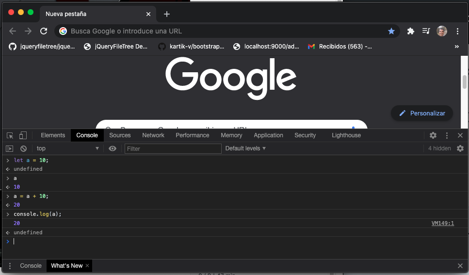
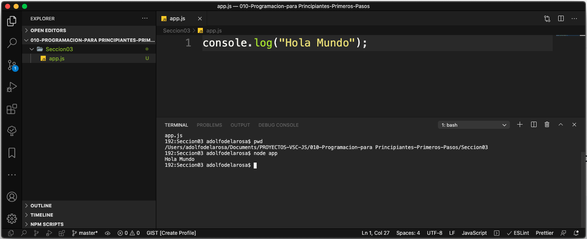
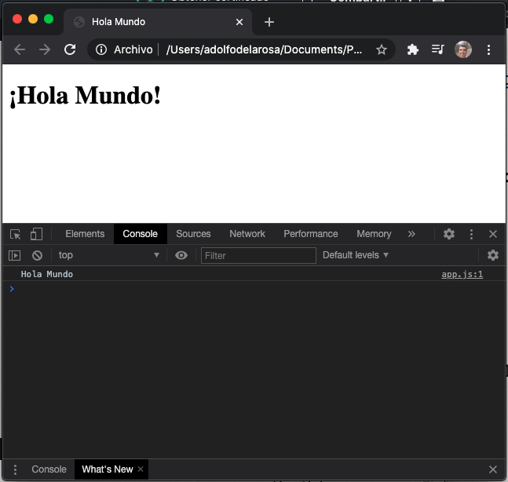
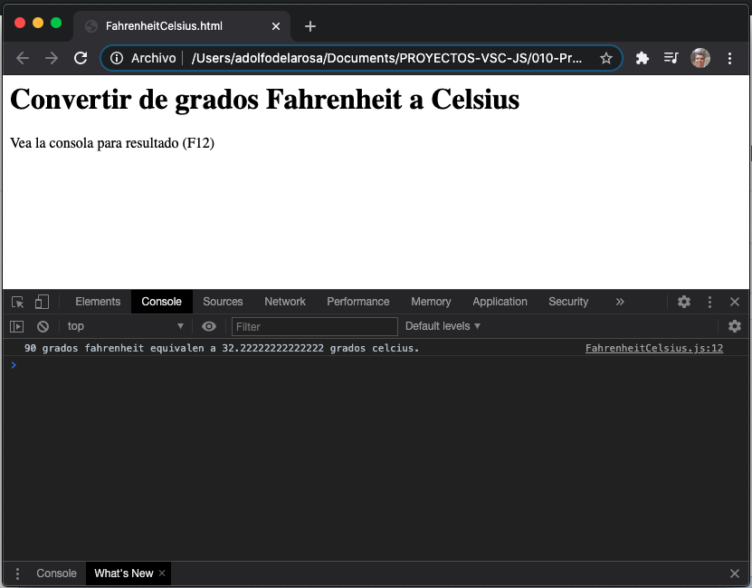

# 03 Primeros pasos en lógica y corriendo nuestro primer programa

## Introducción a la Sección

:+1:

## Lógica para Resolver Problemas

**Algoritmo**: Es un proceso ordenado y secuencial para resolver un problema.

**Variable**: Es el espacio en memoria donde podemos almacenar datos, estos datos pueden cambiar en el futuro.

```js
let a = 10;
a = a + 10; //El valor de a es 20
console.log( a );
```

## Instalaciones Necesarias para Seguir el Curso

Instalar Google Chrome

Instalar [Visual Studio Code](https://code.visualstudio.com/)

Instalar [Node](https://nodejs.org/es/)

Comprobar versión:

`node --version`

Instalar [TypeScript](https://www.typescriptlang.org/)

Comprobar versión:

`npm install -g typescript`

## Ejecutando Nuestro Primer Programa

Abrir **Google Chrome** y presionar **F12** para abrir las **Herramientas del Desarrollador**.

Ir a la pestaña **Consola** y escribir el siguiente código:

```js
let a = 10;
undefined
a
10
a = a + 10;
20
console.log(a);
20
undefined
```

**NOTA**: Cuando yo no inicializo el valor de una variable JS le asigna **undefined** (Aquí en la consola no sé por qué sale undefined)

La consola nos permite introducir código JS mientras vamos viendo lo que nos responde.



## Hola Mundo en JavaScript

Usando VSC, vamos a crear la carpeta **Seccion03** y dentro el archivo **app.js**, con el siguiente contenido:

`console.log('Hola Mundo!');`

Ya tenemos nuestro archivo JS, para ejecutarlo existen varias formas, en este caso lo ejecutaremos en la consola.

### Ejecutando Archivo JS con NODE.

Usando la consola de VSC, Git Bash o la consola de Windows y estando dentro de la carpeta **Seccion03** ejecutamos el comando:

```sh
node app
Hola Mundo!
```

Obsérvese que no es necesario poner la extensión **.js**

Nos aparece en la consola el mensaje que codificamos. Si tuviéramos un error se mostrara en la consola para que lo solucionemos.


 
## Ejecutar Nuestro Hola Mundo en una Página Web

En nuestra carpeta **Seccion03** vamos a crear el archivo **index.html** con el siguiente código:

```html
<html>
   <head>

   </head>
   <body>
      <h1>Hola Mundo!</h1>
   </body>
</html>
```

Y abrimos el archivo **index.html** con **Google Chrome**, vemos nuestro mensaje en el navegador.

Si también quisiera ver el mensaje en la consola del navegador tengo que hacer que se ejecute el JS desde mi HTML y esto lo hago así:

```html
<html>
   <head>

   </head>
   <body>
      <h1>Hola Mundo!</h1>
      <script src="app.js"></script>
   </body>
</html>
```



## Problema: Convertir de grados Fahrenheit a Celsius

La fórmula para hacer la conversión es la siguiente:
       
`C = ( F - 32 ) * 5/9`

## Tarea y resolución de la conversión

Crear archivos **FahrenheitCelsius.html** y **FahrenheitCelsius.js** para resolver el problema.

**FahrenheitCelsius.html**

```html
<html>
   <head>

   </head>
   <body>
      <h1>Convertir de grados Fahrenheit a Celsius</h1>
      <p>Vea la consola para resultado (F12)</p>
      <script src="FahrenheitCelsius.js"></script>
   </body>
</html>
```

**FahrenheitCelsius.js**

```js
/*
Convertir de grados Fahrenheit a Celsius
La formula para hacer la conversión es la siguiente:
    C = ( F - 32 ) * 5/9   
*/

let celcius;
let fahrenheit = 90;

celcius = (fahrenheit - 32 ) * ( 5 / 9);

console.log(fahrenheit + " grados fahrenheit equivalen a " + celcius + " grados celcius.");
```


