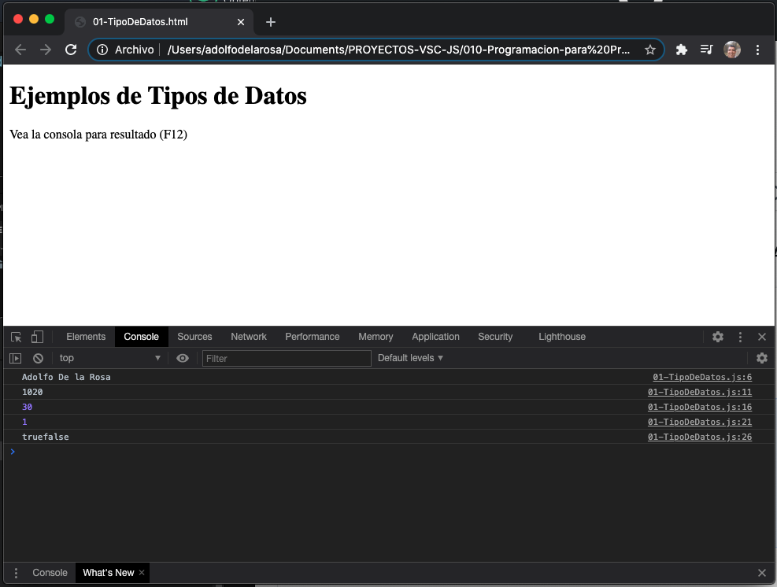
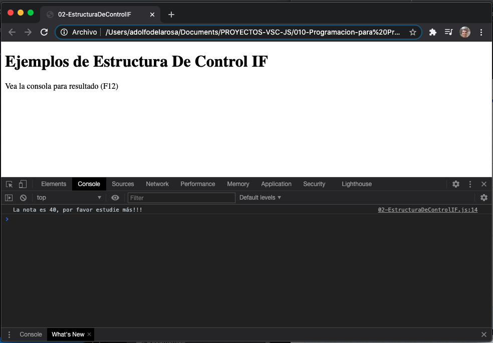
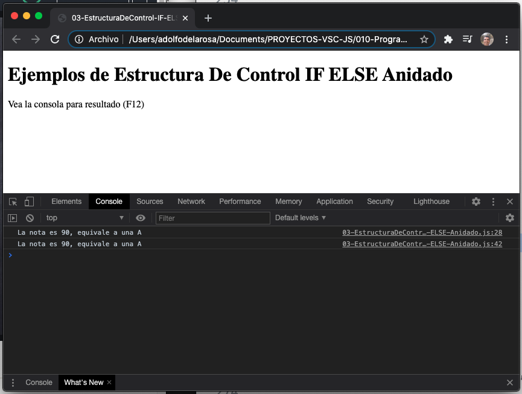
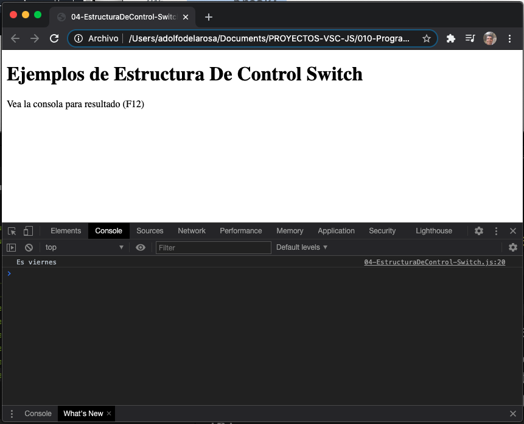

# 04 Tipos de datos y flujo de control

## Introducción a la Sección

:+1:

## Reglas para Nombrar Variables y Constantes

1. No podemos darle el nombre a una variable o constante, igual a una palabra reservada del lenguaje de programación.

   ```js
   let let = 20;  //error
   let letra = 20; //correcto
   ```

2. Puedes usar letras, números y guión bajo para definir tus variables y constantes. El nombre debe iniciar con una letra o guión bajo, el nombre de la variable no puede iniciar con un número.

   ```js
   let nombre1; //correcto
   let nombre1_; //correcto
   let _nombre1; //correcto
   let 1nombre; //incorrecto
   let nombre@; //incorrecto
   let _; //correcto
   ```
3. No puede contener caracteres especiales como:

   ```sh
   @ 	( 	~	# 	á	é	í	ó	ú	ñ	...
   ```

El **signo de dolar ($)** es permitido en el nombre de una variable.

```js
let $hola; //correcto
let hol@; //incorrecto
let adiós; //incorrecto
let o'conor; //incorrecto
let ca$a; //correcto
let año; //incorrecto
```

**Recomendaciones**: 

* Los nombres de las variables y constantes, deben de tener un nombre significativo de lo que almacenán.

* Usar notación **CamelCase**:

   ```js
   let nombreCompleto;
   let direccionCasa;
   ```

Existe dos tipos de **CamelCase**:

* **lowerCamelCase**, para nombres de variables
* **UpperCamelCase**, para nombres de clases.

## Tipos de Datos

* **Number**

   ```js
   let promedioNotas = 85;
   let promedioNotas : number = 85;  //TypeScript
   ```

* **String**

   ```js
   let nombre = 'Pepito el de los cuentos';
   let nombre = "Pepito el de los cuentos";
   let nombre : string = "Pepito el de los cuentos"; //TypeScript
   ```

* **Boolean**

   ```js
   let activo = true;
   let enfermo = false;
   let trabajador : boolean = true; //TypeScript
   
   let noActivo = false; // No se lee muy bien
   ```		

**Recomendación**: El nombre para una variable de tipo booleana debe de leerse en positivo.

## Ejemplo Práctico de Tipos de Datos

`01-TipoDeDatos.html`

```html
<!DOCTYPE html>
<html lang="en">
<head>
   <meta charset="UTF-8">
   <meta name="viewport" content="width=device-width, initial-scale=1.0">
   <title>01-TipoDeDatos.html</title>
</head>
<body>
   <h1>Ejemplos de Tipos de Datos</h1>
   <p>Vea la consola para resultado (F12)</p>
   <script src="01-TipoDeDatos.js"></script> 
</body>
</html>
```

`01-TipoDeDatos.js`

```js
let nombre = 'Adolfo';
let apellido = 'De la Rosa';

let nombreCompleto = nombre + ' ' + apellido;

console.log(nombreCompleto); // Imprime Adolfo de la Rosa

let a = '10';
let b = '20';

console.log( a + b); // Imprime 1020

let c = 10;
let d = 20;

console.log( c + d); // Imprime 30

let activo = true;
let despedido = false;

console.log(activo + despedido); // Imprime 1

let activo1 = 'true';
let despedido1 = false;

console.log(activo1 + despedido1); // Imprime truefalse
```



## Estructuras de Control - Decisiones

**Estructuras de Control**: Nos permiten poder decirle a la computadora, que acción tomar y qué camino seguir dependiendo de condiciones y/o decisiones.

1. **IF**, si se cumple una condición realiza ciertas tareas y si no se cumple puede realizar otras tareas diferentes:

   ```js
   IF (CONDICON){
	.....
   }

   IF (CONDICON){
	.....
   } ELSE {
	.....
   }
   ```

El if y else se pueden anidar, es decir en una condición if podemos realizar otro if else y así sucesivamente sin límite.

2. **SWITCH**, permite realizar múltiples decisiones de forma limpia y eficiente:

   ```js
   SWITCH(VARIABLE O EXPRESIÓN A EVALUAR)
      CASE 1: 
         'Hoy es lunes';
         BREAK;
      CASE 2: 
         'Hoy es martes';
         BREAK;
      CASE 3: 
         'Hoy es miércoles';
         BREAK;
      DEFAULT: 
         'Hoy empieza el fin de semana...' 
   ```

## Ejemplo Práctico de Estructuras de Control - IF

```js
/*
Crear un programa que, basado en la calificación de un alumno,
imprima si aprueba o no la materia.
* Aprueba a partir de 60, 
* Si tiene nota menor de 60 pero mayor de 50 diga "el alumno NO aprueba la asignatura"  
* Si tiene nota menor de 50, imprimir el mensaje "Por favor estudie más"
*/

let nota = 40;

if(nota >= 60) {
  console.log('La nota es ' + nota + ', el alumno aprueba la asignatura');
} else if(nota > 50) {
    console.log('La nota es ' + nota + ', el alumno NO aprueba la asignatura');
} else {
  console.log('La nota es ' + nota + ', por favor estudie más!!!');
}
```



## If Else Anidado

`03-EstructuraDeControl-IF-ELSE-Anidado.html`

```html
<!DOCTYPE html>
<html lang="en">
<head>
   <meta charset="UTF-8">
   <meta name="viewport" content="width=device-width, initial-scale=1.0">
   <title>03-EstructuraDeControl-IF-ELSE-Anidado</title>
</head>
<body>
   <h1>Ejemplos de Estructura De Control IF ELSE Anidado</h1>
   <p>Vea la consola para resultado (F12)</p>
   <script src="03-EstructuraDeControl-IF-ELSE-Anidado.js"></script>
    
</body>
</html>
```

`03-EstructuraDeControl-IF-ELSE-Anidado.js`

```js
/*
  Cree un algoritmo que permita determinar 
  la calificación de un alumno en letras.
  
  Si la nota se encuentra entre 90 a 100 = A
  Si la nota se encuentra entre 80 a  89 = B
  Si la nota se encuentra entre 70 a  79 = C
  Si la nota se encuentra entre 60 a  69 = D
  Si la nota es inferior a 60 = F

*/

let nota = 90;
let notaLetra = '';

if(nota >= 90 && nota <= 100) {
   notaLetra = 'A';
} else if(nota >= 80 && nota <= 89) {
   notaLetra = 'B';
} else if(nota >= 70 && nota <= 79) {
   notaLetra = 'C';
} else if(nota >= 60 && nota <= 69) {
   notaLetra = 'D';
} else {
   notaLetra = 'F';
}

console.log('La nota es ' + nota + ', equivale a una ' + notaLetra);

// Otra forma más reducida es
if(nota >= 90) {
   notaLetra = 'A';
} else if(nota >= 80) {
   notaLetra = 'B';
} else if(nota >= 70) {
   notaLetra = 'C';
} else if(nota >= 60) {
   notaLetra = 'D';
} else {
   notaLetra = 'F';
}
console.log('La nota es ' + nota + ', equivale a una ' + notaLetra);
```



## Switch

`04-EstructuraDeControl-Switch.html`

```html
<!DOCTYPE html>
<html lang="en">
<head>
   <meta charset="UTF-8">
   <meta name="viewport" content="width=device-width, initial-scale=1.0">
   <title>04-EstructuraDeControl-Switch</title>
</head>
<body>
   <h1>Ejemplos de Estructura De Control Switch</h1>
   <p>Vea la consola para resultado (F12)</p>
   <script src="04-EstructuraDeControl-Switch.js"></script>
</body>
</html>
```

`04-EstructuraDeControl-Switch.js`

```js
let dia = 5; // 0=domingo, 1=lunes, 2=martes...

switch ( dia ){
   case 0:
      console.log('Es domingo');
      break;
   case 1:
      console.log('Es lunes');
      break;
   case 2:
      console.log('Es martes');
      break;
   case 3:
      console.log('Es miércoles');
      break;
   case 4:
      console.log('Es jueves');
      break;
   case 5:
      console.log('Es viernes');
      break;
   case 6:
      console.log('Es sabado');
      break;
   default:
      console.log('Día indeterminado....');
}
```



## Ciclos o Loops

Nos permiten ejecutar las mismas líneas de código una y otra vez de forma consecutiva.

1. **WHILE**: Muy útil cuando no sabemos exactamente la cantidad de veces que necesitamos ejecutar el código.

   ```js
   while(CONDICION){
	.....
   }
   ```

2. **FOR**: Muy útil cuando sabemos exactamente la cantidad de veces que necesitamos ejecutar el código.

   ```js
   for(let variable = valorInicial; condición; incrementar variable){
	.....
   }

   for( let variable=1; variable <= 10; variable++){
	..... (SE EJECUTA 10 VECES)
   }
   ```


## Ejercicio práctico - ciclo while

```js
let gasolina = 100;

while (gasolina > 0){
   console.log('Gasolina restante: ' + gasolina);

   //gasolina = gasolina - 1;
   gasolina--;
}

console.log('Tanque vacío!!!');
```

## Ejercicio práctico - ciclo for

```js
// Imprimir la tabla de base
let base= 9;

//Limite
let limite = 5;

for (let i = 1; i <= limite; i++){
   let resultado = 2 *i;
   console.log(base + ' X ' + i + " = " + base * i);
}
```

## Código fuente de la sección

:+1:
