# 01. Introducción 32m

* 01.- Presentación 2:21 
* 02.- ¿Cómo mostrar las Chrome Developer Tools? 5:31 
* 03.- ¿Cómo acceder a las Chrome Developer Tools? 5:36 
* 04.- Paneles de Chrome DevTools 7:01 
* 05.- Modo Device 9:19 
* 06.- Resto del curso 2:40
* Contenido adicional 6

## 01.- Presentación 2:21 

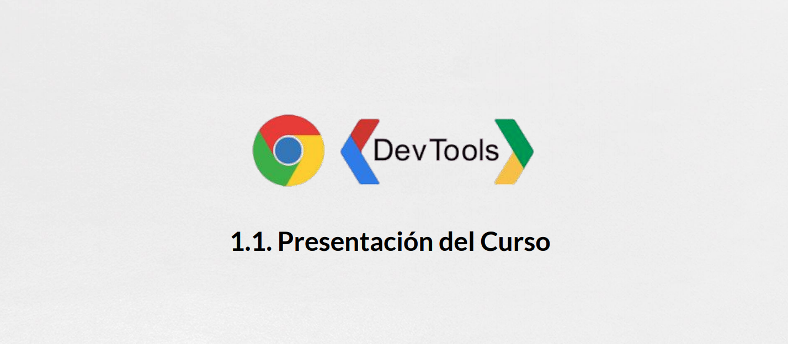
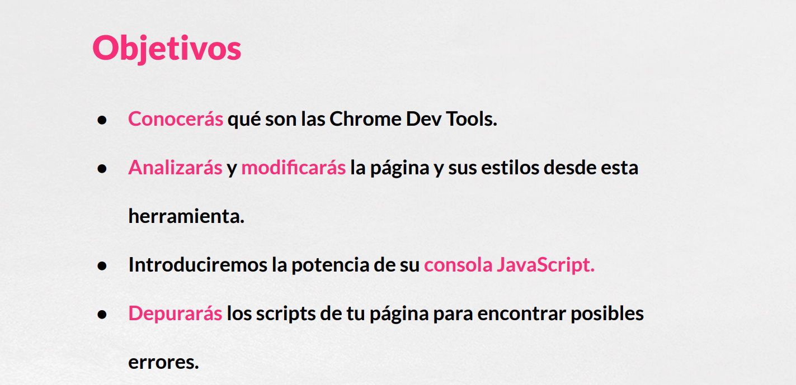
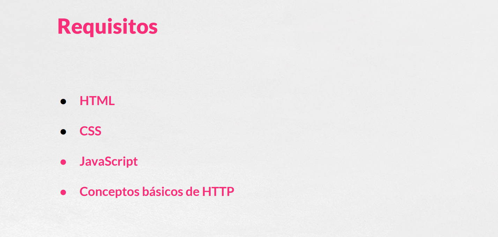
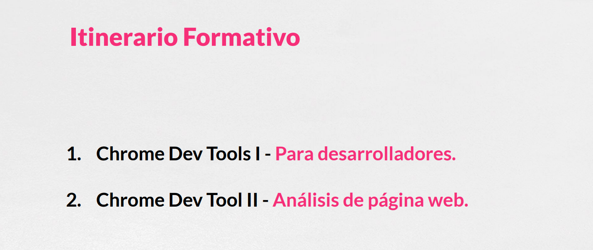

## 02.- ¿Cómo mostrar las Chrome Developer Tools? 5:31 

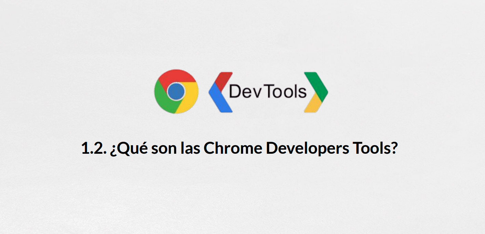

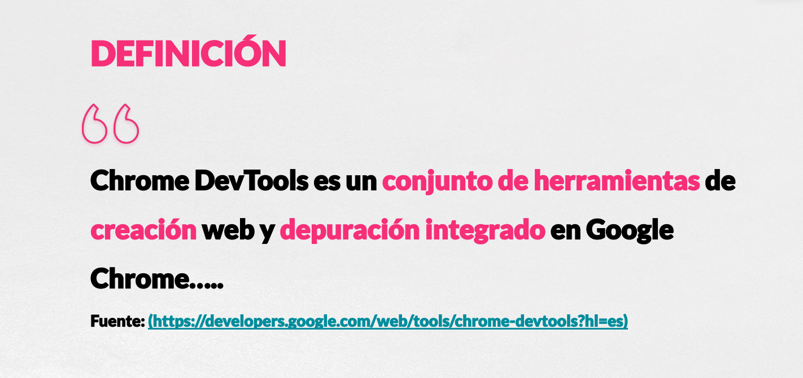
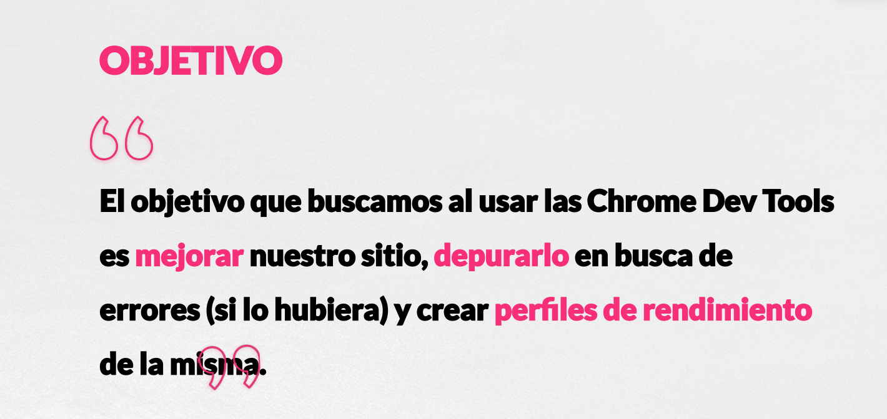
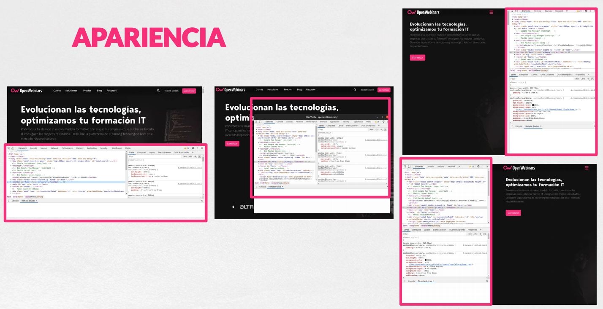
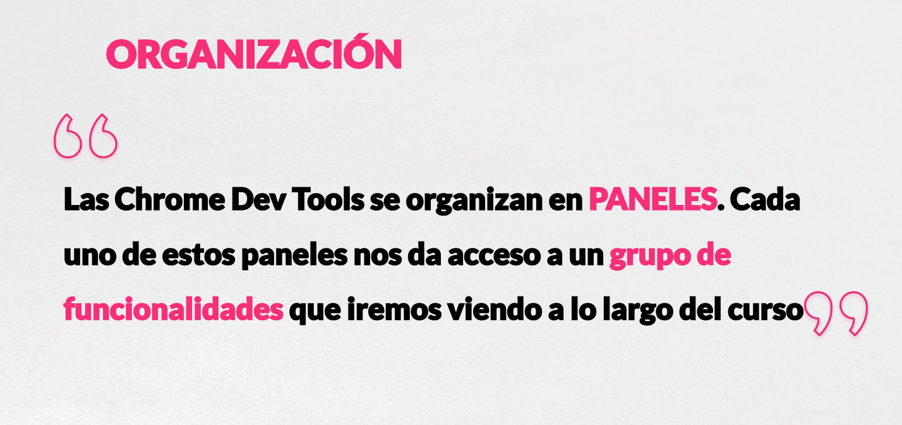
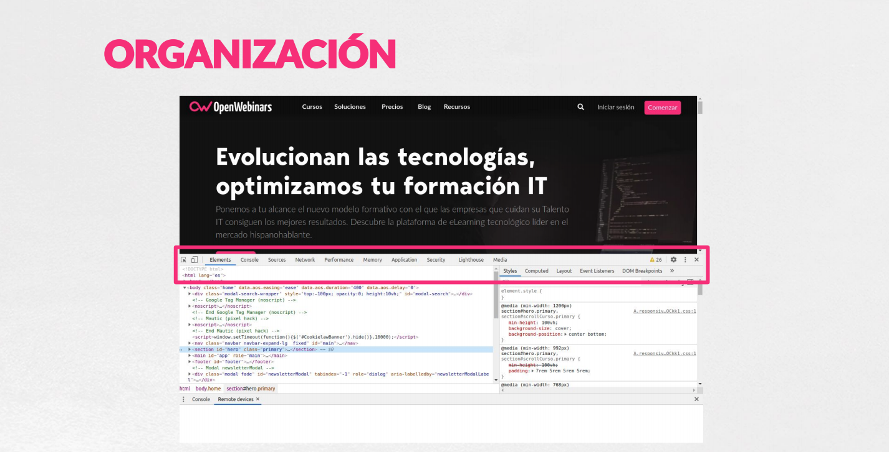
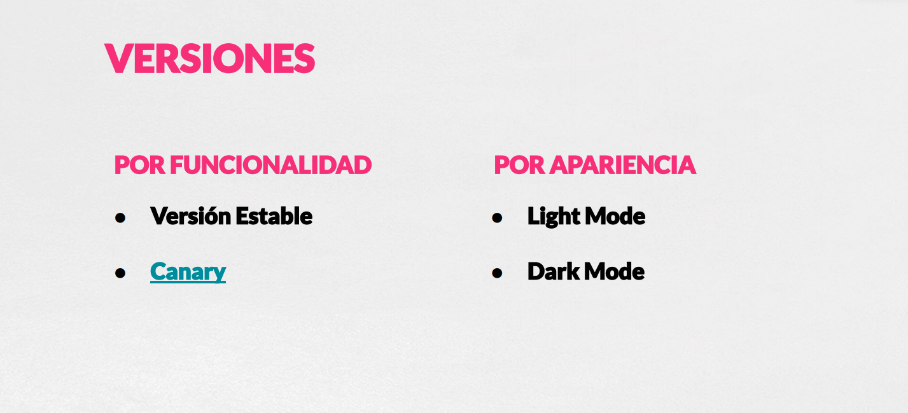

## 03.- ¿Cómo acceder a las Chrome Developer Tools? 5:36 
## 04.- Paneles de Chrome DevTools 7:01 
## 05.- Modo Device 9:19 
## 06.- Resto del curso 2:40
## Contenido adicional 6
