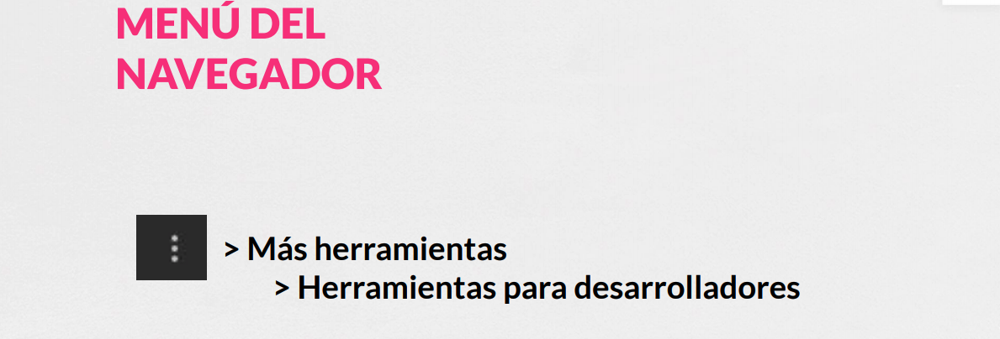
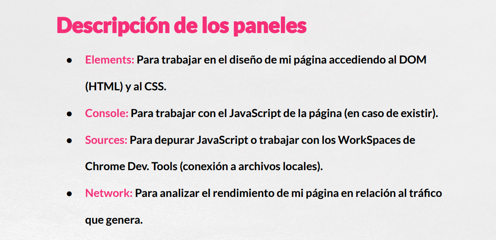
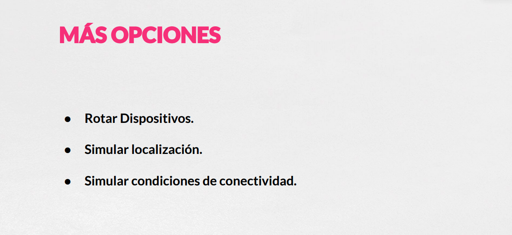

# 01. Introducción 32m

* 01.- Presentación 2:21 
* 02.- ¿Cómo mostrar las Chrome Developer Tools? 5:31 
* 03.- ¿Cómo acceder a las Chrome Developer Tools? 5:36 
* 04.- Paneles de Chrome DevTools 7:01 
* 05.- Modo Device 9:19 
* 06.- Resto del curso 2:40
* Contenido adicional 6

## 01.- Presentación 2:21 

## 02.- ¿Cómo mostrar las Chrome Developer Tools? 5:31 

Observamos los diferentes paneles que podemos tener.

La versión Google [Canary](https://www.google.com/intl/en/chrome/canary/?hl=es) es la versión experimental de Chrome que podemos descargar que suele traer las nuevas funcionalidades experimentales.

Podemos también mostrar las Herramientas de Desarrollo en Modo Ligth o Dark.

Para cambiar esta opción entramos a las Herramientas de Desarrollo con F12 y abromos las Preferencias (con el Icono del Engrane).

El orden y número de paneles depende de las diferentes versiones de Chrome para los diferentes sistemas operativos.

Podremos añadir otros paneles según nuestras necesidades.

## 03.- ¿Cómo acceder a las Chrome Developer Tools? 5:36 

## 04.- Paneles de Chrome DevTools 7:01 

## 05.- Modo Device 9:19

## 06.- Resto del curso 2:40

## Contenido adicional 6
