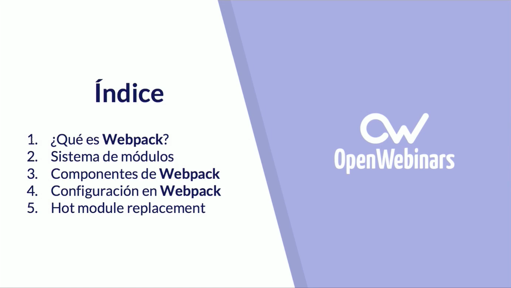

# 02 Conceptos Básicos :clock1: 64m

* 03 Introducción a Webpack :clock3: 9:19 
* 04 Instalación de Webpack :clock3: 10:24 
* 05 Primeros pasos: Generar un bundle :clock3: 9:33 
* 06 Nuestro primer `webpack.config` :clock3: 8:28 
* 07 ¿Cómo funciona Webpack? :clock3: 9:55 
* 08 Configuración múltiple :clock3: 5:21 
* 09 Práctica: Configuración múltiple :clock3: 10:19 
* 10 RETO: Instala y configura webpack en un proyecto personal :clock3: 1:00 

## 03 Introducción a Webpack :clock3: 9:19

### Resumen Profesor

#### ¿Qué es Webpack?

Webpack se define a si mismo como un ***Module Bundler***, pero gracias al sistema de plugins que ofrece tambien puede ser considerado como un ***Task Runner***. De tal modo que puede aunar el empaquedado de módulos y la posiblidad de ejecutar tareas como hacen otras librerias como Grunt o Gulp.

#### Sistema de módulos

En JS podemos encontrar los siguientes sistemas de módulos:

* AMD
* Commonjs
* ES2015

En Webpack podemos usarlos todos.

#### Componentes de Webpack

Web se compone de:

* Entry points
* Output
* Loaders
* Plugins

#### Configuración en Webpack

Webpack es conducido mediante ficheros de configuración. Aquí definiremos como transformar los assets, el tipo de output que vamos a generar y además configuraremos los plugins.

#### Hot Module Replacement (HMR)

Nos ofrece una interface para poder actualizar nuestros módulos sin necesidad de efectur una actualización completa de la página.

Webpack DevServer soporta HMR en hot mode.

### Transcripción

Bueno, vamos a empezar la sección de conceptos básicos y vamos a empezar viendo una introducción a Webpack, aquí vamos a ver un una visión general de todo lo que comprende Webpack. 

Vamos a ver el índice de los temas que vamos a tratar, vamos a ver que es Webpack evidentemente, hablaremos también de los sistemas de módulos y porque tienen relación con Webpack. Hablaremos de los componentes que tienen Webpack, de cómo se hace la configuración en Webpack y finalmente mencionaremos que es Hot Module Replacement - Reemplazo de Módulos en Caliente y como Webpack soporta esta técnica. 

Vamos a empezar con decir que es Webpack, **Webpack es un es un *Module Bundler* o un Empaquetador de Módulo, principalmente es es la tarea que hace**, pero gracias a los plugins, donde la comunidad puede ir desarrollando plugins y tú también puedes desarrollar tus propios plugins, hace las veces de ***Task Runner*** con lo cual puede hacer las mismas tareas que antes tenías que hacer con *Grunt o Gulp* o con librerias similares. 

Webpack básicamente funciona de la siguiente forma, con este gráfico vamos a explicar qué es lo que realmente resuelve Webpack. Cuando tenemos una aplicación en el front, tenemos muchos módulos, tenemos módulos en javascript, podemos tener de archivos SASS, archivos CSS, archivos de imágenes, videos, fuentes son muchas cosas que tenemos que empaquetar de alguna forma, entonces aquí en donde entra Webpack. Webpack va recorriendo todos estos módulos a partir de unos unos puntos de entradas que nosotros especificamos, y a través de aquí, va generando un ***árbol de dependencias*** para ir empaquetando todos estos módulos y al final generar ***asserts*** que el navegador puede entender, como pueden ser archivos JS, archivos CSS, imágenes en las diferentes extensiones JPG, PNG, pasando del esquema de la izquierda que son todos los módulos con todas las dependencias, a un esquema que el navegador intérprete y pueda ejecutar. 

Ahora vamos a hablar de los sistemas de módulos, Webpack al ser un empaquetado de módulos tienen que soportar diferentes sistemas de módulos, entonces qué sistemas de módulos existen, cuales son los más comunes, los que se utilizan en javascript.

El principal, el que se ha utilizado durante mucho tiempo ha sido **AMD** que es una definición de módulos asíncrona, y la librería que implementaba este sistema de módulos y qué más se ha utilizado ha sido **RequiredJS** que hasta hace muy poco todavía se utilizaba. 

También teníamos **CommondJS** que es otro sistema de definir módulos, que es el que utiliza **NodeJS** y luego tenemos la nueva definición de la última especificación **ES2015** que personalmente es la que yo utilizo en mis proyectos. 

Aquí, vamos a ver un ejemplo de cómo sería un módulo definido por **AMD** donde definimos el módulo, aquí estamos utilizando la implementación de **RequiredJS**, es muy similar porque la especificación de AMD especifica que los módulos se define así, y abajo se usaría, definimos un módulo y lo estaremos usando como dependencia. 

En **CommondJS**, pues es similar, pero utilizamos el `require` esto es como, como funciona NodeJS y cómo se van trayendo las dependencias.

Y en el sistema de módulos de la nueva especificación **ES2015**, es como exportábamos una función y aquí la estamos importando hasta esta ruta y luego pues podemos usarlas. 

El Webpack soporta todos los sistemas de módulos, podemos ir alternando entre ellos, utilizan solo 1, realmente todo esto es transparente y Webpack es el que se va a encargar de procesarlo y de transformarlo a algo que el navegador puede entender, porque estos sistemas de módulos, el navegador por defecto no los entiendo, hay algunas implementaciones ya que los últimos navegadores ya empiezan a soportar todas las funcionalidades que ofrece ES6 ya empiezan a soportar, pero AMD y CommonJS no son soportadas por defecto por el navegador, con lo cual Webpack cómo lo soporta podemos utilizarlo en nuestros proyecto y se va a encargar de transformarlos.

Vamos a hablar ahora de los de los Componentes que tiene Webpack.

Empieza todo con los **Entry Points** que son los puntos de entrada donde vamos a especificar nuestro Bootstrap de la aplicación por así decirlo y aquí donde vamos a ir importando los diferentes módulos que vayamos necesitando y aquí es donde Webpack empezara a construir ese grafo de dependencias para generar lo que se conoce como un **Output** que es simplemente el resultado de empaquetar todos esos módulos, puede ser un fichero que comúnmente se llama `Bundler.JS` o pueden ser varios ficheros cosas más avanzadas que ya veremos. 

Después tenemos los **Loaders** que son transformaciones que vamos aplicando sobre los Entry Points o sobre los módulos. 

Luego tenemos los **Plugins** que hacen lo que los Loaders no pueden hacer, van accediendo a todos los estados de la compilación de Webpack y podemos ir haciendo tareas de cualquier cosa, de clean, de generar asserts nuevos, infinidad de cosas que antes normalmente teníamos que utilizar Grunt o Gulp y ahora podemos hacerlo con los Plugins.

La configuración en Webpack es uno de los apartados más importantes y es con lo que vamos a estar trabajando en este curso.

Webpack es ***Configuration Driver*** o sea, es Conducido por la Configuración, vamos a ver en algunos ejemplos en los que es posible ejecutar Webpack sin necesidad de utilizar la configuración, pero no es recomendable realmente esto solo se utiliza este juguete simplemente se utiliza para arreglar un poco realmente para para sacar del poder a guapa necesitamos utilizar la configuración. Aquí es donde vamos a definir cómo se transforma el set el tipo de auto que se va a generar configurarlo. Aquí, bueno, vemos un ejemplo de un archivo de configuración y bueno, empezamos a ver cosas interesantes que hemos estado hablando tenemos otro sea que hoy no sea que definidos tenemos los Output Aquí, estamos cargando unos flooders esta síntesis ya lave iremos viendo y ya no sonará a medida que hagamos todos los tiempos y, bueno, aquí cargamos pagamos plus. Finalmente, bueno, vamos a hablar de de hotmail así las horas RR. Los conceptos de wordpad al simplemente complementa lo implementa y nos permite sacar las ventajas Del. Básicamente es una de las características más útiles porque nos permite actualizar nuestros módulos en tiempo de ejecución sin necesidad de tener que efectuar un refresco total de la página que esto es muy útil porque conservamos este nos ayuda a conservar todo el estado sin necesidad de tener que actualizarlo entero. Que los encuentros ventajas pues lo que ya conviven este es el estado de la nación nos ahorra tiempo, ya que los actualizalo cambiado lo tenemos que volver a actualizar y a generar toda la aplicación de nuevo las modificaciones en Jss tienen efecto inmediato encargado estuviésemos programas todo el mando. Web del Server implementa bueno, no implementó soporta realmente NRN Hot modelos como ya veremos cómo activar este este modo y aprendemos a configurarlo este curso. En resumen En resumen web para que su nervioso de módulos y además puede ser usado como tratamiento de tareas no como hace las veces que hace las veces que hace las veces que. También pasa todo pasa a través de todo el código para crearse debajo de su estado hablando estado hablando. 15. Es conducido por configuración por fichero de configuración se compone de entries del low desde plugins. Las cosas que nos están dando y su porta. Mediante. 
## 04 Instalación de Webpack :clock3: 10:24 
## 05 Primeros pasos: Generar un bundle :clock3: 9:33 
## 06 Nuestro primer `webpack.config` :clock3: 8:28 
## 07 ¿Cómo funciona Webpack? :clock3: 9:55 
## 08 Configuración múltiple :clock3: 5:21 
## 09 Práctica: Configuración múltiple :clock3: 10:19 
## 10 RETO: Instala y configura webpack en un proyecto personal :clock3: 1:00 
