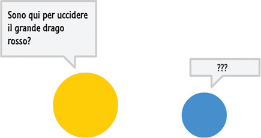
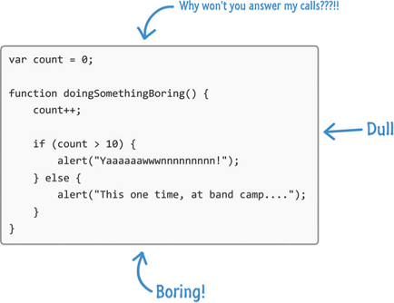

# Introducción

¿Alguna vez ha intentado aprender a leer, hablar o escribir en un idioma diferente al que conoció cuando creció? Si fueras como yo, tus primeros intentos probablemente se parecían a lo siguiente:

A menos que seas Jason Bourne (o Roger Federer), apenas sobreviviste aprendiendo tu primer idioma. Esto se debe a que aprender idiomas es difícil. No importa si está aprendiendo su primer idioma o un segundo o tercer idioma. Ser bueno en un idioma hasta el punto de ser útil de una manera no cómica requiere mucho tiempo y esfuerzo.

Requiere comenzar con lo básico. Requiere mucha práctica y paciencia. Es una de esas pocas áreas en las que realmente no hay atajos para convertirse en un experto.

## ¿JAVASCRIPT PARLEZ-VOUS?

Aprender con éxito un lenguaje de programación es muy similar a cómo abordaría el aprendizaje de un lenguaje del mundo real. Empiece con lo básico. Una vez que se ha vuelto bueno en eso, pasa a algo un poco más avanzado. Todo este proceso sigue repitiéndose y nunca termina realmente. Ninguno de nosotros deja de aprender realmente. Solo requiere comenzar en alguna parte. Para ayudarlo con la parte de “comenzar en alguna parte” es donde entra este libro. Este libro está lleno de principio a fin con todo tipo de cosas buenas (y divertidas, ¡espero!) Para ayudarlo a aprender JavaScript.

Ahora, odio decir algo malo sobre un lenguaje de programación a sus espaldas, pero JavaScript es bastante aburrido y aburrido:

No hay otra forma de describirlo. A pesar de lo aburrido que puede ser JavaScript, no significa que aprenderlo también tenga que ser aburrido. (Para su información: todos los errores gramaticales se colocan de manera cuidadosa y deliberada, ¡la mayoría de las veces!) A medida que avanza en el libro, es de esperar que el lenguaje y las ilustraciones muy informales sean informativos y entretenidos (¡infoentretenimiento!).

Toda esta casualidad y diversión se equilibra con una amplia cobertura de todas las cosas interesantes que necesita saber sobre JavaScript para mejorar su uso.

Para cuando llegue al último capítulo, estará preparado para enfrentar casi cualquier desafío relacionado con JavaScript de frente sin sudar.

