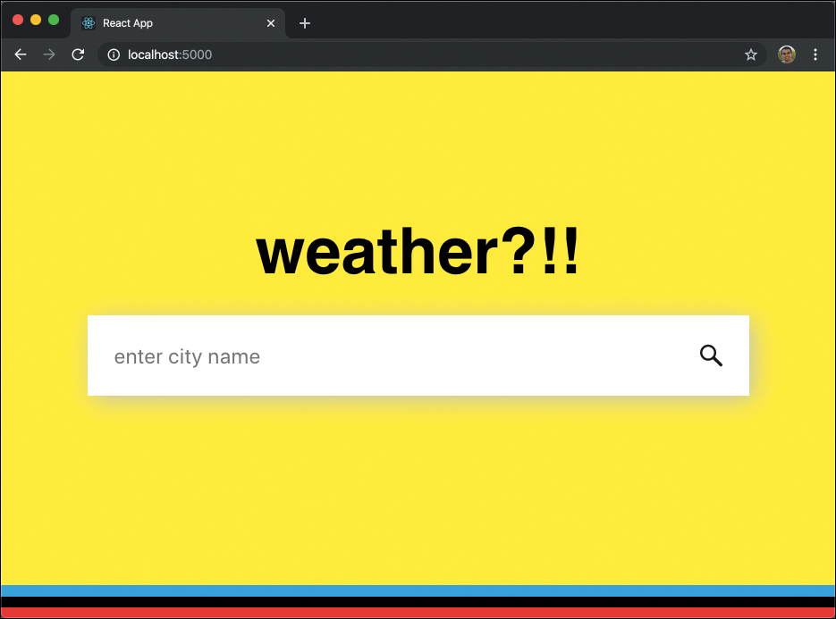
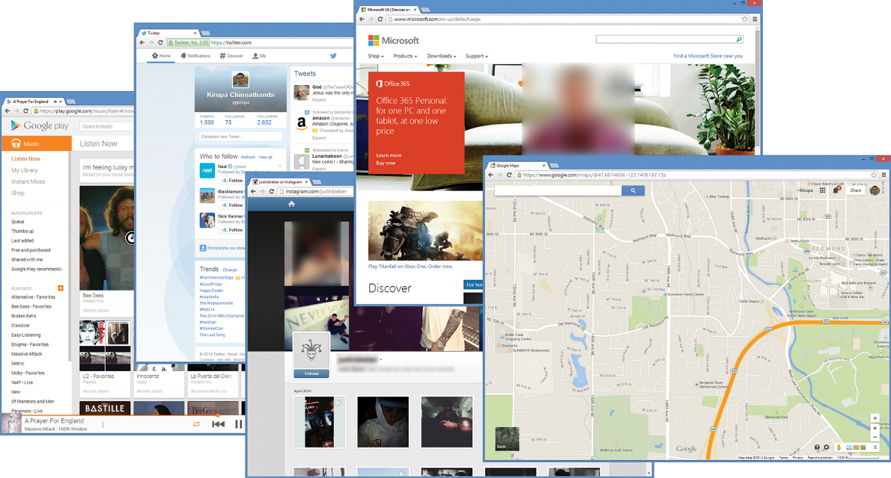
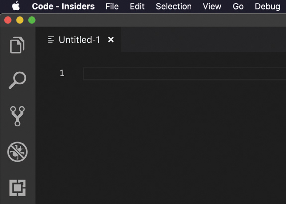
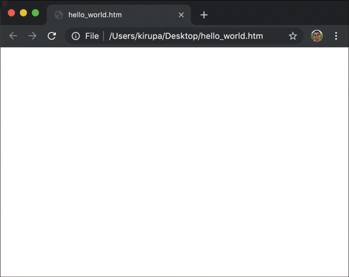
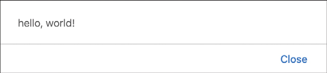
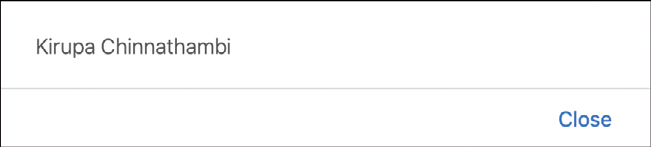

# 1. Hello, World!

* What Is JavaScript?
* Hello, World!
* Looking at the Code: Statements and Functions


### En este capítulo

* Descubra por qué JavaScript es fantástico
* Mojarse los pies creando un ejemplo sencillo
* Obtenga una vista previa de lo que puede esperar en los capítulos siguientes

HTML se trata de mostrar cosas. CSS se trata de hacer que las cosas se vean bien. Entre los dos, puede crear algunas cosas bastante ingeniosas como el ejemplo del clima que puede ver en http://bit.ly/kirupaWeather. La Figura 1.1 muestra cómo se ve este ejemplo del clima.



FIGURA 1.1 *Un ejemplo de clima colorido que destaca un diseño diseñado completamente usando solo CSS*.

A pesar de lo ingeniosos que parecen los sitios construidos usando solo CSS y HTML, serán bastante estáticos. No se adaptan ni reaccionan a lo que estás haciendo. Con esos dos, es casi como ver una repetición de un gran episodio de Seinfeld una y otra vez. Es divertido por un tiempo, pero eventualmente se vuelve aburrido. Hoy en día, la Web no es estática. Los sitios que usa con frecuencia (como los de la Figura 1.2) tienen un cierto nivel de interactividad y personalización que va mucho más allá de lo que HTML y CSS pueden proporcionar por sí mismos.



FIGURA 1.2 *Ejemplos de varios sitios web que dependen en gran medida de JavaScript para su correcto funcionamiento.*

Para que su contenido cobre vida, necesitará ayuda externa. ¡Lo que necesitas es JavaScript!

## ¿QUÉ ES JAVASCRIPT?

JavaScript es un lenguaje de programación moderno que es un par de HTML y CSS. En pocas palabras, le permite agregar interactividad a su documento. Una breve lista de cosas que puede hacer con JavaScript incluye:

* Escuche eventos como un clic del mouse y haga algo.
* Modifique el HTML y CSS de su página después de que se haya cargado.
* Haz que las cosas se muevan por la pantalla de formas interesantes.
* Crea juegos increíbles que funcionen en el navegador como Cut the Rope.
* Comunicar datos entre el servidor y el navegador.
* Le permite interactuar con una cámara web, un micrófono y otros dispositivos.

....¡y mucho más! La forma en que escribe JavaScript es bastante simple, algo así. Juntas palabras que a menudo se parecen al inglés de todos los días para decirle a tu navegador qué hacer. El siguiente ejemplo muestra un JavaScript antiguo y recién salido del horno:

```js
let defaultName = "JavaScript";

function sayHello(name) {
  if (name == null) {
    alert("Hello, " + defaultName + "!");
  } else {
    alert("Hello, " + name + "!");
  }
}
```

No se preocupe si no sabe lo que eso significa. Solo preste atención a cómo se ve el código. Observe que ve muchas palabras en inglés como function, if, else, alert, name. Además de las palabras en inglés, también tiene muchos símbolos y caracteres extraños de las partes de su teclado que probablemente nunca notará. Pronto los notará mucho y también comprenderá completamente lo que hace todo en este código.

De todos modos, esa es suficiente información de fondo por ahora. Si bien esperaría que ahora proporcione un historial de JavaScript y las personas y empresas detrás de hacerlo funcionar, no voy a aburrirlo con cosas como esa. En cambio, quiero que se ensucie las manos escribiendo algo de JavaScript. Al final de este tutorial, quiero que haya creado algo dulce y simple que muestre algo de texto en su navegador.

¡HOLA MUNDO!
En este momento, es posible que no se sienta un poco preparado para comenzar a escribir código. Esto es especialmente cierto si no está muy familiarizado con la programación en general. Como pronto descubrirá, JavaScript no es tan molesto y complicado como a menudo pretende ser. Empecemos.

Sugerencia de imagen

Se necesita familiaridad básica con el desarrollo web Para comenzar a escribir JavaScript, debe tener una familiaridad básica con la creación de una página web, el uso de un editor de código y la adición de algo de HTML y CSS. Si no está muy familiarizado con los conceptos básicos en torno a esto, le animo a que lea primero el capítulo Cómo crear su primera página web. Eso lo preparará muy bien para lo que verá a continuación.

El documento HTML
Lo primero que necesita es un documento HTML. Este documento albergará el JavaScript que estará escribiendo. Inicie su editor de código favorito. Si no tiene uno, le animo a que utilice Visual Studio Code. Una vez que haya iniciado su editor de código favorito, siga adelante y cree un nuevo archivo. En Visual Studio Code, verá una pestaña que dice Sin título similar a la captura de pantalla de la Figura 1.3.



FIGURA 1.3

Pestaña Untitled-1 en Visual Studio Code.

Guarde este archivo recién creado yendo a Archivo | Ahorrar. Se le pedirá que le dé un nombre a este archivo y especifique dónde le gustaría guardarlo. Asigne a este archivo el nombre hello_world.htm y guárdelo en su escritorio. Una vez que haya guardado este archivo, agregue el siguiente HTML en él:

Haga clic aquí para ver la imagen del código

```js
```
<! DOCTYPE html>
<html>

<cabeza>
  <meta charset = "utf-8">
  <title> Aquí va un título interesante </title>

  <estilo>

  </style>
</head>

<cuerpo>
  <script>

  </script>

</body>

</html>
Una vez que haya agregado este HTML, guarde su documento para confirmar estos cambios. Es hora de echar un vistazo a cómo se ve nuestra página en nuestro navegador.

En el Explorador de archivos o en el Finder, navegue hasta su Escritorio para py haga doble clic en hello_world.htm. Verá aparecer su navegador predeterminado y mostrar el nombre de este archivo. Debería ver algo parecido a lo que se muestra en la Figura 1.4.



FIGURA 1.4

Pestaña titulada en Visual Studio Code.

Si todo salió bien, ¡debería ver una página en blanco! No, no hay nada de malo aquí. Si bien nuestra página tiene contenido, no hay nada visible. Eso está bien, lo arreglaremos en breve. La clave para hacer esta corrección es volver a su editor de código y concentrarse en la etiqueta <script> que ve en la parte inferior de su HTML:

  
```js
```  
<script>

</script>
La etiqueta de secuencia de comandos actúa como un contenedor donde puede colocar cualquier JavaScript que desee ejecutar dentro de él. Lo que queremos hacer es mostrar las palabras ¡hola, mundo! en un cuadro de diálogo que aparece cuando carga su página HTML. Para que esto suceda, dentro de la región de su script, agregue la siguiente línea:

Haga clic aquí para ver la imagen del código

```js
```
  
<script>
  alert ("¡hola, mundo!");
</script>
Guarde su archivo HTML y ejecútelo en su navegador. Observe lo que verá una vez que su página se haya cargado. Debería ver aparecer un cuadro de diálogo que se parece a la Figura 1.5.


  
FIGURA 1.5

Su cuadro de diálogo Hola mundo debería verse así.

Si este es su primer intento de escribir JavaScript, ¡enhorabuena! Ahora, veamos lo que acaba de hacer.

MIRANDO EL CÓDIGO: DECLARACIONES Y FUNCIONES
Acaba de escribir una declaración de JavaScript muy simple. Una declaración es un conjunto lógico de instrucciones que le indican a su navegador qué hacer. Una aplicación típica tendrá muchas MUCHAS declaraciones. En nuestro caso, solo tenemos uno:

Haga clic aquí para ver la imagen del código

```js
```  
alert ("¡hola, mundo!");
Puede darse cuenta de que algo es una declaración mirando el último carácter que contiene. Por lo general, es un punto y coma (;) como lo que ve aquí.

Dentro de una declaración, verá todo tipo de jerga JavaScript cobarde. Nuestro código, a pesar de ser solo una línea, no es una excepción. Tienes una cosa extraña llamada alerta que hace acto de presencia. Este es un ejemplo de una palabra inglesa común que se comporta de manera similar en el mundo de JavaScript. Se encarga de llamar su atención mostrando algún texto.

Para ser más precisos, la palabra alerta es algo que se conoce como función. Utilizará funciones todo el tiempo; una función es básicamente un fragmento de código reutilizable que hace algo. El "algo" que hace podría ser definido por usted, definido por alguna biblioteca de terceros que esté utilizando, o podría ser definido por el propio marco de JavaScript. En nuestro caso, el código que le da a su función de alerta la habilidad mágica de mostrar un diálogo con un mensaje que le pasa vive en lo profundo del navegador. Todo lo que realmente necesita saber es que si desea utilizar la función de alerta, simplemente llámela y pase el texto que desea que se muestre. Todo lo demás está cuidado por ti.

Volviendo a nuestro ejemplo, el texto que desea mostrar es ¡hola, mundo! Y observe cómo lo estoy especificando. Envuelvo las palabras entre comillas:

Haga clic aquí para ver la imagen del código
```js
```
<script>
  alert ("¡hola, mundo!");
</script>
Siempre que se trate de texto (más comúnmente conocido como cadenas), siempre lo envolverá entre comillas simples o dobles. Sé que parece extraño, pero cada lenguaje de programación tiene sus propias peculiaridades. Esta es una de las muchas peculiaridades que verá a medida que explore JavaScript. Veremos las cadenas con mayor detalle en breve; por ahora, solo disfruta de la vista.

Vayamos un paso más allá. En lugar de mostrar hola, mundo !, cambie el texto que está mostrando para decir su nombre y apellido. Aquí hay un ejemplo de cómo se ve mi código cuando uso mi nombre:

Haga clic aquí para ver la imagen del código
```js
```
<script>
  alerta ("¡Kirupa Chinnathambi!");
</script>
Si ejecuta su aplicación, verá que su nombre aparece en el cuadro de diálogo (Figura 1.6).


  
FIGURA 1.6

El cuadro de diálogo ahora muestra su nombre.

Bastante sencillo, ¿verdad? Puede reemplazar el contenido de su cadena con todo tipo de cosas: el nombre de su mascota, su programa de televisión favorito, etc., JavaScript lo mostrará.

El Mínimo Absoluto

En este tutorial, creó un ejemplo simple que lo ayudó a familiarizarse con la escritura de código JavaScript. Como parte de familiarizarte, te lancé muchos conceptos y términos. Ciertamente, no espero que los conozca o los recuerde a todos ahora. En futuros tutoriales, seleccionaremos cada parte interesante de lo que ha visto hasta ahora y la explicaremos con más detalle. Después de todo, estoy bastante seguro de que eventualmente querrás hacer cosas en JavaScript que vayan más allá de mostrar texto de una manera ridículamente molesta usando un cuadro de diálogo.

En el futuro, al final de cada capítulo, es posible que incluso vea un conjunto de enlaces a recursos externos escritos por mí o por otras personas. Estos recursos le brindarán más detalles o una perspectiva diferente sobre lo que aprendió, junto con oportunidades para poner en práctica su aprendizaje con ejemplos más complejos. Piense en lo que ve en este libro como un punto de partida para cosas más grandiosas y asombrosas.

Si tiene alguna pregunta sobre el contenido aquí, publique en los foros en https://forum.kirupa.com para obtener ayuda realmente rápida tanto de mí como de algunos de los desarrolladores más geniales de la web.
```js
```
