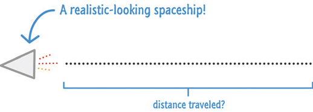
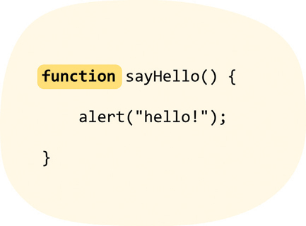
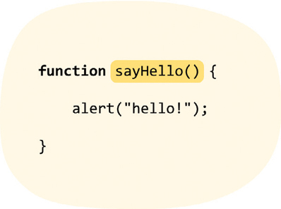
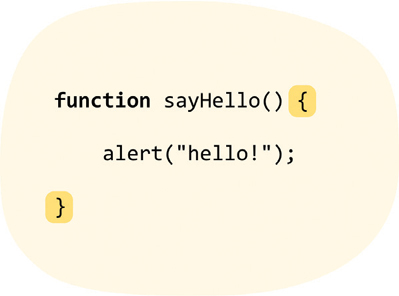
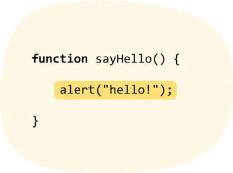
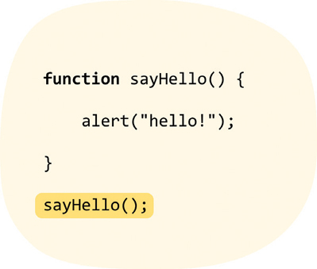
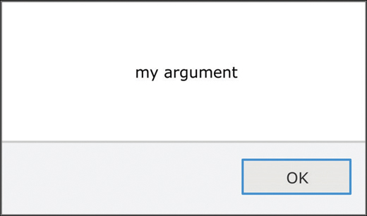
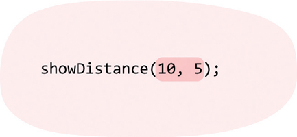
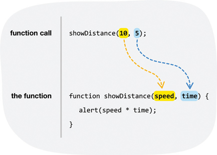
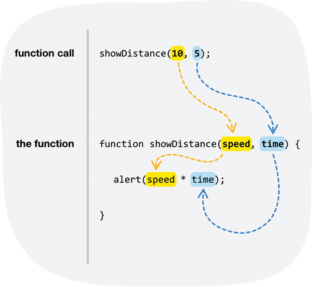

# 3. Functions

* What Is a Function?
* A Simple Function
* Creating a Function that 
* Takes Arguments
* Creating a Function that Returns Data


En este capítulo

* Descubra cómo las funciones le ayudan a organizar y agrupar mejor su código
* Comprenda cómo las funciones hacen que su código sea reutilizable
* Descubrir la importancia de los argumentos de función y cómo usarlos.

Hasta ahora, todo el código que hemos escrito realmente no contenía estructura. Estaba simplemente ... allí:

```js
alert("hello, world!");
```

No hay nada de malo en tener un código como este. Esto es especialmente cierto si nuestro código se compone de una sola declaración. La mayoría de las veces, sin embargo, ese nunca será el caso. Nuestro código rara vez será tan simple cuando usamos JavaScript en el mundo real para cosas del mundo real.

Para resaltar esto, digamos que queremos mostrar la distancia que ha viajado algo (Figura 3.1).



**FIGURA 3.1** *Distancia viajada.*

Si recuerda de la escuela, la distancia se calcula multiplicando la velocidad que algo ha viajado por el tiempo que tomó (Figura 3.2).


**FIGURA 3.2** *Calculando la distancia.*

La versión de JavaScript de eso se verá de la siguiente manera:

```js
let speed = 10;
let time = 5;
alert(speed * time);
```

Tenemos dos variables llamadas `speed` velocidad y `time` tiempo, y cada una almacena un número. La función `alert` muestra el resultado de multiplicar los valores almacenados por las variables `speed` y `time`. Esta es una traducción bastante literal de la ecuación de distancia que acabamos de ver.

Supongamos que queremos calcular la distancia para obtener más valores. Usando solo lo que hemos visto hasta ahora, nuestro código se vería de la siguiente manera:

```js
let speed = 10;
let time = 5;
alert(speed * time);

let speed1 = 85;
let time1 = 1.5;
alert(speed1 * time1);

let speed2 = 12;
let time2 = 9;
alert(speed2 * time2);

let speed3 = 42;
let time3 = 21;
alert(speed3 * time3);
```

No sé ustedes, pero esto parece **terrible**. Nuestro código es innecesariamente detallado y repetitivo. Como vimos anteriormente cuando estábamos aprendiendo sobre variables, la repetición hace que nuestro código sea más difícil de mantener y también nos hace perder el tiempo.

Todo este problema se puede resolver muy fácilmente usando lo que veremos mucho aquí, **funciones**:

```js
function showDistance(speed, time) {
  alert(speed * time);
}
showDistance(10, 5);
showDistance(85, 1.5);
showDistance(12, 9);
showDistance(42, 21);
```

No se preocupe demasiado por lo que hace este código todavía. Solo sepa que este fragmento de código más pequeño hace todo lo que todas esas líneas de código hicieron antes sin todos los efectos secundarios negativos. Aprenderemos todo sobre las funciones y cómo hacen todas las cosas interesantes que hacen, comenzando ... ahora mismo ... ¡ahora!

¡Adelante!

## ¿QUÉ ES UNA FUNCIÓN?

En un nivel muy básico, una función no es más que un contenedor para algún código. Una función básicamente:

* Agrupa sentencias juntas
* Hace que su código sea reutilizable

Rara vez escribirá o utilizará código que no implique funciones, por lo que es importante que se familiarice con ellas y aprenda todo sobre su funcionamiento.

## UNA FUNCION SIMPLE

La mejor manera de aprender sobre las funciones es sumergirse y comenzar a usarlas, así que comencemos creando una función muy simple. Crear una función no es muy emocionante. Solo requiere comprender algunas pequeñas peculiaridades sintácticas, como usar paréntesis y corchetes extraños.

A continuación se muestra un ejemplo de cómo se ve una función muy simple:

```js
function sayHello() {
   alert("hello!");
}
```

Sin embargo, no basta con tener una función definida. Nuestra función necesita ser llamada, y podemos hacerlo agregando la siguiente línea después:

```js
function sayHello() {
   alert("hello!");
}
sayHello();
```

Para ver todo esto por ti mismo, crea un nuevo documento HTML (llámalo **`functions_sayhello.htm`**) y agrega lo siguiente:

```js
<!DOCTYPE html>
<html>

<head>
   <meta charset="utf-8">
   <title>Say Hello!</title>

   <style>

   </style>
</head>

<body>
   <script>
      function sayHello() {
         alert("hello!");
      }
      sayHello();
   </script>
</body>

</html>
```

Si escribió todo esto y obtuvo una vista previa de su página en su navegador, verá **hello!** desplegado. Lo único que necesita saber ahora es que nuestro código funciona. A continuación, veamos por qué funciona el código dividiendo la función `sayHello` en fragmentos individuales y analizándolos con mayor detalle.

En primer lugar, vemos la palabra clave `function` iniciando las cosas como en la Figura 3.3.



**FIGURA 3.3** *La palabra clave de la `function`.*

Esta palabra clave le dice al motor de JavaScript que se encuentra en lo más profundo de su navegador que trate todo este bloque de código como algo que tiene que ver con funciones.

Después de la keyword `function`, especificamos el nombre de la función seguido de algunos paréntesis de apertura y cierre, `()` como en la Figura 3.4.



**FIGURA 3.4** *El nombre de la función y los paréntesis.*

Completando nuestra declaración de función están las llaves de apertura y cierre que encierran cualquier declaración que podamos tener adentro (Figura 3.5).



**FIGURA 3.5** *Las llaves de apertura y cierre.*

Lo final es el contenido de nuestra función: las sentencias que hacen que nuestra función sea realmente funcional (Figura 3.6).



**FIGURA 3.6** *El contenido de la función.*

En nuestro caso, el contenido es la función `alert` que muestra un diálogo con la palabra **hello!** desplegado.

Lo último que hay que mirar es la llamada a la función (Figura 3.7).



**FIGURA 3.7** *La llamada a la función.*

La llamada a la función suele ser el nombre de la función que queremos **llamar** ([aka]también conocida como **invocar**) seguido de nuevo por el paréntesis. Sin nuestra llamada a la función, la función que creamos no hace nada. ***Es la llamada a la función la que despierta nuestra función y la hace hacer cosas***.

Ahora, lo que acabamos de ver es un vistazo a una función muy simple. En las siguientes secciones, nos basaremos en lo que acabamos de aprender y veremos ejemplos de funciones cada vez más realistas.

## CREANDO UNA FUNCIÓN QUE TOMA ARGUMENTOS

El ejemplo anterior de `sayHello` fue bastante simple:

```js
function sayHello() {
   alert("hello!");
}
sayHello();
```

Llamamos a una función y la función hace algo. Esa simplificación en sí misma no es fuera de lo común. Todas las funciones funcionan así. Lo que es diferente son los detalles sobre cómo se invocan las funciones, de dónde obtienen sus datos, etc. El primer detalle de este tipo que veremos involucra funciones que toman **argumentos**.

Comencemos con un ejemplo simple y familiar:

```js
alert("my argument");
```

Lo que tenemos aquí es nuestra función `alert`. Probablemente ya lo hayamos visto unas pocas (o unas pocas docenas) de veces. Lo que hace esta función es tomar lo que se conoce como un **argumento** para averiguar qué mostrar realmente cuando se llama. Llamar a la función `alert` con un argumento **`my argument`** da como resultado la pantalla que se muestra en la Figura 3.8.



**FIGURA 3.8** *Visualización del argumento.*

***El argumento es lo que hay entre los paréntesis de apertura y cierre al llamar a la función de alerta***. La función `alert` es solo una de las muchas funciones disponibles que toman argumentos, y muchas funciones que cree también tomarán argumentos.

Para permanecer local, solo de este capítulo, otra función que analizamos brevemente y que toma argumentos es nuestra función `showDistance`:

```js
```

Mira, puedes saber cuándo una función toma argumentos mirando la declaración de la función en sí:

```js
function showDistance(speed, time) {
   alert(speed * time);
}
```

Lo que solía ser un paréntesis vacío después del nombre de la función ahora contendrá información sobre la cantidad de argumentos que su función necesita junto con algunas sugerencias sobre los valores que tomarán sus argumentos.

Para `showDistance`, podemos inferir que esta función toma dos argumentos. El primer argumento corresponde a la velocidad y el segundo argumento corresponde al tiempo.

Especificamos sus argumentos para la función como parte de la llamada a la función:

```js
function showDistance (speed, time) {
  alert (speed * time);
}

showDistance(10, 5);
```

En nuestro caso, llamamos `showDistance` y especificamos los valores que queremos pasar a su función entre paréntesis (Figura 3.9).



**FIGURA 3.9** *Valores que queremos pasar a la función.*

Debido a que proporcionamos más de un argumento, *podemos separar los argumentos individuales con una coma*. Ah, y antes de que me olvide de mencionar esto, el orden en el que especifiques tus argumentos es importante.

Veamos todo esto con mayor detalle comenzando con el diagrama de la figura 3.10.



**FIGURA 3.10** *Un diagrama de la llamada a la función.*

Cuando se llama a la función `showDistance`, pasa un **10** para el argumento `speed` y un **5** para el argumento `distance`. Ese mapeo, como se muestra en el diagrama anterior, se basa completamente en el orden.

Una vez que los valores que ingresa como argumentos llegan a nuestra función, los nombres que especificamos para los argumentos se tratan como nombres de variable como se muestra en la Figura 3.11.



**FIGURA 3.11** *Los nombres de los argumentos funcionan como variables.*

Podemos usar estos nombres de variables para hacer referencia fácilmente a los valores almacenados por los argumentos dentro de nuestra función sin ninguna preocupación en el mundo.

>  **Nota**
> 
> **Número de Argumentos no Coincidente**
> 
> Si una función toma argumentos y usted no proporciona ningún argumento como parte de la llamada a la función, proporciona muy pocos argumentos o proporciona demasiados argumentos, las cosas aún pueden funcionar. Puede codificar su función de manera defensiva contra estos casos, y en el futuro, lo abordaremos un poco.
> 
> En general, para que el código que está escribiendo sea más claro, debe proporcionar el número requerido de argumentos para la función que está llamando.

## CREANDO UNA FUNCIÓN QUE DEVUELVE DATOS

La última variante de función que veremos es una que devuelve algunos datos. Esto es lo que queremos hacer. Tenemos nuestra función  y sabemos que tiene el siguiente aspecto:

```js
function showDistance(speed, time) {
   alert(speed * time);
}
```

En lugar de tener nuestra función `showDistance` que calcula la distancia y la muestra con un `alert`, queremos almacenar ese valor para algún uso futuro. Queremos hacer algo como esto:

```js
let myDistance = showDistance(10, 5);
```

La variable `myDistance` almacenará los resultados del cálculo que hace la función `showDistance`.

### La Keyword Return 

La forma en que devuelve datos de una función es utilizando la palabra clave `return`. Creemos una nueva función llamada `getDistance` que se ve idéntica a `showDistance` con la única diferencia de lo que sucede cuando la función se ejecuta hasta su finalización:

```js
function getDistance(speed, time) {
   let distance = speed * time;
   return distance;                                            
}
```

Observe que todavía estamos calculando la distancia multiplicando la velocidad `speed` y el tiempo `time`. En lugar de mostrar una alerta, devolvemos la distancia (almacenada en la variable `distance`).

Para llamar a la función `getDistance`, podemos simplemente llamarla como parte de la inicialización de una variable:

```js
let myDistance = getDistance(10, 5);
```

Cuando se llama a la función `getDistance`, se evalúa y devuelve un valor numérico que luego se asigna a la variable `myDistance`. Eso es todo al respecto.

### Salida Anticipada de la Función

Una vez que nuestra función llega a la palabra clave `return`, detiene todo lo que está haciendo en ese punto, devuelve cualquier valor que haya especificado el caller y sale:

```js
function getDistance(speed, time) {
   let distance = speed * time;
   return distance;
   if (speed < 0) {
      distance *= -1;
   }
}
```

No se alcanzará ningún código que exista después de nuestra declaración de devolución. Será como si ese código nunca hubiera existido.

En la práctica, usaremos la instrucción `return` para terminar una función después de que haya hecho lo que queríamos que hiciera. Esa función podría devolver un valor al caller como vio en los ejemplos anteriores, o esa función podría simplemente salir:

```js
function doSomething() {
   let foo = "Nothing interesting";
   return;
}
```

El uso de la palabra clave `return` para devolver un valor es opcional. La palabra clave `return` se puede usar de forma independiente como vemos aquí para salir de la función. Si una función no especifica nada para devolver, en su lugar se devuelve un valor predeterminado `undefined`.

<hr> 

### El Mínimo Absoluto

Las funciones se encuentran entre un puñado de cosas que utilizará en casi todas las aplicaciones de JavaScript. Proporcionan la capacidad tan buscada para ayudar a que su código sea reutilizable. Ya sea que esté creando sus propias funciones o utilizando las muchas funciones que están integradas en el lenguaje JavaScript, simplemente no podrá vivir sin ellas.

Lo que ha visto hasta ahora son ejemplos de cómo se usan comúnmente las funciones. Hay algunos rasgos avanzados que poseen las funciones que no cubrí aquí. Esos usos se cubrirán en el futuro ... un futuro lejano. Por ahora, todo lo que ha aprendido lo llevará bastante lejos cuando se trata de comprender cómo se usan las funciones en el mundo real.

Si tiene alguna pregunta sobre el contenido aquí, ¡no se preocupe! Publique en los foros en https://forum.kirupa.com para obtener ayuda rápida tanto de mí como de algunos de los desarrolladores más inteligentes de la web.

## 🔴 💻 `03-01-Function-Hello.html`

```html
<!DOCTYPE html>
<html lang="es">
<head>
    <meta charset="UTF-8">
    <meta http-equiv="X-UA-Compatible" content="IE=edge">
    <meta name="viewport" content="width=device-width, initial-scale=1.0">
    <title>03-01-Function-Hello</title>
</head>
<body>
    <script>
        function sayHello() {
          alert("Hola!");
        }
        sayHello();
    </script>
</body>
</html>
```


## 🔴 💻 `03-02-.html`

```html
```

## 🔴 💻 `03-03-.html`

```html
```

## 🔴 💻 `03-04-.html`

```html
```
