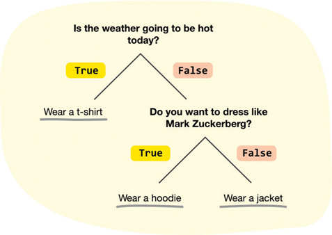
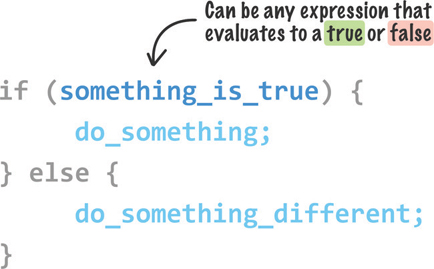
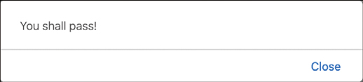
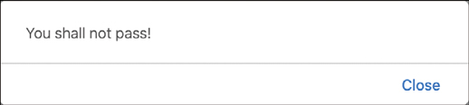
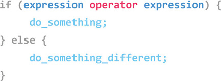
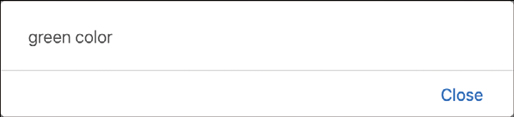

# 4. Conditional Statements: `if`, `Else`, and `Switch`

* The `if`/`Else` Statement
* `Switch` Statements
* Deciding Which to Use


En este capítulo

* Utilice la popular declaración `if`/`else`  para ayudar a tomar una decisión en el código
* Obtenga información sobre las sentencias `switch` y cuándo usarlas

Desde el momento en que te despiertas, ya sea que te des cuenta o no, comienzas a tomar decisiones. Apaga la alarma. Enciende las luces. Mire afuera para ver cómo está el clima. Cepille sus dientes. Ponte la túnica y el sombrero de mago. Consulta tu calendario. Básicamente ... entiendes el punto. Para cuando salga de su puerta, consciente o inconscientemente habrá tomado cientos de decisiones y cada decisión tendrá un cierto efecto en lo que terminó haciendo.

Por ejemplo, si el clima se ve frío afuera, puede optar por usar una sudadera con capucha o una chaqueta. Puede modelar esta decisión como se muestra en la Figura 4.1.



**FIGURA 4.1** *Modelado de decisiones.*

En cada etapa de la toma de una decisión, se hace una pregunta que puede responderse como **true** verdadera o **false** falsa. La respuesta a esa pregunta determina su próximo paso y, en última instancia, si usa una camiseta, una sudadera con capucha o una chaqueta. En términos más amplios, cada decisión que tomamos tú y yo se puede modelar como una serie de declaraciones **true** y **false**. Esto puede sonar un poco frío (¡ja!), Pero así es generalmente como nosotros, los demás y casi todos los seres vivos tomamos decisiones.

Esta generalización se aplica especialmente a todo lo que hace nuestra computadora. Es posible que esto no sea evidente en el código que hemos escrito hasta ahora, pero vamos a solucionarlo. En este tutorial, cubriremos lo que se conoce como **sentencias condicionales**. Estos son los equivalentes digitales de las decisiones que tomamos donde nuestro código hace algo diferente dependiendo de si algo es **true** o **false**.

¡Adelante!

### LA SENTENCIA IF/ELSE

La declaración condicional más común que usaremos en nuestro código es la **declaración if/else** o simplemente la **declaración if**. La forma en que funciona esta declaración se muestra en la Figura 4.2.



**FIGURA 4.2** *Cómo funciona la sentencia if.*

Para darle sentido a esto, echemos un vistazo a un ejemplo simple de una declaración `if`/`else` en acción. Cree un nuevo documento HTML y agregue el siguiente marcado y código en él:

```html
<!DOCTYPE html>
<html>

<head>
   <meta charset="utf-8">
   <title>If/Else Statements</title>
</head>

<body>
   <script>
      let safeToProceed = true;
      if (safeToProceed) {
         alert("You shall pass!");
      } else {
         alert("You shall not pass!");
      }
   </script>
</body>
</html>
```

Guarde este documento con el nombre `if_else.htm` y obtenga una vista previa en su navegador. Si todo funcionó como se esperaba, verá una alerta con el texto ¡Pasará! mostrado (Figura 4.3).



**FIGURA 4.3** *Verá esta alerta.*

El código responsable de hacer que esto funcione son las siguientes líneas de nuestro ejemplo:

```js
let safeToProceed = true;

if (safeToProceed) {
   alert("You shall pass!");
} else {
   alert("You shall not pass!");
}
```

Nuestra **expresión** (lo que sigue a la palabra clave si finalmente se evalúa como **true** o **false**) es la variable `safeToProceed`. Esta variable se inicializa a **true**, por lo que la parte verdadera de nuestra declaración if se activó.

Ahora, continúe y cambie el valor de la variable `safeToProceed` de **true** a **false**):

```js
let safeToProceed = true;                                        

if (safeToProceed) {
   alert("You shall pass!");
} else {
   alert("You shall not pass!");
}
```

Esta vez, cuando ejecute este código, verá una alerta con el texto **You shall not pass!** porque nuestra expresión ahora se evalúa como **false** (Figura 4.4).



**FIGURA 4.4** *La alerta que recibe cuando la expresión se evalúa como false.*

Hasta ahora, todo esto probablemente parece realmente aburrido. Una gran parte de la razón de esto se debe a que no hemos subido la perilla de complejidad para enfocarnos en escenarios más realistas. Lo abordaremos a continuación analizando las condiciones en profundidad.

### Conozca a los Operadores Condicionales

En la mayoría de los casos, nuestra expresión rara vez será una variable simple configurada como **true** o **false** como en nuestro ejemplo anterior. Nuestra expresión involucrará lo que se conoce como **operadores condicionales** que nos ayudan a comparar entre dos o más expresiones para establecer un resultado **true** o **false**.

El formato general de tales expresiones se muestra en la Figura 4.5.



**FIGURA 4.5** *Formato general de expresiones de operadores condicionales.*

El **operador** (también conocido como **operador condicional**) define una relación entre una expresión. El objetivo final es devolver un **true** o **false** para que nuestra declaración `if` sepa qué bloque de código ejecutar. La clave para que todo esto funcione son los propios operadores condicionales. Se muestran en la Tabla 4.1.

**TABLA 4.1** Operadores

Operador | Cuando es `true`
---------------------------
`==`     | Si la primera expresión se evalúa como algo que es igual a la segunda expresión.
`>=`     | Si la primera expresión se evalúa como algo mayor o igual que la segunda expresión.
`>`      | Si la primera expresión se evalúa como algo mayor que la segunda expresión.
`<=`     | Si la primera expresión se evalúa como algo menor o igual que la segunda expresión.
`<`      | Si la primera expresión evalúa tes a algo que es menor que la segunda expresión.
`!=`     | Si la primera expresión se evalúa como algo que no es igual a la segunda expresión.
`&&`     | Si la primera expresión y la segunda expresión se evalúan como verdaderas.
`||`     | Si la primera expresión o la segunda expresión se evalúan como verdadera.

Tomemos nuestra comprensión general de los operadores condicionales y hagámosla más específica mirando otro ejemplo ... como el siguiente con nuestro código relevante relacionado con el `if` resaltado:

```html
<!DOCTYPE html>
<html>

<head>
   <meta charset="utf-8">
   <title>Are you speeding?</title>
</head>

<body>
   <script>
      let speedLimit = 55;

      function amISpeeding(speed) {
         if (speed >= speedLimit) {                                    
            alert("Yes. You are speeding.");                            
         } else {                                                      
            alert("No. You are not speeding. What's wrong with you?");  
         }                                                             
      }

      amISpeeding(53);
      amISpeeding(72);
  </script>
</body>

</html>
```

Dediquemos un momento a comprender qué está pasando exactamente. Tenemos una variable llamada `speedLimit` que se inicializa a **55**. Luego tenemos una función llamada `amISpeeding` que toma un argumento llamado `speed`. Dentro de esta función, tenemos una declaración `if` cuya expresión verifica si el valor `speed` pasado es mayor o igual (Hello >= conditional operator!) Al valor almacenado por la variable `speedLimit`:

```js
function amISpeeding(speed) {
   if (speed >= speedLimit) {                                       
      alert("Yes. You are speeding.");
   } else {
      alert("No. You are not speeding. What's wrong with you?");
   }
}
```

Lo último que hace nuestro código es llamar a la función `amISpeeding` pasando algunos valores para la velocidad:

```js
amISpeeding(53);
amISpeeding(72);
```

Cuando llamamos a esta función con una velocidad de **53**, la expresión `speed >= speedLimit` se evalúa como **false**. La razón es que **53** no es mayor o igual que el valor almacenado de `speedLimit` que es **55**. Esto dará como resultado una alerta que muestra que no está acelerando.

Lo contrario sucede cuando llamamos `amISpeeding` con una velocidad de **72**. En este caso, estamos acelerando y la condición se evalúa como **true**. También aparecerá una alerta que nos indicará que estamos acelerando.

### Crear Expresiones más Complejas

Lo que necesita saber acerca de estas expresiones es que pueden ser tan simples o tan complejas como pueda hacerlas. Pueden estar formados por variables, llamadas a funciones o valores brutos. Incluso pueden estar formados por combinaciones de variables, llamadas a funciones o valores sin procesar, todos separados mediante cualquiera de los operadores que vio anteriormente. Lo único que debe asegurarse es que su expresión finalmente se evalúe como **true** o **false**.

Aquí hay un ejemplo un poco más complicado:

```js
let xPos = 300;
let yPos = 150;

function sendWarning(x, y) {
   if ((x < xPos) && (y < yPos)) {
      alert("Adjust the position");
   } else {
      alert("Things are fine!");
   }
}

sendWarning(500, 160);
sendWarning(100, 100);
sendWarning(201, 149);
```
AQUIIIIIIIIIIIII
Observe cómo se ve nuestra condición dentro de la declaración `if` de `sendWarning`:

```js
function sendWarning(x, y) {
   if ((x < xPos) && (y < yPos)) {                         
      alert("Adjust the position");
   } else {
                alert("Things are fine!");
        }
}
```

Aquí se hacen tres comparaciones. El primero es si x es menor que xPos. El segundo es si y es menor que yPos. La tercera comparación es ver si la primera declaración y la segunda declaración se evalúan como verdaderas para permitir que el operador && devuelva una verdadera también. Podemos encadenar muchas series de declaraciones condicionales dependiendo de lo que estemos haciendo. Lo complicado, además de aprender lo que hacen todos los operadores, es asegurarse de que cada condición y subcondición esté debidamente aislada mediante paréntesis.

Todo lo que estamos describiendo aquí y en la sección anterior cae bajo el paraguas de la lógica booleana. Si no está familiarizado con este tema, le recomiendo que lea el excelente artículo de quirksmode sobre este tema exacto.

Variaciones en la declaración If / Else
Casi hemos terminado con la declaración if. Lo último que vamos a hacer es mirar a algunos de sus parientes.

La declaración de si solo
La primera es la declaración if solo que no tiene su compañero else:

```html
```

En este caso, si la expresión se evalúa como verdadera, entonces genial. Si la expresión se evalúa como falsa, entonces su código simplemente omite la alerta y se mueve a donde debe ir a continuación. El bloque else es completamente opcional cuando se trabaja con sentencias if. Para contrastar la declaración si solo, tenemos nuestro próximo pariente ...

La temida declaración If / Else-If / Else
No todo puede ser ordenado y agrupados en una sola declaración if o if / else. Para ese tipo de situaciones, puede encadenar declaraciones if juntas utilizando la palabra clave else if. En lugar de explicar esto con más detalle, veamos un ejemplo:

```html
```

Si la primera declaración if se evalúa como verdadera, entonces nuestro código se ramifica en la primera alerta. Si la primera declaración if es falsa, entonces nuestro código evalúa la declaración else if para ver si las expresiones en ella se evalúan como verdaderas o falsas. Esto se repite hasta que nuestro código llega al final. En otras palabras, nuestro código simplemente navega hacia abajo a través de cada declaración if y else if hasta que una de las expresiones se evalúa como verdadera:

```html
```

Si ninguna de las declaraciones tiene expresiones que se evalúen como verdaderas, se ejecuta el código dentro del bloque else (si existe). Si no hay otro bloque, entonces el código simplemente pasará al siguiente conjunto de código que vive más allá de todas estas declaraciones if. Entre las expresiones más complejas y las declaraciones if / else if, puede representar prácticamente cualquier decisión que su código deba evaluar.

Uf
Y con esto, ha aprendido todo lo que hay que saber sobre la declaración if. Es hora de pasar a una especie completamente diferente de declaración condicional ...

DECLARACIONES DE INTERRUPTOR

En un mundo lleno de hermosas declaraciones if, else y else if, la necesidad de otra forma de lidiar con los condicionales puede parecer innecesaria. Las personas que escribieron código en máquinas del tamaño de una habitación y probablemente caminaron cuesta arriba en la nieve (con lobos persiguiéndolos) no estuvieron de acuerdo, por lo que tenemos lo que se conoce como declaraciones de cambio. ¿Qué son? ¡Vamos a averiguarlo!

Uso de una declaración de cambio
Vamos a ir al grano y mirar el código primero. La estructura básica de una declaración de cambio es la siguiente:

```html
```

Lo que no se debe olvidar nunca es que una declaración de cambio no es más que una declaración condicional que prueba si algo es verdadero o falso. Ese algo es una variación de si el resultado de evaluar la expresión es igual a un valor de caso. Hagamos que esta explicación tenga sentido mirando un ejemplo mejor:

```html
```

En este ejemplo simple, tenemos una variable llamada color cuyo valor se establece en verde:

```html
```

La variable de color también es lo que especificamos como nuestra expresión para la declaración de cambio:

```html
```

Nuestra declaración de cambio contiene una colección de bloques de casos. Solo uno de estos bloques se verá afectado y su código se ejecutará. La forma en que se elige este elegido es haciendo coincidir el valor de caso de un bloque con el resultado de evaluar la expresión. En nuestro caso, debido a que nuestras expresiones se evalúan con un valor de verde, se ejecuta el código dentro del bloque de caso cuyo valor de caso también es verde:

```html
```

Tenga en cuenta que solo se ejecuta el código dentro del bloque de caso verde. Eso es gracias a la palabra clave break que finaliza ese bloque. Cuando su código llega a la ruptura, sale de todo el bloque de interruptores y continúa ejecutando el código que se encuentra debajo de él. Si no especificó la palabra clave break, aún ejecutará el código dentro del bloque de caso verde. La diferencia es que luego pasará a la next bloque de mayúsculas y minúsculas (el negro en nuestro ejemplo) y ejecute cualquier código que esté allí. A menos que presione otra palabra clave de interrupción, su código se moverá a través de cada bloque de caso hasta que llegue al final.

Con todo esto dicho, si tuviera que ejecutar este código, verá una ventana de alerta que se parece a la Figura 4.6.



**FIGURA 4.6** *Ventana de alerta.*

Puede modificar el valor de la variable de color a otros valores válidos para ver la ejecución de los otros bloques de casos. A veces, el valor de ningún bloque de casos coincidirá con el resultado de evaluar una expresión. En esos casos, su declaración de cambio simplemente no hará nada. Si desea especificar un comportamiento predeterminado, agregue un bloque predeterminado:

```html
```

Tenga en cuenta que el bloque predeterminado se ve un poco diferente a sus otras declaraciones de casos. En realidad, no contiene la palabra caso.

Similitud con una declaración If / Else
Al principio, vimos que una instrucción de cambio se usa para evaluar condiciones, al igual que la instrucción if / else en la que pasamos la mayor parte de nuestro tiempo aquí. Dado que esta es una acusación importante, analicemos esto con más detalle, primero mirando cómo se vería una declaración if si se tradujera literalmente en una declaración de cambio.

Supongamos que tenemos una declaración if que se ve de la siguiente manera:

```html
```

Debido a que el valor de nuestra variable numérica es 20, nuestro enunciado if se evaluará como verdadero. Parece bastante sencillo. Ahora, convierta esto en una declaración de cambio:

```html
```

Observe que nuestra expresión es número> 10. El valor de caso para los bloques de casos se establece en verdadero o falso. Debido a que el número> 10 se evalúa como verdadero, se ejecuta el código dentro del bloque de caso verdadero. Si bien su expresión en este caso no fue tan simple como leer un valor de color almacenado en una variable como en la sección anterior, nuestra visión de cómo funcionan las declaraciones de cambio aún no ha cambiado. Nuestras expresiones pueden ser tan complejas como desee. Si evalúan algo que pueda coincidir dentro de un valor de caso, entonces todo es dorado ... ¡como un vellón!

Ahora, veamos un ejemplo un poco más complicado. Esta vez, convertiremos nuestra declaración de cambio anterior que involucra colores en declaraciones if / else equivalentes. La declaración de cambio que usamos anteriormente tiene el siguiente aspecto:

```html
```

Esta declaración de cambio convertida en una serie de declaraciones if / else se vería así:

```html
```

Como podemos ver, las declaraciones if / else son muy similares a las declaraciones switch y viceversa. El bloque de caso predeterminado se convierte en un bloque else. La relación entre la expresión y el valor del caso en una instrucción switch se combina en condiciones if / else en una instrucción if / else.

DECIDIR QUÉ UTILIZAR

En la sección anterior, vimos lo intercambiables que son las declaraciones switch y las declaraciones if / else. Cuando tenemos dos formas de hacer algo muy similar, es natural querer saber cuándo es apropiado usar una sobre la otra. En pocas palabras, use el que prefiera. Hay muchos argumentos en la web sobre cuándo usar switch frente a if / else, y la única cosa es que todos no son concluyentes.

Mi preferencia personal es ir con lo que sea más legible. Si observa las comparaciones anteriores entre las declaraciones switch y if / else, notará que si tiene muchas condiciones, su declaración switch tiende a verse un poco más limpia. Ciertamente es menos detallado y un poco más legible. Cuál es su punto de corte para decidir cuándo cambiar (¡ja!) Entre el uso de una declaración de cambio y una declaración if / else depende completamente de usted. Tiendo a trazar la línea alrededor de cuatro o cinco condiciones.

En segundo lugar, una declaración de cambio funciona mejor cuando está evaluando un n expresión y hacer coincidir el resultado con un valor. Si está haciendo algo más complejo que involucra condiciones extrañas, verificación de valor, etc., probablemente quiera usar algo diferente. ¡Eso podría involucrar algo incluso más diferente que una declaración if / else, por cierto! Hablaremos de esas cosas diferentes más adelante.

Para terminar con todo esto, la guía anterior sigue en pie: use lo que quiera. Si forma parte de un equipo con pautas de codificación, sígalas. Hagas lo que hagas, sé constante. Hace que su vida, así como la vida de cualquier otra persona que trabaje en su código, sea un poco más fácil. Por lo que vale, personalmente nunca he estado en una situación en la que tuviera que usar una declaración de cambio. Su experiencia puede ser diferente.

El Mínimo Absoluto

Si bien la creación de verdadera inteligencia artificial va más allá del alcance de este libro, puede escribir código para ayudar a su aplicación a tomar decisiones. Este código casi siempre tomará la forma de una declaración if / else en la que le proporciona al navegador un conjunto de opciones que debe tomar:

```html
```

Estas elecciones son alimentadas por condiciones que deben evaluarse como verdaderas o falsas.

En este capítulo, aprendimos la mecánica de cómo trabajar con declaraciones if / else y sus (más o menos) primos relacionados, las declaraciones switch. En capítulos futuros, nos verá usando estas declaraciones de manera muy casual, como si las conociéramos desde hace años, por lo que estará muy familiarizado con cómo escribir estas declaraciones para cuando llegue al final de este libro.

Si tiene alguna pregunta sobre el contenido aquí, ¡no se preocupe! Ser feliz. Publica en los foros en https://forum.kirupa.com para obtener ayuda realmente rápida tanto de mí como de algunos de los mejores desarrolladores de la web.

## 🔴 💻 `04-01-if_else.html`

```html
<!DOCTYPE html>
<html lang="es">
<head>
    <meta charset="UTF-8">
    <meta http-equiv="X-UA-Compatible" content="IE=edge">
    <meta name="viewport" content="width=device-width, initial-scale=1.0">
    <title>04-01-if_else</title>
</head>
<body>
    <script>
        let safeToProceed = true;
        if (safeToProceed) {
           alert("¡Pasarás!");
        } else {
           alert("¡No pasarás!");
        }
    </script>
</body>
</html>
```


## 🔴 💻 `04-02-Operadores-Condicionales.html`

```html
<!DOCTYPE html>
<html lang="es">
<head>
    <meta charset="UTF-8">
    <meta http-equiv="X-UA-Compatible" content="IE=edge">
    <meta name="viewport" content="width=device-width, initial-scale=1.0">
    <title>04-02-Operadores-Condicionales</title>
</head>
<body>
    <script>
        let speedLimit = 55;

        function amISpeeding(speed) {
            if (speed >= speedLimit) {                                    
                alert("Si. Si vas a exceso de velocidad. ¿Qué sucede contigo?");                            
            } else {                                                      
                alert("No. No vas a exceso de velocidad.");  
            }                                                             
        }

        amISpeeding(53);
        amISpeeding(72);
    </script>
</body>
</html>
```


