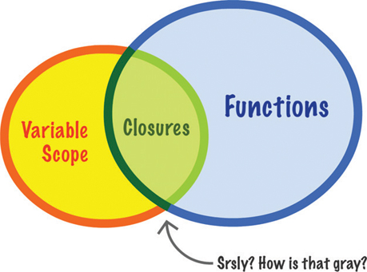
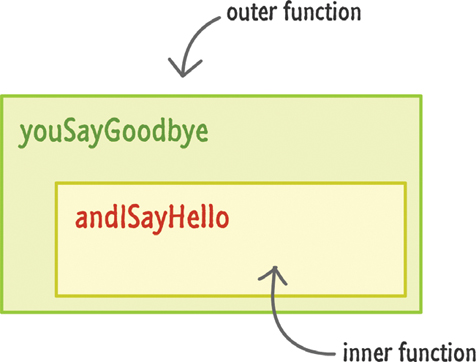
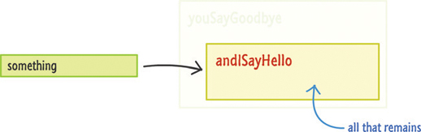
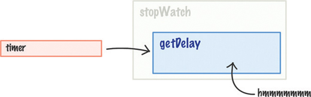
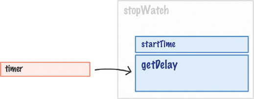
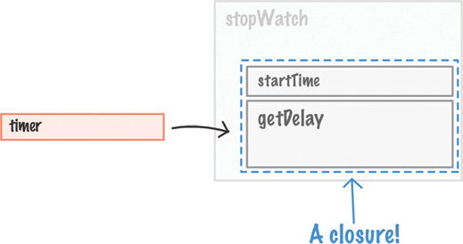
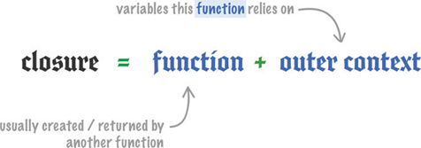

# 9. Closures

* Functions within Functions
* When the Inner Functions Aren’t Self-Contained

En este capítulo

• Comprender qué son los cierres

• Reúna todo lo que ha aprendido sobre funciones, variables y alcance

A estas alturas, probablemente ya sepa todo sobre las funciones y todas las funciones divertidas que hacen. Una parte importante de trabajar con funciones, con JavaScript y (posiblemente) la vida en general es comprender el tema conocido como cierres. Los cierres tocan un área gris donde las funciones y el alcance variable se cruzan (Figura 9.1).

**FIGURA 9.1** *Cierres.*

Ahora, no voy a decir nada más sobre los cierres, porque esto es algo que se explica mejor viendo el código. Cualquier palabra que agregue ahora mismo para definir o describir qué son los cierres solo servirá para confundir las cosas. En las siguientes secciones, comenzaremos en territorio familiar y luego nos aventuraremos lentamente en áreas hostiles donde se pueden encontrar cierres.

¡Adelante!

FUNCIONES DENTRO DE FUNCIONES
Lo primero que vamos a hacer es profundizar en lo que sucede cuando tienes funciones dentro de funciones ... y se devuelve la función interna. Como parte de eso, hagamos una revisión rápida de las funciones.

Eche un vistazo al siguiente código:

Haga clic aquí para ver la imagen del código

function calculateRectangleArea (largo, ancho) {
  retorno largo * ancho;
}

let roomArea = calculateRectangleArea (10, 10);
alert (roomArea);
La función calculateRectangleArea toma dos argumentos y devuelve el valor multiplicado de esos argumentos a lo que sea que se llame. En este ejemplo, la parte que sea que se llame la juega la variable roomArea.

Una vez que se ha ejecutado este código, la variable roomArea contiene el resultado de multiplicar 10 por 10 ... que es simplemente 100 (Figura 9.2).

**FIGURA 9.2** *El resultado de roomArea.*

Como sabe, lo que devuelve una función puede ser prácticamente cualquier cosa. En este caso, devolvimos un número. Puede devolver muy fácilmente texto (también conocido como String), el valor indefinido, un objeto personalizado, etc. Siempre que el código que llama a la función sepa qué hacer con lo que devuelve la función, puede hacer prácticamente lo que quiera querer. Incluso puede devolver otra función. Déjame hablar un poco de esto.

A continuación se muestra un ejemplo muy simple de lo que estoy hablando:

Haga clic aquí para ver la imagen del código

function youSayGoodBye () {

  alert ("¡Adiós!");

  function andISayHello () {
    alert ("¡Hola!");
  }

  return andISayHello;
}
Podemos tener funciones que contengan funciones dentro de ellas. En este ejemplo, tenemos nuestra función youSayGoodBye que contiene una alerta y otra función llamada andISayHello (Figura 9.3).

**FIGURA 9.3** *Una función dentro de una función.*

La parte interesante es lo que devuelve la función youSayGoodBye cuando se llama. Devuelve la función andISayHello:

Haga clic aquí para ver la imagen del código

function youSayGoodBye () {

  alert ("¡Adiós!");

  function andISayHello () {
    alert ("¡Hola!");
  }

  return andISayHello;
}
Sigamos adelante y reproduzcamos este ejemplo. Para llamar a esta función, inicialice una variable que apunte a usted SayGoodBye:

Haga clic aquí para ver la imagen del código

deja algo = youSayGoodBye ();
En el momento en que se ejecute esta línea de código, también se ejecutará todo el código dentro de la función youSayGoodBye. Esto significa que verá un cuadro de diálogo (gracias a la alerta) que dice ¡Adiós! (Figura 9.4).

**FIGURA 9.4** *¡El adiós! diálogo.*

Como parte de la ejecución hasta la finalización, la función andISayHello se creará y luego también se devolverá. En este punto, nuestra variable algo solo tiene ojos para una cosa, y esa cosa es la función andISayHello (ver Figura 9.5).

**FIGURA 9.5** *Algo y la función andISayHello.*

La función externa youSayGoodBye, desde el punto de vista de la variable algo, simplemente desaparece. Debido a que la variable algo ahora apunta a una función, puede invocar esta función simplemente llamándola usando los paréntesis de apertura y cierre como lo haría normalmente:

Haga clic aquí para ver la imagen del código

deja algo = youSayGoodBye ();
alguna cosa();
Cuando haga esto, se ejecutará la función interna devuelta (también conocida como ISayHello). Al igual que antes, verá aparecer un cuadro de diálogo, pero este cuadro de diálogo dirá ¡Hola! (Figura 9.6), que es lo que especificó la alerta dentro de esta función.

**FIGURA 9.6** *¡Hola!*

Todo esto probablemente debería ser revisado. Lo único que puede haber encontrado nuevo es darse cuenta de que una vez que una función devuelve un valor, ya no existe. Lo único que queda es el valor devuelto.

Ok, nos estamos acercando al territorio hostil prometido. En la siguiente sección, ampliaremos lo que acabamos de ver al ver otro ejemplo con un ligero giro.

CUANDO LAS FUNCIONES INTERIORES NO SON AUTÓNOMAS
En el ejemplo anterior, nuestra función interna andISayHello era autónoma y no dependía de ninguna variable o estado de la función externa:

Haga clic aquí para ver la imagen del código

function youSayGoodBye () {

  alert ("¡Adiós!");

  function andISayHello () {
    alert ("¡Hola!");
  }
  
  return andISayHello;
}
En muchos escenarios reales, muy raramente nos encontraremos con un caso como este. A menudo tendremos variables y datos que se comparten entre la función externa y la función interna. Para resaltar esto, eche un vistazo a lo siguiente:

Haga clic aquí para ver la imagen del código

function stopWatch () {
  let startTime = Date.now ();

  function getDelay () {
    let elapsedTime = Date.now () - startTime;
    alerta (tiempo transcurrido);
  }

  return getDelay;
}
Este ejemplo muestra una forma muy sencilla de medir el tiempo que lleva hacer algo. Dentro de la función stopWatch, tenemos una variable startTime que se establece en el valor de Date.now ():

Haga clic aquí para ver la imagen del código

function stopWatch () {
  let startTime = Date.now ();

  function getDelay () {
    let elapsedTime = Date.now () - startTime;
    alerta (tiempo transcurrido);
  }

  return getDelay;
}
También tenemos una función interna llamada getDelay:

Haga clic aquí para ver la imagen del código

function stopWatch () {
  let startTime = Date.now ();

  function getDelay () {
    let elapsedTime = Date.now () - startTime;
    alerta (tiempo transcurrido);
  }

  return getDelay;
}
La función getDelay muestra un diálogo que contiene la diferencia de tiempo entre una nueva llamada a Date.now () y la variable startTime declarada anteriormente.

Volviendo a la función externa stopWatch, lo último que sucede es que devuelve la función getDelay antes de salir. Como podemos ver, el código aquí es muy similar al ejemplo anterior. Tenemos una función externa, tenemos una función interna y tenemos la función externa que devuelve la función interna.

Ahora, para ver la función stopWatch en funcionamiento, agregue las siguientes líneas de código:

Haga clic aquí para ver la imagen del código

let timer = stopWatch ();

// haz algo que lleve algo de tiempo
para (sea i = 0; i <1000000; i ++) {
  let foo = Math.random () * 10000;
}

// invoca la función devuelta
Temporizador();
El marcado y el código completos de este ejemplo tienen el siguiente aspecto:

Haga clic aquí para ver la imagen del código

<! DOCTYPE html>
<html>

<cabeza>
  <meta charset = "utf-8">
  <title> Cierres </title>

  <estilo>

  </style>
</head>

<cuerpo>
  
</body>

</html>
Si ejecuta este ejemplo, veremos un cuadro de diálogo que muestra la cantidad de milisegundos que tomó entre la inicialización de la variable del temporizador, la ejecución del bucle for hasta su finalización y la invocación de la variable del temporizador como función (Figura 9.7).

  **FIGURA 9.7** *La variable de temporizador invocada como función.*

Para explicarlo de otra manera, tenemos un cronómetro que invocamos, ejecutamos alguna operación de larga duración y volvemos a invocar para ver cuánto tiempo se llevó a cabo la operación de larga duración.

Ahora que podemos ver nuestro pequeño ejemplo de cronómetro funcionando, volvamos a la función stopWatch y veamos qué está pasando exactamente. Como mencioné hace unas líneas, mucho de lo que vemos es similar al ejemplo youSayGoodBye / andISayHello. Hay un giro que hace que este ejemplo sea diferente, y la parte importante a tener en cuenta es lo que sucede cuando la función getDelay se devuelve a la variable del temporizador.

La figura 9.8 es una visualización incompleta de cómo se ve esto.

  
**FIGURA 9.8** *La función externa stopWatch ya no está activa y la variable del temporizador está vinculada a la función getDelay.*

La función externa stopWatch ya no está en juego, y la variable del temporizador está vinculada a la función getDelay. Ahora, aquí está el giro. La función getDelay se basa en la variable startTime que vive en el contexto de la función externa stopWatch:

Haga clic aquí para ver la imagen del código

function stopWatch () {
  let startTime = Date.now ();

  function getDelay () {
    let elapsedTime = Date.now () - startTime;
    alerta (tiempo transcurrido);
  }

  return getDelay;
}
Cuando la función externa stopWatch desaparece cuando getDelay se devuelve a la variable del temporizador, ¿qué sucede en la siguiente línea?

Haga clic aquí para ver la imagen del código

function getDelay () {
  let elapsedTime = Date.now () - startTime;
  alerta (tiempo transcurrido);
}
En este contexto, tendría sentido si la variable startTime en realidad no está definida, ¿verdad? Pero el ejemplo funcionó totalmente, así que algo más está sucediendo aquí. Ese algo más es el cierre tímido y misterioso. Aquí hay un vistazo a lo que sucede para que nuestra variable startTime realmente almacene un valor y no esté indefinida.

El tiempo de ejecución de JavaScript que realiza un seguimiento de todas sus variables, memo ry uso, referencias, etc. es realmente inteligente. En este ejemplo, detecta que la función interna (getDelay) se basa en variables de la función externa (stopWatch). Cuando eso sucede, el tiempo de ejecución asegura que cualquier variable en la función externa que sea necesaria todavía esté disponible para la función interna, incluso si la función externa desaparece.

Para visualizar esto correctamente, la Figura 9.9 muestra cómo se ve la variable del temporizador.

 **FIGURA 9.9** *La variable del temporizador.*

Todavía se refiere a la función getDelay, pero la función getDelay también tiene acceso a la variable startTime que existía en la función stopWatch externa. Esta función interna, debido a que incluyó variables relevantes de la función externa en su burbuja (también conocida como alcance), se conoce como cierre (Figura 9.10).

  
**FIGURA 9.10** *Un cierre definido esquemáticamente.*

Para definir el cierre de manera más formal, es una función recién creada que también contiene su contexto variable (Figura 9.11).

  
**FIGURA 9.11** *Una definición más formal de cierre.*

Para revisar esto una vez más usando nuestro ejemplo existente, la variable startTime obtiene el valor de Date, ahora en el momento en que se inicializa la variable del temporizador y se ejecuta la función stopWatch. Cuando la función stopWatch devuelve la función getDelay interna, la función stopWatch desaparece. Lo que no desaparece son las variables compartidas dentro de stopWatch en las que se basa la función interna. Esas variables compartidas no se destruyen. En cambio, están encerrados por la función interna, también conocida como cierre.

  
### El Mínimo Absoluto

Al mirar primero los cierres a través de ejemplos, realmente te perdiste muchas definiciones, teorías y saludos aburridos. Con toda seriedad, los cierres son muy comunes en JavaScript. Los encontrará de muchas maneras sutiles y no tan sutiles:

Si solo hay algo que sacas de todo esto, recuerda lo siguiente: Lo más importante que hacen los cierres es permitir que las funciones sigan funcionando incluso si su entorno cambia drásticamente o desaparece. Todas las variables que estaban dentro del alcance cuando se creó la función se incluyen y protegen para garantizar que la función siga funcionando. Este comportamiento es esencial para un lenguaje muy dinámico como JavaScript, donde a menudo crea, modifica y destruye cosas sobre la marcha. ¡Días felices!

Cubrimos mucho terreno aquí. Si tiene alguna pregunta sobre lo que ha visto, publíquela en los foros en https://forum.kirupa.com para obtener respuestas rápidamente.
