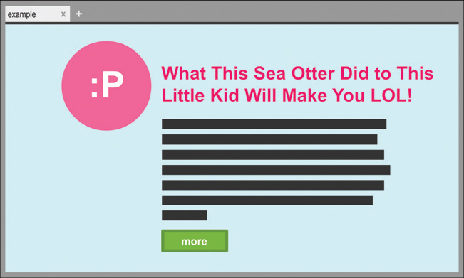
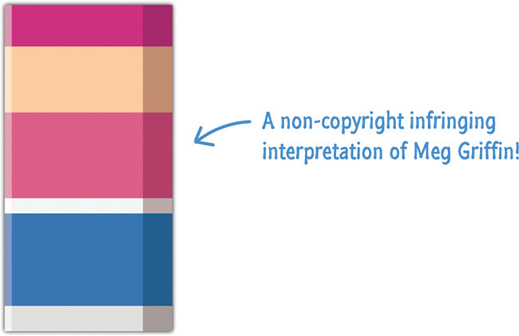
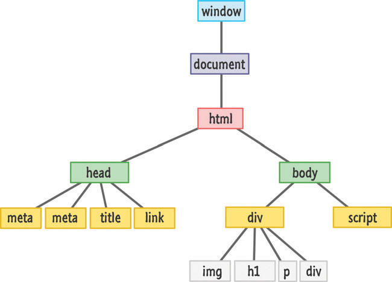
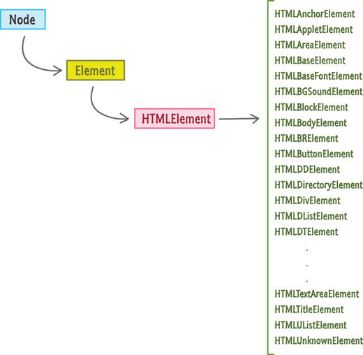
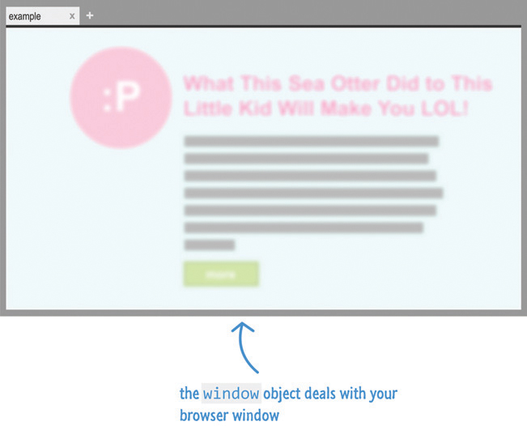
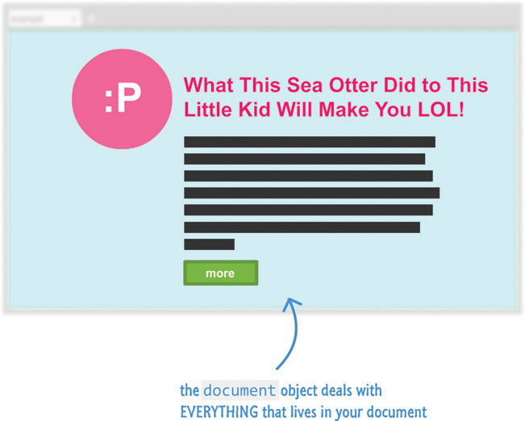

# 24. JS, the Browser, and the DOM

* What HTML, CSS, and JavaScript Do
* HTML Defines the Structure
* Prettify My World, CSS!
* It’s JavaScript Time!
* Meet the Document Object Model


En este capítulo

* Aprenda cómo interactúan JavaScript y el resto de su página.
* Comprender de qué se trata el Document Object Model (DOM) - Modelo de Objetos de Documento
* Descubra los límites difusos entre HTML, CSS y JavaScript

Hasta ahora, hemos analizado JavaScript de forma aislada. Aprendimos mucho sobre su funcionalidad básica, pero lo hicimos con poca o ninguna conexión con cómo se relaciona con el mundo real, un mundo que está representado por su navegador y nadando con pequeñas etiquetas HTML y estilos CSS. Este capítulo servirá como una introducción a este mundo, y los capítulos siguientes profundizarán mucho más.

En las siguientes secciones, aprenderá sobre la misteriosa estructura de datos y la interfaz de programación conocida como **Document Object Model (DOM)**. Aprenderá qué es, por qué es útil y cómo se relaciona con todo lo que hará en el futuro.

¡Adelante!

## QUÉ HACEN HTML, CSS Y JAVASCRIPT

Antes de sumergirnos y comenzar a responder el significado de la vida ... eh, el DOM, veamos rápidamente algunas cosas que probablemente ya sepas. Para empezar, lo que pones en tus documentos HTML gira en torno a HTML, CSS y JavaScript. Tratamos estas tres cosas como socios iguales en la construcción de lo que ve en su navegador (Figura 24.1).



**FIGURA 24.1** *Una página web típica se compone de HTML, CSS y JavaScript.*

Cada socio tiene un papel importante que desempeñar, y el papel que desempeña cada uno es muy diferente.

## HTML DEFINE LA ESTRUCTURA

Tu HTML define la estructura de tu página y normalmente contiene el contenido que ves:

```html
<!DOCTYPE html>
<html>

<head>
   <meta content="sea otter, kid, stuff" name="keywords">
   <meta content="Sometimes, sea otters are awesome!" name="description">
   <title>Example</title>
   <link href="foo.css" rel="stylesheet" />
</head>

<body>
   <div id="container">
      

      <h1>What This Sea Otter Did to This Little Kid Will Make You LOL!</h1>

      <p class="bodyText">
         Nulla tristique, justo eget semper viverra,
         massa arcu congue tortor, ut vehicula urna mi
         in lorem. Quisque aliquam molestie dui, at tempor
         turpis porttitor nec. Aenean id interdum urna.
         Curabitur mi ligula, hendrerit at semper sed,
         feugiat a nisi.
      </p>

      <div class="submitButton">
         more
      </div>
   </div>
   <script src="stuff.js"></script>
</body>

</html>
```

HTML en sí mismo, es un poco como Meg Griffin en Padre de familia, es bastante aburrido. Si no sabe quién es Meg y es demasiado vago para buscarla en Google, la Figura 24.2 es una aproximación de su apariencia.

 

**FIGURA 24.2** *Una interpretación artística de Meg Griffin.*

De todos modos, no quiere que sus documentos HTML sean aburridos. Para transformar su contenido de algo simple y monótono en algo atractivo, tiene CSS.

## EMBELLECER MI MUNDO, CSS!

CSS es su lenguaje de estilo principal que le permite dar a sus elementos HTML un atractivo estético y de diseño muy necesario:

```css
body {
   font-family: "Arial";
   background-color: #CCCFFF;
}
#container {
   margin-left: 30%;
}
#container img {
   padding: 20px;
}
#container h1 {
   font-size: 56px;
   font-weight: 500;
}
#container p.bodyText {
   font-size: 16px;
   line-height: 24px;
}
.submitButton {
   display: inline-block;
   border: 5px solid #669900;
   background-color: #7BB700;
   padding: 10px;
   width: 150px;
   font-weight: 800;
}
```

Durante mucho tiempo, entre HTML y CSS, tenía todo lo que necesitaba para crear una página funcional y de aspecto impresionante. Tenías estructura y diseño. Tenías navegación. Incluso tuviste interacciones simples como pasar el mouse. La vida era buena.

## ¡ES LA HORA DE JAVASCRIPT!

A pesar de todas las grandes cosas que HTML y CSS tenían a su favor, ambos estaban limitados en la cantidad de interactividad que proporcionaban. La gente quería hacer más en un documento web que simplemente sentarse pasivamente y observar lo que estaba sucediendo. Querían que sus documentos web hicieran más. Querían que sus documentos les ayudaran a jugar con los medios; recuerde dónde lo dejaron; hacer cosas con los clics del mouse, los toques del teclado y la presión de los dedos; use menús de navegación sofisticados; ver animaciones programáticas spiffy (sí, usé la palabra spiffy); interactuar con sus cámaras web/micrófonos; no requiere una recarga/navegación de la página para ningún tipo de acción; Y mucho más.


Ciertamente ayudó que los desarrolladores y diseñadores web (también conocidos como tú y yo) estuvieran ansiosos por encontrar una forma de ayudar a crear este tipo de cosas también.

Para llenar esta brecha entre lo que proporcionaban HTML y CSS y lo que la gente quería, tenía componentes de terceros como Java y Flash que prosperaron durante muchos años. No fue hasta hace poco que esta tendencia cambió. Hubo muchas razones técnicas y políticas para este cambio, pero una de las razones fue que JavaScript durante muchos años simplemente no estaba listo. No tenía lo que se necesitaba ni en el lenguaje principal ni en lo que los navegadores admitían para ser efectivo.

Ese ya no es el caso hoy. JavaScript es ahora un lenguaje perfectamente capaz que le permite agregar los tipos de cosas interactivas que la gente busca. Todas estas capacidades son accedidas por la verdadera estrella de todo esto, el **DOM**.

## CONOZCA EL DOCUMENT OBJECT MODEL - MODELO DE OBJETO DE DOCUMENTO

Lo que muestra su navegador es un documento web. Más específicamente, para resumir la totalidad de las secciones anteriores, lo que ve es una colisión de HTML, CSS y JavaScript trabajando juntos para crear lo que se muestra. Profundizando un paso más, bajo las sábanas, hay una estructura jerárquica que su navegador usa para darle sentido a todo lo que sucede.

Esta estructura se conoce (nuevamente) como el Document Object Model - Modelo de Objetos de Documento. Los amigos simplemente lo llaman DOM. La figura 24.3 muestra una vista muy simplificada de cómo se vería el DOM de nuestro ejemplo anterior:

 

**FIGURA 24.3** *¡Nuestro DOM para todo el HTML que viste anteriormente se ve así!*

A pesar de la simplicidad, hay varias cosas en las que profundizar que se aplican a todas las estructuras DOM en general. Su DOM en realidad se compone de muchos tipos de cosas más allá de los elementos HTML. ***Todas esas cosas que componen su DOM se conocen más genéricamente como nodos***.

*Estos **nodos** pueden ser **elementos** (lo que no debería sorprenderle), **atributos**, **contenido de texto**, **comentarios**, **material relacionado con documentos** y **varias otras cosas** en las que simplemente nunca piensa*. Ese detalle es importante para alguien, pero ese "alguien" no deberíamos ser tú y yo. *Casi siempre, el único tipo de nodo que nos importa es el tipo de elemento* porque es con lo que nos ocuparemos el 99% del tiempo. En el nivel aburrido/técnico, los nodos siguen desempeñando un papel en nuestra vista centrada en elementos.

Cada elemento HTML al que desea acceder tiene un tipo particular asociado, y todos estos tipos se extienden desde la base **Node** que forma todos los nodos, como se muestra en la Figura 24.4.

 

**FIGURA 24.4** *La disposición de cómo se estructuran los elementos que normalmente vemos.*

Sus elementos HTML están al final de una cadena que comienza con **Node** y continúa con **Element** y **`HTMLElement`** antes de terminar con un tipo (`HTMLDivElement`, `HTMLHeadingElement`, etc.) que coincide con el elemento HTML en sí. Las propiedades y métodos que verá para manipular elementos HTML se introducen en alguna parte de esta cadena.

Ahora, antes de comenzar a usar DOM para modificar elementos HTML, primero hablemos de dos objetos especiales que se interponen en el camino antes de que el camino se despeje para lo que queremos hacer.

### El Objeto Window

En el navegador, la raíz de su jerarquía es el objeto `window` que contiene muchas propiedades y métodos que le ayudan a trabajar con su navegador; vea la Figura 24.5.

 

**FIGURA 24.5** *La `window` es bastante importante en estas partes.*

Algunas de las cosas que puede hacer con la ayuda del objeto `window` incluyen acceder a la URL actual, obtener información sobre los frames de la página, usar el almacenamiento local, ver información sobre su pantalla, manipular la scrollbar - barra de desplazamiento, configurar el texto de la status bar - barra de estado, y todo tipo de cosas que son aplicables al contenedor en el que se muestra su página web.

### El Document Object - Objeto de Documento

Ahora, llegamos al objeto `document` resaltado en la Figura 24.6. Aquí es donde las cosas se ponen interesantes, y también es donde tú y yo nos centraremos gran parte de nuestro tiempo.

 

**FIGURA 24.6** *El objeto `document` también es algo importante.*

El objeto `document` es la puerta de entrada a todos los elementos HTML que componen lo que se muestra. Lo que hay que tener en cuenta (y uno que tiene más sentido a medida que analizamos los capítulos futuros) es que el objeto `document` no representa simplemente una versión de solo lectura del documento HTML. Es una calle de dos vías donde puede leer y manipular su documento a voluntad.

Cualquier cambio que realice en el DOM a través de JavaScript se refleja en lo que se muestra en el navegador. Esto significa que ***puede agregar elementos dinámicamente, eliminarlos, moverlos, modificar atributos en ellos, establecer estilos CSS en línea y realizar todo tipo de travesuras***. Fuera del HTML muy básico que se necesita a través de una etiqueta de secuencia de comandos para que JavaScript se ejecute en un documento HTML, ***puede construir una página que funcione completamente usando nada más que JavaScript si lo desea***. Si se usa correctamente, ***esta es una característica bastante poderosa***.

Otro aspecto de importación del objeto `document` tiene que ver con los eventos. Entraré en más detalles sobre esto en breve, pero si desea reaccionar a un clic/hover (desplazamiento del mouse), marcar una casilla de verificación, detectar cuándo se presionó una tecla, etc., dependerá de la funcionalidad que proporciona el objeto `document` escuchando y reaccionando a los eventos.

Hay algunos grupos más grandes de funcionalidad que proporciona DOM, pero los destacaré a medida que los veamos.

<hr>

### El Mínimo Absoluto

El DOM es la pieza de funcionalidad más importante que tiene para trabajar con sus documentos HTML. Proporciona el enlace faltante que vincula su HTML y CSS con JavaScript. También proporciona acceso un nivel hasta su navegador.

Ahora, conocer el DOM es solo parte de la diversión. En realidad, usar su funcionalidad para interactuar con su documento web es la otra parte mucho más importante y divertida. Cuando esté listo, pase (o pase) al siguiente capítulo donde iremos más lejos.

Si tiene alguna pregunta sobre este o cualquier otro tema, publique en los foros en https://forum.kirupa.com.

### 🔴 💻 `24-01-HTML-CSS-JS.html`

```html
<!DOCTYPE html>
<html lang="es">
<head>
    <meta charset="UTF-8">
    <meta http-equiv="X-UA-Compatible" content="IE=edge">
    <meta content="sea otter, kid, stuff" name="keywords">
    <meta content="Sometimes, sea otters are awesome!" name="description">
    <meta name="viewport" content="width=device-width, initial-scale=1.0">
    <title>24-01-HTML-CSS-JS</title>
    <link href="css/foo.css" rel="stylesheet" />
</head>
<body>
    <div id="container">
       
 
       <h1>¡Lo que esta nutria de mar le hizo a este niño te hará reír!</h1>
 
       <p class="bodyText">
          Nulla tristique, justo eget semper viverra,
          massa arcu congue tortor, ut vehicula urna mi
          in lorem. Quisque aliquam molestie dui, at tempor
          turpis porttitor nec. Aenean id interdum urna.
          Curabitur mi ligula, hendrerit at semper sed,
          feugiat a nisi.
       </p>
 
       <div class="submitButton">
          Más
       </div>
    </div>
    <script src="stuff.js"></script>
 </body>
 
 </html>
</html>
```

`foo.css`

```css
body {
    font-family: "Arial";
    background-color: #CCCFFF;
  }
  #container {
    margin-left: 30%;
  }
  #container img {
    padding: 20px;
  }
  #container h1 {
    font-size: 56px;
    font-weight: 500;
  }
  #container p.bodyText {
    font-size: 16px;
    line-height: 24px;
  }
  .submitButton {
    display: inline-block;
    border: 5px solid #669900;
    background-color: #7BB700;
    padding: 10px;
    width: 150px;
    font-weight: 800;
  }
```


