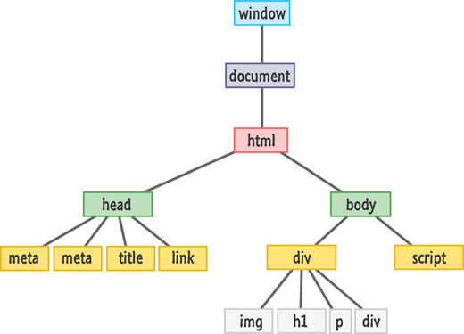

# 25. Finding Elements in the DOM

* Meet the querySelector Family
* It Really Is the CSS Selector Syntax


En este capítulo

* Aprenda a buscar elementos en el DOM.
* Utilice la sintaxis del selector de CSS para un descubrimiento de elementos más inteligente

Como vimos en el capítulo anterior, nuestro DOM no es más que una estructura en forma de árbol (ver Figura 25.1) compuesta por todos los elementos que existen en nuestro documento HTML.



**FIGURA 25.1** *Sí. ¡Parece una estructura en forma de árbol, de acuerdo!**

Ese detalle es solo un poco importante. Lo importante es que tiene todos estos elementos HTML flotando alrededor de los que desea acceder y leer datos o modificarlos. Hay muchas formas de encontrar estos elementos HTML. Después de todo, estos elementos están dispuestos en una estructura en forma de árbol, y si hay algo que a los científicos de la computación les gusta hacer es descubrir formas locas de correr arriba y abajo de un árbol para encontrar algo.

No te someteré a esa tortura ... todavía. En este capítulo, aprenderá a usar dos funciones integradas llamadas `querySelector` y `querySelectorAll` para resolver una buena parte de todas sus necesidades de búsqueda DOM.

¡Adelante!

## CONOCE A LA FAMILIA `QUERYSELECTOR`

Para ayudar a explicar la maravilla que `querySelector` y `querySelectorAll` aportan a la mesa, eche un vistazo al siguiente HTML:

```html
<div id="main">
   <div class="pictureContainer">
      
   </div>
   <div class="pictureContainer">
      
   </div>
   <div class="pictureContainer">
      
   </div>
   <div class="pictureContainer">
      
   </div>
</div>
```

En este ejemplo, tiene un `div` con un `id` **main**, y luego tiene cuatro elementos `div` e `img`, cada uno con una `class` con valor de `pictureContainer` y `theImage` respectivamente. En las siguientes secciones, configuraremos las funciones `querySelector` y `querySelectorAll` sueltas en este HTML y veremos qué sucede.

### `querySelector`

La función `querySelector` básicamente funciona de la siguiente manera:

```js
let element = document.querySelector("CSS selector");
```

La función `querySelector` toma un argumento, y este argumento es una cadena que representa el selector de CSS para el elemento que desea encontrar. ***Lo que devuelve `querySelector` es el primer elemento que encuentra, incluso si existen otros elementos***, que podría ser el objetivo del selector. Esta función es bastante obstinada así.

Tomando el HTML de nuestro ejemplo anterior, si quisiéramos acceder al `div` cuyo `id` es **main**, escribiría lo siguiente:

```js
let element = document.querySelector("#main");
```

Como **main** es el `id`, la sintaxis del selector para apuntar sería `#main`. De manera similar, especifiquemos el selector para la clase **pictureContainer**:

```js
let element = document.querySelector(".pictureContainer");
```

Lo que se devuelve es el primer `div` cuyo valor de clase es **pictureContainer**. Los otros elementos `div` con el valor de clase de **pictureContainer** simplemente serán ignorados.

La sintaxis del selector no se modifica ni se hace especial porque está en JavaScript. ¡Se puede usar la sintaxis exacta que usaría para los selectores en su hoja de estilo o región de estilo!

### `querySelectorAll`

La función `querySelectorAll` devuelve todos los elementos que encuentra que coinciden con cualquier selector que proporciones:

```js
let elements = document.querySelectorAll("CSS selector");
```

Con la excepción del número de elementos devueltos, todo lo que describí sobre `querySelector` arriba también se aplica a `querySelectorAll`. Ese importante detalle cambia la forma en que termina usando la función `querySelectorAll`. Lo que se devuelve no es un solo element. En cambio, lo que se devuelve es un contenedor de elementos en forma de array.

Continuando usando el HTML de antes, así es como se vería nuestro JavaScript si quisiéramos usar `querySelectorAll` para ayudarnos a mostrar el atributo `src` de todos los elementos `img` que contienen el valor de clase **theImage**:

```js
let images = document.querySelectorAll(".theImage");
for (let i = 0; i < images.length; i++) {
   let image = images[i];
   console.log(image.getAttribute("src"));
}
```

Esto es muy sencillo. Lo principal que debe hacer es recordar cómo trabajar con Arrays, en lo que ya debería ser un profesional. La otra cosa (un poco más extraña) es la misteriosa función `getAttribute`. Si no está familiarizado con `getAttribute` y cómo leer los valores de los elementos, está bien. Veremos todo eso muy pronto. Por ahora, solo sepa que le permite leer el valor de cualquier atributo HTML que el elemento HTML en cuestión pueda tener.

## REALMENTE ES LA SINTAXIS DEL SELECTOR CSS

Lo que me sorprendió cuando usé por primera vez `querySelector` y `querySelectorAll` es que en realidad toma la gama completa de variaciones de sintaxis del selector de CSS como argumento. No es necesario que sea sencillo como te he mostrado hasta ahora.

Si desea apuntar a todos los elementos `img` sin tener que especificar el valor de la clase, así es como podría verse nuestra llamada `querySelectorAll`:

```js
let images = document.querySelectorAll("img");
```

Si desea apuntar solo a la imagen cuyo atributo src está establecido en **meh.png**, puede hacer lo siguiente:

```js
let images = document.querySelectorAll("img[src='meh.png']");
```

Tenga en cuenta que acabo de especificar un **attribute selector 1** como mi argumento para `querySelectorAll`. Prácticamente cualquier expresión compleja que pueda especificar para un selector en su documento CSS es un juego justo para especificar como argumento para `querySelector` o `querySelectorAll`.

1. http://bit.ly/kirupaAttribute

Hay algunas advertencias que debe tener en cuenta:

No se permiten todos los selectores de pseudo-class. Un selector compuesto por `:visited`, `:link`, `::before`, y `::after`, se ignora y no se encuentran elementos.

Lo loco que puede volverse con los selectores que proporciona depende de la compatibilidad con CSS del navegador. Internet Explorer 8 admite `querySelector` y `querySelectorAll`. No es compatible con CSS3. Dada esa situación, usar algo más reciente que los selectores definidos en CSS2 no funcionará cuando se use con `querySelector` y `querySelectorAll` en IE8. Lo más probable es que esto no se aplique a usted porque probablemente sea compatible con versiones más recientes de navegadores en los que este problema de IE8 ni siquiera está en el radar.

El selector que especifique solo se aplica a los descendientes del elemento inicial desde el que está comenzando su búsqueda. El elemento inicial en sí no está incluido. No todas las llamadas `querySelector` y `querySelectorAll` deben realizarse desde un `document`.

<hr>

### El Mínimo Absoluto

Las funciones `querySelector` y `querySelectorAll` son extremadamente útiles en documentos complejos donde la selección de un elemento en particular a menudo no es sencilla. Al confiar en la sintaxis del selector CSS bien establecida, podemos lanzar una red tan pequeña o tan amplia sobre los elementos que queramos. Si quiero todos los elementos de la imagen, solo puedo decir `querySelectorAll("img")`. Si solo quiero el elemento inmediato `img` contenido dentro de su div principal, puedo decir `querySelector("div + img")`. Eso es bastante asombroso.

Antes de terminar, hay una cosa más sobre la que me gustaría hablar contigo. En toda esta emoción de búsqueda de elementos faltaban las funciones `getElementById`, `getElementsByTagName` y `getElementsByClassName`. En el pasado, estas eran las funciones que habría utilizado para encontrar elementos en su DOM. Las funciones `querySelector` y `querySelectorAll` son las soluciones presentes y futuras para encontrar elementos, así que no te preocupes más por las funciones `getElement*`. En este momento, el único desaire contra las funciones `querySelector` y `querySelectorAll` es el rendimiento. La función `getElementById` sigue siendo bastante rápida y puede ver la comparación usted mismo aquí: https://jsperf.com/getelementbyid-vs-queryselector/11.

Como dijo una vez una persona sabia, la vida es demasiado corta para perder tiempo aprendiendo sobre las funciones antiguas de JavaScript ... ¡incluso si son un poco más rápidas!

### 🔴 💻 `25-01-querySelector-y-querySelectorAll.html`

```html
<!DOCTYPE html>
<html lang="es">
<head>
    <meta charset="UTF-8">
    <meta http-equiv="X-UA-Compatible" content="IE=edge">
    <meta name="viewport" content="width=device-width, initial-scale=1.0">
    <title>25-01-querySelector-y-querySelectorAll</title>
</head>
<body>
    <div id="main">
        <div class="pictureContainer">
           
        </div>
        <div class="pictureContainer">
           
        </div>
        <div class="pictureContainer">
           
        </div>
        <div class="pictureContainer">
           
        </div>
     </div>

     <script>
        let elementMain = document.querySelector("#main");
        let elementPictureContainer = document.querySelector(".pictureContainer");

        console.log('id: ' + elementMain.getAttribute('id'));
        console.log('class: ' + elementPictureContainer.getAttribute('class'));

        let images = document.querySelectorAll(".theImage");
        for (let i = 0; i < images.length; i++) {
           let image = images[i];
           console.log('image ' + i + ': ' + image.getAttribute("src"));
        }

        let imageMeh = document.querySelectorAll("img[src='images/meh.jpg']");
        console.log('src de meh: ' + imageMeh.length + ' ' + imageMeh[0].getAttribute("src"));

     </script>
    
</body>
</html>
```


