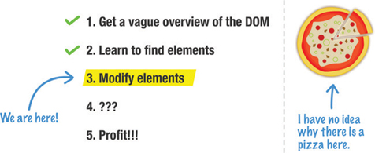
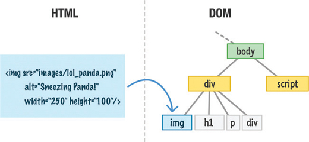
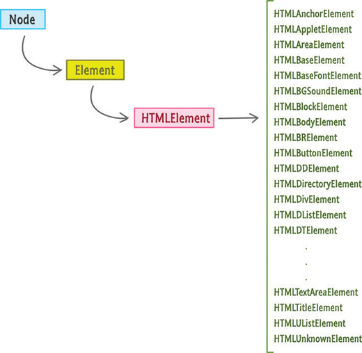
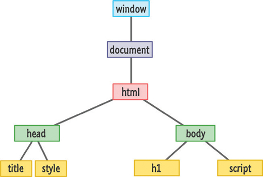

# 26. Modifying DOM Elements

* DOM Elements Are Objects—Sort of!
* Let’s Actually Modify DOM Elements


En este capítulo

* Comprender cómo se puede utilizar JavaScript para modificar el DOM.
* Conozca el elemento HTML
* Aprenda a modificar atributos.

En este punto, sabes un poco qué es el DOM. También vio cómo encontrar elementos usando `querySelector` y `querySelectorAll`. Lo siguiente es que aprendamos a modificar los elementos DOM que encontró:



Después de todo, ¿qué tiene de divertido tener un trozo gigante de arcilla (o masa para galletas) si no podemos poner nuestras manos sobre él y hacer un lío gigante? De todos modos, además de ser divertido y todo, nos encontraremos modificando el DOM todo el tiempo. Ya sea que usemos JavaScript para cambiar el texto de algún elemento, intercambiar una imagen por otra diferente, mover un elemento de una parte de su documento a otra, establecer un estilo en línea o realizar cualquiera de los millones de cambios que queremos hacer. , modificaremos el DOM. Este tutorial le enseñará los conceptos básicos de cómo hacerlo.

¡Adelante!

## LOS ELEMENTOS DOM SON OBJETOS - ¡UNA VARIEDAD DE!

Nuestra capacidad de usar JavaScript para modificar lo que muestra el navegador es posible gracias a un detalle importante. Ese detalle es que cada etiqueta HTML, regla de estilo y otras cosas que entran en su página tienen algún tipo de representación en el DOM.

Para visualizar lo que acabo de decir, digamos que tenemos un elemento de imagen definido en el markup:

```html

```

Cuando nuestro navegador analiza el documento y llega a este elemento de imagen, crea un nodo en el DOM que lo representa como se muestra en la Figura 26.1.



**FIGURA 26.1** *Todos nuestros elementos HTML eventualmente terminarán teniendo una representación DOM.*

Esta representación DOM nos proporciona la capacidad de hacer todo lo que podríamos haber hecho en el marcado. Como resultado, esta representación DOM en realidad termina permitiéndonos **hacer más con nuestros elementos HTML** de lo que podríamos haber hecho usando simplemente el marcado antiguo. Esto es algo que veremos un poco aquí y mucho en el futuro. La razón por la que nuestros elementos HTML son tan versátiles cuando se ven a través del DOM es porque comparten muchas similitudes con los objetos simples de JavaScript. Nuestros elementos DOM contienen propiedades que nos permiten get/set valores y llamar a métodos. Tienen una forma de herencia sobre la que vimos un poco antes, donde la funcionalidad que proporciona cada elemento DOM se distribuye entre los tipos base `Node`, `Element` y `HTMLElement`, como se ve nuevamente en la Figura 26.2.



**FIGURA 26.2** *La jerarquía de los elementos visuales que normalmente encontraremos en el HTML.*

Es probable que los elementos DOM incluso huelan a `Object` cuando corren dentro de la casa después de rodar un poco bajo la lluvia.

A pesar de todas las similitudes, por razones legales y ... posiblemente de salud, necesito proporcionar el siguiente descargo de responsabilidad: **el DOM nunca fue diseñado para imitar la forma en que funcionan los Objetos**. Muchas de las cosas que podemos hacer con objetos ciertamente podemos hacer con el DOM, pero eso se debe a que los proveedores de navegadores ayudan a garantizarlo. Las especificaciones del W3C no establecen que nuestro DOM deba comportarse de manera idéntica a cómo podemos esperar que se comporten las cosas con Objetos antiguos. Si bien no perdería el sueño preocupándome por esto, si alguna vez decides extender los elementos DOM o realizar gimnasia relacionada con objetos más avanzada, asegúrate de probar en todos los navegadores solo para asegurarte de que todo funciona como lo pretendías.

Ahora que dejamos de lado esta conversación incómoda, comencemos a modificar el DOM.

## MODIFICEMOS LOS ELEMENTOS DOM

Si bien ciertamente podemos relajarnos y aprender pasivamente todo lo que hay sobre cómo modificar elementos en el DOM, este es uno de esos casos en los que puede divertirse más siguiendo un ejemplo simple. Si está interesado en seguir adelante, usaremos el siguiente HTML como caja de arena para las técnicas que cubriremos:

```html
<!DOCTYPE html>
<html>

<head>
   <title>Hello...</title>

   <style>
      .highlight {
         font-family: "Arial";
         padding: 30px;
      }

      .summer {
         font-size: 64px;
         color: #0099FF;
      }
   </style>

</head>

<body>

   <h1 id="bigMessage" class="highlight summer">What's happening?</h1>

   <script>

   </script>
</body>

</html>
```

Simplemente ponga todo eso en un documento HTML y sígalo. Si obtiene una vista previa de este HTML en el navegador, verá algo que se parece a la Figura 26.3.


**FIGURA 26.3** *¿Lo que está sucediendo?*

Realmente no hay mucho que hacer aquí. El contenido principal es la etiqueta `h1` que muestra el texto **What’s happening?**:

```html
<h1 id="bigMessage" class="highlight summer">What's happening?</h1>
```

Ahora, cambiando al lado DOM de las cosas, la Figura 26.4 ilustra cómo se ve este ejemplo con todos los elementos y nodos HTML como `document` y `window` mapeados.



**FIGURA 26.4** *Cómo se ve nuestra estructura DOM para nuestro ejemplo.*

En las siguientes secciones, veremos algunas de las cosas comunes que puede hacer en términos de modificar un elemento DOM.

### Cambiando un Valor de texto de un Elemento

Comencemos con uno fácil. Muchos elementos HTML tienen la capacidad de mostrar texto. Ejemplos de tales elementos son nuestros **`headings`**, **`paragraphs`**, **`sections`**, **`inputs`**, **`buttons`**  y muchos más. Hay una cosa que todos tienen en común. La forma de modificar el valor del texto es setting la propiedad `textContent`.

Supongamos que queremos cambiar el texto que aparece en el elemento `h1` de nuestro ejemplo. El siguiente fragmento muestra cómo se vería:


Si realiza este cambio y obtiene una vista previa en el navegador, verá lo que se muestra en la Figura 26.5.


**FIGURA 26.5** *Cambiar el valor del texto de un encabezado.*

Veamos qué hicimos exactamente para provocar este cambio. **El primer paso para modificar cualquier elemento HTML en JavaScript es obtener primero una referencia a él**:

```js
let headingElement = document.querySelector("#bigMessage");
```

Aquí es donde entran nuestros viejos amigos `querySelector` y `querySelectorAll`. Como veremos más adelante, también tenemos formas indirectas de referenciar un elemento. Sin embargo, el enfoque directo que se muestra aquí es el que usaremos cuando tenga una idea muy específica de qué elemento o elementos desea apuntar.

Una vez que tenemos la referencia al elemento, podemos simplemente establecer la propiedad `textContent` en él:

```js
headingElement.textContent = "Oppa Gangnam Style!";
```

La propiedad `textContent` se puede leer como cualquier variable para mostrar el valor actual. También podemos establecer la propiedad como si estuviéramos aquí para cambiar el valor que está almacenado actualmente. Después de que se haya ejecutado esta línea, el valor original de nuestro marcado de **What’s happening?** será reemplazado en el DOM por lo que especificamos en JavaScript.

### Valores de Atributo

Una de las principales formas en que nuestros elementos HTML se distinguen es a través de sus atributos y los valores que estos atributos almacenan. Por ejemplo, los atributos `src` y `alt` son los que distinguen los siguientes tres elementos de imagen:

```html


```

Se puede acceder a cada atributo HTML (incluidos los datos personalizados `data-*`) a través de las propiedades que proporciona el DOM. Para ayudarnos a lidiar con los atributos, nuestros elementos exponen los métodos `getAttribute` y `setAttribute` que se explican por sí mismos.

El método `getAttribute` nos permite especificar el nombre de un atributo en el elemento en el que vive. Si se encuentra el atributo, este método devolverá el valor asociado con ese atributo. A continuación se muestra un ejemplo:

```html
<body>
   <h1 id="bigMessage" class="highlight summer">What's happening?</h1>

   <script>
      let headingElement = document.querySelector("h1");
      console.log(headingElement.getAttribute("id")); // bigMessage
   </script>
</body>
```

En este fragmento, observe que estamos obteniendo el valor del atributo `id` en nuestro elemento `h1`. Si especificamos un nombre de atributo que no existe, obtendremos un buen valor **`null`**. Lo contrario de obtener el valor de un atributo es establecer el valor. Para establecer el valor, usaríamos el método `setAttribute` con el nombre apropiado. Usamos este método llamando a `setAttribute` en el elemento que queremos afectar y especificando tanto el nombre del atributo como el valor que ese atributo almacenará.

Aquí hay un ejemplo de `setAttribute` en funcionamiento:


Estamos configurando (bueno ... ¡sobrescribiendo en realidad!) el atributo `class` en nuestro elemento `h1` para **bar foo**. La función `setAttribute` no realiza ninguna validación para garantizar que el atributo que estamos configurando sea válido para el elemento en el que lo estamos configurando. Nada nos impide hacer algo tonto de la siguiente manera:


Nuestro elemento `h1` no contiene un atributo `src`, pero podemos salirse con la suya al especificarlo. Cuando nuestro código se ejecuta, nuestro elemento `h1` incluso lucirá el atributo `src` ... probablemente de manera muy incómoda.

Hay algo que necesito aclarar antes de continuar. En los ejemplos sobre cómo usar `setAttribute` y `getAttribute`, elegí `id` y `class`. Para estos dos atributos, tenemos otra forma de establecerlos. Debido a lo comunes que son los atributos `id` y `class` de configuración, nuestros elementos HTML exponen las propiedades `id` y `className` directamente:

```html
<body>
   <h1 id="bigMessage" class="highlight summer">What's happening?</h1>

   <script>
      let headingElement = document.querySelector("h1");
      console.log(headingElement.id); // bigMessage

      headingElement.className = "bar foo";
  </script>
</body>
```

Volviendo a nuestro ejemplo, observe que cambié de usar `getAttribute` y `setAttribute` a usar las propiedades `id` y `className` en su lugar. El resultado final es idéntico. La única diferencia es que tenía una forma directa de establecer estos valores de atributo sin tener que usar `getAttribute` o `setAttribute`. Ahora, antes de continuar, tengo que decir algo extraño: sí ... no podemos usar `class` en JavaScript para referirnos al atributo de clase porque `class` tiene un significado completamente diferente que tiene que ver con tratar con objetos. Es por eso que usamos `className` en su lugar.

> 
> 
> Hay una forma mucho mejor de establecer valores de clase además de usar `className`. De esa manera es a través de la propiedad `classList` mucho más impresionante de la que aprenderá todo en el próximo capítulo.

<hr>

### El Mínimo Absoluto

Puede parecer un poco extraño terminar nuestra discusión sobre la modificación de elementos DOM en este punto. Si bien cambiar el texto de un elemento y los valores de los atributos es muy popular, no son de ninguna manera los únicos tipos importantes de modificaciones que realizará. La razón para terminar en este suspenso es porque manipular el DOM y usar las propiedades y métodos de un elemento para lograr nuestra tarea es fundamental para todo lo que veremos. En los capítulos siguientes, verá mucho más de lo que ha visto aquí.

Su principal conclusión de este capítulo es que los cambios de DOM que realice casi siempre adoptarán una de las dos formas siguientes:

* Setting una propiedad
* Calling a un método

Los métodos `textContent`, `setAttribute` y `getAttribute` que vio aquí cubren ambos enfoques, y verá muchos más de ellos y sus amigos en breve.

¡Este es un tema bastante pesado! Si tiene alguna pregunta, no se demore en recibir una respuesta. Publique en los foros en https://forum.kirupa.com lo antes posible.
