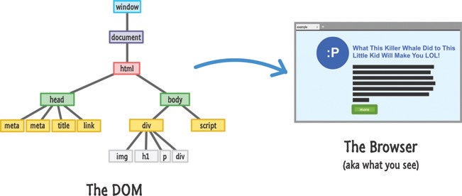
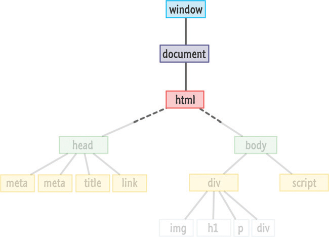

# 28. Traversing the DOM

* Finding Your Way Around
* Putting It All Together

En este capítulo

* Aprenda a navegar por el árbol DOM.
* Utilice las distintas API que tiene para mover y volver a re-parenting (criar) elementos
* Encuentra el hermano(sibling), el padre(parent), los hijos(children) y más de un elemento.

Como ya se habrá dado cuenta, nuestro DOM parece un árbol gigante, un árbol gigante con elementos colgando peligrosamente de las ramas y tratando de evitar las cosas puntiagudas que ensucian el lugar. Para ser un poco más técnico, los elementos de nuestro DOM están ordenados en una jerarquía como se ilustra en la Figura 28.1 que define lo que veremos eventualmente en el navegador.



**FIGURA 28.1** *El DOM y el navegador son como dos guisantes en una vaina.*

Esta jerarquía se utiliza para ayudar a organizar nuestros elementos HTML. También se utiliza para ayudar a nuestras reglas de estilo CSS a entender qué estilos aplicar en qué cosas. Desde el ángulo de JavaScript, esta jerarquía agrega un poco de complejidad. Pasaremos una buena cantidad de tiempo tratando de averiguar en qué parte del DOM nos encontramos en este momento y dónde debemos estar. Esto es algo que se hará más evidente cuando busquemos crear nuevos elementos o mover elementos. Esta complejidad es algo con lo que debemos sentirnos cómodos.

Ahí es donde entra en juego este tutorial. Para ayudarlo a comprender cómo navegar fácilmente de una rama a otra (básicamente, como un mono), el DOM le proporciona un puñado de propiedades que puede combinar con técnicas que ya conoce. Este tutorial le dará una descripción general de todo eso y más.

¡Adelante!

### Encontrar su camino

Antes de que podamos encontrar elementos y hacer cosas increíbles con ellos, primero debemos llegar a donde están los elementos. La forma más fácil de abordar este tema es comenzar desde arriba y deslizarse hacia abajo. Eso es exactamente lo que vamos a hacer.

La vista desde la parte superior de nuestro DOM se compone de nuestra `window`, `document` y elementos `html` como se muestra en la Figura 28.2.



**FIGURA 28.2** *La vista desde lo alto de este árbol nunca cambia.*

Debido a la importancia de estas tres cosas, el DOM nos proporciona un fácil acceso a ellas a través de `window`, `document` y `document.documentElement`:

```js
let windowObject = window; // um....
let documentObject = document;  // this is probably unnecessary
let htmlElement = document.documentElement;
```

Una cosa a tener en cuenta es que tanto la `window` como el `document` son propiedades globales. No tenemos que declararlos explícitamente como lo hice yo. Simplemente agítelos y úselos directamente del recipiente.
AQUIIIIIIIIIIII
Una vez que vayamos por debajo del nivel del elemento HTML, nuestro DOM comenzará a diversificarse y se volverá más interesante. En este punto, tenemos varias formas de navegar. Una forma que hemos visto en abundancia es mediante el uso de querySelector y querySelectorAll para obtener con precisión los elementos que nos interesan. Para muchos casos prácticos, estos dos métodos son demasiado limitantes.

A veces, no sabemos adónde queremos ir. Los métodos querySelector y querySelectorAll no nos ayudarán aquí. Solo queremos subirnos al coche y conducir ... y esperamos encontrar lo que estamos buscando. Cuando se trata de navegar por el DOM, nos encontraremos en esta posición todo el tiempo. Ahí es donde las diversas propiedades integradas que proporciona DOM nos ayudarán, y veremos esas propiedades a continuación.

Lo que nos ayudará es saber que todos nuestros elementos en el DOM tienen al menos una combinación de padres, hermanos e hijos en quien confiar. Para visualizar esto, observe la fila que contiene los elementos div y script como se muestra en la Figura 28.3.

Imagen
FIGURA 28.3

Un ejemplo de nuestro árbol con algunos padres, hermanos e hijos.

Tanto el elemento div como el script son hermanos. La razón por la que son hermanos es porque comparten el elemento del cuerpo como sus padres. El elemento script no tiene hijos, pero el elemento div sí. Img, h1, p y div son hijos del elemento div, y todos los hijos del mismo padre también son hermanos. Al igual que en la vida real, la relación entre padres, hijos y hermanos se basa en el lugar del árbol en el que nos centramos. Casi todos los elementos, dependiendo del ángulo con el que los miremos, pueden desempeñar múltiples roles familiares.

Para ayudarnos a superar todo esto, tenemos un puñado de propiedades en las que confiaremos. Estas propiedades son firstChild, lastChild, parentNode, children, previousSibling y nextSibling. Con solo mirar sus nombres, debería poder inferir qué papel juegan estas propiedades. El tipo de rojo con la horquilla puntiaguda está en los detalles, así que veremos esto con mayor detalle a continuación.

Tratar con hermanos y padres
De estas propiedades, las más fáciles de tratar son los padres y hermanos. Las propiedades relevantes para esto son parentNode, previousSibling y nextSibling. El siguiente diagrama representado por la figura 28.4 le da una idea de cómo funcionan estas tres propiedades.

Imagen
FIGURA 28.4

La relación entre hermanos y padres desde el punto de vista de nuestro DOM.

Este diagrama está un poco ocupado, pero puedes distinguir lo que está sucediendo aquí. La propiedad parentNode le apunta a padre del elemento. Las propiedades previousSibling y nextSibling permiten que un elemento encuentre su hermano anterior o siguiente. Puede ver esto visualizado en el diagrama simplemente moviéndose en la dirección de la flecha. En la última línea, nextSibling de nuestro img es el div. El hermano anterior de nuestro div es el img. Acceder a parentNode en cualquiera de estos elementos lo llevará al div principal en la segunda fila. Todo es bastante sencillo.

¡Tengamos algunos hijos!
Lo que es un poco menos sencillo es cómo encajan los niños en todo esto, así que echemos un vistazo a las propiedades firstChild, lastChild y children que se muestran en la Figura 28.5.

Imagen
FIGURA 28.5

¡Una vista de niños y más niños!

Las propiedades firstChild y lastChild se refieren al primer y último elemento secundario de un padre. Si el padre solo tiene un hijo, como es el caso del elemento body en nuestro ejemplo, tanto firstChild como lastChild apuntan a lo mismo. Si un elemento no tiene hijos, estas propiedades devuelven un valor nulo.

La más complicada en comparación con las otras propiedades que hemos analizado es la propiedad de los niños. Cuando accede a la propiedad de los niños en un padre, básicamente obtiene una colección de los elementos secundarios que tiene el padre. Esta colección no es una matriz, pero tiene algunos poderes similares a una matriz. Al igual que con una matriz, puede iterar a través de esta colección o acceder a los elementos secundarios de forma individual, como lo que ve en el diagrama. Esta colección también tiene una propiedad de longitud que le dice el recuento de cuántos hijos tiene el padre. Si su cabeza está dando vueltas por esto, no se preocupe. Los fragmentos de la siguiente sección ayudarán a aclarar la vaguedad de mi explicación.

Poniendolo todo junto
Ahora que tenemos una buena idea de todas las propiedades importantes que tenemos para atravesar el DOM, veamos algunos fragmentos de código que unen todos los diagramas y palabras en algunas líneas dulces de JavaScript.

Comprobando si existe un niño
Para comprobar si un elemento tiene un hijo, podemos hacer algo como lo siguiente:

Haga clic aquí para ver la imagen del código

let bodyElement = document.querySelector ("cuerpo");

if (bodyElement.firstChild) {
  // haz algo interesante
}
Esta declaración if devolverá un valor nulo si no hay hijos. También podríamos haber usado bodyElement.lastChild o bodyElement.children.count si te gusta escribir, pero prefiero mantener las cosas simples.

Acceder a todos los elementos secundarios
Si queremos acceder a todos los hijos de un padre, siempre podemos confiar en el buen tío para el ciclo:

Haga clic aquí para ver la imagen del código

let bodyElement = document.body;

for (sea i = 0; i <bodyElement.children.length; i ++) {
  let childElement = bodyElement.children [i];

  document.writeln (childElement.tagName);
}
Observe que estamos usando la propiedad de propiedades de longitud e hijos tal como lo haríamos con una matriz. Lo que hay que tener en cuenta es que esta colección en realidad no es una matriz. Casi todos los métodos Array que deseemos utilizar no estarán disponibles en esta colección devuelta por la propiedad children.

Caminando por el DOM
Nuestro último fragmento trata un poco de todo lo que hemos visto hasta ahora. Este fragmento recorre el DOM de forma recursiva y toca todos los elementos HTML que puede encontrar:

Haga clic aquí para ver la imagen del código

función theDOMElementWalker (nodo) {
  if (node.nodeType == Node.ELEMENT_NODE) ​​{

    console.log (node.tagName);
    node = node.firstChild;

    while (nodo) {
      theDOMElementWalker (nodo);
      nodo = nodo.nextSibling;
    }
  }
}
Para ver esta función en acción, simplemente la llamamos pasando un nodo desde el que queremos comenzar nuestra caminata:

Haga clic aquí para ver la imagen del código

let texasRanger = document.querySelector ("# texas");
theDOMElementWalker (texasRanger);
En este ejemplo, estamos llamando a la función DOMElementWalker en un elemento al que hace referencia la variable texasRanger. Si desea ejecutar algún código en el elemento que encontró este script, reemplace la línea comentada con lo que desee hacer.

El Mínimo Absoluto

Descubrir el DOM es una de esas habilidades con las que todo desarrollador de JavaScript debería estar familiarizado. Este tutorial le proporcionó una descripción general de lo que es técnicamente posible. Aplicar esto de maneras más prácticas recae completamente en ti ... o en un amigo genial que te ayude con estas cosas. Dicho esto, en tutoriales posteriores, ampliaremos lo que hemos visto aquí como parte de continuar nuestra inmersión profunda en todo lo que podemos hacer con DOM. ¿No suena emocionante?

¿Tienes alguna pregunta? ¡Dirígete a https://forum.kirupa.com para obtener una respuesta de desarrolladores amigables como tú!
