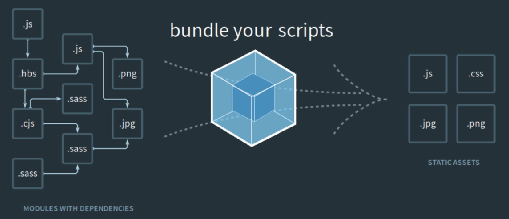

# Front Matter

#### Mohamed Bouzid
### Webpack for Beginners
### Your Step-by-Step Guide to Learning Webpack 4

Mohamed Bouzid</br>
NA, Morocco

Cualquier código fuente u otro material complementario al que haga referencia el autor en este libro está disponible para los lectores en GitHub a través de la página del producto del libro, ubicada en www.Apress.Com/9781484258958. Para obtener información más detallada, visite http://www.Apress.Com/source-code.

ISBN 978-1-4842-5895-8e-ISBN 978-1-4842-5896-5
https://doi.org/10.1007/978-1-4842-5896-5</br>
© Mohamed Bouzid 2020

#### ¿Por qué Webpack?

La primera pregunta que cualquiera debe hacerse antes de usar cualquier herramienta es "¿POR QUÉ?" ¿Por qué lo necesito y cuál es el beneficio? Si casi no tiene idea sobre el webpack, entonces es muy probable que ya esté haciendo estas preguntas, para mí, la situación fue que el marco con el que solía trabajar decidió cambiar a webpack para la gestión de activos/JavaScript, y como resultado yo mismo estoy luchando por entender cómo funciona webpack y preguntándome cómo hacer el cambio para ajustar mi código en consecuencia, si esto le suena familiar, este libro lo ayudará.

En la siguiente introducción, discutiremos un poco sobre por qué webpack y por qué debería preocuparte por él. Si está buscando una respuesta rápida, debería ser la siguiente: ¡su desarrollo de JavaScript será divertido y mucho más fácil! ¿Demasiado bueno para ser verdad?

Lo admito, no era un fanático de webpack, y la razón fue que nunca tomé los pasos necesarios para aprenderlo o entenderlo. De hecho, estaba tomando el enfoque equivocado, tratando de copiar fragmentos de aquí y allá, o buscando respuestas rápidas en Internet para averiguar por qué falló mi compilación de JavaScript. La mayoría de las veces me quedé atrapado durante largas horas buscando sin adelantarme a lo que se suponía que debía hacer. Durante ese tiempo, comencé a notar que otras personas se quejaban de webpack, preguntaban cómo instalar esto o aquello y por qué sus bibliotecas de terceros preferidas ya no funcionaban, especialmente en el mundo de los frameworks. Fue un sentimiento compartido y, para ser honesto, aprender otra herramienta de JavaScript no fue una opción divertida, así que me mantuve estancado hasta que cambié de opinión. Fue entonces cuando decidí resolver las cosas por mí mismo, lo que me ha llevado a un largo viaje con webpack, pero si alguien me hubiera entregado un libro como este en ese entonces, sin ninguna duda, me hubiera ahorrado mucho tiempo, frustración, y muchas horas de prueba y error.

JavaScript se está volviendo cada vez más complejo, y si tiene un gran proyecto o aplicación que algún día crecerá hasta cierto tamaño, el webpack eventualmente le salvará el día (veremos cómo en los próximos capítulos). Una de las principales cosas que hará webpack por usted es compilar su JavaScript en un archivo o más. Por ejemplo, puede tener dos scripts finales si prefiere llamar a un archivo JS en una página y al segundo en otra página.

Compilar su JavaScript en un archivo evitará múltiples accesos al servidor. Imaginemos que está utilizando muchas bibliotecas de terceros como jQuery, Tinymce, Bootstrap, Loadash, etc.

En lugar de llamar a cada uno por separado así:

```js
<script src=”/assets/javascripts/jquery.js” /></script>
<script src=”/assets/javascripts/tinymce.js” /></script>
<script src=”/assets/javascripts/bootstrap.js” /></script>
<script src=”/assets/javascripts/loadash.js” /></script>
<script src=”/assets/javascripts/some_other_library.js” /></script>
```

Puede poner todas sus bibliotecas de terceros en un archivo vendor.js y llamarlo en su HTML con una línea:

```js
<script src="/assets/javascripts/vendor.js" /></script>
```

El mismo principio se aplica a sus propios archivos JavaScript. Además, puede agregar una cadena hash al nombre de sus archivos para eliminar el caché y reducir la carga de tiempo de su site/app. Webpack lo tiene cubierto.

¿Es esto todo lo que el Webpack hará por mí? Si alguna vez ha utilizado otra herramienta de compilación como gulp o Grunt, estas herramientas ya lo estaban haciendo y lo estaban haciendo realmente bien. Todo su código JS, por ejemplo, se concatenó y compiló en un archivo con una cadena hash (para almacenamiento en caché) y la vida fue mucho más fácil. Sin embargo, ¿alguna vez ha pensado en las variables globales y la colisión al concatenar varios archivos en uno y cómo pueden causar un problema si no usa clases o envuelve el código de cada archivo con una expresión de función inmediatamente invocada?

Bueno, con webpack, todos estos problemas se resuelven de inmediato, sin necesidad de reinventar la rueda. Además, una de las características que más me gustan de webpack es cómo administrará las dependencias por ti, y decidirá qué archivo es necesario cargar antes que otro, etc. Me enfrenté a esta situación en uno de mis proyectos y fue un gran problema, un dolor para realizar un seguimiento de cada archivo que necesitaba cargar, y cuál depende del otro para poder configurarlos en el orden correcto. Quizás tiene un pequeño proyecto en este momento y no ve el beneficio. Pero a medida que su JavaScript sigue creciendo, verá cuánto beneficio le brindará Webpack y estará agradecido de haber tomado la decisión correcta desde el principio.

Eso no es todo. Webpack también puede administrar su HTML, CSS, IMÁGENES y otros archivos como fuentes (a través de loaders y plugins). Creo que la mejor manera de pensarlo es como un administrador de sus activos. Si alguna vez visitó el sitio web oficial del paquete web https://webpack.js.org/, probablemente haya visto la siguiente imagen.



Esta ilustración muestra cómo cada uno de sus archivos (en el lado izquierdo) puede tener una o más dependencias (sus archivos pueden ser de diferentes tipos como png, sass, js, jpg, cjs, etc.) y cómo webpack puede encargarse de ellos y convertir todo este caos en uno o más archivos organizados para servir sus activos.

Webpack puede hacer mucho más de lo que he descrito hasta ahora, y veremos las muchas cosas que puede hacer con esta poderosa herramienta a través de ejemplos concretos en los siguientes capítulos.

Webpack es un tema vasto, y siempre se le agregan cosas nuevas y mejoras. Mi objetivo no es cubrir todo al respecto, sino ayudarlo a comprender cómo funciona para que pueda usarlo en su trabajo diario (probablemente con su propio web framework) sin tener problemas para comprender por qué se hacen las cosas de cierta manera, o por qué usamos este loader, alias, etc. En resumen, esto te ayudará a dejar de decir: "¡No sé cómo funciona, pero funciona!"


Otra cosa que debe saber (como se mencionó anteriormente) es que la mayoría de los frameworks web han adoptado webpack recientemente para construir y compilar JavaScript; y si está utilizando un framework como Symfony o Rails, etc., puede encontrar que el webpack ya está configurado y listo para usar de inmediato. Esto por sí solo es una gran ventaja si tuviera que configurarlo usted mismo, pero para poder usarlo, creo que necesita aprender un poco sobre la configuración y cómo funcionan los loaders y plugins. Una vez que aprenda eso, podrá ver una imagen muy clara de cómo se usarán las cosas al tratar con su JS dentro de su framework X o Y. Entonces, ya sea que esté usando un webpack con un framework o no, confíe en mí y aprendamos los fundamentos que lo convertirán en un solucionador de problemas cuando se trata de usar el webpack.

### Table of Contents

#### Chapter 1: Webpack: First Steps
* Installing Webpack
* Webpack 4 Zero Config
* The Bundling Command
* Summary

#### Chapter 2: Write Modular Code
* Separate in Multiple Files
   * Calling a Function from an External File
* Webpack Custom Configuration
   * Creating Our Configuration File
   * Altering the Default Output
* Development Mode
* Summary

#### Chapter 3: Loaders and Plugins
* Loaders vs. Plugins
* Using Babel-Loader
* Debugging Our JavaScript
   * Source Map
* Handling CSS and SASS Files
   * Importing CSS in JavaScript
   * Loading CSS with CSS-Loader
   * Injecting CSS to Our HTML
   * Compiling SASS to CSS
   * Prefixing CSS with Vendor Prefixes
   * Extract CSS to Its Own Separate File
   * Minifying the Extracted CSS
* Handling Images
   * Loading Image Files
   * Compressing Images
* Summary

#### Chapter 4: Cache
* Output Files Naming
* Adding Hash Content
* Cleaning the Build Directory
* Manifest Plugin
* Alternative to Manifest
* Summary

#### Chapter 5: Resolving Folders
* Organizing Our Files
* Aliases
* Resolving Modules
* Summary

#### Chapter 6: Webpack DevServer
* Installing and Configuring Webpack Dev Server
* Understanding publicPath option
* Hot Module Replacement
* Summary

#### Chapter 7: Installing Third-Party Libraries
* Welcome Isolation, Goodbye Global Variables
* Using Bootstrap with Webpack
* Webpack ProvidePlugin
* Installing jQuery-UI
* Installing QuillJS
* Installing CKEDITOR
* Lazy Loading
* Summary

#### Chapter 8: Conclusion
* Index
