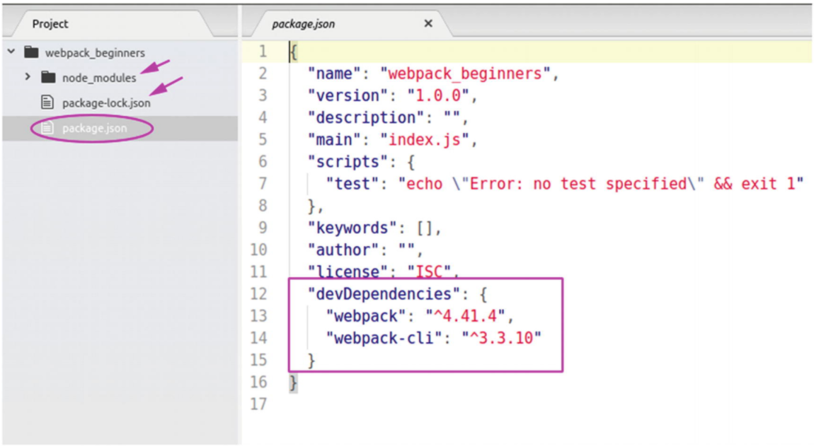
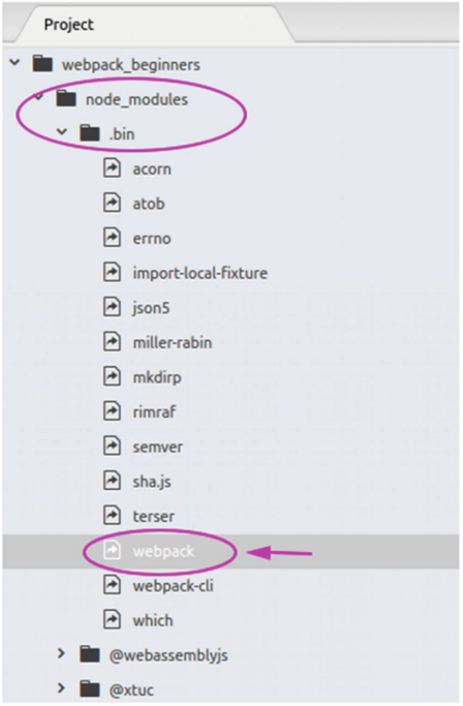
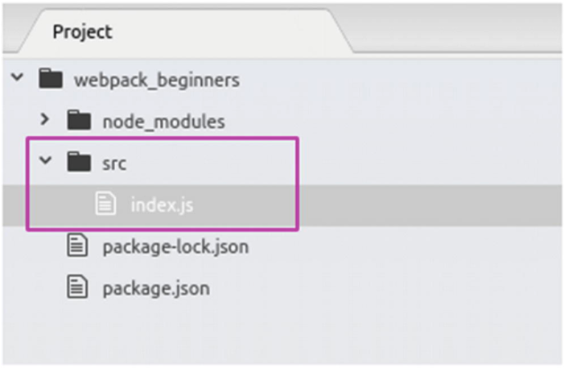
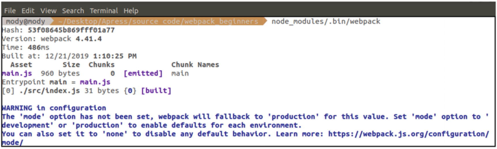
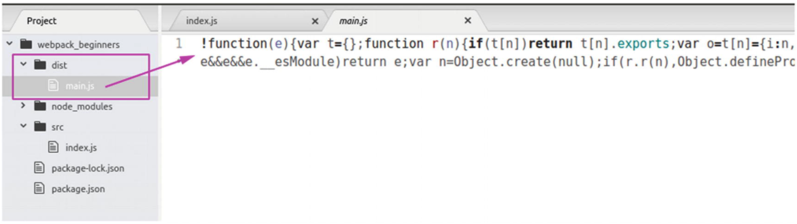
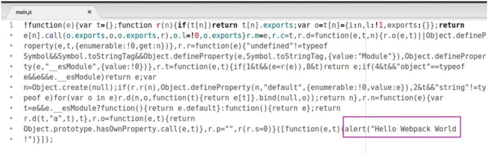
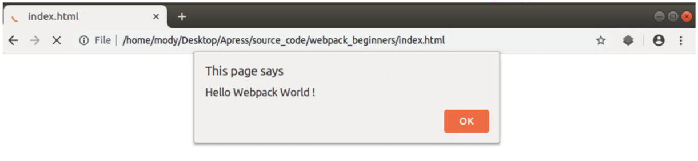

# Chapter 1: Webpack: First Steps

* Installing Webpack
* Webpack 4 Zero Config
* The Bundling Command
* Summary

En este primer capítulo, comenzaremos por sentar las bases de nuestro trabajo instalando las herramientas que necesitamos para ejecutar webpack en nuestra máquina local. Luego hablaremos un poco sobre la configuración predeterminada que ha introducido webpack con la versión 4, llamada "configuración cero". A continuación, escribiremos nuestro primer ejemplo de “hola mundo”, que como ya sabrá, es un estándar obligatorio cuando se comienza a aprender algo nuevo. Finalmente, hablaremos muy brevemente sobre el comando de empaquetado del paquete web que usaremos para construir nuestros archivos de salida finales.

## Instalación de Webpack

En primer lugar, debe tener Node JS instalado en su máquina porque webpack se basa en él. Si no tiene Node instalado, puede ir a https://nodejs.org/en/download/ y seguir las instrucciones según su sistema operativo.

Para verificar si tiene Node JS en su sistema, abra la terminal y escriba lo siguiente:

```sh
$ node -v
```

El siguiente paso después de asegurarnos de que Node JS esté instalado en nuestra máquina es crear nuestro directorio/carpeta de trabajo, que llamaremos "webpack_beginners". Dependiendo de su preferencia, es posible que lo haya creado manualmente o mediante un terminal como el siguiente:

```sh
$ mkdir webpack_beginners
$ cd webpack_beginners
```

Una vez que esté en la carpeta webpack_beginners, use el siguiente comando para iniciar un archivo JSON básico:

```sh
$ npm init -y
```

Esto creará un archivo llamado package.json que guardará referencias a nuestros módulos instalados.

A través de `npm`, la opción `-y` es responder sí a todas las preguntas solicitadas; no es tan importante para nosotros en esta etapa, así que simplemente diremos que sí a todo.

Si abre el archivo `package.json` generado, verá algo similar a lo que se muestra en el Listado 1-1.

```js
{
  "name": "webpack_beginners",
  "version": "1.0.0",
  "description": "",
  "main": "index.js",
  "scripts": {
    "test": "echo \"Error: no test specified\" && exit 1"
  },
  "keywords": [],
  "author": "",
  "license": "ISC"
}
```
***Listado 1-1*** `package.json`: Un archivo JSON básico generado 

El archivo `package.json` servirá para que NPM identifique nuestro proyecto (nombre, versión, autor, archivo de entrada principal ...) y maneja las dependencias de terceros necesarias para que sea completamente funcional. Suponiendo que está creando una biblioteca JS que desea compartir en GitHub, etc., es posible que le interese cambiar el nombre y la versión anteriores, y tal vez escribir una descripción también. Pero ese no es nuestro enfoque aquí, para ver más de lo que este archivo `package.json` hará por nosotros, instalemos webpack usando nuestra línea de comando:

```sh
$ npm install webpack webpack-cli --save-dev
```

Tenga en cuenta que, ya sea que esté en Linux, Mac o Windows, el comando es básicamente el mismo, asumiendo que ya tiene NPM instalado en su máquina, lo que ocurre principalmente si siguió la instalación de Node JS correctamente. La opción `--save-dev` es decirle a NPM que necesitamos esto solo para nuestros propósitos de desarrollo, lo que significa que estos paquetes se instalarán solo en nuestra máquina local.

El comando anterior nos instalará webpack con su propia CLI (interfaz de línea de comandos). Una vez que finalice el comando de instalación, abra el archivo `package.json` y debería ver algo similar a lo que se muestra en la Figura 1-1.










