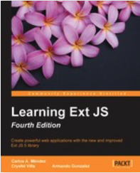

# Learning Ext JS - Fourth Edition

* by Carlos A. Méndez, Crysfel Villa, Armando Gonzalez
* Pages 452
* Publisher: Packt Publishing
* Release Date: July 2015
* ISBN: 9781784394387
* Topic: Ext JS

### Descripción del Libro

**Cree potentes aplicaciones web con la nueva y mejorada biblioteca Ext JS 5**

**En detalle**

La nueva biblioteca Sencha Ext JS 5 ofrece cientos de componentes y API para crear aplicaciones sólidas y satisface las necesidades críticas de los clientes de todo el mundo. La nueva versión 5 está repleta de nuevos temas y la arquitectura MVVM que le permite conectar la capa del modelo a la vista y actualizar automáticamente el modelo cuando se modifica la vista y viceversa.

Este libro cubre muchas características y componentes nuevos de Ext JS 5. Al principio, aprenda los conceptos básicos de Sencha Ext JS, componentes, modelos de datos y mapeo. Este libro también le enseña sobre desarrollo impulsado por eventos, formularios y cuadrículas, gráficos y temas, y complementos de terceros. Más adelante en el libro, aprenderá las implementaciones del Tree panel, the MVC pattern y una característica completamente nueva llamada MVVM. Si trabaja secuencialmente en cada capítulo y sigue las guías paso a paso, podrá crear una aplicación básica.

#### Lo que vas a Aprender

* Cree aplicaciones con potentes componentes web diseñados para una experiencia de usuario final sencilla
* Descubra cómo funciona Ext JS y cómo hacer un buen uso de esta herramienta
* Comprender los conceptos básicos de las aplicaciones web con Ext JS
* Utilice las nuevas funciones de la versión 5 en sus aplicaciones
* Cree aplicaciones web ágiles y receptivas utilizando Ext JS
* Comprender el modelo de aplicación MVVM para conectar la capa del modelo a la vista.
* Personalice fácilmente el tamaño, el espaciado, los colores, las fuentes, etc. en los nuevos temas táctiles

### Table of Contents

* Learning Ext JS Fourth Edition
   * Table of Contents
   * Learning Ext JS Fourth Edition
   * Credits
   * About the Authors
   * About the Reviewers
   * www.PacktPub.com
      * Support files, eBooks, discount offers, and more
         * Why subscribe?
         * Free access for Packt account holders

   * Preface
      * What this book covers
      * What you need for this book
      * Who this book is for
      * Conventions
      * Reader feedback
      * Customer support
         * Downloading the example code
         * Errata
         * Piracy
         * Questions

1. An Introduction to Ext JS 5
   * Considering Ext JS for your next project
   * Getting started with Ext JS
      * Downloading Ext JS
      * Setting up and installing Ext JS 5
         * Sencha Cmd
      * Why so many files and folders?
         * Folders that changed in version 5 from previous versions
      * Looking at the whole picture

   * Our first program
      * Writing the Ext JS code
      * Adding interaction to the program
   * Tools and editors
      * XAMPP or WAMP
      * Aptana
      * Sencha Architect
   * What's new in Ext JS 5?
   * Summary

2. The Core Concepts
   * The class system
      * Naming conventions
      * Writing your first class
      * Simple inheritance
      * Preprocessors and postprocessors
      * Mixing many classes (the use of mixins)
      * An explanation of mixins
         * Using the mixinConfig property
         * Configurations
      * Statics methods and properties
         * Explanation
      * The Singleton class
      * Aliases

   * Loading classes on demand
      * Enabling the loader

   * Working with the DOM
      * Getting elements
      * Query – how do we find them?
      * DOM manipulation – how do we change it?
   * Summary

3. Components and Layouts
   * The component life cycle
      * The initialization phase
      * The rendering phase
      * The destruction phase
      * The lifecycle in action

   * About containers
      * Types of containers
      * The viewport
      * The panel
         * Panels versus containers
      * The Window component

   * The layout system
      * The Border layout
      * The Fit layout
      * The Card layout
      * The Accordion layout
      * The Anchor layout

   * More layouts
   * Comments about using layouts
   * Summary

* 4. It's All about the Data
   * Ajax
      * Passing parameters to Ajax request
      * Setting timeout to Ajax request calls
   * Models
      * Mappings
      * Validators
      * Custom field types
      * Relationships
         * One-to-many associations
         * One-to-one associations
   * Working with the store
      * Adding new elements
      * Looping through the records/models in the store
      * Retrieving the records in the store
         * By index position
         * First and last records
         * By range
         * By ID
      * Removing records

   * Retrieving remote data
      * Ajax proxy
      * Readers
         * XML reader
   * Sending data
   * Summary

5. Buttons and Toolbars
   * Event-driven development
   * Creating a simple button
      * Setting icons on buttons
      * Icon alignment on buttons
      * Handling button events
   * Segmented buttons
   * Adding menus
   * Toolbars
      * Toolbar button groups
   * The breadcrumb bar
      * Handling selections in the breadcrumb bar
   * The main menu for our application
   * Summary

6. Doing It with Forms
   * The form component
      * The anatomy of the fields
   * The available fields
      * The TextField class
      * The number field
      * The ComboBox field
      * The Tag field
      * The Date field
      * The Checkbox and the CheckboxGroup fields
      * The Radio and RadioGroup buttons
   * The field container
   * Triggers
   * Submitting the data
   * Summary

7. Give Me the Grid
   * The data connection (models and stores)
   * A basic grid
   * Columns
      * The column row number
      * The number column
      * The template column
      * The date column
      * The Boolean column
      * The check column
      * The action column
   * Column renderers
   * The Widget column
   * Selection models
   * Grid listeners
   * Features
      * Ext.grid.feature.Grouping
      * Ext.grid.feature.GroupingSummary
      * Ext.grid.feature.RowBody
      * Ext.grid.feature.Summary
   * Plugins
      * Ext.grid.plugin.CellEditing
      * Ext.grid.plugin.RowEditing
   * Grid paging
   * Infinite scrolling
   * Summary

8. DataViews and Templates
   * The data connection (model and store)
   * A basic DataView
   * Handling events in DataView
   * Templates
      * Ext.Template
      * Ext.XTemplate
   * A more complex DataView component
   * Summary

9. The Tree Panel
   * A basic tree panel
   * The TreeStore
   * Tree nodes
   * Adding and removing nodes
   * The check tree
   * The tree grid panel
   * Summary

10. Architecture
   * The MVC and MVVM patterns
      * Model-View-Controller (MVC)
      * Model-View-ViewModel (MVVM)
   * Creating our first application
      * The views
      * The controller
         * Listening to events
         * Opening modules
   * Creating a module
      * ViewController
      * ViewModel
      * Binding and data binding
   * Router – implementing and using
   * Summary

11. The Look and Feel
   * Setting up our environment
   * The packages folder
   * Variables
   * Advanced theming
      * Changing the component's style
      * Adding new gradients
      * Styling the tabs
      * Adding custom fonts to our theme
   * Different styles for the same component
   * Supporting legacy browsers
   * Summary

12. Responsive Configurations and Tablet Support
   * Overview
      * New themes
      * Neptune touch and Crisp touch
   * Implementing responsiveness to the application
      * Creating responsiveness
      * Investigating the output
      * Checking all panels
   * Summary

13. From Drawing to Charting
   * Basic drawing
   * Adding interaction
   * Charts
      * Legend
      * Axis
      * Series
      * Themes
   * Series examples
      * Bar charts (building our first chart)
      * Pie charts
   * More charts
   * Introducing chart themes
   * Enhancing our application with charts
   * Summary

14. Finishing the Application
   * Preparing for deployment
      * The app.json file
   * The Sencha command
      * Customizing the build.xml file
      * Compressing the code
      * Packaging and deploying
   * Testing the application
   * Summary

15. What's Next?
   * Forums
   * Resources
   * Third-party plugins (commercial)
   * Third-party plugins (free)
   * The future
   * Final thoughts
   * Summary

* Index
