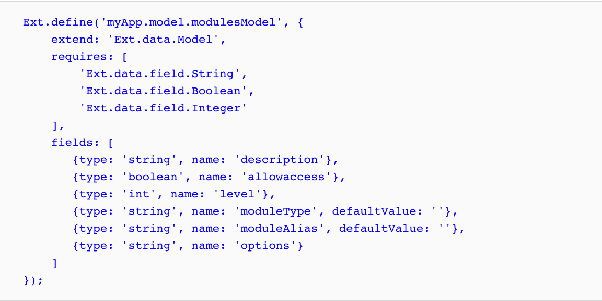
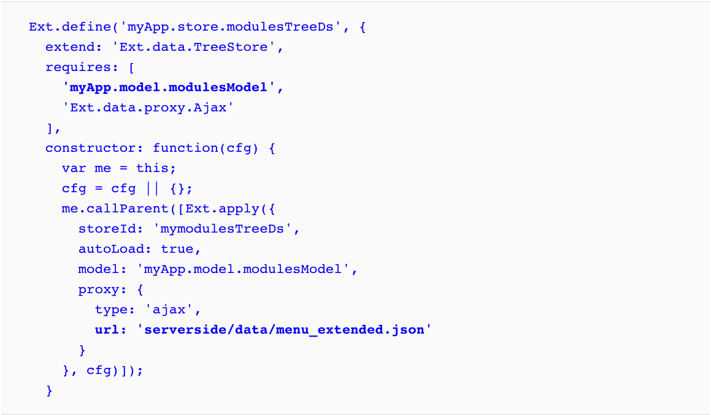
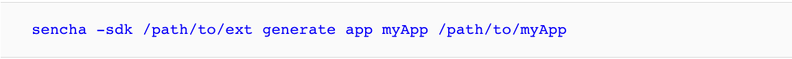
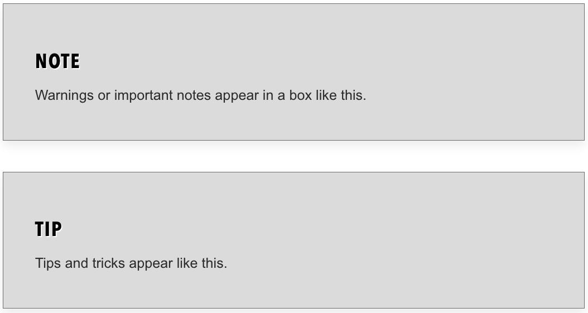

# Prefacio

* Que cubre este libro
* Que necesitas para este libro
* Para quien es este libro
* Convenciones
* Comentarios de los lectores
* Atención al cliente
   * Descargando el código de ejemplo
   * Errata
   * Piratería
   * Preguntas

# Prefacio

En los últimos años, Ext JS se ha convertido en un marco de JavaScript potente y popular para el desarrollo de aplicaciones de escritorio. Para un desarrollador de Ext JS, la curva de aprendizaje no es muy fácil/rápida y he visto casos en los que los desarrolladores que aprenden este framework encuentran que es un proceso lento. Mientras escribía este libro, estaba pensando en los puntos más fáciles y comprensibles para que pueda comprender los conceptos básicos, tal como me hubiera gustado aprender sobre el framework si estuviera en su lugar.

Este libro está dirigido a desarrolladores que desean aprender y comenzar a usar este framework para sus aplicaciones, y también a desarrolladores que no han comenzado a usar la versión actual. Está escrito como una guía fácil de seguir que lo ayudará a comprender los conceptos básicos y los fundamentos del marco. Si tiene experiencia con versiones anteriores del framework, este libro puede aclarar muchas de sus dudas sobre la actualización y cómo suceden las cosas en la versión 5.x.

Este libro cubre toda la información básica que necesita saber para comenzar el desarrollo con este framework agradable y poderoso.

## Que cubre este libro

**El Capítulo 1**, ***Introducción a Ext JS 5***, cubre una explicación de cómo comenzar obteniendo el framework (descargando el archivo) y configurando los requisitos básicos que necesita para comenzar a codificar. Este capítulo también proporciona una explicación de cómo está estructurado el framework, cómo configurar algunas herramientas necesarias y da un vistazo rápido al producto, Sencha Architect.

**El Capítulo 2**, ***Conceptos Básicos***, trata sobre el sistema de clases del marco y le indica cómo utilizar la programación orientada a objetos con Ext JS. Además, este capítulo explica cómo extender clases, cómo heredar propiedades y el uso del sistema Loader para definir y requerir dependencias de forma dinámica.

**El Capítulo 3**, ***Componentes y Layouts(diseños)***, explica cómo funcionan los componentes, cómo se crean, su ciclo de vida y cómo aprovechar todo esto. Aquí, también aprenderá sobre los tipos de contenedores y el sistema de diseño, que lo ayudarán a crear interfaces de usuario increíbles con poco esfuerzo.

**El Capítulo 4**, ***Se trata de los Datos***, explica cómo el framework maneja y manipula los datos para mostrar información utilizando componentes o widgets con reconocimiento de datos.

**El Capítulo 5**, ***Buttons y Toolbars***, le muestra cómo utilizar los eventos de componentes; escuchar(listen) eventos; (principalmente) crear botones, toolbars y menús; y establezca las configuraciones más básicas para estos componentes.

**El Capítulo 6**, ***Cómo hacerlo con Formularios***, habla sobre el componente de form, los campos disponibles que podemos usar en nuestros formularios y cómo recopilar y enviar datos.

**El Capítulo 7**, ***Give Me the Grid***, cubre los conceptos básicos del componente más popular, el Grid panel, en el framework, cómo implementarlo, su modelo de columna y renderizadores de datos personalizados para mostrar datos. También vemos cómo escuchar eventos en el panel Grid y miramos algunos complementos y características (capacidades específicas) que se pueden implementar en el grid.

**El Capítulo 8**, ***DataViews y Templates***, explica cómo hacer uso de DataViews y Templates para crear vistas con reconocimiento de datos, implementar una buena organización de nuestros datos y establecer estilos y lógica personalizada para la representación de datos.

**El Capítulo 9**, ***El Tree Panel***, cubre el uso del componente del tree panel y su implementación. También explica cómo crear stores y datos para este componente.

**El capítulo 10**, ***Arquitectura***, es uno de los capítulos más importantes del libro. Muestra cómo crear una aplicación utilizando los patrones MVC y MVVM. Esto se hace para crear aplicaciones que puedan ser escalables y fáciles de mantener. El patrón MVVM, que es un patrón poderoso para reducir el código, se introduce en la versión 5.

**El Capítulo 11**, ***The Look and Feel,***(El mirar y sentir), demuestra cómo crear nuevos temas dentro del framework y las aplicaciones dando a nuestras aplicaciones un nuevo aspecto y algunos cambios de color (temas). Además, aprenderá a crear interfaces de usuario específicas de estilo de componentes utilizando Compass y Sass.

**El Capítulo 12**, ***Responsive Configurations y Tablet Support,***, explica cómo podemos usar los temas de la pantalla táctil y cómo establecer configuraciones receptivas en los componentes para que esos componentes sean receptivos.

**El Capítulo 13**, ***Del Drawing a Charting***, trata sobre los conceptos básicos del dibujo y la creación de gráficos. Vemos cómo crear gráficos mediante el uso de motores SVG/VML. Este capítulo también explica cómo agregar el paquete Chart a las aplicaciones y el motor de temas introducido en la versión 5.

**El Capítulo 14**, ***Finalización de la Aplicación***, cubre cómo preparar nuestra aplicación para el entorno de producción y la implementación, cubriendo las partes más esenciales para la producción final.

**El Capítulo 15**, ***¿Qué sigue?*** Le muestra dónde obtener más comentarios y recursos, como foros, otros recursos útiles para obtener tutoriales de información, etc. Este capítulo también ofrece un adelanto de algunos complementos útiles (comerciales y gratuitos).

### Que necesitas para este libro

Los navegadores web recomendados para su uso son los siguientes:

* Google Chrome: http://www.google.com/chrome
* Firefox: https://www.mozilla.org/en-US/firefox/new/
* Firefox para desarrolladores: https://www.mozilla.org/en-US/firefox/developer/

Estos navegadores son útiles porque vienen con herramientas de depuración para facilitar el desarrollo.

Para un servidor web con soporte PHP, use esto:

* Xampp: https://www.apachefriends.org/index.html

Para la base de datos, use lo siguiente:

MySQL: http://dev.mysql.com/downloads/mysql/ (esto también viene incluido en Xampp)

Para Sencha Cmd y las herramientas necesarias, utilice estas:

* Sencha Cmd: http://www.sencha.com/products/sencha-cmd/download
* Ruby 1.8 o 1.9: http://www.ruby-lang.org/en/downloads/
* Sass: http://sass-lang.com/
* Compass: http://compass-style.org/
* Java RTE (versión 1.7.0): http://www.oracle.com/technetwork/java/javase/downloads/java-se-jre-7-download-432155.html
* Apache ANT: http://ant.apache.org/bindownload.cgi
* Ext JS (por supuesto): http://www.sencha.com/products/extjs/

Usaremos Ext JS 5.1.1 en este libro.

### Para quien es este libro

Si son desarrolladores nuevos que son principiantes en Ext JS, desarrolladores familiarizados con Ext JS que desean aumentar las habilidades para crear mejores aplicaciones o desarrolladores que aún no han usado la versión 5.x y quieren saber más sobre ella, este es el libro para ti.

Los usuarios deben poseer un conocimiento básico de HTML/JavaScript/CSS/Sass/Compass, y se requiere una comprensión de JSON, XML y cualquier lenguaje del lado del servidor (como PHP, ASP, JAVA, etc.).

### Convenciones 

En este libro, encontrará varios estilos de texto que distinguen entre diferentes tipos de información. A continuación se muestran algunos ejemplos de estos estilos y una explicación de su significado. 

Las palabras de código en el texto se muestran de la siguiente manera: "Dentro de la carpeta `app/view`, eliminamos todos los archivos existentes (el esqueleto inicial) y procedemos a crear la vista inicial nuestra aplicación tendrá". 

Un bloque de código se establece de la siguiente manera:

Cuando deseamos llamar su atención sobre una parte particular de un bloque de código, las líneas o elementos relevantes se establecen en negrita:

Cualquier entrada o salida de la línea de comandos se escribe de la siguiente manera:

Los ***términos nuevos*** y las ***palabras importantes*** se muestran en negrita. Las palabras que ve en la pantalla, en menús o cuadros de diálogo, por ejemplo, aparecen en el texto así: "Intente escribir algo en el campo **Customer ID** y verá que es de solo lectura".

