# 1. Introducción a Ext JS 5

* Considerando Ext JS para su próximo proyecto
* Empezando con Ext JS
    * Descargando Ext JS
    * Configuración e instalación de Ext JS 5
       * Sencha Cmd
    * ¿Por qué tantos archivos y carpetas?
       * Carpetas que cambiaron en la versión 5 de versiones anteriores
    * Mirando la imagen completa
* Nuestro primer programa
    * Escribiendo el código Ext JS
    * Añadiendo interacción al programa
* Herramientas y editores
    * XAMPP o WAMP
    * Aptana
    * Arquitecto Sencha
* ¿Qué hay de nuevo en Ext JS 5?
* Resumen

Al aprender una nueva tecnología como Ext JS, algunos desarrolladores se enfrentan a dificultades para empezar, por lo que este libro le brindará la mejor manera posible de comenzar a comprender esta tecnología más que cualquier otra fuente. Tenemos que ir de la documentación de la library a blogs y foros en busca de respuestas, tratando de averiguar cómo funcionan juntos la library y todos los componentes. Aunque hay tutoriales en el centro de aprendizaje oficial, sería genial tener una guía para aprender la library desde lo básico hasta un nivel más avanzado; este es el objetivo principal de este libro.

Ext JS es un framework de vanguardia para crear **Rich Internet Applications (RIAs)**. El framework nos permite crear aplicaciones entre navegadores con un poderoso conjunto de componentes y widgets. La idea detrás del framework es crear aplicaciones fáciles de usar en ciclos de desarrollo rápidos, facilitar el trabajo en equipo (MVC o MVVM) y también tener una capacidad de mantenimiento a largo plazo.

Ext JS ya no es solo una library de widgets; la nueva versión es un framework lleno de nuevas y emocionantes características con las que podemos jugar. Algunas de estas características son el nuevo sistema de clases, el loader, el nuevo paquete de aplicaciones, que define una forma estándar de codificar nuestras aplicaciones, y cosas mucho más asombrosas.

La compañía detrás de la library Ext JS es Sencha Inc. Trabajan en excelentes productos que se basan en estándares web. Algunos de los productos más famosos que también tiene Sencha son **Sencha Touch** y **Sencha Architect**.

En este capítulo, cubriremos los conceptos básicos del framework de la versión 5. Aprenderá cómo configurar la library o SDK y crear nuestro primer programa, conocerá las herramientas disponibles para escribir nuestro código y echar un vistazo en algunas de las nuevas funciones de Ext JS 5.

* Considerando Ext JS para su próximo proyecto
* Introducción a Ext JS: nuestro primer programa
* Herramientas y editores
* ¿Qué hay de nuevo en Ext JS 5?

<hr>

## Instalación de la Última Versión Disponible 7.3.0
### (No la del Libro)

Entre al URL [Try Sencha Ext JS](https://www.sencha.com/products/extjs/evaluate/).

Existen dos formas de instalar la aplicación:

Descargando el ZIP o con NPM

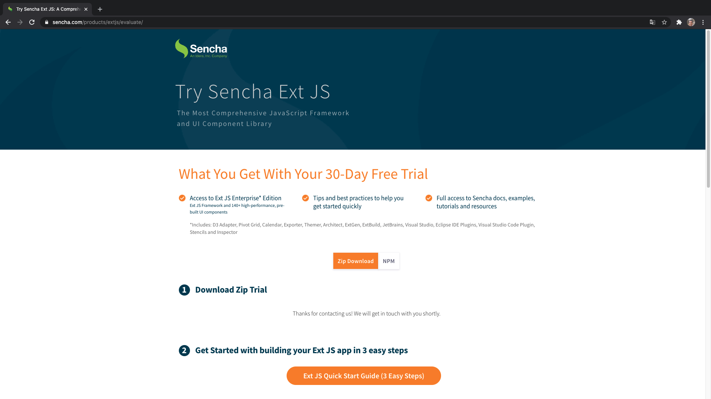
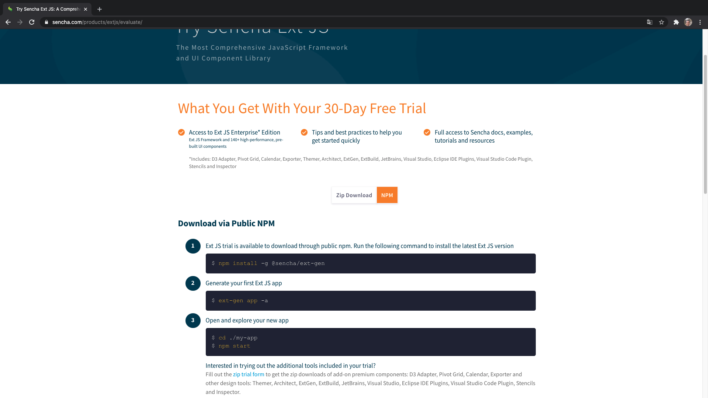

Al seguir los pasos con NPM nos genera la aplicación que se carga en el URL http://localhost:1962/:

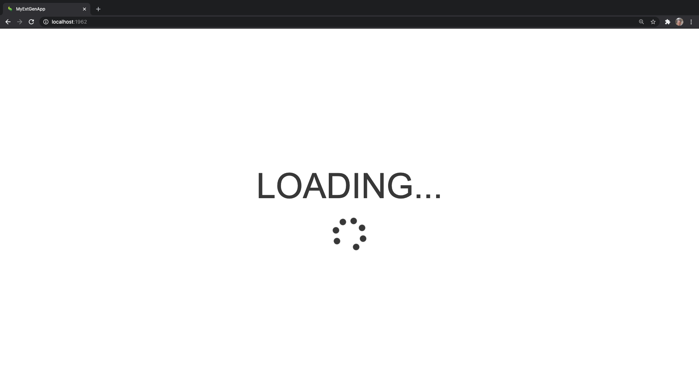
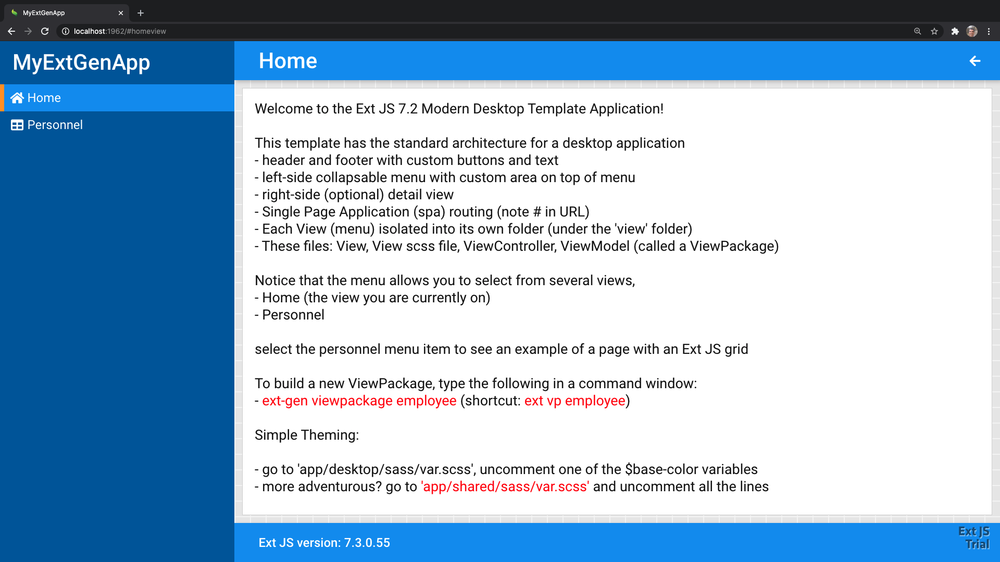

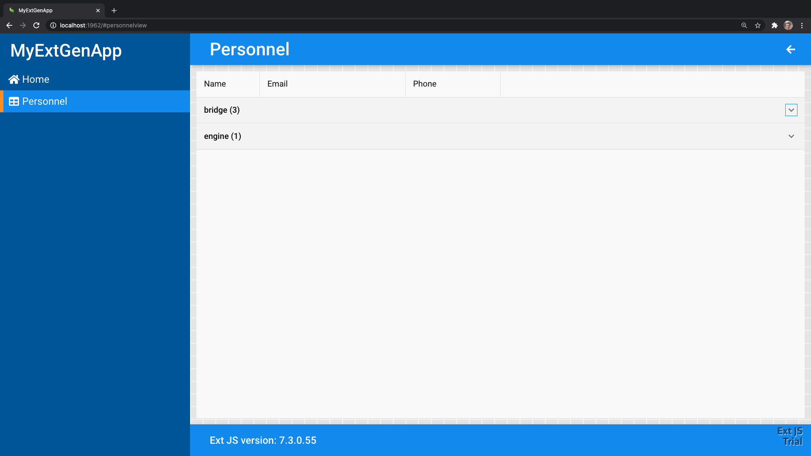
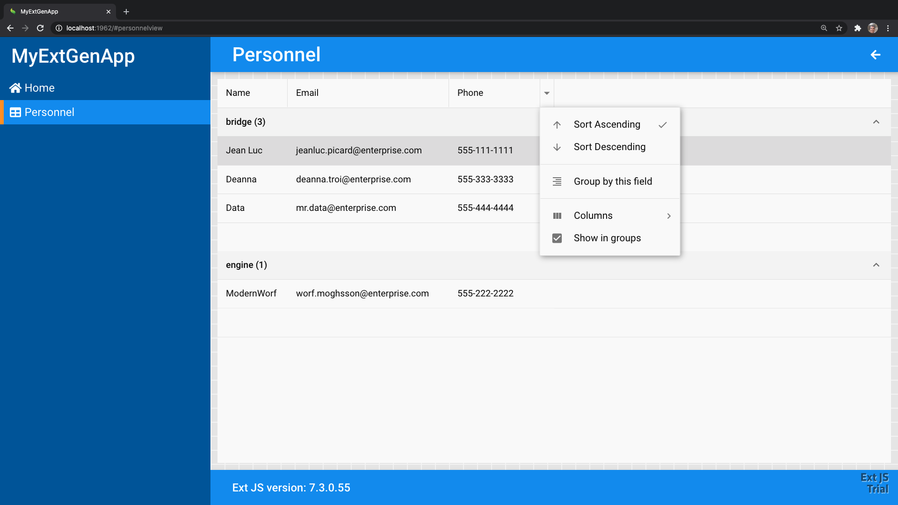

Si queremos documentación más detallado lo podemos hacer en la siguiente URL:

https://docs.sencha.com/extjs/7.2.0/guides/getting_started/getting_started_with_npm.html

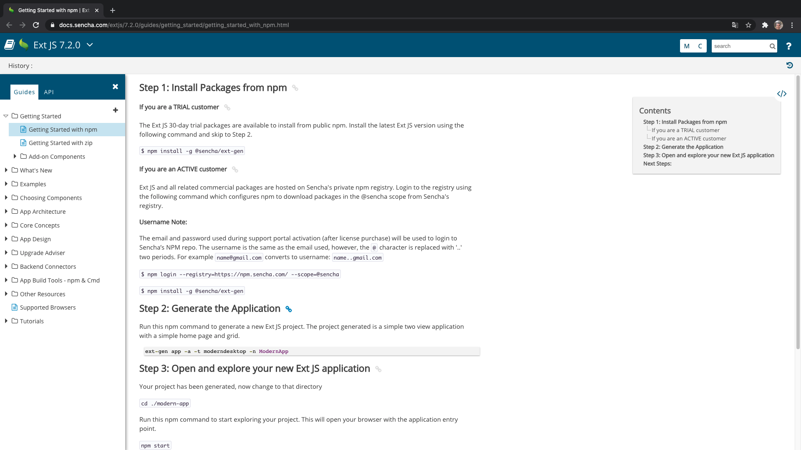

<hr>

## Considerando Ext JS para su próximo proyecto

Ext JS es una gran biblioteca para crear RIAs que requieren mucha interactividad con el usuario. Si necesita componentes complejos para administrar su información, entonces Ext es su mejor opción porque contiene muchos widgets como grid, forms, trees, panels y un gran paquete de datos y sistema de clases.

Ext JS es más adecuado para aplicaciones empresariales o de intranet; es una gran herramienta para desarrollar una solución de software CRM o ERP completa. Uno de los ejemplos más atractivos es la muestra de escritorio (http://dev.sencha.com/ext/5.1.0/examples/desktop/index.html)-(https://examples.sencha.com/extjs/7.3.0/). Realmente se ve y se siente como una aplicación nativa que se ejecuta en el navegador. En algunos casos, esto es una ventaja porque los usuarios ya saben cómo interactuar con los componentes y podemos mejorar la experiencia del usuario.

Ext JS 5 salió con una gran herramienta para crear themes y templates de una manera muy simple. El framework para crear temas está construido sobre **Compass** y **Sass**, por lo que podemos modificar algunas variables y propiedades y en unos minutos podemos tener una plantilla personalizada para nuestras aplicaciones Ext JS. Si queremos algo más complejo o único, podemos modificar la plantilla original para adaptarla a nuestras necesidades. Esto puede llevar más tiempo dependiendo de nuestra experiencia con Compass y Sass.

Compass y Sass son extensiones para CSS. Podemos usar expresiones, condiciones, variables, mixins y muchas cosas más increíbles para generar CSS bien formateado. Puede obtener más información sobre Compass en su sitio web en http://compass-style.org/.

El nuevo sistema de clases nos permite definir clases de una manera increíblemente sencilla. Podemos desarrollar nuestra aplicación utilizando el paradigma de programación orientada a objetos y aprovechar las herencias únicas y múltiples. Esto es una gran ventaja porque podemos implementar cualquiera de los patrones disponibles como **MVC**, **MVVM**, Observable o cualquier otro. Esto nos permitirá tener una buena estructura de código, lo que nos lleva a tener un fácil acceso para el mantenimiento.

Otra cosa a tener en cuenta es la creciente comunidad alrededor de la library; Hay muchas personas en todo el mundo que están trabajando con Ext JS en este momento. Incluso puede unirse a los grupos de reuniones que tienen reuniones locales con frecuencia para compartir conocimientos y experiencias; Te recomiendo que busques un grupo en tu ciudad o crees uno.

El nuevo sistema de carga es una excelente manera de cargar nuestros módulos o clases a pedido. Podemos cargar solo los módulos y aplicaciones que el usuario necesite justo a tiempo. Esta funcionalidad nos permite arrancar nuestra aplicación más rápido cargando solo el código mínimo para que nuestra aplicación funcione.

Una cosa más a tener en cuenta es la capacidad de preparar nuestro código para la implementación. Podemos comprimir y ofuscar nuestro código para un entorno de producción utilizando Sencha Cmd, una herramienta que podemos ejecutar en nuestro terminal para analizar automáticamente todas las dependencias de nuestro código y crear paquetes.

La documentación es muy importante y Ext JS tiene una excelente documentación, que es muy descriptiva con muchos ejemplos, videos y código de muestra para que podamos verlo en acción directamente en las páginas de documentación, y también podemos leer los comentarios de la comunidad.

## Instalación de la Última Versión Disponible 7.3.0 en Windows
### (No la del Libro)

Se instala Sencha CMD en Windos y se comprueba su instalación con el comando `sencha`:


Después se pulsarón los los siguientes comandos para crear la primer aplicación:

```sh
> cd C:\Users\ext-adelarosa\
> cd mySencha
> sencha generate app --ext MyApp ./MyApp
> cd Myapp
> sencha app watch
> 
```


Una vez que se levanta el servidor invocamos el URL http://localhost:1841/ y veremos la siguiente aplicación:


## Empezando con Ext JS

Entonces, ¡comencemos con Ext JS! Lo primero que debemos hacer es descargar el framework del sitio web oficial, http://www.sencha.com/products/extjs/. La versión disponible al momento de escribir este libro es 5.1.1. (*Yo descargue la 7.3.0*)

Hay tres tipos de licencia:

* **The open source license**(La licencia de código abierto): si está creando o desea desarrollar una aplicación de código abierto compatible con la licencia GNU GPL v3 (http://www.gnu.org/copyleft/gpl.html).

* **The commercial license**(La licencia comercial): debe comprarla si planea/desea desarrollar un proyecto de código cerrado y desea mantener el código fuente como propiedad suya. Usualmente utilizado por corporaciones, bancos o empresas.

* **The commercial OEM**(El OEM comercial): si desea usar Ext JS para crear su propio SDK comercial o creador de aplicaciones web, o usarlo como interfaz para algún dispositivo integrado, entonces esto entra en juego. Como este tipo de licencia puede variar, se personaliza para cada cliente.

Puede ver información más detallada sobre este tema en http://www.sencha.com/products/extjs/licensing.

### Descargando Ext JS

Si descarga Ext JS directamente desde http://www.sencha.com/products/download/, esta será una versión de prueba de 30 días de Ext JS y también se le pedirá que ingrese cierta información personal para obtener el trial. Para obtener la versión GPL, puede obtenerla en http://www.sencha.com/legal/GPL/. También podemos usar **Content Delivery Network (CDN)** disponible, como se muestra en la siguiente tabla, para que no necesitemos almacenar la biblioteca en nuestra propia computadora o servidor:

Theme   | Links
--------|------
Classic | &#8226; Archivo CSS: http://cdn.sencha.com/ext/trial/5.1.1/packages/ext-theme-classic/build/resources/ext-theme-classic-all.css <br/> &#8226; Archivo JavaScript: http://cdn.sencha.com/ext/trial/5.1.1/build/ext-all.js
Neptune | &#8226; Archivo CSS: http://cdn.sencha.com/ext/trial/5.1.1/packages/ext-theme-neptune/build/resources/ext-theme-neptune-all.css <br/> &#8226; Archivo JavaScript: http://cdn.sencha.com/ext/trial/5.1.1/build/ext-all.js <br/> &#8226; Theme JS Overrides: http://cdn.sencha.com/ext/trial/5.1.1/packages/ext-theme-neptune/build/ext-theme-neptune.js
Crisp   | &#8226; Archivo CSS: http://cdn.sencha.com/ext/trial/5.1.1/packages/ext-theme-crisp/build/resources/ext-theme-crisp-all.css <br/> &#8226; Archivo JavaScript: http://cdn.sencha.com/ext/trial/5.1.1/build/ext-all.js <br/> &#8226; Theme JS Overrides: http://cdn.sencha.com/ext/trial/5.1.1/packages/ext-theme-crisp/build/ext-theme-crisp.js

### Configuración e instalación de Ext JS 5

Después de descargar la biblioteca Ext JS (archivo ZIP), extraiga el contenido a una carpeta de trabajo. Por primera vez, probablemente se sentirá abrumado por el tamaño del archivo ZIP y por la cantidad de archivos y carpetas, pero no se preocupe, el propósito de cada archivo y el contenido de cada carpeta se explicarán en breve.

#### SENCHA CMD

Además de la biblioteca Ext JS, necesitamos descargar Sencha Cmd (herramienta de comando). Esta herramienta está destinada a ser una piedra angular para la creación de aplicaciones, la creación de espacios de trabajo y nuevos temas, y la capacidad de minimizar e implementar nuestras aplicaciones en un entorno de producción.

Descargue esta herramienta en http://www.sencha.com/products/sencha-cmd/ y también verifique que se cumplan los siguientes requisitos para que Sencha Cmd funcione correctamente:

* JRE Sencha Cmd requiere **Java Runtime Environment** versión 1.7 para admitir todas las funciones, sin embargo, la mayoría de las funciones funcionarán con 1.6 (la versión mínima admitida).
* Ruby difiere según el sistema operativo:
   * Windows: descargue Ruby desde http://rubyinstaller.org. Obtenga la versión del archivo `.exe` del software e instálelo.
   * Mac OS: Ruby está preinstalado. Puede probar si Ruby está instalado con el comando `Ruby -v`.
   * SO basado en Linux: use `sudo apt-get install ruby 2.0.0` para descargar Ruby.

Ejecute la configuración de Sencha Cmd, siga las instrucciones y, después de instalar Sencha Cmd, debemos verificar la instalación. Proceda a abrir la línea de comando y escriba el siguiente comando:

```sh
sencha
```

> **TIP**
>En entornos Windows, se recomienda que reinicie el sistema después de la instalación para que se apliquen las variables de entorno adecuadas.

Después de escribir el comando `Sencha`, deberíamos ver el siguiente resultado:

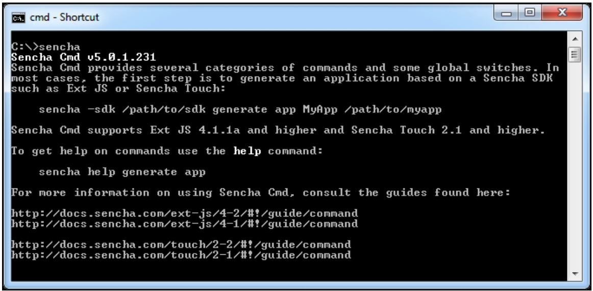

### ¿Por qué tantos archivos y carpetas?

Esta es una pregunta natural cuando miras los archivos y carpetas descargados por primera vez, pero cada archivo y carpeta tiene un propósito y ahora lo vas a aprender:

* La carpeta `build` contiene archivos compilados del SDK y está lista para usarse. Esta carpeta es muy útil para comenzar en Ext JS sin la necesidad de usar Sencha Cmd. A partir de la versión 5, esta carpeta también contiene ejemplos y temas Ext JS listos para usar ubicados en paquetes (carpeta).

* La carpeta `examples` contiene el código fuente de los ejemplos. Estos ejemplos están diseñados para mostrar lo que podemos hacer con la biblioteca. Sin embargo, un cambio significativo en la versión 5 es que esta carpeta debe compilarse usando Sencha Cmd para poder ser deployed/compiled en la carpeta build.

* La carpeta `overrides` contiene archivos JavaScript que se utilizan para agregar funcionalidad y comportamiento adicionales a componentes y widgets y también se utilizan cuando se compila una aplicación o código.

* La carpeta `packages` es donde se encuentran los estilos y las imágenes; también podemos encontrar los archivos Sass para crear nuestro tema personalizado aquí. Sass es una extensión de CSS3 para mejorar el lenguaje; podemos usar variables, mixins, condicionales, expresiones y más con Sass. A partir de la versión 5, esta carpeta también contiene más carpetas, que son `Locales`, `Ext JS Core`, `Charts`, `Aria` y muchas más.

* La carpeta `src` contiene los archivos de código fuente que forman parte del framework. Cada archivo representa una class/object para que podamos leerlo fácilmente, y cada carpeta corresponde al espacio de nombres asignado a la clase. Por ejemplo, la clase `Ext.grid.Panel` está en un archivo llamado `Panel.js`, que en una carpeta llamada `grid (src/grid/Panel.js)`.

* La carpeta `welcome` contiene los estilos e imágenes que se muestran cuando abrimos el archivo `index.html`  en la carpeta `root`.
   
   Si observa la carpeta `root`, también puede ver otros archivos JavaScript. Básicamente, son las versiones comprimidas, depuradas y de desarrollo de la library.

* Los archivos `bootsprap-*.js` contienen información sobre el framework; Estos archivos son utilizados por archivos `ext*.js` para cargar los archivos requeridos (la carpeta `src` o la carpeta `packages`).

* El archivo `ext-all.js` carga la biblioteca completa con todos los componentes, utilidades y clases.

* El archivo `ext-all-debug.js` es el mismo que el archivo `ext-all.js`. La diferencia es que este archivo mostrará los registros de la consola y podemos usar este archivo para depurar nuestra aplicación.

* El archivo `ext.js` es la capa principal y base de Ext JS. Si usamos este archivo, no cargaremos toda la library; este archivo contiene solo el sistema de clases, el loader y algunas otras clases. Podemos usar la clase `Ext.Loader` para cargar solo las clases requeridas y no todo el framework.

#### CARPETAS QUE CAMBIARON EN LA VERSIÓN 5 DE VERSIONES ANTERIORES

Los desarrolladores que usan versiones anteriores de Ext JS pueden encontrar confusa la nueva estructura de carpetas y pueden notar que algunas de las carpetas desaparecieron en la versión 5. Los cambios significativos en las carpetas se enumeran a continuación. La carpeta `builds` ya no existe; en su lugar, deberíamos usar la carpeta `build`.

* La carpeta `locale` se ha movido a la carpeta `packages/ext-locale`. En la versión 5, Locales tiene una estructura de carpetas más compleja y ahora también tenemos el archivo `ext-locale-language.js` y el archivo `ext-locale-language-debug.js`. De forma predeterminada, los componentes se muestran en inglés, pero puede traducirlos a cualquier otro idioma.

* Se eliminó la carpeta `jsbuilder`, ahora en la versión 5 usaremos Sencha Cmd para compilar y comprimir nuestro código fuente.

* El archivo `ext*-dev.js` se eliminó en la versión 5, ya que, según Sencha, había mucha confusión sobre el uso de estos archivos. En Sencha Touch, estos archivos se fusionaron y siguieron el mismo patrón que Sencha Touch en Ext JS. Los archivos `*-dev.js` y `ext*-debug.js` se fusionaron en uno.

* La carpeta `resources` se eliminó, por lo que ahora necesitamos usar la carpeta `packages`.

* La carpeta `docs` se eliminó, por lo que a partir de la versión 5, los desarrolladores deben consultar la documentación y las guías en http://docs.sencha.com/. Además, existe una alternativa para descargar la selección de documentación sin conexión (documentos sin conexión) desde el enlace en el menú de documentación:

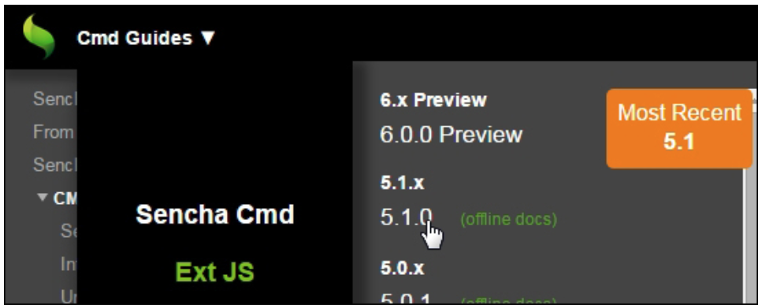

Ahora que tiene un conocimiento básico de los archivos y carpetas descargados, podemos avanzar al siguiente paso de "comenzar".

### Mirando la imagen completa

Antes de comenzar a escribir código, primero debe aprender y comprender algunos conceptos. Ext JS se divide en tres capas, como se muestra en la siguiente captura de pantalla. El propósito de estas capas es compartir código con Sencha Touch, un marco para crear aplicaciones web móviles.

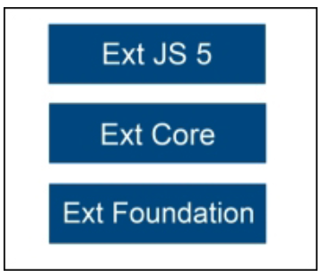

En la capa **Ext Foundation** se crea el objeto **`Ext`**, así como algunas utilidades útiles y el sistema de clases que nos permite extender clases, anular métodos y propiedades, agregar mixins y configuraciones a clases, y muchas cosas más.

> **NOTA**<br>
> Para comprender más sobre los mixins, consulte http://docs.sencha.com/extjs/5.1/5.1.1-apidocs/#!/api/Ext.Mixin

La capa **Ext Core** contiene las clases que administran el **Document Object Model (DOM)**, la configuración y activación de eventos, el soporte para solicitudes(requests) Ajax y las clases para buscar DOM usando selectores CSS. También ahora, parte de **`Ext.Core`** es el paquete de datos (clases relacionadas con datos como campos, tienda, etc.). A partir de la versión 5.1, Ext JS Core tendrá un código compartido común con Sencha Touch (la próxima versión principal).

Finalmente, la capa **Ext JS 5** contiene todos los componentes, widgets y muchas más características sobre las que aprenderá en este libro.

## Nuestro primer programa

Necesitamos configurar nuestro workspace para escribir todos los ejemplos de este libro. Creemos una carpeta llamada **`910-Learning-Ext-JS`**. Por ahora, no necesitamos un servidor web para alojar nuestros ejemplos, pero en los siguientes capítulos usaremos Ajax; por lo tanto, es una buena idea usar su servidor web favorito para alojar nuestro código de estos primeros ejemplos.

En nuestra nueva carpeta, crearemos carpetas que contienen los ejemplos de cada capítulo de este libro. En este punto, tenemos una carpeta llamada **`chapter_01`** o para mi versión uso **`capitulo_01`** que corresponde a este capítulo y otra llamada **`extjs-5.1.1`** que contiene el framework Ext JS. Ambas carpetas están ubicadas en el mismo nivel.

Dentro de la carpeta **`chapter_01`**, vamos a crear un archivo llamado **`myfirstapp.html`**, donde necesitamos importar la library **`Ext`** y crear un archivo JavaScript llamado **`app.js`** que contendrá nuestro código JavaScript:

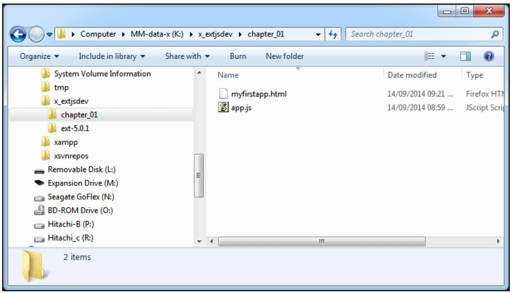

Abra el archivo `myfirstapp.html` en su editor favorito y escriba el siguiente código:

```html
<!doctype html>
<html>
<head>
   <meta http-equiv="X-UA-Compatible" content="IE=edge">
   <meta charset="utf-8">
   <title>My first application</title>
   <!-- Importing the stylesheet (theme neptune) --> 
   <link rel="stylesheet" type="text/css" href="../ext-5.1.1/build/packages/ext-theme-neptune/build/resources/ext-theme-neptune-all.css">
   <!-- Importing the Extjs library --> 
   <script src="../ext-5.1.1/build/ext-all.js"></script>
   <!-- Importing overrides Js code special for theme neptune -->
   <script src="../ext-5.1.1/build/packages/ext-theme-neptune/build/ext-theme-neptune.js"></script>

   <!-- Importing our application -->
   <script type ="text/javascript" src="app.js"></script>
</head>
<body> </body>
</html>
```

> **TIP**<br>
> Puede descargar el código de ejemplos en http://www.packtpub.com.

### Escribir el código Ext JS 

El código anterior muestra cómo importar la biblioteca para un entorno de desarrollo. 

1. Primero, importamos la stylesheet que se encuentra en `ext-5.1.1/build/packages/ext-theme-neptune/build/resources/ext-theme-neptune-all.css`. 
2. El segundo paso es importar toda la library de `ext-5.1.1/build/ext-all.js`. 
3. El tercer paso es importar un archivo JavaScript que contiene anulaciones para que el tema pueda funcionar correctamente (ajustes específicos en este tema). 

Ahora estamos listos para escribir nuestro código en el archivo **`app.js`**.

Antes de que podamos comenzar a crear widgets, debe esperar hasta que el DOM esté listo para ser utilizado y Ext JS se cargue y analice. Ext JS proporciona una función llamada **`Ext.onReady`**, que ejecuta un callback automáticamente cuando se puede acceder a todos los nodos del árbol. Escribamos el siguiente código en nuestro archivo **`app.js`**:

`app.js`

```js
Ext.onReady(function(){
   alert("This is my first Extjs app !");
});
```

Una alternativa a este código también puede ser:

```js
Ext.application({
   name : 'MyFirstApplication',
   launch : function() {
      Ext.Msg.alert("Hello"," my first Ext JS app");
   }
});
```

***Una de las ventajas de usar Ext JS es que la library solo usa un único objeto en el scope global llamado `Ext` para asignar todas las clases y objetos dentro del framework***.

Si abre el archivo HTML en su navegador favorito, verá algo como la siguiente captura de pantalla:

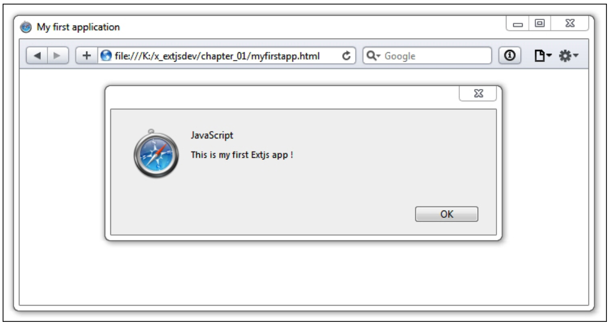

> **TIP**<br>
> No dude en utilizar su navegador favorito para trabajar con los ejemplos de este libro. Te recomiendo que uses Google Chrome porque tiene herramientas de desarrollo más avanzadas y es un navegador rápido. Si eres fanático de Firefox, puedes descargar el complemento de Firebug; es una herramienta poderosa que podemos usar para depurar en Firefox.


#### 🔴 5️⃣ 💻 Mi versión

`myfirstapp.html`

```html
<!doctype html>
<html>
<head>
   <meta http-equiv="X-UA-Compatible" content="IE=edge">
   <meta charset="utf-8">
   <title>Mi primera aplicación</title>
    
   <link rel="stylesheet" type="text/css" href="../ext-5.1.1/build/packages/ext-theme-neptune/build/resources/ext-theme-neptune-all.css">
   <script src="../ext-5.1.1/build/ext-all.js"></script>
   <script src="../ext-5.1.1/build/packages/ext-theme-neptune/build/ext-theme-neptune.js"></script>
   <!--
   <link rel="stylesheet" type="text/css" href="../ext-5.0.1/build/packages/ext-theme-neptune/build/resources/ext-theme-neptune-all.css"> 
   <script src="../ext-5.0.1/build/ext-all.js"></script>
   <script src="../ext-5.0.1/build/packages/ext-theme-neptune/build/ext-theme-neptune.js"></script>
   -->
   <script type ="text/javascript" src="app.js"></script>
</head>
<body> </body>
</html>
```

```js
Ext.onReady(function(){
   alert("¡Esta es mi primera aplicación Extjs!");
});
```

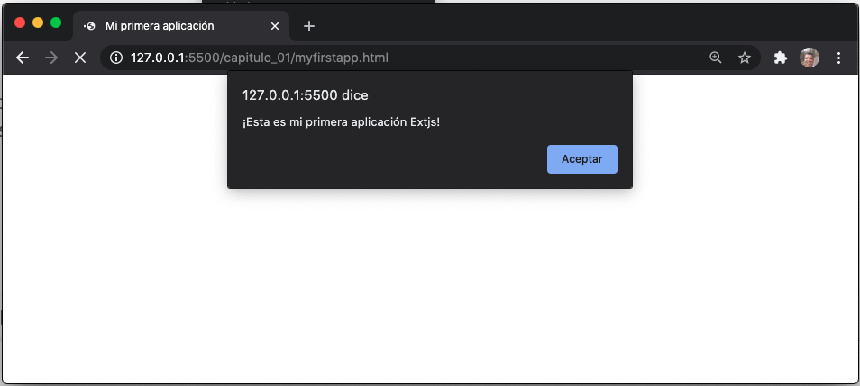


#### 🔴 6️⃣ 💻 Mi versión `910-Learning-Ext-JS-01-01.html`

`910-Learning-Ext-JS-01-01.html`

```js
<!DOCTYPE html>
<html>
   <head>
      <title>Primera Aplicación Extjs</title>
      <meta name="viewport" content="width=device-width, initial-scale=1, maximum-scale=1, user-scalable=no"> 
      <link href = "https://cdnjs.cloudflare.com/ajax/libs/extjs/6.0.0/classic/theme-classic/resources/theme-classic-all.css" rel = "stylesheet" />
      <script type = "text/javascript" src = "https://cdnjs.cloudflare.com/ajax/libs/extjs/6.0.0/ext-all.js"></script>
      
      <script type = "text/javascript">
         Ext.onReady(function() {
            Ext.onReady(function(){
               alert("¡Esta es mi primera aplicación Extjs!");
            });
         });
      </script>
   </head>
   
   <body></body>
</html>
```

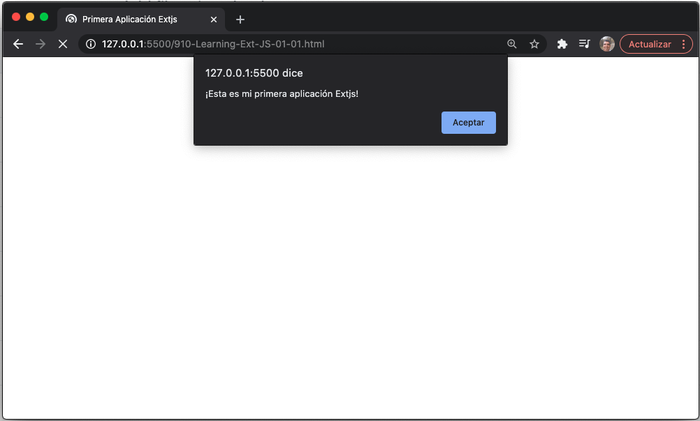 

#### 🔴 5️⃣ 💻 Mi versión 

```js
Ext.application({
   name : 'MyFirstApplication',
   launch : function() {
      Ext.Msg.alert("Hola"," Mi primera aplicación Ext JS");
   }
});
```

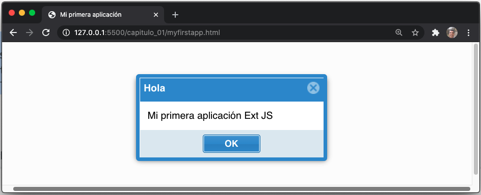

#### 🔴 6️⃣ 💻 Mi versión `910-Learning-Ext-JS-01-02.html` - theme-classic

`910-Learning-Ext-JS-01-02.html`

```js
<!DOCTYPE html>
<html>
   <head>
      <title>Primera Aplicación Extjs - Alternativa</title>
      <meta name="viewport" content="width=device-width, initial-scale=1, maximum-scale=1, user-scalable=no"> 
      <link href = "https://cdnjs.cloudflare.com/ajax/libs/extjs/6.0.0/classic/theme-classic/resources/theme-classic-all.css" rel = "stylesheet" />
      <script type = "text/javascript" src = "https://cdnjs.cloudflare.com/ajax/libs/extjs/6.0.0/ext-all.js"></script>
      
      <script type = "text/javascript">
         Ext.application({
            name : 'MyFirstApplication',
            launch : function() {
               Ext.Msg.alert("Hola"," Mi primera aplicación Ext JS");
            }
         });
      </script>
   </head>
   
   <body></body>
</html>
```

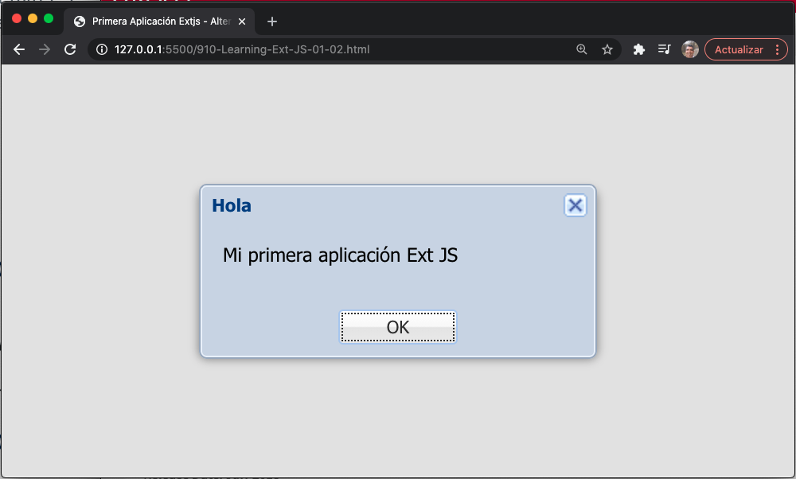

#### 🔴 6️⃣ 💻 Mi versión `910-Learning-Ext-JS-01-02.html` - theme-neptune

`910-Learning-Ext-JS-01-02.html`

```js
<!DOCTYPE html>
<html>
   <head>
      <title>Primera Aplicación Extjs - Alternativa</title>
      <meta name="viewport" content="width=device-width, initial-scale=1, maximum-scale=1, user-scalable=no"> 
      <!--
      <link href = "https://cdnjs.cloudflare.com/ajax/libs/extjs/6.0.0/classic/theme-classic/resources/theme-classic-all.css" rel = "stylesheet" />
      <script type = "text/javascript" src = "https://cdnjs.cloudflare.com/ajax/libs/extjs/6.0.0/ext-all.js"></script>
      -->
      <link href = "https://cdnjs.cloudflare.com/ajax/libs/extjs/6.0.0/classic/theme-neptune/resources/theme-neptune-all.css" rel = "stylesheet" />
      <script type = "text/javascript" src = "https://cdnjs.cloudflare.com/ajax/libs/extjs/6.0.0/ext-all.js"></script>
      
      <script type = "text/javascript">
         Ext.application({
            name : 'MyFirstApplication',
            launch : function() {
               Ext.Msg.alert("Hola"," Mi primera aplicación Ext JS");
            }
         });
      </script>
   </head>
   
   <body></body>
</html>
```

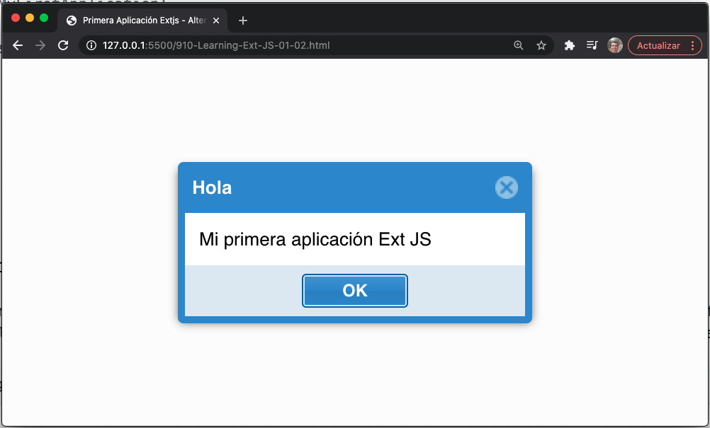

#### 🔴 6️⃣ 💻 Mi versión `910-Learning-Ext-JS-01-02.html` - theme-crisp

`910-Learning-Ext-JS-01-02.html`

```js
<!DOCTYPE html>
<html>
   <head>
      <title>Primera Aplicación Extjs - Alternativa</title>
      <meta name="viewport" content="width=device-width, initial-scale=1, maximum-scale=1, user-scalable=no"> 
      <!--
      <link href = "https://cdnjs.cloudflare.com/ajax/libs/extjs/6.0.0/classic/theme-classic/resources/theme-classic-all.css" rel = "stylesheet" />
      <script type = "text/javascript" src = "https://cdnjs.cloudflare.com/ajax/libs/extjs/6.0.0/ext-all.js"></script>

      <link href = "https://cdnjs.cloudflare.com/ajax/libs/extjs/6.0.0/classic/theme-neptune/resources/theme-neptune-all.css" rel = "stylesheet" />
      <script type = "text/javascript" src = "https://cdnjs.cloudflare.com/ajax/libs/extjs/6.0.0/ext-all.js"></script>   
      -->

      <link href = "https://cdnjs.cloudflare.com/ajax/libs/extjs/6.0.0/classic/theme-crisp/resources/theme-crisp-all.css" rel = "stylesheet" />
      <script type = "text/javascript" src = "https://cdnjs.cloudflare.com/ajax/libs/extjs/6.0.0/ext-all.js"></script>
      
      <script type = "text/javascript">
         Ext.application({
            name : 'MyFirstApplication',
            launch : function() {
               Ext.Msg.alert("Hola"," Mi primera aplicación Ext JS");
            }
         });
      </script>
   </head>
   
   <body></body>
</html>
```

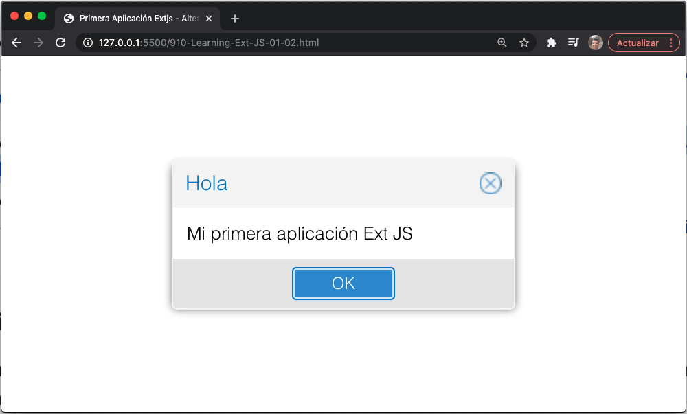


Si por alguna razón no podemos ver el mensaje de alerta en nuestro navegador, es porque no hemos definido la ruta correcta al archivo **`ext-all.js`**. Si observa la consola de JavaScript, probablemente veremos el siguiente error:

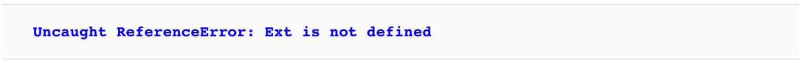

Esto significa que el archivo **`ext-all.js`** no se importa correctamente. Necesitamos asegurarnos de que todo esté correcto con la ruta y actualizar el navegador nuevamente.

### Añadiendo interacción al programa

Ahora que sabemos cómo ejecutar código cuando el DOM está listo, enviemos un mensaje de alerta desde la library Ext. Usando el objeto **`Ext.MessageBox`** alias **`Ext.Msg`**, podemos crear diferentes tipos de mensajes como alert, confirmation, prompt, progress bar, o incluso un mensaje personalizado:

```js
Ext.onReady(function(){
   //alert("This is my first Extjs app !");
   Ext.Msg.alert("Alert","This is my first Ext js app !");
});
```

La salida de las líneas de código anteriores se muestra en la siguiente captura de pantalla:

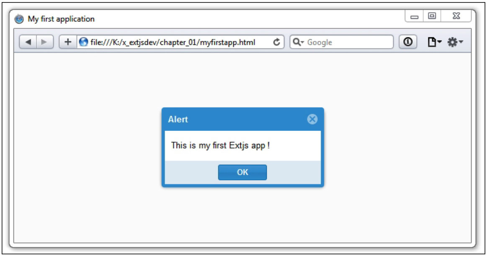

#### 🔴 💻

```js
Ext.onReady(function(){
   Ext.Msg.alert("Alerta","¡Esta es mi primera aplicación Ext js!");
});
```

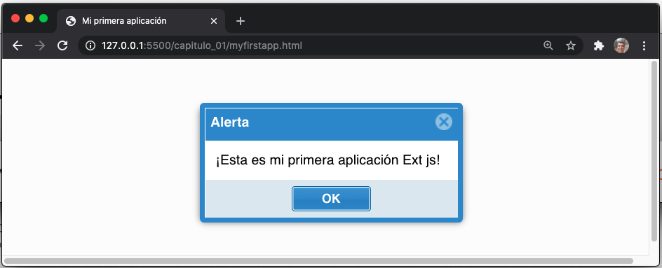

> **TIP**<br>
> Si no recibe ningún error en la consola de JavaScript pero aún no puede ver el mensaje en la pantalla, como se ve en la captura de pantalla anterior, asegúrese de haber insertado la hoja de estilo correctamente.

En este caso, estamos usando el método **`alert`** del objeto **`Ext.Msg`**. El primer parámetro es el título del mensaje y el segundo parámetro es el contenido del mensaje. Eso fue fácil, ¿verdad? Ahora creemos un cuadro de diálogo de confirmación:

```js
Ext.onReady(function(){
   Ext.Msg.alert("Alert","This is my first Ext JS app !");
   Ext.Msg.confirm("Confirm","Do you like Ext JS 5?");
});
```

Usamos el método **`confirm`** para solicitar dos posibles respuestas del usuario. El primer parámetro es el título del cuadro de diálogo y el segundo parámetro es la pregunta o mensaje que queremos mostrarle al usuario:

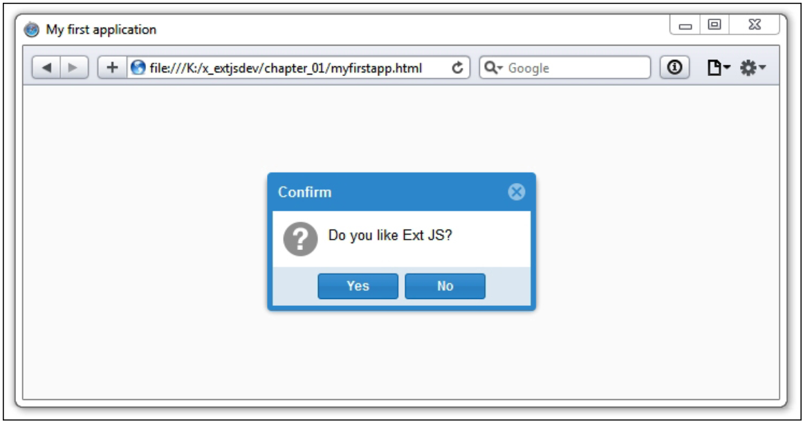

#### 🔴 💻

```js
Ext.onReady(function(){
   Ext.Msg.alert("Alerta","¡Esta es mi primera aplicación Ext JS!");
   Ext.Msg.confirm("Confirmar","¿Te gusta Ext JS 5?");
 });
```

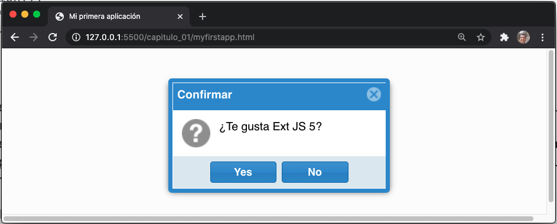

Antes de que apareciera el cuadro de diálogo de confirmación, hubo una alerta que no apareció. ***Una cosa importante a tener en cuenta es que los mensajes y alertas de la library Ext no bloquean el bucle de JavaScript, a diferencia del cuadro de diálogo del navegador nativo***. Esto significa que si agregamos otra alert o mensaje personalizado después de llamar al método **`confirm`**, ya no veremos el cuadro de diálogo de confirmación.

Hasta ahora, hemos mostrado un cuadro de diálogo de confirmación solicitando dos posibles respuestas del usuario, pero ¿cómo podemos saber la respuesta del usuario para hacer algo de acuerdo con la respuesta? Hay un tercer parámetro en el cuadro de diálogo de confirmación, que es una función de devolución de llamada que se ejecutará cuando el usuario haga clic en una de las dos respuestas:

```js
Ext.onReady(function(){
   Ext.Msg.alert("Alert","This is my first Ext JS app !");
   Ext.Msg.confirm("Confirm","Do you like Ext JS 5?",
      function(btn){
         if (btn === "yes") {
            Ext.Msg.alert("Great!","This is great!");
         } else {
            Ext.Msg.alert("Really?","That's too bad.");
         }
   });
});
```

La función callback se ejecuta después de que el usuario hace clic en el botón **Yes** o **No** o cierra el cuadro de diálogo de confirmación. La función recibe el valor del botón pulsado como parámetro, que es **Yes** o **No**; podemos hacer lo que queramos dentro de la función callback. En este caso, enviamos un mensaje dependiendo de la respuesta dada. Actualicemos nuestro navegador y probemos nuestro pequeño programa para ver nuestros cambios. Las confirmaciones generalmente se solicitan cuando un usuario desea eliminar algo, o tal vez cuando desea desencadenar un proceso largo, básicamente cualquier cosa que tenga solo dos opciones.

#### 🔴 💻

```js
Ext.onReady(function(){
   Ext.Msg.alert("Alerta", "¡Esta es mi primera aplicación Ext JS!");
   Ext.Msg.confirm("Confirmar", "¿Te gusta Ext JS 5?",
      function(btn){
         if (btn === "yes") {
            Ext.Msg.alert("¡Genial!", "¡Esto es genial!");
         } else {
            Ext.Msg.alert("¿De verdad?", "Eso es una lástima".);
         }
   });
 });
```

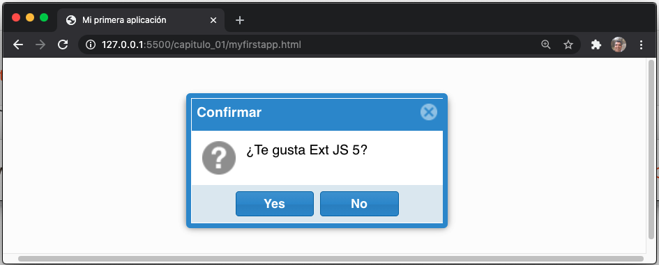
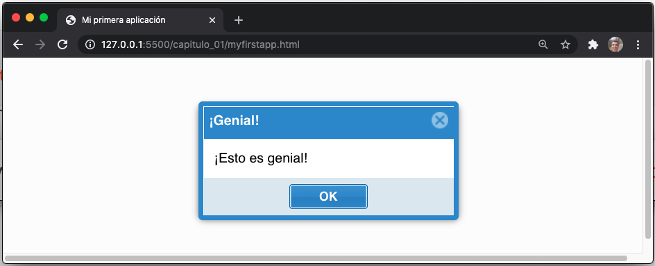

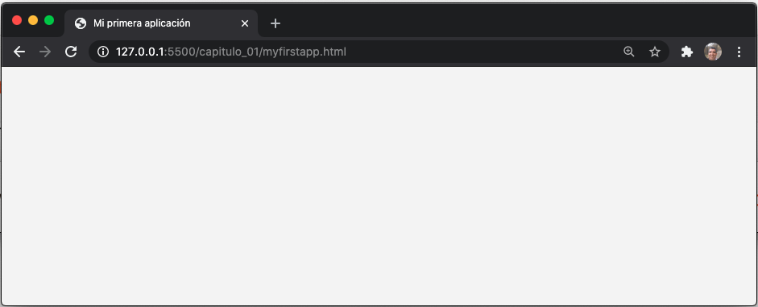

## Herramientas y editores

Antes de continuar, es importante que usemos algunas herramientas para ser más productivos al crear nuestro código y nuestras aplicaciones. Hay muchos editores en el mercado que podemos usar para escribir código. Repasemos algunos de ellos que serán útiles en este libro.

### XAMPP o WAMP

XAMPP es una distribución de código abierto de Apache que contiene MySQL, PHP y Perl, y es fácil de instalar y usar. XAMPP puede proporcionarnos un entorno de desarrollo web local que es fácil de manejar sin la necesidad de realizar pruebas en un servidor o alojamiento público.

XAMPP está disponible para las versiones de Windows (32 bits), Linux y OS X y puede descargar XAMPP en https://www.apachefriends.org/index.html.

WAMP es otro paquete gratuito que contiene Apache, MySQL y PHP, especialmente diseñado para el sistema operativo Windows. Puede obtenerlo en http://www.wampserver.com/en/. WAMP viene en versiones de 32 y 64 bits según su sistema operativo Windows.

Para probar el código o revisar algunos ejemplos de Ext JS, necesitaremos un servidor web (Apache) o IIS para obtener la funcionalidad adecuada y las respuestas AJAX que los ejemplos y el código requieren.

### Aptana

El editor de **Aptana** es un IDE de Appcelerator. Está basado en Eclipse pero optimizado para aplicaciones web. Es un proyecto de código abierto y gratuito.

Entre otros IDE, Aptana contiene una funcionalidad de autocompletar para JavaScript y Ext JS, un validador de JavaScript, un validador de CSS y HTML, un depurador de JavaScript, paquetes y más:

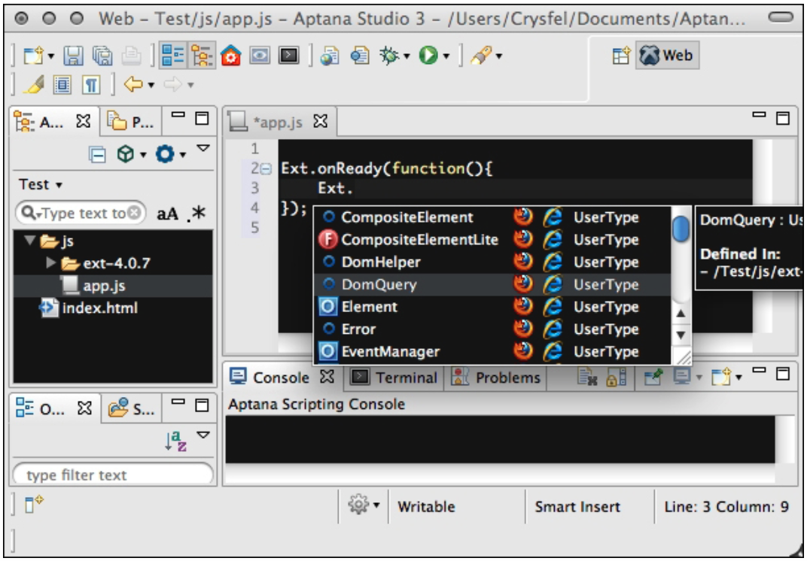

Aptana es una gran herramienta cuando se trabaja con Python, Ruby o PHP como backend de nuestros proyectos. Contiene herramientas para trabajar con esos lenguajes listos para usar y también contiene herramientas para implementar su aplicación en la nube usando Heroku o Engine Yard.

### Sencha Architect

La aplicación de escritorio Sencha Architect es una herramienta que le ayudará a diseñar y desarrollar una aplicación más rápido que codificarla a mano. La idea es arrastrar y soltar los componentes en un lienzo y luego agregar la funcionalidad. La aplicación de escritorio Sencha Architect es un producto de Sencha Inc. que tiene como objetivo ayudar a los desarrolladores a definir componentes con unos pocos clics. Podemos crear un proyecto Ext JS o Sencha Touch. Podemos obtener una prueba gratuita desde el sitio web oficial de Sencha. También podemos comprar la licencia allí.

> **NOTA**<br>
> La versión actual de Sencha Architect es 3.1.0. Esto funciona para las versiones 4.xy 5.x de Ext JS. Las versiones anteriores del arquitecto Sencha, como 2.x, no funcionarán para Ext JS 5.
> La versión más reciente la encontramos en https://www.sencha.com/blog/sencha-architect-4-2-4-is-now-generally-available/

Una de las ventajas que tiene Architect es que puede arrastrar y soltar componentes en la zona de trabajo y esta herramienta creará (generará) el código básico de los componentes y/o las piezas con las que está trabajando.

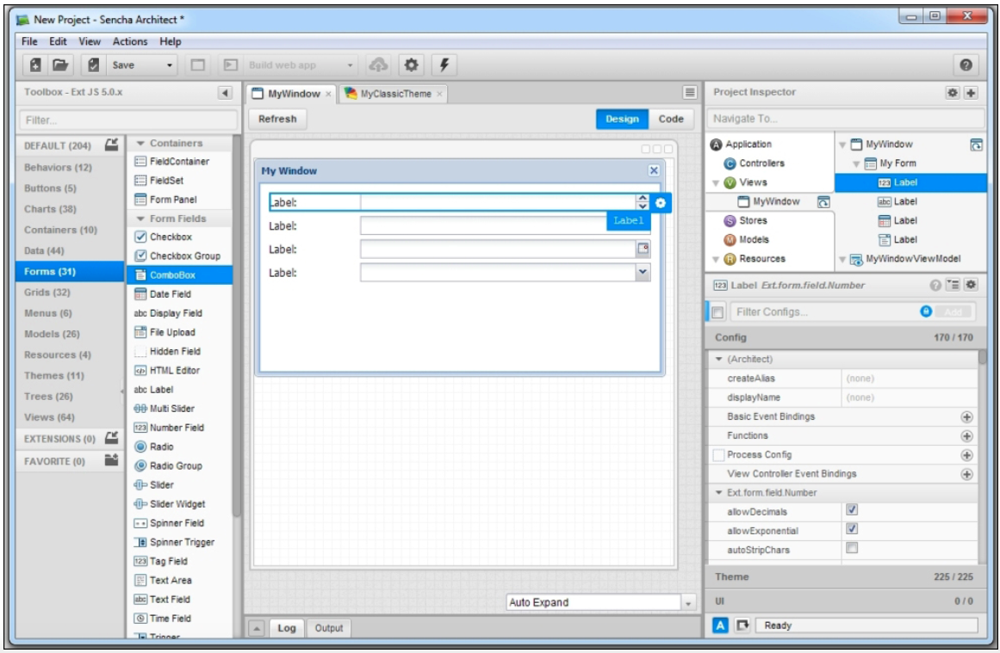

Además, puede cambiar a la vista de código y ver los resultados hasta ahora (algunas partes de las clases/componentes de Ext JS se pueden editar, pero no todas). Puede ver la vista de código en la siguiente captura de pantalla:

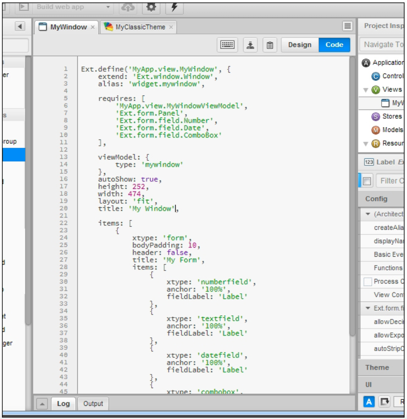

La intención de este libro no es enseñarle sobre Sencha Architect, es para que usted comprenda y aprenda Ext JS y cree aplicaciones sin la necesidad de usar Sencha Architect. Más adelante, si siente que necesita usar Sencha Architect o quiere probar, puede ser más fácil una vez que conozca los conceptos básicos y esenciales que se tratan en este libro.

## ¿Qué hay de nuevo en Ext JS 5?

Ext JS 5 introduce una gran cantidad de características nuevas, y la mayoría de ellas se tratarán en los próximos capítulos cuando las veamos más de cerca, pero por el momento mencionaremos brevemente algunas de las adiciones importantes en la versión 5:

* **Compatibilidad con tabletas y nuevos temas**: Esto ha introducido la capacidad de crear aplicaciones compatibles con dispositivos de pantalla táctil (computadoras portátiles, PC y tabletas con pantalla táctil). Se introduce el tema Crisp y se basa en el tema Neptune. Además, hay nuevos temas para la compatibilidad con tabletas, que son Neptune touch y Crisp touch.

* **Nueva arquitectura de aplicación - MVVM**: Agregando una nueva alternativa a MVC Sencha llamada MVVM (que significa Model-View-ViewModel), esta nueva arquitectura tiene enlace de datos y enlace de datos bidireccional, lo que nos permite disminuir gran parte del código adicional que algunos de nosotros lo estábamos haciendo en versiones anteriores. Esta nueva arquitectura presenta:

   * Data binding
   * View controllers
   * View models

* **Routing**: el Routing proporciona un enlace profundo de la funcionalidad de la aplicación y nos permite realizar ciertas acciones o métodos en nuestra aplicación mediante la traducción de la URL. Esto nos da la capacidad de controlar el estado de la aplicación, lo que significa que podemos ir a una parte específica o un enlace directo a nuestra aplicación. Además, puede manejar múltiples acciones en la URL.

* **Responsive configurations**: Ahora tenemos la capacidad de establecer la propiedad `responsiveConfig` (nueva propiedad) a algunos componentes, que será un objeto de configuración que representa las condiciones y criterios sobre los cuales se aplicarán las configuraciones establecidas, si la regla cumple con estas configuraciones. Como ejemplo:

   ```js
   responsiveConfig: {
      'width > 800': { region: 'west' },
      'width <= 800':{ region: 'north' }
   }
   ```

* **Data package improvements**: Se produjeron algunos cambios buenos en la versión 5 relacionados con el manejo de datos y la manipulación de datos. Estos cambios permitieron a los desarrolladores un viaje más fácil en sus proyectos, y algunas de las cosas nuevas son:

   * Common Data (la clase Ext JS Data, `Ext.Data`, ahora es parte del paquete principal)
   * Many-to-many associations
   * Chained stores
   * Custom field types

* **Event system**: Se cambió la lógica del evento y ahora es un solo oyente adjunto en la parte superior de la jerarquía DOM. Entonces, esto significa que cuando un elemento DOM activa un evento, sube a la cima de la jerarquía antes de ser manejado. Entonces, Ext JS intercepta esto y verifica los listeners relevantes que agregó al component o store. Esto reduce la cantidad de interacciones en el DOM y también nos da la capacidad de habilitar gestos.

* **Sencha Charts**: los Charts pueden funcionar tanto en Ext JS como en Sencha Touch, y tienen un rendimiento mejorado en dispositivos de tableta. Los gráficos Legacy Ext JS 4 se convirtieron en un paquete separado para minimizar la conversión/actualización. En la versión 5, los charts tienen nuevas características como:

   * Candlestick and OHLC series
   * Pan, zoom, and crosshair interactions
   * Floating axes
   * Multiple axes
   * SVG and HTML Canvas support
   * Better performance
   * Greater customization
   * Chart themes

* **Tab Panels**: los Tab Panels tienen más opciones para controlar configuraciones como la alineación de iconos y la rotación de texto. Gracias a los nuevos mixins flexibles de Sass, podemos controlar fácilmente las opciones de presentación.

* **Grids**: este componente, que ha estado presente desde la versión 2.x, es uno de los componentes más populares, y podemos llamarlo uno de los pilares de este marco. En la versión 5, tiene algunas características nuevas increíbles:
   
   * Components in Cells
   * Buffered updates
   * Cell updaters
   * Grid filters (El popular "UX" (user extension) se ha reescrito e integrado en el framework. También los filtros se pueden guardar en el estado del componente).
   * Rendering optimizations
   
* **Widgets**: Este es un componente ligero, que es un término medio entre `Ext.Component` y el Cell renderer.

* **Breadcrumb bars**: Este nuevo componente muestra los datos de un store (un almacén de datos específico para el componente tree) en un toolbar form. Este nuevo control puede ahorrar espacio en pantallas pequeñas o tabletas.

* **Form package improvements**: Ext JS 5 introduce algunos controles nuevos y cambios significativos en otros:

   * **Tagfield**: Este es un nuevo control para seleccionar múltiples valores.
   * **Segmented buttons**: Son botones con presentación, como múltiples selecciones en interfaces móviles.
   * **Goodbye to TriggerField**: En la versión 5, TriggerField está en desuso y ahora la forma de crear desencadenadores es utilizando el campo de texto e implementando los desencadenadores en la configuración de TextField. (TriggerField en la versión 4 es un campo de texto con un botón o botones configurados en el lado derecho).
   
   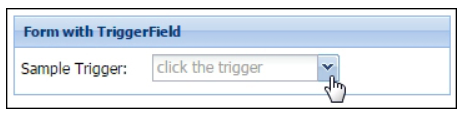
   
   * **Field and Form layouts**: Los diseños se refactorizaron utilizando HTML y CSS, por lo que hay una mejora ya que el rendimiento ahora es mejor.

* **New SASS Mixins** (http://sass-lang.com/): Varios componentes que no podían tener un tema personalizado ahora tienen la capacidad de ser estilizados de múltiples formas en un solo tema o aplicación. Estos componentes son:

   * `Ext.menu.Menu`
   * `Ext.form.Labelable`
   * `Ext.form.FieldSet`
   * `Ext.form.CheckboxGroup`
   * `Ext.form.field.Text`
   * `Ext.form.field.Spinner`
   * `Ext.form.field.Display`
   * `Ext.form.field.Checkbox`

* **The Sencha Core package**: El paquete core contiene código compartido entre Ext JS y Sencha Touch y, en el futuro, este core será parte de la próxima versión importante de Sencha Touch. El núcleo incluye:

   * Class system
   * Data
   * Events
   * Element
   * Utilities
   * Feature/environment detection

## Resumen

En este capítulo, aprendió a configurar e instalar Ext JS 5 y Sencha Cmd también. También aprendió sobre el contenido de las carpetas incluidas en Ext JS 5 SDK, y las diferencias entre carpetas en la versión 4 y la versión 5. Mencionamos algunas herramientas útiles que serán esenciales para este libro; sin embargo, es posible que a muchos desarrolladores no les gusten o no se sientan cómodos con estas herramientas, así que no dude en utilizar sus herramientas y editores favoritos.

A lo largo de este libro, aprenderá sobre el uso de Ext JS 5 y cubriremos las partes, características y componentes más importantes, y muchas más clases y herramientas. Al final de este libro, completaremos una pequeña aplicación del mundo real para que pueda tener una idea de cómo implementar Ex JS para sus próximos y futuros proyectos.

En el próximo capítulo, nos centraremos en los conceptos centrales de Ext JS 5 y la manipulación DOM.
