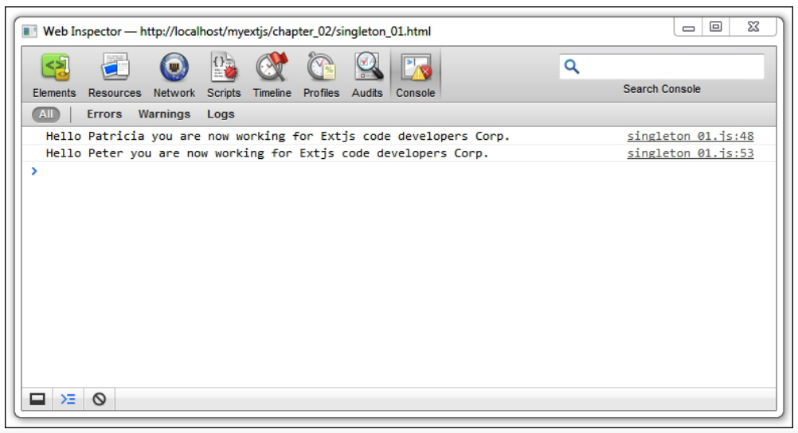
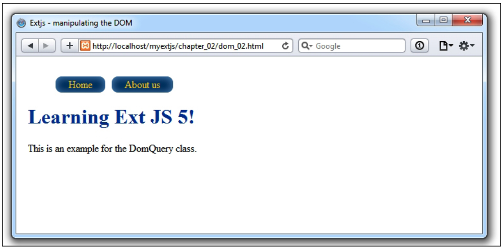

# 2. Los Conceptos Básicos

* El sistema de clases
   * Convenciones de nombres
   * Escribiendo tu primera clase
   * Herencia simple
   * Preprocesadores y posprocesadores
   * Mezcla de muchas clases (el uso de mixins)
   * Una explicación de mixins
      * Usando la propiedad mixinConfig
      * Configuraciones
   * Métodos y propiedades estáticos
      * Explicación
   * La clase Singleton
   * Aliases
* Carga de clases bajo demanda
   * Habilitando el loader
* Trabajando con el DOM
   * Obteniendo elementos
   * Query: ¿cómo los encontramos?
   * Manipulación del DOM: ¿cómo lo cambiamos?
* Resumen

En este capítulo, aprenderá sobre el sistema de clases, que se introdujo por primera vez en Ext JS versión 4. También aprenderá cómo cargar clases dinámicamente y cómo interactuar con el **Document Object Model (DOM)** para modificar la estructura del árbol DOM para nuestra conveniencia.

Debe saber que JavaScript no tiene clases (prototype-oriented); sin embargo, podemos emularlo utilizando el objeto **`prototype`** y otras técnicas. Una de las principales características de Ext JS es que desde la versión 4, todo el código del framework se desarrolló con una estructura basada en clases. Junto con las convenciones de nomenclatura, es fácil de aprender y comprender, y mantener el código organizado, estructurado y fácil de mantener.

Conocer y comprender el concepto del **Object-Oriented Programming System (OOPS)** es muy importante. Es posible que este libro no sea una guía enfocada en el concepto de OOPS, pero aprenderá cómo podemos usar e implementar este concepto en Ext JS.

Los siguientes son los temas principales de este capítulo, que debe comprender bien antes de pasar a otras partes de la library:

* El sistema de clases(class system)
* Carga de clases bajo demanda
* Trabajando con el DOM

## El sistema de clases (class system)

En la versión 4, el sistema de clases se rediseñó por completo y se agregaron nuevas funciones. Se convirtió en una forma más poderosa de ampliar y crear clases. Y Ext JS 5 mantiene la misma estructura y consistencia que la versión 4.

Para crear clases, Ext JS usa el objeto **`Ext.ClassManager`** internamente para administrar las asociaciones entre los nombres, alias o nombres alternativos que definimos. Y todas las clases (existentes y nuevas) usan **`Ext.Base`** como código base.

No se recomienda utilizar estas clases directamente; en su lugar, deberíamos usar las siguientes abreviaturas:

* **`Ext.define`**: Esta abreviatura se usa para crear una nueva clase, extender una clase o siempre que necesitemos aplicar alguna override(s) en una clase.

* **`Ext.create`**: Esta abreviatura crea una nueva instancia de una clase, utilizando la clase **`fullname`**, la clase **`alias`** o la clase  **`alternate name`**. Usando cualquiera de estas opciones, el administrador de clases maneja el mapeo correcto para crear la clase. También podemos usar esta abreviatura para crear objetos a partir de una clase existente.

* **`Ext.widget`**: Esta abreviatura se usa para crear un widget usando la propiedad **`xtype`** (alias) o un objeto de configuración.

> **NOTA**<br>
> Alias es un short name para una clase, que generalmente es fácil de recordar y manejar en el código, por ejemplo, **`Ext.grid.column.Action`** tiene un alias que es **`actioncolumn`** . La lista completa se puede encontrar aquí: http://docs.sencha.com/extjs/5.1/5.1.1-apidocs/#!/api/Ext.enums.Widget.

### Convenciones de Nombres

Ext JS utiliza convenciones de nomenclatura coherentes en todo el framework. Esto le permite tener classes, namespaces, filenames, etc., para mantener una estructura organizada. Como parte de las convenciones de codificación utilizadas por Sencha, existen algunas reglas básicas:

* Los nombres pueden usar caracteres alfanuméricos y usted puede usar números, pero como convención, los números de reglas pueden usarse para términos técnicos. El uso de guiones bajos o guiones no puede usarse como una regla de convención, pero no es imposible usarlos. Por ejemplo:
   
   * **`MyApp.utils-common.string-renderers`** (incorrecto)
   * **`MyApp.utils.Md5encyption`** (correcto)
   * **`MyApp.reportFormats.FM160`** (correcto)

* Los nombres deben agruparse en **`packages/namespaces`**, espaciados utilizando la notación de puntos del objeto como **`(namespace).(namespace).(class)`**. No puede repetir el espacio de nombres de nivel superior seguido del nombre de la clase. Por ejemplo:

   * **`MyApp.EmployeeApp`** (correcto)
   * **`MyApp.EmployeeApp.EmployeeClass`** (incorrectono; también esto se interpretará como una propiedad en lugar de una clase)

* El nombre de las clases de nivel superior debe estar escrito en formato camel-cased. Los grupos y agrupación de namespaces de la clase de nivel superior debe estar en minúsculas (nuevamente como una convención, pero no prohibido). Por ejemplo:

   * **`MyApp.`grids`.EmployeesGrid`**
   * **`MyApp.`data.clients`.SalesReport`**

* Como regla y también para evitar posibles errores, las clases que no forman parte del framework nunca deben usar **`Ext`** como espacio de nombres de nivel superior, a menos que esté creando un componente **`Ext.ux`**. Sin embargo, como regla general, si está utilizando plugins o componentes de terceros, asegúrese de que los nombres que está usando no colisionen ni interfieran con estos plugins/components.

### Escribiendo tu primera clase

Así que ahora creemos nuestra primera clase usando la primera abreviatura de la lista anterior. En un nuevo archivo llamado **`classes_01.js`**, necesitamos escribir el siguiente código:

```js
Ext.define('Myapp.sample.Employee',{
   name: 'Unknown',
   constructor: function (name){
      this.name= name;
      console.log('class was created – name:' + this.name);
   },
   work: function(task){
      alert(this.name + ' is working on: ' + task);
   }
});
var patricia = Ext.create('Myapp.sample.Employee', 'Patricia Diaz');
patricia.work('Attending phone calls');
```

En este código, definimos el nombre de la clase como una cadena **`'Myapp.sample.Employee'`** como el primer parámetro de la función **`Ext.define`**. Luego establecemos la propiedad **`name`** y dos métodos: **`constructor`** y **`work`**.

Cuando se crea una nueva clase, **`Ext`** usará el método **`constructor`** como un callback y se ejecutará cada vez que se cree una nueva instancia, dándonos la oportunidad de aplicar las configuraciones iniciales a la clase. Si el constructor no está definido, **`Ext`** usará una función vacía y también las propiedades iniciales de la clase serán los valores predeterminados.

Ahora tenemos la clase ya definida en el código, y se crea una nueva instancia de la clase en el siguiente código:


Le estamos diciendo a Ext JS que cree una nueva instancia de la clase **`Myapp.sample.Employee`** y pasando el parámetro **`Patricia Diaz`**, justo después de la ejecución del código donde se ejecutará el método constructor:


Finalmente, invocamos el método **`work`**, que hará que aparezca una alert en el navegador:


:computer: Mi versión

`classes_01.html`

```html
<!doctype html>
<html>
<head>
   <meta http-equiv="X-UA-Compatible" content="IE=edge">
   <meta charset="utf-8">
   <title>Clases - Ejemplo 01</title>
   <script src="../ext-5.1.1/build/ext-all.js"></script>
   <script type ="text/javascript" src="classes_01.js"></script>
</head>
<body> </body>
</html>
```

`classes_01.js`

```js
Ext.define('Myapp.sample.Employee',{
   name: 'Desconocido',
   constructor: function (name){
      this.name= name;
      console.log('Se creó la clase – name:' + this.name);
   },
   work: function(task){
      alert(this.name + ' está trabajando: ' + task);
   }
});
var adolfo = Ext.create('Myapp.sample.Employee', 'Adolfo de la Rosa');
adolfo.work('Desarrollando programas JS');
```


Hasta ahora hemos estado manejando un valor en la clase, y la forma habitual para que la mayoría de los desarrolladores hagan esto es que manejamos múltiples valores al crear clases, así que cambiemos el código como se muestra en el siguiente ejemplo:

`classes_01.js`

```js
Ext.define('Myapp.sample.Employee',{
   name: 'Unknown',
   lastName: 'Unknown',
   age: 0,
   constructor: function (config){
      Ext.apply( this, config || {} );
      console.log('class created – fullname:' + this.name + ' ' + this.lastName);
   },
   checkAge:function(){
      console.log( 'Age of ' + this.name + ' ' + this.lastName + ' is:' + this.age );
   },
   work: function( task ){
      console.log( this.name + ' is working on: ' + task);
   }
});
var patricia = Ext.create('Myapp.sample.Employee',{
   name:'Patricia',
   lastName:'Diaz',
   age:21
});
patricia.checkAge();
patricia.work('Attending phone calls');
```

Repasemos los cambios. El parámetro en el método **`constructor`** se cambió a **`config`**, por lo que ahora pasaremos un objeto como parámetro al método **`constructor`**. **`Ext.apply(this, config || {});`** nos permitirá copiar todas las propiedades del parámetro **`config`**  a las propiedades de la clase.

Para ejecutar el ejemplo, necesitamos crear una página HTML que contenga el siguiente fragmento de código e importar la biblioteca Ext JS y el archivo de clase del cliente (**`classes_01.js`**), y luego podemos ejecutar el código anterior.

`classes_01.html`

```html
<!doctype html>
<html>
<head>
<meta http-equiv="X-UA-Compatible" content="IE=edge">
<meta charset="utf-8">
<title>My first ExtJS class</title>
<script src="../ext-5.1.1/build/ext-all.js"></script>
<script type ="text/javascript" src="classes_01.js"></script>
</head>
<body> </body>
</html>
```

Abra el archivo HTML en su navegador favorito y la consola JavaScript presionando Ctrl + Shift + I (acceso directo para usuarios de Windows) o Cmd + Opción + I (acceso directo para usuarios de Mac) para abrir las herramientas de desarrollo en Google Chrome.

Si está utilizando Firefox, el acceso directo para mostrar la consola de JavaScript es Ctrl + Shift + K (para usuarios de Windows) o Cmd + Option + K (para usuarios de Mac). Deberíamos ver dos mensajes de registro en la consola de JavaScript como se muestra en la siguiente captura de pantalla:


El primer mensaje se imprime en la consola mediante el método **`constructor`** que se ejecuta cuando se crea la clase **`Employee`**. El segundo mensaje se imprime cuando hemos llamado al método **`checkAge`** y hemos accedido a la propiedad **`age`**. Finalmente, después de haber llamado al método **`work`**, aparecerá el tercer mensaje.

Una vez que tenemos la instancia de la clase **`Employee`**, podemos modificar sus propiedades asignando el nuevo valor. Si actualizamos nuestro navegador, veremos un nuevo mensaje en la consola y tendrá el nuevo valor. Podemos crear tantas instancias como queramos de nuestra clase y cada una de ellas tendrá las mismas propiedades y métodos. Sin embargo, podemos cambiar sus valores individualmente o incluso pasar un objeto al constructor con las propiedades que queremos cambiar.

:computer: Mi versión

`classes_01.js`

```js
//Capítulo 02 - código 01 
Ext.define('Myapp.sample.Employee',{
   name: 'Desconocido',
   lastName: 'Desconocido',
   age: 0,
   constructor: function (config){
      Ext.apply( this, config || {} );
      console.log('Se creó la clase – nombre completo: ' + this.name + ' ' + this.lastName);
   },
   checkAge: function(){
      console.log( 'La edad de ' + this.name + ' ' + this.lastName + ' es: ' + this.age);
   },
   work: function(task){
      console.log(this.name + ' está trabajando: ' + task);
   }
});

//Crea el Objeto
var adolfo = Ext.create('Myapp.sample.Employee', {
   name: 'Adolfo',
   lastName: 'de la Rosa',
   age: 31
});

//Invoca los métodos del Objeto
adolfo.checkAge();
adolfo.work('Desarrollando programas JS');
```


### Herencia simple

Cuando creamos una clase usando el método **`Ext.define`**, estamos extendiendo desde la clase **`Ext.Base`**. Esta clase contiene métodos abstractos que serán heredados por todas las subclases para que podamos usarlos a nuestra conveniencia.

En nuestro ejemplo anterior, la clase **`Employee`** se extiende desde la clase **`Base`**. No tuvimos que hacer nada especial para lograrlo. De forma predeterminada, si no configuramos una clase para que se extienda desde cualquier otra clase, se extiende desde la clase **`Base`**, y debemos tener esto en cuenta.

La mayoría de las clases de la library **`Ext`** se extienden desde la clase **`Ext.Base`**, sin embargo, hay algunas clases principales que no lo hacen. La siguiente captura de pantalla muestra el árbol de herencia de los componentes **`Button`** y **`Model`**:


Como podemos ver en la imagen anterior, la raíz del árbol es la clase **`Ext.Base`**, lo que significa que los componentes **`Button`** y **`Model`** comparten los mismos métodos definidos en la clase **`Ext.Base`**.

Para extendernos desde cualquier otra clase, necesitamos definir la propiedad **`extend`** a nuestra nueva clase de la siguiente manera; esto nos permitirá heredar todos los métodos y propiedades del padre.

`classes_02.js`

```js
Ext.define('Myapp.sample.Supervisor',{
   extend: 'Myapp.sample.Employee',
   constructor: function ( config ){
      Ext.apply(this, config || {});
      console.log('class B created – fullname:' + this.name + ' ' + this.lastName);
   },
   supervise: function( employee ){
      var employeefullname = employee.name + ' ' + employee.lastname;
      console.log( this.name + ' is supervising the work of ' + employeefullname );
   }
});
```

Aquí hemos creado una clase que se extiende desde la clase **`Myapp.sample.Employee`** simplemente agregando la propiedad **`extend`** y asignando el nombre de la superclase en **`extend:'Myapp.sample.Employee'`**. Además, agregamos un nuevo método llamado **`supervise`**, que estará disponible solo para la clase **`Supervisor`**.

Hagamos un duplicado de los archivos del primer ejemplo y cambiemos el nombre del archivo HTML a **`classes_02.html`** y al archivo JavaScript a **`classes_02.js`**. Ahora, cambie los tags **`script`** que apuntan a la propiedad **`src`** al nuevo archivo JavaScript. Al final del código en el archivo **`classes_02.js`**, agregue el siguiente código:

```js
var robert = Ext.create('Myapp.sample.Supervisor',{
   name: 'Robert',
   lastName: 'Smith',
   age: 34
});
robert.checkAge();
robert.work( 'Administration of the office' );
robert.supervise( patricia );
```

Usamos el método **`Ext.create`** para crear una instancia de la clase **`Supervisor`**. En este ejemplo, estamos pasando nuevos parámetros. Una vez creada la clase **`Supervisor`**, ejecutamos los mismos métodos de la clase **`Employee`** y también ejecutamos el nuevo método **`supervise`**.

Abramos el archivo HTML en nuestro navegador y miremos la consola de JavaScript. Deberíamos ver los nuevos registros de la clase **`Supervisor`**.


Como podemos ver en este ejemplo de herencia, esta propiedad también es útil cuando queremos extender classes/widgets como **`Ext.panel.Panel`** y crear nuestro propio panel al tiempo que damos una funcionalidad especial y extra que el panel no proporciona.

:computer: Mi versión

`classes_02.html`

```html
<!doctype html>
<html>
<head>
   <meta http-equiv="X-UA-Compatible" content="IE=edge">
   <meta charset="utf-8">
   <title>Herencia simple</title>
   <script src="../ext-5.1.1/build/ext-all.js"></script>
   <script type ="text/javascript" src="classes_02.js"></script>
</head>
<body> </body>
</html>
```

`classes_02.js`

```js
//Capítulo 02 - código 02
Ext.define('Myapp.sample.Employee',{		
   name:'Desconocido',
   lastName:'Desconocido',
   age:0, 
   constructor: function (config){
      Ext.apply(this, config || {});
      console.log('Se creó la clase Employee – nombre completo: ' + this.name + ' ' + this.lastName); 
   },
   checkAge:function(){
      console.log( 'La edad de ' + this.name + ' ' + this.lastName + ' es: ' + this.age );
   },	
   work: function( task ){
      console.log( this.name + ' está trabajando: ' + task);
   }
});

Ext.define('Myapp.sample.Supervisor',{
   extend:'Myapp.sample.Employee', 
   constructor: function (config){
      Ext.apply(this, config || {});
      console.log('Se creó la clase Supervisor – nombre completo: ' + this.name + ' ' + this.lastName); 
   },	
   supervise:function(employee){
      var employeefullname = employee.name + ' ' + employee.lastName; 
      console.log( this.name + ' está supervisando el trabajo de ' + employeefullname );	
   }	
}); 

var adolfo = Ext.create('Myapp.sample.Employee', {name:'Adolfo', lastName:'de la Rosa', age:31 } ); 
    adolfo.checkAge(); 					
    adolfo.work('Desarrollando programas JS'); //Alerts  " Adolfo de la Rosa está trabajando: Desarrollando programas JS
	
var jorge =  Ext.create('Myapp.sample.Supervisor', {name:'Jorge', lastName:'Sabater', age:34 } ); 
    jorge.checkAge(); 
    jorge.work('Coordinando Proyecto');
    jorge.supervise(adolfo); 
```


### Preprocesadores y postprocesadores

Cada clase en Ext JS es una instancia de la clase **`Ext.Class`**. Cuando usamos el método **`Ext.define`** para definir una clase, de hecho estamos creando una instancia de la clase **`Ext.Class`**.

Según la documentación, la clase **`Ext.Class`** es un factory. Esto no significa que nuestras clases se extiendan desde la clase **`Ext.Class`**. Como se mencionó anteriormente, todas las clases se extienden desde la clase **`Ext.Base`**. Lo que esto realmente significa es que cuando usamos el método **`Ext.create`**, **`Ext`** ejecuta procesos detrás de escena. Cada proceso es una tarea con un propósito específico en todo el proceso de creación de la clase.

Un proceso puede ser asíncrono o no, por ejemplo, tenemos un preprocesador que carga todas las dependencias para nuestra nueva clase si aún no están cargadas. Cuando el preprocesador finaliza sus tareas, se ejecuta el siguiente proceso hasta que la lista está vacía y luego se crea nuestra nueva clase.

Un **preprocessor** es un proceso que se ejecuta antes de que se cree la instancia de una clase **`Ext.Class`**, o en otras palabras, antes de que se cree nuestra nueva clase. Cada uno de los procesos definidos cambiará el comportamiento de nuestra clase, si es necesario.

Un **postprocessor** es un proceso que se ejecuta después de que se crea nuestra nueva clase. Existe un proceso para convertir nuestra clase en un singleton, para definir nombres alternativos para nuestra clase y para algunos otros procesos.

Hay algunos procesos definidos por la library **`Ext`**, pero podemos definir los nuestros y agregarlos a la cola de procesos si queremos.

La pregunta ahora es ¿de qué procesos estamos hablando? ¿Y que hacen ellos? Si queremos ver la lista de procesos registrados, podemos ejecutar las siguientes líneas de código:

```js
var pre = Ext.Class.getDefaultPreprocessors(),
post = Ext.ClassManager.defaultPostprocessors;
console.log(pre);
console.log(post);
```

Al ejecutar el código anterior en un navegador, deberíamos ver los siguientes mensajes en la consola de JavaScript:

```sh
["className", "loader", "extend", "privates", "statics", "inheritableStatics", "platformConfig", "config", "cachedConfig", "mixins", "alias"]
["alias", "singleton", "alternateClassName", "debugHooks", "deprecated", "uses"]
```

:computer: Mi versión

`classes_03.html`

```html
<!doctype html>
<html>
<head>
   <meta http-equiv="X-UA-Compatible" content="IE=edge">
   <meta charset="utf-8">
   <title>Preprocesadores y Postprocesadores</title>
   <script src="../ext-5.1.1/build/ext-all.js"></script>
   <script type ="text/javascript" src="classes_03.js"></script>
</head>
<body> </body>
</html>
```

`classes_03.js`

```js
//Capítulo 03 - código 03
var pre  = Ext.Class.getDefaultPreprocessors(),
post	 = Ext.ClassManager.defaultPostprocessors;
console.log(pre);
console.log(post);
```


La siguiente captura de pantalla representa el flujo de la creación de clases con los preprocesadores y posprocesadores:


Esto es lo que sucede cuando creamos una clase. Todos los preprocesadores se ejecutan antes de que la clase esté lista, modificando el resultado. Los postprocesadores, por otro lado, se ejecutan cuando la clase está lista para ser utilizada.

Por ejemplo, el proceso **`loader`** busca las dependencias y, si no están presentes, intenta cargarlas de forma síncrona. Una vez que todas las dependencias están listas, pasa el control a la clase **`Ext.Class`** para continuar con el siguiente proceso. El siguiente proceso en la cola es extendido, que es responsable de copiar todos los métodos y propiedades del prototipo de la superclase a la subclase.

La siguiente tabla muestra una breve descripción de todos los preprocesadores que se pueden ejecutar para crear una nueva clase:

Preprocessors | Descripción
--------------|------------
**`className`** | Esto define el namespace y el nombre de la clase.
**`loader`** | Esto busca las dependencias y si aún no existen, intenta cargarlas
**`extend`** | Esto hereda todos los métodos y propiedades de la superclase a la nueva clase.
**`statics`** | Esto crea los métodos o propiedades estáticos definidos para la clase actual.
**`inheritableStatics`** | Esto hereda los métodos estáticos o las propiedades de la superclase, si corresponde.
**`config`** | Esto crea los getters y setters para las propiedades de configuración.
**`mixins`** | Esto hereda todos los métodos y propiedades de las clases **`mixin`**.
**`alias`** | Esto establece el alias para la nueva clase.

Una vez creada la clase, se ejecutan los siguientes postprocesadores:

Postprocessor | Descripción
--------------|------------
**`alias`**   | Esto registra la nueva clase en el administrador de clases y su alias.
**`singleton`** | Esto crea una única instancia de la nueva clase.
**`alternateClassName`** | Esto define nombres alternativos para la nueva clase creada.
**`uses`**    | Esto importa las clases que se utilizarán, junto con la nueva clase.

A veces, los procesos no se ejecutan, por lo que si este es el caso, debemos verificar cómo hemos configurado y definido nuestras clases. A veces, las letras en minúsculas y mayúsculas pueden marcar una gran diferencia, así que tenga en cuenta que los nombres de las clases y los nombres de las propiedades deben estar en la sintaxis correcta de mayúsculas y minúsculas; de lo contrario, estos procesos o propiedades se ignorarán.

Ahora que tiene una comprensión básica de cómo funciona el sistema de clases, podemos avanzar a cómo podemos definir nuestras clases usando la lógica del proceso y aprovecharlas.

### Mezcla de muchas clases (el uso de mixins)

Hasta ahora, ha aprendido acerca de la herencia simple, pero también podemos imitar múltiples herencias usando el procesador **`mixins`**. El concepto es realmente simple: podemos mezclar muchas clases en una. Como resultado, la nueva clase tendrá acceso a todas las propiedades y métodos de las clases mixtas.

Continuando con las clases anteriores, **`Employee`** y **`Supervisor`**, organicemos esas clases un poco más. Las ocupaciones en la empresa pueden variar según las necesidades de las organizaciones; una secretaria tiene diferentes tareas que realizar desde un gerente o un contador. Entonces vamos a separar las tareas obligatorias que tiene que realizar cada ocupación, y así tendremos unas clases distintas con las tareas que pueden realizar las personas de la empresa según la ocupación que tenga cada una.

El siguiente diagrama muestra un ejemplo:


Hagamos un duplicado del archivo **`classes_02.js`** y cambiemos el nombre de **`classes_04.js`**; también haga un duplicado del archivo HTML **`classes_02.html`** y cambie la referencia del archivo JavaScript a **`classes_04.js`**. Y ahora procedemos a realizar algunos cambios nuevos en el archivo **`classes_04.js`**. Después del código donde definimos la clase de empleado, escribamos el siguiente código:

```js
// Mixins
Ext.define('Myapp.sample.tasks.attendPhone',{
   answerPhone:function(){
      console.log( this.name + ' is answering the phone');
   }
});
Ext.define('Myapp.sample.tasks.attendClient',{
   attendClient:function(clientName){
      console.log( this.name + ' is attending client: ' + clientName);
   }
});
Ext.define('Myapp.sample.tasks.attendMeeting',{
   attendMeeting:function(person){
      console.log( this.name + ' is attending a meeting with ' + person);
   }
});
Ext.define('Myapp.sample.tasks.superviseEmployees',{
   superviseEmployee:function(supervisor, employee){
      console.log( supervisor.name + ' is supervising : ' + employee.name + ' ' + employee.lastName);
   }
});
```

En aras de la simplicidad, solo enviamos un mensaje de registro a la consola en cada método. Pero podemos hacer cualquier otra cosa que sea necesaria. Ahora definamos las clases de ocupación, que contienen algunos métodos (tareas) de acuerdo con lo que puede hacer cada ocupación.

Por ejemplo, un gerente no contesta el teléfono, ya que esta es la tarea de una secretaria, y una secretaria no supervisa a ningún empleado, ya que es una tarea de un gerente.

```js
Ext.define('Myapp.sample.Secretary',{
   extend:'Myapp.sample.Employee',
   mixins:{
      answerPhone: 'Myapp.sample.tasks.attendPhone'
   },
   constructor: function (config){
      Ext.apply(this, config || {});
      console.log('Secretary class created – fullname:' + this.name + ' ' + this.lastName);
   }
});

Ext.define('Myapp.sample.Accountant',{
   extend:'Myapp.sample.Employee',
   mixins:{
      attendClient: 'Myapp.sample.tasks.attendClient',
      attendMeeting: 'Myapp.sample.tasks.attendMeeting'
   },
   constructor: function (config){
      Ext.apply(this, config || {});
      console.log('Accountant class created – fullname:' + this.name + ' ' + this.lastName);
   }
});

Ext.define('Myapp.sample.Manager',{
   extend:'Myapp.sample.Employee',
   mixins:{
      attendClient:  'Myapp.sample.tasks.attendClient',
      attendMeeting: 'Myapp.sample.tasks.attendMeeting',
      supervisePersons:'Myapp.sample.tasks.superviseEmployees'
   },
   constructor: function (config){
      Ext.apply(this, config || {});//this.name= config.name;
      console.log('Manager class created – fullname:' + this.name + ' ' + this.lastName);
   },
   supervise: function(employee){
      console.log( this.name + ' starts supervision ');
      this.mixins.supervisePersons.superviseEmployee(this, employee);
      console.log( this.name + ' finished supervision ');
   }
});
```

Aquí creamos tres clases (**`Secretary`**, **`Accountant`** y **`Manager`** ). Cada clase extiende la clase **`Employee`** y en cada clase, se ha agregado una nueva configuración: **`mixins:{...}`**. Y por último, insertemos el siguiente código al final:

```js
// Usage of each class
var patricia = Ext.create('Myapp.sample.Secretary', {name:'Patricia', lastName:'Diaz', age:21 } );
patricia.work('Attending phone calls');
patricia.answerPhone();

var peter =  Ext.create('Myapp.sample.Accountant', {name:'Peter', lastName:'Jones', age:44 } );
peter.work('Checking financial books');
peter.attendClient('ACME Corp.');
peter.attendMeeting('Patricia');

var robert =  Ext.create('Myapp.sample.Manager', {name:'Robert', lastName:'Smith', age:34 } );
robert.work('Administration of the office');
robert.attendClient('Iron Tubes of America');
robert.attendMeeting('Patricia & Peter');
robert.supervise(patricia);
robert.supervise(peter);
```

Una vez que el código esté listo, actualice el navegador y debería ver algo como la siguiente captura de pantalla en la consola de JavaScript:


:computer: Mi versión

`classes_04.html`

```html
<!doctype html>
<html>
<head>
   <meta http-equiv="X-UA-Compatible" content="IE=edge">
   <meta charset="utf-8">
   <title>Extjs - Mixins</title>
   <script src="../ext-5.1.1/build/ext-all.js"></script>
   <script type ="text/javascript" src="classes_04.js"></script>
</head>
<body> </body>
</html>
```

`classes_04.js`

```js
//Capítulo 02 - código 04
// Base class Employee 
Ext.define('Myapp.sample.Employee',{		
   name:'Desconocido',
   lastName:'Desconocido',
   age:0, 
   constructor: function (config){
      Ext.apply(this, config || {});
      console.log('Clase Employee creada - nombre completo: ' + this.name + ' ' + this.lastName); 
   },
   work: function( task ){
      console.log( this.name + ' está trabajando en: ' + task);
   }
});
// Mixins
Ext.define('Myapp.sample.tasks.attendPhone',{
   answerPhone:function(){
      console.log( this.name + ' está contestando el teléfono'); 
   }
});
Ext.define('Myapp.sample.tasks.attendCellPhone',{
   extend: 'Ext.Mixin', 
   /* answerCellPhone es la función adjunta para antes y después
      y ejecutará el método definido en la propiedad answerCellPhone
      en cada objeto de configuración (before / after)
   */
   mixinConfig:{
      before:{
         answerCellPhone:'cellPhoneRinging'	
      },
      after:{
         answerCellPhone:'finishCall'
      }	
   },
   cellPhoneRinging: function(){
      console.log( 'El teléfono celular está sonando, puede atender la llamada'); 
   },	
   finishCall: function(){
      console.log( 'La llamada del celular ha terminado'); 
   }
});
Ext.define('Myapp.sample.tasks.attendClient',{
   attendClient:function(clientName){
      console.log( this.name + ' está atendiendo al cliente: ' + clientName); 
   }
}); 
Ext.define('Myapp.sample.tasks.attendMeeting',{
   attendMeeting:function(person){
      console.log( this.name + ' está asistiendo a una reunión con ' + person); 
   }
}); 
Ext.define('Myapp.sample.tasks.superviseEmployees',{
   superviseEmployee:function(supervisor, employee){
      console.log( supervisor.name + ' está supervisando a: ' + employee.name + ' ' + employee.lastName); 
   }
}); 
//Clases definidas para cada ocupación 
Ext.define('Myapp.sample.Secretary',{
   extend:'Myapp.sample.Employee', 	
   mixins:{
      answerPhone: 'Myapp.sample.tasks.attendPhone',	
      util:'Myapp.sample.tasks.attendCellPhone' 
   },
   constructor: function (config){
      Ext.apply(this, config || {});
      console.log('Se creó la clase Secretary - nombre completo: ' + this.name + ' ' + this.lastName); 
   },
   answerCellPhone:function(){
      console.log( this.name + ' está contestando el celular'); 
   }		
});
Ext.define('Myapp.sample.Accountant',{
   extend:'Myapp.sample.Employee', 
   mixins:{
      attendClient: 'Myapp.sample.tasks.attendClient',
      attendMeeting: 'Myapp.sample.tasks.attendMeeting'
   },
   constructor: function (config){
      Ext.apply(this, config || {});
      console.log('Clase Accountant creada – nombre completo: ' + this.name + ' ' + this.lastName); 
   }
}); 
Ext.define('Myapp.sample.Manager',{
   extend:'Myapp.sample.Employee', 
   mixins:{
      attendClient:  'Myapp.sample.tasks.attendClient',
      attendMeeting: 'Myapp.sample.tasks.attendMeeting',
      supervisePersons: 'Myapp.sample.tasks.superviseEmployees'
   },
   constructor: function (config){
      Ext.apply(this, config || {});
      console.log('Clase Manager creada – nombre completo: ' + this.name + ' ' + this.lastName); 
   },
   supervise: function(employee){ 
      console.log( this.name + ' comienza la supervisión '); 
      this.mixins.supervisePersons.superviseEmployee(this, employee); 
      console.log( this.name + ' supervisión terminada '); 
   } 
});
// Uso de cada clase
var patricia = Ext.create('Myapp.sample.Secretary', {name:'Patricia', lastName:'Diaz', age:21 } ); 
    patricia.work('Atender llamadas telefónicas');
    patricia.answerPhone(); 
    patricia.answerCellPhone(); 
	
var peter =  Ext.create('Myapp.sample.Accountant', {name:'Peter', lastName:'Jones', age:44 } );  
    peter.work('Consultar libros financieros');
    peter.attendClient('ACME Corp.'); 	
    peter.attendMeeting('Patricia'); 
	
var robert =  Ext.create('Myapp.sample.Manager', {name:'Robert', lastName:'Smith', age:34 } ); 
    robert.work('Administración de la oficina');
    robert.attendClient('Iron Tubes of America'); 	
    robert.attendMeeting('Patricia & Peter');	
    robert.supervise(patricia); 	
    robert.supervise(peter);
```


### Una explicación de mixins

Cada clase se basa en la clase **`Employee`**. Luego definimos las tareas de los **`employee`** (como clases) como **`Myapp.sample.tasks.attendMeeting`** y esto fue incorporado (mezclado) en la clase respectiva usando la configuración **`mixin{...}`**.

Al final, tenemos cada clase con métodos como los de la siguiente tabla:

Classes/Employee type | Methods
----------------------|--------
**`Secretary`**       | &#8226; **`work`** <br>  &#8226; **`answerPhone`**
**`Accountant`**      | &#8226; **`work`** <br>  &#8226; **`attendClient`** <br>  &#8226; **`attendMeeting`**
**`Manager`**         | &#8226; **`work`** <br>  &#8226; **`attendClient`** <br>  &#8226; **`attendMeeting`** <br>  &#8226; **`supervise`**

Tenga en cuenta que el método **`supervise`** definido en **`Manager`** usa el siguiente código:


Este código nos permite llamar a la función correcta definida en **`Myapp.sample.tasks.superviseEmployees`**. Ahora hagamos validaciones y realicemos otras operaciones antes de ejecutar la función **`superviseEmployee`**.

#### USANDO LA PROPIEDAD MIXINCONFIG

El uso de la propiedad **`mixinConfig`** hace que la clase **`mixin`** pueda proporcionar hooks **`before`** o **`after`** que no están involucrados en la clase (es decir, la clase con la que vamos a trabajar).

Una forma fácil de entender esto es que los ajustes de before y after se pueden configurar para realizar algunas acciones vinculadas al método que se llama. Entonces, la configuración **`mixinConfig`** funcionará como un monitor (observable) y cuando se llame a la función adjunta, se ejecutará el método establecido en cada configuración.

Además, la clase derivada no puede ajustar los parámetros a los métodos de enlace cuando se llaman a estos métodos. En el siguiente ejemplo, vamos a crear un **`mixinConfig`** para ejecutar métodos antes y después de contestar el celular (la clase **`Secretary`**).

El siguiente código implementa **`mixinConfig`** para la clase **`Secretary`**:

```js
Ext.define('Myapp.sample.tasks.attendCellPhone',{
   extend: 'Ext.Mixin',
   /* answerCellPhone es la función adjunta para antes y después y 
      ejecutará el método definido en la propiedad answerCellPhone 
      en cada objeto de configuración (before / after)
   */
   mixinConfig:{
      before:{
         answerCellPhone:'cellPhoneRinging'
      },
      after:{
         answerCellPhone:'finishCall'
      }
   },
   cellPhoneRinging: function(){
      console.log( 'cell phone is ringing you may attend call');
   },
   finishCall: function(){
      console.log( 'cell phone call is over');
   }
});
```

Ahora necesitamos modificar la clase **`Secretary`** como se muestra en el siguiente código:

```js
Ext.define('Myapp.sample.Secretary',{
   extend:'Myapp.sample.Employee',
   mixins:{
      answerPhone: 'Myapp.sample.tasks.attendPhone',
      util:'Myapp.sample.tasks.attendCellPhone'
   },
   constructor: function (config){
      Ext.apply(this, config || {});//this.name= config.name;
      console.log('Secretary class created – fullname:' + this.name + ' ' + this.lastName);
   },
   answerCellPhone:function(){
      console.log( this.name + ' is answering the cellphone');
   }
});
```

Actualice el navegador y debería ver algo como la siguiente captura de pantalla en la consola de JavaScript:


:computer: Mi versión


***Lo importante de los mixins es que podemos crear clases para realizar tareas específicas y luego mezclar esas clases en una. De esta forma, podemos reutilizar las mismas clases una y otra vez***.

En la library **`Ext`**, las clases como **`Ext.util.Observable`**, **`Ext.util.Floating`**, **`Ext.state.Stateful`** y otras se tratan como **`mixins`**, ya que cada clase sabe cómo hacer cosas específicas. Esto es algo grandioso para las grandes aplicaciones y debemos pensar sabiamente cómo vamos a estructurar nuestra gran aplicación antes de comenzar a codificar.

#### CONFIGURACIONES

Otra gran característica que comenzó en Ext JS versión 4 es la adición de configuraciones. Por lo general, cuando creamos una clase, establecemos configuraciones para que podamos cambiar los valores y el comportamiento de nuestra clase en función de los parámetros de entrada. Desde Ext JS 4, este proceso es realmente fácil al agregar un preprocesador para manejar las configuraciones por nosotros.

Aquí tenemos un ejemplo de cómo la versión anterior a la versión 4 tenía que definir configurations/properties en las clases:

```js
Ext.define('Myapp.sample.Employee',{
   name:'Unknown',
   lastName: 'Unknown',
   age: 0,
   constructor: function (config){
      Ext.apply(this, config || {});//this.name= config.name;
      console.log('class A created – fullname:' + this.name + ' ' + this.lastName);
   },
   work: function( task ){
      console.log( this.name + ' is working on: ' + task);
   },
   setName: function( newName ){
      this.name = newName;
   },
   getName: function(){
      return this.name;
   }
});
```

En las versiones anteriores a la versión 4, teníamos que codificar los métodos **`setName`** y **`getName`** para cambiar las propiedades de la clase, lo que requería mucho tiempo para los desarrolladores. Desde la versión 4, la propiedad **`config`** en las clases nos permite evitar todo este trabajo extra gracias a los preprocesadores Ext JS antes de que se cree la clase. Las características de la configuración son las siguientes:

* Las configuraciones se encapsulan a partir de otros miembros de la clase.
* Los métodos getter y setter para cada propiedad **`config`** se crean automáticamente en el prototipo de clase si aún no están definidos.
* También se genera un método **`apply`** (por ejemplo, **`setName`**, cambiará el nombre de su propiedad) para cada propiedad **`config`**. El método setter generado automáticamente llama al método **`apply`** internamente antes de establecer el valor. Puede override el método **`apply`** para una propiedad **`config`** si necesita ejecutar una lógica personalizada antes de settear el valor. Si **`apply`** no devuelve un valor, el setter no establecerá el valor.

Si tiene la intención/plan crear una nueva clase o componente y está extendiendo la clase **`Ext.Base`** para esto, entonces es necesario que call/use el método **`initConfig()`**. En las clases que ya utilizan la propiedad **`config`**, no es necesario llamar al método **`initConfig()`**.

Para el siguiente ejercicio, creemos un nuevo archivo llamado **`config_01.js`** y un HTML llamado **`config_01.html`**. Coloque la referencia necesaria a la library Ext JS que hemos hecho en los ejemplos anteriores y trabajemos en el código del archivo **`config_01.js`**, que será el siguiente:

```js
Ext.define('Myapp.sample.Employee',{
   config:{
      name: 'Unknown',
      lastName: 'Unknown',
      age: 0,
      isOld: false
   },
   constructor: function ( config ){
      this.initConfig( config );
   },
   work: function( task ){
      console.log( this.name + ' is working on: ' + task);
   },
   applyAge: function(newAge) {
      this.setIsOld ( ( newAge >= 90 ) );
      return newAge;
   }
});
```

En el código anterior, realizamos los siguientes pasos:

1. Empaquetamos las propiedades de la clase **`Employee`** en el objeto **`config`**.
2. En el método constructor, cambiamos el código antiguo y configuramos solo **`this.initConfig(config);`**.
3. Después de crear la clase, tendrá los métodos setters y getters para las propiedades: **`name`**, **`lastName`** y **`age`**. Tenga en cuenta que al configurar la clase de esta manera, tendremos cuatro métodos nuevos para cada propiedad. Como ejemplo, los siguientes son los nuevos métodos relacionados con la **`age`**:

   * **`getAge`**
   * **`setAge`**
   * **`applyAge`** (este método personalizado se lanzará automáticamente cuando se invoca **`setAge`**)

4. Después de definir nuestra clase con el objeto **`config`** como una propiedad, coloquemos el siguiente código en el archivo **`config_01.js`** después de la definición de la clase para una prueba:

```js
var patricia = Ext.create('Myapp.sample.Employee',{
   name: 'Patricia',
   lastName: 'Diaz',
   age: 21,
   isOld:false
});

console.log( "employee Name = " + patricia.getName() );
console.log( "employee Last name = " + patricia.getLastName() );
console.log( "employee Age  = " + patricia.getAge() );
patricia.work( 'Attending phone calls' );

patricia.setName( 'Karla Patricia' );
patricia.setLastName( 'Diaz de Leon' );
patricia.setAge ( 25 );
console.log("employee New Name=" + patricia.getName() );
console.log("employee New Last name=" + patricia.getLastName() );
console.log( "employee New Age  = " + patricia.getAge() );

patricia.work('Attending phone calls');
var is_old='';
is_old= ( patricia.getIsOld() == true)? 'yes' : 'no' ;
console.log( "is patricia old? : " + is_old ) ;
patricia.setAge( 92 );
is_old='';
is_old= ( patricia.getIsOld() == true)? 'yes' : 'no' ;
console.log( "is patricia old? : " + is_old );
```

Como puede ver en el código resaltado, estamos usando los métodos setters y getters creados automáticamente por **`initConfig(config)`**. Cuando cambiamos la edad del empleado usando **`patricia.setAge(92)`**, se invocó el método **`applyAge`** que cambió la propiedad **`isOld`** en la clase. Echemos un vistazo a la consola:


:computer: Mi versión

`config_01.html`

```html
<!doctype html>
<html>
<head>
   <meta http-equiv="X-UA-Compatible" content="IE=edge">
   <meta charset="utf-8">
   <title>Extjs - Config</title>
   <script src="../ext-5.1.1/build/ext-all.js"></script>
   <script type ="text/javascript" src="config_01.js"></script>
</head>
<body> </body>
</html>
```

`config_01.js`

```js
//Capítulo 02 - Código 05
// Base class Employee  usando config
Ext.define('Myapp.sample.Employee',{
   config:{
      name:'Desconocido',
      lastName:'Desconocido',
      age:0,	
      isOld:false
   },
   constructor: function (config){
      this.initConfig(config); 
   },
   work: function( task ){
      console.log( this.getName() + ' está trabajando en: ' + task);
   },
   applyAge: function(newAge) {
      this.setIsOld ( (newAge>=90) ); 
      return newAge;
   }
});

var patricia = Ext.create('Myapp.sample.Employee', {
   name:'Patricia', 
   lastName:'Diaz', 
   age:21, 
   isOld:false 
}); 

console.log( "Nombre del empleado = " + patricia.getName() ); 	
console.log( "Apellido del empleado = " + patricia.getLastName() ); 		
console.log( "Edad del empleado  = " + patricia.getAge() );
patricia.work('Atender llamadas telefónicas');

patricia.setName('Karla Patricia'); 
patricia.setLastName('Diaz de Leon'); 
patricia.setAge (25); 
console.log( "Nuevo nombre del empleado = " + patricia.getName() ); 	
console.log( "Nuevo apellido del empleado = " + patricia.getLastName() ); 		
console.log( "Nueva edad del empleado  = " + patricia.getAge() ); 	

patricia.work('Atender llamadas telefónicas');

var is_old=''; 
is_old= (patricia.getIsOld()==true)?'yes':'no'; 
console.log( "¿Patricia es mayor? : " + is_old ) ; 

patricia.setAge(92); 

is_old=''; 
is_old= (patricia.getIsOld()==true)?'yes':'no'; 
console.log( "¿Patricia es mayor? : " + is_old );
```


### Métodos y propiedades estáticos

Los métodos **`statics`** pertenecen a la clase y no a la instancia; por lo tanto, podemos usar métodos **`statics`** sin una instancia. Los miembros Static de una clase se pueden definir mediante statics **`config`**. Nuevamente modificamos el código anterior al siguiente código:

```js
Ext.define('Myapp.sample.Employee',{
   statics:{
      instanceCount: 0,
      payrollId: 1000,
      nextId : function(){
         return ( this.payrollId + this.instanceCount );
      }
   },
   config:{
      name: 'Unknown',
      lastName: 'Unknown',
      age: 0,
      isOld: false,
      payrollNumber: 0
   },
   constructor: function ( config ){
      this.initConfig( config );
      this.setPayrollNumber(  this.statics().nextId() );
      this.self.instanceCount ++;
   },
   work: function( task ){
      console.log( this.getName() + ' is working on: ' + task);
   },
   applyAge: function( newAge ) {
      this.setIsOld ( (newAge >= 90) );
      return newAge;
   },
   getTotalEmployees: function(){
      return this.statics().instanceCount;
   }
});
var patricia = Ext.create('Myapp.sample.Employee', {
   name: 'Patricia',
   lastName: 'Diaz',
   age: 21,
   isOld: false
});
console.log( "patricia payrollId = " + patricia.getPayrollNumber());
console.log( "total employees = " + patricia.getTotalEmployees());

var peter = Ext.create('Myapp.sample.Employee', {
   name: 'Peter',
   lastName: 'Pan',
   age: 16,
   isOld: false
});
console.log( "Peter payrollId = " + peter.getPayrollNumber() );
console.log( "total employees = " + patricia.getTotalEmployees());

console.log( "instance(s) of employee class = " + Myapp.sample.Employee.instanceCount );
```

#### EXPLICACIÓN

Creamos la configuración estática en la clase Empleado:

```js
   statics:{
      instanceCount: 0,
      payrollId: 1000,
      nextId : function(){
         return ( this.payrollId + this.instanceCount );
      }
   },
```

Estos valores serán static para todas las clases de instancia. En la propiedad **`config`** de la clase, agregamos **`payrollNumber:0,`**; este número se asignará automáticamente en el método **`constructor`**:


El **`instanceCount`** se incrementará gracias al código **`this.self.instanceCount++`**. Cuando use el código **`this.self`** dentro de la clase, tenga en cuenta que nos estamos refiriendo globalmente a la clase **`Myapp.sample.Employee`** en sí.

En este caso, creamos dos instancias de las clases **`Patricia`** y **`Peter`**, así que actualice el navegador y deberíamos ver algo como la siguiente captura de pantalla en la consola de JavaScript:


:computer: Mi versión

`statics_01.html`

```html
<!doctype html>
<html>
   <meta charset="utf-8">
   <title>Extjs - statics</title>
   <script src="../ext-5.1.1/build/ext-all.js"></script>
   <script type ="text/javascript" src="statics_01.js"></script>
</head>
<body> </body>
</html>
```

`statics_01.js`

```js
//Capítulo 02 - código 06
// Base class Employee  usando config
Ext.define('Myapp.sample.Employee',{
   statics:{
      instanceCount:0, 		
      payrollId:1000,	
      nextId : function(){			
         return (this.payrollId + this.instanceCount);	
      }
   },
   config:{
      name:'Desconocido',
      lastName:'Desconocido',
      age:0,	
      isOld:false, 
      payrollNumber:0		
   },
   constructor: function (config){		
      this.initConfig(config); 
      this.setPayrollNumber(  this.statics().nextId() ); 
      this.self.instanceCount ++;
   },
   work: function( task ){
      console.log( this.getName() + ' está trabajando en: ' + task);
   },
   applyAge: function(newAge) {
      this.setIsOld ( (newAge>=90) ); 
      return newAge;
   }, 
   getTotalEmployees: function(){
      return this.statics().instanceCount;
   }
});

var patricia = Ext.create('Myapp.sample.Employee', {
   name:'Patricia', 
   lastName:'Diaz', 
   age:21, 
   isOld:false 
}); 
console.log( "Patricia payrollId = " + patricia.getPayrollNumber() );
console.log( "Total de empleados = " + patricia.getTotalEmployees() );

var peter    = Ext.create('Myapp.sample.Employee', {
   name:'Peter', 
   lastName:'Pan', 
   age:16, 
   isOld:false 
}); 

console.log( "Peter payrollId = " + peter.getPayrollNumber() );
console.log( "Total de empleados = " + patricia.getTotalEmployees() );

console.log( "Instancia(s) de clase de empleado = " + Myapp.sample.Employee.instanceCount);
```


### La clase Singleton

Por definición, no se puede crear una instancia de una clase **`singleton`** más de una vez. Debe ser la misma instancia todo el tiempo. Ext nos permite crear clases **`singleton`** muy fácilmente con un postprocesador.

Si queremos que una clase sea singleton, solo necesitamos establecer la propiedad **`singleton`** en **`true`**. Esto disparará el postprocesador correcto. Como práctica, necesitamos cambiar/agregar el siguiente código al comienzo del archivo anterior y guardarlo como **`singleton_01.js`**:

```js
Ext.define('Myapp.CompanyConstants',{
   singleton: true,
   companyName: 'Extjs code developers Corp.',
   workingDays: 'Monday to Friday',
   website: 'www.extjscodedevelopers.com',
   welcomeEmployee: function (employee){
      "Hello " + employee.getName() + ", you are now working for " + this.companyName;
   }
});
```

Como esta clase será *la única instancia única* en todo el código de nuestra aplicación, no es necesario crear una nueva instancia o usar **`Ext.create`**. Simplemente lo llamamos por su nombre, por ejemplo:

```js
alert( Myapp.CompanyConstants.companyName );
// will alert "Extjs code developers Corp."
```

Después de crear cada instancia de clase **`Employee`** dentro del código, agreguemos las siguientes líneas:

```js
var patricia = Ext.create('Myapp.sample.Employee', {
   name:'Patricia',
   lastName:'Diaz',
   age:21,
   isOld:false
});
console.log(Myapp.CompanyConstants.welcomeEmployee(patricia));

var peter = Ext.create('Myapp.sample.Employee', {
   name:'Peter',
   lastName:'Pan',
   age:16,
   isOld:false
});
console.log(Myapp.CompanyConstants.welcomeEmployee(peter));
```

Guardemos el archivo y actualice el navegador y deberíamos ver algo como la siguiente captura de pantalla que muestra la consola de JavaScript:



:computer: Mi versión

`singleton_01.html`

```html
<!doctype html>
<html>
<head>
   <meta http-equiv="X-UA-Compatible" content="IE=edge">
   <meta charset="utf-8">
   <title>Extjs - singleton</title>
   <script src="../ext-5.1.1/build/ext-all.js"></script>
   <script type ="text/javascript" src="singleton_01.js"></script>
</head>
<body> </body>
</html>
```

`singleton_01.js`

```js
//Capítulo 02 - código 07
// Singleton Class
Ext.define('Myapp.CompanyConstants',{
   singleton: true, 	
   companyName: 'Extjs code developers Corp.',
   workingDays: 'Lunes a Viernes', 
   website: 'www.extjscodedevelopers.com', 		
   welcomeEmployee:function (employee){
      return "Hola " + employee.getName() + " ahora estas trabajando para " + this.companyName; 	   
   }
});
// Base class Employee  usando config
Ext.define('Myapp.sample.Employee',{
   statics:{
      instanceCount: 0, 		
      payrollId: 1000,	
      nextId : function(){			
         return (this.payrollId + this.instanceCount);	
      }
   },
   config:{
      name: 'Desconocido',
      lastName: 'Desconocido',
      age: 0,	
      isOld: false, 
      payrollNumber: 0		
   },
   constructor: function (config){		
      this.initConfig(config); 
      this.setPayrollNumber(  this.statics().nextId() ); 
      this.self.instanceCount ++;
   },
   work: function( task ){
      console.log( this.getName() + ' está trabajando en: ' + task);
   },
   applyAge: function(newAge) {
      this.setIsOld ( (newAge >= 90) ); 
      return newAge;
   }, 
   getTotalEmployees: function(){
      return this.statics().instanceCount;
   }
});

var patricia = Ext.create('Myapp.sample.Employee', {
   name:'Patricia', 
   lastName:'Diaz', 
   age:21, 
   isOld:false 
}); 
console.log( Myapp.CompanyConstants.welcomeEmployee(patricia)  ); 

var peter    = Ext.create('Myapp.sample.Employee', {
   name:'Peter', 
   lastName:'Pan', 
   age:16, 
   isOld:false 
}); 
console.log( Myapp.CompanyConstants.welcomeEmployee(peter)  ); 
```


***Las clases singleton se usan comúnmente para contener constantes, configuraciones y funciones comunes (comúnmente denominadas clases de utilidad) para nuestra aplicación, como la ruta base de nuestra aplicación, la ruta donde se encuentran las imágenes y cosas por el estilo***.

### Alias

Un alias es un nombre corto para una clase. El administrador de clases maps/adds el nombre de alias con el objeto de clase actual. Por convención, un alias debe estar en minúsculas.

Esta función es realmente útil cuando se usa la propiedad **`xtype`** para crear widgets. Creemos un archivo JavaScript y lo llamemos **`alias_01.js`** y coloquemos el siguiente código en él:

```js
Ext.define('Myapp.sample.EmployeePanel',{
   extend: 'Ext.panel.Panel',
   alias: 'widget.employeePanel',
   alternateClassName: 'mycustomemployeepanel',
   title: 'Employee Panel',
   html: 'Employee content here..!'
});
```

En el código anterior, configuramos la propiedad **`alias`** con un nombre corto. También estamos usando el prefijo **`widget`** para indicar que estamos creando un componente. Un componente es una clase como una window, grid, o panel.

También en el código definimos la propiedad **`alternateClassName`**, que nos permite definir otros nombres alternativos para nuestra clase. Esta propiedad puede ser una cadena o un objeto array con varios nombres, por ejemplo, **`['employeepanel','customEmployeePanel', 'employeeboard']`**.

En Ext JS, tenemos una lista de espacios de nombres para usar para los alias:

* **`feature`**: se utiliza para funciones de Grid
* **`plugin`** : se utiliza para plugins
* **`store`** : se utiliza para **`Ext.data.Store`** 
* **`widget`** : se utiliza para componentes

Ahora creemos nuestra clase usando el nombre **`alias`**. Tenemos algunas opciones para hacer esto:

```js
Ext.onReady (function(){
   Ext.create('widget.employeePanel',{
      title: 'Employee Panel: Patricia Diaz...',
      height:250,
      width:450,
      renderTo: Ext.getBody()
   });
});
```

Como alternativa, también podemos utilizar el siguiente código:

```js
Ext.onReady (function(){
   Ext.widget('employeePanel',{
   //using the xtype which is employeePanel
      title: 'Employee Panel: Patricia Diaz...',
      height:250,
      width:450,
      renderTo: Ext.getBody()
   });
});
```

Además, cree el archivo HTML llamado **`alias_01.html`**. Realice los cambios en el archivo HTML para que se vea como el siguiente código:

```html
<!doctype html>
<html>
<head>
   <meta http-equiv="X-UA-Compatible" content="IE=edge">
   <meta charset="utf-8">
   <title>Extjs - Alias</title>
   <link rel="stylesheet" type="text/css" href="../ext-5.1.1/build/packages/ext-theme-neptune/build/resources/ext-theme-neptune-all.css">
   <script src="../ext-5.1.1/build/ext-all.js"></script>
   <script src="../ext-5.1.1/build/packages/ext-theme-neptune/build/ext-theme-neptune.js"></script>
   <script type ="text/javascript" src="alias_01.js"></script>
</head>
<body style="padding:15px;"></body>
</html>
```

Ejecute el archivo en su navegador y puede obtener un resultado similar al que se muestra en la siguiente captura de pantalla:


:computer: Mi versión

`alias_01.html`

```html
<!doctype html>
<html>
<head>
   <meta http-equiv="X-UA-Compatible" content="IE=edge">
   <meta charset="utf-8">
   <title>Extjs - Alias</title>
   <link rel="stylesheet" type="text/css" href="../ext-5.1.1/build/packages/ext-theme-neptune/build/resources/ext-theme-neptune-all.css">
   <script src="../ext-5.1.1/build/ext-all.js"></script>
   <script src="../ext-5.1.1/build/packages/ext-theme-neptune/build/ext-theme-neptune.js"></script>
   <script type ="text/javascript" src="alias_01.js"></script>
</head>
<body style="padding:15px;"></body>
</html>
```

`alias_01.js`

```js
//Capítulo 02 - código 08
// usando alias y alternateClassName

Ext.define('Myapp.sample.EmployeePanel',{
   extend : 'Ext.panel.Panel',
   alias  : 'widget.employeePanel',
   alternateClassName:'mycustomemployeepanel', //['employeepanel','customEmployeePanel'],
   title  : 'Panel de empleados',
   html   : '¡Contenido del empleado aquí ...!'
});

Ext.onReady (function(){	
   Ext.create('widget.employeePanel',{
      title: 'Panel de Empleado: Patricia Diaz...', 
      height:250, 
      width:450,
      renderTo: Ext.getBody()
   });	
});

/*	
Ext.widget('employeePanel',{  //Alternative
   title: 'Panel de Empleado: Patricia Diaz...', 
   height:250, 
   width:450,
   renderTo: Ext.getBody()
}); 
*/	
/*	
Ext.create('Myapp.sample.EmployeePanel',{ //Using direct class name 
   title: 'Panel de Empleado: Patricia Diaz...', 
   height:250, 
   width:450,
   renderTo: Ext.getBody()
});
*/
/*
Ext.create('mycustomemployeepanel',{ //Using alternateClassName 
   title: 'Panel de Empleado: Patricia Diaz...', 
   height:250, 
   width:450,
   renderTo: Ext.getBody()
});
*/	

/* Other possible use */
/*	
var win = Ext.create("Ext.window.Window",{
   title  : "Window", width:350, height:250,
   items    : [{ xtype: "employeePanel" }]
});
win.show();
*/
```


Todas las opciones comentadas son alternativas de hacer referencia a la nueva clase y nos presentan la misma salida, a excepción de la última que nos pone la ventana así:


Veamos la explicación. Definimos la nueva clase **`Myapp.sample.EmployeePanel`** ampliando el componente **`Ext.panel.Panel`** de la clase Ext JS. Como esta clase es de hecho un *widget*, declaramos el *alias* como **`widget.employeePanel`**. Como dijimos anteriormente, **`Ext.ClassManager`** maneja la declaración de nuestra clase extendida (el uso interno de preprocesadores y postprocesadores) y defines/maps el alias para su uso posterior. Entonces, cuando creamos una nueva instancia de la nueva clase **`Myapp.sample.EmployeePanel`**, Ext JS sabrá cómo manejar y ejecutar el código correctamente.

Además, tenemos otras formas de hacer referencia a la nueva clase:

```js
Ext.ClassManager.instantiateByAlias("widget.employeePanel",{
   renderTo: Ext.getBody()
});
// OR
Ext.createByAlias("widget.employeePanel",{
   renderTo: Ext.getBody()
});
```

En este caso, **`Ext.createByAlias`** es la abreviatura de **`Ext.ClassManager.instantiateByAlias;`**; funcionan de la misma manera y, por lo general, es más fácil utilizar la segunda opción. También podemos referirnos a la nueva clase usando su propiedad **`xtype`** en un objeto de configuración, como el siguiente código:

```js
var win = Ext.create("Ext.window.Window",{
   title: "Window", width:350, height:250,
   items: [{ xtype: "employeePanel" }]
});
win.show();
```

> **NOTA**<br>
>Recuerde que al extender una clase, intente extender la clase que le brinda las propiedades y métodos que realmente necesita para crear su nueva clase. A veces, es una mala práctica extender una class/widget como **`Ext.panel.Panel`**, si no vamos a aprovechar al máximo la funcionalidad que nos puede brindar. En este caso, quizás sea más conveniente extender la clase base del panel, que es la clase **`Ext.container.Container`**.

## Carga de clases bajo demanda

Cuando desarrollamos aplicaciones grandes, el rendimiento es realmente importante. Solo debemos cargar los scripts que necesitamos; esto significa que si tenemos muchos módulos en nuestra aplicación, deberíamos separarlos en paquetes para poder cargarlos individualmente.

Ext JS, desde la versión 4, nos permite cargar clases y archivos dinámicamente cuando los necesitemos, también podemos configurar dependencias en cada clase y la librería **`Ext`** las cargará por nosotros.

Debe comprender que usar el loader es excelente para el desarrollo, de esa manera podemos depurar fácilmente el código porque el loader incluye todas las clases una por una. Sin embargo, no se recomienda cargar todas las clases Ext en entornos de producción. Deberíamos crear paquetes de clases y luego cargarlos cuando sea necesario, pero no clase por clase.

Para usar el sistema loader, necesitamos seguir algunas convenciones al definir nuestra clase.

* Defina solo una clase por archivo.
* El nombre de la clase debe coincidir con el nombre del archivo JavaScript.
* El namespace de la clase debe coincidir con la estructura de la carpeta. Por ejemplo, si definimos una clase **`MyApp.customers.controller.Main`**, deberíamos tener el archivo **`Main.js`** en la ruta **`MyApp/customers/controller`**.

### Habilitando el Loader

El sistema de loader está habilitado o deshabilitado dependiendo del archivo **`Ext`** que importamos a nuestro archivo HTML. Si importamos el archivo **`ext-all`** o **`ext-all-debug`** dentro de la carpeta **`extjs/build`**, el loader está deshabilitado porque todas las clases en la library **`Ext`** ya están cargadas. Si importamos los archivos **`ext-all`** y **`ext-all-debug`** dentro de la carpeta **`extjs`**, el loader está habilitado porque solo se cargan las clases core en la library **`Ext`**.

Si necesitamos habilitar el loader, debemos hacer lo siguiente al comienzo del archivo JS:

```js
Ext.Loader.setConfig({
   enabled: true
});
```

El código anterior nos permitirá cargar las clases cuando las necesitemos. También hay un preprocesador que carga todas las dependencias para la clase dada si no existen.

Para comenzar a cargar clases, necesitamos configurar las rutas donde están las clases, y podemos hacerlo de dos maneras diferentes. Podemos usar el método **`setConfig`** para definir una propiedad **`paths`** de la siguiente manera:

```js
Ext.Loader.setConfig({
   enabled:true,
   paths:{
      MyApp:'appcode'
   }
});
```

La propiedad **`paths`** recibe un objeto que contiene el root namespace de nuestra aplicación y la carpeta donde se encuentran todas las clases en este namespace. Entonces, en el código anterior cuando nos referimos a **`Myapp`**, Ext JS buscará dentro de la carpeta **`appcode/`**. Recuerde que podemos agregar tantas rutas o referencias de ubicación como sea necesario.

Una vez que hayamos habilitado y configurado correctamente el cargador, podemos empezar a cargar nuestras clases usando el método **`require`**:

```js
Ext.require([
   'MyApp.Constants',
   'MyApp.samples.demoClass'
]);
```

El método **`require`** crea una script tag entre bastidores. Una vez cargados todos los archivos necesarios, se dispara el evento **`onReady`**. Dentro del callback, podemos usar todas las clases cargadas.

Si intentamos cargar las clases después de la llamada **`require`**, obtendremos un error porque la clase no existirá hasta que se descargue y se cree. Es por eso que necesitamos configurar la callback **`onReady`** y esperar hasta que todo esté listo para ser utilizado.

En este caso, abra el archivo **`loader_01.html`** y verifique que el archivo tenga las rutas correctas (que las etiquetas del script sean correctas) al archivo **`ext.js`** en lugar de **`ext-all.js`**, y ejecute el archivo en el navegador. Si observa la pestaña **Network** en las herramientas de desarrollo, notará los archivos que solo se cargaron, que de hecho son algunas clases (solo las clases que Ext JS realmente necesitan para ejecutar el código). Además, la velocidad de ejecución de estas clases fue más rápida que las muestras de código anteriores cuando estábamos cargando el archivo **`ext-all.js`** completo ubicado en la carpeta **`build`**.

:computer: Versión Original (FUNCIONA)

```html
<!doctype html>
<html>
<head>
   <meta http-equiv="X-UA-Compatible" content="IE=edge">
   <meta charset="utf-8">
   <title>Extjs - Loader</title>
   <link rel="stylesheet" type="text/css" href="../ext-5.1.1/build/packages/ext-theme-neptune/build/resources/ext-theme-neptune-all.css">
   <script src="../ext-5.1.1/build/ext.js"></script>
   <script src="../ext-5.1.1/build/packages/ext-theme-neptune/build/ext-theme-neptune.js"></script>
   <script type ="text/javascript" src="loader_01.js"></script>
</head>
<body> </body>
</html>
```

`loader_01.js`

```js
//Chapter 02 - code 09
//EXT JS - LOADER 
Ext.Loader.setConfig({
   enabled: true, 
   paths:{
      MyApp:'appcode'	
   }
});
Ext.require([
   'MyApp.Constants',
   'MyApp.samples.demoClass'
]);

Ext.onReady(function(){ 

   console.log ("App title 	= " +  MyApp.Constants.title ); 
   console.log ("App version 	= " +  MyApp.Constants.getVersion() ); 
   var testClass = Ext.create('MyApp.samples.demoClass',{ initialValue:21}); 
   console.log ( testClass.getDescription() ); 

});
```


:computer: Mi versión (FALLA)

Simplemente por cambiar de carpeta de **`chapter_02`** a **`capitulo_02`** deja de funcionar.

`loader_01.html`

```html
<!doctype html>
<html>
<head>
   <meta http-equiv="X-UA-Compatible" content="IE=edge">
   <meta charset="utf-8">
   <title>Extjs - Loader</title>
   <link rel="stylesheet" type="text/css" href="../ext-5.1.1/build/packages/ext-theme-neptune/build/resources/ext-theme-neptune-all.css">
   <script src="../ext-5.1.1/build/ext.js"></script>
   <script src="../ext-5.1.1/build/packages/ext-theme-neptune/build/ext-theme-neptune.js"></script>
   <script type ="text/javascript" src="loader_01.js"></script>
</head>
<body> </body>
</html>
```

`loader_01.js`

```js
//Capítulo 02 - código 09
//EXT JS - LOADER 
Ext.Loader.setConfig({
   enabled: true, 
   paths:{
      MyApp:'appcode'	
   }
});
Ext.require([
   'MyApp.Constants',
   'MyApp.samples.demoClass'
]);

Ext.onReady(function(){ 

   console.log ("Título de la aplicación   = " +  MyApp.Constants.title ); 
   console.log ("Version de aplicacion     = " +  MyApp.Constants.getVersion() ); 
   var testClass = Ext.create('MyApp.samples.demoClass',{ initialValue:21}); 
   console.log ( testClass.getDescription() ); 
});
```

Además de estos archivos tenemos una subcarpeta con la siguiente estructura:


`constants.js`

```js
Ext.define("MyApp.Constants",{
   singleton:true,  
   title:'Aplicación de muestra', 
   major:1,
   minor:0,
   revision:0,
   getVersion: function(){
      return this.major + "." + this.minor + "." + this.revision; 	  	  
   }	
});
```

`demoClass.js`

```js
// JavaScript Document
Ext.define("MyApp.samples.demoClass",{
   initialValue:0,
   constructor: function (config){
      Ext.apply(this, config || {});
   },
   getDescription: function(){
      return 'Esta es una clase demo con un valor inicial de: ' + this.initialValue;
   }
});
```

La salida que tenemos es:


## Trabajando con el DOM

Ext JS proporciona una manera fácil de lidiar con DOM. Podemos crear nodos, cambiar estilos, agregar listeners y crear hermosas animaciones, entre otras cosas, sin preocuparnos por las implementaciones del navegador. Ext JS nos proporciona una API de compatibilidad entre navegadores que nos facilitará la vida.

La clase responsable de tratar con los nodos DOM es la clase **`Ext.Element`**. Esta clase es un contenedor para los nodos nativos y nos proporciona muchos métodos y utilidades para manipular los nodos.

> **NOTA**<br>
> Manipular DOM directamente se considera una mala práctica y ninguna de las marcas de DOM debe colocarse en el archivo de índice. Este ejemplo existe solo con fines ilustrativos.

### Obteniendo elementos

El método **`Ext.get`** nos permite recuperar un elemento DOM encapsulado en la clase **`Ext.dom.Element`**, recuperando este elemento por su ID. Esto nos permitirá modificar y manipular el elemento DOM. A continuación, se muestra un ejemplo básico:

```html
<!doctype html>
<html>
<head>
<meta http-equiv="X-UA-Compatible" content="IE=edge">
<meta charset="utf-8">
<title>Extjs - Loader</title>
<link rel="stylesheet" type="text/css" href="../ext-5.1.1/build/packages/ext-theme-neptune/build/resources/ext-theme-neptune-all.css">
<script src="../ext-5.1.1/ext-all.js"></script>
<script src="../ext-5.1.1/build/packages/ext-theme-neptune/build/ext-theme-neptune.js"></script>
<script type="text/javascript">
   Ext.onReady(function(){
      var mymainDiv = Ext.get('main');
      var mysecondDiv = Ext.dom.Element.get('second');
   });
</script>
</head>
<body style="padding:10px">
<div id="main"></div>
<div id="second"></div>
</body>
</html>
```

Por lo general, para obtener un elemento, usamos **`Ext.get`**, que es un alias/shorthand de **`Ext.dom.Element.get`**.

> **NOTA**<br>
> Al pasar una ID, no debe incluir el carácter `#` que se usa para un selector de CSS.

En la variable **`div`**, tenemos una instancia de la clase **`Ext.Element`** que contiene una referencia al nodo que tiene **`main`** como su ID.

Podemos usar el método **`setStyle`** para asignar algunas reglas CSS al nodo. Agreguemos el siguiente código a nuestro ejemplo:

```css
div.setStyle({
   width: "100px",
   height: "100px",
   border: "2px solid #444",
   margin: "80px auto",
   backgroundColor: "#ccc"
});
```

Aquí estamos pasando un objeto con todas las reglas que queremos aplicar al nodo. Como resultado, deberíamos ver un cuadrado gris en el centro de nuestra pantalla:


:computer: Mi versión

```html
<!doctype html>
<html>
<head>
   <meta http-equiv="X-UA-Compatible" content="IE=edge">
   <meta charset="utf-8">
   <title>Extjs - manipulating the DOM </title>
   <script src="../ext-5.1.1/build/ext-all.js"></script>
   <script type="text/javascript">
      Ext.onReady(function(){
         var mymainDiv = Ext.get('main'); 
         var mysecondDiv = Ext.dom.Element.get('second');
         mymainDiv.setStyle({
            width   : "100px",
            height  : "100px",
            border  : "2px solid #444",
            margin  : "80px auto",
            backgroundColor : "#ccc"
         });
      });    
   </script>  
</head>
<body style="padding:10px;"> 
   <div id="main"></div>
   <div id="second"></div>
</body>
</html>
```


Si queremos agregar una clase CSS al nodo, podemos usar el método **`addCls`**. También podemos usar el método **`removeCls`** si queremos eliminar una clase CSS del nodo. Veamos cómo usar el método **`addCls`**:

```js
div.addCls("x-testing x-box-component");
div.removeCls("x-testing");
```

Hay muchos métodos que podemos usar para manipular el nodo elemento. Probemos algunas animaciones con nuestro elemento:

```js
div.fadeOut()
.fadeIn({
   duration:3000
});
```

El método **`fadeOut`** oculta lentamente el elemento cambiando la opacidad progresivamente. Cuando la opacidad es cero por ciento, el método **`fadeIn`** se ejecuta cambiando la opacidad en un 100 por ciento en tres segundos.

Deberías echar un vistazo a la documentación (http://docs.sencha.com/) para conocer todas las opciones que tenemos disponibles, ya que allí podemos encontrar ejemplos de código para jugar.

### Query: ¿cómo los encontramos?

Ext JS nos permite consultar el DOM para buscar nodos específicos. El query engine(motor de consulta) es compatible con la mayoría de las especificaciones del selector CSS3 y el XPath básico.

La clase responsable que hace el trabajo es la clase **`Ext.dom.Query`**; esta clase contiene algunos métodos para realizar una búsqueda.

> **NOTA**<br>
> La clase **`Ext.dom.Query`** es una clase singleton, por lo que no es necesario declararla como una nueva instancia para buscar elementos DOM. También es importante conocer los selectores de CSS, por lo que esto nos ayudará a comprender cómo podemos seleccionar uno o varios elementos.

El siguiente código es un documento HTML que contiene algunas etiquetas para que podamos buscarlas usando la clase **`Ext.dom.Query`**:

```html
<!doctype html>
<html>
<head>
<meta http-equiv="X-UA-Compatible" content="IE=edge">
<meta charset="utf-8">
<title>Extjs - manipulating the DOM </title>
<script src="../ext-5.1.1/build/ext-all.js"></script>
<script type="text/javascript">
Ext.onReady(function(){
   var myElements = Ext.dom.Query.select('#main .menu ul li');
   myElements = Ext.get(myElements);
   myElements.setStyle({
      display: "inline",
      backgroundColor: "#003366",
      margin: "3px",
      color: "#FFCC00",
      padding: "3px 20px",
      borderRadius: "10px",
      boxShadow: "inset 0 1px 15px #6699CC"
   });
   var h1 = Ext.select("#main div[class=content] h1");
   h1.setStyle("color","#003399");
});
</script>
</head>
<body style="padding:10px;">
   <div id="main">
      <div class="menu">
         <ul>
            <li>Home</li>
            <li>About us</li>
         </ul>
      </div>
      <div class="content">
         <h1>Learning Ext JS 5!</h1>
         <p>This is an example for the DomQuery class.</p>
      </div>
   </div>
</body>
</html>
```

Para realizar la búsqueda usaremos el método **`select`** de la clase **`Ext.dom.Query`**, y pasamos un selector CSS como único parámetro, **`#main .menu ul li`**. La variable **`myElements`** se convirtió en un array con dos elementos. **`Ext`** envuelve los nodos en una colección **`Ext.CompositeElementLite`**.

Después de eso, convertimos la colección (cada elemento en la matriz) a un objeto **`Ext.dom.Element`** usando la instrucción **`myElements = Ext.get(myElements);`**.

La instrucción **`myElements.setStyle({...});`** toma la acción de aplicar el estilo (objeto de configuración) a cada uno de los elementos (en el array), usando los métodos **`Ext.dom.Element`** para lograr esto. La siguiente captura de pantalla representa el resultado del código:



:computer: Mi versión

`dom_02.html`

```html
<!doctype html>
<html>
<head>
   <meta http-equiv="X-UA-Compatible" content="IE=edge">
   <meta charset="utf-8">
   <title>Extjs - manipulando el DOM </title>
   <script src="../ext-5.1.1/build/ext-all.js"></script>
   <script type="text/javascript">
      Ext.onReady(function(){
         var myElements = Ext.dom.Query.select('#main .menu ul li');			
         myElements = Ext.get(myElements); 
         myElements.setStyle({
            display : "inline",
            backgroundColor : "#003366",
            margin : "3px",
            color : "#FFCC00",
            padding : "3px 20px",
            borderRadius : "10px",
            boxShadow : "inset 0 1px 15px #6699CC"
         });
			
         var h1 = Ext.select("#main div[class=content] h1");	
         h1.setStyle("color","#003399");	
      });
   </script>  
</head>
<body style="padding:10px;">  
   <div id="main">
      <div class="menu">
         <ul>
            <li>Inicio</li>
            <li>Sobre nosotros</li>
         </ul>
      </div>
      <div class="content">
         <h1>¡Aprendiendo Ext JS 5!</h1>
         <p>Este es un ejemplo de la clase DomQuery.</p>
      </div>
   </div>
</body>
</html>
```


### Manipulación del DOM: ¿cómo lo cambiamos?

Podemos crear y eliminar nodos del DOM muy fácilmente. Ext JS contiene un object/class **`DomHelper`**, que proporciona una capa de abstracción y nos da una API para crear nodos DOM o fragmentos HTML.

Creemos un archivo HTML, importemos la library **`Ext`** y luego usemos el objeto **`DomHelper`** para agregar un elemento **`div`** al body del documento:

```js
Ext.onReady(function(){
   Ext.DomHelper.append(Ext.getBody(),{
      tag: "div",
      style: {
         width: "100px",
         height: "100px",
         border: "2px solid #333",
         margin  : "20px auto"
      }
   });
});
```

Usamos el método **`append`**; el primer parámetro es donde queremos agregar el nuevo elemento (o nodo DOM). En este caso, lo agregaremos al body del documento.

El second/next parámetro es una cadena u objeto que especifica el elemento que vamos a agregar; Es importante que especifiquemos la propiedad **`tag`**, que define el type/kind de elemento (elemento DOM) que deseamos agregar al elemento definido en el primer parámetro.

En este caso, definimos previamente un elemento **`div`** que se agregará en el body del documento, pero podemos definir cualquier otra etiqueta como se define en la especificación HTML. Podemos definir styles, classes, children y cualquier otra propiedad que admita un elemento HTML. Agreguemos algunos children a nuestro ejemplo anterior:

```js
Ext.DomHelper.append(Ext.getBody(),{
   //...
   children  : [{
      tag      : "ul",
      children  : [
         {tag: "li", html: "Item 1"},
         {tag: "li", html: "Item 2"}
      ]
   }]
});
```

Hemos agregado una lista desordenada al elemento principal **`div`**. La lista contiene dos elementos secundarios que son elementos de la lista. Podemos tener tantos children como necesitemos.

Hay otro método que podemos usar si queremos crear un nodo, pero queremos insertarlo en el DOM más tarde:

```js
var h1 = Ext.DomHelper.createDom({
   tag: "h1",
   html: "This is the title!"
});

Ext.getBody().appendChild(h1);
```

Cuando usamos el método **`createDom`**, creamos un nuevo nodo en la memoria. Probablemente agreguemos este nodo al DOM más adelante, o tal vez no. En este ejemplo, lo hemos agregado al cuerpo del documento.

Sabemos cómo crear y agregar nodos al DOM, pero ¿y si queremos eliminar elementos del DOM? Para eliminar el elemento del DOM, necesitamos usar el método **`remove`** en la clase **`Ext.Element`**:

```js
Ext.fly(h1).remove();
```

El código anterior llama al método **`Ext.fly`**. Este método es similar al método **`Ext.get`** pero la diferencia es que **`Ext.fly`** obtiene el elemento y no almacena este elemento en la memoria; realmente es para un solo uso o una referencia única. El método **`Ext.get`** almacena el elemento en la memoria para ser reutilizado en otras clases o código de aplicación.

Entonces, **`Ext.fly`** devuelve una instancia a la clase **`Ext.Element`** que contiene una referencia al elemento de nodo. Una vez que tenemos el nodo en el contenedor, podemos llamar al método **`remove`** y el nodo será eliminado del DOM.

## Resumen

Cuando usamos Ext JS, necesitamos cambiar de opinión y ver todo como un objeto o clase. Necesitamos pensar detenidamente cómo vamos a organizar las clases, ya que esto nos ayudará en los próximos capítulos. También aprendió a trabajar con OOP con el sistema de clases en Ext JS.

También aprendió sobre el sistema de carga para importar nuestras clases dinámicamente, administrar las dependencias por nosotros y solo cargar lo que necesitamos. Al final de este capítulo, aprendió sobre DOM y cómo realizar una búsqueda para manipular los nodos fácilmente.

En el próximo capítulo, aprenderá sobre el sistema de diseño, una forma poderosa de crear y administrar nuestros diseños. Usar y combinar varios tipos de diseños nos ayudará a crear interfaces únicas.
