# 3. Componentes y Layouts

* El ciclo de vida de los componentes
   * La fase de inicialización
   * La fase de renderizado
   * La fase de destrucción
   * El ciclo de vida en acción
* Sobre contenedores
   * Tipos de contenedores
   * La viewport
   * El panel
       * Paneles versus contenedores
   * El componente Window
* El sistema de layout
   * El Border layout
   * El Fit layout
   * El Card layout
   * El Accordion layout
   * El Anchor layout
* Más layouts
* Comentarios sobre el uso de layouts
* Resumen

## El ciclo de vida de los componentes

> **NOTA:**
>

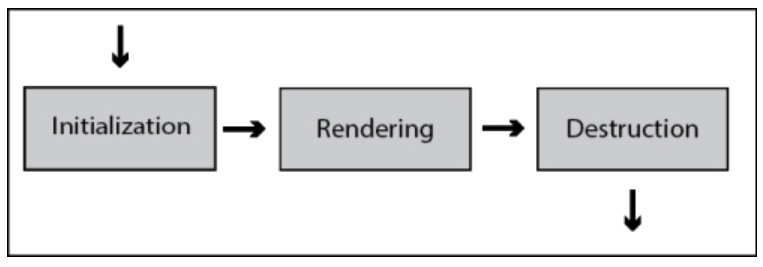

```js
var panel = Ext.create("Ext.panel.Panel",{
   title: "My First panel",
   width: 400,
   height: 250,
   renderTo: Ext.getBody()
});
```

> **NOTA:**
>

### La fase de inicialización

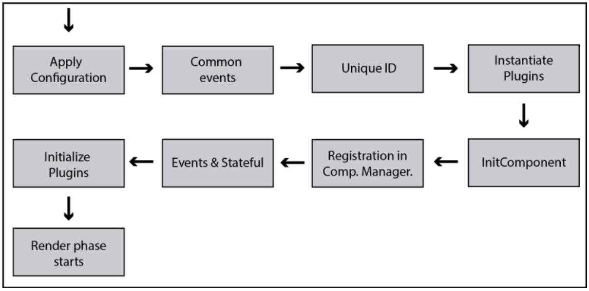

> **TIP:**
>

> **TIP:**
>

> **NOTA:**
>

```js
var panel = Ext.create("Ext.panel.Panel",{
   title: "My First panel",
   width: 400,
   height: 250
});
panel.render(Ext.getBody());
```

```js
panel.render("some-div-id");
```

> **NOTA:**
>

### La fase de renderizado

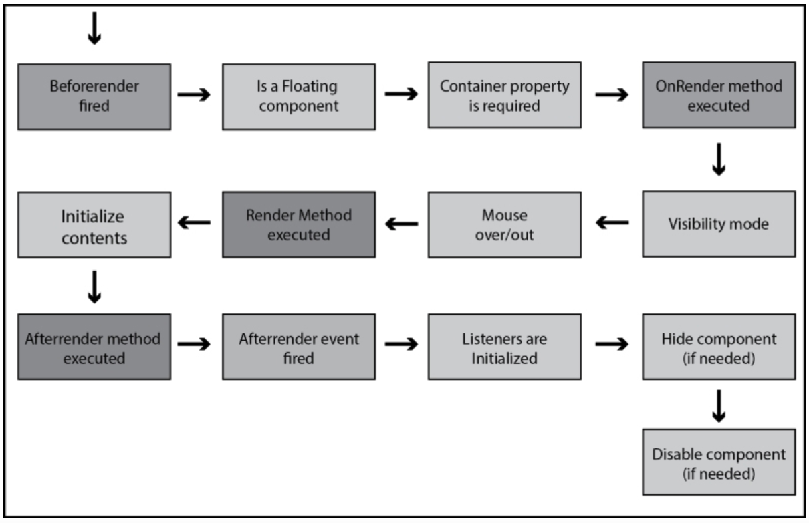

```js
//Using the HTML property
Ext.create("Ext.Component",{
   width: 300,
   height: 150,
   renderTo: Ext.getBody(),
   html: "<h1>Hello!</h1><p>This is an <strong>example</strong> of content</p>"
});

//Using an existing DOM element with an ID content
Ext.create("Ext.Component",{
   width: 300,
   height: 150,
   renderTo: Ext.getBody(),
   contentEl: "content"
});

//Using a template with data
Ext.create("Ext.Component",{
   width: 300,
   height: 150,
   renderTo: Ext.getBody(),
   data: {name:"Veronica", lastName:"Sanchez"},
   tpl: ["<h1>Content</h1><p>Hello {name} {lastName}!</p>"]
});
```

```js
var mycmp = Ext.create("Ext.Component",{
   width: 300,
   height: 150,
   data: {
      name:"Veronica",
      lastName:"Sanchez"
},
   tpl:["<h1>Content</h1><p>Hello {name} {lastName}!</p>"]
});

//The rendering phase starts for this component
mycmp.render(Ext.getBody());
```

### La fase de destrucción

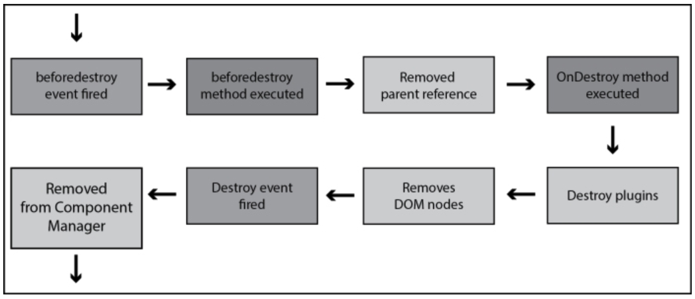

```js
//The destroy phase starts for this component
cmp.destroy();
```

### El ciclo de vida en acción

```js
Ext.define('Myapp.sample.CustomComponent',{
   extend: 'Ext.Component',
   initComponent: function(){
      var me = this;
      me.width = 200;
      me.height = 100;
      me.html = {
         tag: 'div',
         html: 'X',
         style: { // this can be replaced by a CSS rule
            'float': 'right',
            'padding': '10px',
            'background-color': '#e00',
            'color': '#fff',
            'font-weight': 'bold',
            'cursor': 'pointer'
         }
      };
      me.myOwnProperty = [1,2,3,4];
      me.callParent();
      console.log('Step 1. initComponent');
   },
   beforeRender: function(){
      console.log('Step 2. beforeRender');
      this.callParent(arguments);
   },
   onRender: function(){
      console.log('Step 3. onRender');
      this.callParent(arguments);
      this.el.setStyle('background-color','#ccc');
   },
   afterRender : function(){
      console.log('4. afterRender');
      this.el.down('div').on('click',this.myCallback,this);
      this.callParent(arguments);
   },
   beforeDestroy : function(){
      console.log('5. beforeDestroy');
      this.callParent(arguments);
   },
   onDestroy : function(){
      console.log('6. onDestroy');
      delete this.myOwnProperty;
      this.el.down('div').un('click',this.myCallback);
      this.callParent(arguments);
   },
   myCallback : function(){
      var me = this;
      Ext.Msg.confirm('Confirmation','Are you sure you want to close this panel?',function(btn){
         if(btn === 'yes'){
            me.destroy();
         }
      });
   }
});
```

```js
Ext.onReady(function(){
   Ext.create('Myapp.sample.CustomComponent',{
      renderTo : Ext.getBody()
   });
});
```

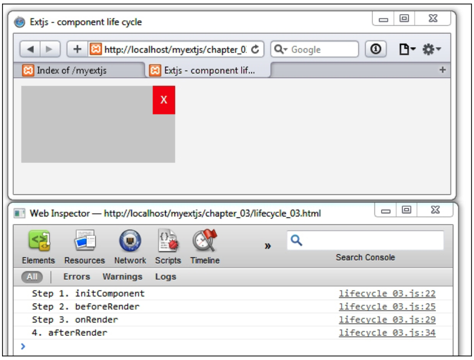

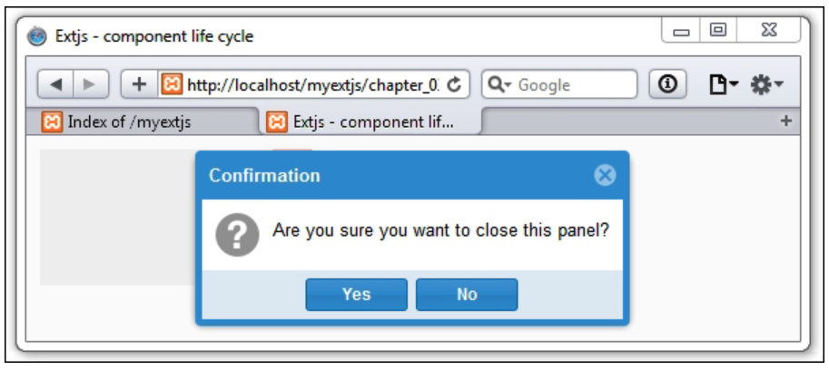

## Sobre contenedores

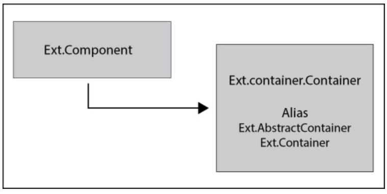

```js
Ext.define("MyApp.sample.MyContainer",{
   extend: "Ext.container.Container",   //Step 1
   border: true,
   padding: 10,
   initComponent: function(){
      var me = this;
      Ext.each(me.items,function(item){  //Step 2
         item.style = {
            backgroundColor:"#f4f4f4",
            border:"1px solid #333"
         };
         item.padding = 10;
         item.height = 100;
      });
      me.callParent();
   },
   onRender: function(){
      var me = this;
      me.callParent(arguments);
      if( me.border ){  //Step 3
         me.el.setStyle( "border" , "1px solid #333" );
      }
   }
});
```

```js
Ext.onReady(function(){
   Ext.create("MyApp.sample.MyContainer",{
      renderTo: Ext.getBody(),
      items: [{
         xtype: "component",
         html: "Child Component one"
      },{
         xtype: "component",
         html: "Child Component two"
      }]
   });
});
```

> **TIP:**
>

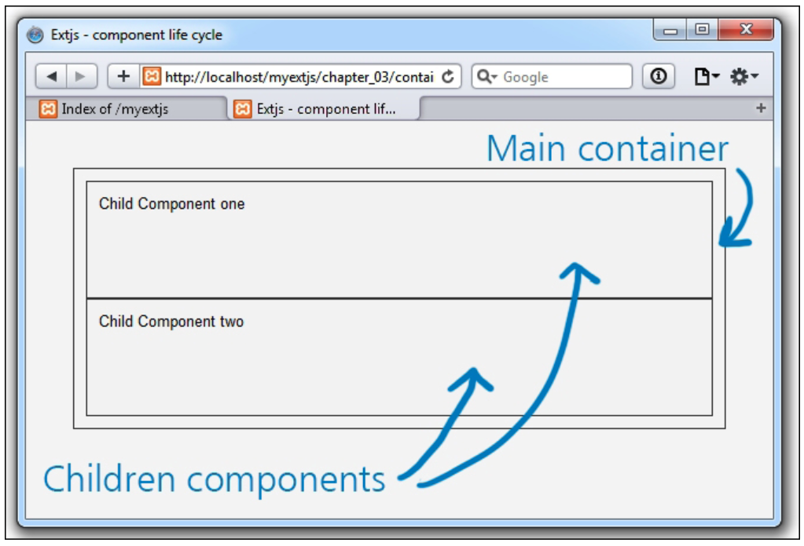

```js
Ext.onReady(function(){
   Ext.create("MyApp.sample.MyContainer",{
      renderTo: Ext.getBody(),
      defaults: {
         xtype  : "component",
         width  : 100
      },
      items  :[{
         html:"Child Component one" //xtype:"component",
      },{
         html:"Child Component two"  //xtype:"component",
      }]
   });
});
```

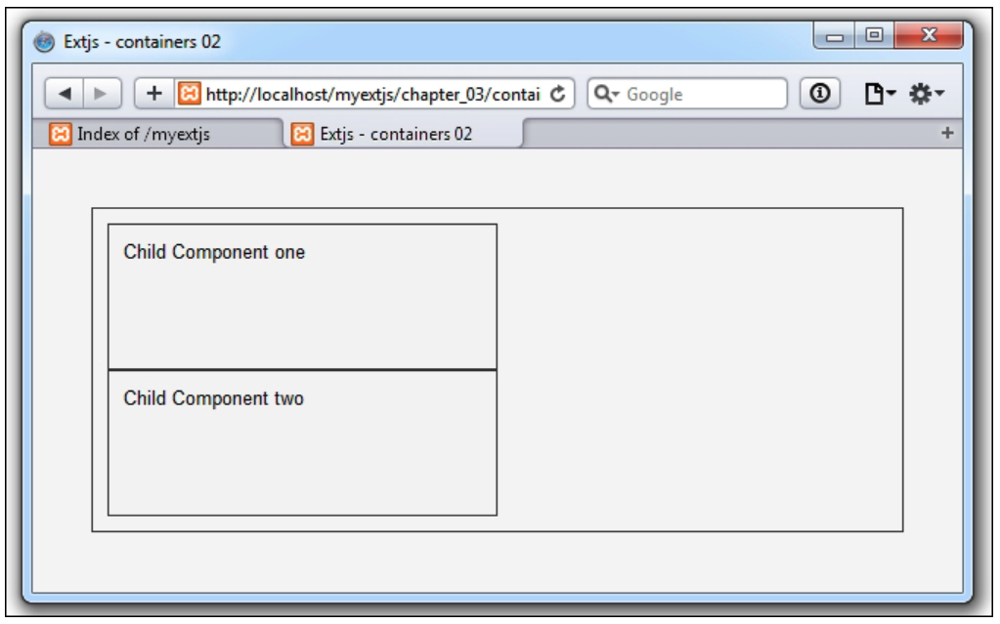

> **TIP:**
>

### Tipos de contenedores
### La viewport

```js
Ext.onReady(function(){
   Ext.create('Ext.container.Viewport',{
      padding:'5px',
      layout:'auto',
      style : {
         'background-color': '#fc9',
         'color': '#000'
      },
      html:'This is application area'
   });
});
```

> **TIP:**
>

### El panel

```js
Ext.onReady(function(){
   var MyPanel = Ext.create("Ext.panel.Panel",{
      renderTo: Ext.getBody(),
      title: 'My first panel...',
      width: 300,
      height: 220,
      html:'<b>Here</b> goes some <i>content</i>..!'
   });
});
```

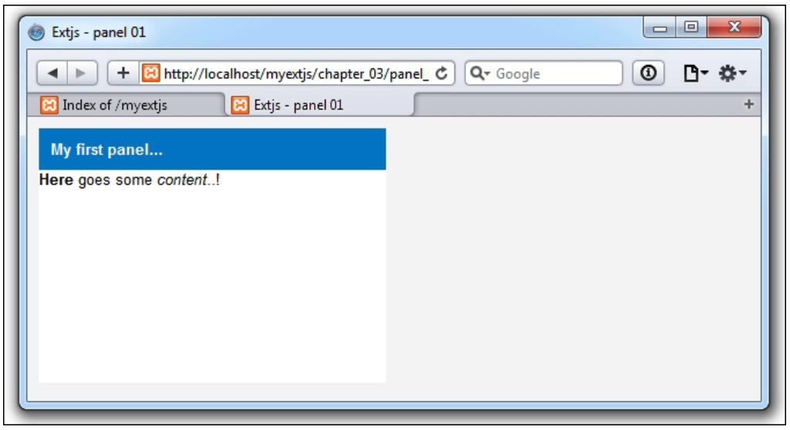

#### Paneles versus contenedores

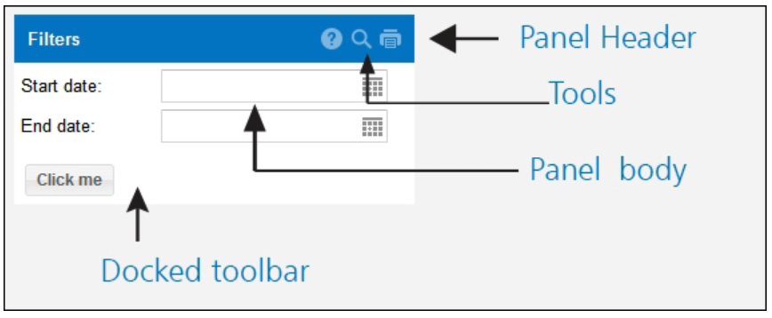

### El componente Window

```js
var win = Ext.create("Ext.window.Window",{
   title: 'My first window',
   width: 300,
   height: 200,
   maximizable: true,
   html: 'this is my first window'
});
win.show();
```

```js
Ext.create("Ext.window.Window",{
   title: 'My first window',
   width: 300,
   height: 200,
   maximizable: true,
   html: 'this is my first window'
}).show();
```

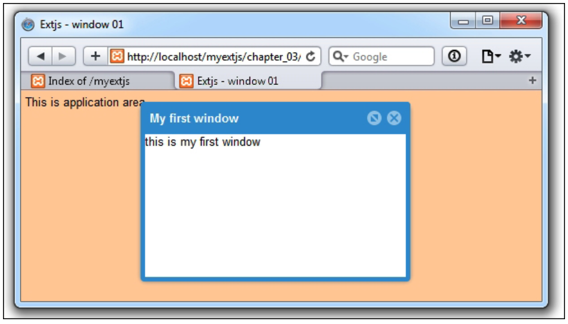


## El sistema de layout
### El Border layout

```js
Ext.onReady(function(){
   Ext.create('Ext.panel.Panel', {
      width: 500,  height: 300,
      title:  'Border Layout',
      layout: 'border',
      items: [{
         xtype: 'panel',
         title: 'South Region is resizable',
         region: 'south',     // region
         height: 100,
         split: true          // enable resizing
      },{
         xtype: 'panel',
         title: 'West Region',
         region:'west',   // region
         width: 200,
         collapsible: true,  //make panel/region collapsible
         layout: 'fit',
         split: true    // enable resizing
      },{
         title: 'Center Region',
         region: 'center',
         layout: 'fit',
         margin: '5 5 0 0',
         html:'<b>Main content</b> goes here'
      }],
      renderTo: Ext.getBody()
   });
});
```

> **NOTA:**
>

### El Fit layout

```js
Ext.onReady(function(){
   var win = Ext.create("Ext.window.Window",{
      title: "My first window",
      width: 300,
      height: 200,
      maximizable: true,
      layout: "fit",
      defaults: {
         xtype: "panel",
         height: 60,
         border: false
      },
      items: [
         {title: "Menu", html: "The main menu"},
         {title: "Content", html: "The main content!"}
      ]
   });
  win.show();
});
```

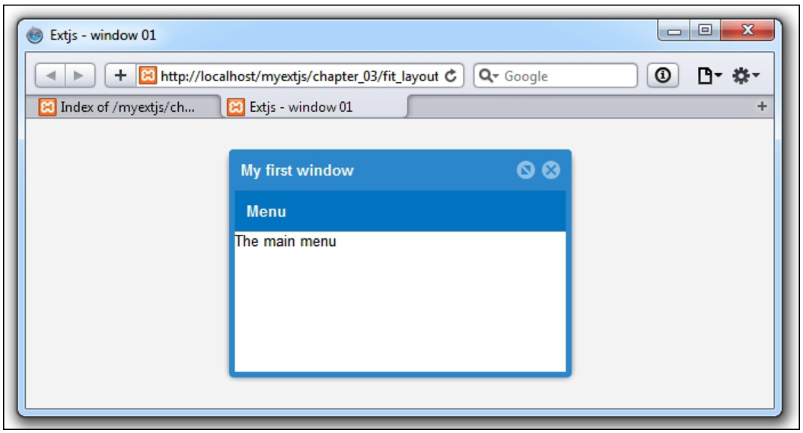

### El Card layout

```js
Ext.onReady(function(){
   var win = Ext.create("Ext.window.Window",{
      title: "My first window",
      width: 300,
      height: 200,
      maximizable: true,
      layout: "card",//Step 1
      defaults:{ xtype: "panel", height: 60, border: false },
      items: [{
         title: "Menu",
         html: "The main menu"
      },{
         title: "Content",
         html: "The main content!"
      }]
   });
   win.show();

   setTimeout(function(){
      win.getLayout().setActiveItem(1);  //Step 2
   },3000);
});
```

### El Accordion layout

```js
var win = Ext.create("Ext.window.Window",{
   title: "My first window",
   width: 300,
   height: 200,
   maximizable: true,
   layout: "accordion",
   defaults: { xtype: "panel" },
   items:[
      {title: "Menu", html: "The main menu" },
      {title: "Content", html: "The main content!" },
      {title: "3rd Panel", html: "Content here...!" }
   ]
});
```

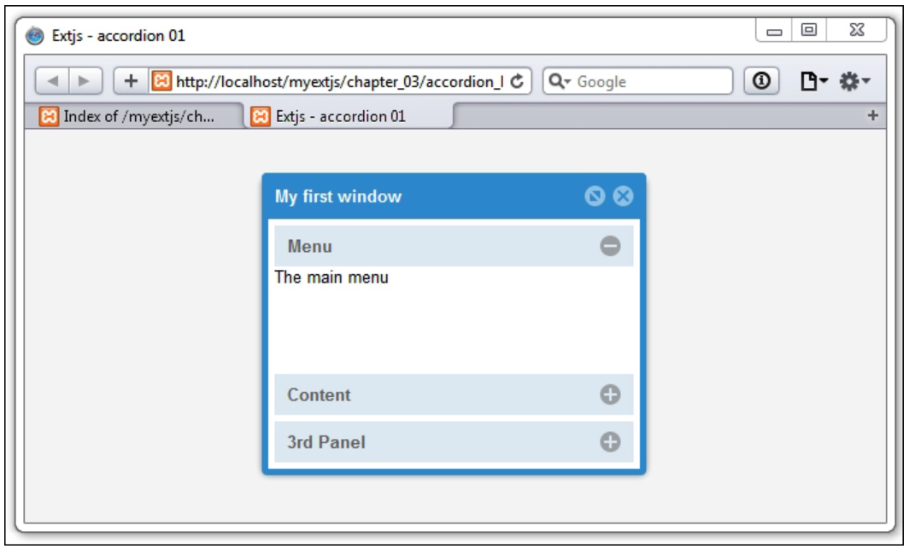

> **NOTA:**
>

### El Anchor layout

```js
Ext.onReady(function(){
   var win = Ext.create("Ext.window.Window",{
      title: "My first window",
      width: 300,
      height: 300,
      maximizable : true,
      layout: "anchor",
      defaults: {xtype: "panel", height: 60, border: false},
      items: [
         {
            title: "Menu",  html: "panel at 100% - 10 px", anchor:'-10'
         },{
            title: "Content", html: "panel at 70% of anchor",         anchor:'70%'
         },{
            title: "3rd Panel", html: "panel at 50% width and 40% height of anchor", anchor:'50% 40%', bodyStyle:'background-color:#fc3;'
         }
      ]
   });
   win.show();
});
```

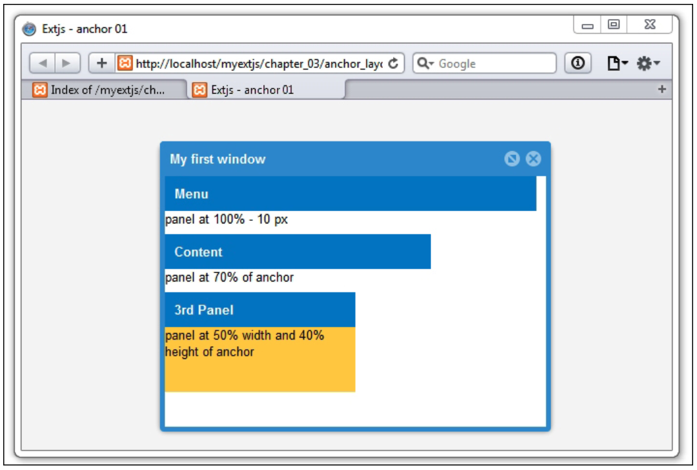

## Más layouts

## Comentarios sobre el uso de layouts

```js
Ext.onReady(function(){
   Ext.create('Ext.panel.Panel', {
      width: 500,  height: 300,
      title:  'Border Layout',
      layout: 'border',
      items: [
         {// Incorrect Nesting
            xtype: 'panel',
            title: 'West Region',
            region:'west',
            width: 200,
            collapsible: true,
            layout: 'fit'
            items:[{
               xtype: 'form',
               url: 'myForm.php'
               items[
                  // Fields here
               ]
            }]
         },{
            title: 'Center Region',
            region: 'center',
            layout: 'fit',
            margin: '5 5 0 0',
            html:'<b>Main content</b> goes here'
      }],
      renderTo: Ext.getBody()
   });
});
```

```js
{
   xtype: 'form',
   title: 'West Region',
   region:'west',
   width: 200,
   collapsible: true,
   url: 'myForm.php'
   items[
      // Fields here
   ]
}
```

## Resumen
