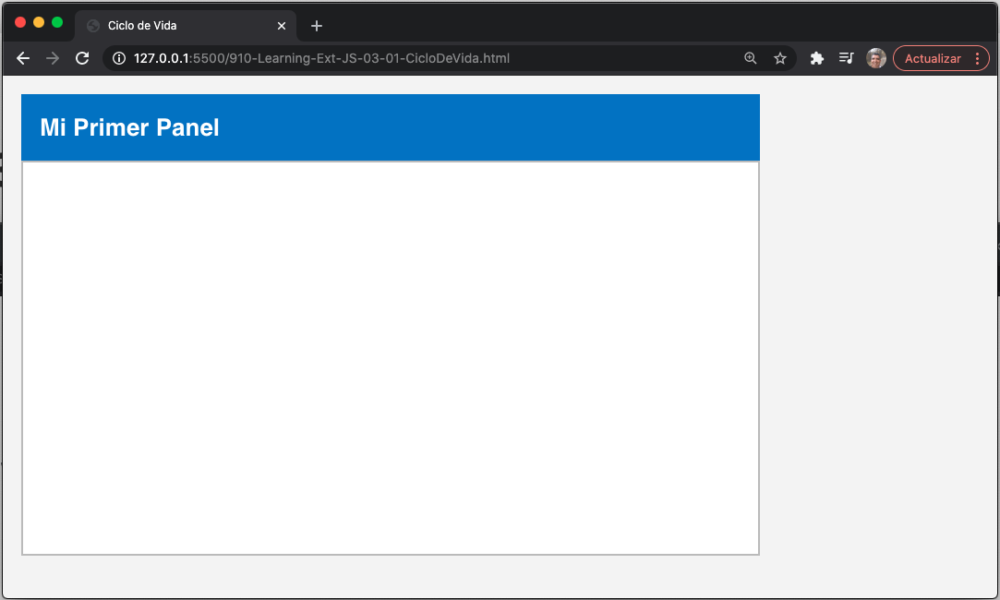
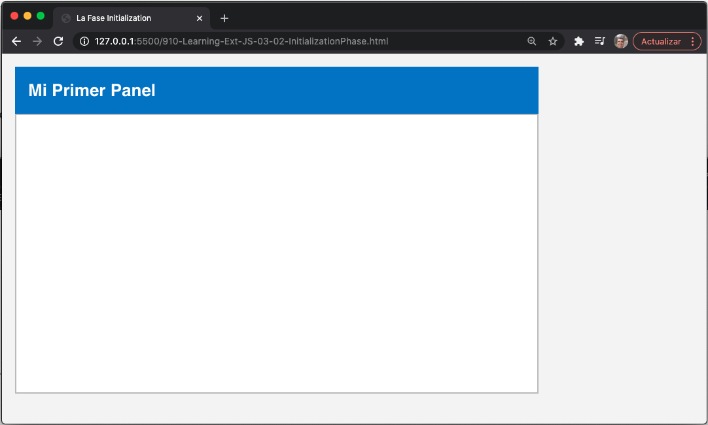
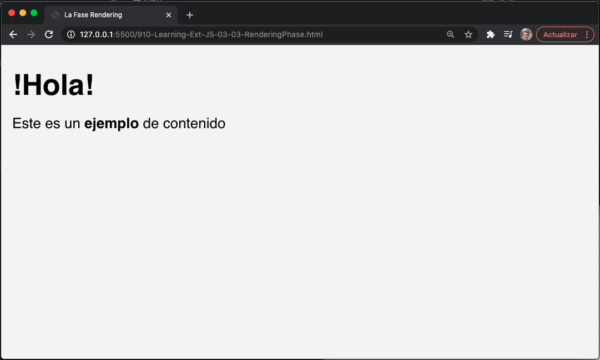
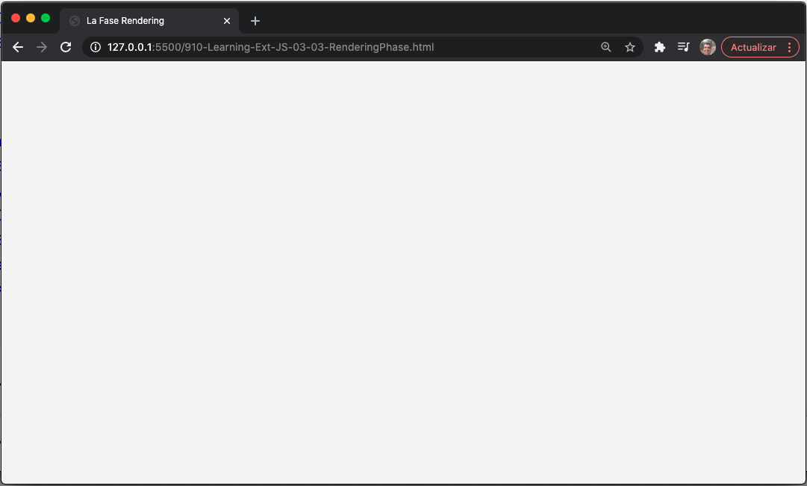
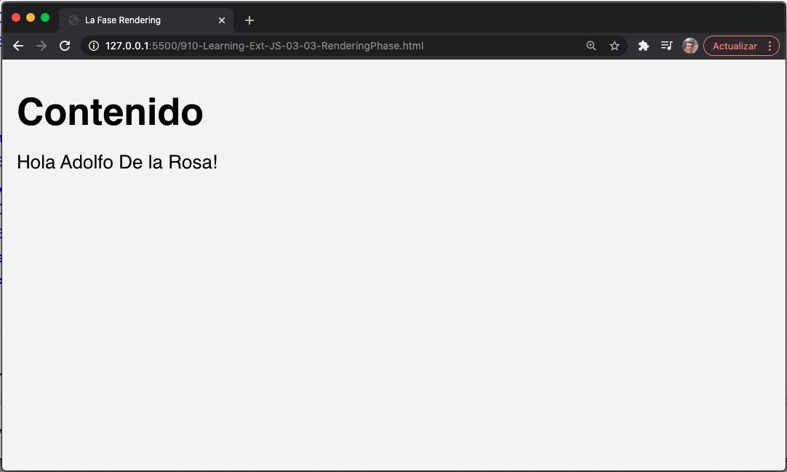
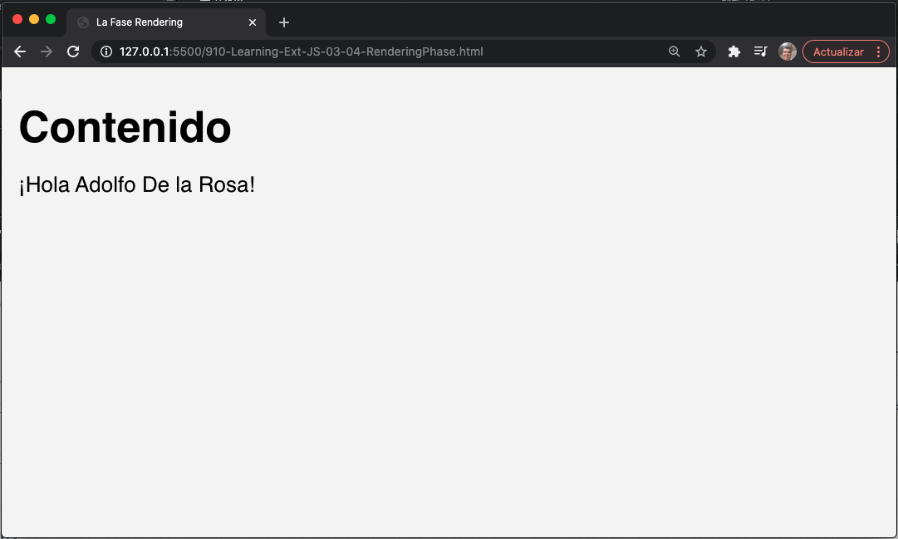
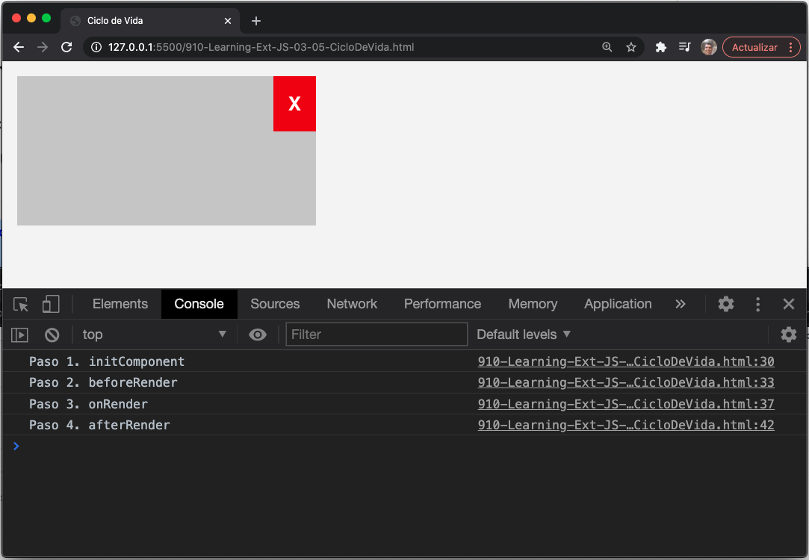
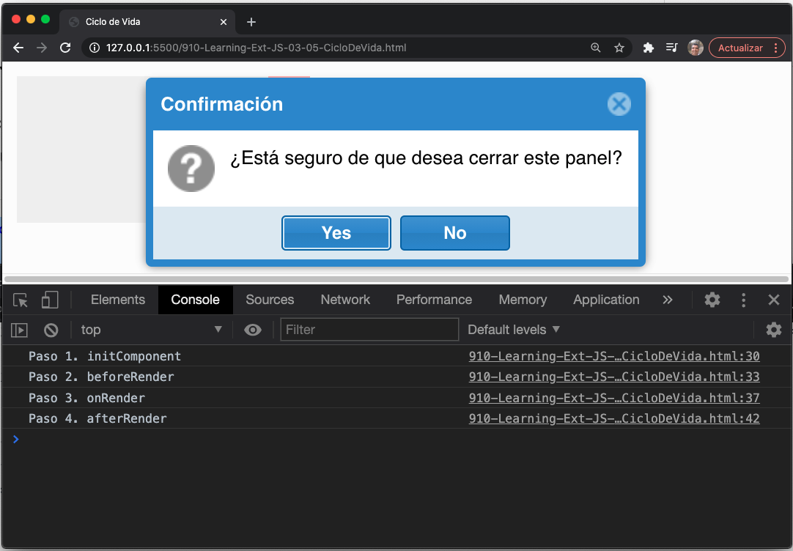
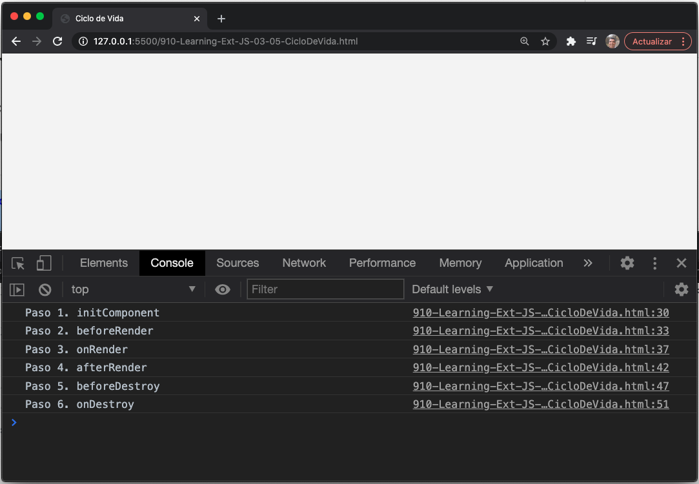

# 3. Componentes y Layouts

* El ciclo de vida de los componentes
   * La fase de inicialización
   * La fase de renderizado
   * La fase de destrucción
   * El ciclo de vida en acción
* Sobre contenedores
   * Tipos de contenedores
   * La viewport
   * El panel
       * Paneles versus contenedores
   * El componente Window
* El sistema de layout
   * El Border layout
   * El Fit layout
    * El Card layout
   * El Accordion layout
   * El Anchor layout
* Más layouts
* Comentarios sobre el uso de layouts
* Resumen

Una de las mejores características de Ext JS es la capacidad de crear diseños complejos para organizar nuestros componentes de diferentes maneras utilizando el sistema de layout y los contenedores. Desde las primeras versiones de la library, Ext JS ha tenido un gran sistema de layouts. Desde la versión 4.x, hay nuevos layouts y algunas otras partes se han rediseñado para tener un mejor rendimiento y usabilidad.

En este capítulo, aprenderá cómo funcionan los componentes, aprenderá los tipos de contenedores, cómo usar layouts y cómo hacer uso de layouts anidados para lograr diseños complejos.

Vamos a cubrir los siguientes temas en este capítulo:

* Componentes
* Contenedores
* El sistema de layouts
* Diseños layouts

## El ciclo de vida de los componentes

Antes de pasar a los sistemas de layouts y widgets, debe conocer algunos conceptos sobre cómo funcionan los componentes.

Cada componente del framework Ext JS se extiende desde la clase `Ext.Component`. Esta clase se extiende desde `Ext.Component`, o por su nombre de clase alternativo `Ext.AbstractComponent`, que proporciona métodos compartidos para componentes en todo el framework.

> **NOTA:**
> Para comprender más sobre las jerarquías de componentes, consulte http://docs.sencha.com/extjs/5.1/core_concepts/components.html.
 
Cuando creamos componentes como panels, windows, grids, trees y cualquier otro, hay un proceso llamado "ciclo de vida del componente" que debe comprender.

Es importante para nosotros conocer las cosas que ocurren durante cada una de las fases del proceso del ciclo de vida. Esto nos ayudará a crear componentes personalizados o ampliar los existentes.

Básicamente, hay tres fases en el ciclo de vida del componente: ***el proceso de inicialización, el proceso de renderizado y el proceso de destrucción***.

***La fase de inicialización*** inicializa nuestra nueva instancia y se registra en el administrador de componentes; luego, ***la fase de renderizado*** creará todos los nodos requeridos en el DOM, y luego se ejecutará ***la fase de destrucción*** cuando se destruya el componente, eliminando los listeners y los nodos del DOM:


La clase `Ext.AbstractComponent/Ext.Component` dirige el proceso del ciclo de vida, y cada clase que se extiende desde la clase `Component` participará en el ciclo de vida automáticamente. Todos los componentes visuales (widgets) se extienden desde estas clases y si estamos planeando crear nuestros propios componentes personalizados, también deberíamos extendernos desde esas clases.

Para comprender mejor las tres fases, creemos un componente de panel y veamos qué sucede en cada fase paso a paso:

```js
var panel = Ext.create("Ext.panel.Panel",{
   title: "My First panel",
   width: 400,
   height: 250,
   renderTo: Ext.getBody()
});
```

> **NOTA:**
> Cuando se habla del width y height de los componentes, la unidad de medida se maneja en píxeles.
 
#### 🔴 6️⃣ 💻 Mi versión `910-Learning-Ext-JS-03-01-CicloDeVida.html`

`910-Learning-Ext-JS-03-01-CicloDeVida.html`

```js
<!DOCTYPE html>
<html>
   <head>
      <title>Ciclo de Vida</title>
      <meta name="viewport" content="width=device-width, initial-scale=1, maximum-scale=1, user-scalable=no"> 
      <link href = "https://cdnjs.cloudflare.com/ajax/libs/extjs/6.0.0/classic/theme-neptune/resources/theme-neptune-all.css" rel = "stylesheet" />
      <script type = "text/javascript" src = "https://cdnjs.cloudflare.com/ajax/libs/extjs/6.0.0/ext-all.js"></script>

      <script type = "text/javascript">
         Ext.onReady(function(){
            var panel = Ext.create("Ext.panel.Panel",{
               title: "Mi Primer Panel",
               width: 400,
               height: 250,
               renderTo: Ext.getBody()
            });
         });    
      </script>
   </head>
   
   <body style="padding:10px;">  
      
   </body>
</html>
```



### La fase de inicialización

El objetivo principal de esta fase es crear la instancia del componente de acuerdo con las configuraciones que definimos. También registra nuestro nuevo componente en el administrador de componentes y algunas otras cosas. La siguiente captura de pantalla muestra todos los pasos de esta fase:


Veamos todos los pasos de esta fase en detalle:

1. El primer paso es aplicar las propiedades de configuración a la instancia generada de la clase que estamos creando. En el código anterior, las propiedades `title`, `width`, `height` y `renderTo` se copiarán a la instancia del panel, así como a cualquier otra propiedad que decidamos definir.
2. El segundo paso es definir eventos comunes, como enable, disable o show. Estos son eventos comunes para todos los componentes.
3. El siguiente paso es asignar un ID a la instancia. Si definimos una ID en el objeto de configuración, la instancia usará ese ID. En nuestro ejemplo, no especificamos un ID. En este caso, se asigna un ID generado automáticamente.

   > **TIP:**
   > La asignación de ID a nuestros componentes se considera una mala práctica. Necesitamos evitar hacer eso porque deberían ser únicos. Si trabajamos en un gran proyecto con otros desarrolladores, existe una gran posibilidad de que repitamos las ID. La duplicación de ID nos llevará a comportamientos inesperados, porque la ID del componente se usa en los elementos DOM al renderizar el componente, lo que hace que uno de los componentes desaparezca.

4. En el cuarto paso, el proceso de creación verifica si hemos definido complementos en nuestra configuración e intenta crear todas las instancias necesarias para esos complementos. Un complemento es una funcionalidad adicional para nuestras instancias. En nuestro ejemplo anterior, no definimos ningún complemento, por lo que se omite este paso.
5. En el quinto paso, se ejecuta la función `initComponent`. Debemos anular este método en nuestras subclases si queremos ejecutar código cuando se crea la instancia.

   > **TIP:**
   > Hay muchos más métodos definidos por la clase `Component`. Estos métodos de plantilla están pensados para ser reemplazados en las subclases para agregar funcionalidad específica en diferentes fases del ciclo de vida.

6. En este paso, la nueva instancia se agrega al objeto `Ext.ComponentManager`. Esto significa que cada componente que creamos se almacenará en el administrador de componentes, lo que nos permitirá obtener cualquier referencia utilizando el método `Ext.getCmp` y pasando el `ID` como parámetro:

   ```js
   //getting a component by its ID
   var panel = Ext.getCmp("panel-1234");
   console.log(panel);
   ```
   
   > **NOTA:**
   > El método `getCmp` es ideal para depurar aplicaciones. Podemos obtener el ID de cualquier componente mirando los elementos DOM. Luego, podemos obtener la instancia e inspeccionar el estado de nuestro objeto, pero no se recomienda usar este método en nuestro código. En su lugar, podemos usar el método `Ext.ComponentQuery.query` como ejemplo de la siguiente manera:
   >
   > `Ext.ComponentQuery.query ('panel')`
   >
   > Este ejemplo recuperará un array (de `xtype` panel o `Ext.panel.Panel`) que existe/está creada.

7. La clase `Component` contiene dos mixins, uno para la gestión de eventos y otro para el estado de nuestros componentes. En este paso, los dos mixins se inicializan llamando a su constructor.
8. Si hemos definido complementos, ya deberían estar instanciados en el paso anterior, y ahora deben inicializarse llamando al método `init()` de cada complemento y pasando nuestra instancia de componente como parámetro. Aprenderá cómo funcionan los complementos y cómo crear uno desde cero más adelante en este libro.

Si la propiedad `renderTo` ha sido definida en las configuraciones, la fase de renderizado comienza en este paso, lo que significa que todos los nodos requeridos que representan visualmente nuestro componente serán insertados en el DOM. Si no definimos esta propiedad, no pasa nada y somos responsables de renderizar nuestra instancia siempre que necesitemos:

```js
var panel = Ext.create("Ext.panel.Panel",{
   title: "My First panel",
   width: 400,
   height: 250
});
panel.render(Ext.getBody());
```

Si queremos renderizar nuestro componente más tarde, podemos llamar al método `render` de nuestra instancia y pasar el lugar donde queremos agregar nuestro nuevo componente como parámetro. En el código anterior, estamos renderizando nuestro panel en el cuerpo de nuestro documento, pero también podemos establecer el ID del nodo donde queremos colocar nuestro componente, por ejemplo:

```js
panel.render("some-div-id");
```

> **NOTA:**
> Si el componente está dentro de otro componente o contenedor, no es necesario llamar al método `panel.render`, ya que se procesará cuando se cree/renderice el contenedor.
 
#### 🔴 6️⃣ 💻 Mi versión `910-Learning-Ext-JS-03-02-InitializationPhase.html`

`910-Learning-Ext-JS-03-02-InitializationPhase.html`

```js
<!DOCTYPE html>
<html>
   <head>
      <title>La Fase Initialization</title>
      <meta name="viewport" content="width=device-width, initial-scale=1, maximum-scale=1, user-scalable=no"> 
      <link href = "https://cdnjs.cloudflare.com/ajax/libs/extjs/6.0.0/classic/theme-neptune/resources/theme-neptune-all.css" rel = "stylesheet" />
      <script type = "text/javascript" src = "https://cdnjs.cloudflare.com/ajax/libs/extjs/6.0.0/ext-all.js"></script>

      <script type = "text/javascript">
         Ext.onReady(function(){
            var panel = Ext.create("Ext.panel.Panel",{
               title: "Mi Primer Panel",
               width: 400,
               height: 250
            });
            panel.render(Ext.getBody());
         });    
      </script>
   </head>
   
   <body style="padding:10px;">  
      
   </body>
</html>
```



### La fase de renderizado

La fase de renderizado solo ocurre si el componente aún no está renderizado. En esta fase, todos los nodos requeridos se insertarán en el DOM, se aplicarán los estilos y listeners, y podremos ver e interactuar con nuestro nuevo componente. El siguiente diagrama muestra los pasos que se ejecutan durante esta fase:


Ahora, entendamos el diagrama anterior paso a paso:

1. En el primer paso, se activa el evento `beforeRender`. Si algunos de los listeners devuelven `false`, la fase de renderizado se detiene.
2. En el segundo paso, el proceso verifica si el componente que se está renderizando es un componente flotante, como un menú o una window, para asignar la propiedad `z-index` correcta. `z-index` es una propiedad de CSS que especifica el orden de pila de un elemento. El mayor número asignado estará siempre delante del resto de elementos.
3. El tercer paso es inicializar el contenedor creando la propiedad `container`, que se refiere al elemento DOM, donde se renderizará el nuevo componente. La propiedad `container` es una instancia de `Ext.dom.Element`.
4. En el cuarto paso, se ejecuta el método `onRender`. Se crea la propiedad `el`, que contiene el elemento de nodo principal del componente. Podemos definir un template para nuestros componentes; si hacemos eso, la plantilla se creará y se agregará al nodo principal en este paso. Podemos override el método `onRender` en nuestras subclases para agregar nodos específicos al DOM.
5. El siguiente paso es configurar el modo de visibilidad. Hay tres modos para ocultar el elemento del componente (display, visibility, o offset).
6. Si se establece la propiedad `overCls`, se establece un listener para el mouse over y mouse out para agregar o eliminar la clase `css` para cada estado. Podemos establecer algunas reglas CSS para estas clases para modificar el aspecto de nuestros componentes.
7. En el séptimo paso, se activa el evento `render`. La instancia del componente se pasa como parámetro a los listeners.
8. El octavo paso es inicializar el contenido. Hay tres formas de establecer el contenido del componente:

   1. Podemos definir una propiedad `html` con etiquetas y nodos que se agregarán al contenido de nuestro nuevo componente.
   2. Podemos definir la propiedad `contentEl` que debería ser el ID de un elemento DOM existente. Este elemento se colocará como contenido del componente.
   3. Podemos definir una propiedad `tpl` con una plantilla que se agregará al contenido. Además, debemos definir una propiedad de datos con un objeto que contenga los reemplazos en nuestra plantilla. Hablaremos de plantillas en capítulos futuros.

9. El siguiente código muestra las tres formas de agregar contenido HTML a un componente. Debemos usar solo una vía a la vez.

```js
//Using the HTML property
Ext.create("Ext.Component",{
   width: 300,
   height: 150,
   renderTo: Ext.getBody(),
   html: "<h1>Hello!</h1><p>This is an <strong>example</strong> of content</p>"
});

//Using an existing DOM element with an ID content
Ext.create("Ext.Component",{
   width: 300,
   height: 150,
   renderTo: Ext.getBody(),
   contentEl: "content"
});

//Using a template with data
Ext.create("Ext.Component",{
   width: 300,
   height: 150,
   renderTo: Ext.getBody(),
   data: {name:"Veronica", lastName:"Sanchez"},
   tpl: ["<h1>Content</h1><p>Hello {name} {lastName}!</p>"]
});
```

10. Volviendo a la fase de renderizado, el siguiente paso es ejecutar el método `afterRender`. Si el componente contiene elementos secundarios, estos también se representan en este paso. Hablaremos de contenedores más tarde.
11. En el décimo paso, se dispara el evento `afterRender`. Podemos escuchar este evento en nuestras subclases para realizar algunas acciones cuando todos los nodos requeridos se representan en el DOM.
12. En el undécimo paso, se inicializan todos los escuchas que dependen de los nuevos nodos.
13. El último paso es ocultar el nodo del componente principal si la propiedad `hidden` se establece en `true` en nuestro parámetro de configuraciones. Y también, si la propiedad `disabled` se establece en `true`, entonces el componente ejecuta el método `disable`, que agrega algunas clases CSS al nodo principal para hacer que los componentes parezcan deshabilitados y marcar la bandera `disabled` como `true`.

El siguiente código muestra un ejemplo de cómo funciona la fase de renderizado. Estamos comenzando todo el proceso llamando al método render:

```js
var mycmp = Ext.create("Ext.Component",{
   width: 300,
   height: 150,
   data: {
      name:"Veronica",
      lastName:"Sanchez"
},
   tpl:["<h1>Content</h1><p>Hello {name} {lastName}!</p>"]
});

//The rendering phase starts for this component
mycmp.render(Ext.getBody());
```

Al conocer los pasos que se ejecutan dentro de la fase de renderizado, podremos sobrescribir los métodos como `onRender`, `render` o `afterRender ` en nuestras propias clases. Esto es muy útil al crear nuevos componentes o widgets.

#### 🔴 6️⃣ 💻 Mi versión `910-Learning-Ext-JS-03-03-RenderingPhase.html`

`910-Learning-Ext-JS-03-03-RenderingPhase.html`

```js
<!DOCTYPE html>
<html>
   <head>
      <title>La Fase Rendering</title>
      <meta name="viewport" content="width=device-width, initial-scale=1, maximum-scale=1, user-scalable=no"> 
      <link href = "https://cdnjs.cloudflare.com/ajax/libs/extjs/6.0.0/classic/theme-neptune/resources/theme-neptune-all.css" rel = "stylesheet" />
      <script type = "text/javascript" src = "https://cdnjs.cloudflare.com/ajax/libs/extjs/6.0.0/ext-all.js"></script>

      <script type = "text/javascript">
         Ext.onReady(function(){
            //Using the HTML property
            
            Ext.create("Ext.Component",{
               width: 300,
               height: 150,
               renderTo: Ext.getBody(),
               html: "<h1>!Hola!</h1><p>Este es un <strong>ejemplo</strong> de contenido</p>"
            });
            
            /*
            //Using an existing DOM element with an ID content
            Ext.create("Ext.Component",{
               width: 300,
               height: 150,
               renderTo: Ext.getBody(),               
               contentEl: "content"
            });
            */
            /*
            //Using a template with data
            Ext.create("Ext.Component",{
               width: 300,
               height: 150,
               renderTo: Ext.getBody(),
               data: {name:"Adolfo", lastName:"De la Rosa"},
               tpl: ["<h1>Contenido</h1><p>Hola {name} {lastName}!</p>"]
            });
            */
         });    
      </script>
   </head>
   
   <body style="padding:10px;">  
      <div id="content"></div>
   </body>
</html>
```

Este ejemplo tiene tres formas diferentes de renderizar, se usa una sola a la vez, las salidas obtenidas para cada bloque son:





#### 🔴 6️⃣ 💻 Mi versión `910-Learning-Ext-JS-03-04-RenderingPhase.html`

`910-Learning-Ext-JS-03-04-RenderingPhase.html`

```js
<!DOCTYPE html>
<html>
   <head>
      <title>La Fase Rendering</title>
      <meta name="viewport" content="width=device-width, initial-scale=1, maximum-scale=1, user-scalable=no"> 
      <link href = "https://cdnjs.cloudflare.com/ajax/libs/extjs/6.0.0/classic/theme-neptune/resources/theme-neptune-all.css" rel = "stylesheet" />
      <script type = "text/javascript" src = "https://cdnjs.cloudflare.com/ajax/libs/extjs/6.0.0/ext-all.js"></script>

      <script type = "text/javascript">
         Ext.onReady(function(){
            var mycmp = Ext.create("Ext.Component",{
               width: 300,
               height: 150,
               data: {
                  name:"Adolfo",
                  lastName:"De la Rosa"
               },
               tpl:["<h1>Contenido</h1><p>¡Hola {name} {lastName}!</p>"]
               });

               //The rendering phase starts for this component
               mycmp.render(Ext.getBody());
         });    
      </script>
   </head>
   
   <body style="padding:10px;">  
      
   </body>
</html>
```



### La fase de destrucción

La idea principal de esta fase es limpiar el DOM, eliminar los listeners y borrar la memoria utilizada eliminando objetos y arrays. Es muy importante destruir todos nuestros componentes cuando ya no los queremos. La fase de destrucción se ejecutará cuando el usuario finalice la tarea con nuestro componente, por ejemplo, si creamos una ventana y la propiedad `closeAction` de esta ventana está configurada con `destroy` (este valor está configurado por defecto), la fase de destrucción se invocará cuando el el usuario cierra la ventana.

El siguiente diagrama muestra los pasos que se ejecutan en esta fase:


1. La fase de destrucción comienza con el evento `beforeDestroy`. Si algún listener devuelve `false`, entonces la destrucción se detiene; de lo contrario, si la destrucción continúa y el componente está flotando, esto no se registra en el administrador flotante.
2. El segundo paso ejecuta el método `beforeDestroy`. Algunas subclases utilizan este método para eliminar a sus hijos o para borrar la memoria.
3. En el tercer paso, si el componente que se está destruyendo es hijo de otro componente, se elimina la referencia principal a este componente.
4. En el cuarto paso, se ejecuta el método `onDestroy`. Debemos extender este método para destruir nuestro componente correctamente, y también asegurarnos de que los componentes secundarios que se agreguen se destruyan y de que se limpien los listeners personalizados que creamos.
5. El quinto paso intenta destruir todos los complementos, si los hay, y también indicar que los mixins se están destruyendo.
6. Si se procesa el componente, en el sexto paso, todos los nodos del DOM se purgan (listeners) y se eliminan del documento.
7. En el siguiente paso, se activa el evento `destroy`. Podemos escuchar este evento y realizar algunas acciones si es necesario.
8. El último paso es anular el registro de la instancia del componente del administrador de componentes y borrar todos los eventos.

Una cosa importante a tener en cuenta es que siempre debemos eliminar y borrar la memoria que estamos usando en nuestros componentes, así como los nodos en el DOM que hemos agregado antes. Debemos anular los métodos apropiados para destruir nuestros componentes correctamente.

Si queremos eliminar un componente, podemos ejecutar el método `destroy` del componente. Este método activará la fase de destrucción y se ejecutarán todos los pasos anteriores:

```js
//The destroy phase starts for this component
cmp.destroy();
```

### El ciclo de vida en acción

Ahora que conocemos el proceso de creación de un componente, podemos crear nuestro propio componente, aprovechando el ciclo de vida para personalizar nuestro componente. El siguiente ejemplo muestra los métodos que podemos anular para agregar la funcionalidad que necesitamos en cualquiera de los pasos disponibles del ciclo de vida:

```js
Ext.define('Myapp.sample.CustomComponent',{
   extend: 'Ext.Component',
   initComponent: function(){
      var me = this;
      me.width = 200;
      me.height = 100;
      me.html = {
         tag: 'div',
         html: 'X',
         style: { // this can be replaced by a CSS rule
            'float': 'right',
            'padding': '10px',
            'background-color': '#e00',
            'color': '#fff',
            'font-weight': 'bold',
            'cursor': 'pointer'
         }
      };
      me.myOwnProperty = [1,2,3,4];
      me.callParent();
      console.log('Step 1. initComponent');
   },
   beforeRender: function(){
      console.log('Step 2. beforeRender');
      this.callParent(arguments);
   },
   onRender: function(){
      console.log('Step 3. onRender');
      this.callParent(arguments);
      this.el.setStyle('background-color','#ccc');
   },
   afterRender : function(){
      console.log('4. afterRender');
      this.el.down('div').on('click',this.myCallback,this);
      this.callParent(arguments);
   },
   beforeDestroy : function(){
      console.log('5. beforeDestroy');
      this.callParent(arguments);
   },
   onDestroy : function(){
      console.log('6. onDestroy');
      delete this.myOwnProperty;
      this.el.down('div').un('click',this.myCallback);
      this.callParent(arguments);
   },
   myCallback : function(){
      var me = this;
      Ext.Msg.confirm('Confirmation','Are you sure you want to close this panel?',function(btn){
         if(btn === 'yes'){
            me.destroy();
         }
      });
   }
});
```

La clase anterior overrides los **template methods**. Este término se utiliza para los métodos que se ejecutan automáticamente durante el ciclo de vida. A partir del código anterior, podemos ver cómo agregar contenido usando la propiedad `html`, cómo agregar listeners a los elementos que creamos y, lo que es más importante, cómo destroy y clear nuestros eventos y objetos personalizados.

Para probar nuestra clase, necesitamos crear un archivo HTML llamado archivo `lifecycle_03.html`, incluir la library Ext JS y nuestra clase, y luego debemos crear la instancia de nuestra clase de la siguiente manera:

```js
Ext.onReady(function(){
   Ext.create('Myapp.sample.CustomComponent',{
      renderTo : Ext.getBody()
   });
});
```

Como resultado, veremos algo como la siguiente captura de pantalla en su navegador:


Como podemos ver, hay cuatro mensajes en la consola de JavaScript. Estos mensajes fueron enviados por cada uno de los métodos que hemos overridden. También podemos ver el orden de ejecución en función del ciclo de vida. Ahora, si queremos destruir este componente, debemos hacer clic en el botón rojo en la parte superior derecha. Esta acción llamará al método `destroy` que es responsable de borrar los nodos del DOM, eventos y objetos de la memoria.


Comprender el ciclo de vida de los componentes en Ext JS es esencial para agregar events/listeners personalizados para que podamos proporcionar la funcionalidad adecuada y el código personalizado en nuestra aplicación.

#### 🔴 6️⃣ 💻 Mi versión `910-Learning-Ext-JS-03-05-CicloDeVida.html`

`910-Learning-Ext-JS-03-05-CicloDeVida.html`

```js
<!DOCTYPE html>
<html>
   <head>
      <title>Ciclo de Vida</title>
      <meta name="viewport" content="width=device-width, initial-scale=1, maximum-scale=1, user-scalable=no"> 
      <link href = "https://cdnjs.cloudflare.com/ajax/libs/extjs/6.0.0/classic/theme-neptune/resources/theme-neptune-all.css" rel = "stylesheet" />
      <script type = "text/javascript" src = "https://cdnjs.cloudflare.com/ajax/libs/extjs/6.0.0/ext-all.js"></script>

      <script type = "text/javascript">
         Ext.define('Myapp.sample.CustomComponent',{
            extend: 'Ext.Component',
            initComponent: function(){
               var me = this;
               me.width = 200;
               me.height = 100;
               me.html = {
                  tag: 'div',
                  html: 'X',
                  style: { // this can be replaced by a CSS rule
                     'float': 'right',
                     'padding': '10px',
                     'background-color': '#e00',
                     'color': '#fff',
                     'font-weight': 'bold',
                     'cursor': 'pointer'
                  }
               };
               me.myOwnProperty = [1,2,3,4];
               me.callParent();
               console.log('Paso 1. initComponent');
            },
            beforeRender: function(){
               console.log('Paso 2. beforeRender');
               this.callParent(arguments);
            },
            onRender: function(){
               console.log('Paso 3. onRender');
               this.callParent(arguments);
               this.el.setStyle('background-color','#ccc');
            },
            afterRender : function(){
               console.log('Paso 4. afterRender');
               this.el.down('div').on('click',this.myCallback,this);
               this.callParent(arguments);
            },
            beforeDestroy : function(){
               console.log('Paso 5. beforeDestroy');
               this.callParent(arguments);
            },
            onDestroy : function(){
               console.log('Paso 6. onDestroy');
               delete this.myOwnProperty;
               this.el.down('div').un('click',this.myCallback);
               this.callParent(arguments);
            },
            myCallback : function(){
               var me = this;
               Ext.Msg.confirm('Confirmación','¿Está seguro de que desea cerrar este panel?',function(btn){
                  if(btn === 'yes'){
                     me.destroy();
                  }
               });
            }
         });
         Ext.onReady(function(){
            Ext.create('Myapp.sample.CustomComponent',{
               renderTo : Ext.getBody()
            });
         });    
      </script>
   </head>
   
   <body style="padding:10px;">  
      
   </body>
</html>
```






## Sobre contenedores


```js
Ext.define("MyApp.sample.MyContainer",{
   extend: "Ext.container.Container",   //Step 1
   border: true,
   padding: 10,
   initComponent: function(){
      var me = this;
      Ext.each(me.items,function(item){  //Step 2
         item.style = {
            backgroundColor:"#f4f4f4",
            border:"1px solid #333"
         };
         item.padding = 10;
         item.height = 100;
      });
      me.callParent();
   },
   onRender: function(){
      var me = this;
      me.callParent(arguments);
      if( me.border ){  //Step 3
         me.el.setStyle( "border" , "1px solid #333" );
      }
   }
});
```

```js
Ext.onReady(function(){
   Ext.create("MyApp.sample.MyContainer",{
      renderTo: Ext.getBody(),
      items: [{
         xtype: "component",
         html: "Child Component one"
      },{
         xtype: "component",
         html: "Child Component two"
      }]
   });
});
```

> **TIP:**
>


```js
Ext.onReady(function(){
   Ext.create("MyApp.sample.MyContainer",{
      renderTo: Ext.getBody(),
      defaults: {
         xtype  : "component",
         width  : 100
      },
      items  :[{
         html:"Child Component one" //xtype:"component",
      },{
         html:"Child Component two"  //xtype:"component",
      }]
   });
});
```


> **TIP:**
>

### Tipos de contenedores
### La viewport

```js
Ext.onReady(function(){
   Ext.create('Ext.container.Viewport',{
      padding:'5px',
      layout:'auto',
      style : {
         'background-color': '#fc9',
         'color': '#000'
      },
      html:'This is application area'
   });
});
```

> **TIP:**
>

### El panel

```js
Ext.onReady(function(){
   var MyPanel = Ext.create("Ext.panel.Panel",{
      renderTo: Ext.getBody(),
      title: 'My first panel...',
      width: 300,
      height: 220,
      html:'<b>Here</b> goes some <i>content</i>..!'
   });
});
```


#### Paneles versus contenedores


### El componente Window

```js
var win = Ext.create("Ext.window.Window",{
   title: 'My first window',
   width: 300,
   height: 200,
   maximizable: true,
   html: 'this is my first window'
});
win.show();
```

```js
Ext.create("Ext.window.Window",{
   title: 'My first window',
   width: 300,
   height: 200,
   maximizable: true,
   html: 'this is my first window'
}).show();
```


## El sistema de layout
### El Border layout

```js
Ext.onReady(function(){
   Ext.create('Ext.panel.Panel', {
      width: 500,  height: 300,
      title:  'Border Layout',
      layout: 'border',
      items: [{
         xtype: 'panel',
         title: 'South Region is resizable',
         region: 'south',     // region
         height: 100,
         split: true          // enable resizing
      },{
         xtype: 'panel',
         title: 'West Region',
         region:'west',   // region
         width: 200,
         collapsible: true,  //make panel/region collapsible
         layout: 'fit',
         split: true    // enable resizing
      },{
         title: 'Center Region',
         region: 'center',
         layout: 'fit',
         margin: '5 5 0 0',
         html:'<b>Main content</b> goes here'
      }],
      renderTo: Ext.getBody()
   });
});
```

> **NOTA:**
>

### El Fit layout

```js
Ext.onReady(function(){
   var win = Ext.create("Ext.window.Window",{
      title: "My first window",
      width: 300,
      height: 200,
      maximizable: true,
      layout: "fit",
      defaults: {
         xtype: "panel",
         height: 60,
         border: false
      },
      items: [
         {title: "Menu", html: "The main menu"},
         {title: "Content", html: "The main content!"}
      ]
   });
  win.show();
});
```


### El Card layout

```js
Ext.onReady(function(){
   var win = Ext.create("Ext.window.Window",{
      title: "My first window",
      width: 300,
      height: 200,
      maximizable: true,
      layout: "card",//Step 1
      defaults:{ xtype: "panel", height: 60, border: false },
      items: [{
         title: "Menu",
         html: "The main menu"
      },{
         title: "Content",
         html: "The main content!"
      }]
   });
   win.show();

   setTimeout(function(){
      win.getLayout().setActiveItem(1);  //Step 2
   },3000);
});
```

### El Accordion layout

```js
var win = Ext.create("Ext.window.Window",{
   title: "My first window",
   width: 300,
   height: 200,
   maximizable: true,
   layout: "accordion",
   defaults: { xtype: "panel" },
   items:[
      {title: "Menu", html: "The main menu" },
      {title: "Content", html: "The main content!" },
      {title: "3rd Panel", html: "Content here...!" }
   ]
});
```


> **NOTA:**
>

### El Anchor layout

```js
Ext.onReady(function(){
   var win = Ext.create("Ext.window.Window",{
      title: "My first window",
      width: 300,
      height: 300,
      maximizable : true,
      layout: "anchor",
      defaults: {xtype: "panel", height: 60, border: false},
      items: [
         {
            title: "Menu",  html: "panel at 100% - 10 px", anchor:'-10'
         },{
            title: "Content", html: "panel at 70% of anchor",         anchor:'70%'
         },{
            title: "3rd Panel", html: "panel at 50% width and 40% height of anchor", anchor:'50% 40%', bodyStyle:'background-color:#fc3;'
         }
      ]
   });
   win.show();
});
```


## Más layouts

## Comentarios sobre el uso de layouts

```js
Ext.onReady(function(){
   Ext.create('Ext.panel.Panel', {
      width: 500,  height: 300,
      title:  'Border Layout',
      layout: 'border',
      items: [
         {// Incorrect Nesting
            xtype: 'panel',
            title: 'West Region',
            region:'west',
            width: 200,
            collapsible: true,
            layout: 'fit'
            items:[{
               xtype: 'form',
               url: 'myForm.php'
               items[
                  // Fields here
               ]
            }]
         },{
            title: 'Center Region',
            region: 'center',
            layout: 'fit',
            margin: '5 5 0 0',
            html:'<b>Main content</b> goes here'
      }],
      renderTo: Ext.getBody()
   });
});
```

```js
{
   xtype: 'form',
   title: 'West Region',
   region:'west',
   width: 200,
   collapsible: true,
   url: 'myForm.php'
   items[
      // Fields here
   ]
}
```

## Resumen
