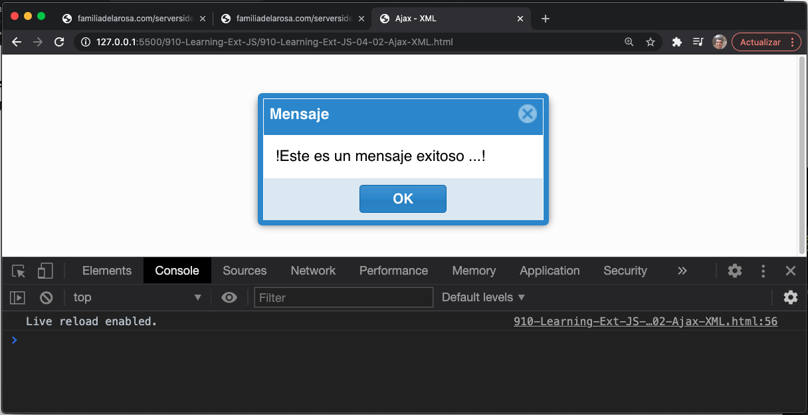

# 4. Acerca de los Datos
* Ajax
   * Pasar parámetros a Ajax request
   * Configuración del timeout para las llamadas a Ajax request
* Modelos
    * Mapeos
    * Validadores
    * Tipos de campos personalizados
    * Relaciones
       * Asociaciones One-to-many
       * Asociaciones One-to-one
* Trabajando con store
    * Añadiendo nuevos elementos
    * Recorrer los records/models en el store.
    * Recuperar los records en el store
       * Por posición de índice
       * Primer y último registro
       * Por rango
       * Por ID
    * Eliminación de registros
* Recuperando datos remotos
   * Ajax proxy
   * Readers
      * XML reader(Lector XML)
* Enviando datos
* Resumen

En este capítulo, aprenderemos sobre el uso del data package en Ext JS. Además, hablaremos sobre Ajax, Data Models, Data Stores y los lreaders y writers disponibles que podemos usar para almacenar nuestros datos localmente.

El data package es lo que nos permitirá cargar y guardar datos en nuestro código o aplicaciones. Es importante tener una comprensión sólida del data package para que podamos vincular o vincular datos en componentes Ext JS. El data package contiene varias clases para manejar datos, pero hay algunas clases principales que se utilizarán casi siempre. Eche un vistazo a la siguiente figura:


Ext JS crea una capa abstracta con muchas clases y configuraciones; la idea es utilizar estas clases cuando se trata de información. Todos los widgets y componentes que muestran información utilizan el data package para manipular y presentar los datos fácilmente.

> **NOTA**
> 
> Es importante mencionar que se requiere un servidor web para este capítulo y los siguientes. No importa cuál decida usar porque no estamos usando ninguna tecnología específica del lado del servidor.

## Ajax

Antes de comenzar a aprender sobre el data package, es importante saber cómo podemos realizar una solicitud Ajax al servidor. La solicitud Ajax es una de las formas más útiles de obtener datos del servidor de forma **asincrónica**. ***Esto significa que el bucle de JavaScript no se bloquea mientras se ejecuta la solicitud y se disparará un evento cuando el servidor responda; esto nos permite hacer cualquier otra cosa mientras se realiza la solicitud***.

Si eres nuevo en Ajax, te recomiendo que leas más al respecto. Hay miles de tutoriales en línea, pero le sugiero que lea este sencillo artículo en https://developer.mozilla.org/en-US/docs/AJAX/Getting_Started.

Ext JS proporciona un objeto singleton (`Ext.Ajax`) que se encarga de gestionar todos los procesos necesarios para realizar una solicitud en cualquier navegador. Hay algunas diferencias en cada navegador, pero Ext JS maneja estas diferencias por nosotros y nos brinda una solución entre navegadores para realizar solicitudes Ajax.

Hagamos nuestra primera llamada Ajax a nuestro servidor. Primero, necesitaremos crear un archivo HTML e importar la library Ext. Luego, podemos agregar el siguiente código dentro de la etiqueta del script:

```js
Ext.Ajax.request({
   url:"serverside/myfirstdata.json"
});
console.log("Next lines of code...");
```

Usando el método `request`, podemos hacer una llamada Ajax a nuestro servidor. El método `request` recibe un objeto que contiene las configuraciones para la llamada Ajax. La única configuración que tenemos definida es la URL donde queremos realizar nuestra solicitud.

Es importante tener en cuenta que Ajax es asíncrono de forma predeterminada. Esto significa que una vez que se ejecuta el método de solicitud, el motor de JavaScript continuará ejecutando las líneas de código que lo siguen y no esperará hasta que el servidor responda. ***También puede ejecutar Ajax de forma síncrona, estableciendo la propiedad `Ext.Ajax.async = false`***.

> **NOTA**
> 
> Para obtener más detalles, consulte http://docs.sencha.com/extjs/5.1/5.1.1-apidocs/#!/api/Ext.Ajax-cfg-async.

En el código anterior, no hicimos nada cuando el servidor respondió a nuestra solicitud. Para obtener la fecha de respuesta, necesitamos configurar una función `callback` para que se ejecute cuando el servidor responda, y también tenemos funciones para `success` o `failure`. Modifiquemos nuestro ejemplo anterior para configurar esas callbacks:

```js
Ext.Ajax.request({
   url:"serverside/myfirstdata.json",
   success: function(response,options){
      console.log('success function executed, here we can do some stuff !');
   },
   failure: function(response,options){
      Ext.Msg.alert("Message", 'server-side failure with status code ' + response.status);
   },
   callback: function( options, success, response ){
      console.log('Callback executed, we can do some stuff !');
   }
});
```

La función `success` se ejecutará solo cuando el servidor responda con un estado 200-299, lo que significa que la solicitud se ha realizado correctamente. Si el estado de respuesta es 403, 404, 500, 503 y cualquier otro estado de error, se ejecutará el callback `failure`.

Cada función (success o failure) recibe dos parámetros. El primer parámetro es el objeto de respuesta del servidor, donde podemos encontrar el texto de respuesta y los encabezados. El segundo parámetro es la opción de configuración que usamos para esta solicitud Ajax, en este caso el objeto contendrá tres propiedades: la URL y los callbacks `success` y `failure`.

La función `callback` se ejecutará siempre, sin importar si es un success o failure. Además, esta función recibe tres parámetros: `options` es un parámetro para la llamada de solicitud, `success` es un valor booleano según si la solicitud fue exitosa o no, y el parámetro `response` es un objeto `XMLhttpRequest` que contiene la información de la respuesta.

En este punto, tenemos nuestros callbacks configurados, pero todavía no estamos haciendo nada en el interior. Normalmente, necesitamos obtener la respuesta de los datos y hacer algo con ellos; supongamos que obtenemos el siguiente JSON en nuestra respuesta:

```js
{
   "success": true,
   "msg": "This is a success message..!"
}
```

> **TIP**
> 
> En la comunidad Ext JS, uno de los formatos preferidos para enviar y recibir datos al servidor es **JSON**; Ext JS también puede manejar XML. JSON son las siglas de **JavaScript Object Notation**. Si no está familiarizado con JSON, puede visitar http://www.json.org/ para comprender más sobre JSON.
 
Para que la función `success` interactúe con los datos devueltos, necesitamos decodificar los datos JSON devueltos (que vienen en formato de texto) y convertir el texto en un objeto para que podamos acceder a sus propiedades en nuestro código. Cambiemos el siguiente código en el callback `success`:

```js
success: function(response,options){
   var data = Ext.decode(response.responseText);
   Ext.Msg.alert("Message", data.msg);
},
```

Primero obtenemos la respuesta del servidor como un texto usando la propiedad `responseText` del objeto `response`. Luego, usamos el método `Ext.decode` para convertir el texto JSON en objetos JavaScript y guardar el resultado en una variable `data`.

Una vez que tengamos nuestro objeto data con la respuesta del servidor, mostraremos un mensaje de alerta accediendo a la propiedad `msg` desde el objeto data. Tengamos en cuenta que si queremos mostrar algo usando el DOM, necesitamos poner nuestro código dentro del método `onReady` que hemos aprendido en el capítulo anterior.

```js
Ext.Ajax.request({
   url: "serverside/myfirstdata.json ",
   success: function(response,options){
      console.log('success function executed, here we can do some stuff !');
   },
   failure: function(response,options){
      console.log('server-side failure with status code ' + response.status);
   },
   callback: function( options, success, response ){
      if(success){
         var data= Ext.decode(response.responseText);
         Ext.Msg.alert("Message", data.msg);
      }
   }
});
```

> **TIP**
> 
> Es importante que los archivos del lado del servidor devuelvan una respuesta adecuada y sin errores; esto significa que debemos asegurarnos de que los archivos del lado del servidor tengan la sintaxis adecuada y no se muestren advertencias o errores (PHP como ejemplo).
> 
> Además, es importante especificar el Header en el lado del servidor para garantizar el contenido adecuado. Por ejemplo, `header('Content-Type: application/json');`

Si actualizamos su navegador para ejecutar el código que hemos modificado, deberíamos ver algo como la siguiente captura de pantalla:


#### 🔴 6️⃣ 💻 Mi versión `910-Learning-Ext-JS-04-01-Ajax-JSON.html`

`miprimerdata.json`

```json
{
   "success" : true,
   "msg"     : "!Este es un mensaje exitoso ...!"
}
```

`miprimerdata.php`

```php
<?php 
header('Content-Type: application/json');
header('Access-Control-Allow-Origin: *');
header("Access-Control-Allow-Headers: X-API-KEY, Origin, X-Requested-With, Content-Type, Accept, Access-Control-Request-Method");
header("Access-Control-Allow-Methods: GET, POST, OPTIONS, PUT, DELETE");
header("Allow: GET, POST, OPTIONS, PUT, DELETE");
$method = $_SERVER['REQUEST_METHOD'];
if($method == "OPTIONS") {
    die();
}

echo '{
   "success" : true,
   "msg"     : "!Este es un mensaje exitoso ...!"
}'; 

?>
```

`910-Learning-Ext-JS-04-01-Ajax-JSON.html`

```html
<!DOCTYPE html>
<html>
   <head>
      <title>Ajax</title>
      <meta name="viewport" content="width=device-width, initial-scale=1, maximum-scale=1, user-scalable=no"> 
      <link href = "https://cdnjs.cloudflare.com/ajax/libs/extjs/6.0.0/classic/theme-neptune/resources/theme-neptune-all.css" rel = "stylesheet" />
      <script type = "text/javascript" src = "https://cdnjs.cloudflare.com/ajax/libs/extjs/6.0.0/ext-all.js"></script>

      <script type = "text/javascript">
         Ext.onReady(function(){
            Ext.Ajax.request({
            url: "http://familiadelarosa.com/serverside/miprimerdata.php",
            success: function(response,options){
               console.log('Función success ejecutada, ¡aquí podemos hacer algunas cosas!');
            },
            failure: function(response,options){
               console.log('Fallo del lado del servidor con código de estado ' + response.status);
            },
            callback: function( options, success, response ){
               if(success){
                  var data= Ext.decode(response.responseText);
                  Ext.Msg.alert("Mensaje", data.msg);
               }
            }
            });
         });   
      </script>
   </head>
   
   <body style="padding:10px;">  
      
   </body>
</html>
```

En teoría deberiamos usar el archivo `miprimerdata.json` que esta subido en el servidor pero por cuestiones de CORS se usa el archivo `miprimerdata.php` que tiene el manejo del CORS.


Ahora, supongamos que queremos usar XML en lugar de JSON. Crearemos la solicitud de una manera muy similar a nuestro código anterior. El siguiente código debe guardarse en un nuevo archivo en `serverside/data.xml`:

```xml
<?xml version="1.0" encoding="UTF-8"?>
<response success="true">
<msg>This is a success message in XML format</msg>
</response>
```

Luego, procedamos a cambiar la URL y el código en la devolución del callback `success`, de la siguiente manera:

```js
Ext.Ajax.request({
   url: "serverside/myfirstdata.xml",
   success: function(response,options){
      var data = response.responseXML;
      var node = xml.getElementsByTagName('msg')[0];
      Ext.Msg.alert("Message", node.firstChild.data );
   },
   failure: function(response,options){
      Ext.Msg.alert("Message", 'server-side failure with status code ' + response.status);
   }
});
```

Usamos la propiedad `responseXML` para obtener el árbol de nodos y luego obtenemos el nodo con una etiqueta `msg`. Después de eso, podemos obtener el texto real usando la propiedad `firstChild.data` del nodo anterior. Si ejecutamos el código, veremos algo muy similar a nuestro ejemplo anterior con JSON.

Como podemos notar, es más fácil trabajar con JSON. Solo necesitamos decodificar el texto y luego podemos usar los objetos. XML es un poco complicado, pero también podemos usar este formato si nos sentimos cómodos con él.

#### 🔴 6️⃣ 💻 Mi versión `910-Learning-Ext-JS-04-02-Ajax-XML.html`

`miprimerdata.xml`

```xml
<?xml version="1.0" encoding="utf-8"?>
<response success="true">
   <msg>!Este es un mensaje exitoso ...!</msg>
</response>
```

`miprimerdataxml.php`

```php
<?php 
header('Content-Type: application/xml');
header('Access-Control-Allow-Origin: *');
header("Access-Control-Allow-Headers: X-API-KEY, Origin, X-Requested-With, Content-Type, Accept, Access-Control-Request-Method");
header("Access-Control-Allow-Methods: GET, POST, OPTIONS, PUT, DELETE");
header("Allow: GET, POST, OPTIONS, PUT, DELETE");
$method = $_SERVER['REQUEST_METHOD'];
if($method == "OPTIONS") {
   die();
}

echo '<?xml version="1.0" encoding="utf-8"?>
<response success="true">
   <msg>!Este es un mensaje exitoso ...!</msg>
</response>'; 

?>
```

`910-Learning-Ext-JS-04-02-Ajax-XML.html`

```html
<!DOCTYPE html>
<html>
   <head>
      <title>Ajax - XML</title>
      <meta name="viewport" content="width=device-width, initial-scale=1, maximum-scale=1, user-scalable=no"> 
      <link href = "https://cdnjs.cloudflare.com/ajax/libs/extjs/6.0.0/classic/theme-neptune/resources/theme-neptune-all.css" rel = "stylesheet" />
      <script type = "text/javascript" src = "https://cdnjs.cloudflare.com/ajax/libs/extjs/6.0.0/ext-all.js"></script>

      <script type = "text/javascript">
         Ext.onReady(function(){
            Ext.Ajax.request({
               url: "http://familiadelarosa.com/serverside/miprimerdataxml.php",
               success: function(response,options){
                  var data = response.responseXML;
                  var node = data.getElementsByTagName('msg')[0];
                  Ext.Msg.alert("Mensaje", node.firstChild.data );
               },
               failure: function(response,options){
                  Ext.Msg.alert("Mensaje", 'Fallo del lado del servidor con código de estado ' + response.status);
               }
            });
         });   
      </script>
   </head>
   
   <body style="padding:10px;">  
      
   </body>
</html>
```





### Pasar parámetros a Ajax request

Por lo general, en nuestras aplicaciones necesitamos pasar algunos parámetros a la solicitud Ajax para obtener la información adecuada. Para pasar parámetros usaremos el siguiente código:


```js
Ext.Ajax.request({
  url: "serverside/myfirstparams.php",
  method: 'POST',
  params: {
    x:200,
    y:300
  },
  success: function(response,options){
    var data = Ext.decode(response.responseText);
    Ext.Msg.alert("Message", data.msg);
  },
  failure: function(response,options){
    Ext.Msg.alert("Message", 'server-side failure with status code' + response.status);
    Ext.Msg.alert("Message", 'server-side failure:' + response.status);
  }
});
```

Usando la propiedad **`params`**, podemos establecer un objeto de parámetros. En este caso, enviaremos solo dos parámetros: **`x`** e **`y`**, pero podemos enviar tantos como necesitemos. Observe que establecemos la propiedad **`method`** con el valor **`POST`**; de forma predeterminada, Ext JS usa el valor **`GET`** para esta propiedad, y si usamos **`GET`**, los valores se incrustarán en la URL para la solicitud. Cuando ejecutamos este código, obtendremos la siguiente captura de pantalla:


> **TIP**
>
> Tenga en cuenta que puede devolver cadenas en formato HTML (valor de **`msg`** en este caso) para brindar mejoras visuales a la respuesta si está utilizando **`Ext.Msg.alert`**
 
#### 🔴 6️⃣ 💻 Mi versión `910-Learning-Ext-JS-04-03-Ajax-Parametros.html`

`miprimerparametros.php`

```php
<?php
   header('Content-Type: application/json');
   $information = array(
      'success'=>true, 
      'msg'=>'Mensaje de texto de respuesta con los siguientes parámetros:<br><b>x</b>=' . $_POST['x'] . ', <b>y</b>=' . $_POST['y'] . '', 
      'x'=> $_POST['x'],
      'y'=> $_POST['y']	
   );
   echo  json_encode( $information ); 
?>
```

Si cargamos este archivo en el navegador tenemos:


`910-Learning-Ext-JS-04-03-Ajax-Parametros.html`

```html
<!DOCTYPE html>
<html>
   <head>
      <title>Ajax - Parámetros</title>
      <meta name="viewport" content="width=device-width, initial-scale=1, maximum-scale=1, user-scalable=no"> 
      <link href = "https://cdnjs.cloudflare.com/ajax/libs/extjs/6.0.0/classic/theme-neptune/resources/theme-neptune-all.css" rel = "stylesheet" />
      <script type = "text/javascript" src = "https://cdnjs.cloudflare.com/ajax/libs/extjs/6.0.0/ext-all.js"></script>

      <script type = "text/javascript">
         Ext.onReady(function(){
            Ext.Ajax.request({
               url: "http://familiadelarosa.com/serverside/miprimerparametros.php",
               method: 'POST',
               params: {
                  x:200,
                  y:300
               },
               success: function(response,options){
                  var data = Ext.decode(response.responseText);
                  Ext.Msg.alert("Mensaje", data.msg);
               },
               failure: function(response,options){
                  Ext.Msg.alert("Mensaje", 'Fallo del lado del servidor con código de estado: ' + response.status);
                  Ext.Msg.alert("Mensaje", 'Fallo del lado del servidor: ' + response.status);
               }
            });
         });   
      </script>
   </head>
   <body style="padding:10px;">  
      
   </body>
</html>  
```


Como vemos tenemos un error por el CORS, pero gracias a esto vemos que pasa cuando existe un fallo `failure`, el cual muestra dos mensajes pero la forma de trabajar solo se muestra el segundo, como vimos en lecciones anteriores los mensajes no son bloqueantes, si comentamos el segundo mensaje nos presenta el primero.

Para solucionar el problema del CORS debemos añadir cabeceras dentro de nuestro archivo PHP, el cual nos queda así:

`miprimerparametros.php`

```php
<?php
   header('Content-Type: application/json');
   header('Access-Control-Allow-Origin: *');
   header("Access-Control-Allow-Headers: X-API-KEY, Origin, X-Requested-With, Content-Type, Accept, Access-Control-Request-Method");
   header("Access-Control-Allow-Methods: GET, POST, OPTIONS, PUT, DELETE");
   header("Allow: GET, POST, OPTIONS, PUT, DELETE");
   $method = $_SERVER['REQUEST_METHOD'];
   if($method == "OPTIONS") {
      die();
   }
  
   $information = array(
      'success'=>true, 
      'msg'=>'Mensaje de texto de respuesta con los siguientes parámetros:<br><b>x</b>=' . $_POST['x'] . ', <b>y</b>=' . $_POST['y'] . '', 
      'x'=> $_POST['x'],
      'y'=> $_POST['y']	
   );
   echo  json_encode( $information ); 
?>
```

La salida es:


Como podemos observar el error de CORS a desaparecido y ahora se muestra el mensaje con los parámetros que se le envian vía POST.

### Configuración de timeout para las llamadas a Ajax request

A veces, pero no todo el tiempo, el servidor puede tardar demasiado en responder, por lo que, de forma predeterminada, Ext JS tiene un tiempo configurado de 30 segundos para esperar la respuesta. Según nuestras necesidades, podemos disminuir o aumentar este tiempo estableciendo la propiedad de tiempo de espera en la configuración de la solicitud Ajax. El siguiente ejemplo nos muestra cómo:

```js
Ext.Ajax.request({
   url: "serverside/myfirstparams.php",
   method: 'POST',
   params: {x:200, y:300},
   timeout: 50000,
   success: function(response,options){
      var data = Ext.decode(response.responseText);
      Ext.Msg.alert("Message", data.msg);
   },
   failure: function(response,options){
      Ext.Msg.alert("Message", 'server-side failure with status code ' + response.status);
      Ext.Msg.alert("Message", 'server-side failure:' + response.status);
   }
});
```

Hemos aumentado la propiedad **`timeout`** de espera a 50 segundos (50000 milisegundos); ahora nuestra solicitud se eliminará después de 50 segundos de esperar la respuesta.

> **TIP**
> 
> Puede asignar un valor de tiempo de espera global para toda la configuración de la aplicación, cambiando el valor en **`Ext.Ajax.timeout`** (por defecto tiene el valor de **`30000`**). El ejemplo anterior muestra cómo establecer tiempos de espera en llamadas independientes.

#### 🔴 6️⃣ 💻 Mi versión `910-Learning-Ext-JS-04-04-Ajax-timeout.html`

`910-Learning-Ext-JS-04-04-Ajax-timeout.html`

```html
<!DOCTYPE html>
<html>
   <head>
      <title>Ajax - timeout</title>
      <meta name="viewport" content="width=device-width, initial-scale=1, maximum-scale=1, user-scalable=no"> 
      <link href = "https://cdnjs.cloudflare.com/ajax/libs/extjs/6.0.0/classic/theme-neptune/resources/theme-neptune-all.css" rel = "stylesheet" />
      <script type = "text/javascript" src = "https://cdnjs.cloudflare.com/ajax/libs/extjs/6.0.0/ext-all.js"></script>

      <script type = "text/javascript">
         Ext.onReady(function(){
            Ext.Ajax.request({
               url: "http://familiadelarosa.com/serverside/miprimerparametros.php",
               method: 'POST',
               params: {x:200, y:300},
               timeout: 50000,
               success: function(response,options){
                  var data = Ext.decode(response.responseText);
                  Ext.Msg.alert("Mensaje", data.msg);
               },
               failure: function(response,options){
                  Ext.Msg.alert("Mensaje", 'Fallo del lado del servidor con código de estado: ' + response.status);
                  //Ext.Msg.alert("Mensaje", 'Fallo del lado del servidor: ' + response.status);
               }
            });
         });   
      </script>
   </head>
   <body style="padding:10px;">  
      
   </body>
</html>
```

La salida es la misma que teniamos antes pero con un pequeño retraso.


Si buscamos en la documentación, encontraremos otras configuraciones, como el alcance de las devoluciones de llamada, encabezados, caché, etc. Deberíamos leer los documentos y jugar con esas configuraciones también, pero las que hemos cubierto aquí son las más importantes para aprender.

Ahora sabemos cómo obtener datos usando Ajax, pero también necesitamos una forma de manejar esos datos. Ext JS nos proporciona un paquete de clases para gestionar nuestros datos de forma sencilla; pasemos a nuestro próximo tema.

## Modelos

Los modelos representan objetos o entidades dentro de nuestra aplicación, por ejemplo, Clientes, Usuarios, Facturas, etc. Los data stores utilizarán esos modelos. Podemos definir tantos modelos como necesitemos dentro de nuestra aplicación. 

Un modelo puede contener campos, validaciones y relaciones entre otros modelos. También podemos configurar un proxy para que persista y extraiga nuestros datos.

> **NOTA:**
> 
> A partir de la versión 5.x, las definiciones de campo pueden ser opcionales a menos que necesite conversión, validaciones o establecer un tipo de datos implícito. Para obtener más información, consulte http://docs.sencha.com/extjs/5.1/whats_new/5.0/whats_new.html#Models.
 
Para crear un modelo, escribamos el siguiente código:

```js
Ext.define('Myapp.model.Client',{
extend:'Ext.data.Model',  // step 1
idProperty:'clientId ', // step 2
fields:[// step 3
   {name: 'clientId', type: 'int'},
   {name: 'name'    , type: 'string'},
   {name: 'phone'   , type: 'string'},
   {name: 'website' , type: 'string'},
   {name: 'status'  , type: 'string'},
   {name: 'clientSince', type: 'date', dateFormat:'Y-m-d H:i'}
]
});
```

Como puede notar, estamos definiendo el modelo de la misma manera que definimos una clase; en el paso uno extendemos desde la clase **`Ext.data.Model`**, que es la encargada de agregar toda la funcionalidad a nuestros modelos.

En el segundo paso, estamos definiendo la propiedad en nuestra respuesta JSON que contendrá el ID de cada instancia de registro. En este caso vamos a utilizar el campo **`clientId`**, pero si no definimos la configuración de **`clientId`**, el modelo automáticamente usará y generará una propiedad llamada **`id`** por defecto.

En el tercer paso definimos los campos para nuestro modelo. El valor de esta propiedad es un array; cada elemento del array es un objeto que contiene la configuración de cada campo. En este caso, establecemos el nombre y el tipo de campo, y el último campo (fecha) contiene una propiedad `dateFormat`.

> **NOTA**
> 
> Dependiendo del tipo de campo, podemos agregar algunas propiedades específicas. Por ejemplo, el campo de **`date`**, podemos agregar una propiedad **`dateFormat`**. Para ver más, consulte la documentación en la rama **`Ext.data.field`**.

#### 🔴 6️⃣ 💻 Mi versión 

En nuestro proyecto se ha creado la siguiente estructura:


Dentro de `appcode` tenemos la carpeta `model` la cual va a contener todos nuestros modelos de clases. El primero que vemos es `Client.js`:

```js
// JavaScript Document

Ext.define('Myapp.model.Client',{
   extend:'Ext.data.Model',  // step 1
   idProperty:'clientId ',   // step 2
   fields:[ // step 3
      {name: 'clientId', type: 'int'	},
      {name: 'name'    , type: 'string'},
      {name: 'phone'   , type: 'string'},
      {name: 'website' , type: 'string'},
      {name: 'status'  , type: 'string'},
      {name: 'clientSince' , type: 'date', dateFormat: 'Y-m-d H:i'}
   ]	
});
```

Los tipos de datos disponibles son los siguientes:

* **`String`**
* **`Integer`**
* **`Float`** (recomendado para usar cuando usa números decimales)
* **`Boolean`**
* **`Date`** (recuerde establecer la propiedad dateFormat para garantizar un análisis de fecha correcto y la interpretación del valor de la fecha)
* **`Auto`** (este campo implica que no se realiza ninguna conversión a los datos recibidos)

Una vez que hayamos definido nuestro modelo, podemos crear un archivo HTML. Importemos la library Ext y nuestro archivo de clase de **`Client`** para probar nuestro modelo de la siguiente manera:

```js
var myclient = Ext.create('Myapp.model.Client',{
   clientId:10001,
   name:'Acme corp',
   phone:'+52-01-55-4444-3210',
   website:'www.acmecorp.com',
   status:'Active',
   clientSince:'2010-01-01 14:35'
});
console.log(myclient);
console.log("My client's name is = " + myclient.data.name);
console.log("My client's website is = " + myclient.data.name);
```

Usando el método **`create`** podemos instanciar nuestra clase de modelo, el segundo parámetro es un objeto con los datos que contendrá nuestro modelo (registro virtual). Ahora, podremos usar los métodos **`get`** y **`set`** para leer y escribir cualquiera de los campos definidos:

```js
// GET METHODS
var nameClient = myclient.get('name');
var websiteClient = myclient.get('website');
console.log("My client's info= " + nameClient + " - " + websiteClient);

// SET Methods
myclient.set('phone','+52-01-55-0001-8888'); // single value
console.log("My client's new phone is = " + myclient.get('phone'));
myclient.set({ //Multiple values
   name: 'Acme Corp of AMERICA LTD.',
   website:'www.acmecorp.net'
});
console.log("My client's name changed to = " + myclient.get("name"));
console.log("My client's website changed to = " + myclient.get("website") );
```

El código anterior muestra cómo leer y escribir nuestros datos. El método **`set`** nos permite modificar un campo, o incluso muchos campos al mismo tiempo, pasando un objeto que contiene los nuevos valores.

Si inspeccionamos la instancia de la **`invoice`** (factura), encontraremos que toda la información se encuentra en una propiedad llamada **`data`**. Siempre debemos usar los métodos **`get`** y **`set`** para leer y escribir nuestros modelos, pero si por alguna razón necesitamos tener acceso a todos los datos en nuestro modelo, podemos usar el objeto **`data`** de la siguiente manera:

```js
//READ
console.log("My client's name:" + myclient.data.name);
console.log("My client's website:" + myclient.data.website);
// Write
myclient.data.name = "Acme Corp ASIA LTD.";
myclient.data.website = "www.acmecorp.biz";
```

Una buena alternativa a este código y una mejor manera de **`get`** y **`set`** datos es:

```js
//READ
console.log("My client's name:" + myclient.get("name"));
console.log("My client's website:" + myclient.get("website"));
// Write
myclient.set("name", "Acme Corp ASIA LTD. ");
myclient.set("website", "www.acmecorp.biz");
```

Podemos leer y escribir cualquier campo en nuestro modelo. Sin embargo, establecer un nuevo valor de esta manera no es una buena práctica en absoluto. El método **`set`** realiza algunas tareas importantes al configurar el nuevo valor, como marcar nuestro modelo como sucio, guardar el valor anterior para que podamos rechazar o aceptar los cambios más tarde, y algunos otros pasos importantes.

### Mapeos

Al definir un campo dentro del modelo, podemos definir dónde se tomarán los datos para un campo con el mapeo de propiedades. Digamos que es una ruta, un nombre alternativo, que Ext JS se utilizará para completar el campo (data) a partir de los datos recibidos del servidor, como un archivo JSON o un archivo XML. Echemos un vistazo al siguiente ejemplo de JSON:

```js
{
   "success" :"true",
   "id":"id",
   "records":[
      {
         "id": 10001,
         "name": "Acme corp2",
         "phone": "+52-01-55-4444-3210",
         "x0001":"acme_file.pdf"
      }
   ]
}
```

Aquí podemos ver en el ejemplo JSON (o quizás XML) que la respuesta viene con un campo con el nombre **`x0001`**. En algunas respuestas puede suceder que el nombre del campo tenga un código especial (según la base de datos o el diseño de los datos), pero en nuestro código, este campo es el archivo de contrato del cliente. Entonces, usando la propiedad de mapeo, podemos poblar el campo, estableciendo la propiedad de mapeo para nuestro campo, como el siguiente ejemplo:

```js
Ext.define('Myapp.model.Client',{
extend: 'Ext.data.Model',
idProperty: 'clientId ',
fields:[
   {name: 'clientId', type: 'int'  },
   {name: 'name'    , type: 'string'},
   {name: 'phone'   , type: 'string'},
   {name: 'contractFileName', type: 'string', mapping:'x0001'}
]
});
```

Como puede ver, estamos definiendo el campo `contractFileName`, que utilizará el campo de datos **`x0001`** de la respuesta; en nuestro código no es necesario hacer referencia a **`x0001`**; simplemente lo manejaremos en nuestro código como **`contractFileName`**. Para verlo en acción, ejecute el archivo **`mapping_01.html`** del código de ejemplo. Abra la ventana de su consola y verá algo similar a la siguiente captura de pantalla:


En este momento no es necesario examinar todo el código. Al avanzar en este capítulo, comprenderá todo el código de este ejemplo. El propósito es que comprenda la propiedad de mapeo.

#### 🔴 6️⃣ 💻 Mi versión `910-Learning-Ext-JS-04-05-Mapping.html`

```html
<!DOCTYPE html>
<html>
   <head>
      <title>Ajax - Mapping</title>
      <meta name="viewport" content="width=device-width, initial-scale=1, maximum-scale=1, user-scalable=no"> 
      <link href = "https://cdnjs.cloudflare.com/ajax/libs/extjs/6.0.0/classic/theme-neptune/resources/theme-neptune-all.css" rel = "stylesheet" />
      <script type = "text/javascript" src = "https://cdnjs.cloudflare.com/ajax/libs/extjs/6.0.0/ext-all.js"></script>

      <script type = "text/javascript">
         Ext.Loader.setConfig({
            enabled: true,
            paths:{		
               Myapp:'appcode'	
            }	
         });

         Ext.require([
            'Ext.data.*', 
            'Myapp.model.ClientWithMapping',
            'Myapp.store.customers.ClientsMapping'
         ]);

         Ext.onReady(function(){
            
            //Step 1
            var store = Ext.create("Myapp.store.customers.ClientsMapping"); 
            //counting the elements in the store
            store.load(function(records, operation, success) {	
               console.log('Registros cargados');
               Ext.each(records, function(record, index, records){
                  console.log('Cliente: '  +record.get("name")  +  ' - '  + record.get("contractFileName") );
               });
            });

         });  
      </script>
   </head>
   <body style="padding:10px;">  
      
   </body>
</html>
```

Vemos una sección de configuración donde definimos la ruta `Myapp:'appcode'`. Con `Ext.require([` indicamos los archivos que necesitamos, en este caso `'Myapp.model.ClientWithMapping'` y `'Myapp.store.customers.ClientsMapping'` los cuales tienen el siguiente código:

`'Myapp.model.ClientWithMapping'` 

```js
// JavaScript Document

Ext.define('Myapp.model.ClientWithMapping',{
   extend:'Ext.data.Model',  // step 1
   idProperty:'clientId ',   // step 2
   fields:[ // step 3
      {name: 'clientId', type: 'int'	},
      {name: 'name'    , type: 'string'},
      {name: 'phone'   , type: 'string'},
      {name: 'contractFileName', type: 'string', mapping: 'x0001' }
   ]	
});
```

`'Myapp.store.customers.ClientsMapping'`

```js
// JavaScript Document
Ext.define('Myapp.store.customers.ClientsMapping',{
   extend:'Ext.data.Store',
   model: 'Myapp.model.ClientWithMapping',   
   autoLoad:false,
   proxy:{
      type:'ajax',
      url: 'serverside/mappings.json',
      reader: {
         type:'json', rootProperty:'records'
      }
   }
});
```

En este último archivo se usa `serverside/mappings.json` el cual tiene el siguiente contenido:

`serverside/mappings.json`

```json
{
   "success" :"true",
   "id":"id",
   "records":[
      { 
         "id": 10001,
         "name": "Acme corp2",
         "phone": "+52-01-55-4444-3210",
         "x0001":"acme_file.pdf" 
      },{
         "id": 10002,
         "name": "Candy Store LTD",
         "phone": "+52-01-66-3333-3895",
         "x0001":"candystore_14589_august_2015.doc" 
      }
   ]
}
```

Al cargar el archivo `910-Learning-Ext-JS-04-05-Mapping.html` en el navegador obtenemos la siguiente salida en la consola:


Vemos como se van entrelazando las diferentes piezas para poder obtener los resultados deseados. 

**NOTA:** En este ejemplo no hemos tenido problemas con el CORS, todos los archivos los tenemos localmente.

### Validadores

Una buena característica desde la versión 4 de Ext JS es la capacidad de validar nuestros datos directamente en el modelo. Podemos definir reglas para cada campo y ejecutar las validaciones cuando sea necesario. Para definir validaciones en nuestros modelos, solo necesitamos definir una propiedad llamada validadores que contiene una serie de reglas que se ejecutarán cuando se ejecute el motor de validación. Agreguemos algunos validadores a nuestro modelo anterior de la siguiente manera:

```js
Ext.define('Myapp.model.Client',{
extend:'Ext.data.Model',
idProperty:'clientId ',
fields:[
   {name: 'clientId', type: 'int'  },
   {name: 'name'    , type: 'string'},
   {name: 'phone'   , type: 'string'},
   {name: 'website' , type: 'string'},
   {name: 'status'  , type: 'string'},
   {name: 'clientSince' , type: 'date', dateFormat: 'Y-m-d H:i'}
],
validators:{
   name:[
      { type:'presence'}
   ],
   website:[
      { type:'presence', allowEmpty:true},
      { type:'length',  min: 5, max:250 }
   ]
}
});
```

Al agregar validaciones, usamos objetos para definir cada regla. La propiedad **`type`** define el tipo de regla que queremos agregar. Hay algunos tipos creados dentro de la library, como inclusión, exclusión, presencia, longitud, formato y e-mail; estas son validaciones muy comunes. También podemos agregar nuevos tipos de validaciones según sea necesario.

Cuando definimos una regla, es necesario utilizar siempre las propiedades **`type`**, pero algunas reglas requieren el uso de otros parámetros adicionales. La propiedad **`type`** representa una función dentro de las subclases `Ext.data.validator`. Podemos leer la documentación de este objeto para ver qué parámetros específicos se necesitan para cada regla.

Hagamos algunos cambios nuevos en nuestro archivo HTML anterior y guárdelos con un nuevo nombre:

```js
//Step 1
var myclient = Ext.create('Myapp.model.Client',{
    clientId  : '10001',
    name  : 'Acme corp',
    phone: '+52-01-55-4444-3210',
    website: 'www.acmecorp.com',
    status: 'Active',
    clientSince: '2010-01-01 14:35'
});

if   (myclient.isValid()){  //Step 2
  console.log("myclient model is correct");
}

console.log(myclient);
console.log("My client's name is = " + myclient.data.name);
console.log("My client's website is = " + myclient.data.website);
// SET methods   //Step 3
myclient.set('name','');
myclient.set('website','');
if   (myclient.isValid()){//Step 4
  console.log("myclient model is correct");
} else {
//Step 5
  console.log("myclient model has errors");
  var errors = myclient.validate();
  errors.each(function(error){
    console.log(error.field,error.message);
  });
}
```

Los pasos se explican a continuación:

* **Step 1**: Creamos una instancia de nuestro modelo de cliente utilizando algunos datos.
* **Step 2**: Ejecutamos el método **`isValid`**, que en este caso devuelve **`true`** porque toda la información es correcta.
* **Step 3**: Cambiamos los valores del modelo (nombre y sitio web).
* **Step 4**: Ejecutamos el método **`isValid`** nuevamente para probar los validadores; en este caso, el resultado será **`false`**.
* **Step 5**: El método de **`validate`** (**`myclient.validate();`**) devolverá una colección con las validaciones fallidas. Luego, el código iterará esta colección para generar la salida de los campos y mensajes de error.

> **NOTA:**
> 
> La colección devuelta por el método de validación es una instancia de la clase **`Ext.data.ErrorCollection`**, que se extiende desde **`Ext.util.MixedCollection`**. Por tanto, podemos utilizar cada método para iterar de forma sencilla.

Cuando ejecutemos el ejemplo anterior veremos en la consola algunos mensajes según el flujo del código. Inicialmente, mostrará un mensaje que dice que las validaciones fueron exitosas. Después de cambiar los valores, los mensajes comenzarán a mostrar los errores en los campos de nombre y sitio web. Eche un vistazo a la siguiente captura de pantalla desde la ventana/herramienta de la consola:


#### 🔴 6️⃣ 💻 Mi versión `910-Learning-Ext-JS-04-06-Validation.html`

```html
<!DOCTYPE html>
<html>
   <head>
      <title>Extjs - Validations 01</title>
      <meta name="viewport" content="width=device-width, initial-scale=1, maximum-scale=1, user-scalable=no"> 
      <link href = "https://cdnjs.cloudflare.com/ajax/libs/extjs/6.0.0/classic/theme-neptune/resources/theme-neptune-all.css" rel = "stylesheet" />
      <script type = "text/javascript" src = "https://cdnjs.cloudflare.com/ajax/libs/extjs/6.0.0/ext-all.js"></script>

      <script type = "text/javascript">         
         Ext.Loader.setConfig({
            enabled: true,
            paths:{
               Myapp:'appcode'	
            }	
         });

         Ext.require([
            'Ext.data.*',
            'Myapp.model.ClientWithValidations'
         ]);

         Ext.onReady(function(){
            //step1
            var myclient = Ext.create('Myapp.model.ClientWithValidations',{ 
               clientId  : '10001',
               name		: 'Acme corp',
               phone		: '+52-01-55-4444-3210',
               website   : 'www.acmecorp.com',
               status    : 'Active',
               clientSince: '2010-01-01 14:35'
            });	

            if 	(myclient.isValid()){  //step2
               console.log("myclient model es correcto"); 
            } 

            console.log(myclient);
            console.log("El name de mi cliente es = " + myclient.get('name') ); 
            console.log("El website de mi cliente es = " + myclient.get('website') ); 		
            
            // SET methods 	//step3	
            myclient.set('name','');  
            myclient.set('website',''); 

            if 	(myclient.isValid()){ 
               console.log("myclient model es correcto"); 
            } else {  //step4
               console.log("myclient model tiene errores"); 
               var errors = myclient.validate(); // Step 3
               errors.each(function(error){
                  console.log(error.field,error.message);
               });
            }					
               
         });
      </script>
   </head>
   <body style="padding:10px;">  
      
   </body>
</html>
```

Estamos usando el archivo `'Myapp.model.ClientWithValidations'`:

```js
// JavaScript Document

Ext.define('Myapp.model.ClientWithValidations',{
   extend:'Ext.data.Model',  // step 1
   idProperty:'clientId ',   // step 2
   fields:[ // step 3
      {name: 'clientId', type: 'int'	},
      {name: 'name'    , type: 'string'},
      {name: 'phone'   , type: 'string'},
      {name: 'website' , type: 'string'},
      {name: 'status'  , type: 'string'},
      {name: 'clientSince' , type: 'date', dateFormat: 'Y-m-d H:i'}
   ],
   validators:{
      name:[
         { type:'presence', message:'El name debe estar presente (mensaje personalizado)' }	 // allowEmpty:false, message:'Name must be  present'
      ],
      website:[
         { type:'presence', allowEmpty:true},
         { type:'length',  min: 5, max:250 }			
      ]			
   }	
});
```

Al cargar el archivo en la consola se nos presenta lo siguiente:


### Tipos de Campos Personalizados

Por lo general, necesitamos usar algunos tipos de campos una y otra vez, en diferentes modelos de datos, en nuestra aplicación. En la Ext 4, existía la práctica de crear validadores personalizados. En la versión 5, se recomienda crear tipos de campos personalizados en lugar de validaciones personalizadas. Usando el siguiente código, crearemos un campo personalizado:

```js
Ext.define('Myapp.fields.Status',{
   extend: 'Ext.data.field.String',  //Step 1
   alias: 'data.field.status',//Step 2
   validators: {//Step 3
      type: 'inclusion',
      list: [ 'Active', 'Inactive'],
      message: 'Is not a valid status value, please select the proper options[Active, Inactive]'
   }
});
```

Los pasos se explican a continuación:

1. Extendemos el nuevo campo basado en `Ext.data.field.String`.
2. Definimos el alias que tendrá este campo. Se recomienda que el alias no repita ni anule un nombre existente de las subclases de campo `Ext.data.field`.
3. Configuramos los validadores que tendrá el campo.

Hagamos algunos cambios en nuestro modelo Client:

```js
Ext.define('Myapp.model.Client',{
extend:'Ext.data.Model',
idProperty:'clientId ',
fields:[
  {name: 'clientId', type: 'int'  },
  {name: 'name'    , type: 'string'},
  {name: 'phone'   , type: 'string'},
  {name: 'website' , type: 'string'},
  {name: 'status'  , type: 'status'}, //Using custom field
  {name: 'clientSince' , type: 'date', dateFormat: 'Y-m-d H:i'}
],
validators:{
  ...
}
});
```

En el modelo, hicimos el cambio **`{name: 'status', type: 'status'}`** usando el alias que establecimos en el campo personalizado (**`alias: 'data.field.status'`**). Ahora, creemos el código para la prueba:

```js
var myclient = Ext.create('Myapp.model.Client',{
   clientId: '10001',
   name: 'Acme corp',
   phone: '+52-01-55-4444-3210',
   website: 'www.acmecorp.com',
   status: 'Active',
   clientSince: '2010-01-01 14:35'
});
if(myclient.isValid()){
   console.log("myclient model is correct");
}
// SET methods
myclient.set('status','No longer client');
if(myclient.isValid()){
   console.log("myclient model is correct");
} else {
   console.log("myclient model has errors");
   var errors = myclient.validate();
   errors.each(function(error){
      console.log(error.field,error.message);
   });
}
```

> **TIP:**
> 
> Si no sabe cómo preparar el código, consulte los archivos **`customfields_01.html`** y **`customfields_01.js`** en la carpeta **`chapter_04`** del código fuente.

Después de ejecutar nuestro archivo HTML, obtendremos el siguiente resultado en la pantalla de la consola:


Como puede ver, **`myclient.set('status','No longer client');`** intenta usar un valor no definido para los valores aceptables definidos en el campo personalizado **`Myapp.fields.Status`**, por lo que esto nos dará un error de validación para el modelo.

Con esta técnica, podemos crear y reutilizar muchos tipos de campos personalizados en muchos modelos en nuestra aplicación. Observe que podemos extendernos desde las siguientes clases: **`Ext.data.field.Field`**, **`Ext.data.field.Boolean`**, **`Ext.data.field.Date`**, **`Ext.data.field.Integer`**, **`Ext.data.field.Number`** y **`Ext.data.field.String`**

Como hablamos en el Capítulo 2, *Conceptos básicos*, sobre la extensión de clases, es importante que elija qué clase extender de acuerdo con sus necesidades, para evitar el uso de código adicional innecesario si no lo necesita.

#### 🔴 6️⃣ 💻 Mi versión `910-Learning-Ext-JS-04-07-Custom-Fields.html`

```html
<!DOCTYPE html>
<html>
   <head>
      <title>Extjs - custom fields 01</title>
      <meta name="viewport" content="width=device-width, initial-scale=1, maximum-scale=1, user-scalable=no"> 
      <link href = "https://cdnjs.cloudflare.com/ajax/libs/extjs/6.0.0/classic/theme-neptune/resources/theme-neptune-all.css" rel = "stylesheet" />
      <script type = "text/javascript" src = "https://cdnjs.cloudflare.com/ajax/libs/extjs/6.0.0/ext-all.js"></script>

      <script type = "text/javascript">         
         
         Ext.Loader.setConfig({
            enabled: true,
            paths:{
               Myapp:'appcode'	
            }	
         });

         Ext.require([
            'Ext.data.*',
            'Myapp.fields.Status', 
            'Myapp.model.ClientWithCustomFields'
         ]);

         Ext.onReady(function(){
            //step1
            var myclient = Ext.create('Myapp.model.ClientWithCustomFields',{ 
            clientId  : '10001',
            name		: 'Acme corp',
            phone		: '+52-01-55-4444-3210',
            website   : 'www.acmecorp.com',
            status    : 'Active',
            clientSince: '2010-01-01 14:35'
            });	

            if 	(myclient.isValid()){  //step2
               console.log("myclient model es correcto"); 
            } 
            // SET methods 	//step3	
            myclient.set('status','No longer client');	
            if 	(myclient.isValid()){ 
               console.log("myclient model es correcto"); 
            } else {  //step4
               console.log("myclient model tiene errores"); 
               var errors = myclient.validate(); // Step 3
               errors.each(function(error){
                  console.log(error.field,error.message);
               });
            }					
               
         });
      </script>
   </head>
   <body style="padding:10px;">  
      
   </body>
</html>
```

`'Myapp.fields.Status'`

```js
// JavaScript Document
Ext.define('Myapp.fields.Status',{
   extend: 'Ext.data.field.String',
   alias: 'data.field.status',
   validators: {
      type: 'inclusion',
      list: [ 'Active', 'Inactive'],
      message: 'No es un valor de estado válido, seleccione las opciones adecuadas [Active,Inactive]'
   }
});
```

`'Myapp.model.ClientWithCustomFields'`

```js
// JavaScript Document

Ext.define('Myapp.model.ClientWithCustomFields',{
   extend:'Ext.data.Model',  
   idProperty:'clientId ' , 
   fields:[
      {name: 'clientId', type: 'int'	},
      {name: 'name'    , type: 'string'},
      {name: 'phone'   , type: 'string'},
      {name: 'website' , type: 'string'},
      {name: 'status'  , type: 'status'}, //Using custom field 
      {name: 'clientSince' , type: 'date', dateFormat: 'Y-m-d H:i'}
   ],
   validators:{
      name:[
         { type:'presence', message:'El nombre debe estar presente (mensaje personalizado)' }	 // allowEmpty:false, message:'Name must be present'
      ],
      website:[
         { type:'presence', allowEmpty:true},
         { type:'length',  min: 5, max:250 }			
      ]			
   }	
});
```

La salida que obtenemos es:


### Relaciones

Podemos crear relaciones entre modelos para relacionar nuestros datos. Por ejemplo, un Cliente tiene muchos empleados de contacto, Servicios, sucursales y muchas más cosas. Cada elemento es un objeto con propiedades. Por ejemplo:

* Employees para contacto (nombre, cargo, sexo, correo electrónico, teléfono, teléfono celular, etc.)
* Services (identificación del servicio, nombre del servicio, precio del servicio, sucursal donde se brinda el servicio)

Ext JS 5 amplía el soporte para crear asociaciones de uno a muchos, uno a uno y de muchos a muchos de una manera muy fácil.

#### ASOCIACIONES ONE-TO-MANY 

Las asociaciones de uno a varios se crean de la siguiente manera:

```js
Ext.define('Myapp.model.Client',{
  extend:'Ext.data.Model',  // step 1
  requires: ['Myapp.model.Employee'],
  idProperty:'id ',
  fields:[....  ],
  hasMany:{
    model:'Myapp.model.Employee',
    name:'employees',
    associationKey: 'employees'
  }
});
```

Usando la propiedad **`hasMany`**, podemos definir la asociación. En este ejemplo, estamos asignando un array de objetos porque podemos crear tantas asociaciones como necesitemos. Cada objeto contiene una propiedad **`model`**, que define el modelo con la clase **`Client`** que se relacionará.

Además, podemos definir el nombre de la función que se creará en nuestra clase **`Client`** para obtener los elementos relacionados. En este caso, utilizamos **`employees`**; si no definimos ningún nombre, Ext JS pluralizará (agregará una "s") el nombre del modelo hijo.

Ahora necesitamos crear la clase **`Employee`**. Creemos un nuevo archivo ubicado en **`appcode/model/Employee.js`**:

```js
Ext.define('Myapp.model.Employee',{
  extend:'Ext.data.Model',
  idProperty:'id ',
  fields:[
    {name: 'id', type: 'int' },
    {name: 'clientid'  , type: 'int'},
    {name: 'name'      , type: 'string'},
    {name: 'phone'     , type: 'string'},
    {name: 'email'     , type: 'string'},
    {name: 'gender'    , type: 'string'}
  ]
});
```

No hay nada nuevo en el código anterior, solo un modelo regular con algunos campos que describen un elemento de un empleado. Para probar nuestra relación, necesitamos crear un archivo HTML importando la library Ext JS y nuestros dos modelos. Luego, podemos probar nuestros modelos de la siguiente manera:

```js
var myclient = Ext.create('Myapp.model.ClientWithContacts',{
  id: 10001,
  name: 'Acme corp',
  phone: '+52-01-55-4444-3210',
  website: 'www.acmecorp.com',
  status: 'Active',
  clientSince: '2010-01-01 14:35'
});
//Step 2
myclient.employees().add(
{
  id:101, clientId:10001, name:'Juan Perez', phone:'+52-05-2222-333', email:'juan@test.com', gender:'male'},
{
  id:102, clientId:10001, name:'Sonia Sanchez', phone:'+52-05-1111-444', email:'sonia@test.com',gender:'female'}
);
//Step 3
myclient.employees().each(function(record){
  console.log(record.get('name') + ' - ' + record.get('email') );
});
```

Los pasos se explican a continuación:

1. Estamos creando la clase **`Client`** con algunos datos.
2. Estamos ejecutando el método del empleado. Cuando definimos nuestra relación, establecemos el nombre de este método usando la propiedad **`name`** en la configuración de la asociación. Este método devuelve una instancia de **`Ext.data.Store`**; esta clase es una colección para gestionar modelos de forma sencilla. También agregamos dos objetos a la colección usando el método **`add`**; cada objeto contiene los datos del modelo **`Employee`**.
3. Estamos iterando la colección de artículos de nuestro modelo **`Client`**. Usando el método **`get`**, imprimimos la descripción de cada modelo **`Employee`** en la consola; en este caso, solo tenemos dos modelos en nuestro store.


#### ASOCIACIONES ONE-TO-ONE

Para crear una asociación uno a uno, crearemos una nueva clase que tiene una relación uno a uno con un cliente o cliente:

```js
Ext.define('Myapp.model.Contract',{
  extend:'Ext.data.Model',
  idProperty:'id ',
  fields:[
    {name: 'id', type: 'int' },
    {name: 'contractId', type: 'string'},
    {name: 'documentType', type: 'string'}
  ]
});

Como puede ver, este es un modelo sencillo. Ahora en la clase Cliente lo definiremos de la siguiente manera:

Ext.define('Myapp.model.Customer',{
  extend:'Ext.data.Model',
requires: ['Myapp.model.Contract'],
  idProperty:'id ',
fields:[
  {name: 'id', type: 'int'},
  {name: 'name'    , type: 'string'},
  {name: 'phone'   , type: 'string'},
  {name: 'website' , type: 'string'},
  {name: 'status'  , type: 'string'},
  {name: 'clientSince' , type: 'date', dateFormat: 'Y-m-d H:i'},
  {name: 'contractInfo' , reference: 'Contract', unique:true}
  ]
});
```

Si observa, agregamos un nuevo campo llamado **`contractInfo`**, pero en este caso, en lugar de la propiedad **`type`**, usamos la referencia de propiedad. Esta propiedad apuntará a la entidad **`Contract`**. Como en el ejemplo anterior, modifiquemos el código JS, como se muestra a continuación:

```js
var myclient = Ext.create('Myapp.model.Customer',{
  id: 10001,
  name: 'Acme corp',
  phone: '+52-01-55-4444-3210',
  website: 'www.acmecorp.com',
  status: 'Active',
  clientSince: '2010-01-01 14:35',
  contractInfo:{
    id:444,
    contractId:'ct-001-444',
    documentType:'PDF'
  }
});
```

Notará que esta vez establecemos los datos directamente en la configuración del modelo en el código **`contractInfo: {...}`**. Entonces, ahora si verificas en la consola, tiene que aparecer algo como la siguiente captura de pantalla:


Como puede ver, **`contractInfo`** es un objeto dentro de los datos que tiene los mismos campos definidos en el modelo **`Contract`**. Ahora, si no define **`contractInfo`** o alguna otra propiedad del objeto **`contractInfo`** , estas propiedades no se agregarán al modelo (registro). Como se muestra en el siguiente ejemplo, contractInfo no se definió y puede ver el resultado en la siguiente captura de pantalla (después de la segunda prueba):


#### 🔴 6️⃣ 💻 Mi versión `910-Learning-Ext-JS-04-08-Associations-01.html`

```html
<!DOCTYPE html>
<html>
   <head>
      <title>Extjs - Associations 01</title>
      <meta name="viewport" content="width=device-width, initial-scale=1, maximum-scale=1, user-scalable=no"> 
      <link href = "https://cdnjs.cloudflare.com/ajax/libs/extjs/6.0.0/classic/theme-neptune/resources/theme-neptune-all.css" rel = "stylesheet" />
      <script type = "text/javascript" src = "https://cdnjs.cloudflare.com/ajax/libs/extjs/6.0.0/ext-all.js"></script>

      <script type = "text/javascript">         
                  
         Ext.Loader.setConfig({
            enabled: true,
            paths:{
               Myapp:'appcode'	
            }	
         });

         Ext.require([
            'Ext.data.*', 
            'Myapp.model.Employee',
            'Myapp.model.ClientWithContacts'
         ]);

         Ext.onReady(function(){
            //step 1
            var myclient = Ext.create('Myapp.model.ClientWithContacts',{ 
            id  		: 10001,
            name		: 'Acme corp',
            phone		: '+52-01-55-4444-3210',
            website   : 'www.acmecorp.com',
            status    : 'Active',
            clientSince: '2010-01-01 14:35'
            });	
            //Step 2
            myclient.employees().add(
               {id:101,clientId:10001, name:'Juan Perez', phone:'+52-05-2222-333',email:'juan@test.com',gender:'male'},
               {id:102,clientId:10001, name:'Sonia Sanchez', phone:'+52-05-1111-444',email:'sonia@test.com',gender:'female'}		
            );
            //Step 3
            myclient.employees().each(function(record){
               console.log(record.get('name') + ' - ' + record.get('email') );
            });

         });
      </script>
   </head>
   <body style="padding:10px;">  
      
   </body>
</html>
```

`'Myapp.model.Employee'`

```js
// JavaScript Document
Ext.define('Myapp.model.Employee',{
   extend:'Ext.data.Model',  
   idProperty:'id ',   
   fields:[
      {name: 'id', type: 'int' },
      {name: 'clientid'	, type: 'int'},
      {name: 'name'    	, type: 'string'},
      {name: 'phone'   	, type: 'string'},
      {name: 'email'   	, type: 'string'},
      {name: 'gender'  	, type: 'string'}
   ]
});
```

`'Myapp.model.ClientWithContacts'`

```js
// JavaScript Document
Ext.define('Myapp.model.ClientWithContacts',{
   extend:'Ext.data.Model',  // step 1
   requires: ['Myapp.model.Employee'],
   idProperty:'id ',   // step 2
   fields:[ // step 3
      {name: 'id', type: 'int'},
      {name: 'name'    , type: 'string'},
      {name: 'phone'   , type: 'string'},
      {name: 'website' , type: 'string'},
      {name: 'status'  , type: 'string'},
      {name: 'clientSince' , type: 'date', dateFormat: 'Y-m-d H:i'}
   ],
   hasMany:{
      model:'Myapp.model.Employee', name:'employees',  associationKey: 'employees'
   }
});
```


#### 🔴 6️⃣ 💻 Mi versión `910-Learning-Ext-JS-04-08-Associations-01.html`

```html
<!DOCTYPE html>
<html>
   <head>
      <title>Extjs - Associations 02</title>
      <meta name="viewport" content="width=device-width, initial-scale=1, maximum-scale=1, user-scalable=no"> 
      <link href = "https://cdnjs.cloudflare.com/ajax/libs/extjs/6.0.0/classic/theme-neptune/resources/theme-neptune-all.css" rel = "stylesheet" />
      <script type = "text/javascript" src = "https://cdnjs.cloudflare.com/ajax/libs/extjs/6.0.0/ext-all.js"></script>

      <script type = "text/javascript">         
         
         Ext.Loader.setConfig({
            enabled: true,
            paths:{
               Myapp:'appcode'	
            }	
         });

         Ext.require([
            'Ext.data.*', 
            'Myapp.model.Contract',
            'Myapp.model.Customer'
         ]);

         Ext.onReady(function(){
            //step 1
            var myclient = Ext.create('Myapp.model.Customer',{ 
            id  		: 10001,
            name		: 'Acme corp',
            phone		: '+52-01-55-4444-3210',
            website   : 'www.acmecorp.com',
            status    : 'Active',
            clientSince: '2010-01-01 14:35', 
            contractInfo:{id:444, contractId:'ct-001-444', documentType:'PDF' }
            });	
            
            console.log(myclient.data);
            console.log("Second test"); 
            
            var myclientx = Ext.create('Myapp.model.Customer',{ 
            id  		: 10001,
            name		: 'Acme corp',
            phone		: '+52-01-55-4444-3210',
            website   : 'www.acmecorp.com',
            status    : 'Active',
            clientSince: '2010-01-01 14:35'
            });	
            
            console.log(myclientx.data); 
        
         });
      </script>
   </head>
   <body style="padding:10px;">  
      
   </body>
</html>
```


## Trabajando con store

Como se mencionó anteriormente, un store es una colección de modelos que actúa como un caché de cliente para administrar nuestros datos localmente. Podemos utilizar esta colección para realizar tareas como ordenar, agrupar y filtrar los modelos de una forma muy sencilla. También podemos extraer datos de nuestro servidor utilizando uno de los proxies disponibles y un reader(lector) para interpretar la respuesta del servidor y completar la colección.

Por lo general, se agrega un store a los widgets/components para mostrar datos. Los componentes como la grid, tree, combo box o data view utilizan un store para administrar los datos. Aprenderemos sobre estos componentes en capítulos futuros. Si creamos un widget personalizado, también deberíamos usar un store para administrar los datos. Por eso este capítulo es realmente importante; utilizamos modelos y tiendas para tratar los datos.

Para crear un store, necesitamos usar la clase **`Ext.data.Store`**. El siguiente ejemplo utilizará el modelo **`Customer`** que ya hemos trabajado, y ampliará lel store para crear una colección de customers:

```js
Ext.define('MyApp.store.Customers',{
  extend : 'Ext.data.Store',        //Step 1
  model  : 'Myapp.model.Customer'  //Step 2
});
```

Los pasos se explican a continuación:

* **Step 1**: Para definir un store, necesitamos extendernos desde la clase **`Ext.data.Store`**. Esta clase es responsable de tratar con los modelos.
* **Step 2**: Asociamos el modelo que usará nuestra tienda. Es necesario especificar una clase **`model`** válida; en este caso, estamos usando nuestra clase **`Customer`** en la que hemos estado trabajando en el ejemplo anterior.
 
Una vez que tengamos definida nuestra clase store, crearemos una página HTML para ejecutar nuestra prueba. Importemos la library **`Ext`**, nuestro modelo **`Customer`** y nuestro store **`Customer`**:

```js
var store = Ext.create("MyApp.store.Customers");
//counting the elements in the store
console.log(store.count());
```

Podemos usar el método **`create`** para crear una instancia de nuestra clase **`store`**; en este ejemplo, no necesitamos pasar ningún parámetro, pero podríamos hacerlo como cualquier otra clase.

Si nos gustaría saber la cantidad de artículos que contiene nuestro store, podemos usar el método **`count`**. En este caso, estamos imprimiendo el número devuelto en la consola de JavaScript, que es cero, porque nuestro store está vacía en este momento.

### Añadiendo nuevos elementos

Agregar elementos a la colección es muy simple. Necesitamos crear un modelo **`Customer`** con datos, y usaremos el método **`add`**  o **`insert`** para agregar el nuevo artículo a nuestro store, como se muestra en el siguiente código:

```js
//Step 1 (define /create new model instance)
var mynewcustomer = Ext.create('Myapp.model.Customer',{
   id: 10001,
   name: 'Acme corp',
   phone: '+52-01-55-4444-3210',
   website : 'www.acmecorp.com',
   status: 'Active',
   clientSince: '2010-01-01 14:35',
   contractInfo:{
      id:444,
      contractId:'ct-001-444',
      documentType:'PDF'
   }
});
store.add(mynewcustomer); //Step 2
console.log("Records in store:" + store.getCount() );
```

Los pasos se explican a continuación:

* **Step 1:**: Creamos el modelo que queremos agregar a nuestro store; también establecemos valores para algunos de los campos.
* **Step 2:**: Ejecutamos el método **`add`** para agregar nuestro modelo a la colección. Es importante saber que el uso del método **`add`** siempre insertará el modelo en la última posición de la colección.
* 
Finalmente, contamos nuestros elementos nuevamente y veremos un número **1** en nuestra consola JavaScript.

También podemos agregar un nuevo elemento simplemente enviando un objeto que contenga los datos, y el método **`add`** creará la instancia del modelo para nosotros, como se muestra en el siguiente ejemplo:

```js
//Method 2 for add Records
   store.add({
      id: 10002,
      name: 'Candy Store LTD',
      phone: '+52-01-66-3333-3895',
      website : 'www.candyworld.com',
      status: 'Active',
      clientSince: '2011-01-01 14:35',
      contractInfo:{
         id:9998,
         contractId:'ct-001-9998',
         documentType:'DOCX'
      }
   });
   console.log("Records in store:" + store.getCount());
```

Al ejecutar el código anterior, veremos un número **2** en la consola de JavaScript.

Incluso podemos agregar muchos elementos a la vez pasando un array de modelos al método **`add`**, como se muestra en el siguiente ejemplo:

```js
// Method 3 for add multiple records
   var mynewcustomer = Ext.create('Myapp.model.Customer', { ...});
   var mynewcustomerb = Ext.create('Myapp.model.Customer', {
   ...});
   store.add([mynewcustomer, mynewcustomerb]);
   console.log("Records in store:" + store.getCount());
```

Hemos agregado dos modelos en la misma llamada al método, pero podemos pasar cualquier modelo que necesitemos en el array.

Si vemos la consola, habrá un número **4** impreso porque tenemos cuatro elementos en nuestra colección. Como se mencionó anteriormente, si usamos el método **`add`**, el nuevo elemento se colocará en la última posición de la colección, pero ¿qué pasa si queremos agregar el nuevo elemento a la primera posición, o tal vez en otro lugar? Podemos usar el método **`insert`** para agregar el nuevo elemento donde sea que lo necesitemos.

#### 🔴 6️⃣ 💻 Mi versión `910-Learning-Ext-JS-04-10-Store-01.html`

```html
<!DOCTYPE html>
<html>
   <head>
      <title>Extjs - Store 01</title>
      <meta name="viewport" content="width=device-width, initial-scale=1, maximum-scale=1, user-scalable=no"> 
      <link href = "https://cdnjs.cloudflare.com/ajax/libs/extjs/6.0.0/classic/theme-neptune/resources/theme-neptune-all.css" rel = "stylesheet" />
      <script type = "text/javascript" src = "https://cdnjs.cloudflare.com/ajax/libs/extjs/6.0.0/ext-all.js"></script>

      <script type = "text/javascript">         
              
         Ext.Loader.setConfig({
            enabled: true,
            paths:{
               Myapp:'appcode'	
            }	
         });

         Ext.require([
            'Ext.data.*', 
            'Myapp.model.Contract',
            'Myapp.model.Customer',
            'Myapp.store.Customers'
         ]);

         Ext.onReady(function(){
            
            var store = Ext.create("Myapp.store.Customers",{});
            //contando los elementos en el store
            console.log(store.count());
            
            //Step 1 (definir/crear una nueva instancia de modelo)
            var mynewcustomer = Ext.create('Myapp.model.Customer',{ 
               id: 10001,
               name: 'Acme corp',
               phone: '+52-01-55-4444-3210',
               website : 'www.acmecorp.com',
               status: 'Active',
               clientSince: '2010-01-01 14:35', 
               contractInfo:{
                  id:444, 
                  contractId:'ct-001-444', 
                  documentType:'PDF' 
               }
            });	
            store.add(mynewcustomer); //Step 2
            console.log("Registros en el store: " + store.getCount() );

            //Method 2 for add Records 
            store.add({
               id: 10002,
               name: 'Candy Store LTD',
               phone: '+52-01-66-3333-3895',
               website : 'www.candyworld.com',
               status: 'Active',
               clientSince: '2011-01-01 14:35', 
               contractInfo:{
                  id:9998, 
                  contractId:'ct-001-9998', 
                  documentType:'DOCX' 
               }
            });
            console.log("Registros en el store: " + store.getCount() );

            // Method 3 for add multiple records 
            var mynewcustomer = Ext.create('Myapp.model.Customer',{ 
               id: 10003,
               name: 'Modern Cars of America',
               phone: '+52-01-55-4444-8885',
               website : 'www.coolcars.com',
               status: 'Active',
               clientSince: '2013-01-01 14:35', 
               contractInfo:{
                  id:10458, 
                  contractId:'ct-001-10458', 
                  documentType:'PDF' 
               }
            });	
            var mynewcustomerb = Ext.create('Myapp.model.Customer',{ 
               id: 10004,
               name: 'Extreme Sports Los Cabos',
               phone: '+52-01-33-1234-2345',
               website : 'www.loscabosextremesports.com',
               status: 'Active',
               clientSince: '2014-01-01 14:35', 
               contractInfo:{
                  id:10666, 
                  contractId:'ct-001-10666', 
                  documentType:'PDF' 
               }
            });	
            store.add([mynewcustomer, mynewcustomerb]);
            console.log("Registros en el store: " + store.getCount() );

         });
      </script>
   </head>
   <body style="padding:10px;">  
      
   </body>
</html>
```

`'Myapp.model.Contract'`

```js
// JavaScript Document.
Ext.define('Myapp.model.Contract',{
   extend:'Ext.data.Model',  
   idProperty:'id',   
   fields:[
      {name: 'id', type: 'int' },
      {name: 'contractId', type: 'string'},
      {name: 'documentType', type: 'string'}	
   ]
});
```
            
`'Myapp.model.Customer'`

```js
// JavaScript Document
Ext.define('Myapp.model.Customer',{
   extend:'Ext.data.Model',  // step 1
   requires: ['Myapp.model.Contract'],
   idProperty:'id',   // step 2
   fields:[ // step 3
      {name: 'id'		 , type: 'int'},
      {name: 'name'    , type: 'string'},
      {name: 'phone'   , type: 'string'},
      {name: 'website' , type: 'string'},
      {name: 'status'  , type: 'string'},
      {name: 'clientSince' , type: 'date', dateFormat: 'Y-m-d H:i'}, 
      {name: 'contractInfo' , reference: 'Contract', unique:true  }
   ]
});
```

            
`'Myapp.store.Customers'`

```js
// JavaScript Document
Ext.define('Myapp.store.customers.Customers',{
   extend:'Ext.data.Store',
   model: 'Myapp.model.Customer',   
   autoLoad:false,
   proxy:{
      type:'ajax',
      url: 'serverside/customers.json'
      ,reader: {
         type:'json', rootProperty:'records'
      }
   }
});
```

`'serverside/customers.json'`

```json
{
   "success" :"true",
   "id":"id",
   "records":[
      { 
         "id": 10001,
         "name": "Acme corp2",
         "phone": "+52-01-55-4444-3210",
         "website": "www.acmecorp.com",
         "status": "Active",
         "clientSince": "2010-01-01 14:35", 
         "contractInfo":{
            "id":444, 
            "contractId":"ct-001-444", 
            "documentType":"PDF" 
         }
      },{
         "id": 10002,
         "name": "Candy Store LTD",
         "phone": "+52-01-66-3333-3895",
         "website": "www.candyworld.com",
         "status": "Active",
         "clientSince": "2011-01-01 14:35", 
         "contractInfo":{
            "id":9998, 
            "contractId":"ct-001-9998", 
            "documentType":"DOCX" 
         }
      }
   ]
}
```


### Recorrer los records/models en el store.

Hasta ahora, sabemos cómo recuperar la cantidad de elementos en el store existente. Ahora podemos iterar a través de los elementos del store usando el método **`each`** de la siguiente manera:

```js
store.each(function(record, index){
   console.log(index, record.get("name"));
});
```

El método **`each`** recibe una función como primer parámetro. Esta función se ejecutará para cada registro del store; la función anónima recibe dos parámetros para nuestra conveniencia: los parámetros **`record`** e **`index`** para cada iteración.

También podemos establecer el alcance donde se ejecutará la función anónima pasando un segundo parámetro al método **`each`** con el objeto donde se ejecutará la función anónima.

En nuestro ejemplo anterior, solo imprimimos las propiedades **`index`** y **`name`** en nuestro modelo, pero podemos acceder a cualquier propiedad o método definido en nuestro modelo **`Customer`**.

### Recuperar los records en el store

Una vez que tenemos contenido en nuestra tienda, podemos recuperar objetos o realizar una búsqueda de la colección de modelos. Hay varias formas de recuperar modelos. Veremos las formas más comunes.

#### POR INDEX POSITION

Si solo queremos obtener un modelo en una posición específica, podemos usar el método **`getAt`** del store de la siguiente manera:

```js
var modelTest = store.getAt(2);
console.log(modelTest.get("name"));
```

En nuestro ejemplo anterior, obtenemos el modelo que está en la tercera posición de la colección. La primera posición en el store usa el índice **`0`**, por lo que si queremos obtener el tercer elemento, usamos el índice **`2`**. En nuestro ejemplo, el nombre impreso debería ser **Modern Cars of America**.

#### PRIMER Y ÚLTIMO REGISTRO

También existen métodos para recuperar el primer elemento de la colección y el último elemento; para esto, podemos ejecutar el método **`first`** y **`last`** de la clase store, como se muestra en el siguiente código:

```js
var first = store.first();
var last = store.last();
console.log(first.get("name"), last.get("name"));
```

Nuestro código anterior imprimirá el nombre del primer y último elemento en nuestro store; en este caso, veremos el nombre de **Acme Corp** y **Extreme Sports Los Cabos**.

#### POR RANGO

Hay ocasiones en las que necesitamos obtener muchos registros a la vez, por lo que existe un método llamado **`getRange`** para recuperar una lista de registros. Podemos definir los límites, o incluso podemos obtener todos los registros de la colección, como se muestra en el siguiente fragmento de código:

```js
var list = store.getRange(1,3);

Ext.each(list,function(record,index){
   console.log(index,record.get("name"));
});
```

En el código anterior, estábamos recuperando registros del número de índice **`1`** al número de índice **`3`**. Vamos a ver tres elementos en nuestra consola de JavaScript.

#### POR ID

Podemos recuperar un registro directamente por su ID, como se muestra en el siguiente código:

```js
var record = store.getById(10001);
console.log(modelTest.get("name"));
```

### Eliminación de Registros

Hemos estado agregando y accediendo registros en nuestro store, pero si quisiéramos eliminar registros del store, tendríamos tres formas de hacer esta tarea:

```js
store.remove(record);
store.each(function(record,index){
   console.log(index,record.get("name"));
});
```

Ejecutamos el método **`remove`** y pasamos el modelo desde donde queríamos eliminar el registro. En nuestro código anterior, pasábamos la variable **`model`** que creamos antes. Si miramos la consola de JavaScript, veremos que el primer registro ya no existe.

También podemos eliminar muchos registros a la vez. Solo necesitamos pasar un array de modelos al método **`remove`**, y esos modelos se eliminarán de la tienda, como se muestra en el siguiente código:

```js
store.remove([first,last]);
store.each(function(record,index){
   console.log(record.get("name"));
});
```

Cuando ejecutemos el código, veremos que los dos registros adicionales se han ido. No deberíamos ver esos nombres en la consola de JavaScript.

Hay ocasiones en las que es posible que no tengamos la referencia al modelo que queremos eliminar. En esos casos, podemos eliminar un registro por su posición en la tienda, como se muestra en el siguiente código:

```js
store.removeAt(2);
store.each(function(record,index){
   console.log(index,record.get("name"));
});
```

El método **`removeAt`** acepta un índice; el registro ubicado en esta posición será eliminado. Ahora solo podemos ver dos nombres en la consola de JavaScript.

Si queremos eliminar todos los registros de nuestro store, solo necesitamos llamar al método **`removeAll`** y el store se borrará.

```js
store.removeAll();
console.log("Records:",store.count());
```

En este momento, nuestro store está vacía. Si ejecutamos el método **`count`**, obtendremos cero como resultado. Ahora sabemos cómo agregar, recuperar y eliminar registros de nuestro store.

## Recuperando Datos Remotos

Hasta ahora, hemos estado trabajando con datos locales y codificando nuestra información para crear un almacén de registros. Pero en las aplicaciones del mundo real, tendremos nuestros datos en una base de datos, o tal vez obtengamos la información usando servicios web.

Ext JS usa proxies para enviar y recuperar los datos hacia y desde la fuente. Podemos utilizar uno de los proxies disponibles para configurar nuestra tienda o modelo.

Los proxies en Ext JS están a cargo de manejar los datos/información de un modelo de datos; podemos decir que el proxy es una clase que maneja y manipula los datos (analizando, organizando, etc.), por lo que la tienda puede leer y guardar o enviar datos al servidor.

Un proxy usa un reader para decodificar los datos recibidos y un escritor para codificar los datos en el formato correcto y enviarlos a la fuente. Tenemos tres lectores disponibles para codificar y decodificar nuestros datos: los lectores Array, JSON y XML. Pero solo tenemos dos escritores disponibles; solo para JSON y XML.

Hay muchos tipos de proxies a nuestra disposición. Si queremos cambiar nuestra fuente de datos, solo debemos cambiar el tipo de proxy y todo debería estar bien. Por ejemplo, podemos definir un proxy Ajax para nuestro store o modelo, y luego podemos cambiarlo por un proxy de almacenamiento local.

### Ajax proxy

Para utilizar este proxy, necesitamos configurar un servidor web para realizar las solicitudes Ajax correctamente. Si no tenemos un servidor web para probar nuestro código, podemos usar el servidor WAMP o XAMPP (consulte el Capítulo 1, Introducción a Ext JS 5). Se requiere el uso de un servidor web para que podamos realizar solicitudes Ajax correctamente.

Cuando tengamos todo listo, podemos modificar nuestro ejemplo anterior, donde creamos la clase **`Customers`** para agregar el proxy requerido.

```js
Ext.define('Myapp.store.customers.Customers',{
   extend:'Ext.data.Store',
   model: 'Myapp.model.Customer',
   proxy:{
      type:'ajax',
      url: 'serverside/customers.php',
      reader: {
         type:'json',
         rootProperty:'records'
      }
   }
});
```

El código anterior agrega una nueva propiedad al store llamada **`proxy`**. Estamos configurando un objeto de configuración que contiene tres propiedades. La propiedad **`type`** define el tipo de proxy que vamos a utilizar. En este caso, especificamos **`ajax`**, pero podemos usar cualquiera de los proxies disponibles.

La propiedad **`url`** define el recurso que solicitaremos usando Ajax. Es importante mencionar que la URL debe estar en el mismo dominio para que no obtengamos ningún error al realizar la solicitud Ajax. Si planea usar una URL entre dominios, se recomienda que use el proxy JSONP, o si tiene control sobre el lado del servidor, habilite CORS.

Para obtener más información sobre CORS, consulte las siguientes URL:

* http://en.wikipedia.org/wiki/Cross-origin_resource_sharing
* https://developer.mozilla.org/en-US/docs/Web/HTTP/Access_control_CORS

La tercera propiedad es el **`reader`**; esta propiedad es un objeto que contiene propiedades que especificarán cómo los datos serán handled (loaded) (manejados(cargados)) por Ext JS. Es importante que definamos un reader, de lo contrario el store no podrá cargar los datos correctamente.

Entonces, en este punto, podemos cargar los datos de nuestro servidor web usando Ajax. Para probar nuestro código, creemos un archivo HTML importando la library Ext, nuestro(s) modelo(s) y nuestro store:

```js
//Step 1
var store = Ext.create("Myapp.store.customers.Customers");
//Step 2
store.load(function(records, operation, success) {

   console.log('loaded records');//Step 3
   Ext.each(records, function(record, index, records){
      console.log( record.get("name")  + '  - '  + record.data.contractInfo.contractId );
   });
});
```

Los pasos se explican a continuación:

* **Step 1**: Creamos el store como de costumbre y guardamos la referencia en una variable.
* **Step 2**: Ejecutamos el método **`load`**. Este método ejecuta internamente la operación de lectura, realiza la llamada Ajax al servidor y luego carga los datos en la tienda. La función que le damos al método **`load`** como parámetro es un callback que se ejecutará después de que los registros se carguen en el store. Lo estamos haciendo de esta manera porque Ajax es asíncrono y nunca sabemos cuándo responderá el servidor.
* **Step 3**: El último paso recorre en iteración los registros del store e imprime el nombre de cada factura en la consola de JavaScript.

Antes de ejecutar nuestro ejemplo, debemos crear el archivo serverside /customers.json. Usaremos JSON para codificar los datos, de la siguiente manera:

```js
{
   "success":true,
   "id":"id",
   "records":[
      {
         "id": 10001,
         "name": "Acme corp2",
         "phone": "+52-01-55-4444-3210",
         "website": "www.acmecorp.com",
         "status": "Active",
         "clientSince": "2010-01-01 14:35",
         "contractInfo":{
            "id":444,
            "contractId":"ct-001-444",
            "documentType":"PDF"
         }
      },{
         "id": 10002,
         "name": "Candy Store LTD",
         "phone": "+52-01-66-3333-3895",
         "website": "www.candyworld.com",
         "status": "Active",
         "clientSince": "2011-01-01 14:35",
         "contractInfo":{
            "id":9998,
            "contractId":"ct-001-9998",
            "documentType":"DOCX"
         }
      }
   ]
}
```

Tenemos un objeto que contiene una serie de objetos que contienen nuestra información; cada objeto contiene las mismas propiedades que nuestro modelo **`Customer`**, y también la relación uno a uno del modelo **`Contract`**.

Ahora, si ejecutamos el test, veremos dos registros en la consola. Si ejecutamos el método **`count`** en nuestro store, veremos que solo contiene dos elementos.

### Readers

Los lectores le permiten a Ext JS entender cómo manejar la respuesta y llenar el store con modelos que contienen la información correcta.

Como vimos en el ejemplo anterior usamos:

```js
reader: {
   type:'json',
   rootProperty:'records'
}
```

La propiedad **`type`** define cómo se decodifica nuestra información. En este caso, estamos asignando el tipo **`json`** a la propiedad, pero también podemos usar el tipo **`xml`** o **`array`** si es necesario.

**`rootProperty`** nos permite definir el nombre de la propiedad en la respuesta del servidor, donde se ubican todos los objetos que contienen la información de nuestros modelos. Esta propiedad debe ser un array en nuestra respuesta JSON. En este caso, establecemos **`records`** porque nuestra respuesta JSON usa ese nombre, pero podría ser cualquier cosa. Si tenemos objetos anidados, podemos usar un punto (.) Para ir tan profundo como necesitemos. Por ejemplo, supongamos que obtenemos la siguiente respuesta:

```js
{
   "success" :"true",
   "id":"id",
   "output":{
      "appRecords":[{ our data .... }],
      "customerRecords":[{ our data .... }]
   }
}
```

La respuesta anterior contiene el array de información dentro de la salida de un objeto; necesitamos configurar nuestro reader, por lo que debería poder leer esta respuesta correctamente. Necesitamos cambiar **`rootProperty`** de la siguiente manera:

```js
reader: {
   type:'json',
   rootProperty:'output.customerRecords'
}
```

Solo hemos modificado **`rootProperty`** usando un punto para obtener un nivel más profundo. Podemos ir tan profundo como necesitemos. No importa cuántos niveles tengamos que recorrer, pero debemos asegurarnos de que estamos configurando esta configuración correctamente, apuntando al array de datos donde se completarán nuestros modelos.

Probemos nuestro código nuevamente (**`proxy_02.js`**) actualizando el navegador. Ahora, veremos el mismo resultado que antes.

#### XML READER(LECTOR XML)

El lector XML realiza algunos cambios relativos a JSON, porque en este caso, necesitamos especificar algunas otras propiedades en el lector, para asegurarnos de que el XML sea interpretado correctamente por Ext JS. Eche un vistazo al siguiente código:

```js
proxy:{
   type:'ajax',
   url: 'serverside/customers.xml',
   reader: {
      type: 'xml',
      rootProperty: 'data',
      record:'customer',
      totalProperty: 'total',
      successProperty: 'success'
   }
}
```

Solo hemos cambiado la propiedad **`url`** a nuestro reader, de modo que apunte a un archivo XML que contiene nuestra información, en lugar del archivo JSON. Las propiedades que estamos usando son las siguientes:

* La propiedad **`type`** se estableció en **`xml`**. De esta forma, nuestro reader podrá leer correctamente la respuesta del servidor.
* **`rootProperty`** define el Element(node) en XML que Ext JS comprobará para buscar registros (subnodos).
* También agregamos **`record`**. Esta propiedad nos permite definir la etiqueta donde estará la información en la respuesta XML; en este caso, usamos **`customer`**.
* Finalmente, agregamos **`totalProperty`** y **`successProperty`**, que son nodos que definen algunos valores que la tienda leerá para la funcionalidad.

Ahora, creemos el archivo XML que contiene nuestra información. Este archivo debe llamarse **`serverside/customers.xml`** y contendrá el siguiente código:

```xml
<?xml version="1.0" encoding="UTF-8"?>
<data>
   <success>true</success>
   <total>2</total>
   <customer>
      <id>10001</id>
      <name>Acme corp2</name>
      <phone>+52-01-55-4444-3210</phone>
      <website>www.acmecorp.com</website>
      <status>Active</status>
      <clientSince>2010-01-01 14:35</clientSince>
      <contractInfo>
         <id>444</id>
         <contractId>ct-001-444</contractId>
         <documentType>PDF</documentType>
      </contractInfo>
   </customer>
   <customer>
      <id>10002</id>
      <name>Candy Store LTD</name>
      <phone>+52-01-66-3333-3895</phone>
      <website>www.candyworld.com</website>
      <status>Active</status>
      <clientSince>2011-01-01 14:35</clientSince>
      <contractInfo>
         <id>9998</id>
         <contractId>ct-001-9998</contractId>
         <documentType>DOCX</documentType>
      </contractInfo>
   </customer>
</data>
```

Primero, hemos definido el nodo raíz que contiene la información de las facturas. Este nodo raíz se llama **`data`**. Si cambiamos el nombre de este nodo, también deberíamos cambiar la propiedad **`root`** en nuestro reader para que coincida con este nodo.

Cada nodo **`customer`** contiene los datos de nuestros modelos/registros. Hemos definido una nueva propiedad **`record`** en la configuración de nuestro reader para establecer el nombre del nodo, donde la información debe estar en nuestra respuesta XML.

Ahora, probemos nuestros cambios actualizando nuestro navegador. Si todo va bien, veremos la misma respuesta que en los ejemplos anteriores. Eche un vistazo a la siguiente captura de pantalla:


El resultado es exactamente el mismo que cuando usamos el lector JSON, sin embargo, si vamos al tab **Network** en las herramientas de los desarrolladores, podemos ver que en este caso, el servidor está respondiendo con XML.

Al usar readers, podemos cambiar fácilmente de usar JSON o XML como nuestra fuente de datos. No tenemos que cambiar nada más en nuestro código, solo configure cada URL y reader correctamente.


## Enviando datos

```js
Ext.define('Myapp.store.customers.CustomersSending',{
  extend:'Ext.data.Store',
  model: 'Myapp.model.Customer',
  autoLoad:false,
  autoSync:true,
  proxy:{
    type:'ajax',
    url: 'serverside/customers.json',
    api: {
      read    : 'serverside/customers.json',
      create  : 'serverside/process.php?action=new',
      update  : 'serverside/process.php?action=update',
      destroy : 'serverside/process.php?action=destroy'
    },
    reader: {
    ()type:'json',
      rootProperty:'records'
          },
    writer:{
      type:'json',
      encode:true,
      rootProperty:'paramProcess',
      allowSingle:false,
      writeAllFields:true,
      root:'records'
    },
    actionMethods:{
      create: 'POST',
      read: 'GET',
      update: 'POST',
      destroy: 'POST'
    }
  }
});
```

> **NOTA:**
> 

```html
<!doctype html>
<html>
<head>
<meta http-equiv="X-UA-Compatible" content="IE=edge">
<meta charset="utf-8">
<title>Extjs - Sending 01</title>
<link rel="stylesheet" type="text/css" href="../ext-5.1.1/build/packages/ext-theme-neptune/build/resources/ext-theme-neptune-all.css">
<script src="../ext-5.1.1/build/ext-all.js"></script>
<script src="../ext-5.1.1/build/packages/ext-theme-neptune/build/ext-theme-neptune.js"></script>
<script type ="text/javascript" src="sending_01.js"></script>
</head>
<body style="padding:10px;"></body>
</html>
```

```js
Ext.Loader.setConfig({
   enabled: true,
  paths:{ Myapp:'appcode' }
});
Ext.require([
  'Ext.data.*',
  'Myapp.model.Contract',
  'Myapp.model.Customer',
  'Myapp.store.customers.CustomersSending'
]);
Ext.onReady(function(){

var store = Ext.create("Myapp.store.customers.CustomersSending"); //Step 1
  store.load({ // Step 2 load  Store in order to get all records
    scope: this,
    callback: function(records, operation, success) {
      console.log('loaded records');
      Ext.each(records, function(record, index, records){
        console.log( record.get("name")  + '  - '  + record.data.contractInfo.contractId );
      });
      var test=11;
      console.log('Start adding model / record...!');
      // step 3 Add a record
      var mynewCustomer = Ext.create('Myapp.model.Customer',{
        clientId  : '10003',
        name: 'American Notebooks Corp',
        phone: '+52-01-55-3333-2200',
        website   : 'www.notebooksdemo.com',
        status    : 'Active',
        clientSince: '2015-06-01 10:35',
        contractInfo:{
          "id":99990,
          "contractId":"ct-00301-99990",
          "documentType":"DOC"
        }
      });
      store.add(mynewCustomer);

      // step 4 update a record

      console.log('Updating model / record...!');
      var updateCustomerModel = store.getAt(0);
      updateCustomerModel.beginEdit();
      updateCustomerModel.set("website","www.acmecorpusa.com");
      updateCustomerModel.set("phone","+52-01-33-9999-3000");
      updateCustomerModel.endEdit();

      // step 5 delete  a record
      console.log('deleting a model / record ...!');

      var deleteCustomerModel = store.getAt(1);
      store.remove(deleteCustomerModel);

    }
  });
});
```


## Resumen


