# 5. Buttons y Toolbars

* Desarrollo impulsado por eventos (Event-driven development)
* Creando un botón simple
   * Configuración de iconos en botones
   * Alineación de iconos en botones
      * Manejo de eventos de botón
* Botones segmentados
* Agregar menús
* Toolbars
   * Grupos de botones de la Toolbars
* La breadcrumb bar
   * Manejo de selecciones en la breadcrumb bar
* El menú principal de nuestra aplicación
* Resumen 

Cuando trabajemos con buttons y toolbars, definitivamente necesitaremos organizarlos siempre que usemos componentes window o panel. Las toolbars son una excelente manera de agregar botones y menús, y podemos crear grupos de botones. Sin embargo, también necesitamos entender cómo manejar eventos para ejecutar acciones. Podemos agregar acciones a nuestros widgets usando callbacks y eventos para procesar la interacción del usuario.

En este capítulo, aprenderá cómo crear buttons y toolbars y cómo manejar un evento (o eventos) para comenzar con la interacción del usuario en la interfaz de usuario de Ext JS.

## Desarrollo impulsado por eventos (Event-driven development)

Antes de comenzar a hablar sobre componentes, debe comprender cómo funcionan los eventos y los listeners entre bastidores. Lo primero que debe aprender es el patrón observable.

Básicamente, ***el patrón observable*** está diseñado para permitir que las entidades u objetos se comuniquen entre sí mediante eventos. Cuando ocurre una determinada acción dentro de un objeto o componente, este objeto debe transmitir un evento a quien esté escuchando.

Por ejemplo, cuando se hace clic en un botón, se activa el evento **`click`**. Cuando se hace clic en una fila de un grid, el grid dispara el evento **`itemclick`**. Todos los componentes tienen eventos definidos y se activan cuando se produce una acción.

El componente que está disparando el evento no sabe quién escuchará sus mensajes, pero su responsabilidad es que otros sepan que algo ha sucedido. Entonces, tal vez otros componentes hagan algo al respecto, o nada en absoluto.

La clase base **`Ext.util.Observable`** nos permite agregar, disparar y escuchar eventos de un objeto o componente específico y realizar acciones cuando se ejecuta ese evento.

Todos los widgets incluidos en la library Ext JS tienen la clase **`Ext.util.Observable`** mezclada, por lo que todos los widgets activan eventos que podemos escuchar para realizar acciones y dar vida a nuestros widgets.

Como se mencionó anteriormente, podemos definir y disparar nuevos eventos en nuestros componentes personalizados usando la misma clase **`Ext.util.Observable`**.

Copie el archivo **`singleton_01.js`** (de los archivos de código del capítulo 02). Luego, tenemos que agregar los siguientes cambios a la clase **`Employee`**:

```js
Ext.define('Myapp.sample.Employee',{
mixins: {observable: 'Ext.util.Observable'},
   Code.....
   constructor: function( config ){
      Code.....
      this.mixins.observable.constructor.call( this, config );
   },
   quitJob: function(){
      this.fireEvent('quit', this.getName(), new Date(), 2, 1, 'more params...' );
   }
});
```

Como puede observar, la clase **`Employee`** ahora contiene el mixin, la clase **`Ext.util.Observable`**. Además, dentro de la función constructor, este mixin es inicializado por el código **`this.mixins.observable.constructor.call(this, config);`**. Esto significa que **`Ext.util.Observable`** estará al tanto de cualquier evento que se inicie dentro de la clase **`Employee`**, siempre que suceda.

> **NOTA**
> 
> Para comprender más sobre los mixins, consulte http://docs.sencha.com/extjs/5.1/5.1.1-apidocs/#!/api/Ext.Mixin.

La función **`quitJob`**, cuando se llama, lanzará el evento **`quit`**, pasando los parámetros **`this.getName(), new Date(), 2, 1, 'more params...'`**.

> **NOTA**
> 
> En versiones anteriores de Ext JS, teníamos que agregar el método **`addEvent(...)`** para crear o definir el evento (o eventos) adecuado dentro de la clase. Si está actualizando desde la versión 4, tenga en cuenta este cambio. La versión 5 es más flexible al respecto.

Ahora, necesitamos el código para escuchar el evento **'quit'** cuando se lanza. En Ext JS, tenemos la propiedad **`listeners`** que se usa para tales propósitos (listen/handle events). Modifiquemos el código donde instanciamos la clase:

```js
var patricia = Ext.create('Myapp.sample.Employee', {
   name:'Patricia',
   lastName:'Diaz',
   age:21,
   isOld:false,
   listeners:{
      'quit':function(EmployeeName, quitDate, param, paramb, paramc){
         console.log('Event quit launched');
         console.log('Employee:' + EmployeeName);
         console.log('Date:'+ Ext.util.Format.date(quitDate,'Y-m-d H:i'));
         console.log('Param :' + param);
         console.log('Param B:' + paramb);
         console.log('Param C:' + paramc);
      }
   }
});
console.log(Myapp.CompanyConstants.welcomeEmployee(patricia));
patricia.quitJob();
```

La propiedad **`listeners`** se incluyó en el objeto de configuración (la nueva clase **`Employee`**), por lo que de esta manera, podemos interceptar y manejar el evento **`quit`** cuando suceda. Ejecutemos el código en nuestro navegador y revisemos la salida de la consola, como se muestra en la siguiente captura de pantalla:

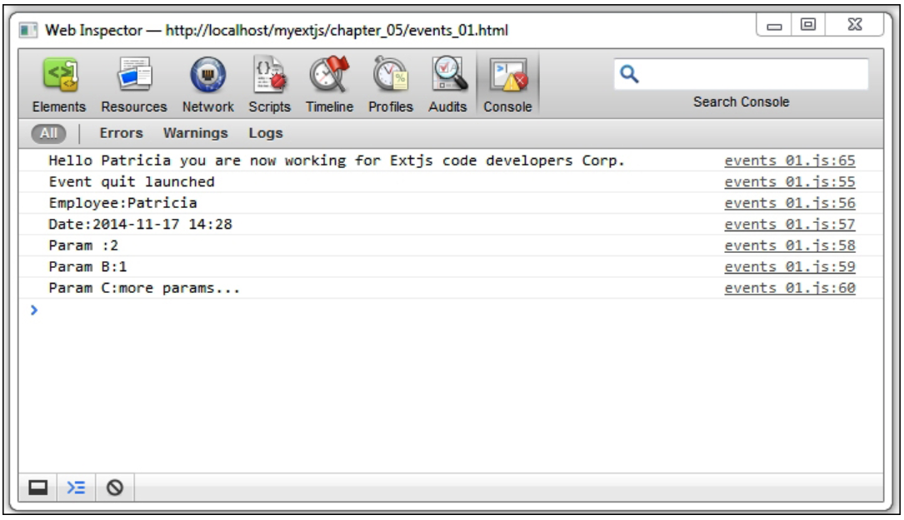

> **NOTA**
> 
> Cuando se habla de eventos y handlers(controladores), es importante mencionar que estamos hablando de Ext JS y cómo se codifica, maneja o usa en el framework, y debemos aclarar que esto no es un comportamiento de JavaScript puro.

En este punto, hemos definido nuestro evento y el listener que lo manejará. Otra forma común de agregar el listener es mediante el método **`on`**, que es un método abreviado de **`addListener`**:

```js
patricia.on({
   'quit':function(EmployeeName, quitDate, param, paramb, paramc){
      console.log('Event quit launched');
      console.log('Employee:' + EmployeeName);
      console.log('Date:' + Ext.util.Format.date(quitDate, 'Y-m-d H:i'));
      console.log('Param :' + param);
      console.log('Param B:' + paramb);
      console.log('Param C:' + paramc);
   }
});
patricia.quitJob();
```

Recuerde que es importante agregar un listener (o listeners) antes de ejecutar el método (o métodos) deseados. Los eventos son la forma en que podemos ejecutar ciertos conjuntos de acciones cuando ocurren eventos. Como podemos ver en el ejemplo anterior, la clase **`Employee`** es responsable solo de transmitir el evento cuando se llama al método **`quitJob`**. A la clase en sí no le importa quién pueda estar escuchando, pero en el exterior, un objeto está escuchando y reaccionará de acuerdo con los mensajes recibidos.

La capacidad de agregar, disparar y escuchar eventos personalizados es una característica muy poderosa en Ext JS.

#### 🔴 6️⃣ 💻 Mi versión `910-Learning-Ext-JS-05-01-Events-01.html`

```html
<!DOCTYPE html>
<html>
   <head>
      <title>Extjs - Events 01</title>
      <meta charset="UTF-8">
      <meta name="viewport" content="width=device-width, initial-scale=1, maximum-scale=1, user-scalable=no"> 
      <link href = "https://cdnjs.cloudflare.com/ajax/libs/extjs/6.0.0/classic/theme-neptune/resources/theme-neptune-all.css" rel = "stylesheet" />
      <script type = "text/javascript" src = "https://cdnjs.cloudflare.com/ajax/libs/extjs/6.0.0/ext-all.js"></script>

      <script type = "text/javascript">

        // code based on chapter 02 - Singleton Class (singleton_01.js)
        Ext.define('Myapp.CompanyConstants',{
            singleton: true, 	
            companyName: 'Extjs code developers Corp.',
            workingDays: 'Lunes a Viernes', 
            website:'www.extjscodedevelopers.com', 		
            welcomeEmployee:function (employee){
                return "Hola " + employee.getName() + " ahora estas trabajando en " + this.companyName; 		
            }
        });
        // Base class Employee  using config
        Ext.define('Myapp.sample.Employee',{
            mixins: {
            observable: 'Ext.util.Observable'
            },
            statics:{
                instanceCount:0, 		
                payrollId:1000,	
                nextId : function(){			
                    return (this.payrollId + this.instanceCount);	
                }
            },
            config:{
                name:'Unkown',
                lastName:'Unkown',
                age:0,	
                isOld:false, 
                payrollNumber:0		
            },
            constructor: function (config){		
                this.initConfig(config); 
                this.mixins.observable.constructor.call(this, config);
                this.setPayrollNumber(  this.statics().nextId() ); 
                this.self.instanceCount ++;			
            },
            work: function( task ){
                console.log( this.getName() + ' trabaja en: ' + task);
            },
            applyAge: function(newAge) {
                this.setIsOld ( (newAge>=90) ); 
                return newAge;
            }, 
            getTotalEmployees: function(){
                return this.statics().instanceCount;
            },
            quitJob:function(){		
                this.fireEvent('quit', this.getName(), new Date(), 2, 1 , 'más parámetros...' ); 
            }
        });

        var patricia = Ext.create('Myapp.sample.Employee', {
            name:'Patricia', lastName:'Diaz', age:21, isOld:false,  
            listeners:{
                'quit':function(EmployeeName, quitDate, param , paramb, paramc ){ 
                    console.log('Se lanzó el evento'); 
                    console.log('Empleado: ' + EmployeeName); 
                    console.log('Fecha: ' + Ext.util.Format.date(quitDate, 'Y-m-d H:i') ); 
                    console.log('Parámetro : ' + param);
                    console.log('Parámetro B: ' + paramb);
                    console.log('Parámetro C: ' + paramc);								
                } 
            }
        }); 
        console.log( Myapp.CompanyConstants.welcomeEmployee(patricia)  ); 

        // 2nd way to define the listener
        //patricia.on({
        //	'quit':function(EmployeeName, quitDate, param , paramb, paramc ){ 
        //	
        //		console.log('Se lanzó el evento'); 
        //		console.log('Empleado:' + EmployeeName); 
        //		console.log('Date:' + Ext.util.Format.date(quitDate, 'Y-m-d H:i') ); 
        //		console.log('Parámetro :' + param);
        //		console.log('Parámetro B:' + paramb);
        //		console.log('Parámetro C:' + paramc);				
        //		
        //	} 
        //});

        patricia.quitJob();


      </script>
   </head>
   <body style="padding:10px;">  
      
   </body>
</html>
```

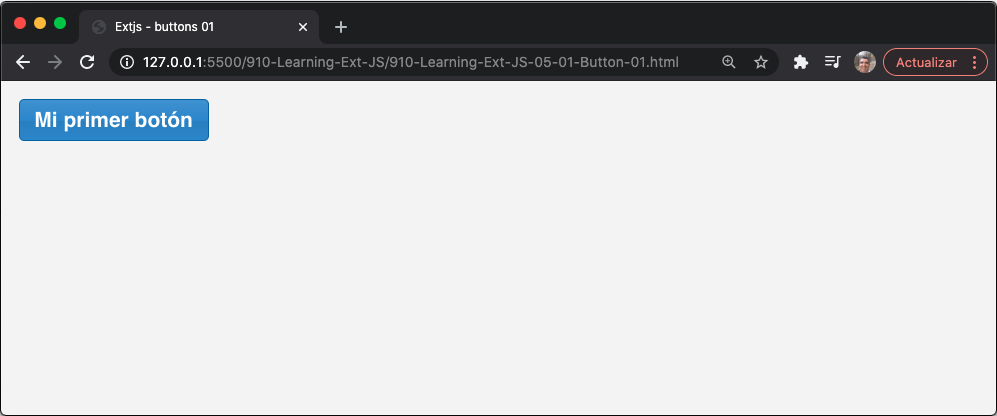

## Creando un Botón Simple

Ahora que tiene un conocimiento básico de cómo manejar eventos, es hora de que comencemos a trabajar con componentes y widgets. En primer lugar, optaremos por botones. Para crear buttons, necesitaremos usar la clase **`Ext.button.Button`**. Esta clase manejará todos los "entresijos" de un solo botón.

Creemos el código para nuestro primer botón:

```js
var myButton = Ext.create('Ext.button.Button', {
   text:'My first button',
   tooltip:'Click me...!',
   renderTo:Ext.getBody()
});
```

En este código, creamos una instancia de la clase **`Button`** y pasamos algunas configuraciones. Normalmente, un botón tiene muchas más configuraciones, pero por el momento, estas son suficientes.

La propiedad **`text`** establecerá el texto que se muestra cuando el botón se representa en el documento (utilizando el **Document Object Model (DOM)**).

La propiedad **`renderTo`** nos permitirá establecer el lugar donde se creará/insertará el cuerpo del documento (usando DOM). Aquí, el botón se colocará en el cuerpo del documento.

Ejecutemos la muestra en el navegador. Verá algo similar a la siguiente captura de pantalla:

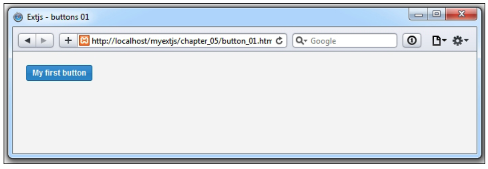


#### 🔴 6️⃣ 💻 Mi versión `910-Learning-Ext-JS-05-02-Button-01.html`

```html
<!DOCTYPE html>
<html>
   <head>
      <title>Extjs - buttons 01</title>
      <meta charset="UTF-8">
      <meta name="viewport" content="width=device-width, initial-scale=1, maximum-scale=1, user-scalable=no"> 
      <link href = "https://cdnjs.cloudflare.com/ajax/libs/extjs/6.0.0/classic/theme-neptune/resources/theme-neptune-all.css" rel = "stylesheet" />
      <script type = "text/javascript" src = "https://cdnjs.cloudflare.com/ajax/libs/extjs/6.0.0/ext-all.js"></script>

      <script type = "text/javascript">

        Ext.Loader.setConfig({
            enabled: true
        });

        Ext.require([
            'Ext.button.*'
        ]);

        Ext.onReady(function(){
                
            var myButton = Ext.create('Ext.button.Button',{
                text:'Mi primer botón',
                tooltip:'Haz click en mi...!', 			
                renderTo:Ext.getBody()
            });
        });

      </script>
   </head>
   <body style="padding:10px;">  
      
   </body>
</html>
```

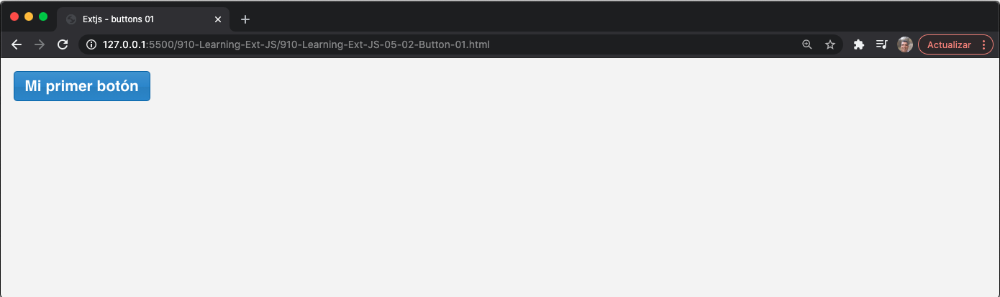

Por defecto, el botón tiene la propiedad **`scale`** igual a **`small`** , pero podemos cambiar el tamaño a **`medium`** y **`large`**. La propiedad **`scale`** nos permite definir el tamaño del botón. También relacionado con la propiedad **`scale`** está el hecho de que podemos establecer diferentes tamaños de icono para los botones dependiendo de la escala. Por el momento, cambiemos el código, y ahora vamos a crear dos botones más:

```js
var myButton = Ext.create('Ext.button.Button', {
   text:'My first small button',
   scale:'small',
   renderTo:Ext.getBody()
});

var myButtonB = Ext.create('Ext.button.Button', {
   text:'My first medium button',
   scale:'medium',
   renderTo:Ext.getBody()
});

var myButtonC = Ext.create('Ext.button.Button', {
   text:'My first large button',
   scale:'large',
   renderTo:Ext.getBody()
});
```

Este código creará tres botones con diferentes escalas, como se muestra en esta captura de pantalla:

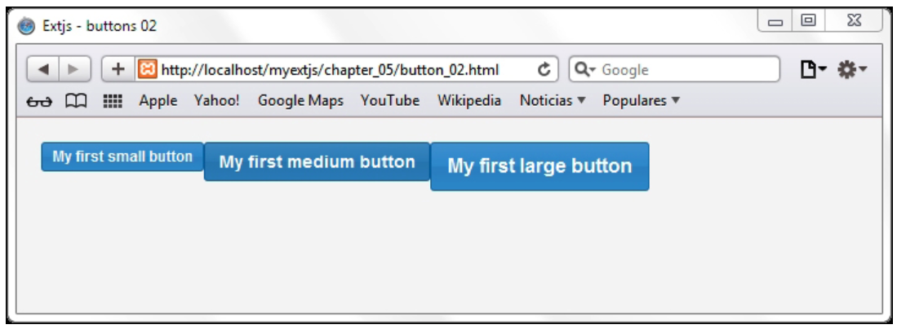

Tenga en cuenta que también podemos establecer un tamaño personalizado utilizando las propiedades **`width`** y **`height`**. Esto es posible porque la clase **`Button`** se extiende desde la clase **`Component`**.

#### 🔴 6️⃣ 💻 Mi versión `910-Learning-Ext-JS-05-03-Button-02.html`

```html
<!DOCTYPE html>
<html>
   <head>
      <title>Extjs - buttons 02</title>
      <meta charset="UTF-8">
      <meta name="viewport" content="width=device-width, initial-scale=1, maximum-scale=1, user-scalable=no"> 
      <link href = "https://cdnjs.cloudflare.com/ajax/libs/extjs/6.0.0/classic/theme-neptune/resources/theme-neptune-all.css" rel = "stylesheet" />
      <script type = "text/javascript" src = "https://cdnjs.cloudflare.com/ajax/libs/extjs/6.0.0/ext-all.js"></script>

      <script type = "text/javascript">

        Ext.Loader.setConfig({
            enabled: true
        });

        Ext.require([
            'Ext.button.*'
        ]);

        Ext.onReady(function(){
                
            var myButton = Ext.create('Ext.button.Button',{
                text:'Mi primer botón pequeño',
                scale:'small', 			
                renderTo:Ext.getBody()
            });
            
            var myButtonB = Ext.create('Ext.button.Button',{
                text:'Mi primer botón medio',
                scale:'medium', 			
                renderTo:Ext.getBody()
            });	
            
            var myButtonC = Ext.create('Ext.button.Button',{
                text:'Mi primer botón grande',
                scale:'large', 			
                renderTo:Ext.getBody()
            });			
            
        });
      </script>
   </head>
   <body style="padding:10px;">  
      
   </body>
</html>
```

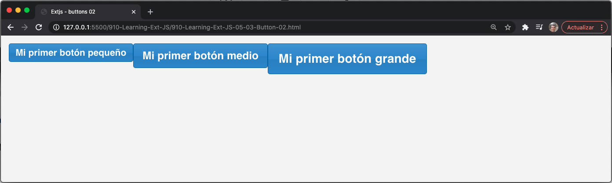

### Configuración de Iconos en Botones

Se ve con frecuencia que en cualquier aplicación, usamos íconos para diferenciar los botones de *acción*. Para configurar los iconos (imágenes) en cualquier botón, usaremos la propiedad **`iconCls`** para configurar una clase CSS (regla) que agregará la imagen como fondo. Anteriormente, cuando hablamos de la propiedad **`scale`**, la idea era usar los siguientes tamaños:

Scale | Size
------|-----
Small | 16 x 16 pixels
Medium| 24 x 24 pixels
Large | 32 x 32 pixels

Creemos algunas reglas CSS nuevas dentro del último código (archivo HTML), de la siguiente manera:

```css
.addicon-16{
   background:transparent url('images/add_16x16.png') center 0 no-repeat !important;
}
.addicon-24{
   background:transparent url('images/add_24x24.png') center 0 no-repeat !important;
}
.addicon-32{
   background:transparent url('images/add_32x32.png') center 0 no-repeat !important;
}
```

Definimos tres clases de CSS (reglas), una para cada escala disponible. Tenga en cuenta que también puede utilizar sus propios iconos. El código anterior asume que tenemos una carpeta llamada **`images`** con tres imágenes diferentes en su interior. Para que nuestro ejemplo funcione, debemos incluir esas imágenes en esa carpeta. No dude en utilizar sus propias imágenes para este ejemplo.

Una vez que tenemos nuestro CSS en su lugar, debemos configurar uno de ellos para cada uno de nuestros botones:

```js
var myButton = Ext.create('Ext.button.Button', {
   text:'My first small button',
   iconCls:'addicon-16',
   scale:'small',
   renderTo:Ext.getBody()
});

var myButtonB = Ext.create('Ext.button.Button', {
   text:'My first medium button',
   iconCls:'addicon-24',
   scale:'medium',
   renderTo:Ext.getBody()
});

var myButtonC = Ext.create('Ext.button.Button',{
   text:'My first large button',
   iconCls:'addicon-32',
   scale:'large',
   renderTo:Ext.getBody()
});
```

Usando la propiedad **`iconCls`**, podemos relacionar cualquier clase CSS con el botón. Si actualizamos nuestro navegador, podemos ver que cada botón tiene un icono, como se muestra aquí:

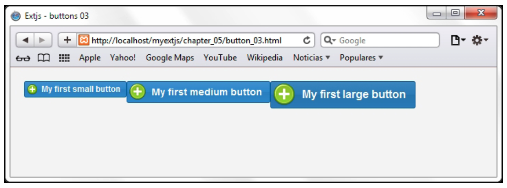

#### 🔴 6️⃣ 💻 Mi versión `910-Learning-Ext-JS-05-04-Button-03.html`

```html
<!DOCTYPE html>
<html>
   <head>
      <title>Extjs - buttons 03</title>
      <meta charset="UTF-8">
      <meta name="viewport" content="width=device-width, initial-scale=1, maximum-scale=1, user-scalable=no"> 
      <link href = "https://cdnjs.cloudflare.com/ajax/libs/extjs/6.0.0/classic/theme-neptune/resources/theme-neptune-all.css" rel = "stylesheet" />
      <script type = "text/javascript" src = "https://cdnjs.cloudflare.com/ajax/libs/extjs/6.0.0/ext-all.js"></script>
      <style type="text/css">
        .addicon-16{
            background:transparent url('images/add_16x16.png') center 0 no-repeat !important; 	
        }
        .addicon-24{
            background:transparent url('images/add_24x24.png') center 0 no-repeat !important;
        }
        .addicon-32{
            background:transparent url('images/add_32x32.png') center 0 no-repeat !important;
        }
      </style>
      <script type = "text/javascript">

        Ext.Loader.setConfig({
            enabled: true
        });

        Ext.require([
            'Ext.button.*'
        ]);

        Ext.onReady(function(){
                
            var myButton = Ext.create('Ext.button.Button',{
                text:'Mi primer botón pequeño',
                iconCls:'addicon-16',
                scale:'small', 			
                renderTo:Ext.getBody()
            });
            
            var myButtonB = Ext.create('Ext.button.Button',{
                text:'Mi primer botón medio',
                iconCls:'addicon-24',
                scale:'medium', 			
                renderTo:Ext.getBody()
            });	
            
            var myButtonC = Ext.create('Ext.button.Button',{
                text:'Mi primer botón grande',
                iconCls:'addicon-32',
                scale:'large', 			
                renderTo:Ext.getBody()
            });			
            
        });

      </script>
   </head>
   <body style="padding:10px;">  
      
   </body>
</html>
```

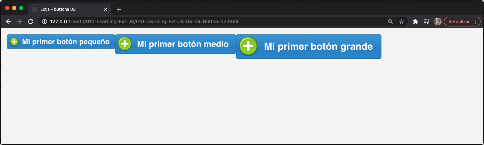

### Alineación de Iconos en Botones

De forma predeterminada, el icono, está alineado al lado izquierdo, pero también podemos establecer la posición en el lado superior, inferior y derecho. Hacemos esto usando la propiedad **`iconAlign`**. Usemos el siguiente código:

```js
var myButtonA = Ext.create('Ext.button.Button',{
   text:'left icon',
   iconCls:'addicon-16',
   iconAlign:'left',
   renderTo:Ext.getBody()
});

var myButtonB = Ext.create('Ext.button.Button',{
   text:'top icon',
   iconCls:'addicon-16',
   iconAlign:'top',
   renderTo:Ext.getBody()
});

var myButtonC = Ext.create('Ext.button.Button',{
   text:'right icon',
   iconCls:'addicon-16',
   iconAlign:'right',
   renderTo:Ext.getBody()
});

var myButtonD = Ext.create('Ext.button.Button',{
   text:'bottom icon',
   iconCls:'addicon-16',
   iconAlign:'bottom',
   renderTo:Ext.getBody()
});
```

El uso de **`iconAlign`** establece la alineación del icono. Si actualizamos nuestro navegador, podemos ver como cada botón tiene el icono en una posición diferente, como se muestra en la siguiente captura de pantalla:

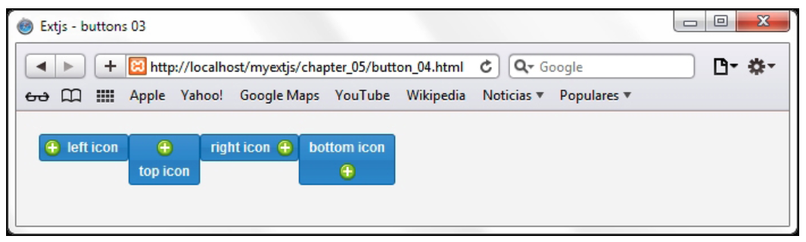

#### 🔴 6️⃣ 💻 Mi versión `910-Learning-Ext-JS-05-05-Button-04.html`

```html
<!DOCTYPE html>
<html>
   <head>
      <title>Extjs - buttons 04</title>
      <meta charset="UTF-8">
      <meta name="viewport" content="width=device-width, initial-scale=1, maximum-scale=1, user-scalable=no"> 
      <link href = "https://cdnjs.cloudflare.com/ajax/libs/extjs/6.0.0/classic/theme-neptune/resources/theme-neptune-all.css" rel = "stylesheet" />
      <script type = "text/javascript" src = "https://cdnjs.cloudflare.com/ajax/libs/extjs/6.0.0/ext-all.js"></script>
      <style type="text/css">
        .addicon-16{
            background:transparent url('images/add_16x16.png') center 0 no-repeat !important; 
        }
      </style>
      <script type = "text/javascript">

        Ext.Loader.setConfig({
            enabled: true
        });

        Ext.require([
            'Ext.button.*',
            'Ext.window.*'//'Ext.MessageBox'
        ]);

        Ext.onReady(function(){
                
            var myButtonA = Ext.create('Ext.button.Button',{
                text:'left icon',
                iconCls:'addicon-16',
                iconAlign:'left',
                renderTo:Ext.getBody()
            });
            
            myButtonA.on('click',function(){
                Ext.Msg.alert("Haga clic en el evento", "¡Ha hecho clic en el botón del icono izquierdo ...!");
            });

            var myButtonB = Ext.create('Ext.button.Button',{
                text:'top icon',
                iconCls:'addicon-16',
                iconAlign:'top',
                renderTo:Ext.getBody()
            });

            var myButtonC = Ext.create('Ext.button.Button',{
                text:'right icon',
                iconCls:'addicon-16',
                iconAlign:'right',
                renderTo:Ext.getBody()
            });	
                
            var myButtonD = Ext.create('Ext.button.Button',{
                text:'bottom icon',
                iconCls:'addicon-16',
                iconAlign:'bottom',
                renderTo:Ext.getBody()
            });	
            
        });

      </script>
   </head>
   <body style="padding:10px;">  
      
   </body>
</html>
```

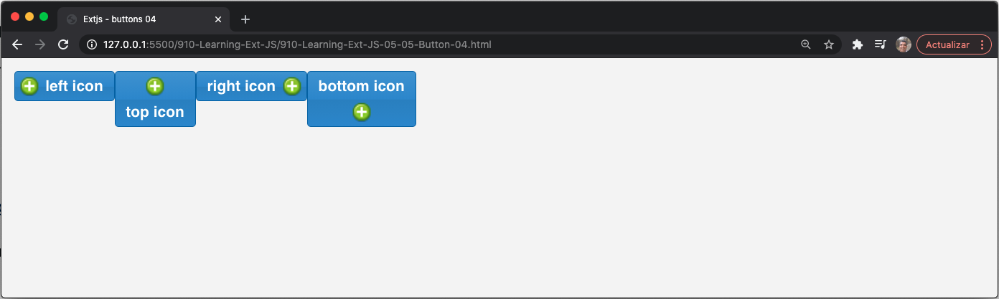

#### Manejo de Eventos del Botón

Una vez que tengamos nuestros botones en su lugar, es muy probable que queramos agregar algunas acciones cuando se haga clic en ellos. En los próximos capítulos, veremos cómo escuchar eventos usando el patrón MVVM. Por ahora, escucharemos los eventos directamente en los botones.

La clase **`Button`** hace uso de la clase **`Observable`** (internamente) usándola como un mixin; por lo tanto, podemos escuchar eventos usando el método **`addListener`**.

Cada componente tiene muchos eventos predefinidos que podemos usar. Si revisamos la documentación, podemos ver todos los eventos disponibles, con una descripción de cuándo se dispara el evento y qué parámetros reciben los listeners. En este caso, la clase **`Button`** contiene el evento **`click`**, que se activa cuando el usuario hace clic en el botón. Podemos escuchar este evento usando el método **`on`** (un método abreviado para el método **`addListener`**):

```js
myButtonA.on('click', function(){
   Ext.Msg.alert("Click event", "You clicked left icon button..!");
});
```

En el código anterior, usamos el método **`on`** para escuchar el evento **`click`**. Cuando se activa este evento, mostrará un mensaje de confirmación.

Si actualizamos nuestro navegador y hacemos clic en el primer botón, deberíamos ver el siguiente mensaje:

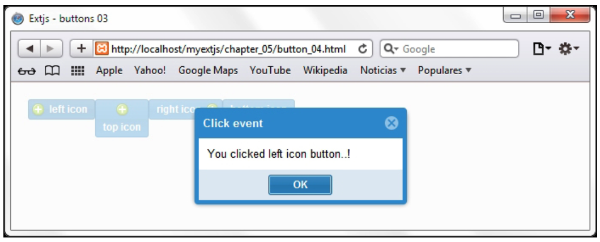

Podemos hacer lo que queramos dentro de la función callback. En este caso, solo estamos mostrando un mensaje de alerta, pero también podemos cargar un store para extraer algunos datos de nuestro servidor. Podemos mostrar un componente de ventana o crear un panel con un formulario en su interior.

Hay muchos más eventos que podemos escuchar, por ejemplo, `show`, `hide`, `enable`, `disable`, etc. Para obtener más nombres de eventos, consulte la documentación de Ext JS.

Podemos definir cualquier número de listeners para el mismo evento, y cuando se dispara el evento, se ejecutarán todos los listeners.

#### 🔴 6️⃣ 💻 Mi versión `910-Learning-Ext-JS-05-06-Button-05.html`

```html
<!DOCTYPE html>
<html>
   <head>
      <title>Extjs - buttons 05</title>
      <meta charset="UTF-8">
      <meta name="viewport" content="width=device-width, initial-scale=1, maximum-scale=1, user-scalable=no"> 
      <link href = "https://cdnjs.cloudflare.com/ajax/libs/extjs/6.0.0/classic/theme-neptune/resources/theme-neptune-all.css" rel = "stylesheet" />
      <script type = "text/javascript" src = "https://cdnjs.cloudflare.com/ajax/libs/extjs/6.0.0/ext-all.js"></script>
      <style type="text/css">
        .addicon-16{
            background:transparent url('images/add_16x16.png') center 0 no-repeat !important; 
        }
      </style>
      <script type = "text/javascript">

	Ext.Loader.setConfig({
            enabled: true
        });

        Ext.require([
            'Ext.button.*',
            'Ext.window.*'//'Ext.MessageBox'
        ]);

        Ext.onReady(function(){
                
            var myButtonA = Ext.create('Ext.button.Button',{
                text:'left icon',
                iconCls:'addicon-16',
                iconAlign:'left',
                renderTo:Ext.getBody()
            });
            
            myButtonA.on('click',function(){
                Ext.Msg.alert("Haga clic en el evento", "¡Ha hecho clic en el botón left icon ...!");
            });

            var myButtonB = Ext.create('Ext.button.Button',{
                text:'top icon',
                iconCls:'addicon-16',
                iconAlign:'top',
                renderTo:Ext.getBody()
            });

            var myButtonC = Ext.create('Ext.button.Button',{
                text:'right icon',
                iconCls:'addicon-16',
                iconAlign:'right',
                renderTo:Ext.getBody()
            });	
                
            var myButtonD = Ext.create('Ext.button.Button',{
                text:'bottom icon',
                iconCls:'addicon-16',
                iconAlign:'bottom',
                renderTo:Ext.getBody()
            });	
            
        });


      </script>
   </head>
   <body style="padding:20px;">

	    <div id="normalbuttons"></div>
        <div>&nbsp;</div>
        <div id="segmentedbuttons"></div>

    </body>
</html>
```

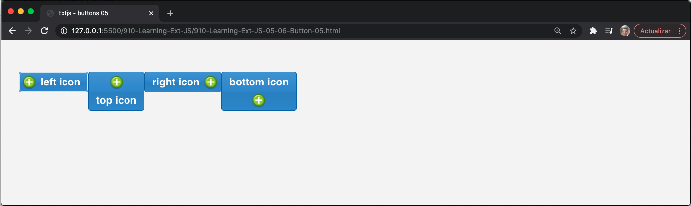

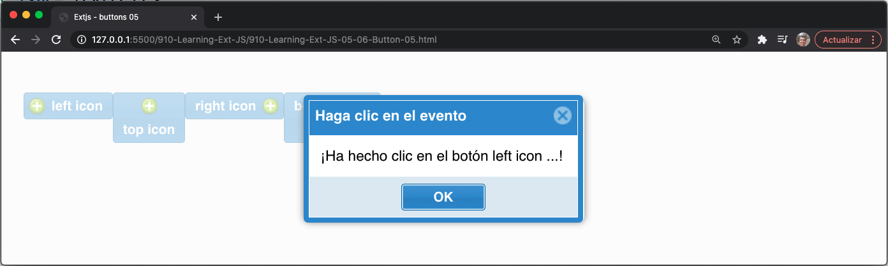

## Botones Segmentados

```js
var mySegmentedbuttons = Ext.create('Ext.button.Segmented',{
   renderTo:'segmentedbuttons',
   vertical:false,
   items:[{
      xtype: 'button', text:'1st button', iconCls:'addicon-16'
   },{
      text:'2nd button', iconCls:'addicon-16'
   },{
      text:'3th button', iconCls:'addicon-16'
   },{
      text:'4th button', iconCls:'addicon-16'
   }]
});
```

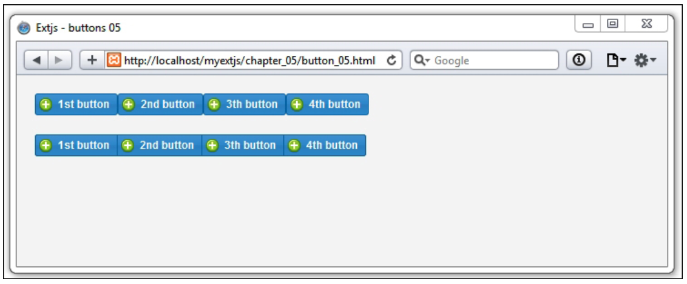

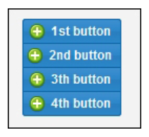

## Agregar Menús

```js
var myButton = Ext.create('Ext.button.Button',{
   text:'Add payment method...',
   iconCls:'addicon-32',
   iconAlign:'left',
   scale:'large',
   renderTo:'normalbuttons',
   menu:[
      {text:'Master Card'},
      {text:'Visa'},
      {text:'PayPal'},
      {text:'Other...'}
   ]
});
```

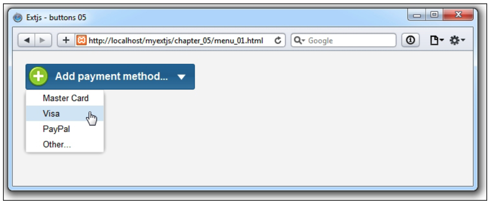

```js
//Step 1
var menuItemA = Ext.create('Ext.menu.Item',{text:'Master card'});
//Step 2
var menu = Ext.create('Ext.menu.Menu',{
   items : [  //Step 3
      menuItemA,   // Variable
      Ext.create('Ext.menu.Item',{text:'Visa'}), // constructor
      {text:'Paypal'} //object config
   ]
});
var myButton = Ext.create('Ext.button.Button',{
   text:'Add payment method...',
   iconCls:'addicon-32',
   iconAlign:'left',
   scale:'large',
   renderTo:'normalbuttons',
   menu:menu
});
```

```js
items : [ //Step 3
   menuItemA,  // Variable
   Ext.create( 'Ext.menu.Item' ,{
      text:'American Express'
   }), // constructor
   {text:'Other'} //object config
]
```

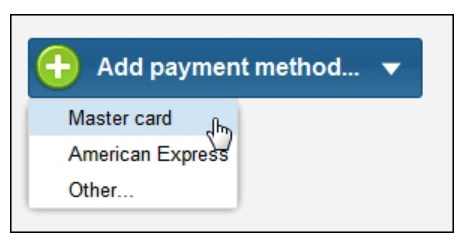

```js
var myButton = Ext.create('Ext.button.Button',{
   text:'Add payment method...',
   iconCls:'addicon-32',
   iconAlign:'left',
   scale:'large',
   renderTo:'normalbuttons',
   menu:[{
      text:'Master Card',
      listeners:{  // Option 1
         click:function(){
            Ext.Msg.alert("Click event", "You selected Master Card..!");
         }
      }
   },{
      text:'Visa', //Option 2
      handler: onMenuItemClick
   },{
      text:'PayPal',
      listeners:{ //Option 3
         'click':{fn: onMenuItemClick , single:true}
      }
   },{
      text:'Other...',
      handler: onMenuItemClick
   }]
});
function onMenuItemClick (itemBtn, Event){
   var optionString = itemBtn.text;
   Ext.Msg.alert("Click event","You selected " + optionString + " ..!");
}
```

> **NOTA**
> 
> 

```js
var optionString = itemBtn.text;
```

## Toolbars

```js
var myPanel = Ext.create( 'Ext.panel.Panel' ,{
   title: 'My first toolbar...',
   width: 450,
   height: 200,
   dockedItems: [{ //Step 1
      xtype : 'toolbar',
      dock: 'top', //Step 2
      items: [
         {text: 'New record'},
         {text: 'Edit record'},
         {text: 'Remove record'}
      ]
   }],
   renderTo:Ext.getBody()
});
```

```js
items:[
   {text:'New', iconCls:'addicon-16'},
   {text:'Edit', iconCls:'editicon-16'},
   {text:'Remove', iconCls:'deleteicon-16'},
   {text:'Export', iconCls:'export-16'},
   {text:'Print', iconCls:'print-16'},
   {text:'Help', iconCls:'help-16'}
]
```

```css
.addicon-16{ background:transparent url('../images/add_16x16.png') center 0 no-repeat !important; }
.deleteicon-16{ background:transparent url('../images/delete.png') center 0 no-repeat !important; }
.editicon-16{ background:transparent url('../images/pencil.png') center 0 no-repeat !important; }
.help-16{ background:transparent url('../images/help.png') center 0 no-repeat !important; }
.print-16{ background:transparent url('../images/printer.png') center 0 no-repeat !important; }
.export-16{ background:transparent url('../images/page_go.png') center 0 no-repeat !important; }
```

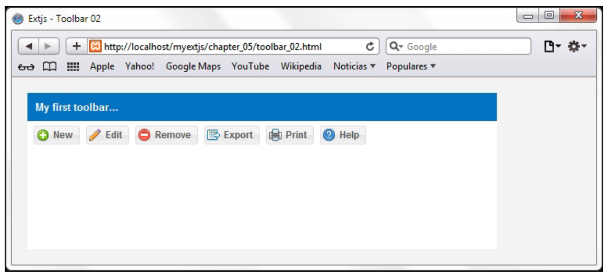

### Grupos de Botones de la Toolbars

```js
var myPanel = Ext.create('Ext.panel.Panel',{
   title:'My first toolbar...',
   width:600,
   height:200,
   dockedItems:[{ //Step 1
      xtype : 'toolbar',
      dock: 'top', //Step 2
      items:[
         { xtype:'buttongroup',
            title:'Actions',
            items:[
               {text: 'New', iconCls: 'addicon-16'},
               {text: 'Edit', iconCls: 'editicon-16'},
               {text: 'Remove', iconCls: 'deleteicon-16'}
            ]
         },{
            xtype: 'buttongroup',
            title: 'Print / Export & Help',
            items:[
               {text: 'Export', iconCls: 'export-16'},
               {text: 'Print', iconCls: 'print-16'},
               {text: 'Help', iconCls: 'help-16'}
            ]
         }
      ]
   }],
   renderTo:Ext.getBody()
});
```

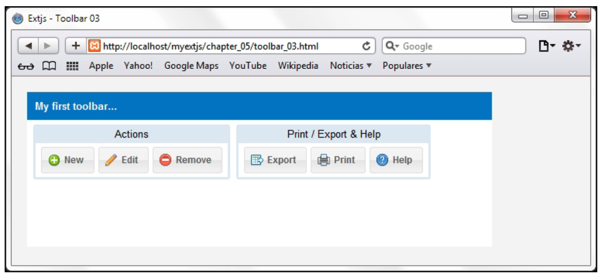

```js
var myPanel = Ext.create('Ext.panel.Panel',{
   title:'My first toolbar...',
   width:600,
   height:200,
   dockedItems:[{ //Step 1
      xtype : 'toolbar',
      dock: 'top', //Step 2
      items:[{ 
         xtype:'buttongroup',
         title:'Actions',
         columns:2,
         items:[
            {text:'New', iconCls:'addicon-32', scale:'large', rowspan:2, iconAlign:'top' },
            {text:'Edit', iconCls:'editicon-16'},
            {text:'Remove', iconCls:'deleteicon-16'}
         ]
      },{
         xtype:'buttongroup', title:'Print / Export & Help',
         defaults:{scale:'large', iconAlign:'top'},
         items:[
            {text:'Export', iconCls:'export-32'},
            {text:'Print', iconCls:'print-32'}
         ]
      },{
         xtype:'buttongroup', title:'Help',
         items:[
            {text:'Help', iconCls:'help-32', scale:'large', iconAlign:'bottom' }
         ]
      }]
   }],
   renderTo:Ext.getBody()
});
```

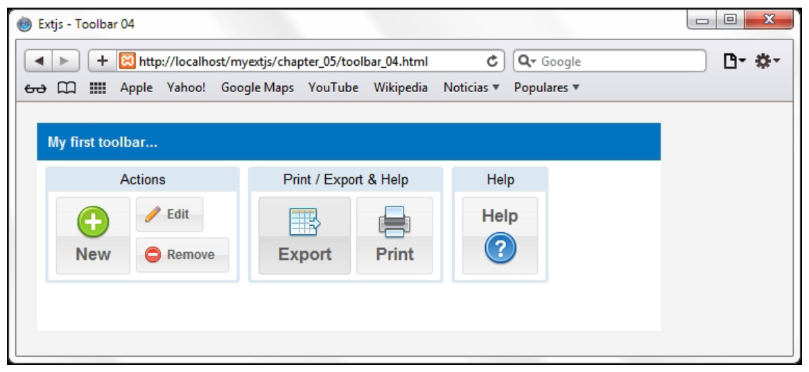

## La Breadcrumb Bar

```js
Ext.define('Myapp.sample.store.mainMenu', {
   extend: 'Ext.data.TreeStore',
   root: {
      text: 'My app',
      expanded: true,
      children: [{
         text: 'Modules',
         expanded: true,
         children: [
            {leaf: true, text: 'Employees'},
            {leaf: true, text: 'Customers'},
            {leaf: true, text: 'Products'}
         ]
      },{
         text: 'Market',
         expanded: true,
         children: [
            {leaf: true, text: 'Sales'},
            {leaf: true, text: 'Budgets'},
            {leaf: true, text: 'SEO'},
            {leaf: true, text: 'Statistics'}
         ]
      },{
         text: 'Support',
         iconCls:'help-16',
         children: [
            {leaf: true, text: 'Submit a ticket'},
            {leaf: true, text: 'Forum'},
            {leaf: true, text: 'Visit our web site'}
         ]
      },
      {leaf: true, text: 'Reports'},
      {leaf: true, text: 'Charts'}
      ]
   }
});
```

```js
//step 1
var myMenuStore = Ext.create('Myapp.sample.store.mainMenu',{});
var myPanel = Ext.create('Ext.panel.Panel',{
   title:'My first breadcrumb bar...',
   width:600,
   height:200,
   dockedItems:[{ //Step 2
      xtype : 'breadcrumb',
      dock: 'top',
      store: myMenuStore,
      showIcons: true,
      selection: myMenuStore.getRoot().childNodes[2].childNodes[0]
   }],
   renderTo:Ext.getBody()
});
```

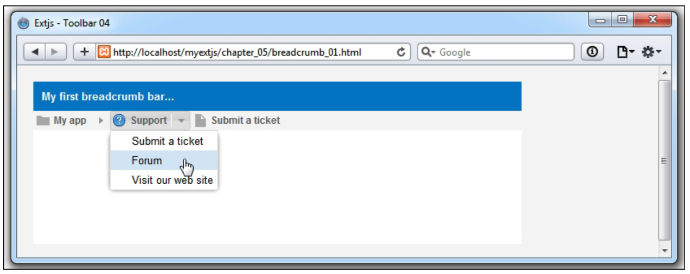

```js
{
   text: 'Support', iconCls:'help-16',
   children: [
      {leaf: true, text: 'Submit a ticket'},
      {leaf: true, text: 'Forum'},
      {leaf: true, text: 'Visit our web site'}
   ]
}
```

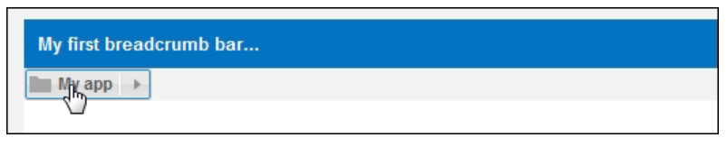

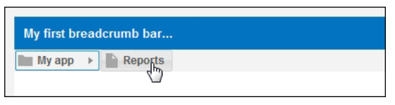

### Manejo de Selecciones en la Breadcrumb Bar

```js
dockedItems:[{
   xtype : 'breadcrumb',
   dock: 'top',
   store: myMenuStore,
   showIcons: true,
   selection: myMenuStore.getRoot().childNodes[2].childNodes[0],
   listeners:{
      'selectionchange':{
         fn:function(mybreadcrumb, node, eOpts){
            var panel = mybreadcrumb.up('panel');
            panel.update( 'This is the zone for:<b>' +  node.data.text + '</b>' );
         },
         delay:200
       }
   }
}],
```

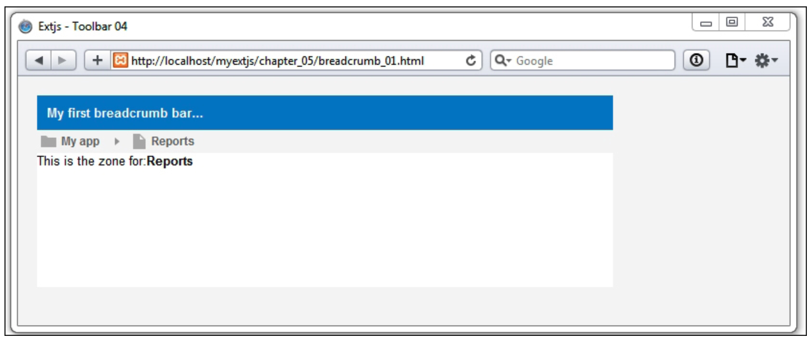

## El Menú Principal de Nuestra Aplicación

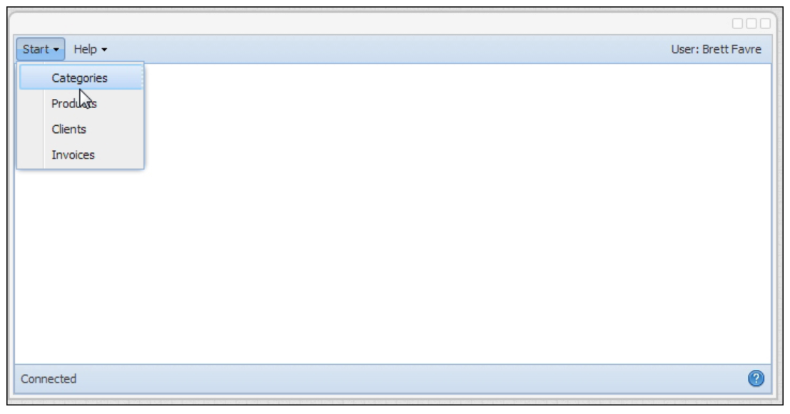

> **NOTA**
> 
> 

> **NOTA**
> 
> 

```js
Ext.define('MyApp.view.Viewport',{
   extend: 'Ext.container.Viewport',
   layout: 'fit',
   initComponent: function(){
      var me = this;
      me.items = [{
         xtype: 'panel',
      }];
      me.callParent();
   }
});
```

```js
me.items = [{
   xtype: 'panel',
}];
```

```js
dockedItems: [{
   xtype: 'toolbar', docked:'top',
   items: [{
      text: 'Home', iconCls: 'home-16',
      menu:[
         {text: 'Categories', iconCls: 'categories-16'},
         {text: 'Products', iconCls: 'products-16'},
         {text: 'Clients', iconCls: 'clients-16' },
         {text: 'Invoices', iconCls: 'invoices-16'}
      ]
   },{
      text: 'Help', iconCls: 'help-16',
      menu: {
         xtype: 'menu',
         items: [
            {xtype: 'menuitem', text: 'Submit a support ticket'},
            {xtype: 'menuitem', text: 'Forum'},
            {xtype: 'menuitem', text: 'About...'}
         ]
      }
   },
   {xtype: 'tbfill'},
   {xtype: 'tbtext', text: 'User: Brett Fravre'}
   ]
}]
```

```js
Ext.onReady(function(){
   Ext.create("MyApp.view.Viewport");
});
```

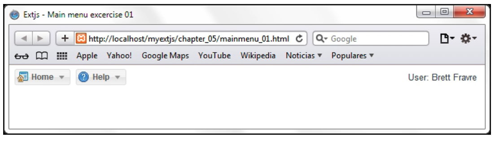

```js
dockedItems : [{
   xtype : 'toolbar', docked:'top',
   //your code here…
},
{
   xtype : 'toolbar', dock:'bottom',
   items : [
      {xtype: 'tbtext', text: '<b>Status :</b>Connected'},
      {xtype: 'tbfill' },
      {text:'', iconCls: 'help-16'}
   ]
}]
```

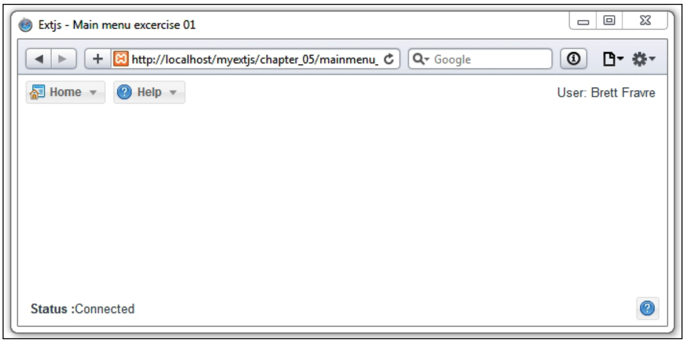


> **TIP**
> 
> 

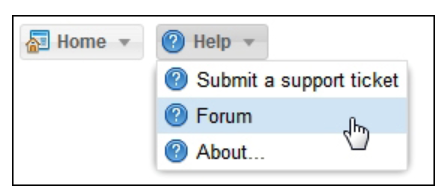


## Resumen 


