# 5. Buttons y Toolbars

* Desarrollo impulsado por eventos (Event-driven development)
* Creando un botón simple
   * Configuración de iconos en botones
   * Alineación de iconos en botones
      * Manejo de eventos de botón
* Botones segmentados
* Agregar menús
* Toolbars
   * Grupos de botones de la Toolbars
* La breadcrumb bar
   * Manejo de selecciones en la breadcrumb bar
* El menú principal de nuestra aplicación
* Resumen 

Cuando trabajemos con buttons y toolbars, definitivamente necesitaremos organizarlos siempre que usemos componentes window o panel. Las toolbars son una excelente manera de agregar botones y menús, y podemos crear grupos de botones. Sin embargo, también necesitamos entender cómo manejar eventos para ejecutar acciones. Podemos agregar acciones a nuestros widgets usando callbacks y eventos para procesar la interacción del usuario.

En este capítulo, aprenderá cómo crear buttons y toolbars y cómo manejar un evento (o eventos) para comenzar con la interacción del usuario en la interfaz de usuario de Ext JS.

## Desarrollo impulsado por eventos (Event-driven development)

Antes de comenzar a hablar sobre componentes, debe comprender cómo funcionan los eventos y los listeners entre bastidores. Lo primero que debe aprender es el patrón observable.

Básicamente, ***el patrón observable*** está diseñado para permitir que las entidades u objetos se comuniquen entre sí mediante eventos. Cuando ocurre una determinada acción dentro de un objeto o componente, este objeto debe transmitir un evento a quien esté escuchando.

Por ejemplo, cuando se hace clic en un botón, se activa el evento **`click`**. Cuando se hace clic en una fila de un grid, el grid dispara el evento **`itemclick`**. Todos los componentes tienen eventos definidos y se activan cuando se produce una acción.

El componente que está disparando el evento no sabe quién escuchará sus mensajes, pero su responsabilidad es que otros sepan que algo ha sucedido. Entonces, tal vez otros componentes hagan algo al respecto, o nada en absoluto.

La clase base **`Ext.util.Observable`** nos permite agregar, disparar y escuchar eventos de un objeto o componente específico y realizar acciones cuando se ejecuta ese evento.

Todos los widgets incluidos en la library Ext JS tienen la clase **`Ext.util.Observable`** mezclada, por lo que todos los widgets activan eventos que podemos escuchar para realizar acciones y dar vida a nuestros widgets.

Como se mencionó anteriormente, podemos definir y disparar nuevos eventos en nuestros componentes personalizados usando la misma clase **`Ext.util.Observable`**.

Copie el archivo **`singleton_01.js`** (de los archivos de código del capítulo 02). Luego, tenemos que agregar los siguientes cambios a la clase **`Employee`**:

```js
Ext.define('Myapp.sample.Employee',{
mixins: {observable: 'Ext.util.Observable'},
   Code.....
   constructor: function( config ){
      Code.....
      this.mixins.observable.constructor.call( this, config );
   },
   quitJob: function(){
      this.fireEvent('quit', this.getName(), new Date(), 2, 1, 'more params...' );
   }
});
```

Como puede observar, la clase **`Employee`** ahora contiene el mixin, la clase **`Ext.util.Observable`**. Además, dentro de la función constructor, este mixin es inicializado por el código **`this.mixins.observable.constructor.call(this, config);`**. Esto significa que **`Ext.util.Observable`** estará al tanto de cualquier evento que se inicie dentro de la clase **`Employee`**, siempre que suceda.

> **NOTA**
> 
> Para comprender más sobre los mixins, consulte http://docs.sencha.com/extjs/5.1/5.1.1-apidocs/#!/api/Ext.Mixin.

La función **`quitJob`**, cuando se llama, lanzará el evento **`quit`**, pasando los parámetros **`this.getName(), new Date(), 2, 1, 'more params...'`**.

> **NOTA**
> 
> En versiones anteriores de Ext JS, teníamos que agregar el método **`addEvent(...)`** para crear o definir el evento (o eventos) adecuado dentro de la clase. Si está actualizando desde la versión 4, tenga en cuenta este cambio. La versión 5 es más flexible al respecto.

Ahora, necesitamos el código para escuchar el evento **'quit'** cuando se lanza. En Ext JS, tenemos la propiedad **`listeners`** que se usa para tales propósitos (listen/handle events). Modifiquemos el código donde instanciamos la clase:

```js
var patricia = Ext.create('Myapp.sample.Employee', {
   name:'Patricia',
   lastName:'Diaz',
   age:21,
   isOld:false,
   listeners:{
      'quit':function(EmployeeName, quitDate, param, paramb, paramc){
         console.log('Event quit launched');
         console.log('Employee:' + EmployeeName);
         console.log('Date:'+ Ext.util.Format.date(quitDate,'Y-m-d H:i'));
         console.log('Param :' + param);
         console.log('Param B:' + paramb);
         console.log('Param C:' + paramc);
      }
   }
});
console.log(Myapp.CompanyConstants.welcomeEmployee(patricia));
patricia.quitJob();
```

La propiedad **`listeners`** se incluyó en el objeto de configuración (la nueva clase **`Employee`**), por lo que de esta manera, podemos interceptar y manejar el evento **`quit`** cuando suceda. Ejecutemos el código en nuestro navegador y revisemos la salida de la consola, como se muestra en la siguiente captura de pantalla:


> **NOTA**
> 
> Cuando se habla de eventos y handlers(controladores), es importante mencionar que estamos hablando de Ext JS y cómo se codifica, maneja o usa en el framework, y debemos aclarar que esto no es un comportamiento de JavaScript puro.

En este punto, hemos definido nuestro evento y el listener que lo manejará. Otra forma común de agregar el listener es mediante el método **`on`**, que es un método abreviado de **`addListener`**:

```js
patricia.on({
   'quit':function(EmployeeName, quitDate, param, paramb, paramc){
      console.log('Event quit launched');
      console.log('Employee:' + EmployeeName);
      console.log('Date:' + Ext.util.Format.date(quitDate, 'Y-m-d H:i'));
      console.log('Param :' + param);
      console.log('Param B:' + paramb);
      console.log('Param C:' + paramc);
   }
});
patricia.quitJob();
```

Recuerde que es importante agregar un listener (o listeners) antes de ejecutar el método (o métodos) deseados. Los eventos son la forma en que podemos ejecutar ciertos conjuntos de acciones cuando ocurren eventos. Como podemos ver en el ejemplo anterior, la clase **`Employee`** es responsable solo de transmitir el evento cuando se llama al método **`quitJob`**. A la clase en sí no le importa quién pueda estar escuchando, pero en el exterior, un objeto está escuchando y reaccionará de acuerdo con los mensajes recibidos.

La capacidad de agregar, disparar y escuchar eventos personalizados es una característica muy poderosa en Ext JS.

#### 🔴 6️⃣ 💻 Mi versión `910-Learning-Ext-JS-05-01-Events-01.html`

```html
<!DOCTYPE html>
<html>
   <head>
      <title>Extjs - Events 01</title>
      <meta charset="UTF-8">
      <meta name="viewport" content="width=device-width, initial-scale=1, maximum-scale=1, user-scalable=no"> 
      <link href = "https://cdnjs.cloudflare.com/ajax/libs/extjs/6.0.0/classic/theme-neptune/resources/theme-neptune-all.css" rel = "stylesheet" />
      <script type = "text/javascript" src = "https://cdnjs.cloudflare.com/ajax/libs/extjs/6.0.0/ext-all.js"></script>

      <script type = "text/javascript">

        // code based on chapter 02 - Singleton Class (singleton_01.js)
        Ext.define('Myapp.CompanyConstants',{
            singleton: true, 	
            companyName: 'Extjs code developers Corp.',
            workingDays: 'Lunes a Viernes', 
            website:'www.extjscodedevelopers.com', 		
            welcomeEmployee:function (employee){
                return "Hola " + employee.getName() + " ahora estas trabajando en " + this.companyName; 		
            }
        });
        // Base class Employee  using config
        Ext.define('Myapp.sample.Employee',{
            mixins: {
            observable: 'Ext.util.Observable'
            },
            statics:{
                instanceCount:0, 		
                payrollId:1000,	
                nextId : function(){			
                    return (this.payrollId + this.instanceCount);	
                }
            },
            config:{
                name:'Unkown',
                lastName:'Unkown',
                age:0,	
                isOld:false, 
                payrollNumber:0		
            },
            constructor: function (config){		
                this.initConfig(config); 
                this.mixins.observable.constructor.call(this, config);
                this.setPayrollNumber(  this.statics().nextId() ); 
                this.self.instanceCount ++;			
            },
            work: function( task ){
                console.log( this.getName() + ' trabaja en: ' + task);
            },
            applyAge: function(newAge) {
                this.setIsOld ( (newAge>=90) ); 
                return newAge;
            }, 
            getTotalEmployees: function(){
                return this.statics().instanceCount;
            },
            quitJob:function(){		
                this.fireEvent('quit', this.getName(), new Date(), 2, 1 , 'más parámetros...' ); 
            }
        });

        var patricia = Ext.create('Myapp.sample.Employee', {
            name:'Patricia', lastName:'Diaz', age:21, isOld:false,  
            listeners:{
                'quit':function(EmployeeName, quitDate, param , paramb, paramc ){ 
                    console.log('Se lanzó el evento'); 
                    console.log('Empleado: ' + EmployeeName); 
                    console.log('Fecha: ' + Ext.util.Format.date(quitDate, 'Y-m-d H:i') ); 
                    console.log('Parámetro : ' + param);
                    console.log('Parámetro B: ' + paramb);
                    console.log('Parámetro C: ' + paramc);								
                } 
            }
        }); 
        console.log( Myapp.CompanyConstants.welcomeEmployee(patricia)  ); 

        // 2nd way to define the listener
        //patricia.on({
        //	'quit':function(EmployeeName, quitDate, param , paramb, paramc ){ 
        //	
        //		console.log('Se lanzó el evento'); 
        //		console.log('Empleado:' + EmployeeName); 
        //		console.log('Date:' + Ext.util.Format.date(quitDate, 'Y-m-d H:i') ); 
        //		console.log('Parámetro :' + param);
        //		console.log('Parámetro B:' + paramb);
        //		console.log('Parámetro C:' + paramc);				
        //		
        //	} 
        //});

        patricia.quitJob();


      </script>
   </head>
   <body style="padding:10px;">  
      
   </body>
</html>
```


## Creando un Botón Simple

Ahora que tiene un conocimiento básico de cómo manejar eventos, es hora de que comencemos a trabajar con componentes y widgets. En primer lugar, optaremos por botones. Para crear buttons, necesitaremos usar la clase **`Ext.button.Button`**. Esta clase manejará todos los "entresijos" de un solo botón.

Creemos el código para nuestro primer botón:

```js
var myButton = Ext.create('Ext.button.Button', {
   text:'My first button',
   tooltip:'Click me...!',
   renderTo:Ext.getBody()
});
```

En este código, creamos una instancia de la clase **`Button`** y pasamos algunas configuraciones. Normalmente, un botón tiene muchas más configuraciones, pero por el momento, estas son suficientes.

La propiedad **`text`** establecerá el texto que se muestra cuando el botón se representa en el documento (utilizando el **Document Object Model (DOM)**).

La propiedad **`renderTo`** nos permitirá establecer el lugar donde se creará/insertará el cuerpo del documento (usando DOM). Aquí, el botón se colocará en el cuerpo del documento.

Ejecutemos la muestra en el navegador. Verá algo similar a la siguiente captura de pantalla:


#### 🔴 6️⃣ 💻 Mi versión `910-Learning-Ext-JS-05-02-Button-01.html`

```html
<!DOCTYPE html>
<html>
   <head>
      <title>Extjs - buttons 01</title>
      <meta charset="UTF-8">
      <meta name="viewport" content="width=device-width, initial-scale=1, maximum-scale=1, user-scalable=no"> 
      <link href = "https://cdnjs.cloudflare.com/ajax/libs/extjs/6.0.0/classic/theme-neptune/resources/theme-neptune-all.css" rel = "stylesheet" />
      <script type = "text/javascript" src = "https://cdnjs.cloudflare.com/ajax/libs/extjs/6.0.0/ext-all.js"></script>

      <script type = "text/javascript">

        Ext.Loader.setConfig({
            enabled: true
        });

        Ext.require([
            'Ext.button.*'
        ]);

        Ext.onReady(function(){
                
            var myButton = Ext.create('Ext.button.Button',{
                text:'Mi primer botón',
                tooltip:'Haz click en mi...!', 			
                renderTo:Ext.getBody()
            });
        });

      </script>
   </head>
   <body style="padding:10px;">  
      
   </body>
</html>
```


Por defecto, el botón tiene la propiedad **`scale`** igual a **`small`** , pero podemos cambiar el tamaño a **`medium`** y **`large`**. La propiedad **`scale`** nos permite definir el tamaño del botón. También relacionado con la propiedad **`scale`** está el hecho de que podemos establecer diferentes tamaños de icono para los botones dependiendo de la escala. Por el momento, cambiemos el código, y ahora vamos a crear dos botones más:

```js
var myButton = Ext.create('Ext.button.Button', {
   text:'My first small button',
   scale:'small',
   renderTo:Ext.getBody()
});

var myButtonB = Ext.create('Ext.button.Button', {
   text:'My first medium button',
   scale:'medium',
   renderTo:Ext.getBody()
});

var myButtonC = Ext.create('Ext.button.Button', {
   text:'My first large button',
   scale:'large',
   renderTo:Ext.getBody()
});
```

Este código creará tres botones con diferentes escalas, como se muestra en esta captura de pantalla:


Tenga en cuenta que también podemos establecer un tamaño personalizado utilizando las propiedades **`width`** y **`height`**. Esto es posible porque la clase **`Button`** se extiende desde la clase **`Component`**.

#### 🔴 6️⃣ 💻 Mi versión `910-Learning-Ext-JS-05-03-Button-02.html`

```html
<!DOCTYPE html>
<html>
   <head>
      <title>Extjs - buttons 02</title>
      <meta charset="UTF-8">
      <meta name="viewport" content="width=device-width, initial-scale=1, maximum-scale=1, user-scalable=no"> 
      <link href = "https://cdnjs.cloudflare.com/ajax/libs/extjs/6.0.0/classic/theme-neptune/resources/theme-neptune-all.css" rel = "stylesheet" />
      <script type = "text/javascript" src = "https://cdnjs.cloudflare.com/ajax/libs/extjs/6.0.0/ext-all.js"></script>

      <script type = "text/javascript">

        Ext.Loader.setConfig({
            enabled: true
        });

        Ext.require([
            'Ext.button.*'
        ]);

        Ext.onReady(function(){
                
            var myButton = Ext.create('Ext.button.Button',{
                text:'Mi primer botón pequeño',
                scale:'small', 			
                renderTo:Ext.getBody()
            });
            
            var myButtonB = Ext.create('Ext.button.Button',{
                text:'Mi primer botón medio',
                scale:'medium', 			
                renderTo:Ext.getBody()
            });	
            
            var myButtonC = Ext.create('Ext.button.Button',{
                text:'Mi primer botón grande',
                scale:'large', 			
                renderTo:Ext.getBody()
            });			
            
        });
      </script>
   </head>
   <body style="padding:10px;">  
      
   </body>
</html>
```


### Configuración de Iconos en Botones

Se ve con frecuencia que en cualquier aplicación, usamos íconos para diferenciar los botones de *acción*. Para configurar los iconos (imágenes) en cualquier botón, usaremos la propiedad **`iconCls`** para configurar una clase CSS (regla) que agregará la imagen como fondo. Anteriormente, cuando hablamos de la propiedad **`scale`**, la idea era usar los siguientes tamaños:

Scale | Size
------|-----
Small | 16 x 16 pixels
Medium| 24 x 24 pixels
Large | 32 x 32 pixels

Creemos algunas reglas CSS nuevas dentro del último código (archivo HTML), de la siguiente manera:

```css
.addicon-16{
   background:transparent url('images/add_16x16.png') center 0 no-repeat !important;
}
.addicon-24{
   background:transparent url('images/add_24x24.png') center 0 no-repeat !important;
}
.addicon-32{
   background:transparent url('images/add_32x32.png') center 0 no-repeat !important;
}
```

Definimos tres clases de CSS (reglas), una para cada escala disponible. Tenga en cuenta que también puede utilizar sus propios iconos. El código anterior asume que tenemos una carpeta llamada **`images`** con tres imágenes diferentes en su interior. Para que nuestro ejemplo funcione, debemos incluir esas imágenes en esa carpeta. No dude en utilizar sus propias imágenes para este ejemplo.

Una vez que tenemos nuestro CSS en su lugar, debemos configurar uno de ellos para cada uno de nuestros botones:

```js
var myButton = Ext.create('Ext.button.Button', {
   text:'My first small button',
   iconCls:'addicon-16',
   scale:'small',
   renderTo:Ext.getBody()
});

var myButtonB = Ext.create('Ext.button.Button', {
   text:'My first medium button',
   iconCls:'addicon-24',
   scale:'medium',
   renderTo:Ext.getBody()
});

var myButtonC = Ext.create('Ext.button.Button',{
   text:'My first large button',
   iconCls:'addicon-32',
   scale:'large',
   renderTo:Ext.getBody()
});
```

Usando la propiedad **`iconCls`**, podemos relacionar cualquier clase CSS con el botón. Si actualizamos nuestro navegador, podemos ver que cada botón tiene un icono, como se muestra aquí:


#### 🔴 6️⃣ 💻 Mi versión `910-Learning-Ext-JS-05-04-Button-03.html`

```html
<!DOCTYPE html>
<html>
   <head>
      <title>Extjs - buttons 03</title>
      <meta charset="UTF-8">
      <meta name="viewport" content="width=device-width, initial-scale=1, maximum-scale=1, user-scalable=no"> 
      <link href = "https://cdnjs.cloudflare.com/ajax/libs/extjs/6.0.0/classic/theme-neptune/resources/theme-neptune-all.css" rel = "stylesheet" />
      <script type = "text/javascript" src = "https://cdnjs.cloudflare.com/ajax/libs/extjs/6.0.0/ext-all.js"></script>
      <style type="text/css">
        .addicon-16{
            background:transparent url('images/add_16x16.png') center 0 no-repeat !important; 	
        }
        .addicon-24{
            background:transparent url('images/add_24x24.png') center 0 no-repeat !important;
        }
        .addicon-32{
            background:transparent url('images/add_32x32.png') center 0 no-repeat !important;
        }
      </style>
      <script type = "text/javascript">

        Ext.Loader.setConfig({
            enabled: true
        });

        Ext.require([
            'Ext.button.*'
        ]);

        Ext.onReady(function(){
                
            var myButton = Ext.create('Ext.button.Button',{
                text:'Mi primer botón pequeño',
                iconCls:'addicon-16',
                scale:'small', 			
                renderTo:Ext.getBody()
            });
            
            var myButtonB = Ext.create('Ext.button.Button',{
                text:'Mi primer botón medio',
                iconCls:'addicon-24',
                scale:'medium', 			
                renderTo:Ext.getBody()
            });	
            
            var myButtonC = Ext.create('Ext.button.Button',{
                text:'Mi primer botón grande',
                iconCls:'addicon-32',
                scale:'large', 			
                renderTo:Ext.getBody()
            });			
            
        });

      </script>
   </head>
   <body style="padding:10px;">  
      
   </body>
</html>
```


### Alineación de Iconos en Botones

De forma predeterminada, el icono, está alineado al lado izquierdo, pero también podemos establecer la posición en el lado superior, inferior y derecho. Hacemos esto usando la propiedad **`iconAlign`**. Usemos el siguiente código:

```js
var myButtonA = Ext.create('Ext.button.Button',{
   text:'left icon',
   iconCls:'addicon-16',
   iconAlign:'left',
   renderTo:Ext.getBody()
});

var myButtonB = Ext.create('Ext.button.Button',{
   text:'top icon',
   iconCls:'addicon-16',
   iconAlign:'top',
   renderTo:Ext.getBody()
});

var myButtonC = Ext.create('Ext.button.Button',{
   text:'right icon',
   iconCls:'addicon-16',
   iconAlign:'right',
   renderTo:Ext.getBody()
});

var myButtonD = Ext.create('Ext.button.Button',{
   text:'bottom icon',
   iconCls:'addicon-16',
   iconAlign:'bottom',
   renderTo:Ext.getBody()
});
```

El uso de **`iconAlign`** establece la alineación del icono. Si actualizamos nuestro navegador, podemos ver como cada botón tiene el icono en una posición diferente, como se muestra en la siguiente captura de pantalla:


#### 🔴 6️⃣ 💻 Mi versión `910-Learning-Ext-JS-05-05-Button-04.html`

```html
<!DOCTYPE html>
<html>
   <head>
      <title>Extjs - buttons 04</title>
      <meta charset="UTF-8">
      <meta name="viewport" content="width=device-width, initial-scale=1, maximum-scale=1, user-scalable=no"> 
      <link href = "https://cdnjs.cloudflare.com/ajax/libs/extjs/6.0.0/classic/theme-neptune/resources/theme-neptune-all.css" rel = "stylesheet" />
      <script type = "text/javascript" src = "https://cdnjs.cloudflare.com/ajax/libs/extjs/6.0.0/ext-all.js"></script>
      <style type="text/css">
        .addicon-16{
            background:transparent url('images/add_16x16.png') center 0 no-repeat !important; 
        }
      </style>
      <script type = "text/javascript">

        Ext.Loader.setConfig({
            enabled: true
        });

        Ext.require([
            'Ext.button.*',
            'Ext.window.*'//'Ext.MessageBox'
        ]);

        Ext.onReady(function(){
                
            var myButtonA = Ext.create('Ext.button.Button',{
                text:'left icon',
                iconCls:'addicon-16',
                iconAlign:'left',
                renderTo:Ext.getBody()
            });
            
            myButtonA.on('click',function(){
                Ext.Msg.alert("Haga clic en el evento", "¡Ha hecho clic en el botón del icono izquierdo ...!");
            });

            var myButtonB = Ext.create('Ext.button.Button',{
                text:'top icon',
                iconCls:'addicon-16',
                iconAlign:'top',
                renderTo:Ext.getBody()
            });

            var myButtonC = Ext.create('Ext.button.Button',{
                text:'right icon',
                iconCls:'addicon-16',
                iconAlign:'right',
                renderTo:Ext.getBody()
            });	
                
            var myButtonD = Ext.create('Ext.button.Button',{
                text:'bottom icon',
                iconCls:'addicon-16',
                iconAlign:'bottom',
                renderTo:Ext.getBody()
            });	
            
        });

      </script>
   </head>
   <body style="padding:10px;">  
      
   </body>
</html>
```


#### Manejo de Eventos del Botón

Una vez que tengamos nuestros botones en su lugar, es muy probable que queramos agregar algunas acciones cuando se haga clic en ellos. En los próximos capítulos, veremos cómo escuchar eventos usando el patrón MVVM. Por ahora, escucharemos los eventos directamente en los botones.

La clase **`Button`** hace uso de la clase **`Observable`** (internamente) usándola como un mixin; por lo tanto, podemos escuchar eventos usando el método **`addListener`**.

Cada componente tiene muchos eventos predefinidos que podemos usar. Si revisamos la documentación, podemos ver todos los eventos disponibles, con una descripción de cuándo se dispara el evento y qué parámetros reciben los listeners. En este caso, la clase **`Button`** contiene el evento **`click`**, que se activa cuando el usuario hace clic en el botón. Podemos escuchar este evento usando el método **`on`** (un método abreviado para el método **`addListener`**):

```js
myButtonA.on('click', function(){
   Ext.Msg.alert("Click event", "You clicked left icon button..!");
});
```

En el código anterior, usamos el método **`on`** para escuchar el evento **`click`**. Cuando se activa este evento, mostrará un mensaje de confirmación.

Si actualizamos nuestro navegador y hacemos clic en el primer botón, deberíamos ver el siguiente mensaje:


Podemos hacer lo que queramos dentro de la función callback. En este caso, solo estamos mostrando un mensaje de alerta, pero también podemos cargar un store para extraer algunos datos de nuestro servidor. Podemos mostrar un componente de ventana o crear un panel con un formulario en su interior.

Hay muchos más eventos que podemos escuchar, por ejemplo, `show`, `hide`, `enable`, `disable`, etc. Para obtener más nombres de eventos, consulte la documentación de Ext JS.

Podemos definir cualquier número de listeners para el mismo evento, y cuando se dispara el evento, se ejecutarán todos los listeners.

#### 🔴 6️⃣ 💻 Mi versión `910-Learning-Ext-JS-05-06-Button-05.html`

```html
<!DOCTYPE html>
<html>
   <head>
      <title>Extjs - buttons 05</title>
      <meta charset="UTF-8">
      <meta name="viewport" content="width=device-width, initial-scale=1, maximum-scale=1, user-scalable=no"> 
      <link href = "https://cdnjs.cloudflare.com/ajax/libs/extjs/6.0.0/classic/theme-neptune/resources/theme-neptune-all.css" rel = "stylesheet" />
      <script type = "text/javascript" src = "https://cdnjs.cloudflare.com/ajax/libs/extjs/6.0.0/ext-all.js"></script>
      <style type="text/css">
        .addicon-16{
            background:transparent url('images/add_16x16.png') center 0 no-repeat !important; 
        }
      </style>
      <script type = "text/javascript">

	Ext.Loader.setConfig({
            enabled: true
        });

        Ext.require([
            'Ext.button.*',
            'Ext.window.*'//'Ext.MessageBox'
        ]);

        Ext.onReady(function(){
                
            var myButtonA = Ext.create('Ext.button.Button',{
                text:'left icon',
                iconCls:'addicon-16',
                iconAlign:'left',
                renderTo:Ext.getBody()
            });
            
            myButtonA.on('click',function(){
                Ext.Msg.alert("Haga clic en el evento", "¡Ha hecho clic en el botón left icon ...!");
            });

            var myButtonB = Ext.create('Ext.button.Button',{
                text:'top icon',
                iconCls:'addicon-16',
                iconAlign:'top',
                renderTo:Ext.getBody()
            });

            var myButtonC = Ext.create('Ext.button.Button',{
                text:'right icon',
                iconCls:'addicon-16',
                iconAlign:'right',
                renderTo:Ext.getBody()
            });	
                
            var myButtonD = Ext.create('Ext.button.Button',{
                text:'bottom icon',
                iconCls:'addicon-16',
                iconAlign:'bottom',
                renderTo:Ext.getBody()
            });	
            
        });
	      
      </script>
   </head>
   <body style="padding:20px;">

      <div id="normalbuttons"></div>
      <div>&nbsp;</div>
      <div id="segmentedbuttons"></div>

    </body>
</html>
```


## Botones Segmentados

Una nueva incorporación en la versión 5 son los botones segmentados, que nos dan la posibilidad de mostrar botones como parte de un grupo. De hecho, el uso de botones segmentados es en realidad el uso de un contenedor específico para un grupo de botones. Para esto, necesitamos usar la clase **`Ext.button.Segmented`** tratándola de manera similar a cualquier contenedor (que se discutió en capítulos anteriores).

Usando los archivos de ejemplo anteriores (**`button_04.js`** y **`button_04.html`**), creemos un duplicado de estos archivos y guárdelos con los nombres **`button_05.js`** y **`button_05.html`**. Ahora, cambiemos el título de los botones, eliminemos la propiedad iconAlign y agreguemos lo siguiente después de la última línea del código:

```js
var mySegmentedbuttons = Ext.create('Ext.button.Segmented',{
   renderTo:'segmentedbuttons',
   vertical:false,
   items:[{
      xtype: 'button', text:'1st button', iconCls:'addicon-16'
   },{
      text:'2nd button', iconCls:'addicon-16'
   },{
      text:'3th button', iconCls:'addicon-16'
   },{
      text:'4th button', iconCls:'addicon-16'
   }]
});
```

Ejecutemos el ejemplo en el navegador y obtendremos el siguiente resultado:


Como puede observar, la segunda fila de botones es el contenedor de botones segmentado renderizado, y los botones se ven mejor que los de la primera fila (botones simples en la misma fila y no agrupados). Observe que el primer botón y el último botón en el contenedor de **botones segmentado** tienen esquinas redondeadas, en comparación con la primera fila donde cada botón tiene esquinas redondeadas.

#### 🔴 6️⃣ 💻 Mi versión `910-Learning-Ext-JS-05-07-Button-06.html`

```html
<!DOCTYPE html>
<html>
   <head>
      <title>Extjs - buttons 06</title>
      <meta charset="UTF-8">
      <meta name="viewport" content="width=device-width, initial-scale=1, maximum-scale=1, user-scalable=no"> 
      <link href = "https://cdnjs.cloudflare.com/ajax/libs/extjs/6.0.0/classic/theme-neptune/resources/theme-neptune-all.css" rel = "stylesheet" />
      <script type = "text/javascript" src = "https://cdnjs.cloudflare.com/ajax/libs/extjs/6.0.0/ext-all.js"></script>
      <style type="text/css">
        .addicon-16{
            background:transparent url('images/add_16x16.png') center 0 no-repeat !important; 
        }
      </style>
      <script type = "text/javascript">

        Ext.Loader.setConfig({
            enabled: true
        });

        Ext.require([
            'Ext.button.*',
            'Ext.window.*'
        ]);

        Ext.onReady(function(){
                
            var myButtona = Ext.create('Ext.button.Button',{
                text:'1st button',
                iconCls:'addicon-16',
                iconAlign:'left',
                renderTo:'normalbuttons'
            });
            
            myButtona.on('click',function(){
                Ext.Msg.alert("Haga clic en el evento", "¡Ha hecho clic en el botón del icono izquierdo ...!");
            });
            
            var myButtonb = Ext.create('Ext.button.Button',{
                text:'2nd button',
                iconCls:'addicon-16',
                renderTo:'normalbuttons'
            });
            
            var myButtonc = Ext.create('Ext.button.Button',{
                text:'3th button',
                iconCls:'addicon-16',
                renderTo:'normalbuttons'
            });	
                
            var myButtond = Ext.create('Ext.button.Button',{
                text:'4th button',
                iconCls:'addicon-16',
                renderTo:'normalbuttons'
            });	
            
            var mySegmentedbuttons = Ext.create('Ext.button.Segmented',{
                renderTo:'segmentedbuttons',
                vertical:false, 
                items:[{
                        xtype: 'button', text:'1st button', iconCls:'addicon-16'							
                    },{
                        text:'2nd button', iconCls:'addicon-16'						
                    },{
                        text:'3th button', iconCls:'addicon-16'						
                    },{
                        text:'4th button', iconCls:'addicon-16'						
                    }
                ]			
            });
            
        });
      </script>
   </head>
   <body style="padding:20px;">
	
	<div id="normalbuttons"></div>
        <div>&nbsp;</div>
        <div id="segmentedbuttons"></div>

    </body>
</html>
```

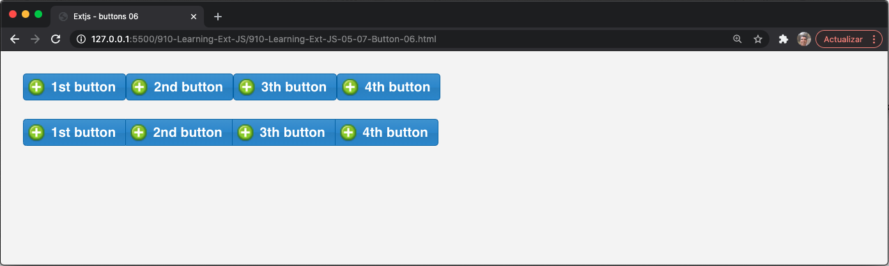

Además, podemos establecer el grupo de forma vertical estableciendo la propiedad **`vertical:true`**. Consulte la siguiente captura de pantalla para comprender esto:


#### 🔴 6️⃣ 💻 Mi versión `910-Learning-Ext-JS-05-08-Button-07.html`

```html
<!DOCTYPE html>
<html>
   <head>
      <title>Extjs - buttons 07</title>
      <meta charset="UTF-8">
      <meta name="viewport" content="width=device-width, initial-scale=1, maximum-scale=1, user-scalable=no"> 
      <link href = "https://cdnjs.cloudflare.com/ajax/libs/extjs/6.0.0/classic/theme-neptune/resources/theme-neptune-all.css" rel = "stylesheet" />
      <script type = "text/javascript" src = "https://cdnjs.cloudflare.com/ajax/libs/extjs/6.0.0/ext-all.js"></script>
      <style type="text/css">
        .addicon-16{
            background:transparent url('images/add_16x16.png') center 0 no-repeat !important; 
        }
      </style>
      <script type = "text/javascript">

        Ext.Loader.setConfig({
            enabled: true
        });

        Ext.require([
            'Ext.button.*',
            'Ext.window.*'
        ]);

        Ext.onReady(function(){
                
            var myButtona = Ext.create('Ext.button.Button',{
                text:'1st button',
                iconCls:'addicon-16',
                iconAlign:'left',
                renderTo:'normalbuttons'
            });
            
            myButtona.on('click',function(){
                Ext.Msg.alert("Haga clic en el evento", "¡Ha hecho clic en el botón del icono izquierdo ...!");
            });
            
            var myButtonb = Ext.create('Ext.button.Button',{
                text:'2nd button',
                iconCls:'addicon-16',
                renderTo:'normalbuttons'
            });
            
            var myButtonc = Ext.create('Ext.button.Button',{
                text:'3th button',
                iconCls:'addicon-16',
                renderTo:'normalbuttons'
            });	
                
            var myButtond = Ext.create('Ext.button.Button',{
                text:'4th button',
                iconCls:'addicon-16',
                renderTo:'normalbuttons'
            });	
            
            var mySegmentedbuttons = Ext.create('Ext.button.Segmented',{
                renderTo:'segmentedbuttons',
                vertical:true, 
                items:[{
                        xtype: 'button', text:'1st button', iconCls:'addicon-16'							
                    },{
                        text:'2nd button', iconCls:'addicon-16'						
                    },{
                        text:'3th button', iconCls:'addicon-16'						
                    },{
                        text:'4th button', iconCls:'addicon-16'						
                    }
                ]			
            });
            
        });
      </script>
   </head>
   <body style="padding:20px;">

        <div id="normalbuttons"></div>
        <div>&nbsp;</div>
        <div id="segmentedbuttons"></div>

    </body>
</html>
```

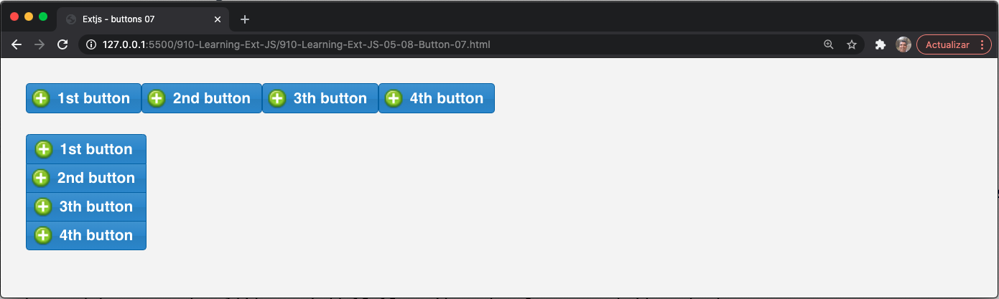

De forma predeterminada, la clase **`Ext.button.Segmented`** trata cada **item** como un botón. En el código de ejemplo, establecemos la propiedad **`xtype`** en el primer botón. Los otros tres botones no tienen esa propiedad y aún así, Ext JS trató cada elemento como un objeto de configuración de botón.

Los botones segmentados, como puede ver, tienen principalmente un propósito de estética visual y dan una mejor apariencia. Según Sencha, esto es:

*"Una presentación muy común para selección múltiple en dispositivos móviles"*.

## Agregar Menús

Hay ocasiones en las que necesitamos crear un menú (o menús) para permitir al usuario elegir entre las opciones disponibles. Podemos lograr esto configurando la propiedad **`menu`** de los botones. Esto creará un menú flotante para el botón seleccionado, y se mostrará cuando el usuario haga clic en el botón.

Creemos un botón que contenga un menú con opciones. Para el siguiente ejemplo, necesitamos crear una página HTML, importar la library Ext JS y escuchar el evento DOM **`ready`**. Dentro del callback, debemos modificar el código que crea nuestro botón, como se muestra aquí:

```js
var myButton = Ext.create('Ext.button.Button',{
   text:'Add payment method...',
   iconCls:'addicon-32',
   iconAlign:'left',
   scale:'large',
   renderTo:'normalbuttons',
   menu:[
      {text:'Master Card'},
      {text:'Visa'},
      {text:'PayPal'},
      {text:'Other...'}
   ]
});
```

Como podemos ver en el código anterior, la propiedad **`menu`** recibe un array de objetos. Este array se utilizará para crear una instancia de la clase **`Ext.menu.Menu`**. Esta clase es responsable de administrar y mostrar el menú flotante.

También es importante decir que cada objeto dentro del array usa el item **`menu`** como xtype predeterminado. Como resultado, deberíamos ver algo como lo que se muestra en la siguiente captura de pantalla cuando abrimos nuestro archivo HTML en nuestro navegador:


#### 🔴 6️⃣ 💻 Mi versión `910-Learning-Ext-JS-05-09-Menu-01.html`

```html
<!DOCTYPE html>
<html>
   <head>
      <title>Extjs - menu 01</title>
      <meta charset="UTF-8">
      <meta name="viewport" content="width=device-width, initial-scale=1, maximum-scale=1, user-scalable=no"> 
      <link href = "https://cdnjs.cloudflare.com/ajax/libs/extjs/6.0.0/classic/theme-neptune/resources/theme-neptune-all.css" rel = "stylesheet" />
      <script type = "text/javascript" src = "https://cdnjs.cloudflare.com/ajax/libs/extjs/6.0.0/ext-all.js"></script>
      <style type="text/css">
        .addicon-16{
		    background:transparent url('images/add_16x16.png') center 0 no-repeat !important; 
        }
        .addicon-24{
            background:transparent url('images/add_24x24.png') center 0 no-repeat !important;
        }
        .addicon-32{
            background:transparent url('images/add_32x32.png') center 0 no-repeat !important;
        }
      </style>
      <script type = "text/javascript">

        Ext.Loader.setConfig({
            enabled: true
        });

        Ext.require([
            'Ext.button.*',
            'Ext.window.*'
        ]);

        Ext.onReady(function(){
                
            var myButton = Ext.create('Ext.button.Button',{
                text:'Añadir método de pago...',
                iconCls:'addicon-32',
                iconAlign:'left',
                scale:'large',
                renderTo:'normalbuttons',
                menu:[
                    {text:'Master Card' },		
                    {text:'Visa' },					
                    {text:'PayPal' },		
                    {text:'Other...' }					
                ]
            });
            
        });

      </script>
   </head>
   <body style="padding:20px;">

	    <div id="normalbuttons"></div>
        <div>&nbsp;</div>
        <div id="segmentedbuttons"></div>

    </body>
</html>
```

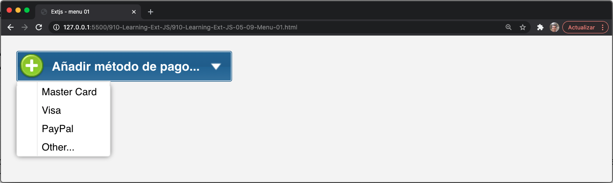

En el código anterior, usamos objetos literales para crear nuestro menú. Si queremos usar constructores en lugar de literales, debemos crear una instancia de las clases **`Ext.menu.Menu`** y **`Ext.menu.Item`**, de la siguiente manera:

```js
//Step 1
var menuItemA = Ext.create('Ext.menu.Item',{text:'Master card'});
//Step 2
var menu = Ext.create('Ext.menu.Menu',{
   items : [  //Step 3
      menuItemA,   // Variable
      Ext.create('Ext.menu.Item',{text:'Visa'}), // constructor
      {text:'Paypal'} //object config
   ]
});
var myButton = Ext.create('Ext.button.Button',{
   text:'Add payment method...',
   iconCls:'addicon-32',
   iconAlign:'left',
   scale:'large',
   renderTo:'normalbuttons',
   menu:menu
});
```

En el **`Step 1`**, creamos una instancia de la clase **`Ext.menu.Item`**. En el **`Step 2`**, creamos una instancia de la clase **`Ext.menu.Menu`** y su propiedad **`items`** en el **`Step 3`** contiene un array mixta. El primer elemento es la variable **`menuItemA`**, el segundo es un constructor para la clase **`Ext.menu.Item`** y el tercero es un objeto de configuración que se convertirá en una clase **`Ext.menu.Item`**:

```js
items : [ //Step 3
   menuItemA,  // Variable
   Ext.create( 'Ext.menu.Item' ,{
      text:'American Express'
   }), // constructor
   {text:'Other'} //object config
]
```

Una vez que hemos creado nuestro menú, agregamos nuestra instancia a la propiedad **`menu`** del botón. Cuando se crea el botón, detecta que la propiedad **`menu`**  no es un array y es una instancia de la clase **`Menu`**.

Como resultado, tenemos dos botones con un menú que contiene las mismas opciones, como se muestra en esta captura de pantalla:


#### 🔴 6️⃣ 💻 Mi versión `910-Learning-Ext-JS-05-10-Menu-02.html`

```html
<!DOCTYPE html>
<html>
   <head>
      <title>Extjs - menu 02</title>
      <meta charset="UTF-8">
      <meta name="viewport" content="width=device-width, initial-scale=1, maximum-scale=1, user-scalable=no"> 
      <link href = "https://cdnjs.cloudflare.com/ajax/libs/extjs/6.0.0/classic/theme-neptune/resources/theme-neptune-all.css" rel = "stylesheet" />
      <script type = "text/javascript" src = "https://cdnjs.cloudflare.com/ajax/libs/extjs/6.0.0/ext-all.js"></script>
      <style type="text/css">
        .addicon-16{
		    background:transparent url('images/add_16x16.png') center 0 no-repeat !important; 
        }
        .addicon-24{
            background:transparent url('images/add_24x24.png') center 0 no-repeat !important;
        }
        .addicon-32{
            background:transparent url('images/add_32x32.png') center 0 no-repeat !important;
        }
      </style>
      <script type = "text/javascript">

        Ext.Loader.setConfig({
            enabled: true
        });

        Ext.require([
            'Ext.button.*',
            'Ext.window.*'
        ]);

        Ext.onReady(function(){
                        
            //Step 1
            var menuItemA = Ext.create('Ext.menu.Item',{text:'Master card'});
            //Step 2
            var menu = Ext.create('Ext.menu.Menu',{
            items : [	//Step 3
                menuItemA,	 // Variable
                Ext.create('Ext.menu.Item',{text:'American Express'}),  // constructor
                {text:'Other...'} //object config 
            ]
            });
            
                
            var myButton = Ext.create('Ext.button.Button',{
                text:'Añadir método de pago...',
                iconCls:'addicon-32',
                iconAlign:'left',
                scale:'large',
                renderTo:'normalbuttons',
                menu:menu
            });
            
        });

      </script>
   </head>
   <body style="padding:20px;">

      <div id="normalbuttons"></div>
      <div>&nbsp;</div>
      <div id="segmentedbuttons"></div>

    </body>
</html>
```

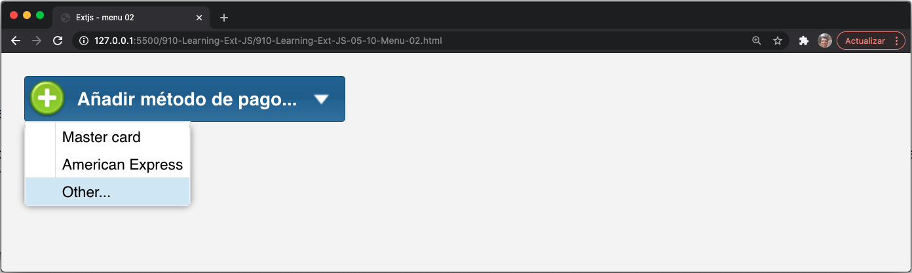

Agregar un menú es realmente fácil. Ahora, si queremos agregar alguna funcionalidad a estas opciones, necesitamos establecer un listener para cada elemento del menú. Si revisamos la documentación, veremos que la clase **`Ext.menu.Item`** contiene un evento **`click`**. Este es el evento que necesitamos escuchar, para realizar algunas acciones cuando se dispara. Sin embargo, hay muchas formas en las que podemos adjuntar controladores de eventos a un componente o widget. Para demostrar esto, agreguemos un poco más de código, como se muestra en el siguiente ejemplo:

```js
var myButton = Ext.create('Ext.button.Button',{
   text:'Add payment method...',
   iconCls:'addicon-32',
   iconAlign:'left',
   scale:'large',
   renderTo:'normalbuttons',
   menu:[{
      text:'Master Card',
      listeners:{  // Option 1
         click:function(){
            Ext.Msg.alert("Click event", "You selected Master Card..!");
         }
      }
   },{
      text:'Visa', //Option 2
      handler: onMenuItemClick
   },{
      text:'PayPal',
      listeners:{ //Option 3
         'click':{fn: onMenuItemClick , single:true}
      }
   },{
      text:'Other...',
      handler: onMenuItemClick
   }]
});
function onMenuItemClick (itemBtn, Event){
   var optionString = itemBtn.text;
   Ext.Msg.alert("Click event","You selected " + optionString + " ..!");
}
```

Ahora, echemos un vistazo a las opciones en el código:

1. En la **`Option 1`**, agregamos una propiedad **`listeners`** al objeto de configuración que generará una alerta cuando se haga clic en él.
2. En la **`Option 2`**, usamos una propiedad llamada **`handler`**. Esta propiedad vinculará el evento de clic al nombre de la función **`onMenuItemClick`** que se establece en la propiedad. Además, la función recibirá dos parámetros (**`item`** y **`event`**).
3. En la **`Option 3`**, usamos nuevamente la propiedad **`listeners`**, pero para el evento click. Pasamos un objeto de configuración con dos propiedades: **`fn`** y **`single`**. La propiedad **`fn`** especificará la función a ejecutar, y **`single`** especificará que la ejecución solo se realizará una vez. Después de la primera ejecución, Ext JS eliminará el controlador de eventos(event handler).

> **NOTA**
> 
> Es importante leer cómo agregar detectores de eventos en componentes o widgets, y probar las diferentes formas de lograrlo. No todo el tiempo necesitaremos utilizar las mismas formas; depende de la funcionalidad que necesite. Conocer las variaciones de add listeners puede evitar que tengamos que escribir mucho código adicional para aplicaciones.
 
Es posible que haya notado que el segundo y el último elemento del menú tienen la propiedad **`handler: onMenuItemClick`**, por lo que ambos apuntan a la misma función. Esta función reconocerá qué botón se presionó/en el que se hizo clic accediendo a ellos con el parámetro **`itemBtn`** pasado a esa función. En este caso, necesitamos acceso solo a la propiedad **`text`**:

```js
var optionString = itemBtn.text;
```

Actualice el navegador, pruebe cada opción y vea cómo funcionan los listeners en cada botón.

Es importante decir que podemos agregar tantos niveles de submenús como necesitemos usando la propiedad **`menu`**. Sin embargo, desde mi experiencia personal, no recomendaré poner en cascada sus menús con demasiada profundidad porque la experiencia del usuario se verá afectada.


#### 🔴 6️⃣ 💻 Mi versión `910-Learning-Ext-JS-05-10-Menu-02.html`

```html
<!DOCTYPE html>
<html>
   <head>
      <title>Extjs - menu 03</title>
      <meta charset="UTF-8">
      <meta name="viewport" content="width=device-width, initial-scale=1, maximum-scale=1, user-scalable=no"> 
      <link href = "https://cdnjs.cloudflare.com/ajax/libs/extjs/6.0.0/classic/theme-neptune/resources/theme-neptune-all.css" rel = "stylesheet" />
      <script type = "text/javascript" src = "https://cdnjs.cloudflare.com/ajax/libs/extjs/6.0.0/ext-all.js"></script>
      <style type="text/css">
        .addicon-16{
            background:transparent url('images/add_16x16.png') center 0 no-repeat !important; 
        }
        .addicon-24{
            background:transparent url('images/add_24x24.png') center 0 no-repeat !important;
        }
        .addicon-32{
            background:transparent url('images/add_32x32.png') center 0 no-repeat !important;
        }
      </style>
      <script type = "text/javascript">

        Ext.Loader.setConfig({
            enabled: true
        });

        Ext.require([
            'Ext.button.*',
            'Ext.window.*'
        ]);

        Ext.onReady(function(){
                
            var myButton = Ext.create('Ext.button.Button',{
                text:'Añadir método de pago...',
                iconCls:'addicon-32',
                iconAlign:'left',
                scale:'large',
                renderTo:'normalbuttons',
                menu:[{
                        text:'Master Card',
                        listeners:{  // Option 1
                            click:function(){
                                Ext.Msg.alert("Haga clic en el evento", "¡Seleccionó Master Card ...!");	
                            }
                        }			
                    },{
                        text:'Visa', //Option 2
                        handler:onMenuItemClick
                    },{
                        text:'PayPal', 
                        listeners:{ //Option 3
                            'click':{fn:onMenuItemClick}
                        }
                    },{
                        text:'Other...', 
                        handler:onMenuItemClick
                    }					
                ]
            });
            function onMenuItemClick(itemBtn, Event){
                var optionString = itemBtn.text;
                Ext.Msg.alert("Haga clic en el evento", "Usted seleccionó" + optionString +  " ..!");	
            }
            
        });


      </script>
   </head>
   <body style="padding:20px;">

	    <div id="normalbuttons"></div>
        <div>&nbsp;</div>
        <div id="segmentedbuttons"></div>

    </body>
</html>
```

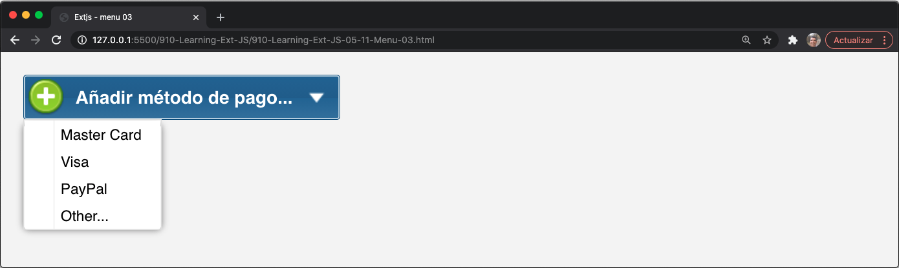
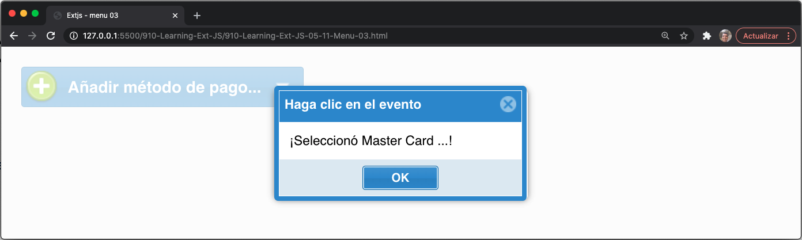


## Toolbars

Una vez que conocemos los conceptos básicos sobre botones y menús, podemos pasar al siguiente componente, que es el toolbar. Como es muy común en las aplicaciones que tienen toolbar para acceder a los módulos de nuestra aplicación, ventanas, etc., el componente de la barra de herramientas actúa como un contenedor donde podemos organizar nuestros botones de la manera que necesitamos.

Desde la versión Ext JS 4, ha sido posible definir una toolbar en cualquiera de los cuatro lados de nuestros contenedores (north, south, east y west). También podemos agregar más toolbars a cada lado (más de una). Es importante mencionar que una toolbar se usa generalmente en contenedores como un panel, ventana o grid, o en subclases de contenedores en los que se puede colocar.

Comencemos a crear un ejemplo básico de un toolbar en la parte superior de un panel. Entonces, creemos un archivo HTML, establezcamos la referencia a la library Ext JS y escribamos el siguiente código en la callback **`ready`** para DOM:

```js
var myPanel = Ext.create( 'Ext.panel.Panel' ,{
   title: 'My first toolbar...',
   width: 450,
   height: 200,
   dockedItems: [{ //Step 1
      xtype : 'toolbar',
      dock: 'top', //Step 2
      items: [
         {text: 'New record'},
         {text: 'Edit record'},
         {text: 'Remove record'}
      ]
   }],
   renderTo:Ext.getBody()
});
```

Ahora, repasemos los pasos de este código:

1. En el **`Step 1`**, definimos la propiedad **`dockedItems`**. Aquí podemos definir una matriz de componentes. Cualquier componente puede colocarse o acoplarse en cualquiera de los cuatro lados (**`left`**, **`top`**, **`right`** o **`bottom`**).
2. En el **`Step 2`**, definimos dónde se acoplará la toolbar. En este caso, la propiedad **`dock`** es igual a **`top`**. Si la propiedad **`dock`** falta o no está definida, de forma predeterminada, Ext JS la establecerá en la parte **`top`**.

Por lo general, las toolbar se definen como elementos acoplados, pero podemos definir otros componentes, como grids, paneles y formularios, entre otros. Una cosa más para resaltar del código anterior es que, por defecto, los componentes en el array **`items`** de la toolbar son botones. Es por eso que no establecimos explícitamente un xtype.


#### 🔴 6️⃣ 💻 Mi versión `910-Learning-Ext-JS-05-12-Toolbar-01.html`

```html
<!DOCTYPE html>
<html>
   <head>
      <title>Extjs - Toolbar 01</title>
      <meta charset="UTF-8">
      <meta name="viewport" content="width=device-width, initial-scale=1, maximum-scale=1, user-scalable=no"> 
      <link href = "https://cdnjs.cloudflare.com/ajax/libs/extjs/6.0.0/classic/theme-neptune/resources/theme-neptune-all.css" rel = "stylesheet" />
      <script type = "text/javascript" src = "https://cdnjs.cloudflare.com/ajax/libs/extjs/6.0.0/ext-all.js"></script>
      <style type="text/css">
        .addicon-16{
            background:transparent url('images/add_16x16.png') center 0 no-repeat !important; 
        }
        .addicon-24{
            background:transparent url('images/add_24x24.png') center 0 no-repeat !important;
        }
        .addicon-32{
            background:transparent url('images/add_32x32.png') center 0 no-repeat !important;
        }
      </style>
      <script type = "text/javascript">

        // JavaScript Document
        Ext.Loader.setConfig({
            enabled: true
        });

        Ext.require([
            'Ext.button.*',
            'Ext.toolbar.*',
            'Ext.menu.*',
            'Ext.window.*'	
        ]);

        Ext.onReady(function(){
                    
            var myPanel = Ext.create('Ext.panel.Panel',{
                title:'Mi primera barra de herramientas ...', 
                width:450,
                height:200, 
                dockedItems:[{ //Step 1
                    xtype : 'toolbar',				
                    dock: 'top', //Step 2
                    items:[
                        { text:'Nuevo record' },	
                        { text:'Editar record' },				
                        { text:'Eliminar record' }	
                    ]
                }],
                renderTo:Ext.getBody()		
            });		
            
        });

      </script>
   </head>
   <body style="padding:20px;">
   </body>
</html>
```

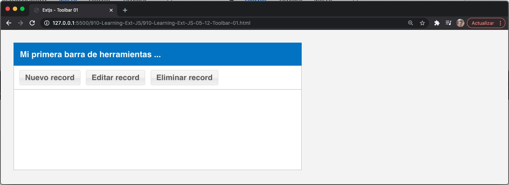

También podemos agregar cualquier otro componente a la toolbar, como **`textfield`**, **`combo box`** y **`radiobutton`**.

Agreguemos algunos botones más con íconos, como se muestra en el siguiente código:

```js
items:[
   {text:'New', iconCls:'addicon-16'},
   {text:'Edit', iconCls:'editicon-16'},
   {text:'Remove', iconCls:'deleteicon-16'},
   {text:'Export', iconCls:'export-16'},
   {text:'Print', iconCls:'print-16'},
   {text:'Help', iconCls:'help-16'}
]
```

Una vez que hemos realizado los cambios, necesitamos crear las clases CSS (reglas) que establecerán la imagen como fondo. Agreguemos las reglas a nuestro archivo HTML o archivo de estilo CSS:

```css
.addicon-16{ background:transparent url('../images/add_16x16.png') center 0 no-repeat !important; }
.deleteicon-16{ background:transparent url('../images/delete.png') center 0 no-repeat !important; }
.editicon-16{ background:transparent url('../images/pencil.png') center 0 no-repeat !important; }
.help-16{ background:transparent url('../images/help.png') center 0 no-repeat !important; }
.print-16{ background:transparent url('../images/printer.png') center 0 no-repeat !important; }
.export-16{ background:transparent url('../images/page_go.png') center 0 no-repeat !important; }
```

Recuerde que puede cambiar imágenes o agregar más imágenes y clases CSS (reglas). Ejecutemos el navegador. Puede ver algo similar a esto:


La captura de pantalla muestra los nuevos botones con un icono. De forma predeterminada, los iconos están alineados a la izquierda y los botones están alineados horizontalmente.

#### 🔴 6️⃣ 💻 Mi versión `910-Learning-Ext-JS-05-13-Toolbar-02.html`

```html
<!DOCTYPE html>
<html>
   <head>
      <title>Extjs - Toolbar 02</title>
      <meta charset="UTF-8">
      <meta name="viewport" content="width=device-width, initial-scale=1, maximum-scale=1, user-scalable=no"> 
      <link href = "https://cdnjs.cloudflare.com/ajax/libs/extjs/6.0.0/classic/theme-neptune/resources/theme-neptune-all.css" rel = "stylesheet" />
      <script type = "text/javascript" src = "https://cdnjs.cloudflare.com/ajax/libs/extjs/6.0.0/ext-all.js"></script>
      <link rel="stylesheet" type="text/css" href="styles/buttons.css">
      <script type = "text/javascript">

        // JavaScript Document
        Ext.Loader.setConfig({
            enabled: true
        });

        Ext.require([
            'Ext.button.*',
            'Ext.toolbar.*',
            'Ext.menu.*',
            'Ext.window.*'	
        ]);

        Ext.onReady(function(){
                    
            var myPanel = Ext.create('Ext.panel.Panel',{
                title:'Mi primera barra de herramientas ...', 
                width:600,
                height:200, 
                dockedItems:[{ //Step 1
                    xtype : 'toolbar',				
                    dock: 'top', //Step 2
                    items:[
                        { text:'Nuevo', iconCls:'addicon-16' },	
                        { text:'Editar', iconCls:'editicon-16'  },				
                        { text:'Eliminar', iconCls:'deleteicon-16' },
                        { text:'Exportar', iconCls:'export-16' },
                        { text:'Imprimir', iconCls:'print-16' },
                        { text:'Ayuda', iconCls:'help-16' }	
                    ]
                }],
                renderTo:Ext.getBody()		
            });
        });

      </script>
   </head>
   <body style="padding:20px;">
   </body>
</html>
```

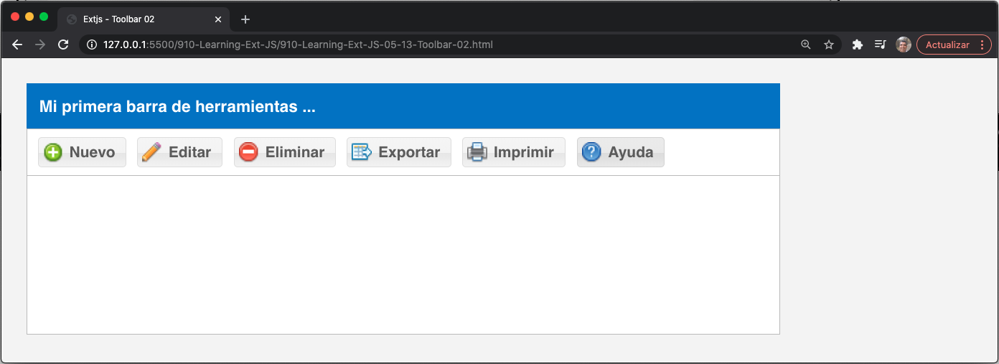

#### 🔴 6️⃣ 💻 Mi versión `910-Learning-Ext-JS-05-14-Toolbar-03.html`

```html
<!DOCTYPE html>
<html>
   <head>
      <title>Extjs - Toolbar 03</title>
      <meta charset="UTF-8">
      <meta name="viewport" content="width=device-width, initial-scale=1, maximum-scale=1, user-scalable=no"> 
      <link href = "https://cdnjs.cloudflare.com/ajax/libs/extjs/6.0.0/classic/theme-neptune/resources/theme-neptune-all.css" rel = "stylesheet" />
      <script type = "text/javascript" src = "https://cdnjs.cloudflare.com/ajax/libs/extjs/6.0.0/ext-all.js"></script>
      <link rel="stylesheet" type="text/css" href="styles/buttons.css">
      <script type = "text/javascript">

        // JavaScript Document
        Ext.Loader.setConfig({
            enabled: true
        });

        Ext.require([
            'Ext.button.*',
            'Ext.toolbar.*',
            'Ext.menu.*',
            'Ext.window.*'	
        ]);

        Ext.onReady(function(){
                    
        var myPanel = Ext.create('Ext.panel.Panel',{
            title:'My first toolbar...', 
            width:600,
            height:200, 
            dockedItems:[{ //Step 1
                xtype : 'toolbar',				
                dock: 'top', //Step 2
                items:[
                    { xtype:'buttongroup', 
                    title:'Actions',
                    items:[
                        { text:'New', iconCls:'addicon-16' },	
                        { text:'Edit', iconCls:'editicon-16'  },				
                        { text:'Remove', iconCls:'deleteicon-16' }
                    ]
                    },{ 
                    xtype:'buttongroup', 
                    title:'Print / Export & Help',
                    items:[			  
                        { text:'Export', iconCls:'export-16' },
                        { text:'Print', iconCls:'print-16' },
                        { text:'Help', iconCls:'help-16' }	
                    ]
                    }
                ]
            }],
            renderTo:Ext.getBody()		
        });		
            
            
        });

      </script>
   </head>
   <body style="padding:20px;">
   </body>
</html>
```

### Grupos de Botones de la Toolbars

Una característica interesante de Ext JS es que podemos agrupar los botones de la toolbar gracias a la clase **`Ext.container.ButtonGroup`** o mediante el uso de **`xtype:'buttongroup'`**. Esta clase es una subclase de **`Ext.panel.Panel`** que nos permite agrupar botones en una toolbar. Nuevamente, cambiemos el código anterior para organizar nuestros botones en la toolbar, como lo hace el siguiente código:

```js
var myPanel = Ext.create('Ext.panel.Panel',{
   title:'My first toolbar...',
   width:600,
   height:200,
   dockedItems:[{ //Step 1
      xtype : 'toolbar',
      dock: 'top', //Step 2
      items:[
         { xtype:'buttongroup',
            title:'Actions',
            items:[
               {text: 'New', iconCls: 'addicon-16'},
               {text: 'Edit', iconCls: 'editicon-16'},
               {text: 'Remove', iconCls: 'deleteicon-16'}
            ]
         },{
            xtype: 'buttongroup',
            title: 'Print / Export & Help',
            items:[
               {text: 'Export', iconCls: 'export-16'},
               {text: 'Print', iconCls: 'print-16'},
               {text: 'Help', iconCls: 'help-16'}
            ]
         }
      ]
   }],
   renderTo:Ext.getBody()
});
```

Agregamos dos grupos de botones a la toolbar y, en lugar de agregar los botones directamente a la toolbar, lo hicimos en cada grupo de botones en la propiedad items. Además, definimos un título para cada grupo de botones. Ahora, echemos un vistazo a la siguiente captura de pantalla, que muestra el resultado:


#### 🔴 6️⃣ 💻 Mi versión `910-Learning-Ext-JS-05-14-Toolbar-03.html`

```html
<!DOCTYPE html>
<html>
   <head>
      <title>Extjs - Toolbar 03</title>
      <meta charset="UTF-8">
      <meta name="viewport" content="width=device-width, initial-scale=1, maximum-scale=1, user-scalable=no"> 
      <link href = "https://cdnjs.cloudflare.com/ajax/libs/extjs/6.0.0/classic/theme-neptune/resources/theme-neptune-all.css" rel = "stylesheet" />
      <script type = "text/javascript" src = "https://cdnjs.cloudflare.com/ajax/libs/extjs/6.0.0/ext-all.js"></script>
      <link rel="stylesheet" type="text/css" href="styles/buttons.css">
      <script type = "text/javascript">

        // JavaScript Document
        Ext.Loader.setConfig({
            enabled: true
        });

        Ext.require([
            'Ext.button.*',
            'Ext.toolbar.*',
            'Ext.menu.*',
            'Ext.window.*'	
        ]);

        Ext.onReady(function(){
                    
            var myPanel = Ext.create('Ext.panel.Panel',{
                title:'Mi primera toolbar...', 
                width:600,
                height:200, 
                dockedItems:[{ //Step 1
                    xtype : 'toolbar',				
                    dock: 'top', //Step 2
                    items:[
                        { xtype:'buttongroup', 
                        title:'Acciones',
                        items:[
                            { text:'Nuevo', iconCls:'addicon-16' },	
                            { text:'Editar', iconCls:'editicon-16'  },				
                            { text:'Eliminar', iconCls:'deleteicon-16' }
                        ]
                        },{ 
                        xtype:'buttongroup', 
                        title:'Imprimir / Exportar & Ayuda',
                        items:[			  
                            { text:'Exportar', iconCls:'export-16' },
                            { text:'Imprimir', iconCls:'print-16' },
                            { text:'Ayuda', iconCls:'help-16' }	
                        ]
                        }
                    ]
                }],
                renderTo:Ext.getBody()		
            });		  
        });

      </script>
   </head>
   <body style="padding:20px;">
   </body>
</html>
```

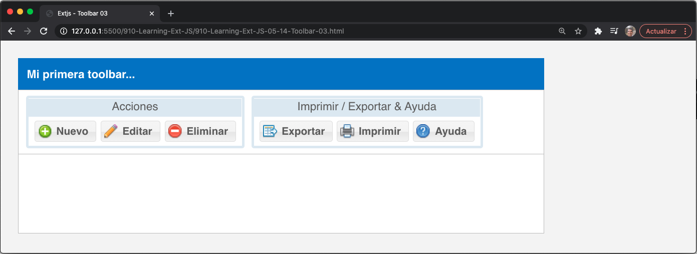

Por defecto, el **`buttongroup`** xtype creado ha colocado los botones horizontalmente (tres columnas para cada grupo). Podemos cambiar este aspecto usando la propiedad **`column`**:

```js
var myPanel = Ext.create('Ext.panel.Panel',{
   title:'My first toolbar...',
   width:600,
   height:200,
   dockedItems:[{ //Step 1
      xtype : 'toolbar',
      dock: 'top', //Step 2
      items:[{ 
         xtype:'buttongroup',
         title:'Actions',
         columns:2,
         items:[
            {text:'New', iconCls:'addicon-32', scale:'large', rowspan:2, iconAlign:'top' },
            {text:'Edit', iconCls:'editicon-16'},
            {text:'Remove', iconCls:'deleteicon-16'}
         ]
      },{
         xtype:'buttongroup', title:'Print / Export & Help',
         defaults:{scale:'large', iconAlign:'top'},
         items:[
            {text:'Export', iconCls:'export-32'},
            {text:'Print', iconCls:'print-32'}
         ]
      },{
         xtype:'buttongroup', title:'Help',
         items:[
            {text:'Help', iconCls:'help-32', scale:'large', iconAlign:'bottom' }
         ]
      }]
   }],
   renderTo:Ext.getBody()
});
```

En el código anterior, establecemos la propiedad **`columns`** en **`2`** en el primer grupo de botones. Esto significa que los botones de ese grupo se organizarán en dos columnas. Una cosa importante para observar de cerca es la propiedad **`rowspan`** del nuevo botón. Esta propiedad se establece en **`2`**, lo que significa que el nuevo botón utilizará dos filas. También modificamos el tamaño de algunos botones a **`large`** y actualizamos la propiedad **`iconCls`** para usar imágenes de tamaño 32 píxeles (width y height).

Con estos pocos cambios implementados, tendremos un mejor diseño y botones organizados, lo que le dará a la interfaz de usuario final una apariencia y sensación muy elegante, como se muestra en esta captura de pantalla:


#### 🔴 6️⃣ 💻 Mi versión `910-Learning-Ext-JS-05-15-Toolbar-04.html`

```html
<!DOCTYPE html>
<html>
   <head>
      <title>Extjs - Toolbar 04</title>
      <meta charset="UTF-8">
      <meta name="viewport" content="width=device-width, initial-scale=1, maximum-scale=1, user-scalable=no"> 
      <link href = "https://cdnjs.cloudflare.com/ajax/libs/extjs/6.0.0/classic/theme-neptune/resources/theme-neptune-all.css" rel = "stylesheet" />
      <script type = "text/javascript" src = "https://cdnjs.cloudflare.com/ajax/libs/extjs/6.0.0/ext-all.js"></script>
      <link rel="stylesheet" type="text/css" href="styles/buttons.css">
      <script type = "text/javascript">

        // JavaScript Document
        Ext.Loader.setConfig({
            enabled: true
        });

        Ext.require([
            'Ext.button.*',
            'Ext.toolbar.*',
            'Ext.menu.*',
            'Ext.window.*'	
        ]);

        Ext.onReady(function(){
                    
        var myPanel = Ext.create('Ext.panel.Panel',{
            title:'Mi primera toolbar...', 
            width:600,
            height:200, 
            dockedItems:[{ //Step 1
                xtype : 'toolbar',				
                dock: 'top', //Step 2
                items:[
                    { xtype:'buttongroup', 
                    title:'Acciones',
                    columns:2, 
                    items:[
                        { text:'Nuevo', iconCls:'addicon-32', scale:'large', rowspan:2, iconAlign:'top' },	
                        { text:'Editar', iconCls:'editicon-16'  },				
                        { text:'Eliminar', iconCls:'deleteicon-16' }
                    ]
                    },{ 
                    xtype:'buttongroup', title:'Imprimir / Exportar & Ayuda',
                    defaults:{ scale:'large', iconAlign:'top' },
                    items:[			  
                        { text:'Exportar', iconCls:'export-32' },
                        { text:'Imprimir', iconCls:'print-32' }				
                    ]			  
                    },{ 
                    xtype:'buttongroup', title:'Ayuda',
                    items:[			  
                        { text:'Ayuda', iconCls:'help-32', scale:'large', iconAlign:'bottom' }			
                    ]			  
                    }
                ]
            }],
            renderTo:Ext.getBody()		
        });		
            
            
        });

      </script>
   </head>
   <body style="padding:20px;">
   </body>
</html>
```

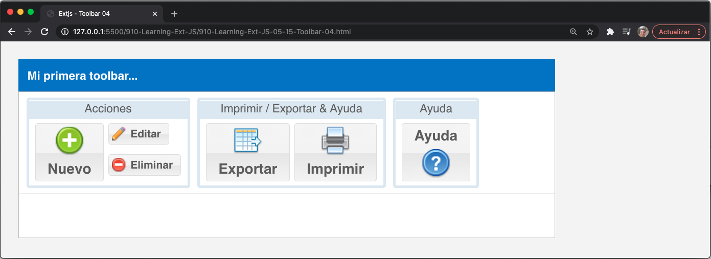

## La Breadcrumb Bar

Una nueva incorporación en Ext JS versión 5 es la breadcrumb bar. Esta barra muestra datos jerárquicos de un **`TreeStore`** como un rastro de botones de ruta de navegación. En el Capítulo 9, El *Tree Panel*, hablaremos sobre el tree store con más detalle y también veremos información más específica sobre **`TreeStore`**.

Comencemos creando un nuevo archivo HTML y nuestro código JS. En primer lugar, debemos definir nuestra tienda que contiene datos para la barra de ruta de navegación con el siguiente código:

```js
Ext.define('Myapp.sample.store.mainMenu', {
   extend: 'Ext.data.TreeStore',
   root: {
      text: 'My app',
      expanded: true,
      children: [{
         text: 'Modules',
         expanded: true,
         children: [
            {leaf: true, text: 'Employees'},
            {leaf: true, text: 'Customers'},
            {leaf: true, text: 'Products'}
         ]
      },{
         text: 'Market',
         expanded: true,
         children: [
            {leaf: true, text: 'Sales'},
            {leaf: true, text: 'Budgets'},
            {leaf: true, text: 'SEO'},
            {leaf: true, text: 'Statistics'}
         ]
      },{
         text: 'Support',
         iconCls:'help-16',
         children: [
            {leaf: true, text: 'Submit a ticket'},
            {leaf: true, text: 'Forum'},
            {leaf: true, text: 'Visit our web site'}
         ]
      },
      {leaf: true, text: 'Reports'},
      {leaf: true, text: 'Charts'}
      ]
   }
});
```

Repasemos lo que hicimos en el código anterior paso a paso:

* Nuestra nueva store/class, **`Myapp.sample.store.mainMenu`**, amplía la clase **`Ext.data.TreeStore`**.
* La propiedad root dentro del store es el nodo inicial/data model que el **`TreeStore`** contendrá, y sus child nodes / data models están dentro de la propiedad children, que es un array de nodos o data models.

Como puede observar, los datos dentro de la propiedad root (nodo) están estructurados en forma de árbol. Esto será interpretado por la breadcrumb bar para crear los botones, menús y submenús dentro de su cuerpo. Ahora, declaremos o creemos la breadcrumb bar de la siguiente manera:

```js
//step 1
var myMenuStore = Ext.create('Myapp.sample.store.mainMenu',{});
var myPanel = Ext.create('Ext.panel.Panel',{
   title:'My first breadcrumb bar...',
   width:600,
   height:200,
   dockedItems:[{ //Step 2
      xtype : 'breadcrumb',
      dock: 'top',
      store: myMenuStore,
      showIcons: true,
      selection: myMenuStore.getRoot().childNodes[2].childNodes[0]
   }],
   renderTo:Ext.getBody()
});
```

El primer paso es la creación de una instancia previamente definida **`'Myapp.sample.store.mainMenu'`**, luego procedemos a crear el contenedor myPanel.

Además, tal como declaramos la toolbar para el panel, ahora configuramos la breadcrumb bar estableciendo la propiedad **`xtype`** en **`breadcrumb`**. También observe que tenemos otras propiedades, como:

* La propiedad **`store: myMenuStore`** le indica a la breadcrumb dónde va a recuperar los datos para crear sus componentes adecuados (botones, menús, etc.).
* La propiedad **`showIcons:true`** controlará si se muestran o no iconos en los botones.
* La propiedad **`selection`** establecerá el node/data model seleccionado inicialmente. Podemos usar **`root`** para configurar el primer elemento en el store, o en este caso, configuramos **`myMenuStore.getRoot().childNodes[2].childNodes[0]`**, que es seleccionar el nodo **`Submit a ticket`**, o modelo de datos.

Ejecute el archivo en el navegador. Obtendremos algo similar a la siguiente captura de pantalla:


Como puede ver, en este momento, la ruta de navegación muestra tres botones: **My App**, **Support** y **Submit a ticket**. Los dos primeros botones que ve contienen un menú que muestra sus elementos secundarios (los children definidos en el store). Además, puede notar que el primer y último botón tienen iconos grises. Estos son, de hecho, iconos predeterminados asignados por Ext JS. El segundo botón tiene un icono de ayuda que se definió en el store:

```js
{
   text: 'Support', iconCls:'help-16',
   children: [
      {leaf: true, text: 'Submit a ticket'},
      {leaf: true, text: 'Forum'},
      {leaf: true, text: 'Visit our web site'}
   ]
}
```

Haga clic en el primer botón y verá desaparecer el segundo y el tercero, como se muestra en esta captura de pantalla:


### Manejo de Selecciones en la Breadcrumb Bar

Entonces, hemos creado la ruta de navegación, pero necesitamos una forma de controlarla cuando cambia la selección. La breadcrumb tiene el cambio de selección de eventos, que se activará cada vez que hagamos clic en un botón o en un elemento de menú creado dentro de la breadcrumb bar.

Cambiemos la propiedad **`dockedItems`** al siguiente código para controlar el cambio de selección:

```js
dockedItems:[{
   xtype : 'breadcrumb',
   dock: 'top',
   store: myMenuStore,
   showIcons: true,
   selection: myMenuStore.getRoot().childNodes[2].childNodes[0],
   listeners:{
      'selectionchange':{
         fn:function(mybreadcrumb, node, eOpts){
            var panel = mybreadcrumb.up('panel');
            panel.update( 'This is the zone for:<b>' +  node.data.text + '</b>' );
         },
         delay:200
       }
   }
}],
```

Agregamos la propiedad **`listeners`** y configuramos el handler para **`selectionchange`**. La función recibirá tres parámetros. El primero es la instancia de la breadcrumb bar definida en **`mybreadcrumb`**, el segundo parámetro es el nodo seleccionado (data model) definido en el **`nodo`**, y el tercer parámetro es el objeto de opciones pasado al **`Ext.util.Observable.addListener`** definido en **`eOpts`**.

Actualice el navegador y cambie las selecciones para ver la aplicación en acción, de la siguiente manera:


Ahora, cuando cambiemos la selección, el contenido del panel se actualizará con el texto **`'This is the zone for:<b>' + node.data.text + '</b>'`**, donde **`node.data.text`** es el valor que establecimos previamente en cada uno de los children de la raíz en el store.

Hasta ahora, como un nuevo componente en la versión 5, la breadcrumb es una buena adición cuando necesitamos menús, submenús enormes o muchas formas complejas de acceder a partes de nuestra aplicación. Usarlo en tabletas será un verdadero ahorro de espacio.

#### 🔴 6️⃣ 💻 Mi versión `910-Learning-Ext-JS-05-16-Breadcrumb-01.html`

```html
<!DOCTYPE html>
<html>
   <head>
      <title>Extjs - Breadcrumb 01</title>
      <meta charset="UTF-8">
      <meta name="viewport" content="width=device-width, initial-scale=1, maximum-scale=1, user-scalable=no"> 
      <link href = "https://cdnjs.cloudflare.com/ajax/libs/extjs/6.0.0/classic/theme-neptune/resources/theme-neptune-all.css" rel = "stylesheet" />
      <script type = "text/javascript" src = "https://cdnjs.cloudflare.com/ajax/libs/extjs/6.0.0/ext-all.js"></script>
      <link rel="stylesheet" type="text/css" href="styles/buttons.css">
      <script type = "text/javascript">

        // JavaScript Document
        Ext.Loader.setConfig({
            enabled: true
        });

        Ext.require([
            'Ext.window.*', //'Ext.MessageBox',
            'Ext.data.*', 
            'Ext.button.*',
            'Ext.toolbar.*',
            'Ext.menu.*'
        ]);

        Ext.define('Myapp.sample.store.mainMenu', {
            extend: 'Ext.data.TreeStore',
            root: {
                text: 'Mi app',
                expanded: true,
                children: [{
                        text: 'Módulos',
                        expanded: true,
                        children: [
                            { leaf:true, text: 'Empleados' }, 
                            { leaf:true, text: 'Clientes' },
                            { leaf:true, text: 'Productos'  }										
                        ]
                    },{
                        text: 'Mercado',
                        expanded: true,
                        children: [
                            { leaf:true, text: 'Ventas' },
                            { leaf:true, text: 'Presupuestos' },
                            { leaf:true, text: 'SEO' },
                            { leaf:true, text: 'Estadísticas' }					
                        ]
                    },{
                        text: 'Soporte', iconCls:'help-16', 
                        children: [
                            { leaf:true, text: 'Envía un ticket' },
                            { leaf:true, text: 'Foro' },
                            { leaf:true, text: 'Visite nuestro sitio web' }
                        ]
                    },
                    { leaf:true, text: 'Informes' },
                    { leaf:true, text: 'Gráficos' }
                ]
            }
        });

        Ext.onReady(function(){
                    
            var myMenuStore = Ext.create('Myapp.sample.store.mainMenu',{});				
            var myPanel = Ext.create('Ext.panel.Panel',{
                title:'Mi primer breadcrumb bar...', 
                width:600,
                height:200,
                dockedItems:[{ //Step 1
                    xtype : 'breadcrumb',
                    dock: 'top', //Step 2
                    store: myMenuStore, 
                    showIcons: true, 
                    selection: myMenuStore.getRoot().childNodes[2].childNodes[0], 
                    listeners:{
                        'selectionchange':{
                            fn:function(mybreadcrumb, node, eOpts){
                                var panel = mybreadcrumb.up('panel'); 
                                panel.update( 'Esta es la zona para: <b>' +  node.data.text + '</b>' );
                            },
                            delay:200
                        }				
                    }		
                }],
                renderTo:Ext.getBody()		
            });	            
        });

      </script>
   </head>
   <body style="padding:20px;">
   </body>
</html>
```

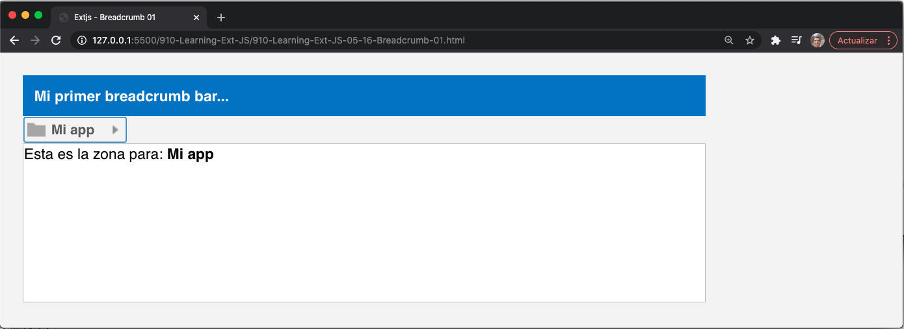


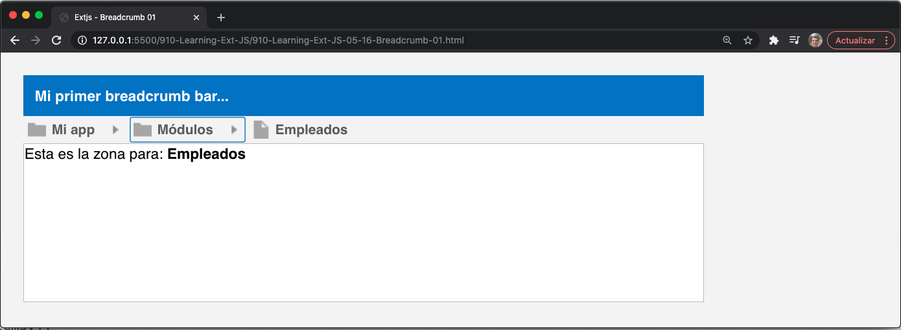
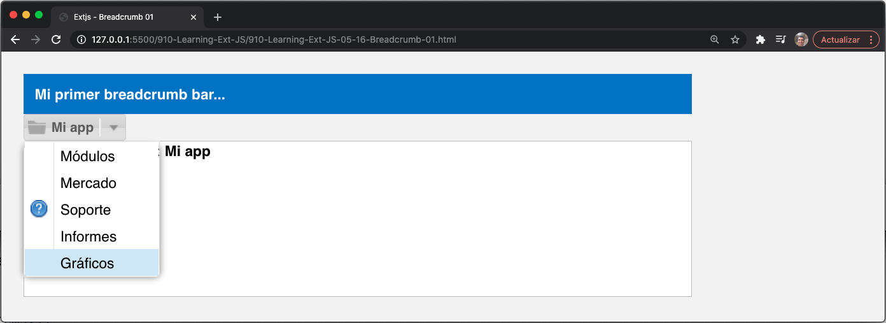
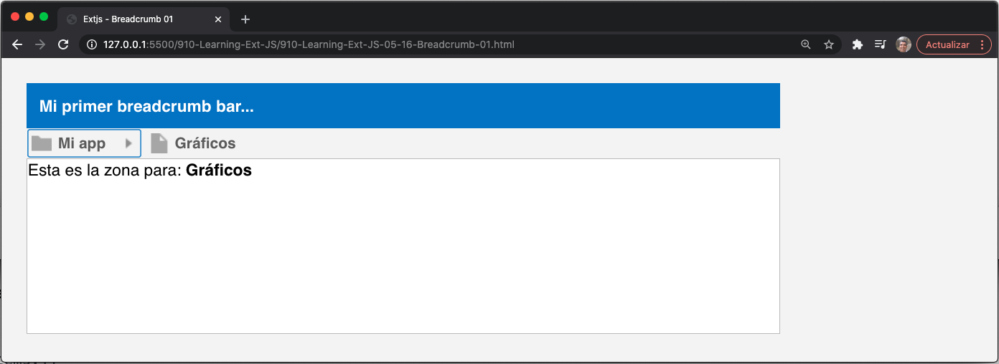

## El Menú Principal de Nuestra Aplicación

En este punto, vamos a realizar un ejercicio para crear el menú principal de nuestra aplicación final. Hasta el momento, no hemos trabajado mucho en la aplicación en sí, principalmente porque has estado aprendiendo los conceptos básicos sobre el framework Ext, pero a partir de ahora, podemos enfocarnos más en piezas pequeñas que serán reutilizadas para nuestra aplicación final.

La siguiente captura de pantalla muestra cómo debemos diseñar el menú principal para nuestra aplicación de gestión de facturas:


> **NOTA**
> 
> Sencha Architect es muy útil para crear prototipos rápidamente y también para screen examples/wire framing. La captura de pantalla anterior se creó en Sencha Architect versión 3.1.x utilizando el tema clásico para una mejor comprensión de cómo se colocarán los componentes.

Como podemos ver en la captura de pantalla, necesitamos crear una toolbar acoplada en la parte superior y otra toolbar acoplada en la parte inferior. La primera toolbar contendrá dos botones (cada uno con su propio menú) y un elemento de texto, **`Ext.toolbar.TextItem`**, para mostrar el nombre de usuario. La segunda toolbar, que estará acoplada en la parte inferior, tendrá un elemento de texto y un botón de ayuda en el lado derecho.

Además, para este ejercicio, necesitaremos un componente que ocupe todo el espacio disponible en el navegador (cuerpo del documento). Hasta ahora, hemos estado usando paneles como contenedores, pero esta vez usaremos una Viewport.

El componente **`Ext.container.Viewport`** ocupa todo el espacio disponible y siempre escucha el evento de cambio de tamaño del navegador de la ventana para volver a calcular las nuevas dimensiones cada vez que el usuario cambia el tamaño del navegador.

> **NOTA**
> 
> Es una buena práctica tener solo una Viewport por aplicación, ya que este será nuestro espacio de trabajo dentro de la página web (documento).

Comencemos por crear una clase que se extienda desde la clase **`Viewport`**. Como esto es solo un ejercicio, y luego reutilizaremos parte del código, no hay mucho de qué preocuparse por la ubicación de los archivos y otras cosas. Entonces, para crear la ventana gráfica, comencemos con este código:

```js
Ext.define('MyApp.view.Viewport',{
   extend: 'Ext.container.Viewport',
   layout: 'fit',
   initComponent: function(){
      var me = this;
      me.items = [{
         xtype: 'panel',
      }];
      me.callParent();
   }
});
```

La clase **`Viewport`** se extiende desde el componente contenedor, lo que significa que podemos usar cualquiera de los diseños disponibles. En este caso, vamos a utilizar un diseño de ajuste, porque queremos expandir los elementos secundarios de la ventana gráfica.

Como se mencionó anteriormente, si queremos acoplar un componente a cualquiera de los cuatro lados, necesitamos usar un panel. El siguiente código agrega un panel vacío a la ventana gráfica como un child:

```js
me.items = [{
   xtype: 'panel',
}];
```

Estamos usando el diseño(layout) **`fit`** para expandir el panel para que se ajuste a toda la Viewport. Ahora podemos configurar los items **`docked`** para este panel vacío y acoplar(dock) una toolbar en la parte superior:

```js
dockedItems: [{
   xtype: 'toolbar', docked:'top',
   items: [{
      text: 'Home', iconCls: 'home-16',
      menu:[
         {text: 'Categories', iconCls: 'categories-16'},
         {text: 'Products', iconCls: 'products-16'},
         {text: 'Clients', iconCls: 'clients-16' },
         {text: 'Invoices', iconCls: 'invoices-16'}
      ]
   },{
      text: 'Help', iconCls: 'help-16',
      menu: {
         xtype: 'menu',
         items: [
            {xtype: 'menuitem', text: 'Submit a support ticket'},
            {xtype: 'menuitem', text: 'Forum'},
            {xtype: 'menuitem', text: 'About...'}
         ]
      }
   },
   {xtype: 'tbfill'},
   {xtype: 'tbtext', text: 'User: Brett Fravre'}
   ]
}]
```

Como en los ejemplos de código anteriores (toolbar), ahora hemos agregado dos nuevos elementos a la toolbar, que son los siguientes:

* **`tbfill`** o **`Ext.toolbar.Fill`**: Este es un elemento que actuará como un marcador de posición, lo que obligará a que los siguientes elementos se representen de la manera justificada a la derecha dentro del contenedor de la toolbar
* **`tbText`** o **`Ext.toolbar.TextItem`**: Este es un elemento que muestra texto o HTML directamente en la toolbar

Antes de probar, necesitamos declarar la instancia de la clase **`Viewport`** que definimos:

```js
Ext.onReady(function(){
   Ext.create("MyApp.view.Viewport");
});
```

De hecho, Viewport no necesita la propiedad **`renderTo`**, porque automáticamente obtendrá el cuerpo del documento. Por el momento, necesitamos crear el archivo HTML y ejecutar el ejemplo. Obtendremos algo similar a la siguiente captura de pantalla:


Ahora, creemos la toolbar inferior con este código:

```js
dockedItems : [{
   xtype : 'toolbar', docked:'top',
   //your code here…
},
{
   xtype : 'toolbar', dock:'bottom',
   items : [
      {xtype: 'tbtext', text: '<b>Status :</b>Connected'},
      {xtype: 'tbfill' },
      {text:'', iconCls: 'help-16'}
   ]
}]
```

Como puede notar, agregamos otro elemento de la toolbar con la propiedad dock con un valor de bottom. Sus children son **`tbtext`**, **`tbfill`** y un objeto de configuración de botón que estará en el lado derecho de la toolbar. Actualice el navegador y verifique el resultado, de la siguiente manera:


Podrás notar lo siguiente:

* El elemento de texto tiene la propiedad de texto establecida en **`<b>Status :</b>Connected`**, que es un texto HTML.
* Cuando usamos el elemento **`tbfill`**, llena el espacio entre (empuja los siguientes componentes definidos a la derecha) el elemento anterior definido y el siguiente elemento definido después del elemento **`tbfill`**.

> **TIP**
> 
> También podemos usar una flecha (->) para crear una instancia del elemento de clase **`tbfill/Ext.toolbar.Fill`**.

Finalmente, debemos verificar cómo se ven los elementos del menú, como se muestra en la siguiente captura de pantalla:


También vea el menú debajo del botón Ayuda, como se muestra en esta captura de pantalla:


Recuerde que en estos ejemplos, estamos usando el tema Neptune, por lo que cambiar los temas en Ext JS puede variar los resultados visuales de los botones y barras de herramientas.

Además, es importante después de esta lección que pruebe cómo declarar controladores de eventos y cómo configurar elementos (como un objeto de configuración, un constructor y una matriz) de diferentes maneras. Esto le asegurará qué tipo de código necesita en algunos casos y le ahorrará tiempo de codificación en otros casos.

#### 🔴 6️⃣ 💻 Mi versión `910-Learning-Ext-JS-05-17-Main-Menu-01.html`

```html
<!DOCTYPE html>
<html>
   <head>
      <title>Extjs - Main menu excercise 01</title>
      <meta charset="UTF-8">
      <meta name="viewport" content="width=device-width, initial-scale=1, maximum-scale=1, user-scalable=no"> 
      <link href = "https://cdnjs.cloudflare.com/ajax/libs/extjs/6.0.0/classic/theme-neptune/resources/theme-neptune-all.css" rel = "stylesheet" />
      <script type = "text/javascript" src = "https://cdnjs.cloudflare.com/ajax/libs/extjs/6.0.0/ext-all.js"></script>
      <link rel="stylesheet" type="text/css" href="styles/buttons.css">
      <script type = "text/javascript">

        // JavaScript Document
        Ext.define('MyApp.view.Viewport',{
            extend:'Ext.container.Viewport',
            layout:'fit',
            initComponent   : function(){
                var me = this;
                me.items = [{
                    xtype : 'panel'	,
                        dockedItems : [
                        {
                            xtype : 'toolbar', dock:'top',
                            items : [{
                                text: 'Inicio', iconCls: 'home-16',
                                menu:[
                                    {text:'Categorías', iconCls:'categories-16'  },		
                                    {text:'Productos', iconCls:'products-16'	},					
                                    {text:'Clientes', iconCls:'clients-16' 	},		
                                    {text:'Facturas', iconCls:'invoices-16' }			
                                ]
                            },{
                            text: 'Ayuda', iconCls: 'help-16',
                            menu: {
                                    xtype: 'menu',
                                    items: [
                                        {xtype: 'menuitem', text: 'Envíe un ticket de soporte', iconCls:'help-16'},
                                        {xtype: 'menuitem', text: 'Foro', iconCls:'help-16'},
                                        {xtype: 'menuitem',text: 'Acerca de...', iconCls:'help-16'}
                                    ]
                                }
                            }, 
                            { xtype: 'tbfill' },
                            { xtype: 'tbtext', text: 'Usuario: Brett Fravre'}
                            ]
                        },{
                            xtype : 'toolbar', dock:'bottom',
                            items : [
                                { xtype: 'tbtext', text: '<b>Estado: </b>Conectado'},
                                { xtype: 'tbfill' },
                                { text:'', iconCls: 'help-16'}
                            ]
                        }
                            /**/			
                        ]	
                }];
                me.callParent();
            }
        });

        Ext.onReady(function(){
            Ext.create("MyApp.view.Viewport");
        });

      </script>
   </head>
   <body style="padding:0px;">
   </body>
</html>
```

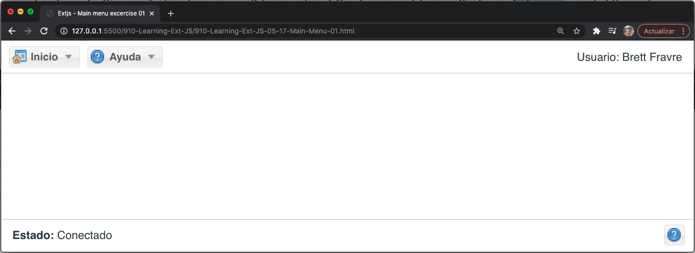
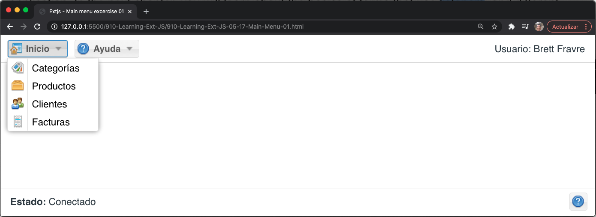
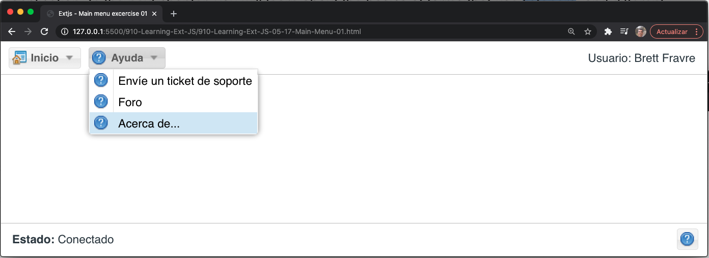

## Resumen 

En este capítulo, aprendió los conceptos básicos de cómo manejar eventos y cómo podemos agregar, disparar y escuchar eventos. También aprendió sobre botones, botones segmentados, menús, barras de herramientas y la nueva barra de ruta de navegación.

En este punto, podemos usar **`addListener`** o los métodos **`on`** para agregar algunas acciones cuando se hace clic en botones y opciones, pero en los siguientes capítulos, aprenderá cómo escuchar eventos de una manera más conveniente.

Además, creamos como ejercicio algunas toolbars y las usaremos en los próximos capítulos para nuestra aplicación final. En el próximo capítulo, aprenderá los conceptos básicos de los formularios que usan listeners y las diferentes formas de establecer elementos y propiedades dentro de los objetos de configuración.
