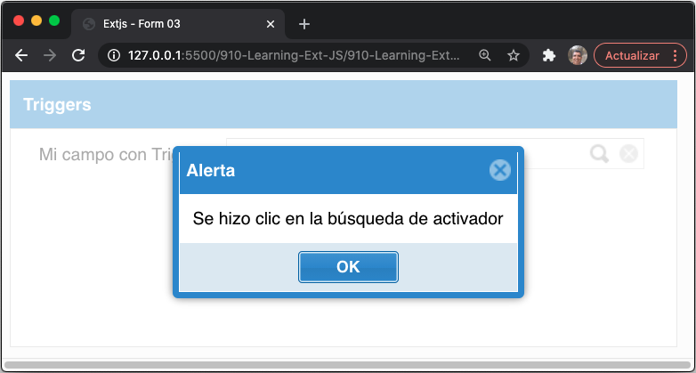
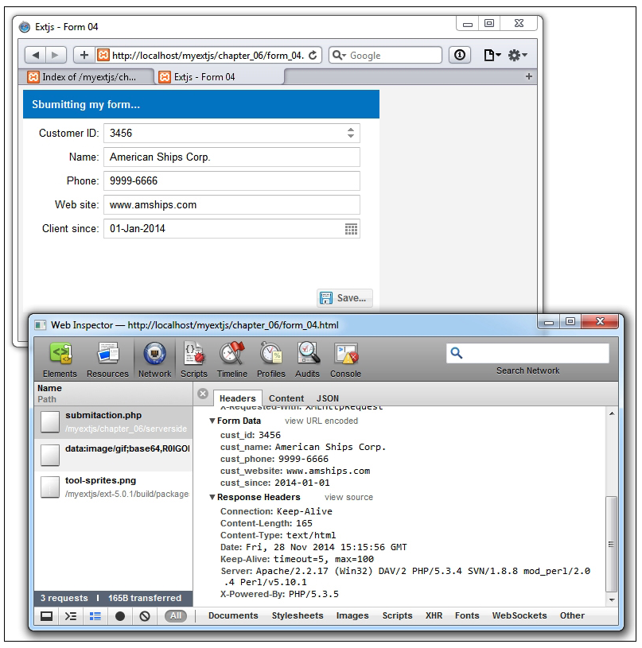

# 6. Haciéndolo con formularios

* El componente de formulario
   * La anatomía de los campos
* Los campos disponibles
   * La clase TextField
   * El campo number
   * El campo ComboBox
   * El campo Tag
   * El campo Date
   * Los campos Checkbox y CheckboxGroup
   * Los botones Radio y RadioGroup
* El contenedor de campos
* Triggers
* Envío de datos
* Resumen   


Ext JS viene con poderosos widgets para recopilar y editar datos. Tenemos el componente form y muchos tipos de widgets de entrada. Estos incluyen textfield, textarea, radio, checkbox, combobox, slider y muchos más tipos.

En este capítulo, aprenderá sobre los componentes que podemos utilizar para recopilar datos en nuestras aplicaciones. Además, trabajaremos en algunas partes para ser reutilizadas para nuestra aplicación final, así como también crearemos algunos formularios.

En este capítulo se tratarán los siguientes temas:

* El componente form
* Los tipos de campo disponibles
* El contenedor de campo
* Envío de datos

## El Componente form

Ext JS contiene un componente llamado **`Ext.form.Panel`**. Este componente es una subclase de **`Ext.panel.Panel`** y usa **`Ext.form.Basic`** como clase requerida. Esta clase es fundamental para manejar el envío del formulario.

A la hora de diseñar aplicaciones, es importante mencionar que un análisis previo puede ser claro para nosotros, por eso creamos bloques (código, formularios, componentes, etc.) que se pueden reutilizar en otros módulos. La siguiente captura de pantalla representa una parte de nuestra aplicación. Podemos ver que el componente de formulario deberá tener ciertas funcionalidades, como crear, editar, eliminar, etc.


Como puede ver, el prototipo de formulario en el lado derecho contiene un título, una toolbar en la parte superior, una toolbar en la parte inferior y luego seis campos. Ahora podemos comenzar a crear el formulario como un componente separado. Como en nuestros ejemplos de código anteriores, ampliamos nuestra nueva clase de la clase **`Ext.form.Panel`**:

```js
Ext.define('MyApp.view.CustomerForm01', {
   extend: 'Ext.form.Panel',
   alias: 'widget.customerform01',
   height: 280,
   width: 448,
   bodyPadding: 6,
   title: 'Customer ( .... )',
   items: [  ],
   dockedItems: [ ]
});
```

Este código hasta ahora no hace mucho. Estamos creando el código base para extenderlo más adelante en el panel de formulario. Como puede ver, este código establece algunos atributos predeterminados, como **`height`**, **`width`**, **`bodyPadding`** y **`title`**. Hasta ahora, los elementos y las propiedades acopladas están vacíos.

Tenga en cuenta las convenciones definidas en el Capítulo 2, *Conceptos básicos*, al crear clases. Entonces, necesitamos crear el archivo y colocar el código anterior en la ruta **`appcode/view/CustomerForm01.js`**.

Como en los ejemplos de código anteriores, creemos el archivo HTML y ejecútelo para probar nuestra configuración básica:

```html
<!doctype html>
<html>
<head>
  <meta http-equiv=”X-UA-Compatible” content=”IE=edge”>
  <meta charset=”utf-8”>
  <title>Extjs - Form 01 </title>
    <link rel=”stylesheet” type=”text/css” href=”../ext-5.1.1/build/packages/ext-theme-neptune/build/resources/ext-theme-neptune-all.css”>
    <script src=”../ext-5.1.1/build/ext-all.js”></script>
    <script src=”../ext-5.1.1/build/packages/ext-theme-neptune/build/ext-theme-neptune.js”></script>

<link rel=”stylesheet” type=”text/css” href=”../shared/styles/buttons.css”>
<script type =”text/javascript” src=”form_01.js”></script>
</head>
<body style=”padding:6px;”>
</body>
</html>
```

Ahora creemos el archivo **`form_01.js`** con el siguiente código:

```js
Ext.Loader.setConfig({
   enabled: true,
   paths:{Myapp:'appcode'}
});
Ext.require([
   'Ext.form.*',
   'Ext.toolbar.*',
   'Ext.button.*',
   'Myapp.view.CustomerForm01'
]);
Ext.onReady(function(){
   var mypanel = Ext.create('Myapp.view.CustomerForm01',{
      title:'My first customer form...',
      renderTo: Ext.getBody()
   });
   console.log ('Ok');
});
```

Ejecutemos y probemos el código básico. Obtendremos un resultado similar a este:


El form panel se crea sin ningún contenido ni elementos. Recuerde que podemos agregar cualquier componente y widget disponible, así que ahora agreguemos algunos campos. Cambiemos la propiedad **`items`** como se muestra en el siguiente código:

```js
items: [{
xtype: 'numberfield',
anchor: '60%',
   fieldLabel: 'Customer ID'
},{
xtype: 'textfield',
anchor: '-18',
fieldLabel: 'Name'
},{
xtype: 'textfield',
fieldLabel: 'Phone'
}]
```

La propiedad **`items`** ahora tiene tres campos: un campo numérico y dos campos de texto. Además, establecemos la propiedad **`anchor`** en dos campos, y el tercero no la tiene.

> **NOTA**
> 
> De forma predeterminada, **`Ext.form.Panel`** utiliza el anchor layout, que se explica en el Capítulo 3, *Componentes y diseños*.


Actualicemos nuestro navegador y veamos el siguiente resultado, de la siguiente manera:


Bien, ahora tenemos tres campos en nuestro formulario y puede notar que cada campo tiene un ancho diferente. Desde la versión 4 de Ext JS en adelante, podemos configurarlos individualmente para cada campo, como **`labelWidth`**, **`labelAlign`** y otras propiedades. Tenemos dos propiedades útiles dentro del panel de formulario, que son **`defaultType`** y **`defaults`**.

La propiedad **`defaultType`** nos permite establecer el xtype predeterminado para cada campo (donde la propiedad **`xtype`** no está definida), y la propiedad **`defaults`** nos permite definir muchas configuraciones que se aplicarán a todos los elementos child (si es posible aplicarlos). Hagamos el siguiente cambio en la clase de formulario:

```js
Ext.define('MyApp.view.CustomerForm01', {
   extend: 'Ext.form.Panel',
   alias: 'widget.customerform01',
   height: 280,
   width: 448,
   bodyPadding: 6,
  defaultType:'textfield',
  defaults:{
    anchor:'-18',
    labelWidth:90,
    labelAlign:'right'
  },
   title: 'Customer ( .... )',
   items: [{
    fieldLabel: 'Customer ID',
        },{
    fieldLabel: 'Name',
        },{
fieldLabel: 'Phone',
}],
  dockedItems: [ ]
});
```

Ahora los tres items/fields tendrán **`anchor`**, **`labelWidth`** y **`labelAlign`** con la misma frecuencia. Actualicemos el navegador y veamos el resultado, que debería ser así:


Convertimos los tres campos a **`textfield`**. Además, la alineación de la etiqueta se estableció a **`right`** y todas tienen el mismo ancho. Como puede ver, el uso de **`defaultType`** y **`defaults`** es muy conveniente, por lo que tendremos que codificar solo unas pocas líneas en nuestro archivo, y este código se aplicará a muchos fields/components.

Por lo tanto, de acuerdo con nuestro formulario **`Customers`**, creemos los otros campos y las toolbars. Cambiemos la propiedad **`items`** de la siguiente manera:

```js
items: [{
xtype: 'numberfield',fieldLabel: 'Customer ID',
},{
  fieldLabel: 'Name',
},{
fieldLabel: 'Phone',
},{
fieldLabel: 'Web site',
},{
xtype: 'datefield',fieldLabel: 'Client since',
},{
xtype: 'combobox',fieldLabel: 'Status',
}],
```

Ahora creemos las toolbars (como se muestra en el Capítulo 5, *Botones y Toolbars*):

```js
dockedItems: [{
   xtype: 'toolbar',
   dock: 'bottom',
   items: [{
      xtype: 'tbfill'
   },{
      xtype: 'button',
      iconCls: 'save-16',
      text: 'Save...'
   }]
},{
   xtype: 'toolbar',
   dock: 'top',
   items: [{
      xtype: 'button',
      iconCls: 'addicon-16',
      text: 'New'
   },{
      xtype: 'button',
      iconCls: 'editicon-16',
      text: 'Edit'
  },{
      xtype: 'tbfill'
  },{
      xtype: 'button',
      iconCls: 'deleteicon-16',
      text: '<b>Delete</b>'
  }]
}]
```

> **NOTA**
> 
> Observe que estamos reutilizando las mismas clases CSS que en el Capítulo 5, *Botones y Toolbars*. Sin embargo, también puede usar nuevas clases y otros íconos.

Hemos terminado nuestro primer formulario, pero todavía no está haciendo nada. Agregaremos la funcionalidad en breve. Por ahora, avancemos y revisemos las otras secciones para comprender más sobre los campos disponibles de Ext JS.

#### 🔴 6️⃣ 💻 Mi versión `910-Learning-Ext-JS-06-01-Form-01.html`

```html
<!DOCTYPE html>
<html>
   <head>
      <title>Extjs - Form 01</title>
      <meta charset="UTF-8">
      <meta name="viewport" content="width=device-width, initial-scale=1, maximum-scale=1, user-scalable=no"> 
      <link href = "https://cdnjs.cloudflare.com/ajax/libs/extjs/6.0.0/classic/theme-neptune/resources/theme-neptune-all.css" rel = "stylesheet" />
      <script type = "text/javascript" src = "https://cdnjs.cloudflare.com/ajax/libs/extjs/6.0.0/ext-all.js"></script>
      <link rel="stylesheet" type="text/css" href="styles/buttons.css">
      <script type = "text/javascript">

        // JavaScript Document
        Ext.Loader.setConfig({
            enabled: true,
            paths:{
                Myapp:'appcode'	
            }	
        });
        Ext.require([
            'Ext.form.*',
            'Ext.toolbar.*',
            'Ext.button.*',
            'Myapp.view.CustomerForm01'
        ]);
        Ext.onReady(function(){
            var mypanel = Ext.create('Myapp.view.CustomerForm01',{
                title:'Mi primer form personalizado...', 
                renderTo: Ext.getBody()		
            });
            console.log ('Ok');
        });

      </script>
   </head>
   <body style="padding:0px;">
   </body>
</html>
```

`styles/buttons.css`

```css
/* CSS Document */

.addicon-24{ background:transparent url('../images/add_24x24.png') center 0 no-repeat !important; }
.addicon-32{ background:transparent url('../images/add_32x32.png') center 0 no-repeat !important; }
.addicon-16{ background:transparent url('../images/add_16x16.png') center 0 no-repeat !important; }

.deleteicon-16{ background:transparent url('../images/delete.png') center 0 no-repeat !important; }
.editicon-16{ background:transparent url('../images/pencil.png') center 0 no-repeat !important; }

.help-16{ background:transparent url('../images/help.png') center 0 no-repeat !important; }
.help-32{ background:transparent url('../images/help_32x32.png') center 0 no-repeat !important; }

.print-16{ background:transparent url('../images/printer.png') center 0 no-repeat !important; }
.print-32{ background:transparent url('../images/printer_32x32.png') center 0 no-repeat !important; }

.export-16{ background:transparent url('../images/table_export.png') center 0 no-repeat !important; }
.export-32{ background:transparent url('../images/table_export_32x32.png') center 0 no-repeat !important; }

.home-16{ background:transparent url('../images/home_page.png') center 0 no-repeat !important; } 
.home-32{ background:transparent url('../images/home_page_32x32.png') center 0 no-repeat !important; } 

.categories-16{ background:transparent url('../images/three_tags.png') center 0 no-repeat !important; } 
.products-16{ background:transparent url('../images/package.png') center 0 no-repeat !important; } 
.clients-16{ background:transparent url('../images/group.png') center 0 no-repeat !important; } 
.invoices-16{ background:transparent url('../images/receipt_invoice.png') center 0 no-repeat !important; } 
```

`'Myapp.view.CustomerForm01'`

```js
/*
 * File: app/view/CustomerForm01.js
 */
Ext.define('Myapp.view.CustomerForm01', {
    extend: 'Ext.form.Panel',
    alias: 'widget.customerform01',
    requires: [
        'Ext.form.field.Number',
        'Ext.form.field.Date',
        'Ext.form.field.ComboBox',
        'Ext.toolbar.Toolbar',
        'Ext.toolbar.Fill',
        'Ext.button.Button'
    ],
    height: 280,
    width: 448,
    animCollapse: true,
    bodyPadding: 6,
    collapsible: false,
    header: true,
    title: 'Cliente ( .... )',
	defaultType:'textfield',
	defaults:{
		anchor:'-18',
		labelWidth:90, 
		labelAlign:'right'	
	}, 	
    items: [
        {
			xtype: 'numberfield',
			//anchor: '100%',
			// maxWidth: 200,
			//minWidth: 200,
			fieldLabel: 'Cliente ID',
			// labelAlign: 'right',
			// labelWidth: 80,
			// msgTarget: 'side',
			// hideTrigger: true
        },{
			//xtype: 'textfield',
			//anchor: '-18',
			fieldLabel: 'Nombre',
			//labelAlign: 'right',
			//labelWidth: 80,
			//msgTarget: 'side'
        },{
            //xtype: 'textfield',
            //anchor: '-18',
            fieldLabel: 'Teléfono',
            //labelAlign: 'right',
            //labelWidth: 80,
            // msgTarget: 'side'
        },{
            //xtype: 'textfield',
            //anchor: '-18',
            fieldLabel: 'Web site',
            //labelAlign: 'right',
            //labelWidth: 80,
            //msgTarget: 'side'
        },{
            xtype: 'datefield',
            //anchor: '60%',
            //width: '',
            fieldLabel: 'Cliente desde',
            //labelAlign: 'right',
            //labelWidth: 80,
            //msgTarget: 'side'
        },{
            xtype: 'combobox',
            //anchor: '-18',
            fieldLabel: 'Estado',
            //labelAlign: 'right',
            //labelWidth: 80,
            //msgTarget: 'side'
        }
    ],
    dockedItems: [{
            xtype: 'toolbar',
            dock: 'bottom',
            items: [{
                    xtype: 'tbfill'
                },{
                    xtype: 'button',
                    iconCls: 'save-16',
                    text: 'Save...'
                }
            ]
        },{
            xtype: 'toolbar', dock: 'top',
            items: [{
                    xtype: 'button',
                    iconCls: 'addicon-16',
                    text: 'Nuevo'
                },{
                    xtype: 'button',
                    iconCls: 'editicon-16',
                    text: 'Editar'
                },{
                    xtype: 'tbfill'
                },{
                    xtype: 'button',
                    iconCls: 'deleteicon-16',
                    text: '<b>Eliminar</b>'
                }
            ]
        }
    ]

});
```


### La Anatomía de los Campos

Ext JS proporciona muchos componentes para brindar al usuario una gran experiencia al usar sus aplicaciones. Los siguientes campos son componentes que podemos usar en un formulario o fuera de él.

Por ejemplo, podemos agregar un campo de texto o un cuadro combinado dentro de una toolbar en lugar de botones, de esta manera, podemos colocar campos dentro de la toolbar para que actúen como filtros u opciones de búsqueda.

Cada campo de entrada amplía la clase **`Ext.Component`**. Esto significa que cada campo tiene su propio ciclo de vida y eventos y también se puede colocar en cualquier contenedor.

También hay una clase llamada **`Ext.form.field.Base`** que define propiedades, métodos y eventos comunes en todos los campos de formulario. Esta clase base también se extiende desde las clases **`Ext.form.Labelable`** y **`Ext.form.field.Field`** (mediante el uso de mixins).

La clase **`Labelable`** le da al campo la capacidad de mostrar una etiqueta y errores en cada subclase, como textfields, comboboxes, etc.

La clase **`Field`** brinda a los campos la capacidad de administrar su valor, porque agrega algunos métodos importantes, como los métodos **`getValue`** y **`setValue`**, para establecer y recuperar el valor actual del campo. Esta clase también presenta un concepto importante, el **raw value**.

Un gran ejemplo del raw value es cuando extraemos datos de nuestro servidor y obtenemos un valor de fecha en formato de cadena. El raw value está en texto plano, pero el valor del campo de fecha debe estar en un objeto **`Date`** nativo para que podamos trabajar fácilmente con dates y times. Siempre podemos usar el raw value, pero se recomienda usarlo en su lugar. Es un objeto **`Date`** en este ejemplo.

## Los Campos Disponibles

Ext JS proporciona muchos widgets que podemos usar para recopilar y editar datos en nuestros formularios. Aprenderá sobre los widgets y las configuraciones más útiles que puede utilizar para crear hermosas formas. Algunos de los campos que vamos a ver son los siguientes:

* **`text`**
* **`number`**
* **`combobox`** y **`tag`**
* **`date`**
* **`checkbox`** y campos **`checkboxGroup`**
* **`radio`** y campos **`radioGroup`**

Los campos que vamos a cubrir son los básicos. Ext JS proporciona muchos más campos, que se pueden ver en los ejemplos de Ext JS, y también muchos de ellos se basan en subclases de estos. Para los siguientes ejemplos, vamos a crear una clase que se extiende desde la clase **`Form`** y contiene los campos que explicaremos en detalle más adelante:

```js
Ext.define('Myapp.view.AvailableFields01', {
   extend: 'Ext.form.Panel',
   alias: 'widget.availablefields01',
   requires: ['Ext.form.*'],
   height: 280,
   width:448,
   bodyPadding: 6,
   title: 'Available Fields',
   defaultType:'textfield',
   defaults:{
      anchor:'-18',
      labelWidth:100,
      labelAlign:'right'
   },
   initComponent: function() {
      var me = this;
      var myItems = me.createFields();
      Ext.applyIf(me,{items: myItems});
      me.callParent(arguments);
   },
   createFields: function (){
      var newItems=[];
      return newItems;
   }
});
```

En este ejemplo, configuramos la función **`initComponent`**. Aquí, podemos crear código para diferentes eventos: inicialización, validación de campo, etc. En este caso, estamos llamando a la función **`createFields`** para obtener los campos que necesitamos establecer en la propiedad Items.

Además, definimos la función **`createFields`**. Aquí es donde vamos a establecer los otros campos mientras avanzamos en este capítulo.

> **TIP**
> 
> Usar una función para definir el array de items es una excelente manera de escribir nuestro código para facilitar la lectura. Además, si desea extender esta clase, podemos override este método y agregar más componentes a su formulario en la subclase.

### La Clase TextField

Ya hemos usado la clase **`TextField`** para crear nuestro panel de formulario de **`Customer`**, y usamos la propiedad **`xtype`** para crearlo. Siempre podemos crear la instancia usando el método **`Ext.create`**, y la clase que deberíamos instanciar es **`Ext.form.field.Text`**.

Esta clase se extiende desde la clase **`Ext.form.field.base`** y está destinada a administrar texto como un valor de string. Define algunos eventos importantes, como **`keydown`**, **`keypress`** y **`keyup`**. Estos eventos son muy útiles para capturar las claves que el usuario ingresa en un componente de campo de texto.

Es importante tener en cuenta que si queremos usar estos eventos, debemos establecer la propiedad **`enableKeyEvents`** en **`true`**. Por lo tanto, cambiemos nuestra función **`createFields`** al siguiente código:

```js
createFields: function (){
   var newItems=[];
   // Step 1
   var myTextField = Ext.create('Ext.form.field.Text',{
      fieldLabel:'Name',
      name:'firstname',
      enableKeyEvents : true
   });
   // Step 2 (assign listener to the text field)
   myTextField.on({
      keyup:{
         fn:function( thisField, evt, eOpts ){
            if(evt.getCharCode() === evt.ENTER){
               if (thisField.getValue()!=''){
                  Ext.Msg.alert('Alert','Welcome: '+ thisField.getValue() );
               }
            }
         }
      }
   });
   newItems.push( myTextField );
   return newItems;
}
```

En el **`Step 1`**, creamos una nueva instancia de la clase **`Ext.form.field.Text`** y configuramos las propiedades **`fieldLabel`**, **`name`** y **`enableKeyEvents`**.

En el segundo paso, adjuntamos un event listener al campo. En este caso, el campo reaccionará al evento **`keyup`**. Entonces, cada vez que el usuario suelta una tecla en el teclado, se ejecutará la función callback. En el código, esperamos a que el usuario presione la tecla **Enter**, y cuando eso sucede, el código muestra un mensaje de alerta con el valor ingresado en el texto, si hay algún valor para el campo.

> **NOTA**
> 
> Ext JS proporciona un contenedor para el objeto de evento nativo. Este contenedor define muchas constantes, como la tecla Enter. Podemos ver todas las constantes disponibles en la documentación de Ext JS, en la clase **`Ext.event.Event`**.

Bien, ahora ejecutemos el código o actualice el navegador para ver cómo funciona el campo de texto. Puede ver algo como esto:


Como podemos ver en el ejemplo anterior, todos los campos se extienden desde la clase **`Observable`**. Por lo tanto, podemos agregar eventos y listeners a todos los campos de formulario. Deberíamos echar un vistazo a la documentación para ver todos los eventos disponibles que podemos utilizar para nuestro beneficio.

Otras propiedades comunes que se utilizan con frecuencia en el campo de texto son **`minLength`** y **`maxLength`**. Estas dos propiedades permiten restricciones de campo y poseen un rango de un número mínimo y un número máximo de caracteres de entrada que el campo puede aceptar. Cambiemos las propiedades del campo de texto para implementar estas características:

```js
var myTextField = Ext.create('Ext.form.field.Text',{
   fieldLabel:'Name',
   name:'firstname',
   enableKeyEvents : true,
   minLength : 4,
   minLengthText: 'Name is too short, at least {0} chars..!',
   maxLength : 25,
   maxLengthText: 'Name is too long, max length is {0} chars..!'
});
```

La propiedad **`minLength`** se establece en **`4`**, por lo que Ext JS handle/ensure que se cumpla la longitud mínima; de lo contrario, el campo se marcará como no válido y con un error. Vea la siguiente captura de pantalla para comprender esto:


Como puede observar, este campo está marcado como inválido (con un error), gracias al borde rojo. Ahora coloquemos el mouse sobre el campo y aparecerá una información sobre herramientas.

De forma predeterminada, los campos en Ext JS tienen una propiedad llamada **`msgTarget`**. Esta propiedad establecerá cómo se debe mostrar el mensaje de error en el campo. Los valores más comunes para esta propiedad son **`qtip`**, **`under`** y **`side`**. Además, Ext JS nos permite personalizar el mensaje de error con la ayuda de las propiedades **`minLengthText`** y **`maxLengthText`**. Considere la siguiente línea de código:

```js
minLengthText: 'Name is too short, at least {0} chars..!',
```

En la línea de código anterior, la parte **`{0}`** será como una variable/placeholder que será reemplazada automáticamente por Ext JS, usando el valor **`minLength`** si no se cumple la longitud mínima.

> **NOTA**
> 
> Puede definir la propiedad **`msgTarget`** en todos los componentes de campo que maneja Ext JS, y también puede asignar mensajes personalizados para errores según sus necesidades.

Es importante mencionar que debemos echar un vistazo a la documentación para ver todas las opciones de configuración, propiedades y eventos disponibles que podemos usar a nuestro favor, y usarlos de acuerdo a nuestras necesidades.

### El campo `number`

Cuando se trata de números, Ext JS tiene un campo numérico que solo acepta números como valores. De esta forma, podemos asegurarnos de que el usuario no podrá introducir ningún carácter inválido. También podemos personalizar el rango de valores a aceptar (valores mínimo y máximo), decimales y mucho más. Este campo viene con indicadores spinners/triggers integrados que nos permiten aumentar o disminuir el valor en él.

Agreguemos el siguiente código a nuestra función **`createFields`**:

```js
createFields: function (){
   var newItems=[];
   ...
   newItems.push( myTextField );
   var myAgeField = Ext.create('Ext.form.field.Number',{
      fieldLabel:'Age',
      name:'age',
      minValue: 18,
      maxValue: 70,
      allowDecimals : false
   });
   var myIncomeField = Ext.create('Ext.form.field.Number',{
      fieldLabel:'Income',
      name:'income',
      minValue: 0,
      allowDecimals : true,
      decimalPrecision : 2,
      negativeText : 'The income cannot be negative..!',
      msgTarget:'side'
   });
   newItems.push( myAgeField );
   newItems.push( myIncomeField );
   return newItems;
}
```

Agregamos dos campos, uno para la edad y otro para los ingresos. El campo **age** tiene un rango de valor de validación de 18 a 70; otros valores invalidarán este campo. El campo **income**, por otro lado, permite decimales (**`allowDecimals: true, decimalPrecision: 2,`**), pero no permite valores negativos. De lo contrario, obtendremos el mensaje de error **The income cannot be negative..!**. Ahora actualice el navegador y pruebe los nuevos campos; debería ver algo como la siguiente captura de pantalla:


Consulte el campo **Income**; establecemos la propiedad **`msgTarget`** en **`side`**. Esto crea un ícono de alerta al lado del campo (en el lado derecho), y cuando colocamos la flecha del mouse sobre el ícono, aparece la información sobre tooltip que muestra el mensaje de error establecido en la propiedad **`negativeText`**. También observe que el campo de edad está marcado como no válido porque el valor es **5**.

Observe que en el lado derecho del campo, está el spinner/trigger (flecha hacia arriba y flecha hacia abajo). Esto nos permite aumentar el valor de acuerdo con la propiedad **`step`**. De forma predeterminada, está establecido en **`1`**, pero podemos cambiarlo. Hagamos un pequeño cambio en el campo de los ingresos; agregamos la propiedad step y establecemos su valor en 500. Actualice el navegador y verifique el incremento al presionar el botón hacia arriba desde el spinner, como se muestra aquí:


Finalmente, necesitamos hacer un cambio en el campo de edad. Este campo no requiere que el spinner esté allí, por lo que está bien que ocultemos el spinner del campo numérico con la propiedad **`hideTrigger`**:

```js
var myAgeField = Ext.create('Ext.form.field.Number',{
   fieldLabel:'Age',
   name:'age',
   minValue: 18,
   maxValue: 70,
   allowDecimals: false,
   hideTrigger:true
});
```

De esta forma no se mostrarán los spinners y tendremos algo parecido a un campo de texto, con la posibilidad de aceptar solo números.

> **NOTA**
> 
> Si establece más triggers(disparadores) en este campo, la propiedad **`hideTrigger`** también los considerará ocultos (hablaremos de triggers más adelante).

Hay muchas más configuraciones para este campo, como la posibilidad de cambiar el separador decimal para que solo se permitan números sin decimales, y muchas más opciones que podemos utilizar a nuestro favor.

> **TIP**
> 
> Incluso si aceptamos números (un  text field o un campo numérico), es importante establecer validaciones en el lado del servidor y nunca confiar en el lado del cliente. No utilizar la validación del lado del servidor puede estar sujeto a inyecciones de código.

### El Campo ComboBox

El campo ComboBox es uno de los widgets más utilizados en Ext JS. Este tipo de campo nos permite mostrar una lista de opciones (seleccionar entrada). Es un componente muy flexible que podemos personalizar según nuestras necesidades.

Además, estos tipos de campos se basan en el paquete de datos (store (almacén)), que aprendió anteriormente en este libro (Capítulo 4, *Se trata de los datos*). Vamos a usar la clase **`Store`** con datos locales para llenar nuestro combobox. Así que creemos el código para nuestro cuadro combinado en nuestra función **`createFields`**:

```js
//Combobox Step 1 (store)
var occupationStore = Ext.create('Ext.data.Store',{
   fields: ['id', 'name'],
   data  : [
      {id: 1 ,name: 'CEO' },
      {id: 2 ,name: 'Vicepresident' },
      {id: 3 ,name: 'Marketing manager' },
      {id: 4 ,name: 'Development manager' },
      {id: 5 ,name: 'Sales manager' }
   ]
});
//Combobox Step 2 (create field)
var myFirstCombo  = Ext.create('Ext.form.ComboBox', {
   fieldLabel: 'Occupation',
   name:'employeeoccupation',
   store: occupationStore,
   queryMode: 'local',
   displayField: 'name',
   valueField: 'id'
});
newItems.push( myFirstCombo);
```

El **`Step 1`** es la definición del store con datos estáticos (local) que utilizará el combobox. También tenga en cuenta que esta store no está usando un modelo existente (como se ve en el Capítulo 4, *Se trata de los datos*); Ext JS crea internamente el modelo, gracias a la propiedad del campo que configuramos en el store.

En el **`Step 2`**, creamos **`Ext.form.ComboBox`**, definiendo el nombre de la propiedad **`fieldLabel`** como los campos anteriores. Pero hay algunas configuraciones nuevas establecidas para que el combobox funcione correctamente.

Primero, configuramos la propiedad **`store`**. El combobox lo usará para mostrar los datos (opciones). La propiedad **`queryMode`** establecida en **`local`** indica al combobox no cargar datos del store de forma remota (cuando se muestra la lista de opciones). Finalmente, establecemos cómo se mostrará el campo del combobox y manejará la opción seleccionada con las propiedades **`displayField`** y **`valueField`**.

Guardemos los cambios y actualice nuestro navegador para ver el siguiente resultado:


Estamos viendo el combobox que creamos. Ahora establezca el foco en el combobox combinado y escriba **de**. Puede ver que el cuadro combinado reducirá automáticamente la lista, como se muestra en esta captura de pantalla:


Internamente, el combobox intentará filtrar los datos de su store de acuerdo con lo que el usuario esté escribiendo para reducir el rango de selección y realizar un proceso de selección rápido (para una mejor experiencia del usuario).

Ahora, dado que estamos usando un store para almacenar los datos mostrados, podemos usar un proxy AJAX para obtener el contenido del store desde nuestro servidor. Intente cambiar el código en el store de esta manera:

```js
var occupationStore = Ext.create('Ext.data.Store',{
   fields  : ['id','name'],
   autoLoad:true,
   proxy:{
      type:'ajax' ,
      url :'serverside/occupations.json',
      reader:{
         type:'json',
         root:'records'
      }
   }
});
```

Ahora necesitamos crear el archivo **`ocupaciones.json`**. Créelo y guárdelo dentro de la carpeta **`/serverside`** y coloque el siguiente código en él:

```js
{
   “success”:true,
   “id”:”id”,
   “records”:[
      {“id”: 1 ,”name”: 'CEO' },
      {“id”: 2 ,”name”: 'Vicepresident' },
      {“id”: 3 ,”name”: 'Marketing manager' },
      {“id”: 4 ,”name”: 'Development manager' },
      {“id”: 5 ,”name”: 'Sales manager' }
   ]
}
```

Como puede ver, solo cambiamos el proxy del store. También definimos un proxy AJAX y un lector JSON. Ahora, si actualizamos nuestro navegador, podemos ver que los datos se cargan de forma remota.

Esta es una de las mayores ventajas de Ext JS. Podemos cambiar las cosas muy fácilmente porque Ext está construido con clases pequeñas que se pueden cambiar en cualquier momento. Es muy común que tengamos que hacer algo cuando se selecciona una opción de la lista; por ejemplo, cargar otro cuadro combinado u ocultar o mostrar algunos otros campos. Podemos escuchar el evento **`select`** y realizar las acciones necesarias:

```js
myFirstCombo.on('select',function(combo,records){
   Ext.Msg.alert('Alert',records[0].get('name'));
});
```

El código anterior escucha el evento **`select`** y solo muestra un mensaje de alerta con el nombre del registro seleccionado. Aquí podemos hacer lo que necesitemos, como cargar los datos de otro combobox en función de la selección del primero. El callback recibe el array de registros seleccionados; es un array porque también podemos configurar nuestro combobox para permitir que el usuario seleccione más de una opción.

Podemos usar cualquiera de los eventos disponibles para realizar algunas acciones, pero uno de los eventos más importantes para este widget es el evento select.

### El campo Tag

En la versión 5, se introdujo el campo de etiqueta. Es una subclase del combobox. Su creación es similar, pero nos permite realizar múltiples selecciones. Agreguemos este código a nuestra función **`createFields`**:

```js
var zonesStore = Ext.create('Ext.data.Store',{
   fields  : ['id','name'],
   data  : [
      {id: 1 ,name: 'Zone A' },
      {id: 2 ,name: 'Zone B' },
      {id: 3 ,name: 'Zone C' },
      {id: 4 ,name: 'Zone D' },
      {id: 5 ,name: 'Zone E' }
   ]
});
var myFirstTag  =Ext.create('Ext.form.field.Tag', {
   fieldLabel: 'Select zone',
   store: zonesStore,
   displayField: 'name',
   valueField: 'id',
   filterPickList: true,
   queryMode: 'local'
});
newItems.push( myFirstTag );
```

Como puede ver, el proceso es similar al del combobox. En este caso, tenemos una nueva propiedad llamada **`filterPickList`**. Esta propiedad se asegurará de que las opciones seleccionadas no se vuelvan a mostrar al expandir la lista de opciones.

Al actualizar el navegador, vemos el siguiente resultado:


Puede borrar un elemento seleccionado haciendo clic en el signo **X** en el lado derecho de cada opción seleccionada. Además, puede ver que las opciones seleccionadas no se repiten en la lista. Una de las desventajas de este campo es que dependiendo del número de selecciones que haya realizado, el tamaño (height) del campo crecerá.

### El Campo Date

Ext JS proporciona una forma sencilla de recopilar fechas; tenemos a nuestra disposición un date picker(selector de fechas) que manejará la selección de una fecha usando un calendario elegante, o permitiendo al usuario escribir la fecha en el formato que definamos. El uso más básico es establecer solo el nombre y la etiqueta del campo, como se muestra en este código:

```js
var datefield = Ext.create('Ext.form.field.Date',{
   fieldLabel: 'Birthday',
   name: 'birthday'
});
```

Esto nos dará el siguiente resultado:


Definimos nuestro campo de fecha de una manera muy simple, pero hay muchas más configuraciones que podemos usar. Excavemos un poco más para personalizar estos campos para cumplir con nuestros requisitos.

Por defecto, el formato utilizado para mostrar la fecha es **`m/d/Y (05/22/2012)`**. Este es un formato común que se usa en los EE.UU., Pero no en otros países. Para definir un formato personalizado para una región o país diferente, necesitamos usar la propiedad **`format`**, de la siguiente manera:

```js
var datefield = Ext.create('Ext.form.field.Date',{
   fieldLabel: 'Birthday',
   name: 'birthday',
   format: 'd/m/Y',
   submitFormat: 'Y-m-d'
});
newItems.push( datefield );
```

Podemos usar cualquier formato para mostrar la fecha, y también establecer el formato en el que queremos que esté el campo cuando enviamos el formulario o lo recuperamos y cuando obtenemos los valores. Definir la propiedad **`submitFormat`** es muy importante porque es este formato el que usaremos bajo el hood(capó); en este ejemplo, usamos un formato común en las bases de datos.

> **NOTA**
> 
> El formato **`m/d/Y`** se refiere al formato **`mm/dd/yyyy`** comúnmente utilizado. Esto puede resultar confuso, pero deberíamos echar un vistazo a la documentación del objeto **`Ext.Date`**  para ver todos los formatos compatibles que podemos usar.

En este momento, el usuario puede escribir en el campo para ingresar la fecha en el formato correcto. Sin embargo, el uso de slashes puede ralentizar la escritura del usuario. Podemos permitir formatos alternativos para facilitarles las cosas; por ejemplo, podemos definir **`d-m-Y`** como un formato válido y tantos otros formatos como sean necesarios:

```js
var datefield = Ext.create('Ext.form.field.Date',{
   fieldLabel: 'Birthday',
   name: 'birthday',
   format:'d/m/Y',
   submitFormat:'Y-m-d',
   altFormats: 'd-m-Y|d m Y|d.m.Y'
});
```

Usando la propiedad **`altFormats`**, podemos definir todos los formatos que queramos. Solo necesitamos separar cada formato con un carácter de barra vertical (`|`), y esos formatos se usarán para analizar el texto en un objeto **`date`**. No debemos usar la tubería dentro de ninguno de los formatos porque no hay forma de escapar de este carácter. Un formato como **`m|d|Y`** no funcionará.

Tenemos muchas más propiedades disponibles, como **`minValue`** y **`maxValue`**, y la capacidad de deshabilitar algunas fechas específicas, como fines de semana y feriados:

```js
var datefield = Ext.create('Ext.form.field.Date',{
fieldLabel: 'Deliver Date',
   name: 'deliverdate',
   format:'d/m/Y',
   submitFormat:'Y-m-d',
   altFormats: 'd-m-Y|d m Y|d.m.Y',
   disabledDates: ['31/12/2014','01/01/2015']
});
```

Si queremos deshabilitar un rango de días, podemos usar expresiones regulares para hacer coincidir las fechas que queremos deshabilitar. Algunos ejemplos son los siguientes:

```js
//disable everyday in march 2012
disabledDates: ['../03/2012']

//disable everyday in march for every year
disabledDates: ['../03/..']
//disable the 05 and 21 of march for every year
disabledDates: ['05/03','21/03']
```

También podemos usar el evento **`select`** que se dispara cuando el usuario selecciona una fecha. Podemos hacer lo que necesitemos dentro de la función de devolución de llamada, tal como lo hicimos en el cuadro combinado.

### Los campos Checkbox y CheckboxGroup

Tenemos la opción de usar una única checkbox (casilla de verificación) para establecer un solo registro como activo o inactivo. O tal vez, podemos tener un grupo de opciones que necesitamos mostrar y permitir que el usuario seleccione algunas de ellas. Agreguemos una sola checkbox a nuestro formulario:

```js
var mysinglecheckbox = Ext.create('Ext.form.field.Checkbox',{
   fieldLabel:' ',
   labelSeparator:' ',
   boxLabel: 'employee has hobbies ? ',
   name: 'hobbies'
});
newItems.push( mysinglecheckbox );
```

Aquí, hemos creado nuestra checkbox. Estamos usando la propiedad **`boxLabel`** para establecer la etiqueta de nuestra checkbox. Es importante saber que estamos configurando las propiedades **`fieldLabel`** y **`labelSeparator`** como espacio vacío. Por lo tanto, la casilla de verificación se alineará correctamente. Si configuramos **`fieldLabel`** como una cadena vacía, entonces Ext JS asumirá que no se ha creado ninguna etiqueta de campo, y esto puede causar algo como lo que se muestra en la siguiente captura de pantalla:


Ahora tenemos nuestra checkbox en su lugar. Tener una sola checkbox es genial, pero hay ocasiones en las que necesitamos definir algunas opciones más. Podemos utilizar un grupo de checkboxes para organizar los componentes de forma horizontal, vertical o en columnas:

```js
//Step 1
var groupCheckboxes = Ext.create('Ext.form.CheckboxGroup',{
   fieldLabel: 'Hobbies',
   columns: 2,
   items: [
      {name: 'hobby',boxLabel: 'Videogames',inputValue: 'vg'},
      {name: 'hobby',boxLabel: 'Sports',inputValue: 'sp'},
      {name: 'hobby',boxLabel: 'Card games',inputValue: 'cg'},
      {name: 'hobby', boxLabel:'Movies',inputValue: 'mv'},
      {name: 'hobby', boxLabel:'Collecting toys',inputValue: 'ct'},
      {name: 'hobby', boxLabel:'Music',inputValue: 'ms'},
      {name: 'hobby', boxLabel:'Others...',inputValue: 'ot'}
   ]
});
newItems.push( groupCheckboxes );//Step 2
```

En el primer paso, creamos una instancia de la clase **`CheckboxGroup`**. Definimos la etiqueta del grupo y le dimos a cada elemento una checkbox, con su etiqueta y valor. Organizamos los elementos en dos columnas. En el último paso, agregamos el grupo al array de retorno para que aparezca en nuestro formulario, así:


### Los Botones Radio y RadioGroup

Los botones de opción son útiles cuando queremos obligar al usuario a seleccionar solo un elemento de un pequeño grupo de opciones. Si queremos presentar más opciones, un combobox es un widget más fácil de codificar y usar.

Un radio button es muy similar a una checkbox. De hecho, el radio button se extiende desde la clase **`Checkbox`**. Esto significa que los botones de opción también tienen las mismas propiedades y métodos que la checkbox. Ahora procedamos a agregar dos campos de radio a nuestro formulario:

```js
var radioYes = Ext.create('Ext.form.field.Radio',{
   name: 'option',
   fieldLabel: 'Employee has a car?',
   labelSeparator : '',
   boxLabel: 'Yes',
   inputValue  : true
});
var radioNo = Ext.create('Ext.form.field.Radio',{
   name: 'option',
   hideLabel:true,
   boxLabel: 'No',
   inputValue: false
});
newItems.push( radioYes, radioNo  );
```

Estamos creando dos instancias de la clase **`Radio`** exactamente de la misma manera que creamos la clase **`Checkbox`**. Durante la creación de la clase **`Checkbox`**, agregamos dos radio buttons al array de retorno. La siguiente captura de pantalla muestra el aspecto de los dos radio buttons que se crearon:


Es importante asignar el mismo nombre a los botones de opción para que solo se pueda seleccionar una opción entre las opciones disponibles.

Como podemos ver en la captura de pantalla anterior, los radios están dispuestas una encima de la otra porque fueron declaradas como instancias separadas. Pero, ¿y si queremos alinearlos horizontalmente? Podemos usar un componente **`radiogroup`**, que es la práctica más común para los botones de radio, y establecer el número de columnas en dos. De esta forma, tendremos nuestros dos botones de radio en la misma línea:

```js
var radioGroup  = {
   xtype: 'radiogroup',
   fieldLabel: 'Employee level',
   columns: 2,
   vertical:true,
   items: [
      { boxLabel: 'Beginner', name: 'rb', inputValue: '1' },
      { boxLabel: 'Intermediate', name: 'rb', inputValue: '2'},
      { boxLabel: 'Advanced', name: 'rb', inputValue: '3',
      checked: true
   },
   { boxLabel: 'Ninja', name: 'rb', inputValue: '4' }
]};
newItems.push( radioGroup );
```

Esto es muy similar a lo que hicimos con el checkbox group. Podemos definir tantos botones de radio como necesitemos, y todos ellos estarán organizados en dos columnas, como se muestra en la siguiente captura de pantalla:


Tenga en cuenta que en la radio con **`boxLabel:'Advanced'`**, establecemos una propiedad llamada **`checked`**. Esto nos permitirá configurar inicialmente el selected radio button.

#### 🔴 6️⃣ 💻 Mi versión `910-Learning-Ext-JS-06-02-Form-02.html`

```html
<!DOCTYPE html>
<html>
   <head>
      <title>Extjs - Form 02</title>
      <meta charset="UTF-8">
      <meta name="viewport" content="width=device-width, initial-scale=1, maximum-scale=1, user-scalable=no"> 
      <link href = "https://cdnjs.cloudflare.com/ajax/libs/extjs/6.0.0/classic/theme-neptune/resources/theme-neptune-all.css" rel = "stylesheet" />
      <script type = "text/javascript" src = "https://cdnjs.cloudflare.com/ajax/libs/extjs/6.0.0/ext-all.js"></script>
      <link rel="stylesheet" type="text/css" href="styles/buttons.css">
      <script type = "text/javascript">

        // JavaScript Document
        Ext.Loader.setConfig({
            enabled: true,
            paths:{
                Myapp:'appcode'	
            }	
        });
        Ext.require([
            'Ext.form.*',
            'Ext.toolbar.*',
            'Ext.button.*',
            'Myapp.view.AvailableFields01'
        ]);
        Ext.onReady(function(){
            var mypanel = Ext.create('Myapp.view.AvailableFields01',{
                renderTo: Ext.getBody()		
            });
        });

      </script>
   </head>
   <body style="padding:6px;">
   </body>
</html>
```

`'Myapp.view.AvailableFields01'`

```js
/*
 * File: app/view/AvailableFields01.js
 */
Ext.define('Myapp.view.AvailableFields01', {
   extend: 'Ext.form.Panel',
   alias: 'widget.availablefields01',
   requires: ['Ext.form.*'],
   height: 530, width:500,
   bodyPadding: 6,
   header: true,
   title: 'Campos disponibles',
   defaultType:'textfield',
   defaults:{
      anchor:'-18',
      labelWidth:135, 
      labelAlign:'right'	
   },
   initComponent: function() {
      var me = this;
      var myItems = me.createFields();
      Ext.applyIf(me,{
         items: myItems
      });
      me.callParent(arguments);									
   }, 
   createFields: function (){
      var newItems=[];						
      // Step 1 		
      var myTextField = Ext.create('Ext.form.field.Text',{
         fieldLabel:'Nombre',
         name:'firstname',
         enableKeyEvents : true,
         minLength : 4,
         minLengthText: 'El nombre es demasiado corto, necesitamos al menos {0} caracteres ...!',
         maxLength : 25,
         maxLengthText: 'El nombre es demasiado largo, la longitud máxima es de {0} caracteres.!'			 
      });
      // Step 2 (asign listener to the text field)
      myTextField.on({
         keyup:{
            fn:function( thisField, evt, eOpts ){
               if(evt.getCharCode() === evt.ENTER){
                  if (thisField.getValue()!=''){ 
                     Ext.Msg.alert('Alerta','Bienvenido: '+ thisField.getValue() );
                  }
               }
            }				
         }
      });	
      newItems.push( myTextField );		
      var myAgeField = Ext.create('Ext.form.field.Number',{
         fieldLabel:'Edad', name:'age', 
         minValue: 18,
         maxValue: 70,
         allowDecimals : false,
         hideTrigger:true		
      });	
	
      var myIncomeField = Ext.create('Ext.form.field.Number',{
         fieldLabel:'Ingreso', name:'income', 			
         minValue: 0,
         allowDecimals : true,  
         decimalPrecision : 2,
         negativeText : '¡Los ingresos no pueden ser negativos ...!',
         msgTarget:'side', 
         step: 500
      });
      newItems.push( myAgeField );
      newItems.push( myIncomeField );
		
//              Combo Step 1  (store) 
//		var occupationStore = Ext.create('Ext.data.Store',{
//		  fields  : ['id','name'],
//		  data	: [
//			{id:1 ,name:'CEO'},
//			{id:2 ,name:'Vicepresident'},
//			{id:3 ,name:'Marketing manager'},
//			{id:4 ,name:'Development manager'},
//			{id:5 ,name:'Sales manager'}
//		  ]
//		});

      var occupationStore = Ext.create('Ext.data.Store',{
         fields  : ['id','name'],
         autoLoad:true, 
         proxy:{
            type:'ajax' , 
            url :'serverside/occupations.json', 
            reader:{
               type:'json',
               root:'records'	
            }			  
         }
      });
		
      //Combo Step 2  (create field) 		
      var myFirstCombo  = Ext.create('Ext.form.field.ComboBox', {
         fieldLabel: 'Ocupación',
         store: occupationStore,
         queryMode: 'local',
         displayField: 'name',
         valueField: 'id'
      });	
		
      myFirstCombo.on('select',function(combo,records){
         Ext.Msg.alert('Alerta', records.data.name /*records[0].get('name')*/);
      });
      newItems.push( myFirstCombo );
		
      var zonesStore = Ext.create('Ext.data.Store',{
         fields  : ['id','name'],
         data	: [
            {id:1 ,name:'Zona A'},
            {id:2 ,name:'Zona B'},
            {id:3 ,name:'Zona C'},
            {id:4 ,name:'Zona D'},
            {id:5 ,name:'Zona E'}
         ]
      });	
      var myFirstTag  =Ext.create('Ext.form.field.Tag', {
         fieldLabel: 'Seleccionar zona',
         store: zonesStore, 
         displayField: 'name',
         valueField: 'id',
         filterPickList: true,
         queryMode: 'local'
      });
      newItems.push( myFirstTag );
		
      var datefield = Ext.create('Ext.form.field.Date',{
         fieldLabel: 'Cumpleaños',
         name: 'birthday',
         format:'d-M-Y', 
         submitFormat:'Y-m-d'
      });
      newItems.push( datefield );
	
      var mysinglecheckbox = Ext.create('Ext.form.field.Checkbox',{
         fieldLabel:' ',
         labelSeparator:'',
         boxLabel  : '¿ El empleado tiene pasatiempos?',
         name    : 'hobbies'
      });
      newItems.push( mysinglecheckbox );
	
      var groupCheckboxes = Ext.create('Ext.form.CheckboxGroup',{
         fieldLabel  : 'Hobbies',
         columns    : 2,
         items    : [
            {name:'hobby',boxLabel:'Videojuegos',inputValue:'vg'},
            {name:'hobby',boxLabel:'Deportes',inputValue:'sp'},
            {name:'hobby',boxLabel:'Juegos de cartas',inputValue:'cg'},
            {name:'hobby',boxLabel:'Películas',inputValue:'mv'},
            {name:'hobby',boxLabel:'Recoger juguetes',inputValue:'ct'},
            {name:'hobby',boxLabel:'Música',inputValue:'ms'},
            {name:'hobby',boxLabel:'Otros...',inputValue:'ot'}
         ]
      });
      newItems.push( groupCheckboxes );
	
      var radioYes = Ext.create('Ext.form.field.Radio',{
         name  : 'option',		  
         fieldLabel  : '¿Tiene un coche?',
         labelSeparator : '',
         boxLabel: 'Si',
         inputValue  : true
      }); 				
      var radioNo = Ext.create('Ext.form.field.Radio',{
         name    : 'option',
         fieldLabel  : ' ',
         labelSeparator : '',
         //hideLabel:true, (NO FUNCIONA)   // instead of use :   fieldLabel  : ' ', labelSeparator : '',
         boxLabel: 'No',
         inputValue  : false
      });
      newItems.push( radioYes, radioNo  );
	
      var radioGroup  = {
         xtype: 'radiogroup',
         fieldLabel: 'Nivel de empleado',
         columns: 2,
         vertical:true,
         items: [
            { boxLabel: 'Principiante', name: 'rb', inputValue: '1' },
            { boxLabel: 'Intermedio', name: 'rb', inputValue: '2'},
            { boxLabel: 'Avanzado', name: 'rb', inputValue: '3', checked: true },
            { boxLabel: 'Ninja', name: 'rb', inputValue: '4' }
         ]
      };
      newItems.push( radioGroup );

      var myFieldContainer = {
         xtype: 'fieldcontainer',
         height: '',
         fieldLabel: 'Calzado/Talla',
         layout: { type: 'hbox'},
         items: [{
            xtype: 'numberfield',
            flex: 1,
            fieldLabel: ''
         },{
            xtype: 'splitter'
         },{
            xtype: 'combobox',
            flex: 1,
            hideLabel:true,   // instead of use :   fieldLabel  : ' ', labelSeparator : '',
            labelWidth: 10, 
            store:Ext.create('Ext.data.Store',{
               fields  : ['id','name'],
               data	: [
                  {id:1 ,name:'pequeña'},
                  {id:2 ,name:'mediana'},
                  {id:3 ,name:'grande'},
                  {id:4 ,name:'Xl'},
                  {id:5 ,name:'XXL'}
               ]
            }),
            queryMode: 'local',
            displayField: 'name',
            valueField: 'id'						
         }
         ]
      };
      newItems.push( myFieldContainer );
      return newItems; 		
   } 
});
```

`'serverside/occupations.json'`

```json
{
   "success":true,
   "id":"id",
   "records":[
      {"id":1 ,"name":"CEO"},
      {"id":2 ,"name":"Vicepresident"},
      {"id":3 ,"name":"Marketing manager"},
      {"id":4 ,"name":"Development manager"},
      {"id":5 ,"name":"Sales manager"}
   ]
}
```


## El Contenedor de Campo

Hay ocasiones en las que necesitamos agrupar más campos o componentes que no sean checkboxes y radio buttons. Ext JS proporciona un contenedor de campo para agrupar cualquier tipo de campo.

Una de las ventajas de utilizar un contenedor de campo es la posibilidad de utilizar un diseño; podemos utilizar cualquiera de los diseños disponibles en el framework. Aprendió sobre diseños en capítulos anteriores.

El siguiente código muestra cómo podemos agrupar un campo de texto y un combobox para mostrar estos campos en la misma línea. Ahora tenemos que agregar dos nuevos campos y el contenedor de campos:

```js
var myFieldContainer = {
   xtype: 'fieldcontainer', //step 1
   height: '',
   fieldLabel: 'Shoes / Dress size',
   layout: { type: 'hbox', align: 'stretch' }, //step 2
   items: [{
      xtype: 'numberfield',
      flex: 1,
      hideLabel:true
   },{
      xtype: 'splitter' //Step 3
   },{
      xtype: 'combobox',
      flex: 1,
      hideLabel:true,
      labelWidth: 10,
      store:Ext.create('Ext.data.Store',{
         fields  : ['id','name'],
         data: [
            {id:1 ,name:'small'},
            {id:2 ,name:'medium'},
            {id:3 ,name:'large'},
            {id:4 ,name:'Xl'},
            {id:5 ,name:'XXL'}
         ]
      }),
      queryMode: 'local',
      displayField: 'name',
      valueField: 'id'
      }
   ]
};
newItems.push( myFieldContainer );
```

Primero, definimos un objeto de configuración y establecimos la propiedad **`xtype`** en **`'fieldcontainer'`**. En el **`step 2`**, definimos la propiedad de diseño que **`fieldcontainer`** usará para los elementos que contiene. El layout utilizado fue **`flex`** para hacerlo flexible.

En el tercer paso, creamos un objeto **`splitter`** (**`Ext.resizer.Splitter`**). De esta manera, podemos *crear un pequeño espacio* entre los dos campos. Finalmente, configuramos etiquetas invisibles usando **`hideLabel:true`** en las propiedades del **`combobox`** y **`numberfield`**, respectivamente.

Esto se hizo porque **`fieldcontainer`** manejará la propiedad **`fieldLabel`** que se muestra en el formulario. El formulario que se muestra en esta captura de pantalla refleja los cambios en nuestro código:


Así es como podemos organizar los campos, de la forma que queramos. Usar el contenedor de campo es una excelente manera de realizar esta tarea. Podemos agregar tantos componentes como necesitemos y también usar cualquier diseño disponible para el componente contenedor de campo.

## Triggers

En la versión 5 de Ext JS, el campo **`Trigger`** quedó obsoleto y ahora los triggers se establecen dentro de los campos de texto. Entonces, ahora podemos agregar uno o varios triggers a un solo campo.

Para trabajar con disparadores, escribamos el siguiente código:

```js
var myTriggers = Ext.create( 'Ext.form.field.Text' , {
   fieldLabel: 'My Field with triggers',
   triggers: {
      searchtext: {
         cls: 'x-form-search-trigger',
         handler: function() {
            Ext.Msg.alert('Alert', 'Trigger search was clicked');
            this.setValue('searching text...');
         }
      },
      cleartext: {
         cls: 'x-form-clear-trigger',
         handler: function() {
            Ext.Msg.alert('Alert', 'Trigger clear was clicked');
            this.setValue('');
         }
      }
   }
});
newItems.push( myTriggers );
```

Primero, creamos una instancia de la clase **`Ext.form.field.Text`** y configuramos la propiedad **`triggers`**, que será un objeto de configuración que define uno o más triggers. En este caso, definimos dos: **`searchtext`** y **`cleartext`**. Cada trigger tiene dos propiedades:

* **`cls`**: Se utiliza para definir el icono que utilizará el trigger
* **`handler`**: Esta es la función que se ejecutará cuando se haga clic en el trigger

Ahora revisemos el handler de un trigger:

```js
cleartext: {
   cls: 'x-form-clear-trigger',
   handler: function() {
      Ext.Msg.alert('Alert', 'Trigger clear was clicked');
      this.setValue('');
   }
}
```

Cuando se ejecuta el handler **`cleartext`**, se mostrará un mensaje de alerta y luego **`this.setValue('');`** se ejecutará el código. Es importante mencionar que el alcance del controlador del trigger será el componente, que en este caso es la instancia de **`Ext.form.field.Text`** que creamos. Entonces, cuando **`this.setValue('');`** se ejecuta, borrará el value/text en el propio componente. Actualice el navegador y pruebe los controladores de cada activador. Verá algo similar a la siguiente captura de pantalla:


#### 🔴 6️⃣ 💻 Mi versión `910-Learning-Ext-JS-06-03-Form-03.html`

```html
<!DOCTYPE html>
<html>
   <head>
      <title>Extjs - Form 03</title>
      <meta charset="UTF-8">
      <meta name="viewport" content="width=device-width, initial-scale=1, maximum-scale=1, user-scalable=no"> 
      <link href = "https://cdnjs.cloudflare.com/ajax/libs/extjs/6.0.0/classic/theme-neptune/resources/theme-neptune-all.css" rel = "stylesheet" />
      <script type = "text/javascript" src = "https://cdnjs.cloudflare.com/ajax/libs/extjs/6.0.0/ext-all.js"></script>
      <link rel="stylesheet" type="text/css" href="styles/buttons.css">
      <script type = "text/javascript">

        // JavaScript Document
        Ext.Loader.setConfig({
            enabled: true,
            paths:{
                Myapp:'appcode'	
            }	
        });
        Ext.require([
            'Ext.form.*',
            'Ext.toolbar.*',
            'Ext.button.*',
            'Myapp.view.TriggerFields01'
        ]);
        Ext.onReady(function(){
            var mypanel = Ext.create('Myapp.view.TriggerFields01',{
                renderTo: Ext.getBody()		
            });
        });

      </script>
   </head>
   <body style="padding:6px;">
   </body>
</html>
```

`'Myapp.view.TriggerFields01'`

```js
/*
 * File: app/view/AvailableFields01.js
 */
Ext.define('Myapp.view.TriggerFields01', {
   extend: 'Ext.form.Panel',
   alias: 'widget.TriggerFields01',
   requires: ['Ext.form.*'],
   height: 200, width:500,
   bodyPadding: 6,
   header: true,
   title: 'Triggers',
   defaultType:'textfield',
   defaults:{
      anchor:'-18',
      labelWidth:150, 
      labelAlign:'right'	
   },
   initComponent: function() {
      var me = this;
      var myItems = me.createFields();
      Ext.applyIf(me,{
         items: myItems
      });
      me.callParent(arguments);									
   }, 
   createFields: function (){
      var newItems=[];						
		
      var myTriggers = Ext.create('Ext.form.field.Text', {
         fieldLabel: 'Mi campo con Triggers',
         triggers: {
            searchtext: {
               cls: 'x-form-search-trigger',
               handler: function() {
                  Ext.Msg.alert('Alerta', 'Se hizo clic en la búsqueda de activador');
                  this.setValue('buscando texto ...');	
               }
            },
            cleartext: {
               cls: 'x-form-clear-trigger',
               handler: function() {						
                  Ext.Msg.alert('Alerta', 'Se hizo clic en el activador de borrado');
                  this.setValue('');						
               }
            }
         }
      });
      newItems.push( myTriggers );

      return newItems; 		
   } 
});
```





## Envío de Datos

Hasta ahora, hemos visto cómo crear y configurar los componentes para recopilar datos utilizando los widgets disponibles, pero tenemos que hacer algo al respecto. Ext JS proporciona diferentes formas de enviar los datos capturados a nuestro servidor.

La clase **`Ext.form.Panel`** contiene una instancia de la clase **`Ext.form.Basic`**. Esta clase se utiliza para administrar los datos dentro del formulario, como validaciones, configuraciones, recuperar datos de los campos, enviar y cargar datos desde el servidor, etc.

Hagamos algunos pequeños cambios en nuestro primer formulario:

```js
Ext.define('Myapp.view.CustomerForm02', {
   ...
   initComponent: function() {
      var me = this;
      me.dockedItems= [{
         xtype: 'toolbar',
         dock: 'bottom',
         items: [
            {
               xtype: 'tbfill'
            },{
               xtype: 'button',
               iconCls: 'save-16',
               text: 'Save...',
               handler:function(){  //step one
                  this.submitMyForm();
               },
               scope:this
            }
         ]
      }];
      Ext.applyIf(me,{});
      me.callParent(arguments);
   },
   submitMyForm:function (){ step 2
      var me = this;
      me.getForm().submit({
         url:'serverside/submitaction.php',
         success: function(form, action){
            Ext.Msg.alert('Success', 'Successfully saved');
         },
         failure: function(form,action){
            Ext.Msg.alert('Failure', 'Something is wrong');
         }
      });
   }
});
```

Definimos un controlador en el botón **Save** y ejecutamos la función **`submitMyForm`** definida en el panel de formulario. Entonces, cuando se hace clic en el botón, se ejecuta la función **`submitMyForm`**.

En el segundo paso, definimos la función **`submitMyForm`**. En esta función, obtenemos lo que está en la forma básica y luego ejecutamos el método **`submit`**. Este método recibe un objeto con la URL donde se realizará la solicitud AJAX y la success/failure callback.

El método **`submit`** ejecuta una solicitud AJAX utilizando el método **`POST`** y envía todos los datos dentro del formulario (ya sea la entrada del usuario o los campos ocultos). La forma en que obtenemos estos parámetros en el lado del servidor depende de la tecnología que estemos utilizando.

Por ejemplo, si estamos usando PHP, podemos usar algo como el siguiente código:

```php
<?php
   $name  = $_POST['cust_name'];
   $phone = $_POST['cust_phone'];
....
```

> **NOTA**
> 
> Cuando maneja valores en los archivos del lado del servidor (PHP, ASP, etc.) debe tener cuidado de tratar y validar los valores **`POST`** para evitar inyecciones o intentos de piratería.

Puede comprobar cómo se pasan los parámetros, como se muestra en las ventanas de la siguiente captura de pantalla:



El código de servidor proporcionado aquí es solo un ejemplo y no está completo. La implementación de eso está más allá del alcance de este libro. Sin embargo, en función de los datos recibidos, puede tomar esa información y hacer lo que sea necesario con ella.

#### 🔴 6️⃣ 💻 Mi versión `910-Learning-Ext-JS-06-04-Form-04.html`

```html
<!DOCTYPE html>
<html>
   <head>
      <title>Extjs - Form 04</title>
      <meta charset="UTF-8">
      <meta name="viewport" content="width=device-width, initial-scale=1, maximum-scale=1, user-scalable=no"> 
      <link href = "https://cdnjs.cloudflare.com/ajax/libs/extjs/6.0.0/classic/theme-neptune/resources/theme-neptune-all.css" rel = "stylesheet" />
      <script type = "text/javascript" src = "https://cdnjs.cloudflare.com/ajax/libs/extjs/6.0.0/ext-all.js"></script>
      <link rel="stylesheet" type="text/css" href="styles/buttons.css">
      <script type = "text/javascript">

        // JavaScript Document
        Ext.Loader.setConfig({
            enabled: true,
            paths:{
                Myapp:'appcode'	
            }	
        });
        Ext.require([
            'Ext.form.*',
            'Ext.toolbar.*',
            'Ext.button.*',
            'Myapp.view.CustomerForm02'
        ]);
        Ext.onReady(function(){
            var mypanel = Ext.create('Myapp.view.CustomerForm02',{
                title:'Enviando mi formulario...', 
                renderTo: Ext.getBody()		
            });
        });

      </script>
   </head>
   <body style="padding:6px;">
   </body>
</html>
```

`'Myapp.view.CustomerForm02'`

```js
/*
 * File: app/view/CustomerForm01.js
 */
Ext.define('Myapp.view.CustomerForm02', {
   extend: 'Ext.form.Panel',
   alias: 'widget.customerform02',
   requires: [
      'Ext.form.*',
      'Ext.toolbar.*',
      'Ext.button.Button'
   ],
   height: 280,
   width: 448,
   animCollapse: true,
   bodyPadding: 6,
   collapsible: false,
   header: true,
   title: 'Cliente ( .... )',
   defaultType:'textfield',
   defaults:{
      anchor:'-18',
      labelWidth:90, 
      labelAlign:'right'	
   }, 	
   items: [
      {
         xtype: 'numberfield', fieldLabel: 'Cliente ID', name:'cust_id',
      },{
         fieldLabel: 'Nombre', name:'cust_name'
      },{
         fieldLabel: 'Teléfono', name:'cust_phone'
      },{
         fieldLabel: 'Web site', name:'cust_website'
      },{
         xtype: 'datefield', fieldLabel: 'Cliente desde',
         format:'d-M-Y', submitFormat:'Y-m-d',  name:'cust_since'			
      }
   ],
   initComponent: function() {
      var me = this;
      me.dockedItems= [
         {
            xtype: 'toolbar',
            dock: 'bottom',
            items: [
               {
                  xtype: 'tbfill'
               },{
                  xtype: 'button',
                  iconCls: 'save-16',
                  text: 'Salvar...', 
                  handler:function(){
                  this.submitMyForm(); 	
               }, 
                  scope:this					
               }
            ]
         }
      ];	
      Ext.applyIf(me,{});
      me.callParent(arguments);									
   }, 
   submitMyForm:function (){
      var me = this;
      me.getForm().submit({
         url    : 'http://familiadelarosa.com/910-Learning-Ext-JS/serverside/submitaction.php',
         success: function(form,action){
            Ext.Msg.alert('Success','Exitosamente guardado');
         },
         failure: function(form,action){
            Ext.Msg.alert('Failure','Algo está mal');
         }
      });
   }
});
```


## Resumen   

En este capítulo, aprendió sobre los formularios y los campos básicos que puede usar para recopilar y editar datos. Tenemos muchas opciones y configuraciones disponibles, y podemos usarlas para personalizar nuestros formularios. El contenedor de campo es uno de los nuevos componentes agregados desde la versión 4 del marco Ext JS, y nos permite organizar los campos utilizando cualquiera de los diseños disponibles en el framework, lo que nos brinda un potente sistema de diseño.

También aprendió sobre la nueva configuración de trigger en campos de texto y cómo enviar datos(submit data).

En el siguiente capítulo, aprenderá sobre el componente grid. Este es uno de los widgets más potentes del framework porque es muy flexible, con muchos complementos y configuraciones.
