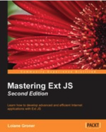

# Mastering Ext JS - Second Edition

* Pages 400
* Publisher: Packt Publishing
* Release Date: February 2015
* ISBN: 9781784390457
* Topic: Ext JS

### Descripción del libro

**Aprenda a desarrollar aplicaciones de Internet avanzadas y eficientes con Ext JS**

**En detalle**

Este libro le ayudará a utilizar Ext JS en todo su potencial y le mostrará cómo crear una aplicación Ext JS completa desde cero.

Comenzará por aprender a crear la estructura del proyecto, la pantalla de inicio(splash screen), la pantalla de inicio de sesión(login screen), los menús dinámicos, las pantallas abiertas de forma dinámica, las master-detail grids y mucho más. También aprenderá a exportar datos a Excel, incluidos archivos PDF e imágenes, teniendo siempre en cuenta las mejores prácticas.

A continuación, descubrirá cómo utilizar la arquitectura MVC, el nuevo MVVM. A continuación, aprenderá cómo personalizar temas y cómo preparar la aplicación para que esté lista para la implementación una vez finalizada.

Al final del libro, habrá aprendido todo lo que necesita saber para dominar realmente Ext JS y comenzar a crear aplicaciones avanzadas.

**Lo que vas a aprender**

* Desarrollar una pantalla de inicio de sesión y presentación
* Crea menús dinámicos y abre pantallas dinámicas
* Explote master detail grids, formularios de detalles maestros, árboles y gráficos
* Utilice las arquitecturas MVC, MVVM e híbridas
* Maneje la información en el lado del servidor, ¡no más archivos JSON!
* Personaliza y crea un tema
* Crea una aplicación desde cero

### Publisher Resources

Supplemental Content: https://downloads.packtpub.com/code/9781784390457.zip

### Table of Contents

Mastering Ext JS Second Edition
* Table of Contents
* Mastering Ext JS Second Edition
* Credits
* About the Author
* Acknowledgments
* About the Reviewers
* www.PacktPub.com
   * Support files, eBooks, discount offers, and more
      * Why subscribe?
      * Free access for Packt account holders

* Preface
   * What this book covers
   * What you need for this book
   * Who this book is for
   * Conventions
   * Reader feedback
   * Customer support
      * Downloading the example code
      * Errata
      * Piracy
      * Questions

1. Sencha Ext JS Overview
   * Understanding Sencha Ext JS
      * Architecture of Ext JS applications

* Ext JS overview
   * Basic tutorial
   * Class system
   * Components
      * The component hierarchy
   * GridPanel
   * TreePanel
   * Forms
   * Other components
   * Layouts
   * Data package
   * The MVC and MVVM architectures
   * Look and feel of Ext JS applications
* Installing Ext JS
   * Prerequisites for Ext JS and Sencha Cmd
   * Downloading Ext JS and Sencha Cmd
   * Offline documentation
   * IDE
* Summary

2. Getting Started
   * Preparing the development environment
* Presenting the application and its capabilities
   * The splash screen
   * The login screen
   * The main screen
   * User administration
   * MySQL table management
   * Content management control
   * Charts
* Creating the application with Sencha Cmd
   * A quick word about MVC
   * Creating the application
      * Looking out for changes with the watch command
      * Applying the first changes in our app
      * Understanding the Application.js file
* Creating the loading page
* Summary

3. The Login Page
   * The Login screen
* Creating the Login screen
   * Client-side validations
      * Creating custom VTypes
   * Adding the toolbar with buttons
      * Running the code
         * A quick overview about Ext JS dynamic class loading
   * Adding Font Awesome support (Glyph icons)
   * Creating the Login Controller
      * Introducing the MVVM architecture
      * Creating the ViewController for Login View
         * Binding the ViewController to the View
      * Listening to the button click event
         * Cancel Button Listener implementation
         * Submit Button Listener implementation
   * Creating the User and Groups tables
   * Handling the Login page on the server
      * Connecting to the database
      * Login.php
   * Handling the return of the server – logged in or not?
      * Reusing code by creating a Util class
* Enhancing the Login screen
   * Applying a loading mask on the form while authenticating
   * Form submit on Enter
   * Caps Lock warning message
* Summary

4. The Logout and Multilingual Capabilities
   * The base of the application – view/main/Main.js
      * The Viewport
         * Using the Viewport plugin
      * Organizing the main screen using the Border layout
         * Creating the main TabPanel component
         * Creating the footer
            * A quick word about modular CSS
         * Creating the Header class
            * Creating the Header CSS
            * Customizing the Font Awesome icon colors
      * The main screen and MVVM
         * The main ViewModel

* Logout capability
   * Handling the logout on the server
   * Ajax request success versus failure
* Client-side activity monitor
* The multilingual capability
   * Creating the change language component
      * Adding the CSS – country flags
      * Using the translation component
   * Creating the multilingual files
   * Applying the translation on the application's components
   * HTML5 local storage
   * Handling change language in real time
      * The early life of the ViewController
   * Using locale files to translate Ext JS
* Summary

5. Advanced Dynamic Menu
   * An overview of the dynamic menu
      * Ext JS TreePanel
      * Accordion layout
* The database model – groups, menus, and permissions
* The dynamic menu – an MVC approach
   * Creating the models
      * Working with the hasMany association
   * Creating the store-loading menu from the server
   * Handling the dynamic menu on the server
      * Fetching the user permissions
      * Fetching the modules the user is entitled to
      * Fetching the menu options based on modules and permissions
   * Creating the menu with the Accordion layout and TreePanel
   * Creating the menu Controller
      * Rendering the menu from nested JSON (the hasMany association)
         * Using glyphs in TreePanel – working with overrides
         * Menu locale support
      * Opening a menu item programmatically
* Summary

6. User Management
   * Managing users
      * Listing all the users using a simple GridPanel
         * Creating a User Model
            * Working with schemas
         * Defining store-less grids with Users GridPanel
            * The Users screen
               * Working with docked items
            * Working with singletons – Ext JS class system
            * Panel versus Container versus Component
      * Declaring the User ViewModel
         * Working with ViewModel data binding
      * Creating the User ViewController
         * Adding and editing a new user
            * Creating the Edit View – form within a window
            * Creating the Group Model
            * The Groups Store
         * Controller – listening to the Add button
         * Controller – listening to the Edit button
         * Controller – listening to the Cancel button
         * Controller – saving a user
            * Using Model validators
         * Previewing a file before uploading
         * Deleting a user
      * Displaying the group name in the Grid
* Summary

7. Static Data Management
   * Presenting the tables
* Creating a Model
   * Abstract Model
      * Adapting the Base Model schema
   * Specific models
* Creating a Store
   * Abstract Store
   * Specific Store
* Creating an abstract GridPanel for reuse
   * To initComponent or not?
   * Handling the Widget Column in the MVC architecture
   * Live Search plugin versus Filter plugin
   * Specific GridPanels for each table
   * Adding the Live Search CSS
* Generic Controller for all tables
   * Finding the correct selector
      * Using itemId versus id – Ext.Cmp is bad!
   * Adding a new record on the GridPanel
   * Editing an existing record
   * Deleting the handling Widget Column in the Controller
   * Saving the changes
      * Validating cellediting in GridPanel
         * Model validators
      * The autoSync configuration
   * Canceling the changes
   * Clearing the filter
   * Listening to Store events in the Controller
* Debug tip – Sencha extension for Chrome
   * Firefox extension – Illuminations for Developers
* Summary

8. Content Management
   * Managing information – films
* Displaying the Film data grid
   * The Film Model
   * Films ModelView
   * Film data grid (with paging)
      * Creating the Base Grid
      * Adding the RowExpander plugin
      * Actor-Language – handling a hasOne association
      * Adding the PagingToolbar
         * Handling paging on the server side
            * Paging queries on MySQL, Oracle, and Microsoft SQL Server

* Creating the films container
   * Handling many-to-many associations
      * Loading nested JSON from the server
         * Changing the ViewModel – chained stores
      * Film-Actor – handling many-to-many associations
      * Film-Category – handling many-to-many associations
* Creating the ViewController
   * The base ViewController
   * Creating the FilmsController
   * Adding or editing a film
      * Packt.view.base.WindowForm
      * The films form
      * Film categories
      * Film Actors
         * Search Actors – Live Search combobox
            * Model
            * Store
            * Live Search combobox
   * Complementing the ViewModel
      * Working with formulas and two-way data binding
* The Films ViewController
   * The createDialog method
   * Getting the selected actor from Live Search
   * Saving the form and working with sessions
      * Custom Writer – saving associated data
      * Saving session data manually
* Summary

9. Adding Extra Capabilities
   * Exporting a GridPanel to PDF and Excel
      * Exporting to PDF
         * Generating the PDF file on the server – PHP
         * Generating and viewing the PDF file with JavaScript – HTML5
      * Exporting to Excel
* Printing GridPanel content with the GridPrinter plugin
* Creating a Sales by Film Category chart
   * Ext JS 5 charts and terminology
   * Adding Sencha Charts to the project
   * Creating the Store inside the ViewModel
   * Pie chart
   * 3D column chart
   * The Chart panel
   * The ViewController
      * Changing the chart type
      * Exporting charts to images (PNG or JPEG)
* Summary

10. Routing, Touch Support, and Debugging
   * Ext JS routing
      * Default token
      * Loading a Controller programmatically
      * Handling routes
         * Refactoring the Menu code
      * Handling unmatched routes
      * Handling parameters
* Using the responsive design plugin
* Enabling touch support
   * From Ext JS to mobile
* Debugging Ext JS applications
* Testing Ext JS applications
* Helpful tools
* Third-party components and plugins
* Summary

11. Preparing for Production and Themes
   * Before we start
* Creating a new theme
   * Changing the base color
   * Customizing components
      * Some useful tips while creating new themes
   * Creating custom UIs
      * Applying the UI
* Packaging the application for production
   * Compiling ext-locale
   * What to deploy in production
   * Benefits
* Summary
