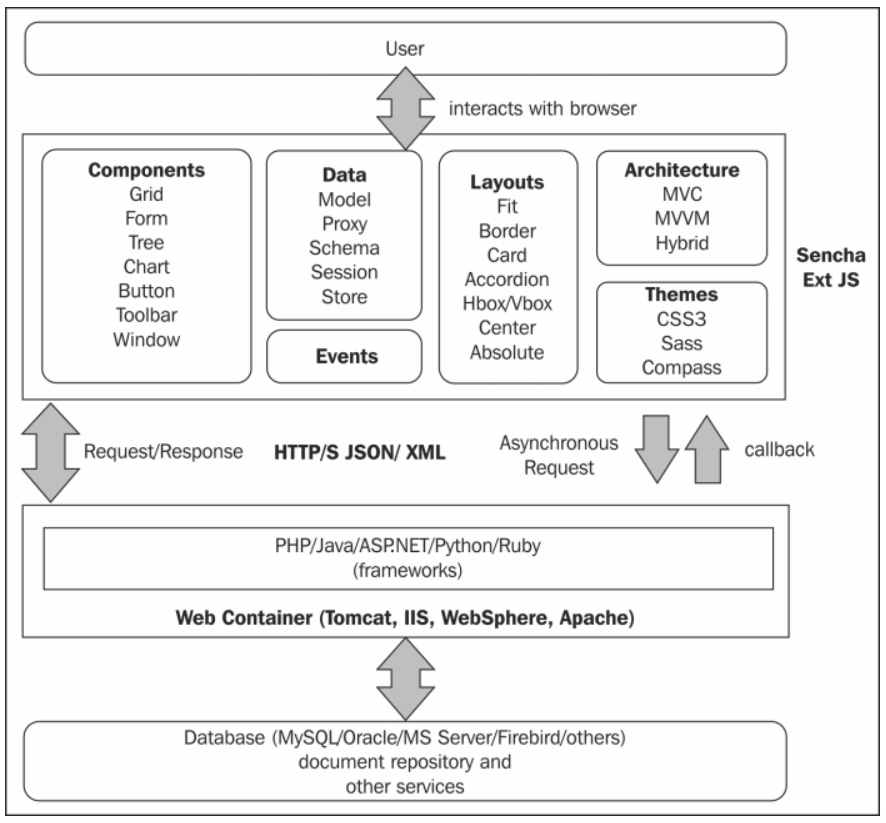
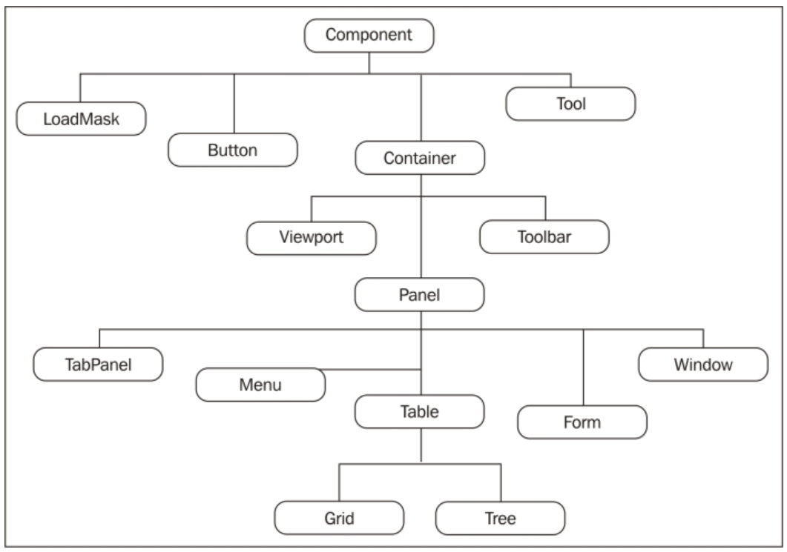
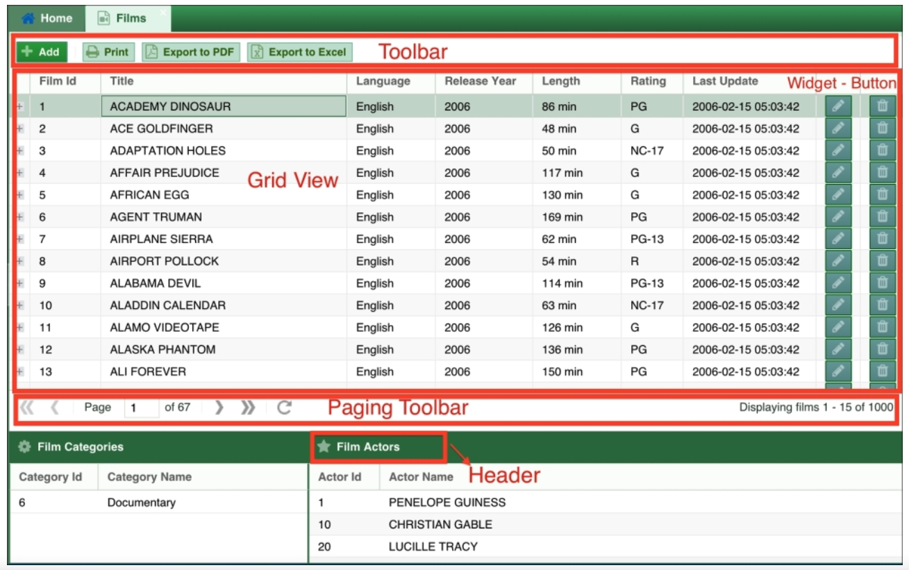
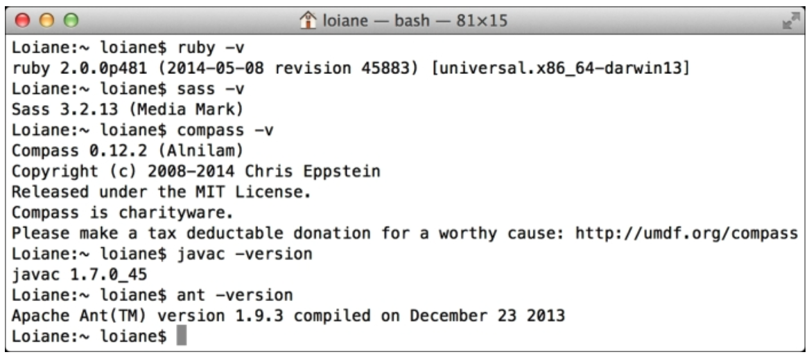
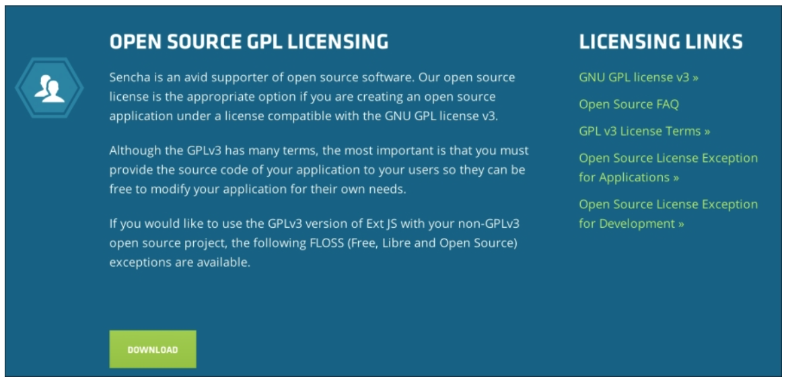
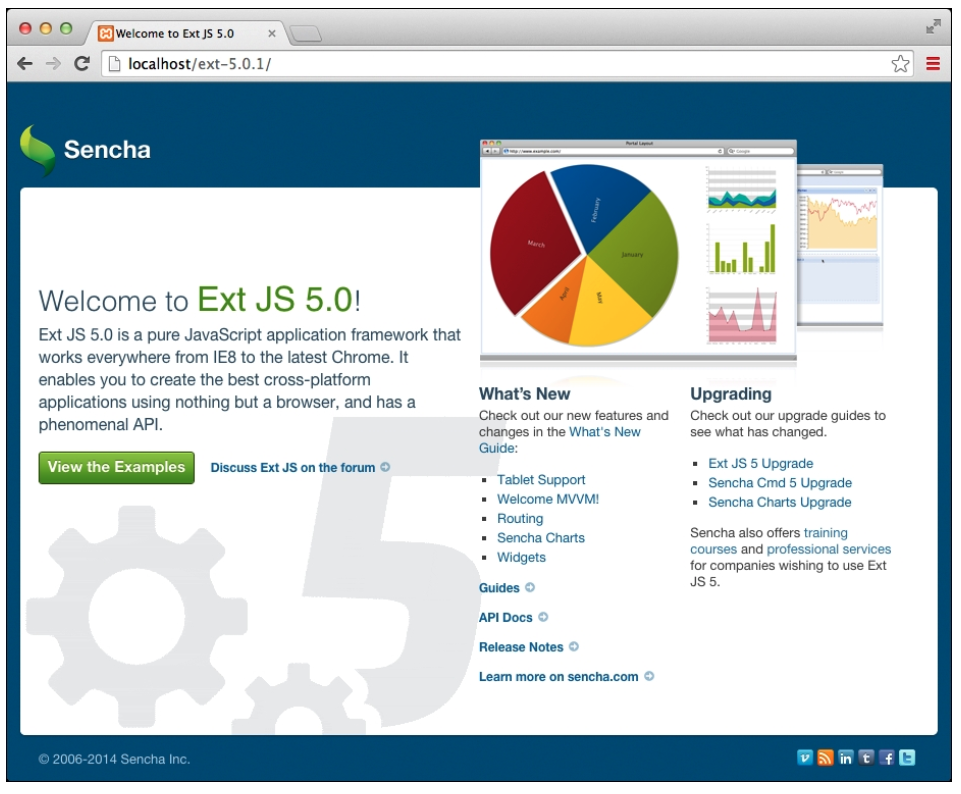
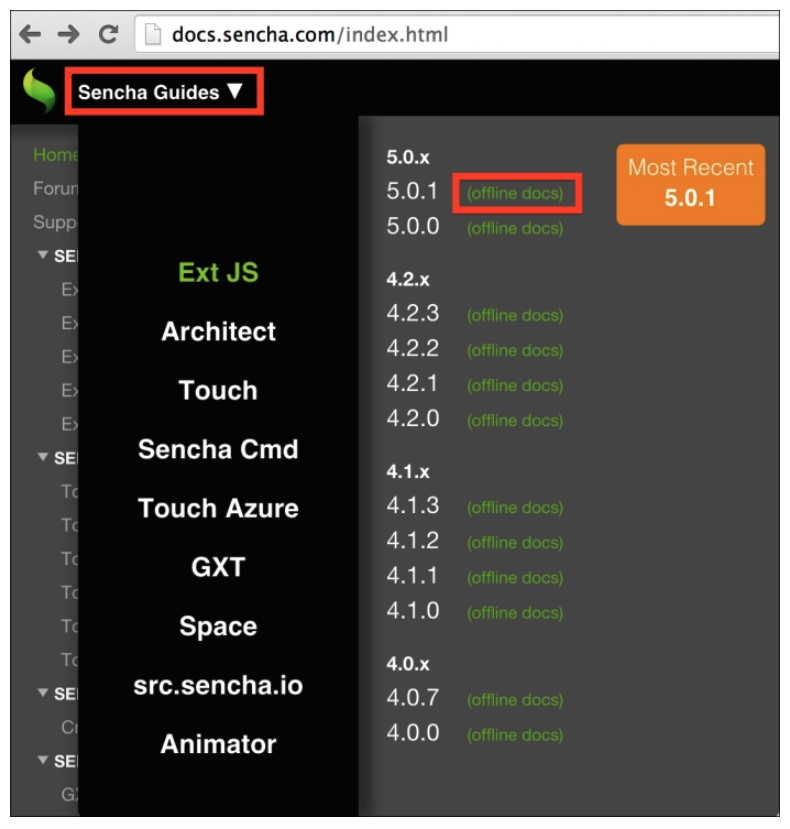
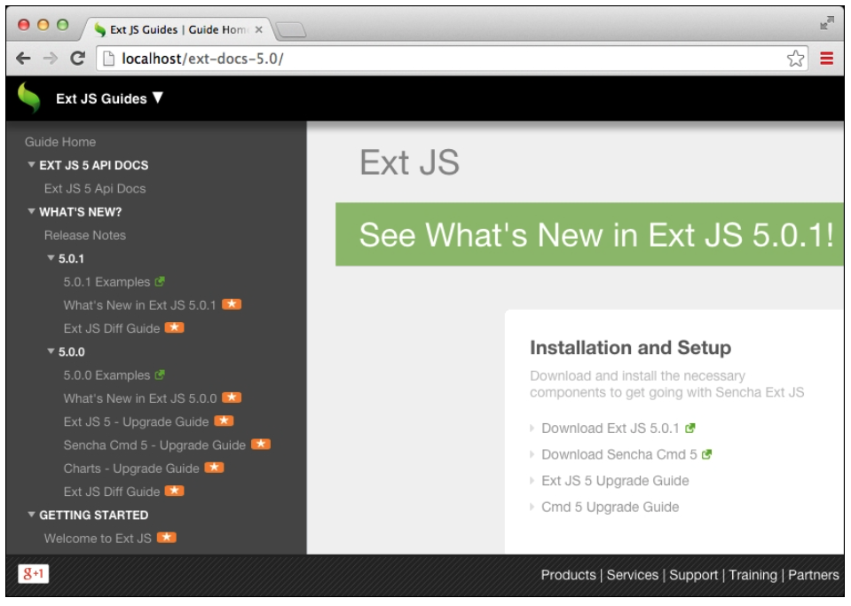

# 1. Sencha Ext JS Overview
   * Understanding Sencha Ext JS
      * Architecture of Ext JS applications
* Ext JS overview
   * Basic tutorial
   * Class system
   * Components
      * The component hierarchy
   * GridPanel
   * TreePanel
   * Forms
   * Other components
   * Layouts
   * Data package
   * The MVC and MVVM architectures
   * Look and feel of Ext JS applications
* Installing Ext JS
   * Prerequisites for Ext JS and Sencha Cmd
   * Downloading Ext JS and Sencha Cmd
   * Offline documentation
   * IDE
* Summary

Hoy en día, hay muchos tipos de libraries y frameworks frontend en el mercado. Hay frameworks que puede usar si solo desea manipular el **Document Object Model (DOM)**, frameworks que se usan solo para diseñar, frameworks para componentes fáciles de usar, frameworks que se usan para diseñar su proyecto, etc. También existe Ext JS, un framework utilizado para crear **Rich Internet Applications (RIA)** aplicaciones de Internet enriquecidas (RIA), pero tiene muchas otras características además de componentes bonitos.

En este libro, aprenderemos cómo desarrollar una aplicación desde el principio hasta el final con Ext JS 5, cubriendo también algunas partes del backend necesarias para que nuestra aplicación funcione. Aprenderemos cómo usar Ext JS con ejemplos prácticos que cubren algunos componentes, cómo funcionan y cómo usarlos en cada capítulo.

Pero primero, aprenderá de lo que es capaz Ext JS si es la primera vez que entra en contacto con el framework.

## Comprensión de Sencha Ext JS

¿Podemos usar Ext JS para manipular DOM? ¿Podemos usarlo si queremos componentes bonitos y fáciles de usar (formularios, cuadrículas, árboles, etc.)? ¿Podemos usarlo si necesitamos buenos gráficos? ¿Podemos usar la arquitectura **Model View Controller (MVC)** para organizar la aplicación con Ext JS? ¿Qué sucede si queremos utilizar un enlace de datos bidireccional entre el modelo y la vista? ¿Podemos hacer eso usando Ext JS? ¿Y si no nos gustan los colores del aspecto y la sensación de los componentes de Ext JS? ¿Podemos cambiarlo fácilmente también? Y ahora uno difícil; ¿Podemos hacer una compilación para ofuscar y optimizar los archivos CSS y JavaScript de nuestra aplicación usando Ext JS? ¿Ext JS responde? ¿Podemos usarlo en dispositivos móviles?

¡Sorprendentemente, la respuesta es positiva a todas las preguntas anteriores! Como podemos ver, Ext JS es un framework frontend completo. La empresa intelectual detrás de Ext JS es Sencha Inc. (http://sencha.com).

Sencha Ext JS también tiene un primo llamado **Sencha Touch**. También tiene las características sorprendentes que acabamos de mencionar, pero se centra en el mundo multiplataforma móvil. Hablaremos muy brevemente sobre Ext JS y Sencha Touch en capítulos posteriores de este libro.

### Arquitectura de Aplicaciones Ext JS

Antes de comenzar, asegurémonos de comprender algunos de los conceptos básicos. Ext JS es un frontend framework basado en JavaScript y HTML5. Esto significa que Ext JS no se conecta directamente a la base de datos. Para el almacenamiento, podemos utilizar uno de los tipos de almacenamiento HTML5, como Web SQL o almacenamiento local, pero estos tipos de almacenamiento nos permiten almacenar solo 5 MB de datos, que es muy poco para una aplicación común.

Por lo general, queremos utilizar MySQL, Oracle, MS Server o cualquier otra base de datos. Para poder almacenar información en una base de datos, necesitamos usar un lenguaje del lado del servidor, como PHP, Java, C #, Ruby, Python, Node.js, etc. Ext JS se comunicará con el lenguaje del lado del servidor (o servicios web), y el servidor se conectará a la base de datos o cualquier otro almacenamiento (repositorio de documentos, por ejemplo).

El siguiente diagrama ejemplifica la arquitectura de una aplicación desarrollada con Ext JS:

## Descripción general de Ext JS

Ya hemos mencionado algunas capacidades de Ext JS. Echemos un breve vistazo a cada uno de ellos. Pero primero, si desea echar un vistazo a la página web oficial de Sencha Ext JS, visite http://www.sencha.com/products/extjs/.

### Tutorial Básico

Antes de sumergirse en este libro, se recomienda que lea el contenido de los siguientes enlaces. Contienen la información básica que cualquier desarrollador necesita aprender antes de comenzar con Ext JS:

* Tutorial básico y descripción general de Ext JS: http://www.sencha.com/products/extjs/up-and-running
* Guías Ext JS: http://docs.sencha.com/extjs/5.0/
* Documentos ext JS: http://docs.sencha.com/extjs/5.0/apidocs/
* Ejemplos de Ext JS: http://dev.sencha.com/ext/5.0.1/examples/index.html
* Foro (conviértase en parte de la comunidad): http://www.sencha.com/forum/

### Sistema de Clases

Ext JS utiliza un enfoque **object-oriented (OO)**. Declaramos clases con atributos conocidos en Ext JS como configuraciones y métodos (funciones en JavaScript).

Ext JS también sigue una convención de nomenclatura. Si está familiarizado con la programación OO, probablemente también esté familiarizado con las convenciones de nomenclatura de Ext JS. Por ejemplo, los nombres de las clases son alfanuméricos, comienzan con un carácter en mayúscula y luego el resto de las letras están en CamelCase. Por ejemplo, si queremos crear una clase para representar los detalles del cliente, podríamos llamarla **`ClientDetails`**. Los nombres de método y atributo comienzan con un carácter en minúscula y luego el resto de las letras están en CamelCase. Por ejemplo, **`retrieveClientDetails()`** es un buen nombre para un método y **`clientName`** es un buen nombre para un atributo.

Ext JS también está organizado en paquetes. Los paquetes son una forma de organizar el código que tiene el mismo propósito. Por ejemplo, en Ext JS, hay un paquete llamado **`data`** que maneja todo lo relacionado con los datos en el framework. Hay un paquete con nombre **`grid`** que contiene todo el código relacionado con GridPanels.

> **NOTA**
> 
> Para obtener más información sobre el sistema de clases, lea http://docs.sencha.com/extjs/5.0/core_concepts/classes.html.

### Componentes

La razón principal por la que algunas personas consideran el uso de Ext JS es probablemente por sus componentes ricos y fáciles de usar. Ext JS contiene algunos de los componentes más utilizados en aplicaciones web, como forms, grids y trees. También podemos utilizar gráficos táctiles (lo que significa que también funcionan en pantallas táctiles) y el paquete de dibujo que utiliza todas las ventajas de **Scalable Vector Graphics (SVG)** y HTML5.

Puede consultar la página oficial de ejemplos de Sencha Ext JS en http://dev.sencha.com/extjs/5.0.0/examples/index.html para tener una idea de lo que podemos hacer con los ejemplos.

#### LA JERARQUÍA DE COMPONENTES

Notará que a lo largo de este libro, mencionaremos términos como componente, contenedor y widget. El siguiente diagrama ejemplifica la jerarquía de componentes en Ext JS:

La clase **Component** es la clase principal de todos los widgets Ext JS. Debajo de la clase **Component**, tenemos la clase **Container**. La clase **Container** puede contener otros componentes. Por ejemplo, echemos un vistazo al siguiente GridPanel:

La clase **`Grid Panel`** se extiende desde la clase **`Panel`**, un componente muy popular en Ext JS. La clase **`Panel`** admite encabezados, elementos acoplados (toolbars) y contiene un espacio para el cuerpo. Las subclases de la clase **`Panel`**, como **`DataView`**, **`Tree`**, **`Grid`** y **`Form`**, son paneles, pero en lugar del cuerpo, tienen una clase **`View`** especializada que se encarga de representar la información específica. Por ejemplo, la clase **`View`** de un panel **`Grid`** está especializada en renderizar la Columna Grid; la clase **`View`** de un Panel **`Tree`** está especializada en la representación de información jerárquica, y la clase **`View`** de un panel **`Form`** (llamado BasicForm) está especializada en la representación de campos de formulario.

### GridPanel

El componente grid es uno de los componentes más utilizados en aplicaciones web. Se utiliza para mostrar datos tabulares.

Para crear un grid, el desarrollador debe declarar al menos dos configuraciones: **`columns`** y **`Store`**. La clase **`Store`** organiza una colección de datos en Ext JS, y es responsable de alimentar el grid con la información que se mostrará. Lo exploraremos cuando analicemos el paquete de datos(data).

El componente grid se puede utilizar como una cuadrícula de datos simple y llana, y solo se muestran los registros de información. O, si tenemos una gran cantidad de datos, podemos usar sus capacidades de paginación, o también podemos usar un Big Data Grid si realmente tenemos una gran cantidad de datos. También hay otras características como grouped header grid (también conocida como Pivot Grid); también podemos tener un grid con columnas bloqueadas o incluso con widgets, como chats, como lo demuestra la captura de pantalla anterior. Entre otras características, también podemos ordenar y filtrar la información dentro del grid y usar algunos de sus complementos para realizar tareas como expandir las filas para mostrar más información sin ventanas emergentes, usar casillas de verificación para seleccionar filas y también filas numeradas automáticamente. Y hay más: el componente grid también admite la edición al abrir una pequeña fila emergente para que pueda editar la información directamente en el grid. El grid también admite la edición de celdas, que es similar a lo que podemos hacer en MS Excel: edite la información haciendo doble clic en una celda.

> **NOTA**
> 
> Para obtener más información, consulte http://docs.sencha.com/extjs/5.0/apidocs/#!/api/Ext.grid.Panel and http://docs.sencha.com/extjs/5.0/components/grids/grids.html.

### TreePanel

Los árboles muestran datos jerárquicos, como un directorio de archivos. Los datos de un árbol provienen de un TreeStore o están predefinidos en la configuración **`root`**. El árbol también admite la ordenación y el filtrado, seleccione una fila usando casillas de verificación y también podemos mezclar un árbol con un grid y usar el componente TreeGrid.

También admite complementos como drag and drop entre árboles.

> **NOTA**
> 
> Para obtener más información, consulte http://docs.sencha.com/extjs/5.0/apidocs/#!/api/Ext.tree.Panel and http://docs.sencha.com/extjs/5.0/components/trees.html.

### Forms

A continuación, tenemos el componente forms. Podemos implementar forms poderosas usando text, area y campos de números. También podemos usar date/month picker, checkboxes, radio buttons, comboboxes e incluso la carga de archivos(file upload). Todos los campos tienen el soporte básico de validación nativa (con mensajes de error para el usuario), como campos obligatorios y valor o longitud mínimo y máximo, pero podemos personalizar y crear fácilmente una validación personalizada (dirección IP por ejemplo).

> **NOTA**
> 
> Para obtener más información, consulte http://docs.sencha.com/extjs/5.0/apidocs/#!/api/Ext.form.Panel and http://docs.sencha.com/extjs/5.0/components/forms.html.

### Otros Componentes

También tenemos los gráficos(charts). Podemos crear gráficos de columna, bar, line, area, scatter, pie, radial, gauge e incluso financieros. También podemos tener gráficos básicos, apilados, multiejes y 3D. Los gráficos también son alimentados por Store.

Y, por supuesto, existen componentes básicos que ayudarán a que nuestra aplicación se vea aún mejor, como menús, tabs, panels, windows, alerts, toolbars, etc. Los componentes son compatibles con la **Web Accessibility Initiative – Accessible Rich Internet Applications (WAI-ARIA) ** y también admiten idiomas de derecha a izquierda.

Parece bonito, ¿verdad? Cubriremos la mayoría de los componentes y sus capacidades a lo largo de los ejemplos de este libro.

### Layouts

Ext JS admite diferentes posibilidades. También tiene un excelente administrador de layout (solo cuando creamos una aplicación Ext JS usando su componente base, el Viewport. Para los componentes que se usan en forma independiente (renderizados en una etiqueta **`
`**, el administrador de layout no funciona cuando disminuir el tamaño de la ventana del navegador).

Algunos de los diseños admitidos son Absolute layout (donde necesitamos usar las posiciones absolutas *x* e *y* del componente en la pantalla o dentro del componente); Accordion layout, Border layout, Card layout, Center layout, Column layout, Fit layout, Hbox y VBox layouts, y Table layouts..

Los diseños que se utilizan más en las aplicaciones son Border, Card, Fit y HBox y VBox. También cubriremos diferentes diseños a través de los ejemplos de este libro.

> **NOTA**
> 
> Para obtener más información, consulte http://dev.sencha.com/ext/5.0.1/examples/kitchensink/#layouts and the layout.container package at http://docs.sencha.com/extjs/5.0/apidocs/#!/api/Ext.layout.container.Absolute.

### Data package

El Data package es uno de los paquetes más importantes del SDK de Ext JS. Los componentes de Ext JS, como grid, Tree e incluso el Form, se basan en datos.

Los lenguajes del lado del servidor generalmente admiten datos bien. En Java, PHP, C # y otros lenguajes, podemos crear entidades conocidas como **Plain Old Java Object (POJOs), Persistent Domain Objects (PDOs) y Value Objects (VOs)**, y otros nombres que normalmente les damos a estas entidades. Ext JS admite datos, por lo que también representamos entidades en la interfaz.

Básicamente hay tres piezas principales:

* **Model:** Representa la entidad. Puede representar una clase que tenemos en el lado del servidor o una tabla de la base de datos. El modelo admite campos, validaciones, asociaciones (**OneToOne, OneToMany, ManyToMany**).
* **Store:** Representa una colección de models. También admite grupos, filtrado y ordenación.
* **Proxy:** Representa la forma en que nos vamos a conectar al servidor (o un almacenamiento local). Puede ser Ajax, REST, JSONP, Memory o HTML5 LocalStorage. Dentro del proxy, podemos definir **`Reader`** y **`Writer`**. El atributo **`Reader`** se encarga de decodificar los datos que recibimos del servidor (podemos definirlo si es JSON o XML, y también podemos definir su formato). El atributo **`Writer`** es responsable de codificar los datos que se enviarán al servidor; puede ser JSON o XML, y también podemos definir su formato. El Proxy se puede colocar dentro de un Model o un Store.

> **NOTA**
> 
> Para obtener más información, lea http://docs.sencha.com/extjs/5.0/core_concepts/data_package.html.

### Las Arquitecturas MVC y MVVM

Mientras trabajamos con Ext JS, podemos elegir entre dos arquitecturas para nuestro código frontend: **Model View Controller (MVC)** y **Model View ViewModel (MVVM)**. También hay una tercera opción, que es un **híbrido** entre **MVC** y **MVVM**.

A lo largo de este libro, aprenderemos más sobre MVC, MVVM y también el enfoque híbrido.

> **NOTA**
> 
> Para obtener más información, lea http://docs.sencha.com/extjs/5.0/application_architecture/application_architecture.html.

### Apariencia de las aplicaciones Ext JS

También podemos personalizar el tema de las aplicaciones Ext JS. La temática se basa en Sass y Compass. Nos sumergiremos en temas en el último capítulo de este libro.

> **NOTA**
> 
> Para obtener más información, lea http://docs.sencha.com/extjs/5.0/core_concepts/theming.html.
 

## Instalación de Ext JS
### Requisitos previos para Ext JS y Sencha Cmd

> **NOTA**
> 
> 

> **NOTA**
> 
> 

### Descarga de Ext JS y Sencha Cmd

> **NOTA**
> 
> 

### Documentación sin conexión

> **NOTA**
> 
> 

### IDE

## Resumen

En este capítulo, revisamos rápidamente Ext JS y proporcionamos algunas referencias que son útiles de leer para recopilar los conocimientos básicos necesarios para comprender los términos y componentes que usaremos en este libro.

En el próximo capítulo, presentaremos la aplicación con la que vamos a trabajar a lo largo de este libro, y también la crearemos usando Sencha Cmd.
