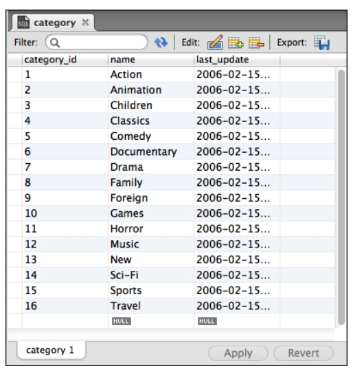
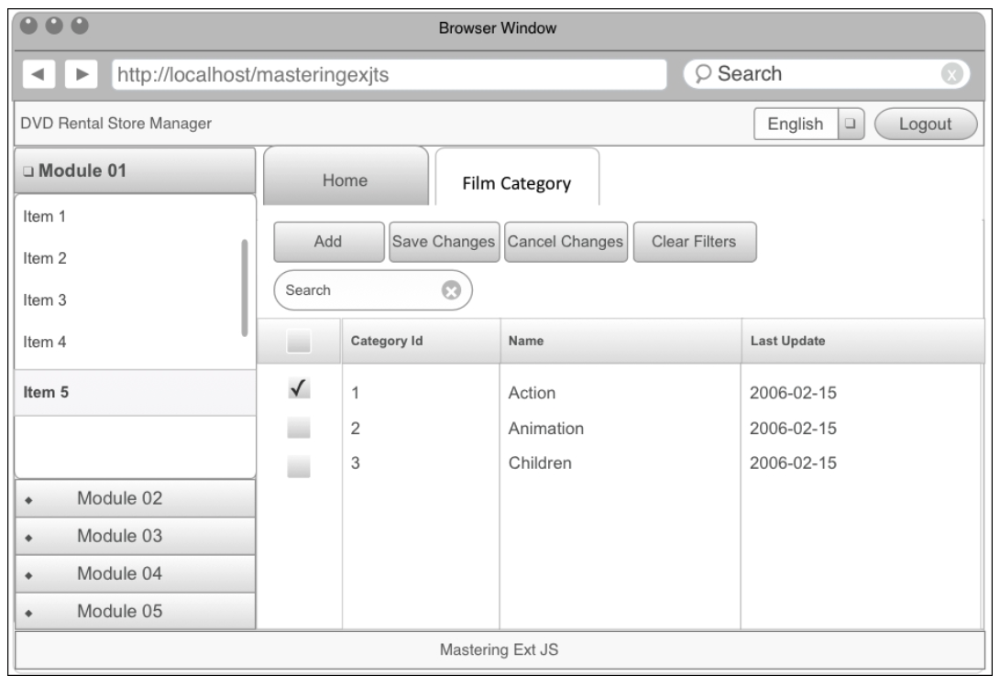
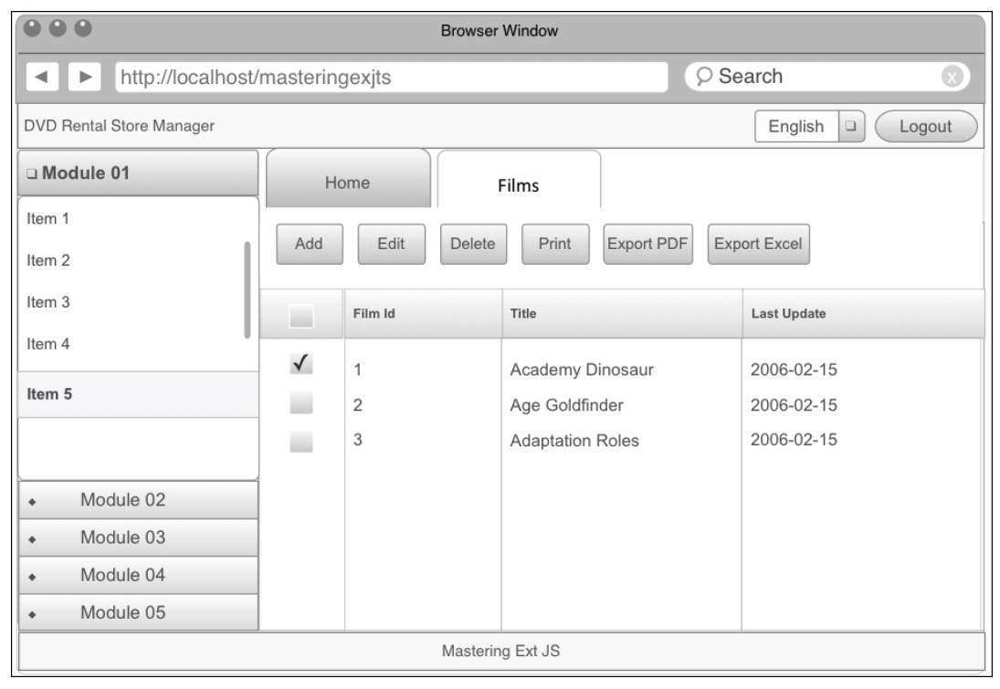
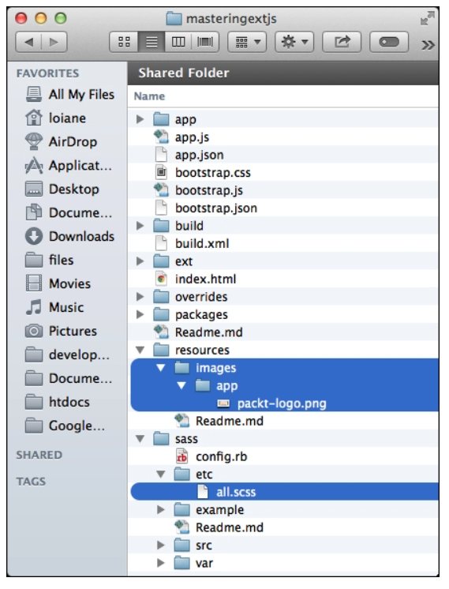

# 2. Getting Started
   * Preparing the development environment
* Presenting the application and its capabilities
   * The splash screen
   * The login screen
   * The main screen
   * User administration
   * MySQL table management
   * Content management control
   * Charts
* Creating the application with Sencha Cmd
   * A quick word about MVC
   * Creating the application
      * Looking out for changes with the watch command
      * Applying the first changes in our app
      * Understanding the Application.js file
* Creating the loading page
* Summary

En este libro, nos sumergiremos en el mundo de Sencha Ext JS 5 y exploraremos ejemplos del mundo real. También construiremos una aplicación completa desde cero, desde la fase de wireframe hasta la implementación en producción.

A lo largo de este libro, vamos a desarrollar una aplicación para administrar una tienda de alquiler de DVD. En este capítulo, presentaremos la aplicación y describiremos sus capacidades. También aprenderá a organizar los archivos de la aplicación, que se creará a lo largo de los capítulos de este libro. Este capítulo también presentará la maqueta (wireframe) de la aplicación y cómo empezar a organizar las pantallas (que es un paso muy importante y algunos desarrolladores se olvidan de hacerlo). En este capítulo, cubriremos:

* Preparar el entorno de desarrollo instalando el software necesario
* Presentando la aplicación y sus capacidades
* Creación de mockups/wireframes (maquetas/wireframes) de cada pantalla
* Creando la estructura de la aplicación usando Sencha Cmd
* Creando la loading page (página de carga) (pantalla de bienvenida)

## Preparando el Entorno de Desarrollo

La aplicación que vamos a desarrollar tiene una arquitectura muy sencilla. Vamos a usar Ext JS 5 en la interfaz, que se comunicará con un módulo del lado del servidor usando Ajax/JSON, que luego se comunicará con una base de datos.

El siguiente diagrama encapsula el párrafo anterior:

> **NOTA**
> 
> Si es un desarrollador de Java, puede encontrar un código de muestra sobre cómo integrar Java con Ext JS en http://goo.gl/rv76E2 y http://goo.gl/nNIRuQ.

> **NOTA**
> 
> 

## Presentación de la aplicación y sus capacidades.
### La pantalla de bienvenida

### La pantalla de inicio de sesión

### La pantalla principal

### Administración de Usuario

### Gestión de tablas MySQL

### Control de gestión de contenido

### Gráficos

## Creando la aplicación con Sencha Cmd
### Unas palabras breves sobre MVC

### Creando la aplicación

> **NOTA**
> 
> 

> **NOTA**
> 
> 

> **NOTA**
> 
> 

> **NOTA**
> 
> 

#### Buscando cambios con el comando watch

> **TIP**
> 
> 

> **TIP**
> 
> 
#### Aplicando los primeros cambios en nuestra aplicación
#### Comprensión del archivo Application.js

> **TIP**
> 
> 

## Creando la página de carga

> **NOTA**
> 
> 

> **NOTA**
> 
> 

> **TIP**
> 
> 

> **NOTA**
> 
> 

## Resumen

En este capítulo, exploramos la aplicación que implementaremos a lo largo de los capítulos de este libro con mucha profundidad. También cubrimos todos los requisitos para crear el entorno de desarrollo para esta aplicación. Aprendió a crear la estructura inicial de una aplicación Ext JS MVC.

También aprendió, a través de ejemplos, cómo crear una pantalla de presentación (también conocida como loading screen(pantalla de carga)), manipulando el DOM usando la clase **`Ext.dom.Element`**. Aprendió los pasos para iniciar una aplicación Ext JS y también aprendió la diferencia entre los métodos **`init`** y **`launch`** de **`Ext.application`**. Dejamos **`Application.js`** listo para mostrar su primera pantalla, que será una pantalla de inicio de sesión(login screen), y que aprenderá a implementar en el próximo capítulo.
