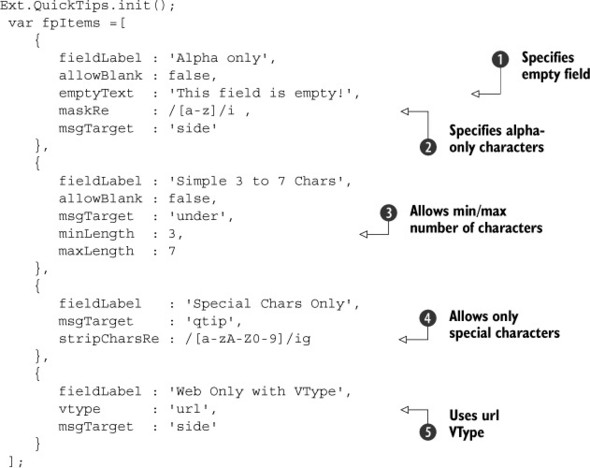
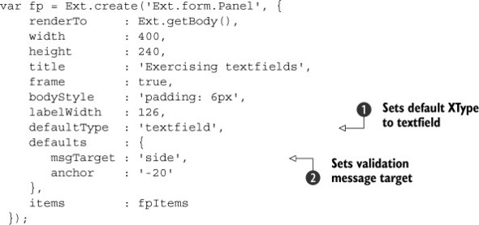
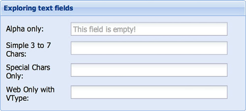
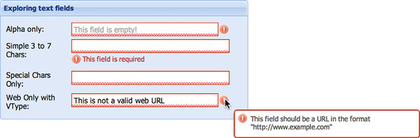

# Capítulo 6. Formularios en Ext JS

Este capítulo cubre

* Explorando los input fields del panel de formulario
* Creación de plantillas ComboBox personalizadas
* Crear un panel de formulario de diseño complejo

Acaba de aprender a organizar los widgets de la interfaz de usuario con los distintos layout managers en el framework Ext JS. A partir de aquí, comenzaremos a crear instancias y administrar elementos de formulario Ext JS. ¿Qué es una aplicación sin la participación del usuario?

No debería sorprender que desarrollar y diseñar formularios sea una tarea común para los desarrolladores web. La gestión de la validación de formularios es para lo que se utilizó principalmente JavaScript hace unos años. Ext JS va más allá de la validación de formularios típica, basándose en los campos de entrada HTML básicos para agregar funciones para el desarrollador y mejorar la experiencia del usuario. Por ejemplo, supongamos que se requiere que un usuario ingrese HTML en un formulario. Usando un campo de entrada de área de texto listo para usar, el usuario tendría que escribir el contenido HTML a mano. Esto no es necesario con Ext JS HTML Editor, donde obtiene un campo de entrada WYSIWYG completo, lo que permite al usuario ingresar y manipular HTML con formato enriquecido fácilmente.

En este capítulo, investigaremos el panel de formulario y aprenderá sobre muchas de las clases de entrada de formulario Ext JS. También verá cómo basarse en lo que sabe sobre diseños y el modelo de contenedor para construir un formulario complejo y usar esa implementación para enviar y cargar los datos a través de Ajax.

Debido a que hay tantas cosas que cubrir con los input fields, este capítulo seguirá un estilo de cookbook, donde lo guiaremos a través de los muchos campos de entrada Ext JS, como el campo de texto genérico, el text area y los campos numéricos. Echaremos un buen vistazo al ComboBox, un campo de entrada que fusiona un campo de texto simple con una lista desplegable personalizada y que posiblemente sea el campo de entrada más complejo de implementar en el framework. Una vez que tenga una comprensión sólida de estos input fields, uniremos las cosas implementando y discutiendo la clase **`FormPanel`**, donde aprenderá los entresijos de guardar y cargar datos.

## 6.1. CAMPOS DE ENTRADA BÁSICA

El campo de formulario Ext JS y los descendientes agregan características al campo de entrada HTML existente, como validaciones básicas, un método de validación personalizado, cambio de tamaño automático y filtrado de teclado. Para utilizar algunas de las funciones más potentes, como los filtros de teclado (máscaras) y la eliminación automática de caracteres, deberá conocer las expresiones regulares.

> **Obtenga más información sobre las expresiones regulares con JavaScript**
>
> Si es nuevo en las expresiones regulares, hay una gran cantidad de información en Internet. Uno de nuestros sitios favoritos para aprender sobre este tema es www.regularexpressions.info/javascript.html.

### 6.1.1. Campos de entrada y validación

Vamos a explorar bastantes características de los campos a la vez. Quédese con nosotros, porque algunos de los códigos de ejemplo pueden ser largos.

Los campos se crean como children de un panel de formulario para realizar un seguimiento de los problemas de presentación. Para comenzar, creará el array de elementos, que contendrá las definiciones XType de los diferentes campos de texto, como se muestra en la siguiente lista.

En el listado 6.1 debe trabajar muchos ángulos para demostrar las capacidades del campo de texto simple. Crea cuatro campos de texto en el array **`fpItems`**. Uno de los atributos redundantes que tiene cada child es **`fieldLabel`**, que es el texto para colocar en el elemento de etiqueta para el elemento de campo.

Para el primer child, se asegura de que el campo no pueda estar en blanco especificando **`allowBlank`** como **`false`**, lo que garantiza que utilice una de las validaciones de campo básicas de Ext JS. También establece un valor de cadena para **`emptyText`** 1️⃣, que muestra texto auxiliar y se puede usar como valor predeterminado. Una cosa importante a tener en cuenta es que se envía como el valor del campo durante el envío del formulario. A continuación, configura **`maskRe`** 2️⃣, una máscara de expresión regular, para filtrar las pulsaciones de teclas que se resuelven en cualquier cosa que no sean caracteres alfabéticos. El segundo campo de texto está diseñado para que no se pueda dejar en blanco y debe contener de tres a siete caracteres para ser válido. Para ello, establezca los parámetros **`minLength`** 3️⃣ y **`maxLength`**. El tercer campo de texto puede estar en blanco, pero tiene eliminación automática de caracteres alfanuméricos. Puede habilitar la eliminación automática especificando una expresión regular válida para la propiedad **`stripCharsRe`** 4️⃣. Para el último elemento child 5️⃣, usa la URL de **`VType`** para probar si el valor ingresado es una URL. En la siguiente lista, creará un panel de formulario para representar sus campos de entrada.

La mayor parte del código creado en el listado 6.2 debería resultarle familiar. Pero revisemos algunos elementos clave relacionados con el modelo de componente. Anula el componente predeterminado XType estableciendo la propiedad **`defaultType`** en 1️⃣ **`'textfield'`**, que, si recuerda, asegurará que sus objetos se resuelvan en campos de texto. También configura algunos valores predeterminados 2️⃣, que garantizan que el objetivo de su mensaje de error esté en el lado derecho del campo y que su propiedad de anclaje esté configurada. Por último, establezca la configuración **`items`** del panel de formulario en la variable **`fpItems`** que creó anteriormente, que contiene los cuatro campos de texto. El panel de formulario renderizado debería verse como la figura 6.1.

Observe en la figura 6.1 que hay un poco de espacio adicional a la derecha de los campos de texto. Esto se debe a que debe asegurarse de que los mensajes de error de validación se muestren a la derecha de los campos. Esta es la razón por la que establece **`msgTarget`** en **`'side'`** para su objeto predeterminado en la definición de su panel de formulario. Puede invocar la validación de dos formas: enfocando y difuminando (perdiendo el foco) un campo o invocando una llamada al método **`isValid`** de todo el formulario, **`fp.getForm().isValid()`**. La Figura 6.2 muestra cómo se ven los campos después de que se haya producido la validación.

Cada campo puede tener su propia propiedad **`msgTarget`**, que puede ser cualquiera de los cinco atributos posibles:

* **qtip**: muestra una sugerencia rápida de Ext JS al pasar el mouse por encima
* **title**: muestra el error en el área de título del navegador predeterminado
* **under**: coloca el mensaje de error debajo del campo
* **side**: coloca un icono de exclamación en el lado derecho del campo
* **[element id]**: agrega el texto del mensaje de error como el **`innerHTML`** del elemento de destino

Tenga en cuenta que la propiedad **`msgTarget`** afecta la forma en que se muestra el mensaje de error solo cuando el campo está dentro de un **`FieldContainer`** (normalmente un panel de formulario). Si el campo de texto se representa en algún elemento arbitrario en algún lugar de la página (es decir, usando **`renderTo`** o **`applyTo`**), **`msgTarget`** se establecerá solo como **`title`**. Le recomendamos que dedique algún tiempo a experimentar con los distintos valores de **`msgTarget`**; de esa manera, cuando se trata de crear su primer form del mundo real, comprenderá bien cómo funcionan. Veamos cómo crear campos de carga de archivos y contraseñas usando el text field.
