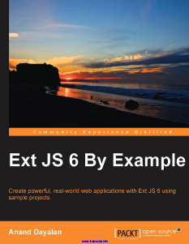

# 920 Ext JS 6 By Example

## Table of Contents

Preface

### Chapter 1: Getting Started with Ext JS
* Why Ext JS?
   * Cross-browser support
   * Rich UI components
   * Two-way binding
   * Architectural pattern for JavaScript
   * Simplifying a complicated operation
   * Easy DOM access
   * Client-side routing
   * Support for accessibility
* An introduction to Ext JS
   * The universal application
* Setting up Ext JS
   * Sencha Cmd
      * Java Runtime Environment (JRE)
      * Ruby
      * Installing Sencha Cmd
* Generating the Ext JS application using Sencha Cmd
* The application architecture
   * Model
   * View
   * Controller
   * View model
      * View model – MainModel.js
      * Controller – MainController.js
      * View – main.js
* Exploring Sencha Cmd commands
   * The Sencha command format
   * Help
   * Upgrading Sencha Cmd
   * Generating an application
   * Building the application
   * Launching the application
   * The code generation
   * Upgrading your application
* Debugging an Ext JS application
* Illumination
   * The features of Illumination
      * Object naming
      * Element highlighting
* App Inspector
   * Sencha Fiddle
* Tha development IDE
* Summary

### Chapter 2: Core Concepts 29
* The class system
   * Ext
      * application
      * define
      * create
      * onReady
      * widget
      * getClass
      * getClassName
      * Ext.Base
      * Ext.Class
      * Ext.ClassManager
      * Ext.Loader
* Events
   * Adding listeners
   * Removing listeners
   * The DOM node event handling
* Accessing DOM
   * Ext.get
   * Ext.query
   * Ext.select
      * Multiple selections
      * Selection root
      * Selection chaining
   * Ext.ComponentQuery
* Components, containers, and layouts
   * Components
   * Containers
   * Layouts
      * updateLayout
      * suspendLayout
      * The absolute layout
      * The accordion layout
      * The anchor layout
      * The border layout
      * The card layout
      * The center layout
      * The column layout
      * The fit Layout
      * The hbox layout
      * The table layout
      * The VBox layout
* Summary
   
### Chapter 3: Basic Components 57
* Getting familiar with basic components
   * Ext.Button
   * Ext.MessageBox
* Forms and form fields
   * Ext.form.Panel
* Fields
   * Ext.form.field.Text
   * Ext.form.field.Number
   * Ext.form.field.ComboBox
   * Ext.form.field.HtmlEditor
* The form field validation
   * Events in the form panel
   * Form field containers
   * Ext.form.CheckboxGroup
   * Ext.form.FieldContainer
   * Ext.form.RadioGroup
   * Submitting a form
   * Menus and toolbar
* The customer feedback form design
* Calculator – a sample project
   * The folder structure
      * App – app.js
   * MVC and MVVM – Revisit
      * Model
      * View
      * Controller
      * ViewController and Controller
      * View model
   * View – Main.js
   * Controller – MainController.js
   * ViewModel – MainViewModel.js
* Summary

### Chapter 4: Data Packages
* Model
   * Field
      * The data conversion
      * Validators
      * Relationships
      * Custom field types
* Store
   * The inline data store
   * Filtering and sorting
   * Accessing the store
      * Accessing the store using StoreManager
      * Accessing the store using Ext.app.ViewModel
   * Store events
   * The store in ViewModel
* Proxies
   * The client-side proxy
      * The memory proxy
      * The LocalStorage proxy
      * The SessionStorage proxy
   * The server-side proxy
* To do – a RESTful sample project
* Summary

### Chapter 5: Working with Grids
* The basic grid
* Sorting
   * Renderer
   * Filtering
   * Pagination
* Cell editing
* Row editing
* Grouping
* The pivot grid
* The company directory – a sample project
* Summary

### Chapter 6: Advanced Components
* The tree panel
   * The basic tree
* The tree grid
* Data views
* The picture explorer – a sample project
* Drag and drop
   * Configure the items as draggable
   * Create the drop target
   * Complete the drop target
* Summary

### Chapter 7: Working with Charts
* Charts
   * Chart types
      * The cartesian chart
      * The polar chart
      * The spacefilling chart
* Bar and column charts
   * The basic column chart
   * The bar chart
   * The stacked chart
   * The 3D bar chart
   * Area and line charts
      * The area chart
      * The line chart
   * The pie chart
      * The basic pie chart
   * The donut chart
   * The 3D pie chart
* The expense analyzer – a sample project
* Summary

### Chapter 8: Theming and Responsive Design
* An introduction to SASS
   * Variables
   * Mixins
   * Nesting
* Theming
   * Creating a custom theme
   * SASS variables
   * Creating a new component UI using SASS mixins
   * JS overrides
   * Images
   * Styling your application
* Responsive design
   * responsiveConfig
*Summary

#### Index
