# Capítulo 1: Empezando con Ext JS
* ¿Por qué Ext JS?
   * Compatibilidad con varios navegadores
   * Componentes de interfaz de usuario enriquecidos
   * Enlace bidireccional
   * Patrón Architectural para JavaScript
   * Simplificando una operación complicada
   * Fácil acceso a DOM
   * Enrutamiento del lado del cliente
   * Soporte para accesibilidad
* Una introducción a Ext JS
   * La aplicación universal
* Configuración de Ext JS
   * Sencha Cmd
      * Java Runtime Environment (JRE)
      * Ruby
      * Instalación de Sencha Cmd
* Generando la aplicación Ext JS usando Sencha Cmd
* The application architecture
   * Model
   * View
   * Controller
   * View model
      * View model – MainModel.js
      * Controller – MainController.js
      * View – main.js
* La arquitectura de la aplicación
   * Modelo
   * Vista
   * Controlador
   * Ver modelo
      * Ver modelo - MainModel.js
      * Controlador - MainController.js
      * Ver - main.js
* Explorando los comandos Sencha Cmd
   * El formato de comando Sencha
   * Ayuda
   * Actualización de Sencha Cmd
   * Generando una aplicación
   * Construyendo la aplicación
   * Lanzamiento de la aplicación
   * La generación de código
   * Actualización de su aplicación
* Depuración de una aplicación Ext JS
* Ilumination
   * Las características de la Illumination.
      * Nomenclatura de objetos
      * Elemento resaltado
* App Inspector
   * Sencha Fiddle
* El IDE de desarrollo
* Resumen

Atrás quedaron los días en que utilizaba JavaScript simple de Vanilla. JavaScript es un lenguaje excelente y poderoso, pero a muchos les resulta difícil mantener el código a medida que la aplicación web crece cada vez más. Por lo tanto, es muy difícil y requiere mucho tiempo manejar todo en JavaScript simple de Vanilla.

Cuando se trata de frameworks de JavaScript, existen frameworks de JavaScript del lado del cliente, así como frameworks de JavaScript del lado del servidor. Ext JS es un frameworks de JavaScript del lado del cliente.

Este capítulo trata básicamente de configurar el entorno de desarrollo con las herramientas necesarias, y veremos la introducción básica de Ext JS. En este capítulo, cubriremos los siguientes temas:

* Las ventajas de usar Ext JS
* Una introducción a Ext JS
* Configuración de Ext JS y Sencha Cmd
* Andamiaje de la aplicación Ext JS con Sencha Cmd
* La arquitectura de la aplicación
* Explorando los comandos de Sencha Cmd
* Depurar una aplicación Ext JS
* El IDE de desarrollo

## ¿Por qué Ext JS?
Ahora, echemos un vistazo a algunas de las ventajas de usar Ext JS sobre Vanilla JavaScript simple en su aplicación web.

### Compatibilidad con varios navegadores

Es posible que haya pasado varias horas o incluso días resolviendo los errores de varios navegadores. Por qué ¿Debería dedicar tiempo a esto en lugar de centrarse en la funcionalidad de su negocio? Por el contrario, si utiliza un buen framework, de JavaScript, como Ext JS, se encargará de la mayoría de estas tareas, y puede centrarse en la funcionalidad empresarial.

### Componentes de interfaz de usuario enriquecidos (Rich UI)

Ext JS viene con una gran cantidad de controles de interfaz de usuario enriquecidos, como data grid, tab
panels, tree controls, date picker, charts y estos deberían reducir mucho el tiempo de desarrollo.

### Two-way binding (Encuadernación bidireccional)

El enlace bidireccional significa que cuando los datos de la vista cambian, su modelo se actualiza automáticamente. Además, cuando su aplicación actualice el modelo, los datos serán propagado a la vista automáticamente.

Por ejemplo, tome la página de edición. Cuando carga la página, debe renderizar los datos del modelo al HTML, y cuando el usuario actualiza los datos en la vista, tiene que actualizar el modelo. No tienes que hacer esto de forma programática si usa Ext JS.

### Patrón Architectural para JavaScript

A medida que se mueve más y más código al cliente, se mantiene el lado del cliente, JavaScript se vuelve difícil. Al traer **MVC (Model View Controller)/MVVM (Model View, View Model)** en el lado del cliente, es más fácil mantener el lado del cliente Código JavaScript y aumenta la productividad. Se explican MVC y MVVM más adelante en este capítulo.

### Simplificando una operación complicada

Piense en escribir la llamada AJAX en JavaScript simple y asegúrese de admitir todos los navegadores también. Eche un vistazo al código fuente del método de llamada AJAX en cualquiera del marco de JavaScript. Piense en crear un control complejo como una cuadrícula en JavaScript simple con funciones, como paginación, clasificación, filtrado, agrupación,
navegación por teclado, campos editables, etc.

### Fácil acceso a DOM

En JavaScript simple, puede acceder al DOM, pero es un poco complicado.

### Enrutamiento(routing) del lado del cliente

En las aplicaciones web, el routing significa mapear la URL a las páginas web y la lógica detrás de eso. El enrutamiento puede realizarse tanto en el lado del servidor como en el del cliente. Típicamente, El enrutamiento del cliente se utiliza en una **Single-Page Application (SPA)**.

### Apoyo a la accesibilidad

Accesibilidad significa que el contenido de la aplicación debe ser fácilmente accesible para las personas que tienen deficiencias visuales y dependen de tecnologías de asistencia (como pantallas lectores). Desarrollar una aplicación con muy buen soporte para la accesibilidad es muy dificil.

En EE. UU., Si está desarrollando software que será utilizado por el gobierno federal y estatal empleados, entonces, en la mayoría de los casos, debe asegurarse de que su solicitud sea accesible según la *Sección 508*. Muy pocos frameworks de JavaScript proporcionan muy buenos apoyo a la accesibilidad. Ext JS proporciona un excelente soporte para la accesibilidad.

**World Wide Web Consortium (W3C)** ha creado una especificación técnica llamada **WAI-ARIA (Web Accessibility Initiative - Accessible Rich Internet Applications)**. Esto define formas de hacer que la aplicación web sea accesible para personas con discapacidades. Ext JS tiene un excelente soporte para esto, y todos los controles/widgets en Ext JS son accesibles y no requiere ningún código adicional ni trabajo de su parte.

## Una introducción a Ext JS

Ext JS es casi una ventanilla única para desarrollar aplicaciones de interfaz de usuario enriquecidas. Proporciona MVC,
MVVM, enlace bidireccional, compatibilidad entre navegadores, enrutamiento, un amplio conjunto de componentes de interfaz de usuario enriquecidos, gráficos, etc. Ext JS también tiene una excelente documentación para todas las API en el framework. Ext JS se construyó originalmente como una extensión de library complementaria de YUI de Jack Slocum, ahora es un producto de Sencha Inc.

En Ext JS, escribirás la mayor parte de tu código en JavaScript. Sobre todo, no es necesario escribir HTML. Ext JS se envía con un gran conjunto de componentes de interfaz de usuario enriquecidos, que es una gran ahorre tiempo en su desarrollo.

Todo el código de ejemplo y el código de proyectos de muestra de este libro utilizarán la última versión de Ext JS Versión 6, pero aún la mayoría del código es compatible con el Ext JS anterior Versión 5. La mayoría de los conceptos en Ext JS 5 y Ext JS 6 son los mismos. Entonces, si está usando Ext JS 5, aún puede obtener un gran beneficio de este libro. Sin embargo, recuerde algunos de el código de este libro no se ejecutará en Ext JS 5 y es posible que necesite algunas modificaciones menores para que se ejecute en Ext JS 5.

El cambio más importante en Ext JS 6 es que fusiona dos marcos: Ext JS y Sencha Touch en un solo marco. Ext JS 6 también trajo un nuevo compilador SASS llamado Moda, mejoras en gráficos 3D, etc.

Para entender por qué ocurrió la fusión de Ext JS y Sencha Touch, necesitamos mira hacia atrás un poco.

Sencha Touch era un producto independiente que se especializaba en la creación de aplicaciones táctiles para móviles y tablets. Aprovecha las técnicas de aceleración de hardware para proporcionar componentes de interfaz de usuario de alto rendimiento para dispositivos móviles.

Ext JS 4 y Ext JS 5 se utilizan principalmente para desarrollar aplicaciones web para el escritorio. Si ha creado una aplicación web para el escritorio en Ext JS 5 o Ext JS 4, que seguirá funcionando en un dispositivo móvil y una tableta, pero no tendrá algunas de las funciones táctiles específicas funcionalidades y no aprovechará las técnicas de aceleración de hardware para proporcionar componentes de interfaz de usuario de alto rendimiento para dispositivos móviles. Entonces, para brindar un mejor soporte a los dispositivos móviles dispositivos, se les dijo a los desarrolladores de Sencha que usaran Sencha Touch.

Hay muchas ventajas de usar Sencha Touch. Solicitudes escritas en Sencha tendrá el aspecto nativo de la plataforma móvil y el rendimiento será mejor. Sin embargo, muchos desarrolladores se quejaron de esto porque se vieron obligados a mantener dos conjuntos de código base para la misma aplicación.

Aunque Sencha Touch y Ext JS son un producto totalmente diferente con muchas diferencias, tenían un código común compartido; los conceptos e ideas tanto de los frameworks son muy similares. Si conoce Ext JS, entonces es extremadamente fácil de aprender Sencha Touch.

Durante mucho tiempo, muchos usuarios de Ext JS y Sencha Touch se preguntaron por qué no fusionar ambos productos en un solo producto y lleve las capacidades táctiles a Ext JS. En Ext JS 6, Sencha tomó la decisión de fusionar ambos productos en un solo producto. Ahora, en Ext JS 6, puede mantener un solo código. Para algunas de las vistas, puede necesita tener un código de vista separado, pero habrá mucho código compartido.

En Ext JS 6, fusionaron el código común y lo pusieron como un core framework(marco central), y trajeron un concepto llamado kit de herramientas. Un **toolkit** (kit de herramientas) es un paquete con componentes visuales, como botones, paneles, etc. Hay dos toolkit: clásico y moderno. Los componentes visuales de Ext JS se colocan en el toolkit clásico y los componentes Sencha Touch se colocan en el toolkit moderno.

Ahora, en Ext JS 6, simplemente puede elegir el toolkit que desea apuntar. Si usted es Al escribir una aplicación que solo se dirija a dispositivos móviles, puede elegir moderna y si su orientación solo es para computadoras de escritorio, puede elegir el conjunto de herramientas clásico.

### La aplicación universal

Si desea orientar sus aplicaciones a dispositivos móviles y de escritorio, en Ext JS 6, puede crear una aplicación universal, que utilizará ambos toolkit. En lugar de agregar la configuración del toolkit mencionado anteriormente, debe agregar la siguiente sección builds config que especifica qué compilación usa qué toolkit y tema:

```js
"builds": {
   "classic": {
      "toolkit": "classic",
      "theme": "theme-triton"
   },
   "modern": {
      "toolkit": "modern",
      "theme": "theme-neptune"
   }
},
```

La idea básica aquí es tener dos conjuntos de herramientas en un solo framework para poder segmentar el escritorio y los dispositivos móviles.

Si es totalmente nuevo en Ext JS, estos pueden ser un poco confusos para usted ahora, pero no se preocupe mucho por eso ahora. Esto tendrán más sentido más adelante cuando trabajemos en el muestras y código de ejemplo.

Ext JS 6 se envía con dos conjuntos de temas para el toolkit clásico y el toolkit moderno. Hay temas específicos en Ext JS, que proporciona aspectos nativos para Windows, Android y iPhone. Aprenderá sobre temas más adelante en el *Capítulo 8, Temas y Diseño de respuesta*.

## Configuración de Ext JS

Para facilitar el desarrollo de su aplicación Ext JS, debe instalar una herramienta llamada Sencha Cmd. Está disponible para Windows, Mac y Linux.

> **NOTA: Sencha Cmd no es imprescindible para la aplicación de desarrollo de Ext JS, pero usarlo te hace la vida más fácil. Entonces, es muy recomendable utilizar Sencha Cmd.

### Sencha Cmd

Sencha Cmd es una poderosa herramienta de línea de comandos para el desarrollo de aplicaciones de Sencha.
Ayuda a aumentar la productividad al automatizar muchas tareas. Algunos de las características son scaffolding, package management, JS compiler, build scripts, theming, etcétera.

Antes de instalar Sencha Cmd 6, necesita JRE, y si va a usar ExtJS 5 y Sencha Cmd 5, entonces también necesitarás Ruby.

### Entorno de ejecución de Java (JRE)

Para comprobar si Java se está ejecutando en su máquina, escriba el siguiente comando en la terminal (Mac) o la ventana de comandos (Windows):


```sh
java -version
```

Si ya tiene Java ejecutándose en su máquina, entonces debería ver algo similar al siguiente código; de lo contrario, descargue e instale JRE o JDK:

```sh
java -version
java version "1.8.0_25"
Java(TM) SE Runtime Environment (build 1.8.0_25-b17)
Java HotSpot(TM) 64-Bit Server VM (build 25.25-b02, mixed mode)
```

Si aún recibe un error, es posible que deba agregar la ruta instalada a la `PATH` variable.

### Ruby

Tenga en cuenta que no necesita Ruby si va a utilizar Sencha Cmd 6, pero si va a usar Ext JS 5 y Sencha Cmd 5, entonces necesitará Ruby. Para comprobar si Ruby está instalado en su máquina, escriba el siguiente comando en la terminal (Mac) o la ventana de comandos (Windows):

```sh
rubí --versión
```

Si ya tiene Ruby instalado en su máquina, entonces debería ver algo similar al siguiente código; de lo contrario, descargue e instale Ruby:

```sh
ruby --version
ruby 2.0.0p481 (2014-05-08 revision 45883) [universal.x86_64-darwin14]
```

Si aún recibe un error, es posible que deba agregar la ruta instalada a la `PATH` variable.

### Instalación de Sencha Cmd

Ahora, descargue e instale Sencha Cmd desde el sitio web de Sencha. Una vez instalado, asegúrese de que Sencha Cmd esté disponible para su uso desde la terminal o command window. Para comprobarlo, ejecute el siguiente comando:

```sh
sencha which
```

Si está disponible en la terminal o en la ventana de comandos, debería tener algo similar al siguiente código:

```sh
Sencha Cmd v6.0.0.92
/bin/Sencha/Cmd/6.0.0.92/
```

Si obtiene un error en su lugar, es posible que deba agregar la ruta instalada a la `PATH` variable. En Mac, ejecute el siguiente comando en la terminal para agregar el `PATH` variable:

```sh
export PATH=~/bin/Sencha/Cmd/6.0.0.92:$PATH
```

> **NOTA:** En el comando anterior, cambie `/bin/Sencha/Cmd/6.0.0.92` con la ruta de instalación correcta.

En Windows, ejecute el siguiente comando en el Command Prompt para agregar el `PATH` variable:

```sh
set PATH=%PATH%;C:\Sencha\Cmd\6.0.0.92
```

> **NOTA:** En el comando anterior, cambie `/bin/Sencha/Cmd/6.0.0.92` con la ruta de instalación correcta.

### :red_circle: Instalación de la Última Versión Disponible 7.3.0
#### (No la del Libro)

Entre al URL [Try Sencha Ext JS](https://www.sencha.com/products/extjs/evaluate/).

Existen dos formas de instalar la aplicación:

Descargando el ZIP o con NPM


Al seguir los pasos con NPM nos genera la aplicación que se carga en el URL http://localhost:1962/:


Si queremos documentación más detallado lo podemos hacer en la siguiente URL:

https://docs.sencha.com/extjs/7.2.0/guides/getting_started/getting_started_with_npm.html


### :red_circle: Instalación de Sencha Cmd en mi equipo

Descargamos Sencha CMD del siguiente URL: https://www.sencha.com/products/extjs/cmd-download/

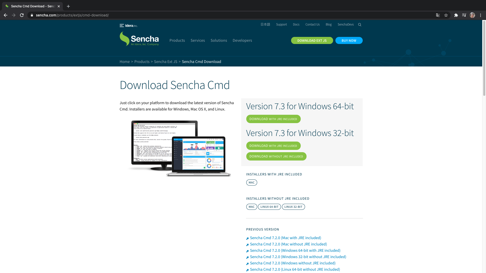

Después de dergarlo e instalarlo debemos ejecutar la siguiente instrucción para incluirlo en el `PATH` variable:

```sh
export PATH=~/bin/Sencha/Cmd/7.3.1.27:$PATH
```

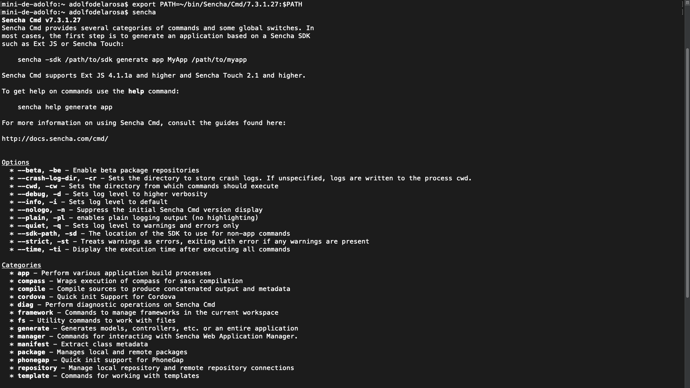

Con la siguiente instrucción vemos la versión de Sencha y la ubicación:

```sh
sencha which
```

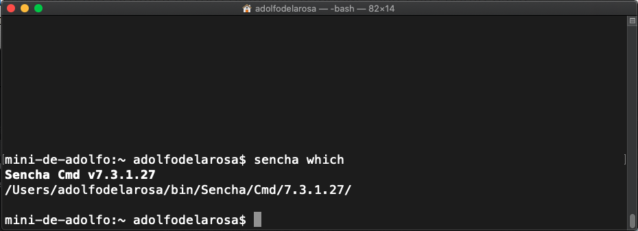

<hr>

## Generando la aplicación Ext JS usando Sencha Cmd

Abra la terminal(Mac)/command(Windows) y escriba el siguiente comando:

```sh
sencha generate app --ext MyApp ./myapp
```

El comando anterior creará un scaffold de una aplicación Ext JS llamada `MyApp` y colocará todos los archivos de la subcarpeta denominada `myapp`.

Tenga en cuenta que el comando anterior generará una aplicación que contiene código para ambos kits de herramientas: clásico y moderno. Si solo necesita el conjunto de herramientas clásico o moderno, entonces use `--modern` o `--classic`, como se muestra en el siguiente comando:

```sh
sencha generate app --ext --modern MyApp ./myapp
```

Cuando ejecute este comando por primera vez, debería descargar automáticamente Ext JS 6. Si no descarga Ext JS automáticamente, puede descargar manualmente Ext JS 6, extráelo a tu máquina local y usa el siguiente comando para especificar la ruta del SDK:

```sh
sencha -sdk /path/to/sdk generate app MyApp /path/to/myapp
```

Sencha Cmd es compatible con Ext JS 4.1.1a y superior y Sencha Touch 2.1 y superior. Tú puede tener varias versiones del SDK en su máquina. El anterior es el formato del comando para generar una aplicación basada en un Sencha SDK específico.

El siguiente comando es un ejemplo que generará la aplicación Ext JS 6 llamado MyApp en la ruta `/projects/extjs/myapp`:

```sh
sencha -sdk /bin/Sencha/ext/6.0.0/ generate app MyApp /projects/extjs/myapp
```

Ahora, para ver la aplicación Ext JS creada, ejecute el siguiente comando en el terminal o símbolo del sistema:

```sh
cd sample
sencha app watch
```

Ahora, esto realizará un montón de tareas relacionadas con la compilación y, al final, en la ventana de laterminal, verá algo similar en la Figura 1.1:

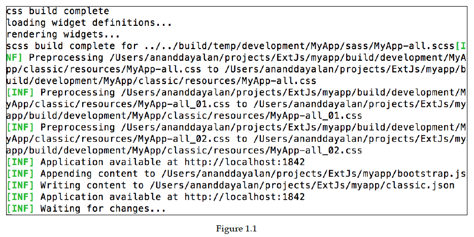
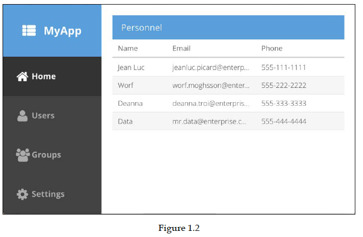
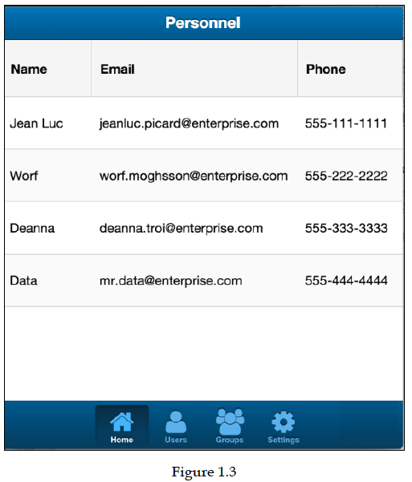
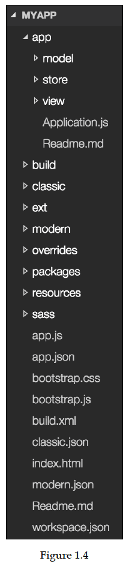
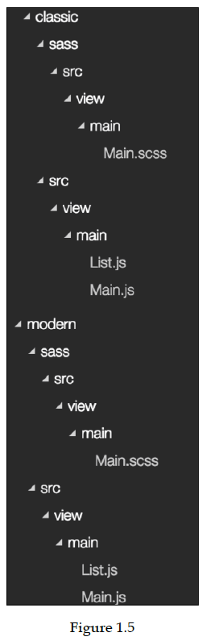
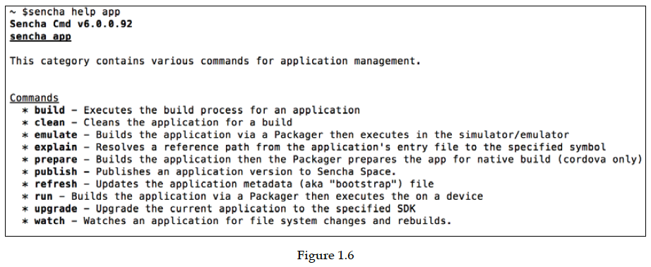
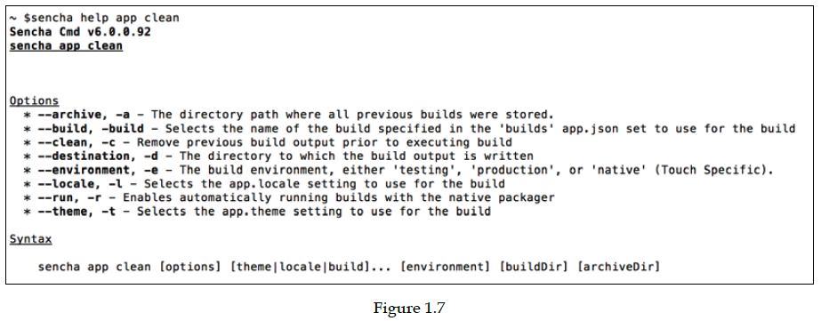
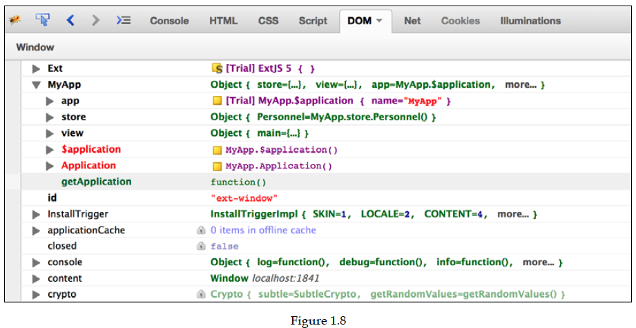
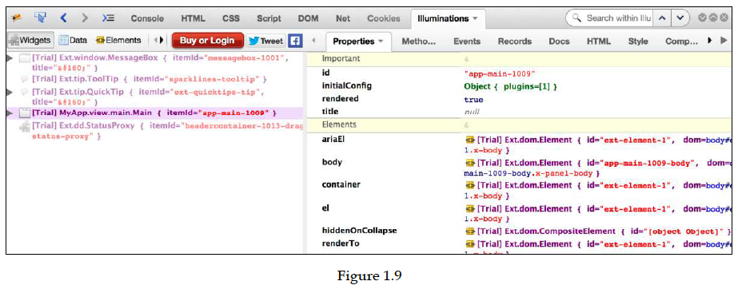
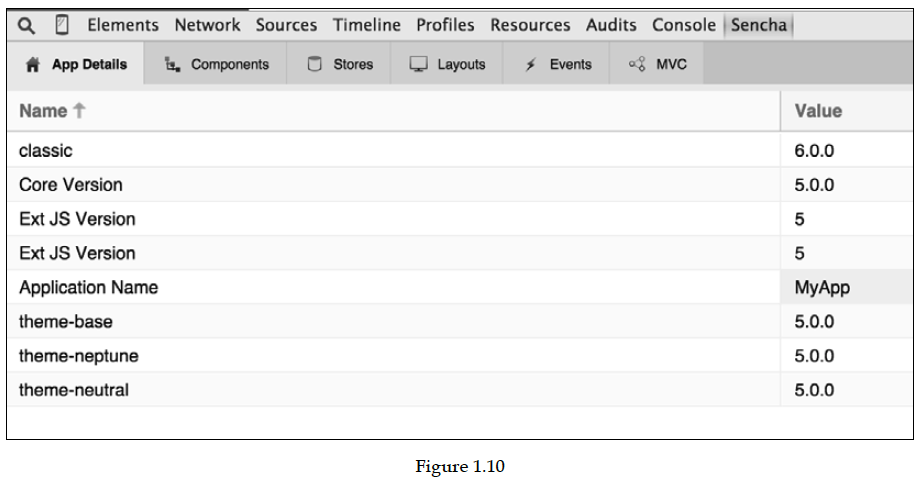
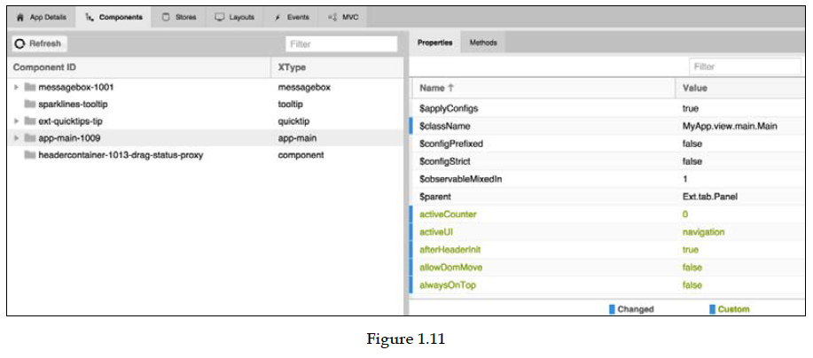
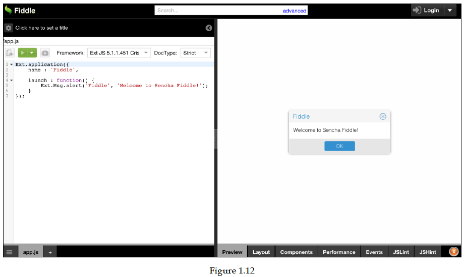
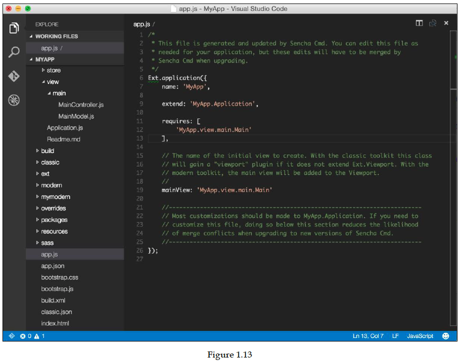


```sh
```
