# Capítulo 1: Empezando con Ext JS
* ¿Por qué Ext JS?
   * Compatibilidad con varios navegadores
   * Componentes de interfaz de usuario enriquecidos
   * Enlace bidireccional
   * Patrón Architectural para JavaScript
   * Simplificando una operación complicada
   * Fácil acceso a DOM
   * Enrutamiento del lado del cliente
   * Soporte para accesibilidad
* Una introducción a Ext JS
   * La aplicación universal
* Configuración de Ext JS
   * Sencha Cmd
      * Java Runtime Environment (JRE)
      * Ruby
      * Instalación de Sencha Cmd
* Generando la aplicación Ext JS usando Sencha Cmd
* The application architecture
   * Model
   * View
   * Controller
   * View model
      * View model – MainModel.js
      * Controller – MainController.js
      * View – main.js
* La arquitectura de la aplicación
   * Modelo
   * Vista
   * Controlador
   * Ver modelo
      * Ver modelo - MainModel.js
      * Controlador - MainController.js
      * Ver - main.js
* Explorando los comandos Sencha Cmd
   * El formato de comando Sencha
   * Ayuda
   * Actualización de Sencha Cmd
   * Generando una aplicación
   * Construyendo la aplicación
   * Lanzamiento de la aplicación
   * La generación de código
   * Actualización de su aplicación
* Depuración de una aplicación Ext JS
* Ilumination
   * Las características de la Illumination.
      * Nomenclatura de objetos
      * Elemento resaltado
* App Inspector
   * Sencha Fiddle
* El IDE de desarrollo
* Resumen

Atrás quedaron los días en que utilizaba JavaScript simple de Vanilla. JavaScript es un lenguaje excelente y poderoso, pero a muchos les resulta difícil mantener el código a medida que la aplicación web crece cada vez más. Por lo tanto, es muy difícil y requiere mucho tiempo manejar todo en JavaScript simple de Vanilla.

Cuando se trata de frameworks de JavaScript, existen frameworks de JavaScript del lado del cliente, así como frameworks de JavaScript del lado del servidor. Ext JS es un frameworks de JavaScript del lado del cliente.

Este capítulo trata básicamente de configurar el entorno de desarrollo con las herramientas necesarias, y veremos la introducción básica de Ext JS. En este capítulo, cubriremos los siguientes temas:

* Las ventajas de usar Ext JS
* Una introducción a Ext JS
* Configuración de Ext JS y Sencha Cmd
* Andamiaje de la aplicación Ext JS con Sencha Cmd
* La arquitectura de la aplicación
* Explorando los comandos de Sencha Cmd
* Depurar una aplicación Ext JS
* El IDE de desarrollo

## ¿Por qué Ext JS?
Ahora, echemos un vistazo a algunas de las ventajas de usar Ext JS sobre Vanilla JavaScript simple en su aplicación web.

### Compatibilidad con varios navegadores

Es posible que haya pasado varias horas o incluso días resolviendo los errores de varios navegadores. Por qué ¿Debería dedicar tiempo a esto en lugar de centrarse en la funcionalidad de su negocio? Por el contrario, si utiliza un buen framework, de JavaScript, como Ext JS, se encargará de la mayoría de estas tareas, y puede centrarse en la funcionalidad empresarial.

### Componentes de interfaz de usuario enriquecidos (Rich UI)

Ext JS viene con una gran cantidad de controles de interfaz de usuario enriquecidos, como data grid, tab
panels, tree controls, date picker, charts y estos deberían reducir mucho el tiempo de desarrollo.

### Two-way binding (Encuadernación bidireccional)

El enlace bidireccional significa que cuando los datos de la vista cambian, su modelo se actualiza automáticamente. Además, cuando su aplicación actualice el modelo, los datos serán propagado a la vista automáticamente.

Por ejemplo, tome la página de edición. Cuando carga la página, debe renderizar los datos del modelo al HTML, y cuando el usuario actualiza los datos en la vista, tiene que actualizar el modelo. No tienes que hacer esto de forma programática si usa Ext JS.

### Patrón Architectural para JavaScript

A medida que se mueve más y más código al cliente, se mantiene el lado del cliente, JavaScript se vuelve difícil. Al traer **MVC (Model View Controller)/MVVM (Model View, View Model)** en el lado del cliente, es más fácil mantener el lado del cliente Código JavaScript y aumenta la productividad. Se explican MVC y MVVM más adelante en este capítulo.

### Simplificando una operación complicada

Piense en escribir la llamada AJAX en JavaScript simple y asegúrese de admitir todos los navegadores también. Eche un vistazo al código fuente del método de llamada AJAX en cualquiera del marco de JavaScript. Piense en crear un control complejo como una cuadrícula en JavaScript simple con funciones, como paginación, clasificación, filtrado, agrupación,
navegación por teclado, campos editables, etc.

### Fácil acceso a DOM

En JavaScript simple, puede acceder al DOM, pero es un poco complicado.

### Enrutamiento(routing) del lado del cliente

En las aplicaciones web, el routing significa mapear la URL a las páginas web y la lógica detrás de eso. El enrutamiento puede realizarse tanto en el lado del servidor como en el del cliente. Típicamente, El enrutamiento del cliente se utiliza en una **Single-Page Application (SPA)**.

### Apoyo a la accesibilidad

Accesibilidad significa que el contenido de la aplicación debe ser fácilmente accesible para las personas que tienen deficiencias visuales y dependen de tecnologías de asistencia (como pantallas lectores). Desarrollar una aplicación con muy buen soporte para la accesibilidad es muy dificil.

En EE. UU., Si está desarrollando software que será utilizado por el gobierno federal y estatal empleados, entonces, en la mayoría de los casos, debe asegurarse de que su solicitud sea accesible según la *Sección 508*. Muy pocos frameworks de JavaScript proporcionan muy buenos apoyo a la accesibilidad. Ext JS proporciona un excelente soporte para la accesibilidad.

**World Wide Web Consortium (W3C)** ha creado una especificación técnica llamada **WAI-ARIA (Web Accessibility Initiative - Accessible Rich Internet Applications)**. Esto define formas de hacer que la aplicación web sea accesible para personas con discapacidades. Ext JS tiene un excelente soporte para esto, y todos los controles/widgets en Ext JS son accesibles y no requiere ningún código adicional ni trabajo de su parte.

## Una introducción a Ext JS

Ext JS es casi una ventanilla única para desarrollar aplicaciones de interfaz de usuario enriquecidas. Proporciona MVC,
MVVM, enlace bidireccional, compatibilidad entre navegadores, enrutamiento, un amplio conjunto de componentes de interfaz de usuario enriquecidos, gráficos, etc. Ext JS también tiene una excelente documentación para todas las API en el framework. Ext JS se construyó originalmente como una extensión de library complementaria de YUI de Jack Slocum, ahora es un producto de Sencha Inc.

En Ext JS, escribirás la mayor parte de tu código en JavaScript. Sobre todo, no es necesario escribir HTML. Ext JS se envía con un gran conjunto de componentes de interfaz de usuario enriquecidos, que es una gran ahorre tiempo en su desarrollo.

Todo el código de ejemplo y el código de proyectos de muestra de este libro utilizarán la última versión de Ext JS Versión 6, pero aún la mayoría del código es compatible con el Ext JS anterior Versión 5. La mayoría de los conceptos en Ext JS 5 y Ext JS 6 son los mismos. Entonces, si está usando Ext JS 5, aún puede obtener un gran beneficio de este libro. Sin embargo, recuerde algunos de el código de este libro no se ejecutará en Ext JS 5 y es posible que necesite algunas modificaciones menores para que se ejecute en Ext JS 5.

El cambio más importante en Ext JS 6 es que fusiona dos marcos: Ext JS y Sencha Touch en un solo marco. Ext JS 6 también trajo un nuevo compilador SASS llamado Moda, mejoras en gráficos 3D, etc.

Para entender por qué ocurrió la fusión de Ext JS y Sencha Touch, necesitamos mira hacia atrás un poco.

Sencha Touch era un producto independiente que se especializaba en la creación de aplicaciones táctiles para móviles y tablets. Aprovecha las técnicas de aceleración de hardware para proporcionar componentes de interfaz de usuario de alto rendimiento para dispositivos móviles.

Ext JS 4 y Ext JS 5 se utilizan principalmente para desarrollar aplicaciones web para el escritorio. Si ha creado una aplicación web para el escritorio en Ext JS 5 o Ext JS 4, que seguirá funcionando en un dispositivo móvil y una tableta, pero no tendrá algunas de las funciones táctiles específicas funcionalidades y no aprovechará las técnicas de aceleración de hardware para proporcionar componentes de interfaz de usuario de alto rendimiento para dispositivos móviles. Entonces, para brindar un mejor soporte a los dispositivos móviles dispositivos, se les dijo a los desarrolladores de Sencha que usaran Sencha Touch.

Hay muchas ventajas de usar Sencha Touch. Solicitudes escritas en Sencha tendrá el aspecto nativo de la plataforma móvil y el rendimiento será mejor. Sin embargo, muchos desarrolladores se quejaron de esto porque se vieron obligados a mantener dos conjuntos de código base para la misma aplicación.

Aunque Sencha Touch y Ext JS son un producto totalmente diferente con muchas diferencias, tenían un código común compartido; los conceptos e ideas tanto de los frameworks son muy similares. Si conoce Ext JS, entonces es extremadamente fácil de aprender Sencha Touch.

Durante mucho tiempo, muchos usuarios de Ext JS y Sencha Touch se preguntaron por qué no fusionar ambos productos en un solo producto y lleve las capacidades táctiles a Ext JS. En Ext JS 6, Sencha tomó la decisión de fusionar ambos productos en un solo producto. Ahora, en Ext JS 6, puede mantener un solo código. Para algunas de las vistas, puede necesita tener un código de vista separado, pero habrá mucho código compartido.

En Ext JS 6, fusionaron el código común y lo pusieron como un core framework(marco central), y trajeron un concepto llamado kit de herramientas. Un **toolkit** (kit de herramientas) es un paquete con componentes visuales, como botones, paneles, etc. Hay dos toolkit: clásico y moderno. Los componentes visuales de Ext JS se colocan en el toolkit clásico y los componentes Sencha Touch se colocan en el toolkit moderno.

Ahora, en Ext JS 6, simplemente puede elegir el toolkit que desea apuntar. Si usted es Al escribir una aplicación que solo se dirija a dispositivos móviles, puede elegir moderna y si su orientación solo es para computadoras de escritorio, puede elegir el conjunto de herramientas clásico.

### La aplicación universal

Si desea orientar sus aplicaciones a dispositivos móviles y de escritorio, en Ext JS 6, puede crear una aplicación universal, que utilizará ambos toolkit. En lugar de agregar la configuración del toolkit mencionado anteriormente, debe agregar la siguiente sección builds config que especifica qué compilación usa qué toolkit y tema:

```js
"builds": {
   "classic": {
      "toolkit": "classic",
      "theme": "theme-triton"
   },
   "modern": {
      "toolkit": "modern",
      "theme": "theme-neptune"
   }
},
```

La idea básica aquí es tener dos conjuntos de herramientas en un solo framework para poder segmentar el escritorio y los dispositivos móviles.

Si es totalmente nuevo en Ext JS, estos pueden ser un poco confusos para usted ahora, pero no se preocupe mucho por eso ahora. Esto tendrán más sentido más adelante cuando trabajemos en el muestras y código de ejemplo.

Ext JS 6 se envía con dos conjuntos de temas para el toolkit clásico y el toolkit moderno. Hay temas específicos en Ext JS, que proporciona aspectos nativos para Windows, Android y iPhone. Aprenderá sobre temas más adelante en el *Capítulo 8, Temas y Diseño de respuesta*.

## Configuración de Ext JS

Para facilitar el desarrollo de su aplicación Ext JS, debe instalar una herramienta llamada Sencha Cmd. Está disponible para Windows, Mac y Linux.

> **NOTA: Sencha Cmd no es imprescindible para la aplicación de desarrollo de Ext JS, pero usarlo te hace la vida más fácil. Entonces, es muy recomendable utilizar Sencha Cmd.

### Sencha Cmd

Sencha Cmd es una poderosa herramienta de línea de comandos para el desarrollo de aplicaciones de Sencha.
Ayuda a aumentar la productividad al automatizar muchas tareas. Algunos de las características son scaffolding, package management, JS compiler, build scripts, theming, etcétera.

Antes de instalar Sencha Cmd 6, necesita JRE, y si va a usar ExtJS 5 y Sencha Cmd 5, entonces también necesitarás Ruby.

### Entorno de ejecución de Java (JRE)

Para comprobar si Java se está ejecutando en su máquina, escriba el siguiente comando en la terminal (Mac) o la ventana de comandos (Windows):


```sh
java -version
```

Si ya tiene Java ejecutándose en su máquina, entonces debería ver algo similar al siguiente código; de lo contrario, descargue e instale JRE o JDK:

```sh
java -version
java version "1.8.0_25"
Java(TM) SE Runtime Environment (build 1.8.0_25-b17)
Java HotSpot(TM) 64-Bit Server VM (build 25.25-b02, mixed mode)
```

Si aún recibe un error, es posible que deba agregar la ruta instalada a la `PATH` variable.

### Ruby

Tenga en cuenta que no necesita Ruby si va a utilizar Sencha Cmd 6, pero si va a usar Ext JS 5 y Sencha Cmd 5, entonces necesitará Ruby. Para comprobar si Ruby está instalado en su máquina, escriba el siguiente comando en la terminal (Mac) o la ventana de comandos (Windows):

```sh
ruby --versión
```

Si ya tiene Ruby instalado en su máquina, entonces debería ver algo similar al siguiente código; de lo contrario, descargue e instale Ruby:

```sh
ruby --version
ruby 2.0.0p481 (2014-05-08 revision 45883) [universal.x86_64-darwin14]
```

Si aún recibe un error, es posible que deba agregar la ruta instalada a la `PATH` variable.

### Instalación de Sencha Cmd

Ahora, descargue e instale Sencha Cmd desde el sitio web de Sencha. Una vez instalado, asegúrese de que Sencha Cmd esté disponible para su uso desde la terminal o command window. Para comprobarlo, ejecute el siguiente comando:

```sh
sencha which
```

Si está disponible en la terminal o en la ventana de comandos, debería tener algo similar al siguiente código:

```sh
Sencha Cmd v6.0.0.92
/bin/Sencha/Cmd/6.0.0.92/
```

Si obtiene un error en su lugar, es posible que deba agregar la ruta instalada a la `PATH` variable. En Mac, ejecute el siguiente comando en la terminal para agregar el `PATH` variable:

```sh
export PATH=~/bin/Sencha/Cmd/6.0.0.92:$PATH
```

> **NOTA:** En el comando anterior, cambie `/bin/Sencha/Cmd/6.0.0.92` con la ruta de instalación correcta.

En Windows, ejecute el siguiente comando en el Command Prompt para agregar el `PATH` variable:

```sh
set PATH=%PATH%;C:\Sencha\Cmd\6.0.0.92
```

> **NOTA:** En el comando anterior, cambie `/bin/Sencha/Cmd/6.0.0.92` con la ruta de instalación correcta.

### :red_circle: Instalación de la Última Versión Disponible 7.3.0
#### (No la del Libro)

Entre al URL [Try Sencha Ext JS](https://www.sencha.com/products/extjs/evaluate/).

Existen dos formas de instalar la aplicación:

Descargando el ZIP o con NPM


Al seguir los pasos con NPM nos genera la aplicación que se carga en el URL http://localhost:1962/:


Si queremos documentación más detallado lo podemos hacer en la siguiente URL:

https://docs.sencha.com/extjs/7.2.0/guides/getting_started/getting_started_with_npm.html


### 🔴 Instalación de Sencha Cmd en mi equipo

Descargamos Sencha CMD del siguiente URL: https://www.sencha.com/products/extjs/cmd-download/


Después de dergarlo e instalarlo debemos ejecutar la siguiente instrucción para incluirlo en el `PATH` variable:

```sh
export PATH=~/bin/Sencha/Cmd/7.3.1.27:$PATH
```


Con la siguiente instrucción vemos la versión de Sencha y la ubicación:

```sh
sencha which
```


<hr>

## Generando la aplicación Ext JS usando Sencha Cmd

Abra la terminal(Mac)/command(Windows) y escriba el siguiente comando:

```sh
sencha generate app --ext MyApp ./myapp
```

El comando anterior creará un scaffold de una aplicación Ext JS llamada `MyApp` y colocará todos los archivos de la subcarpeta denominada `myapp`.

Tenga en cuenta que el comando anterior generará una aplicación que contiene código para ambos toolkit: ***clásico y moderno***. Si solo necesita el conjunto de herramientas clásico o moderno, entonces use `--modern` o `--classic`, como se muestra en el siguiente comando:

```sh
sencha generate app --ext --modern MyApp ./myapp
```

Cuando ejecute este comando por primera vez, debería descargar automáticamente Ext JS 6. Si no descarga Ext JS automáticamente, puede descargar manualmente Ext JS 6, extráelo a tu máquina local y usa el siguiente comando para especificar la ruta del SDK:

```sh
sencha -sdk /path/to/sdk generate app MyApp /path/to/myapp
```

Sencha Cmd es compatible con Ext JS 4.1.1a y superior y Sencha Touch 2.1 y superior. Tú puede tener varias versiones del SDK en su máquina. El anterior es el formato del comando para generar una aplicación basada en un Sencha SDK específico.

El siguiente comando es un ejemplo que generará la aplicación Ext JS 6 llamado MyApp en la ruta `/projects/extjs/myapp`:

```sh
sencha -sdk /bin/Sencha/ext/6.0.0/ generate app MyApp /projects/extjs/myapp
```

Ahora, para ver la aplicación Ext JS creada, ejecute el siguiente comando en el terminal o símbolo del sistema:

```sh
cd sample
sencha app watch
```

Ahora, esto realizará un montón de tareas relacionadas con la compilación y, al final, en la ventana de laterminal, verá algo similar en la Figura 1.1:


El reloj monitorea cualquier cambio de código realizado, y tan pronto como se realicen los cambios de código guardado, actualizará el navegador para incluir los cambios de código actualizados.

Si abre la aplicación con la URL predeterminada (`http://localhost:1842`), como mostrado antes, la aplicación se verá similar a la Figura 1.2:


De forma predeterminada, cuando navega a la URL (`http://localhost:1842`) desde un computadora de escritorio, la aplicación para mostrar se detecta automáticamente y le muestra ek toolkit clásico. Si se accede a este desde un navegador móvil, le mostrará el toolkit moderno. Para ver la aplicación moderna en la computadora de escritorio, agregue a la URL `?profile=modern`, y verá la siguiente captura de pantalla:


El contenido de **MyApp** se verá como se muestra en la Figura 1.4. Echaremos un vistazo a algunos de los archivos importantes de esta aplicación de muestra.

La aplicación contiene `model`, `store` y `application`. Considere un `store` como una colección de instancias del modelo. El `store` carga datos usando el proxy y proporciona funcionalidades, como ordenar, filtrar, paginar, etc. Aprenderás más
sobre `store` más tarde.

En la siguiente captura de pantalla, vea las carpetas modernas y clásicas. Estas carpetas contienen el código de la aplicación que utiliza los respectivos toolkit: moderno y clásico.


La figura 1.5 muestra el contenido de la carpeta clásica y la carpeta moderna. El clásico carpeta y la carpeta moderna contiene la carpeta src que contiene vistas de la aplicación. El archivo `main.scss` contiene los estilos específicos para dispositivos móviles y el escritorio. Existe la carpeta `sass` en la raíz que contiene el estilo de aplicación común.

***SASS (Syntactically Awesome Stylesheets)*** es un lenguaje de hojas de estilo. SASS es muy utilizado en Ext JS. Aprenderá más sobre el estilo y la temática más adelante en el *Capítulo 8, Theming y Responsive Design*.

Tenga en cuenta que estos no son el código del kit toolkit, sino el código de la aplicación. Puede encontrar el código del toolkit clásico y moderno del framework en la carpeta `ext`:


En la siguiente sección, veremos MVC y el contenido que algunos de estos archivos generados usando Sencha Cmd en la aplicación de muestra MyApp.

### 🔴 Generando la aplicación Ext JS usando Sencha Cmd

Para crear la aplicación con Sencha CMD me coloco en la carpeta que tiene mis proyectos EXT JS, en este caso la carpeta se llama `PROYECTOS-SENCHA` y escribimos el siguiente comando:

```sh
sencha generate app --ext MyApp ./myapp
```

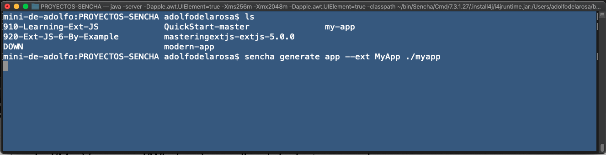

Esto empieza a descargar todo lo necesario para crear la aplicación EXT JS.

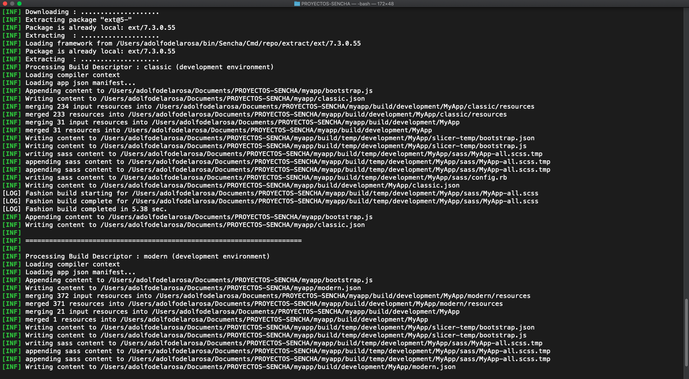

Al finalizar vemos que ya tenemos una nueva carpeta llamada `myapp` que contiene nuestro proyecto.

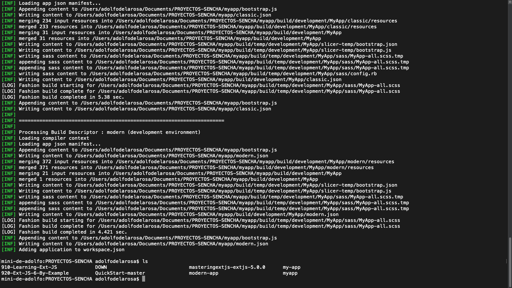

Ahora, para ver la aplicación Ext JS creada, ejecutemos el siguiente comando en el terminal o símbolo del sistema:

```sh
cd myapp
sencha app watch
```

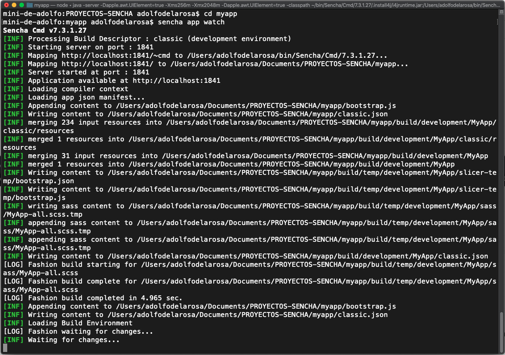

Como vemos en el log que nos presenta nos indica que nuestra aplicación ha sido levantada en el URL http://localhost:1841, si lo abrimos tenemos nuestra aplicación:

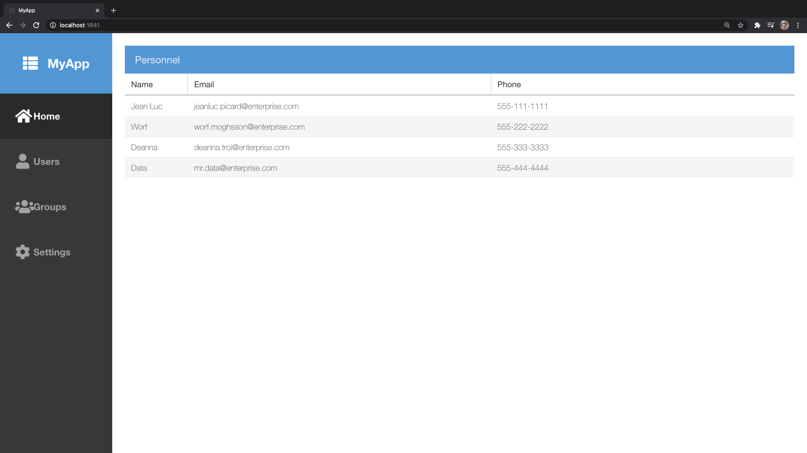


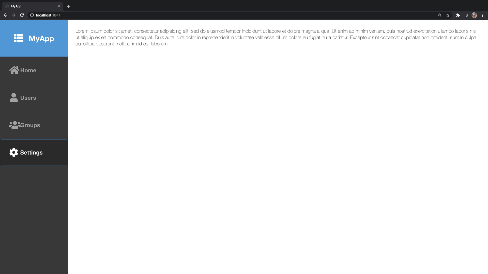

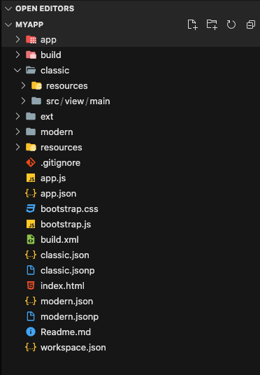
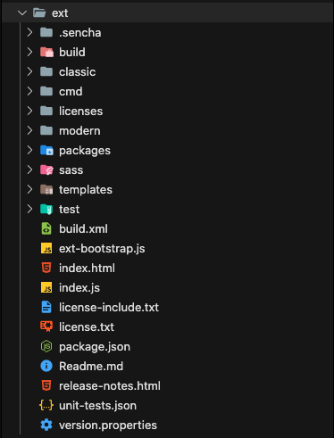
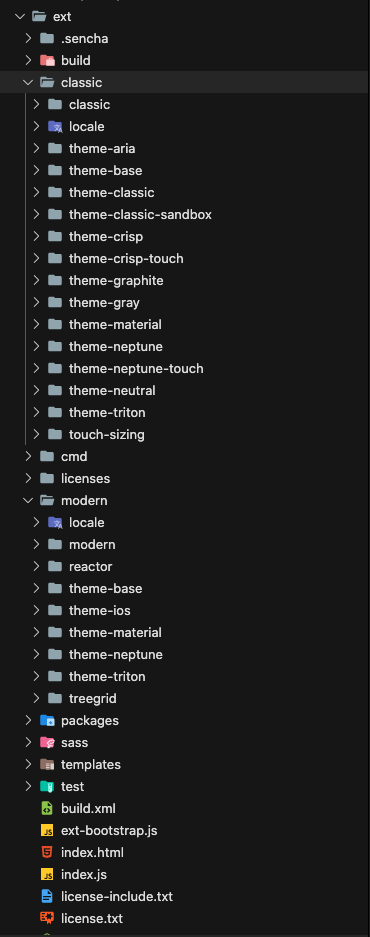

## The application architecture

Ext JS proporciona soporte para arquitecturas de aplicaciones MVC y MVVM.

### Model

Esto representa la capa de datos. El modelo puede contener validación de datos y lógicas para persistir los datos. En Ext JS, principalmente el modelo se usa junto con un data store(almacén de datos).

### View

Esto representa la interfaz de usuario. Componentes como button, form y message box son views.

### Controller

Esto maneja cualquier lógica relacionada con la vista, manejo de eventos de la vista y cualquier lógica de aplicación.

### View model

Esto encapsula la lógica de presentación requerida para la vista, vincula los datos a la vista y maneja las actualizaciones cada vez que se modifican los datos.

Ahora, examinemos algunos de los archivos creados por Sencha Cmd para la view, controller y view model.

Si abre `app.js`, verá el siguiente código, que es el código de inicio de su Aplicación Ext JS:

```js
Ext.application({
   name: 'MyApp',

   extend: 'MyApp.Application',

   requires: [
   'MyApp.view.main.Main'
   ],
   mainView: 'MyApp.view.main.Main'
});
```

En el código anterior, la primera línea define el nombre de la aplicación y en la siguiente línea extiende `MyApp.Application`, que se declara en `Application.js` en la carpeta `app`:

```js
   extend: 'MyApp.Application'
```

La lista de clases requeridas para esta clase debe especificarse en la sección `requires`. Estos se cargarán primero antes de crear una instancia de esta clase. La última línea especifica el nombre de la vista inicial a crear.

### 🔴

```js
/*
 * This file launches the application by asking Ext JS to create
 * and launch() the Application class.
 */
Ext.application({
   extend: 'MyApp.Application',

   name: 'MyApp',

   requires: [
      // This will automatically load all classes in the MyApp namespace
      // so that application classes do not need to require each other.
      'MyApp.*'
   ],

   // The name of the initial view to create.
   mainView: 'MyApp.view.main.Main'
});
```

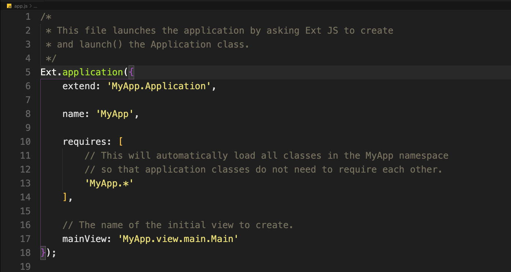


A continuación, si comprueba la carpeta `app`, verá `Application.js` y `model`, `view`, `store`, etc.


En el archivo `application.js`, verá el siguiente código:

```js
Ext.define('MyApp.Application', {
   extend: 'Ext.app.Application',
   name: 'MyApp',
   stores: [
   // TODO: add global / shared stores here
   ],
   launch: function () {
   // TODO - Launch the application
   }
});
```

Aquí, puede ver que `MyApp.Application` extiende `Ext.app.Application`. La función `launch` se define en `Ext.app.Application`. Esta función se llama después de se carga la página.

La store en `application.js` no es más que el almacenes de datos. Aprenderás sobre los store en detalles más adelante en los próximos capítulos.

### 🔴 

`Application.js`

```js
/**
 * The main application class. An instance of this class is created by app.js when it
 * calls Ext.application(). This is the ideal place to handle application launch and
 * initialization details.
 */
Ext.define('MyApp.Application', {
   extend: 'Ext.app.Application',

   name: 'MyApp',

   quickTips: false,
   platformConfig: {
      desktop: {
         quickTips: true
      }
   },

   onAppUpdate: function () {
      Ext.Msg.confirm('Application Update', 'This application has an update, reload?',
         function (choice) {
            if (choice === 'yes') {
               window.location.reload();
            }
         }
      );
   }
});
```

#### View model – MainModel.js

Eche un vistazo a `MainModel.js` en `\app\view\main\`. Esta clase es el view model para la vista `Main` de la aplicación. El modelo `view` se extiende desde `Ext.app.ViewModel`, como se muestra en el siguiente código:

```js
Ext.define('MyApp.view.main.MainModel', {
   extend: 'Ext.app.ViewModel',

   alias: 'viewmodel.main',

   data: {
      name: 'MyApp',
      loremIpsum: 'Lorem ipsum dolor sit amet, consectetur adipisicing elit, sed do eiusmod tempor incididunt ut labore et
dolore magna aliqua. Ut enim ad minim veniam, quis nostrud exercitation ullamco laboris nisi ut aliquip ex ea commodo
consequat. Duis aute irure dolor in reprehenderit in voluptate velit esse cillum dolore eu fugiat nulla pariatur. Excepteur sint occaecat cupidatat non proident, sunt in culpa qui officia deserunt mollit anim id est laborum.'
   }
});
```

### 🔴 

`MainModel.js`

```js
/**
 * This class is the view model for the Main view of the application.
 */
Ext.define('MyApp.view.main.MainModel', {
   extend: 'Ext.app.ViewModel',

   alias: 'viewmodel.main',

   data: {
      name: 'MyApp',

      loremIpsum: 'Lorem ipsum dolor sit amet, consectetur adipisicing elit, sed do eiusmod tempor incididunt ut labore et dolore magna aliqua. Ut enim ad minim veniam, quis nostrud exercitation ullamco laboris nisi ut aliquip ex ea commodo consequat. Duis aute irure dolor in reprehenderit in voluptate velit esse cillum dolore eu fugiat nulla pariatur. Excepteur sint occaecat cupidatat non proident, sunt in culpa qui officia deserunt mollit anim id est laborum.'
   }

   //TODO - add data, formulas and/or methods to support your view
});
```

#### Controller – MainController.js

Esta clase es el controlador de la vista para la vista `main` de la aplicación. En el siguiente código, puede ver que la función `onItemSelected` está definida; esto se llamará cuando se selecciona un elemento del grid en la vista.

```js
Ext.define('MyApp.view.main.MainController', {
   extend: 'Ext.app.ViewController',

   alias: 'controller.main',

   onItemSelected: function (sender, record) {
      Ext.Msg.confirm('Confirm', 'Are you sure?', 'onConfirm', this);
   },

   onConfirm: function (choice) {
      if (choice === 'yes') {
         //
      }
   }
});
```

Hay dos tipos de controladores: `Ext.app.ViewController` y `Ext.app.Controller`.

Aprenderá sobre su diferencia y uso más adelante en los próximos capítulos.

### 🔴 

`MainController.js`

```js
/**
 * This class is the controller for the main view for the application. It is specified as
 * the "controller" of the Main view class.
 */
Ext.define('MyApp.view.main.MainController', {
   extend: 'Ext.app.ViewController',

   alias: 'controller.main',

   onItemSelected: function (sender, record) {
      Ext.Msg.confirm('Confirm', 'Are you sure?', 'onConfirm', this);
   },

   onConfirm: function (choice) {
      if (choice === 'yes') {
         //
      }
   }
});
```

#### View – main.js

Si ha utilizado Sencha Cmd 6, y si generó la aplicación solo para el toolkits clásico o moderno con `--classic` o `--modern`, luego encontrará el archivo `main.js` en la carpeta `\app\view\main\`, pero si ha utilizado Sencha Cmd 6 para generar una aplicación universal, puede encontrar dos archivos `main.js` ubicados en dos rutas:

`\classic\src\view\main\` y `\modern\src\view\main\`.

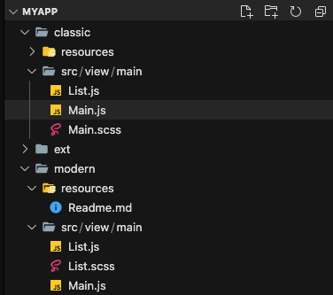

Antes de ver el contenido de este archivo, repasemos el trasfondo detrás de estos dos archivos `main.js` en dos rutas diferentes.

Anteriormente en este capítulo, aprendió cómo Ext JS 6 fusiona Sencha Ext JS y Sencha Touch en un framework. Como resultado, se crea un framework único con dos toolkits.

El núcleo de estos dos framework se mueve a una library común y se divide el resto del código en dos partes: clásico y moderno. El código Ext JS tradicional se trasladó al toolkit clásico y al código moderno que admite la función táctil y HTML5 se trasladan al toolkit moderno.

Las aplicaciones que comparten los recursos básicos y la lógica y utilizan ambos toolkits son llamadas aplicaciones universales.

Ahora, echemos un vistazo al archivo de vista `main.js` en modern:


```js
Ext.define('MyApp.view.main.Main', {
   extend: 'Ext.tab.Panel',
   xtype: 'app-main',

   requires: [
   'Ext.MessageBox',
   'MyApp.view.main.MainController',
   'MyApp.view.main.MainModel',
   'MyApp.view.main.List'
   ],

   controller: 'main',
   viewModel: 'main',

   defaults: {
      styleHtmlContent: true
   },

   tabBarPosition: 'bottom',

   items: [
   {
      title: 'Home',
      iconCls: 'fa-home',
      layout: 'fit',
      items: [{
         xtype: 'mainlist'
      }]
   },{
      title: 'Users',
      iconCls: 'fa-user',
      bind: {
         html: '{loremIpsum}'
   }
   },{
      title: 'Groups',
      iconCls: 'fa-users',
      bind: {
         html: '{loremIpsum}'
      }
   },{
      title: 'Settings',
      iconCls: 'fa-cog',
      bind: {
         html: '{loremIpsum}'
      }
   }
   ]
});   
```

Esta vista de muestra define `controller`, `viewmodel` y otras clases de dependencia required, crea cuatro tabs y vincula la propiedad `loremIpsum` de `ViewModel`. Usted aprenda más sobre esto en detalle en los próximos capítulos.

Ahora, echemos un vistazo a `main.js` en `\classic\src\view\main\`:

```js
Ext.define('NewApp.view.main.Main', {
   extend: 'Ext.tab.Panel',
   xtype: 'app-main',

   requires: [
   'Ext.plugin.Viewport',
   'Ext.window.MessageBox',

   'NewApp.view.main.MainController',
   'NewApp.view.main.MainModel',
   'NewApp.view.main.List'
   ],
   
   controller: 'main',
   viewModel: 'main',

   ui: 'navigation',
   
   tabBarHeaderPosition: 1,
   titleRotation: 0,
   tabRotation: 0,
   
   header: {
      layout: {
         align: 'stretchmax'
      },
      title: {
         bind: {
            text: '{name}'
         },
         flex: 0
      },
      iconCls: 'fa-th-list'
   },

   tabBar: {
      flex: 1,
      layout: {
         align: 'stretch',
         overflowHandler: 'none'
      }
   },
   
   responsiveConfig: {
      tall: {
         headerPosition: 'top'
      },
      wide: {
         headerPosition: 'left'
      }
   },
   
   defaults: {
      bodyPadding: 20,
      tabConfig: {
         plugins: 'responsive',
         responsiveConfig: {
            wide: {
               iconAlign: 'left',
               textAlign: 'left'
            },
            tall: {
               iconAlign: 'top',
               textAlign: 'center',
               width: 120
            }
         }
      }
   },

   items: [{
      title: 'Home',
      iconCls: 'fa-home',
      items: [{
         xtype: 'mainlist'
      }]
   }, {
      title: 'Users',
      iconCls: 'fa-user',
      bind: {
         html: '{loremIpsum}'
      }
   }, {
      title: 'Groups',
      iconCls: 'fa-users',
      bind: {
         html: '{loremIpsum}'
      }
   }, {
      title: 'Settings',
      iconCls: 'fa-cog',
      bind: {
         html: '{loremIpsum}'
      }
   }]`
});            
```

En el código anterior, puede ver que el contenido de los elementos es casi el mismo que en el toolkit moderno. Además, puede ver que este archivo tiene alguna configuración que es específico para el diseño responsive. La siguiente línea en el código anterior le dice al framework para usar el componente de estilo de interfaz de usuario llamado `navigation`:

```js
   ui: 'navigation'
```

Aprenderá más sobre la configuración de la interfaz de usuario y el diseño responsive más adelante en el Capítulo 8, Theming y Responsive Design.

Del mismo modo, si echas un vistazo a `List.js` en classic y modern, solo encontrarás algunas diferencias menores.

## Explorando los comandos Sencha Cmd

Ahora, exploremos algunos de los comandos útiles en Sencha Cmd.

### El formato de comando Sencha

Los comandos de Sencha tienen el siguiente formato:

```sh
sencha [category] [command] [options...] [arguments…]
```

Hay muchos comandos y opciones disponibles en Sencha Cmd. Echemos un vistazo a algunos de los comandos importantes.

### Help

Si simplemente escribe el siguiente comando, obtendrá una lista de categorías, una lista de nivel superior comandos y opciones disponibles:

```sh
sencha help
```

Para obtener ayuda sobre un tipo de categoría en particular, el nombre de la categoría, seguido de help, para por ejemplo, para obtener ayuda sobre una aplicación de categoría, ejecute el siguiente comando:

```sh
sencha help app
```

Esto producirá el siguiente resultado:


Si además desea obtener ayuda sobre los comandos de subcategoría en la aplicación, puede simplemente agregue el comando al final para limpiar, como se muestra en el siguiente código:

```sh
sencha help app clean
```

Esto le dará el siguiente resultado:


### Actualización de Sencha Cmd

Si desea verificar si hay actualizaciones disponibles para Sencha Cmd, use el siguiente comando:

```sh
sencha upgrade --check
```

Si desea actualizar Sencha Cmd, simplemente elimine la opción `--check`, como se muestra en el siguiente código:

```sh
sencha upgrade
```

### Generando una aplicación

Sencha Cmd es compatible con Ext JS 4.1.1a y superior y Sencha Touch 2.1 y superior.
Puede tener varias versiones del SDK en su máquina. Aquí está el formato de el comando para generar una aplicación basada en un Sencha SDK, como Ext JS o Sencha Touch:

```sh
sencha -sdk /path/to/sdk generate app [--modern/classic] MyApp /path/to/myapp
```

Este es un ejemplo que generará la aplicación Ext JS 6 llamada `MyApp` bajo la ruta `/Users/SomeUser/projects/extjs/myapp`:

```sh
sencha -sdk /Users/SomeUser/bin/Sencha/Cmd/repo/extract/ext/6.0.0/
generate app MyApp /Users/SomeUser/projects/extjs/myapp
```

### Construyendo la aplicación

El siguiente comando construirá HTML, JS, SASS, etc.

```sh
sencha app build
```

En Sencha Cmd 6 y Ext JS 6, también puede ejecutar uno de los siguientes códigos para elegir ya sea moderno o clásico:

```sh
sencha app build modern
sencha app build classic
```

Aquí, `modern` y `classic` se refiere a la configuración de compilaciones en `app.json`. Por defecto, Sencha Cmd pone dos configuraciones de compilación: clásica y moderna en `app.json;` usted puede agregue la configuración de compilación adicional si es necesario.

### Lanzamiento de la aplicación

El comando watch se puede utilizar para reconstruir e iniciar la aplicación. Esto no solo inicia la aplicación, pero también supervisa cualquier cambio de código realizado, y tan pronto como los cambios de código se guardan, actualizará el navegador para incluir el código actualizado cambie de la siguiente manera:

```sh
sencha app watch
```

En Sencha Cmd 6 y Ext JS 6, también puede ejecutar uno de los siguientes códigos para elegir ya sea moderno o clásico:

```sh
sencha app watch modern
sencha app watch classic
```

### La generación de código

Con Sencha Cmd, puede generar el código Ext JS, como views, controller y model:

```sh
sencha generate view myApp.MyView
sencha generate model MyModel id:int,fname,lname
sencha generate controller MyController
```

Si no se especifica el tipo de campo al generar el modelo, el tipo de campo predeterminado se utilizará un string.

### Actualización de su aplicación

Sencha Cmd facilita la actualización de una versión del SDK a otra. Utilice el comando de actualización en la categoría `app` para actualizar al nuevo framework:

```sh
sencha app upgrade [ path-to-new-framework ]
```

## Depuración de una aplicación Ext JS

Puede utilizar el depurador predeterminado del navegador para depurar el código Ext JS, pero el depurar el código Ext JS es mucho más fácil con un complemento de Firefox llamado Illumination o el Complemento App Inspector para Chrome.

## Ilumination

La iluminación es una herramienta de terceros. No es un producto de Sencha, y ahora mismo, es solo disponible para Firefox y requiere Firebug.

### Las características de la Illumination.

Estas son algunas de las características del complemento Illumination. Esto reducirá la cantidad de tiempo que dedicó a la depuración.

#### Object naming

La Illumination reconocerá los componentes Ext JS fácilmente, por lo que en la pestaña de Illumination verá los nombres de los componentes Ext JS como `Ext.panel.Panel` en lugar de mostrar verá `Object` en la pestaña DOM de Firebug.

#### Elemento highlighting

Si pasa el cursor sobre cualquiera de los objetos en la ventana Illumination, resaltará el componente completo en la página HTML.

##### El menú contextual

Un componente Ext JS se compone de varios elementos HTML. Si hace clic derecho en la página y seleccione el menú contextual de Firebug, se le llevará al elemento anidado en el componente Ext JS, pero si selecciona el menú contextual de Illumination, se mostrará el componente Ext JS que hace que sea más fácil examinar el componente y sus métodos, propiedades y eventos.

Verifique la pestaña **DOM** de Firebug en la Figura 1.8 y vea cómo se representan los objetos:


Ahora, revise la pestaña Illumination en la Figura 1.9 y vea cómo se representan los objetos. Puede ver que Illumination reconoce todo el componente Ext JS, como se muestra en la siguiente captura de pantalla:


Aunque Illumination facilita la depuración de la aplicación Ext JS, no es una obligación. La Illumination no es una herramienta gratuita. Entonces, si no quiere pagar por ello, todavía puede usar Firebug para depurar, pero es posible que deba dedicar un poco más de tiempo para depurar, o es posible que deba echar un vistazo a App Inspector o Sencha Fiddle.

## App Inspector

App Inspector es un complemento gratuito de Chrome desarrollado por Sencha. También proporciona todas las características proporcionadas por Illumination. Algunas de las funciones proporcionadas son componentes inspector, store inspector y perfiles de distribución.

Alguna información es más fácil de encontrar en App Inspector que en Illumination, y la depuración con la aplicación Illumination Ext JS tarda más en cargar que depuración con App Inspector.

La Figura 1.10 y la Figura 1.11 muestran un par de pestañas en el Inspector de aplicaciones:


### Sencha Fiddle

Esta es otra herramienta de depuración que puede resultar útil. También es un sitio web en línea.
IDE que proporciona algunas capacidades de depuración, como se muestra en la Figura 1.12:


## El IDE de desarrollo

Aunque puede usar cualquier editor de texto simple para escribir el código Ext JS, usando los IDEs definitivamente lo hacen un poco más fácil. Sencha proporciona el complemento Sencha JetBrains para Productos JetBrains, como IntelliJ, WebStrome, PHPStorm y RubyMine.

Si está buscando un IDE simple y gratuito, eche un vistazo a Visual Studio Code y Brackets.io. Ambos son extremadamente ligeros y están disponibles para Mac, Windows y Linux. La figura 1.13 muestra **Visual Studio Code**:


## Resumen

En este capítulo, analizamos algunas de las ventajas de los frameworks JavaScript en lugar de usar JavaScript simple. También analizamos algunos de los famosos frameworks JavaScript. Aprendió a configurar un entorno de desarrollo para aplicaciones Ext JS y aplicamos scaffolding a una aplicación Ext JS con Sencha Cmd.

En el próximo capítulo, aprenderá los conceptos básicos y básicos de Ext JS.
