# Capítulo 2: Conceptos básicos
* El sistema de clases
   * Ext
      * application
      * define
      * create
      * onReady
      * widget
      * getClass
      * getClassName
      * Ext.Base
      * Ext.Class
      * Ext.ClassManager
      * Ext.Loader
* Events
   * Agregar listeners
   * Eliminación de listeners
   * El DOM node manejo de eventos
* Accediendo a DOM
   * Ext.get
   * Ext.query
   * Ext.select
      * Multiple selections
      * Selection root
      * Selection chaining
   * Ext.ComponentQuery
* Componentes, containers y layouts
   * Componentes
   * Containers
   * Layouts
      * updateLayout
      * suspendLayout
      * El absolute layout
      * El accordion layout
      * El anchor layout
      * El border layout
      * El card layout
      * El center layout
      * El column layout
      * El fit Layout
      * El hbox layout
      * El table layout
      * El VBox layout
* Resumen

Antes de que comencemos a crear un proyecto de muestra en el siguiente capítulo, aprenderá algunos conceptos básicos en Ext JS, que le ayudarán a comprender el proyecto de muestra fácilmente. En este capítulo se tratarán los siguientes temas:

* El sistema de clases y la creación y ampliación de clases.
* Events
* Querying
* Containers
* Layouts

## El sistema de clases

Ext JS proporciona una serie de funciones que facilitan la creación y el trabajo con clases.

Las siguientes son las clases en el sistema de clases Ext JS 6:

* `Ext`
* `Ext.Base`
* `Ext.Class`
* `Ext.ClassManager`
* `Ext.Loader`

### Ext

`Ext` es un objeto singleton global que encapsula todas las clases, singletons y métodos utility en la library Sencha. Muchas funciones de utilidad de uso común se definen en `Ext`. También proporciona accesos directos a métodos de uso frecuente en otras clases.

Echemos un vistazo a algunos de los métodos y propiedades de la clase `Ext`:

#### application

Muchas aplicaciones se inician con `Ext.application`. Esta función carga la clase `Ext.app.Application` y la inicia con la configuración dada después de cargar la página.

`Ext.app.Application` es una clase que representa la aplicación completa que vio en el Capítulo 1, Introducción a Ext JS. El siguiente es un ejemplo de `Ext.app.Application`.

```js
Ext.application({
   name: 'MyApp',
   extend:'MyApp.Application',
   launch: function() {
   }
});
```

Este código crea una variable global llamada `MyApp`. Todas las clases de la aplicación residen bajo este single namespace, lo que reducirá las posibilidades de colisión de variables globales.

#### define

Para crear o override una clase, puede utilizar esta función. Se necesitan tres parámetros, como se muestra en el siguiente código. Aquí, `name` es el nombre de la clase, `data` son las propiedades para aplicar a esta clase, y `callback` es una función opcional que será llamado después de que se crea la clase:

   ```js
   Ext.define(name,data, callback)
   ```
   
El siguiente código crea una clase llamada `Car`:

```js
Ext.define('Car', {
   name: null,
   constructor: function(name) {
      if (name) {
         this.name = name;
      }
   },
   start: function() {
      alert('Car started');
   }
});
```

También puedes usar `define` para extender una clase:

   ```js
   Ext.define('ElectricCar', {
      extend: 'Car',
      start: function() {
         alert("Electric car started");
      }
   });
   ```

Si desea reemplazar la implementación de una clase base, puede usar `Ext.define` para override el método, como se muestra en el siguiente código:

   ```js
   Ext.define('My.ux.field.Text', {
      override: 'Ext.form.field.Text',
      setValue: function(val) {
         this.callParent(['In override']);
         return this;
      }
   });
   ```
   
Si desea crear una clase singleton, puede usar una propiedad llamada singleton definido en `Ext.Class`, como se muestra en el siguiente código:   

   ```js
   Ext.define('Logger', {
      singleton: true,
      log: function(msg) {
         console.log(msg);
      }
   });
   ```

#### create

Puede utilizar la siguiente firma para crear una instancia de una clase:

   ```js
   Ext.create(Class,Options);
   ```
   
El siguiente código crea una instancia de la clase `ElectricCar` y pasa un valor:   

   ```js
   var myCar = Ext.create('ElectricCar',{
      name: 'MyElectricCar'
   });
   ```
   
Si `Ext.Loader` está habilitado, `Ext.create` descargará automáticamente el archivo JavaScript si la clase `ElectricCar` no existe. De forma predeterminada, `Ext.Loader` es activado; puede deshabilitarlo estableciendo la configuración habilitada en `Ext.Loader` a `false`.

También puede utilizar la palabra clave `new` para crear una instancia, como se muestra a continuación; sin embargo, si la clase aún no se ha definido, la palabra clave `new` no descargua el archivo JavaScript apropiado, en el que se define la clase:   

   ```js
   var myCar = new ElectricCar('MyElectricCar');
   ```

#### onReady

Esta función se llama una vez que se carga la página:

   ```js
   Ext.onReady(function(){
      new Ext.Component({
         renderTo: document.body,
         html: 'DOM ready!'
      });
   });
   ```
   
En la mayoría de los casos, no es necesario que utilice el método `onReady` en su código. Rara vez en algunos casos especiales, es posible que deba usarlo. Si tiene experiencia en jQuery, no intente usar `onReady` con frecuencia, ya que puede hacer lo mismo en jQuery con `$( document ).ready()`.

#### widget

Cuando define una clase, puede dar un alias abreviado. Por ejemplo, la `Ext.panel.Panel` tiene un alias llamado `widget.panel`. Cuando define widgets, en lugar de especificando el alias, también puede usar `xtype` para dar un nombre abreviado para la clase.

El `xtype` es muy útil para especificar los widgets que tendrá un contenedor sin creando la instancia cuando se ejecuta la definición de su contenedor. Aprenderás más sobre esto más adelante en este capítulo cuando aprenda sobre contenedores y layouts.

`Ext.widget` es la forma abreviada de crear un widget por su `xtype`.

Por ejemplo, sin utilizar el método de widget, puede crear una instancia de `Ext.panel.Panel` con el siguiente código:

   ```js
   Ext.create('Ext.panel.Panel', {
      renderTo: Ext.getBody(),
      title: 'Panel'
   });
   ```

En su lugar, puede utilizar la siguiente abreviatura para crear la instancia:


   ```js
   Ext.widget('panel', {
      renderTo: Ext.getBody(),
      title: 'Panel'
   });
   ```

Aquí, el panel es un contenedor, aprenderemos más sobre el panel más adelante. El de abajo equivalente a lo anterior:

   ```js
   Ext.create('widget.panel', {
      renderTo: Ext.getBody(),
      title: 'Panel'
   });
   ```
   
Tenga en cuenta que mientras lee, puede ejecutar este código de muestra y la mayoría de los demás código de muestra que veremos en este libro. Puede ejecutarlos en su máquina local o fácilmente en Sencha Fiddle. Puede visitar Sencha Fiddle en https://fiddle.sencha.com y coloque el código anterior en la función launch, ejecútelo y vea el resultado. Entonces, si va a https://fiddle.sencha.com, verá el siguiente código: 

   ```js
   Ext.application({
      name : 'Fiddle',
      launch : function() {
         Ext.Msg.alert('Fiddle', 'Welcome to Sencha Fiddle!');
      }
   });
   ```
   
Ahora, pegue el código de muestra del widget del panel como se muestra a continuación, ejecútelo y vea el resultado.
Solo asegúrese de que el símbolo de las comillas sea (') y no (‘). A veces, cuando se copia y pegado, el símbolo cambia:   

```js
Ext.application({
   name : 'Fiddle',
   launch : function() {
      Ext.create('widget.panel', {
         renderTo: Ext.getBody(),
         title: 'Panel'
      });
   }
});
```

> **NOTA:** No todo el código de muestra se puede ejecutar de esta manera. También, no todo el código de muestra tiene representación visual.

#### getClass

Esto devuelve la clase del objeto dado si la instancia se crea con `Ext.define`; de lo contrario, devuelve null:

   ```js
   var button = new Ext.Button();
   Ext.getClass(button); // returns Ext.Button
   ```
   
#### getClassName

Esto devuelve el nombre de la clase por su referencia o su instancia:

   ```js
   Ext.getClassName(Ext.Button); //returns "Ext.Button"
   ```
   
#### Ext.Base

Esta es la base de todas las clases `Ext`. Todas las clases en `Ext` heredan de `Ext.Base`. Todos
los miembros prototype y static de esta clase son heredados por todas las demás clases.

#### Ext.Class

Esta es una factoría de bajo nivel que utiliza `Ext.ClassManager` para la creación de una clase. Por lo tanto, no se debe acceder a esto directamente en su código; en su lugar, deberías usar `Ext.define`.

#### Ext.ClassManager

Esto administra todas las clases y maneja el mapeo desde un nombre de clase de cadena al objetos de clase reales. Generalmente se accede a través de estas abreviaturas:


* `Ext.define`
* `Ext.create`
* `Ext.widget`
* `Ext.getClass`
* `Ext.getClassName`

Ya hemos discutido estos métodos en este capítulo.

#### Ext.Loader

Se utiliza para la carga de dependencia dinámica. Normalmente, el `Ext.require` shorthand se utiliza. Cuando define una clase, es una buena práctica especificar la lista de componentes necesarios, como se muestra en el siguiente código:

   ```js
   Ext.require(['widget.window', 'layout.border',
   'Ext.data.Connection']);   
   ```

Si necesita todos los components/classes encerrados en un particular namespace, use comodines, como se muestra en el siguiente código:

   ```js
   Ext.require(['widget.*', 'layout.*', 'Ext.data.*');
   ```

Para excluir lo que no es necesario, utilice la siguiente sintaxis:

   ```js
   Ext.exclude('Ext.data.*').require('*');
   ```
   
De esta forma, las clases necesarias se cargan de forma asincrónica. Si no especifica el required classes en su definición, luego, cuando la instancia se crea usando `Ext`. `Create`, el archivo de clase se cargará sincrónicamente si aún no lo está. Esto tiene un pequeño impacto en el rendimiento. Entonces, cuando define su clase, siempre es mejor especificar las clases requeridas usando `Ext.require`.

Tenga en cuenta que la ruta del archivo para ubicar una clase se calcula en función del nombre de la clase. Por ejemplo, la ruta del archivo de la clase `MyApp.view.About` debe ser `\myapp\view\about.js`.   

## Events

Un evento podría ser una acción del usuario, una respuesta a una llamada Ajax, etc.

### Agregar listeners

Puede agregar listeners cuando cree el objeto o más tarde. El siguiente ejemplo agrega un listener para el evento de clic cuando se crea el objeto:

   ```js
   Ext.create('Ext.Button', {
      renderTo: Ext.getBody(),
      listeners: {
         click: function() {
            Ext.Msg.alert('Button clicked!');
         }
      }
   });
   ```

Puede agregar listeners a varios eventos, como se muestra en el siguiente código:


```js
Ext.create('Ext.Button', {
   renderTo: Ext.getBody(),
   listeners: {
      mouseout: function() {
         //Do something
      },
      click: function() {
         // Do something
      }
   }
});
```

Además, puede agregar listeners después de que se crea la instancia con el método `on`:

   ```js
   var button = Ext.create('Ext.Button');
   
   button.on('click', function() {
      //Do something
   });
   ```

También puede agregar varios listeners con el método `.on`, como se muestra en el siguiente código:

   ```js
   var button = Ext.create('Ext.Button');
   
   button.on({
      mouseover: function() {
         //Do something
      },
      mouseover: function() {
         //Do something
      }
   });
   ```

### Eliminación de listeners

También puede eliminar los listeners, pero necesita la referencia a la función; usted no puede usar la función anónima.

```js
var HandleClick= function() {
   Ext.Msg.alert('My button clicked!');
}

Ext.create('Ext.Button', {
   listeners: {
      click: HandleClick
   }
});

button.un('click', HandleClick);
```

### El DOM node manejo de eventos

Puede agregar listeners al elemento DOM, como se muestra aquí.

Digamos que en su HTML, tiene un elemento `div` con `id=mydiv`, como se muestra en el siguiente código:

   ```js
   <div id="mydiv"></div>
   ```
   
Ahora, para agregar el listener, use el siguiente código:   

   ```js
   var div = Ext.get('mydiv');
   div.on('click', function(e, t, eOpts) {
      // Do something
   });
   ```

## Accediendo a DOM

Hay tres formas de acceder a los elementos DOM: `get`, `query` y `select`.

### Ext.get

Esto toma el ID de un nodo DOM y recupera el elemento wrapped(envuelto) como `Ext.dom.Element`:

   ```js
   var mydiv = Ext.get('myDivId');
   ```

### Ext.query

Esto selecciona los child nodes de una raíz determinada en función del selector pasado CSS. Eso retorna un array de elementos (`HTMLElement[]/Ext.dom.Element[]`) que coinciden con selector. Si no hay coincidencias, se devuelve un array vacío.

En el siguiente ejemplo, `myCustomComponent.getEl().dom` se pasa como nodo raíz(root node). `Ext.query` buscará los children de root y devolverá un array que contiene solo los elementos que tienen la clase CSS `'oddRow'`:

   ```js
   var someNodes = Ext.query('.oddRow',
   myCustomComponent.getEl().dom);
   ```
   
### Ext.select

Dado algún selector CSS/XPath, `Ext.select` devuelve un solo objeto de tipo `CompositeElement`, que representa una colección de elementos.

Este `CompositeElement` tiene métodos para filtrar, iterar y realizar acciones colectivas en todo el conjunto, y así sucesivamente:

   ```js
   var rows = Ext.select('div.row'); ////Matches all divs with class
   row
   rows.setWidth(100); // All elements become 100 width
   ```
   
También puede combinar ambas líneas en una sola línea, como se muestra en el siguiente código:

   ```js
   Ext.select('div.row').setWidth(100);
   ```
   
#### Multiple selections

Esto se puede usar para seleccionar múltiples conjuntos de elementos especificando la búsqueda múltiple criterios en una sola llamada al método:

   ```js
   Ext.select('div.row, span.title'); //Matches all divs with class
   row and all spans with class title
   ```
   
#### Selection root

Cuando usa select, toma el body HTML como root y comienza a buscar en el todo el árbol DOM del body de forma predeterminada. Puede evitar esto especificando un root elemento para que solo busque los children de la raíz dada.

   ```js
   Ext.get('myEl').select('div.row');
   ```

Aquí, esto usa el elemento raíz 'myEL'. Esto primero encontrará el elemento que tiene el id 'myEl', y luego, debajo de ese elemento raíz, buscará etiquetas 'div' que tengan la clase 'row'.

   ```js
   Ext.select('div.row', true, 'myEl');// This is equivalent to the previous line.
   ```

#### Selection chaining

La siguiente consulta coincide con `div` con una clase de row y tiene una title attribute bar, que es el first child de su parent inmediato:

   ```js
   Ext.select('div.row[title=bar]:first')
   ```

### Ext.ComponentQuery

Esto le permite encontrar un componente con ID, xtype y propiedades. Usted puede buscar globalmente, o puede especificar un componente raíz.

La siguiente consulta devolverá todos los componentes con el `button` xtype:

   ```js
   Ext.ComponentQuery.query('button');
   ```

Para obtener un componente con el ID de `foo`, use el siguiente código:

   ```js
   Ext.ComponentQuery.query('#foo');
   ```

El siguiente código devolverá todos los componentes con el `button` xtype y el título de la propiedad `my button`:

   ```js
   Ext.ComponentQuery.query("button[title='my button']");;

   //or
   
   parent.query('textfield[title=my button]');
   ```


También puede utilizar selectores anidados de la siguiente manera:

   ```js
   Ext.ComponentQuery.query('formpanel numberfield'); // Gets only
   the numberfields under a form
   ```

El siguiente código devuelve el primer child directo del contenedor que coincide con el selector pasado. Si no hay ninguna coincidencia, se devolverá un valor null.

   ```js
   parent.child('button[itemId=save]');
   ```

Del mismo modo, puede utilizar otros métodos, como `nextNode`, `up`, `down`, `previousSibling` y así sucesivamente.

## Componentes, containers y layouts

Ext JS viene con un rico conjunto de componentes y layouts(diseños), que hacen que la interfaz de usuario(UI) de desarrollo de aplicaciones en Ext JS es muy fácil incluso para un desarrollador que no es UI.

### Componentes

Desde componentes simples, como button y label, hasta componentes complejos, como como Tree Panel, Grids, etc., Ext JS tiene una lista extensa de componentes integrados. Todos los componentes se derivan de `Ext.Component`, que proporciona soporte a
crear, cambiar el tamaño, renderizar y eliminar los componentes.

Todos los componentes tienen una propiedad llamada `xtype`. Esto es muy útil cuando no desea crear una instancia del componente inmediatamente, pero desea cargarlo de forma diferida (lazy load).

### Containers

Los contenedores son un tipo especial de componente que son capaces de contener otros componentes. `Ext.container.Container` es la clase base de todos los contenedores en Ext JS.

`Ext.toolbar.Toolbar`, `Ext.panel.Panel` y `Ext.Editor` son algunos de los ejemplos de componentes integrados. Estos son capaces de contener otros componentes. `Ext.button.Button` no se deriva de `Ext.container.Container`, por lo que no es
capaz de contener otros componentes.

Una aplicación Ext JS típica contiene un conjunto de componentes anidados. Considera este ejemplo simple:

   ```js
   Ext.create('Ext.panel.Panel', {
      renderTo : Ext.getBody(),
      width : 700,
      height : 400,
      items: [
      {
         xtype: 'panel',
         title: 'Panel 1',
      },
      {
         xtype: 'panel',
      title: 'Panel 2',
      height: 200,
      items: [
      {
         xtype: 'button',
         text: 'Click Me'
      }
      ]
      },
      {
         xtype: 'panel',
         title: 'Panel 3',
         width: 150,
         height: 100,
      }
      ]
   });
   ```

En el código anterior, los componentes están anidados, como se muestra en el siguiente diagrama:

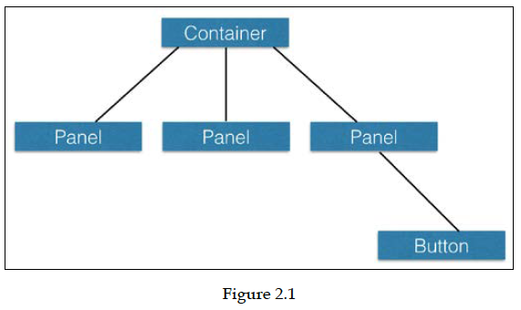

La salida del código anterior se verá similar a la siguiente captura de pantalla:

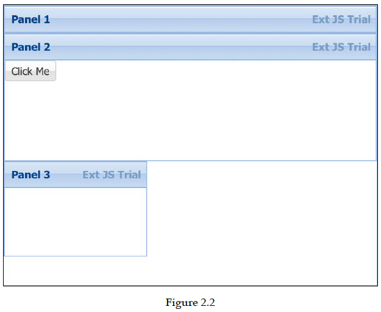

### Layouts

Un layout define cómo se colocan y dimensionan los componentes contenidos. Cada container tiene un layout(diseño). El layout predeterminado es automático. Esto no especifica ninguna regla para colocar y dimensionar los componentes child.

En la *Figura 2.2* anterior, es posible que haya notado que los componentes child son solo anidados uno tras otro en el contenedor principal. Esto se debe a que no hemos especificado cualquier layout para estos componentes en el código y, de forma predeterminada, utilizan el layout automático.

Ahora, usemos algunos layouts para el mismo código. En el siguiente ejemplo, usaremos el layout de la columna y el layout del centro.

Cuando utiliza el layout de columna, puede especificar `columnWidth`. La suma de los valores de `columnWidth` de todas las columnas deben ser iguales a `1`. También puede especificar el ancho fijo para algunas de las columnas, como se muestra en el siguiente código. Aquí, `Panel 3` tiene un ancho fijo de `150`, y las dos columnas restantes comparten el ancho restante basado en el valor `columnWidth`:

   ```js
   Ext.create('Ext.panel.Panel', {
      renderTo : Ext.getBody(),
      width : 700,
      height : 400,
      layout : 'column',
      items: [
      {
         xtype: 'panel',
         title: 'Panel 1',
         columnWidth: 0.4,
         height: 400,
      },
      {
         xtype: 'panel',
         title: 'Panel 2',
         columnWidth: 0.6,
         layout: 'center',
         height: 400,
         items: [
         {
            xtype: 'button',
            text: 'Click Me'
         }
         ]
      },
      {
         xtype: 'panel',
         title: 'Panel 3',
         width: 150,
         height: 400,
      }
      ]
   });
   ```

Ahora, la salida se verá así:

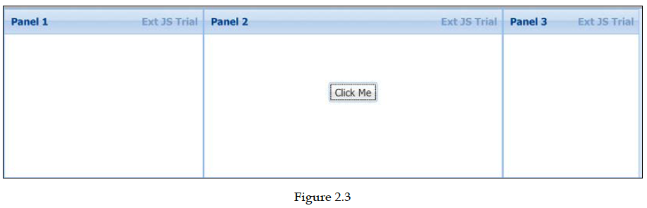

#### updateLayout

`updateLayout` es un método en `Ext.container.Container`. Esto se puede utilizar para reposicionar los componentes child de acuerdo con la regla de layout.

#### suspendLayout

La mayoría de las veces, no tiene que llamar a este método `updateLayout` en su código. Sin embargo, hay algunos casos en los que debe llamarlo.

El método `updateLayout` se llama durante el cambio de tamaño y cuando agrega o quita children.. A veces, es posible que deba suspenderlo por un tiempo, especialmente cuando add/remove varios children subsecuentes.

Entonces, en estos escenarios, puede establecer la propiedad `updateLayout` en `true`, y una vez termina de agregar o eliminar a los children, puede establecer `suspendLayout` en `false` y llame al método `updateLayout` en su código.

Además, si desea suspender la actualización del layout para todo el framework, puede llame a `Ext.suspendLayouts()`, y después de la actualización por lotes, puede reanudarla llamando a `Ext.resumeLayouts(true)`.

La siguiente es la lista de layouts integrados disponibles en Ext JS:

* `absolute`
* `accordion`
* `anchor`
* `border`
* `card`
* `center`
* `column`
* `fit`
* `hbox`
* `table`
* `vbox`

#### El absolute layout

Este layout define el posicionamiento absoluto con propiedades `x` e `y`:

   ```js
   Ext.create('Ext.panel.Panel', {
      renderTo : Ext.getBody(),
      width : 700,
      height : 400,
      layout : 'absolute',
      items: [
      {
         xtype: 'panel',
         title: 'Panel 1',
         x: 12,
         y: 20,
         height: 250,
      },
      {
         xtype: 'panel',
         title: 'Panel 2',
         x: 200,
         y: 150,
         height: 200,
      },
      {
         xtype: 'panel',
         title: 'Panel 3',
         x: 400,
         y: 250,
         width: 150,
         height: 100,
      }
      ]
   });
   ```

La salida se muestra aquí. Puede superponer componentes porque están colocados con posición absoluta:

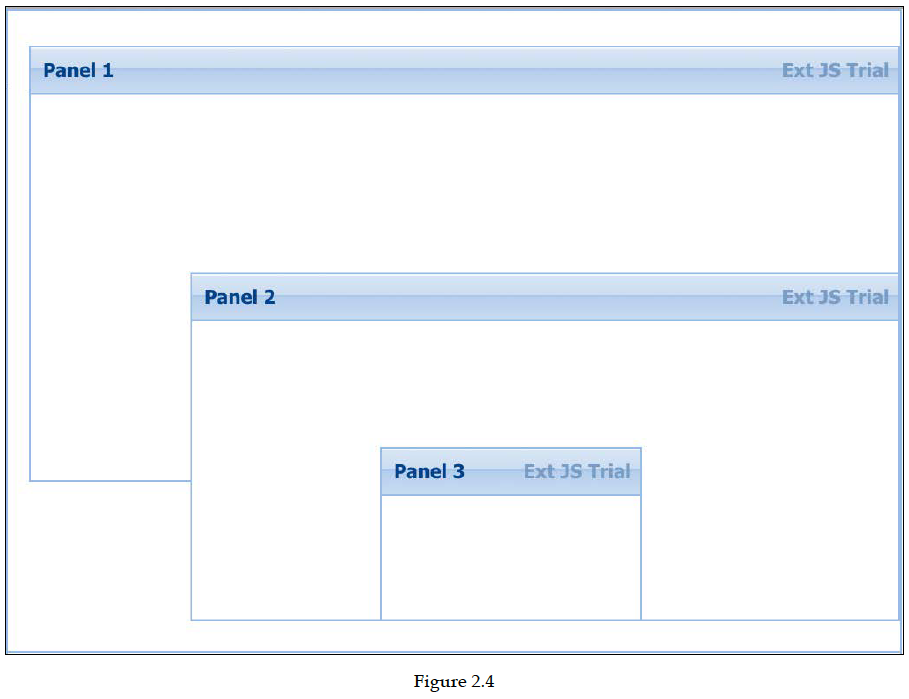

#### El accordion layout

Este layout muestra solo un panel child a la vez con el soporte incorporado para colapsar y expandir. Eche un vistazo al siguiente ejemplo:

   ```js
   Ext.create('Ext.panel.Panel', {
      renderTo : Ext.getBody(),
      width : 700,
      height : 400,
      layout : 'accordion',
      items: [
      {
         title: 'Item 1',
         html: 'Lorem ipsum dolor sit amet, consectetur adipiscing elit, sed do eiusmod tempor incididunt ut labore et dolore magna aliqua. Ut enim ad minim veniam, quis nostrud exercitation ullamco laboris nisi ut aliquip ex ea commodo consequat. Duis aute irure dolor in reprehenderit in voluptate velit esse cillum dolore eu fugiat nulla pariatur. Excepteur sint occaecat cupidatat non proident, sunt in culpa qui officia deserunt mollit anim id est laborum'
      },
      {
         title: 'Item 2',
         html: 'some content here'
      },
      {
         title: 'Item 3',
         html: 'empty'
      }
      ]
   });
   ```

La salida se muestra aquí. El `Item 1` se expande, mientras que los otros paneles son colapsado:

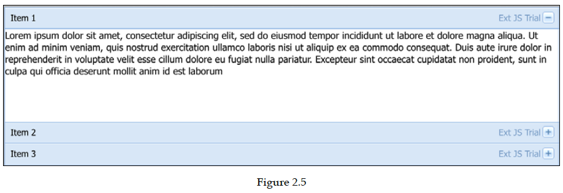

#### El anchor layout

Este layout le permite especificar el tamaño de los componentes secundarios que son relativos al contenedor. Primero, se cambia el tamaño de los contenedores y luego todos los componentes child se redimensionan de acuerdo con las reglas de anclaje especificadas:

```js
Ext.create('Ext.panel.Panel', {
   renderTo : Ext.getBody(),
   width : 700,
   height : 400,
   layout : 'anchor',
   items: [
   {
      title: 'Item 1',
      html: 'Item 1',
      anchor: '50%'
   },
   {
      title: 'Item 2',
      html: 'Item 2',
      anchor: '-20 -200'
   },
   {
      title: 'Item 3',
      html: 'Item 3',
      anchor: '-200'
   }
   ]
});
```

La salida se muestra en la siguiente captura de pantalla:

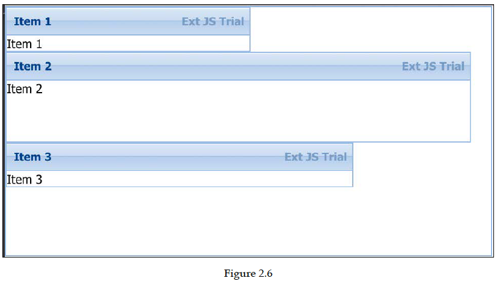

#### El border layout

Este layout le permite especificar la posición de los componentes child en términos de regiones, como center, north, south, west y east. Cuando usas el layout `border`, siempre debe tener un componente con una región como centro, como se muestra en el siguiente código:

   ```js
   Ext.create('Ext.panel.Panel', {
      renderTo : Ext.getBody(),
      width : 700,
      height : 400,
      layout : 'border',
      items: [
      {
         title: 'Item 1',
         html: 'Item 1',
         region: 'center'
      },
      {
         title: 'Item 2',
         html: 'Item 2',
         region: 'east',
         width: 200
      },
      {
         title: 'Item 3',
         html: 'Item 3',
         region: 'south',
         height: 100
      }
      ]
   });
   ```

La salida del código anterior se verá similar a la siguiente figura:

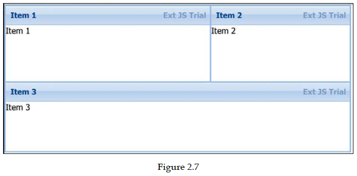

#### El card layout

En este layout, solo un componente child será visible, que llenará casi el contenedor completo. El layout `card` se usa en el wizard y tabs:

   ```js
   Ext.create('Ext.panel.Panel', {
      renderTo : Ext.getBody(),
      width : 700,
      height : 400,
      layout : 'card',
      defaultListenerScope: true,
      bbar: ['->',
      {
         itemId: 'btn-prev',
         text: 'Previous',
         handler: 'showPrevious',
         disabled: true
      },
      {
         itemId: 'btn-next',
         text: 'Next',
         handler: 'showNext'
      }
      ],
      items: [
      {
         index: 0,
         title: 'Item 1',
         html: 'Item 1'
      },
      {
         index: 1,
         title: 'Item 2',
         html: 'Item 2'
      },
      {
         index:2,
         title: 'Item 3',
         html: 'Item 3'
      }
      ],
      showNext: function () {
         this.navigate(1);
      },
      showPrevious: function () {
         this.navigate(-1);
      },
      navigate: function (incr) {
         var layout = this.getLayout();
         var index = layout.activeItem.index + incr;
         layout.setActiveItem(index);
   
         this.down('#btn-prev').setDisabled(index===0);
         this.down('#btn-next').setDisabled(index===2);
      }
   });
   ```

Aquí se muestra el resultado del layout card (wizard). Cuando haces clic en el button **Next**, mostrará el panel `Item 2`:

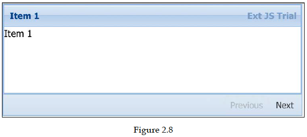

#### El center layout

Este layout coloca al child en el centro del contenedor. Ya vimos un ejemplo en este capítulo al comienzo de la sección de layouts.

#### El column layout

Con este layout, puede dividir el contenedor en columnas de un tamaño y lugar específicos los componentes child en estas columnas. Ya vimos un ejemplo en este capítulo al comienzo de la sección de layouts.

#### El fit Layout

En este diseño, el child se ajusta a la dimensión del contenedor de la siguiente manera:

   ```js
   Ext.create('Ext.panel.Panel', {
      renderTo : Ext.getBody(),
      width : 700,
      height : 400,
      layout : 'fit',
      bodyPadding: 20,
      items: [
      {
         title: 'Item 1',
         html: 'Fills the container',
      }
      ]
   });
   ```
   
Aquí se muestra la salida del código anterior. Tenga en cuenta que la brecha entre el child y el componente parent se crea mediante `bodyPadding` que configuramos en el código:   

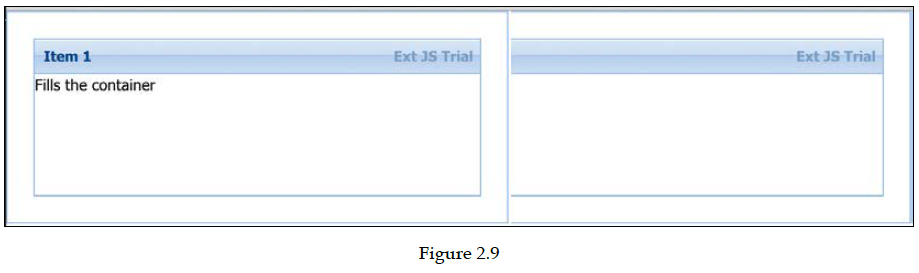

#### El hbox layout

Este layout es casi el mismo que el diseño de columna, pero le permite estirar la altura de la columna.
La opción flex utilizada aquí hace que el componente secundario se flexione horizontalmente de acuerdo con el valor flex relativo dado:

   ```js
   Ext.create('Ext.panel.Panel', {
      renderTo : Ext.getBody(),
      width : 700,
      height : 400,
      layout :
      {
         type: 'hbox',
         pack: 'start',
         align: 'stretch',
      },
      items: [
      {
         title: 'Item 1',
         html: 'Item 1',
         flex: 1
      },
      {
         title: 'Item 2',
         html: 'Item 2',
         width: 100
      },
      {
         title: 'Item 3',
         html: 'Item 3',
         flex: 2
      }
      ]
   });
   ```

La salida del código anterior se verá similar a la siguiente figura:

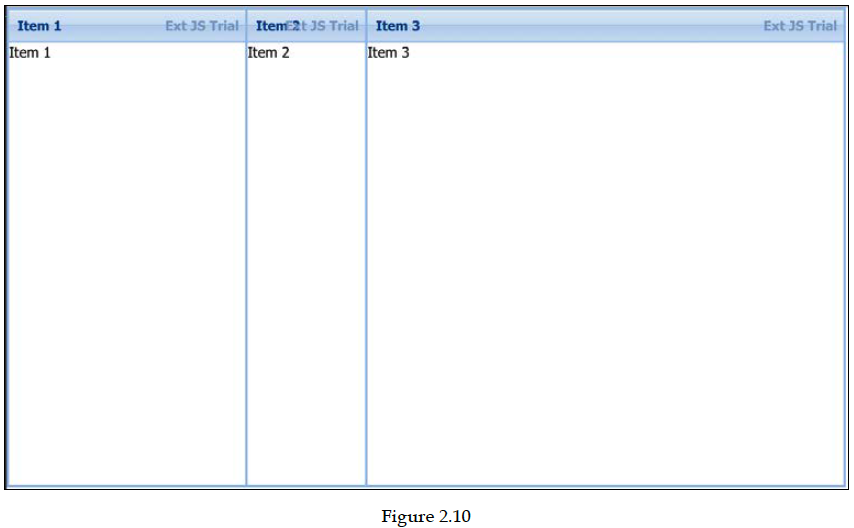

#### El table layout

Este layout le permite renderizar en formato de tabla. Puede especificar el número de columnas y filas con `rowspan` y `colspan` para crear diseños complejos:

   ```js
   Ext.create('Ext.panel.Panel', {
      renderTo : Ext.getBody(),
      width : 700,
      height : 400,
      layout :
      {
         type: 'table',
         columns: 3,
         tableAttrs: {
            style: {
               width: '100%'
            }
         }
      },
      items: [
      {
         rowspan: 3,
         title: 'Item 1',
         html: 'Item 1'
      },
      {
         title: 'Item 2',
         html: 'Item 2'
      },
      {
         title: 'Item 3',
         rowspan: 2,
         html: 'Item 3'
      },
      {
         title: 'Item 4',
         html: 'Item 4'
      },
      {
         title: 'Item 5',
         html: 'Item 5'
      },
      {
         title: 'Item 6',
         html: 'Item 6'
      },
      {
         title: 'Item 7',
         html: 'Item 7'
      }
      ]
   });
   ```

La salida del código de layout de tabla anterior se muestra en la siguiente captura de pantalla:

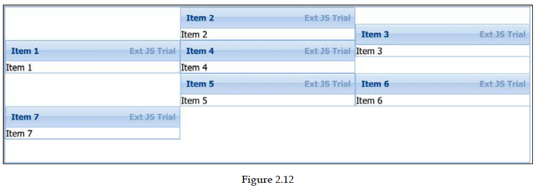

#### El VBox layout

Este layout coloca los componentes child verticalmente hacia abajo uno tras otro.

Eche un vistazo al siguiente código de muestra:

   ```js
   Ext.create('Ext.panel.Panel', {
      renderTo : Ext.getBody(),
      width : 700,
      height : 400,
      layout :
      {
         type: 'vbox',
         pack: 'start',
         align: 'stretch',
      },
      items: [
      {
         title: 'Item 1',
         html: 'Item 1',
         flex: 1
      },
      {
         title: 'Item 2',
         html: 'Item 2',
         height: 100
      },
      {
         title: 'Item 3',
         html: 'Item 3',
         flex: 2
      }
      ]
   });
   ```

La salida de este código se muestra aquí:

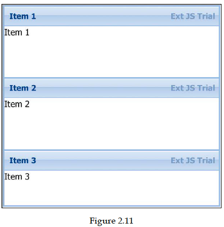

## Resumen

En este capítulo, analizamos las clases base en Ext JS y algunos de los métodos de uso más frecuente en estas clases. También aprendiste a crear y extend clases. Aprendimos a usar eventos y capacidades de consulta(query).

En el próximo capítulo, veremos muchos componentes útiles, como buttons, menus, toolbars, etc. También crearemos una pequeña aplicación de calculadora.
