# Capítulo 3: Componentes básicos

* Familiarizarse con los componentes básicos
   * Ext.Button
   * Ext.MessageBox
* Formularios y campos de formulario
   * Ext.form.Panel
* Fields
   * Ext.form.field.Text
   * Ext.form.field.Number
   * Ext.form.field.ComboBox
   * Ext.form.field.HtmlEditor
* La validación de campos del formulario
   * Eventos en el panel de formulario
   * Formulario de contenedores de campo
   * Ext.form.CheckboxGroup
   * Ext.form.FieldContainer
   * Ext.form.RadioGroup
   * Submitting a form
   * Menus y toolbar
* El diseño del formulario de comentarios del cliente
* Calculadora: un proyecto de muestra
   * La estructura de carpetas
      * App – app.js
   * MVC y MVVM – Revisión
      * Model
      * View
      * Controller
      * ViewController y Controller
      * View model
   * View – Main.js
   * Controller – MainController.js
   * ViewModel – MainViewModel.js
* Resumen

En este capítulo, aprenderá algunos de los componentes básicos disponibles Ext JS. Usaremos los conceptos aprendidos en los capítulos anteriores y en este capítulo para crear un proyecto de muestra. En este capítulo se tratarán los siguientes temas:

* Familiarizarse con los componentes básicos: buttons, text field, date picker, etcétera
* La validación del campo del formulario
* Menus y toolbars
* Un diseño de formulario de comentarios del cliente
* Calculadora: un proyecto de muestra

El objetivo principal del capítulo es crear un diseño de formulario y un proyecto de muestra de calculadora. La Figura 3.1 y la Figura 3.2 muestran el diseño del formulario de comentarios del cliente y el diseño de la calculadora, respectivamente.
Primero, si observa el diseño del formulario de comentarios de los clientes en la Figura 3.1, verá que hemos usado muchos controles, como una label, un text field.

La siguiente figura es el diseño del formulario **Customer Feedback**(Comentarios del cliente):

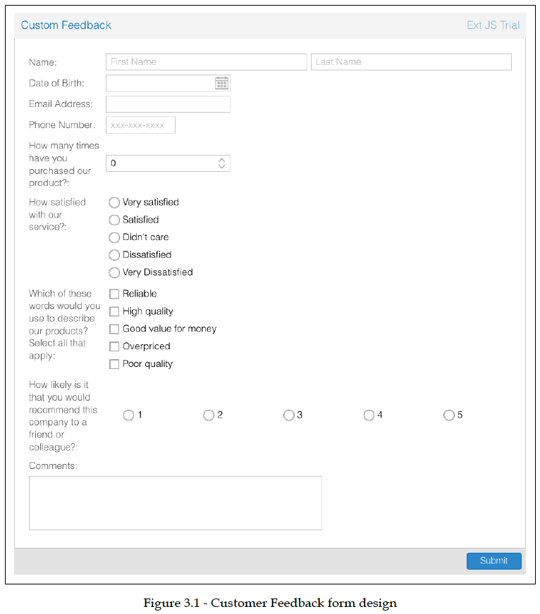


## Familiarizarse con los componentes básicos
### Ext.Button

```js
```

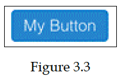

```js
```

```js
```

```js
```

```js
```

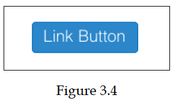

```js
```

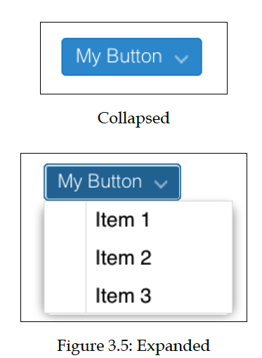

### Ext.MessageBox

```js
```

```js
```

```js
```

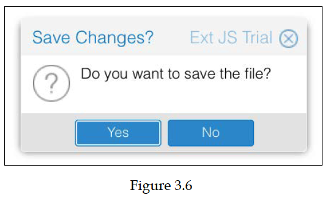

## Formularios y campos de formulario
### Ext.form.Panel
## Fields

```js
```

### Ext.form.field.Text

```js
```

### Ext.form.field.Number

```js
```

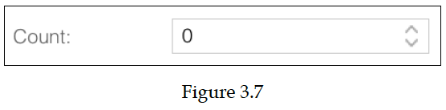

### Ext.form.field.ComboBox

```js
```

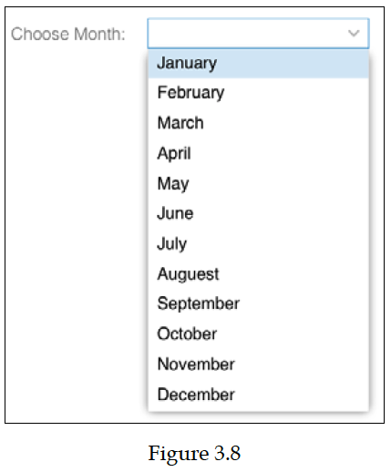

### Ext.form.field.HtmlEditor

```js
```

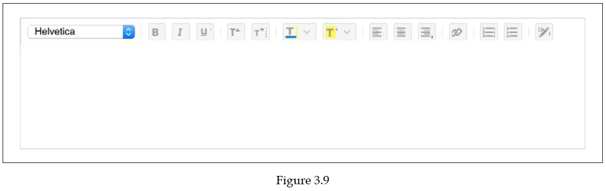

## La validación de campos del formulario
### Eventos en el panel de formulario
### Formulario de contenedores de campo
### Ext.form.CheckboxGroup

```js
```

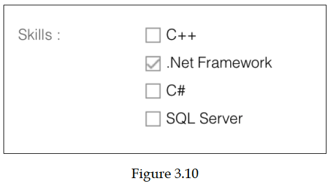

### Ext.form.FieldContainer

```js
```


### Ext.form.RadioGroup

```js
```


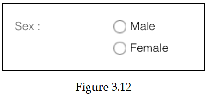

### Submitting a form

```js
```

### Menus y toolbar

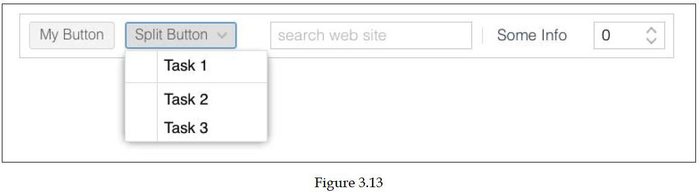

```js
```

## El diseño del formulario customer feedback

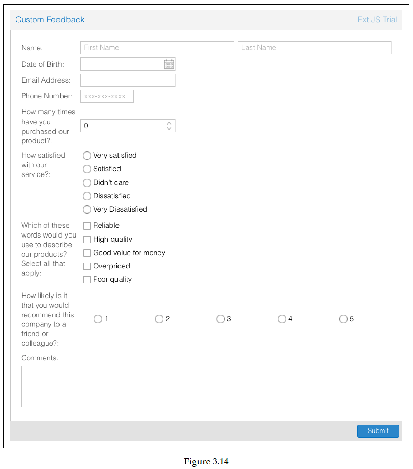

```js
```

## Calculadora: un proyecto de muestra

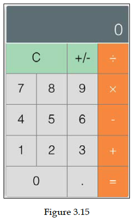

### La estructura de carpetas

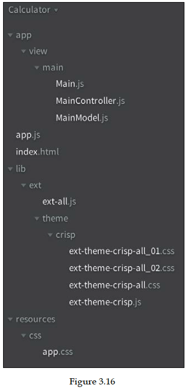

#### App – app.js

```js
```

### MVC y MVVM – Revisión
#### Model
#### View
#### Controller
#### ViewController y Controller
#### View model
### View – Main.js

```js
```

### Controller – MainController.js

```js
```

### ViewModel – MainViewModel.js

```js
```

## Resumen


