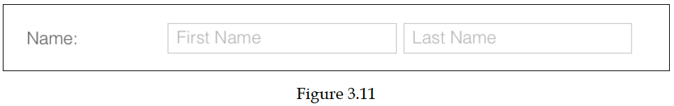

# Capítulo 3: Componentes básicos

* Familiarizarse con los componentes básicos
   * Ext.Button
   * Ext.MessageBox
* Formularios y campos de formulario
   * Ext.form.Panel
* Fields
   * Ext.form.field.Text
   * Ext.form.field.Number
   * Ext.form.field.ComboBox
   * Ext.form.field.HtmlEditor
* La validación de campos del formulario
   * Eventos en el panel de formulario
   * Formulario de contenedores de campo
   * Ext.form.CheckboxGroup
   * Ext.form.FieldContainer
   * Ext.form.RadioGroup
   * Submitting a form
   * Menus y toolbar
* El diseño del formulario de comentarios del cliente
* Calculadora: un proyecto de muestra
   * La estructura de carpetas
      * App – app.js
   * MVC y MVVM – Revisión
      * Model
      * View
      * Controller
      * ViewController y Controller
      * View model
   * View – Main.js
   * Controller – MainController.js
   * ViewModel – MainViewModel.js
* Resumen

En este capítulo, aprenderá algunos de los componentes básicos disponibles Ext JS. Usaremos los conceptos aprendidos en los capítulos anteriores y en este capítulo para crear un proyecto de muestra. En este capítulo se tratarán los siguientes temas:

* Familiarizarse con los componentes básicos: buttons, text field, date picker, etcétera
* La validación del campo del formulario
* Menus y toolbars
* Un diseño de formulario de comentarios del cliente
* Calculadora: un proyecto de muestra

El objetivo principal del capítulo es crear un diseño de formulario y un proyecto de muestra de calculadora. La Figura 3.1 y la Figura 3.2 muestran el diseño del formulario de comentarios del cliente y el diseño de la calculadora, respectivamente.
Primero, si observa el diseño del formulario de comentarios de los clientes en la Figura 3.1, verá que hemos usado muchos controles, como una label, un text field.

La siguiente figura es el diseño del formulario **Customer Feedback**(Comentarios del cliente):


A continuación, puede ver el button y label: los controles más importantes utilizados en el diseño de calculadora en la Figura 3.2. Por lo tanto, primero aprenderá sobre los botones y los controladores. Más tarde, al final de este capítulo, crearemos el proyecto de la calculadora. En el proyecto de la calculadora, aprenderá cómo la vista y el controlador interactúan y funcionan juntos. También veremos cómo vincular la propiedad del modelo de vista a un campo en la vista.

La siguiente figura es el diseño de la calculadora:


## Familiarizarse con los componentes básicos

Ext JS viene con muchos controles útiles. Echemos un vistazo a algunos de los componentes:

### Ext.Button

Este es un control de uso común; el handler se utiliza para el evento de clic, como se muestra en el siguiente código:

   ```js
   Ext.create('Ext.Button', {
      text: 'My Button',
      renderTo: Ext.getBody(),
      handler: function() {
         alert('click');
      }
   });
   ```


Ya mencioné la ejecución del código de muestra en el Capítulo 2, pero me gustaría reiterar este punto nuevamente. Mientras lee, puede ejecutar esta muestra de código y la mayoría del otro código de muestra que veremos en este libro. Tu también puedes ejecútelos en tu máquina local o en Sencha Fiddle. Puedes visitar Sencha Fiddle en https://fiddle.sencha.com y coloque el código anterior en la función launch, ejecútelo y vea el resultado. Entonces, si va a https://fiddle.sencha.com, verá el siguiente código:

   ```js
   Ext.application({
      name : 'Fiddle',
      launch : function() {
         Ext.Msg.alert('Fiddle', 'Welcome to Sencha Fiddle!');
      }
   });
   ```
   
Ahora, pegue el código de muestra del botón como se muestra aquí, ejecútelo y vea el resultado:   

   ```js
   Ext.application({
      name : 'Fiddle',
      launch : function() {
         Ext.create('Ext.Button', {
            text: 'My Button',
            renderTo: Ext.getBody(),
            handler: function() {
               alert('click');
            }
         });
      }
   });
   ```
   
> **NOTA:** No todos los ejemplos se pueden ejecutar de esta manera, y no todos el código de muestra tiene representación visual.

También puede usar la configuración de los `listeners` para agregar uno o más event handlers, como se muestra en el siguiente código:

   ```js
   Ext.create('Ext.Button', {
      text: 'My Button',
      renderTo: Ext.getBody(),
      listeners: {
         click: {
            fn: function(){
               //Handle click event
               alert('click');
            }
         },
         mouseout: {
            fn: function(){
               //Handle double click event
               alert('Mouse out');
            }
         }
      }
   });
   ```
   
El código anterior crea un botón simple, pero puede crear muchas variaciones de botones. También puede crear un botón de enlace(link button), un botón con un menú, un botón de alternancia(toggle), etcétera.

Para crear un link button, establezca la propiedad `href`, como se muestra en el siguiente código:   

   ```js
   Ext.create('Ext.Button', {
      renderTo: Ext.getBody(),
      text: 'Link Button',
      href: 'http://www.sencha.com/'
   });
   ```
   
La salida del link button se muestra en la *Figura 3.4*. Al hacer clic en él, el enlace abrir:   


Puede crear un botón de menú(menu button) estableciendo la propiedad `menu`, como se muestra en el siguiente código:

   ```js
   Ext.create('Ext.Button', {
      text: 'My Button',
      renderTo: Ext.getBody(),
      menu: [{
         text: 'Item 1'
      }, {
         text: 'Item 2'
      }, {
         text: 'Item 3'
      }]
   });
   ```

La salida se muestra aquí:


`Ext.Button` tiene muchas otras propiedades, como `bind`, `cls`, `disabled`, `html`, `tooltip`, `tpl`, etc., que puede utilizar para personalizar el botón.

### Ext.MessageBox

La clase `Ext.window.MessageBox` proporciona la implementación del message box. `Ext.MessageBox` es una instancia única de esta clase. Puede usar `MessageBox` para mostrar un alerta, obtener confirmación, solicitar entrada, etc.

El siguiente código mostrará una alerta simple. Aquí, `Ext.Msg` es el alias de `Ext.Messagebox`:

   ```js
   Ext.Msg.alert('Info', 'Document saved!');   
   ```

Puede mostrar un cuadro de mensaje de confirmación con un botón de `yes` y `no` con el siguiente código:

   ```js
   Ext.Msg.confirm('Confirm', 'Are you want to cancel the updates?',
   function(button){
      if('yes'==button) {
      
      }
      else {
      
      }
   }
   );
   ```
   
Además, puede personalizar el cuadro de mensaje de la siguiente manera:   

   ```js
   Ext.MessageBox.show({
      title:'Save Changes?',
      msg: 'Do you want to save the file?',
      buttons: Ext.MessageBox.YESNO,
      fn: function(button){
         if('yes'==button)
         {
         
         }
         else if('no'==button)
         {
         
         }
      } ,
      icon: Ext.MessageBox.QUESTION
   });
   ```
La salida del código anterior es la siguiente:


## Formularios y campos de formulario

Ahora, echemos un vistazo a algunos de los componentes relacionados con el formulario.

### Ext.form.Panel

El panel de formularios hereda del panel y agrega funcionalidades relacionadas con los formularios, como gestión de campo, validación, envío, etc. El diseño predeterminado de el panel de formulario es un diseño de anclaje, pero puede cambiarlo si es necesario.

El panel de formulario tiene una configuración conveniente llamada `fieldDefaults`, que se puede utilizar para
especifique los valores de configuración predeterminados para todos los campos.

## Fields

Ext JS viene con tantos campos de formulario integrados listos para usar. Algunos de los los campos usados son:

   ```js
   Ext.form.field.Checkbox
   Ext.form.field.ComboBox
   Ext.form.field.Date
   Ext.form.field.File
   Ext.form.field.Hidden
   Ext.form.field.HtmlEditor
   Ext.form.field.Number
   Ext.form.field.Radio
   Ext.form.field.Text
   Ext.form.field.TextArea
   Ext.form.field.Time
   ```
   
Echemos un vistazo a algunos de estos campos de formulario aquí.   

### Ext.form.field.Text

Este es un campo de texto básico, pero tiene muchas propiedades y configuraciones útiles. Una de estas propiedades útil es `vtype` que se utiliza para la validación. Por ejemplo, puede configurar la propiedad `vtype` como un correo electrónico para validar la entrada para el correo electrónico válido, como se muestra en la siguiente código:

   ```js
   Ext.create('Ext.form.field.Text', {
      renderTo: Ext.getBody(),
      name: 'email',
      fieldLabel: 'Email',
      allowBlank: false,
      vtype: 'email'
   });
   ```

Aquí `allowBlank` es una propiedad de validación. Al establecer `allowBlank` en `false`, muestra el error de validación si el campo está en blanco.

### Ext.form.field.Number

El campo numérico se extiende desde el campo spinner, que a su vez se extiende desde el campo de texto. El campo de número proporciona varias opciones para manejar un valor numérico. El siguiente código generará un campo numérico que se muestra en la *Figura 3.7*:

   ```js
   Ext.create('Ext.form.field.Number', {
      renderTo: Ext.getBody(),
      name: 'Count',
      fieldLabel: 'Count',
      value: 0,
      maxValue: 10,
      minValue: 0
   });
   ```


Puede eliminar los botones spinner, las teclas de flecha y los listeners de la rueda del mouse con las
opciones de configuración: `hideTrigger`, `keyNavEnabled` y `mouseWheelEnabled` respectivamente.

### Ext.form.field.ComboBox

El siguiente código crea un dropdown(menú desplegable) con una lista de meses. El `combobox` tiene un config llamado `store`. El datastore proporciona los datos para el dropdown. El datastore es parte de los data packages de ExtJS, que cubriremos en detalle en los próximos capítulos.

Otra configuración importante en el `combobox` es `queryMode`. Esto puede ser local o remoto. Si configura esto como remoto, el datastore se cargará en tiempo de ejecución enviando una solicitud al servidor remoto:

   ```js
   var months = Ext.create('Ext.data.Store', {
      fields: ['abbr', 'name'],
      data: [
      {"abbr":"JAN", "name":"January"},
      {"abbr":"FEB", "name":"February"},
      {"abbr":"MAR", "name":"March"},
      {"abbr":"APR", "name":"April"},
      {"abbr":"MAY", "name":"May"},
      {"abbr":"JUN", "name":"June"},
      {"abbr":"JUL", "name":"July"},
      {"abbr":"AUG", "name":"August"},
      {"abbr":"SEP", "name":"September"},
      {"abbr":"OCT", "name":"October"},
      {"abbr":"NOV", "name":"November"},
      {"abbr":"DEC", "name":"December"}
      ]
   });
   
   Ext.create('Ext.form.ComboBox', {
      fieldLabel: 'Choose Month',
      store: months,
      queryMode: 'local',
      displayField: 'name',
      valueField: 'abbr',
      renderTo: Ext.getBody()
   });
   ```
La salida del código anterior es la siguiente:


### Ext.form.field.HtmlEditor

Ext JS también tiene un editor HTML muy bueno que proporciona el procesador de texto común funciones directamente a sus páginas web, como se muestra en el siguiente código:

   ```js
   Ext.create('Ext.form.HtmlEditor', {
      width: 800,
      height: 200,
      renderTo: Ext.getBody()
   });
   ```

La salida del código anterior es la siguiente:


## La validación de campos del formulario

La mayoría de los campos tienen sus propias reglas de validación, por ejemplo, si ingresa un valor no numérico en el campo de número, mostrará una validación de número no válida. El campo de texto viene con `allowBlank`, `minLength` y `maxLength`. Además, Regex se puede utilizar para validaciones personalizadas.

### Eventos en el panel de formulario

Algunos de los eventos admitidos en el panel de formulario son:

* `beforeaction`: Este evento se activará antes de ejecutar cualquier acción
* `actionfailed`: Este evento se activará cuando una acción falle.
* `actioncomplete`: Este evento se activará después de que se complete una acción
* `validitychange`: Este evento se activará cuando la validez de la totalidad de forma cambie
* `dirtychange`: Este evento se activará cuando el estado dirty de la forma cambie

### Formulario de contenedores de campo

Los siguientes son algunos de los contenedores útiles para el panel de formulario.

### Ext.form.CheckboxGroup

`CheckboxGroup` extiende `FieldContainer` y se usa para agrupar checkbox field. En en el siguiente ejemplo, observe el mismo nombre para todos los elementos del grupo de checkbox; esto ayuda a que los valores se pasen como un solo parámetro al servidor.

   ```js
   Ext.create('Ext.form.CheckboxGroup', {
      renderTo: Ext.getBody(),
      fieldLabel: 'Skills ',
      vertical: true,
      columns: 1,
      items: [
         { boxLabel: 'C++', name: 'rb', inputValue: '1' },
         { boxLabel: '.Net Framework', name: 'rb', inputValue: '2', checked: true },
         { boxLabel: 'C#', name: 'rb', inputValue: '3' },
         { boxLabel: 'SQL Server', name: 'rb', inputValue: '4' },
      ]
   });
   ```

La salida del código anterior es la siguiente:


### Ext.form.FieldContainer

`FieldContainer` es útil cuando desea agrupar un conjunto de campos relacionados y adjuntarlo a una sola etiqueta.

El siguiente código crea una salida, que se muestra en la Figura 3.11:

   ```js
   Ext.create('Ext.form.FieldContainer', {
      renderTo: Ext.getBody(),
      fieldLabel: 'Name',
      layout: 'hbox',
      combineErrors: true,
      defaultType: 'textfield',
      defaults: {
         hideLabel: 'true'
      },
      items: [{
         name: 'firstName',
         fieldLabel: 'First Name',
         flex: 2,
         emptyText: 'First',
         allowBlank: false
      }, {
         name: 'lastName',
         fieldLabel: 'Last Name',
         flex: 3,
         margin: '0 0 0 6',
         emptyText: 'Last',
         allowBlank: false
      }]
   });
   ```
   


### Ext.form.RadioGroup

`RadioGroup` extiende `CheckboxGroup` y se usa para agrupar radio buttons. Tenga en cuenta que la propiedad name es la misma para todos los elementos. Esto los mantiene agrupados. De lo contrario, serían seleccionables de forma independiente, como se muestra en el siguiente código:

   ```js
   Ext.create('Ext.form.RadioGroup', {
      renderTo: Ext.getBody(),
      fieldLabel: 'Sex ',
      vertical: true,
      columns: 1,
      items: [
         { boxLabel: 'Male', name: 'rb', inputValue: '1' },
         { boxLabel: 'Female', name: 'rb', inputValue: '2' }
      ]
   });
   ```

La salida del código anterior es la siguiente:


### Submitting a form

Para enviar un formulario, puede utilizar el método de envío del formulario. Utilice el método `getForm` para obtener el formulario e `isValid` para validar el formulario antes de enviarlo, como se muestra en el siguiente código:

   ```js
   var form = this.up('form').getForm();
   if (form.isValid()) {
      form.submit({
         url: 'someurl',
            success: function () {
         },
         failure: function () {
         }
      });
   } else {
      Ext.Msg.alert('Error', 'Fix the errors in the form')
   }
   ```

### Menus y toolbar

Ext JS proporciona soporte completo para construir cualquier tipo de toolbar y menús que pueda pensar en. Utilice `Ext.toolbar.Toolbar` para crear una toolbar. De forma predeterminada, cualquier elemento child en `Ext.toolbar.Toolbar` es un botón, pero puede agregar cualquier otro control, como text field, un number field, un icon, un dropdown etc, en la toolbar.

Para organizar los elementos en la toolbar, puede utilizar `Ext.toolbar.Spacer`, `Ext.toolbar.Separator` y `Ext.toolbar.Fill` para tener espacio, una barra de separación y un contenedor de botones respectivamente. Los atajos para estos son, ' ' (space), '|' (pipe), and '->' (arrow), respectivamente.

`Ext.menu.Menu` se utiliza para crear un menú con `Ext.menu.Item` como menu items.

En la siguiente captura de pantalla se muestra un código de muestra y su salida:


   ```js
   Ext.create('Ext.toolbar.Toolbar', {
      renderTo: Ext.getBody(),
      width: 800,
      items: [
      {
         text: 'My Button'
      },
      {
         text: 'My Button',
         menu: [{
            text: 'Item 1'
         }, {
            text: 'Item 2'
         }, {
            text: 'Item 3'
         }]
      },
      {
         text: 'Menu with divider',
         tooltip: {
            text: 'Tooltip info',
            title: 'Tip Title'
         },
         menu: {
            items: [{
               text: 'Task 1',
               // handler: onItemClick
            }, '-', {
               text: 'Task 2',
               // handler: onItemClick
            }, {
               text: 'Task 3',
               // handler: onItemClick
            }]
         }
      },
      '->',
      {
         xtype: 'textfield',
         name: 'field1',
         emptyText: 'search web site'
      },
      '-',
      'Some Info',
      {
         xtype: 'tbspacer'
      },
      {
         name: 'Count',
         xtype: 'numberfield',
         value: 0,
         maxValue: 10,
         minValue: 0,
         width: 60
      }
      ]
   });
   ```

## El diseño del formulario customer feedback

Ahora, usemos algunos de los conceptos aprendidos en los capítulos anteriores y en este capítulo para diseñar un diseño de formulario de comentarios del cliente (customer feedback).

El siguiente formulario en la *Figura 3.13* es el diseño del formulario que diseñaremos:


El código del diseño anterior se muestra en el siguiente código. Solo he guardado el código importante y truncado el resto. El código fuente completo para este proyecto está disponible en https://github.com/ananddayalan/extjs-by-example-customerfeedback-form.

Aquí, colocaremos todos los componentes en `Viewport`. Este es un contenedor especializado que representa el área de visualización de la aplicación del navegador.

En la `Viewport`, configuraremos la opción de desplazamiento para hacer que este componente child scrollable. En lugar de true o false, esta opción también puede tomar `x` o `y` como valores para habilitar solo desplazamiento horizontal o vertical:

```js
Ext.create('Ext.container.Viewport', {
   scrollable: true,
   items: [{
      xtype: 'container',
      layout: {
         type: 'hbox',
         align: 'center',
         pack: 'center'
      },
      items: [ {
         xtype: 'form',
         bodyPadding: 20,
         maxWidth: 700,
         flex: 1,
         title: 'Custom Feedback',
         items: [ {
            xtype: 'fieldcontainer',
            layout: 'hbox',
            fieldLabel: 'Name',
            defaultType: 'textfield',
            defaults: {
               allowBlank: false,
               flex: 1
            },
            items: [{
               name: 'firstName',
               emptyText: 'First Name
            }, {
               name: 'lastName',
               margin: '0 0 0 5',
               emptyText: 'Last Name'
            }
         ]}, {
            xtype: 'datefield',
            fieldLabel: 'Date of Birth',
            name: 'dob',
            maxValue: new Date() /* Prevent entering the future date. */
         }, {
            fieldLabel: 'Email Address',
            name: 'email', vtype: 'email',
            allowBlank: false
         }, {
            fieldLabel: 'Phone Number',
            labelWidth: 100,
            name: 'phone',
            width: 200, emptyText: 'xxx-xxx-xxxx',
            maskRe: /[\d\-]/,
            regex: /^\d{3}-\d{3}-\d{4}$/,
            regexText: 'The format must be xxx-xxx-xxxx' },
            //…code truncated
         {
            xtype: 'radiogroup',
            fieldLabel: 'How satisfied with our service?',
            vertical: true, columns: 1,
            items: [ {
               boxLabel: 'Very satisfied',
               name: 'rb',
               inputValue: '1'
            }, {
               boxLabel: 'Satisfied',
               name: 'rb', inputValue: '2'
            },
            //…code truncated
            ]
         },{
            xtype: 'checkboxgroup',
            fieldLabel: 'Which of these words would you use to describe our products? Select all that apply',
            vertical: true,
            columns: 1,
            items: [{
               boxLabel: 'Reliable',
               name: 'ch',
               inputValue: '1'
            },
            //…code truncated
            ]
            
         },
         {
            xtype: 'radiogroup',
            fieldLabel: 'How likely is it that you would recommend this company to a friend or colleague?',
            vertical: false,
            defaults: { padding: 20 },
            items: [ {
               boxLabel: '1',
               name: 'recommend',
               inputValue: '1'
            },
            //…code truncated
            ],
            buttons: [{
               text: 'Submit',
               handler: function () {
                  var form = this.up('form').getForm();
                  if (form.isValid()) {
                     form.submit({
                        url: 'cutomer/feedback',
                        success: function () {},
                        failure: function () {}
                     });
                  } else {
                     Ext.Msg.alert('Error', 'Fix the errors in the form')
                  }
               }
               //…code truncated
   ```
   
En el código anterior, al establecer `defaultType` en el nivel del contenedor, estamos evitando la repetición de especificar 
`xtype` para los componentes child del contenedor. Entonces por forma predeterminada, todos los componentes child que no tienen el `xtype` establecido tendrán por defecto el `textfield`.
 
En el panel `form`, el `flex` se usa para hacer que el panel `form` llene el parent container's width, y al mismo tiempo, limitaremos el ancho máximo del formulario configurando `maxWidth` en `700`.

El contenedor de campo se utiliza con el diseño de `hbox` para poner tanto el nombre como el apellido bajo una sola etiqueta.   

## Calculadora: un proyecto de muestra

Construyamos un proyecto de muestra completo con los conceptos aprendidos en el anterior capítulo y este capítulo. Aquí está el diseño de la calculadora que construiremos:


### La estructura de carpetas

Aquí está la estructura de carpetas de los archivos que tenemos en este proyecto. Solo he copiado algunos de los archivos requeridos de Ext JS a la carpeta del proyecto:


Los siguientes son algunos de los archivos importantes del proyecto. He excluido el archivos HTML y CSS desde aquí. Los archivos completos del proyecto están disponibles en https://github.com/ananddayalan/extjs-by-example-calculator.

#### App – app.js

En `app.js`, simplemente crearemos la vista `Main` y la mostraremos como una ventana flotante y móvil ventana en el navegador:

   ```js
   Ext.application({
      name: 'Calc',
      launch: function () {
         Ext.create('Calc.view.main.Main').show();
      }
   });
   ```

### MVC y MVVM – Revisión

En el Capítulo 1, Introducción a Ext JS, aprendió sobre MVC (Vista de modelo Controller) y MVVM (Model View ViewModel). El código de este proyecto es muy buen ejemplo para mostrar la distinción entre view, controller y view model.

#### Model

Esto representa la capa de datos. El modelo puede contener validación de datos y lógicas para persistir los datos.

#### View

Esto representa la interfaz de usuario. Entonces, componentes como button, form y un message box son vistas. El `main.js` en este proyecto de calculadora es un buen ejemplo para la vista.

#### Controller

Esto maneja cualquier lógica relacionada con la vista, manejo de eventos de la vista y cualquier lógica de aplicación.

#### ViewController y Controller

En Ext JS 5 y 6, hay dos tipos de controladores: `ViewController` y `Controller`. `ViewController` se introdujo en Ext JS 5. `ViewController` es creado para una vista específica, pero puede tener el controlador para aplicaciones cruzadas ver la lógica.

El view controller trae algunos conceptos nuevos, como reference y listener, a simplificar la conexión entre la vista y el controlador. Además, `ViewController` se destruirá cuando se destruya la vista. No usaremos la referencia y los listeners.
en este ejemplo, pero los usaremos en el siguiente proyecto de muestra.

> **NOTA:** Puede utilizar los listeners en este proyecto en lugar de utilizar el handler para manejar los eventos.

#### View model

Esto encapsula la lógica de presentación requerida para la vista, vincula los datos a la vista, y maneja todas las actualizaciones cada vez que se cambian los datos.

A diferencia del modelo, el `view model` se crea principalmente para una vista específica. Un modelo es una clase de datos pura y se puede usar en toda la aplicación, pero el `view model` se crea para usar con una vista y un servidor como enlace de datos entre la vista y el modelo. Echa un vistazo a `main.js` en este proyecto de calculadora y vea el view model binding.

### View – Main.js

Crearé una vista única para esta aplicación de calculadora llamada `Main`. Esta vista contiene todo el botón, el campo de visualización, etc. Los eventos están asociados con el métodos de este controlador. El controlador de esta vista se ha especificado mediante el configuración del controlador.

Esta vista hace uso del diseño de tabla con cuatro columnas. La clase CSS ha sido especificado con la propiedad `cls`.

Consulte los comentarios/explicaciones adicionales en el código como comentarios:

```js
Ext.define('Calc.view.main.Main', {
   extend: 'Ext.window.Window',
   
   /* Marks these are required classes to be to loaded before loading this view */
   requires: [ 'Calc.view.main.MainController', 'Calc.view.main.MainModel'],
   xtype: 'app-main',
   controller: 'main',
   
   /* View model of the view */
   viewModel: { type: 'main' },

   resizable: false,
   layout: {
      type: 'table',
      columns: 4
   },

   /* Defaults properties to be used for the child items. Any child can override it */
   defaultType: 'button',
   defaults: {
      width: 50,
      height: 50,
      cls: 'btn',
      handler: 'onClickNumber'
   },
   /* I'm using the header config of the Ext.window.Window to display the result in the calculator. Using this header you can move the floating calculator around within the browser */
   header: {
      items: [
      {
         xtype: 'displayfield',
         colspan: 4,
         width: 200,
         cls: 'display',
         bind: { value: '{display}' },
         height: 60,
         padding: 0
      }]
   },
   items: [{
      text: 'C',
      colspan: 2,
      width: 100,
      cls: 'btn-green',
      handler: 'onClickClear'
   }, {
      text: '+/-',
      cls: 'btn-green',
      handler: 'onClickChangeSign'
   }, {
      text: '&divide;',
      cls: 'btn-orange',
      handler: 'onClickOp'
   },
   { text: '7' },
   { text: '8' },
   { text: '9' },
   { text: '&times;',
      cls: 'btn-orange',
      handler: 'onClickOp'
   },
   { text: '4'},
   { text: '5'},
   { text: '6'},
   {
      text: '-',
      cls: 'btn-orange',
      handler: 'onClickOp'
   },
   { text: '1'},
   { text: '2'},
   { text: '3'},
   {
      text: '+',
      cls: 'btn-orange',
      handler: 'onClickOp'
   }, {
      text: '0',
      width: 100,
      colspan: 2
   }, {
      text: '.',
      handler: 'onClickDot'
   }, {
      text: '=',
      cls: 'btn-orange',
      handler: 'onClickOp'
   }]
});
```

### Controller – MainController.js

Aunque este código de controlador es un poco más largo, es un código muy simple. Este controlador tiene varios métodos para manejar los eventos de clic de los botones, como operadores y operandos. El controlador usa un modelo llamado `Main`:

```js
Ext.define('Calc.view.main.MainController', {
   
   extend: 'Ext.app.ViewController',

   alias: 'controller.main',
   views: ['Calc.view.main.Main'],
   models: ['Main'],

   //Here the 'state' is a custom property that use to track the state of the calculator.
   state: {
      operatorClicked: false,
      selectedOperator: null,
      dotClicked: false,
      op1: 0,
      numberClicked: false,
      sign: true,
      decimal: false
   },
   onClickClear: function () {
      var vm = this.getViewModel();
      vm.set('display','0');
      this.state.selectedOperator=null;
      this.state.op1=0;
      this.state.isPositive = true;
      this.state.decimal = false;
      this.state.sign = true;
   },
   onClickChangeSign: function (btn) {
      var vm = this.getViewModel();
      var cur = vm.get('display');
      if(cur!='0') {
         if(this.state.sign===true ) {
            vm.set('display', '-' + cur);
         }
         else {
            vm.set('display', cur.toString().substring(1));
         }
      }
      this.state.sign=!this.state.sign;
   },

   onClickOp: function (btn) {
      if(this.state.selectedOperator!=null && this.state.numberClicked===true)
      {
         var vm = this.getViewModel();
         var op2 = parseFloat(vm.get('display'));
         var op1 = parseFloat(this.state.op1);
         var result = 0;
         
         switch(this.state.selectedOperator){
            case '+':
               result = op1 + op2;
               break;
            case '-':
               result = op1 - op2;
               break;
            case '&times;':
               result = op1 * op2;
               break;
            case '&divide;':
               result = op1 / op2;
               break;
         }
         vm.set('display', Math.round(result * 100) / 100);
         this.state.selectedOperator=null;
      }
      if(btn.text!='=') {
         this.state.operatorClicked = true;
      }
      this.state.selectedOperator = btn.text;
      this.state.numberClicked = false;
   },
   
   onClickDot: function (btn) {
      if(this.state.decimal===false) {
         var vm = this.getViewModel();
         vm.set('display', vm.get('display') + '.');
      }
   },
   onClickNumber: function (btn) {
      this.state.numberClicked = true;
      if(this.state.selectedOperator ==='='){
         this.onClickClear();
      }
      var vm = this.getViewModel();
      if(this.state.operatorClicked===true) {
         this.state.op1= vm.get('display');
         vm.set('display', btn.text);
         this.state.operatorClicked=false;
      }
      else{
         var cur = vm.get('display');
         if(cur == '0') {
            cur = '';
         }
         vm.set('display', cur + btn.text);
      }
   }
});
```

### ViewModel – MainViewModel.js

Este `ViewModel` tiene solo una propiedad llamada `display`. Esto se usa para unir el valor de visualización de la calculadora. Aquí, no crearemos un modelo por separado con un conjunto de campos. Además, hemos codificado los datos directamente.

   ```js
   Ext.define('Calc.view.main.MainModel', {
      extend: 'Ext.app.ViewModel',
      alias: 'viewmodel.main',
      data: {
         display: 0.0
      }
   });
   ```

Aprenderá más sobre el modelo de vista, el modelo, los campos, los tipos de campo, la validación, etc. en los próximos capítulos.


## Resumen

En este capítulo, aprendió sobre diferentes tipos de componentes básicos, como test field, number field, button, menu, etc. Ya aprendiste a diseñar un formulario usando campos de formulario, y creamos un proyecto simple y agradable llamado calculadora.

En el siguiente capítulo, aprenderá sobre data packages, como data stores, model,
proxies, etc., que serán útiles para manejar datos.


