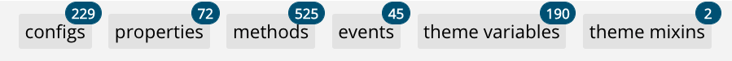
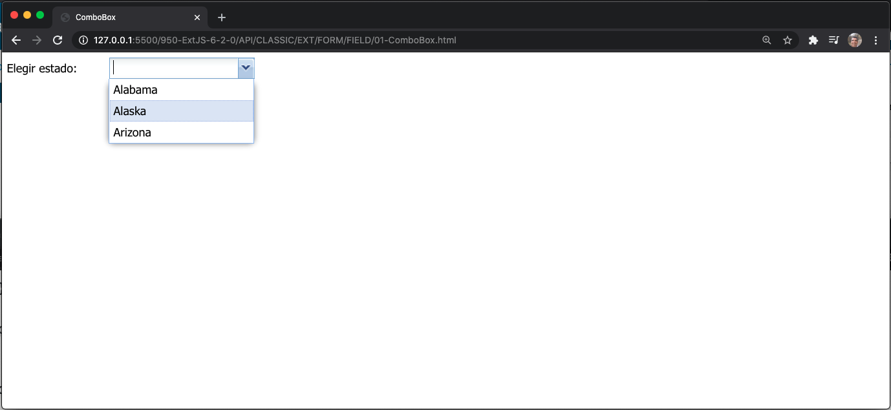
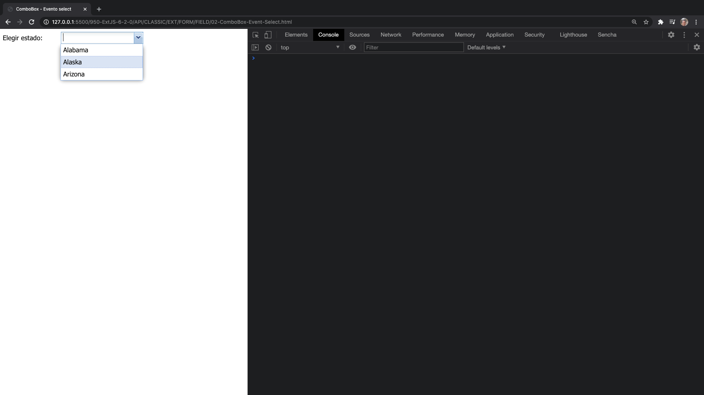
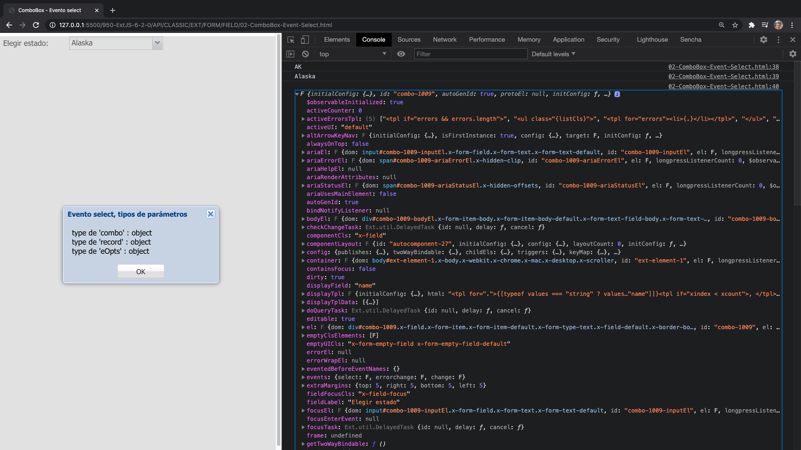
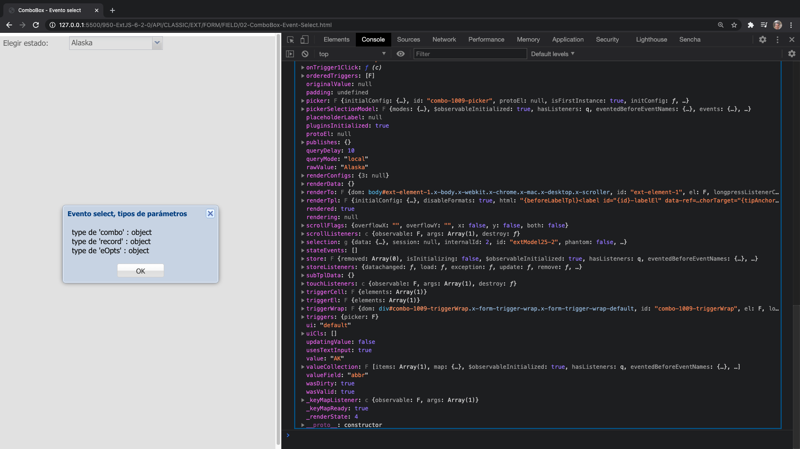
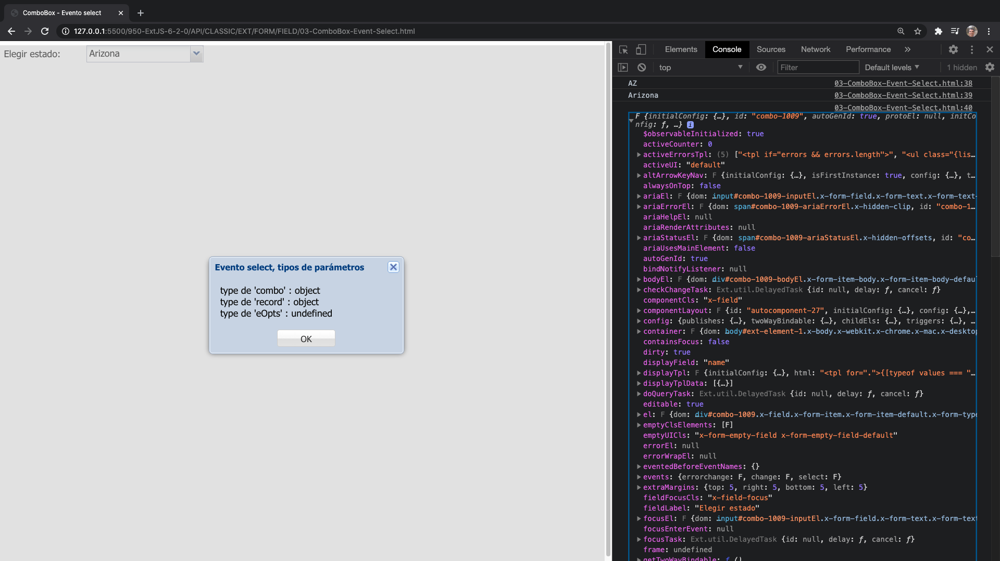

# `Ext.form.field.ComboBox`



Un control ComboBox con soporte para autocompletar, carga remota y muchas otras características.

Un ComboBox es como una combinación de un campo de texto **`<input>`** HTML tradicional y un campo **`<select>`**; el usuario puede escribir libremente en el campo y/o elegir valores de una lista de selección desplegable. El usuario puede ingresar cualquier valor por defecto, incluso si no aparece en la lista de selección; para evitar valores de forma libre y restringirlos a elementos de la lista, establezca [forceSelection]() en **`true`**.

Las opciones de la lista de selección se completan desde cualquier [Ext.data.Store](), incluidas los stores remotas. Los data items en el store se asignan al texto mostrado de cada opción y al valor de respaldo a través de las configuraciones [valueField]() y [displayField](), respectivamente.

Si su store no es remota, es decir, depende solo de los datos locales y se carga por adelantado, debe asegurarse de establecer [queryMode]() en **`'local'`**, ya que esto mejorará la capacidad de respuesta del usuario.

## Ejemplo:

```js
// The data store containing the list of states
var states = Ext.create('Ext.data.Store', {
    fields: ['abbr', 'name'],
    data : [
        {"abbr":"AL", "name":"Alabama"},
        {"abbr":"AK", "name":"Alaska"},
        {"abbr":"AZ", "name":"Arizona"}
    ]
});

// Create the combo box, attached to the states data store
Ext.create('Ext.form.ComboBox', {
    fieldLabel: 'Choose State',
    store: states,
    queryMode: 'local',
    displayField: 'name',
    valueField: 'abbr',
    renderTo: Ext.getBody()
});
```


### 🔴 ComboBox `01-ComboBox.html`

http://127.0.0.1:5500/950-ExtJS-6-2-0/API/CLASSIC/EXT/FORM/FIELD/01-ComboBox.html

`01-ComboBox.html`

```html
<!DOCTYPE html>
<html>
   <head>
    <title>ComboBox</title>
    <meta name="viewport" content="width=device-width, initial-scale=1, maximum-scale=1, user-scalable=no"> 
      <link href = "https://cdnjs.cloudflare.com/ajax/libs/extjs/6.2.0/classic/theme-classic/resources/theme-classic-all.css" 
         rel = "stylesheet" />
      <script type = "text/javascript" 
         src = "https://cdnjs.cloudflare.com/ajax/libs/extjs/6.2.0/ext-all.js"></script>
      
      <script type = "text/javascript">
         Ext.onReady(function() {
            // El data store que contiene la lista de estados
            var states = Ext.create('Ext.data.Store', {
                fields: ['abbr', 'name'],
                data : [
                    {"abbr":"AL", "name":"Alabama"},
                    {"abbr":"AK", "name":"Alaska"},
                    {"abbr":"AZ", "name":"Arizona"}
                ]
            });

            // Crear el combo box, attached al data store de los estados
            Ext.create('Ext.form.ComboBox', {
                fieldLabel: 'Elegir estado',
                store: states,
                queryMode: 'local',
                displayField: 'name',
                valueField: 'abbr',
                padding:'5px',
                renderTo: Ext.getBody()
            });
         });
      </script>
   </head>
   
   <body></body>
</html>
```




## Eventos

Para hacer algo cuando se selecciona algo en ComboBox, configure el evento de selección:

```js
var cb = Ext.create('Ext.form.ComboBox', {
    // all of your config options
    listeners:{
         scope: yourScope,
         'select': yourFunction
    }
});

// Alternatively, you can assign events after the object is created:
var cb = new Ext.form.field.ComboBox(yourOptions);
cb.on('select', yourFunction, yourScope);
```

### 🔴 ComboBox - Events select `02-ComboBox-Event-Select.html`

http://127.0.0.1:5500/950-ExtJS-6-2-0/API/CLASSIC/EXT/FORM/FIELD/02-ComboBox-Event-Select.html

`02-ComboBox-Event-Select.html`

```html
<!DOCTYPE html>
<html>
   <head>
    <title>ComboBox - Evento select</title>
    <meta name="viewport" content="width=device-width, initial-scale=1, maximum-scale=1, user-scalable=no"> 
      <link href = "https://cdnjs.cloudflare.com/ajax/libs/extjs/6.2.0/classic/theme-classic/resources/theme-classic-all.css" 
         rel = "stylesheet" />
      <script type = "text/javascript" 
         src = "https://cdnjs.cloudflare.com/ajax/libs/extjs/6.2.0/ext-all.js"></script>
      
      <script type = "text/javascript">
         Ext.onReady(function() {
            // El data store que contiene la lista de estados
            var states = Ext.create('Ext.data.Store', {
                fields: ['abbr', 'name'],
                data : [
                    {"abbr":"AL", "name":"Alabama"},
                    {"abbr":"AK", "name":"Alaska"},
                    {"abbr":"AZ", "name":"Arizona"}
                ]
            });

            // Crear el combo box, attached al data store de los estados
            Ext.create('Ext.form.ComboBox', {
               fieldLabel: 'Elegir estado',
               store: states,
               queryMode: 'local',
               displayField: 'name',
               valueField: 'abbr',
               padding:'5px',
               renderTo: Ext.getBody(),
               listeners: {
                  select: function ( combo, record, eOpts ) {
                     var msgBody = "type de 'combo' : " + typeof(combo) + "</br>";
                        msgBody += "type de 'record' : " + typeof(record) + "</br>";
                        msgBody += "type de 'eOpts' : " + typeof(eOpts);
                     Ext.Msg.alert('Evento select, tipos de parámetros', msgBody);
                     console.log(combo.value);
                     console.log(combo.rawValue);
                     console.log(combo);
                  }
               }
            });
         });
      </script>
   </head>
   
   <body></body>
</html>
```





### 🔴 ComboBox - Events select - Declarado a posteriory `03-ComboBox-Event-Select.html`

http://127.0.0.1:5500/950-ExtJS-6-2-0/API/CLASSIC/EXT/FORM/FIELD/03-ComboBox-Event-Select.html

`03-ComboBox-Event-Select.html`

```html
<!DOCTYPE html>
<html>
   <head>
    <title>ComboBox - Evento select</title>
    <meta name="viewport" content="width=device-width, initial-scale=1, maximum-scale=1, user-scalable=no"> 
      <link href = "https://cdnjs.cloudflare.com/ajax/libs/extjs/6.2.0/classic/theme-classic/resources/theme-classic-all.css" 
         rel = "stylesheet" />
      <script type = "text/javascript" 
         src = "https://cdnjs.cloudflare.com/ajax/libs/extjs/6.2.0/ext-all.js"></script>
      
      <script type = "text/javascript">
         Ext.onReady(function() {
            // El data store que contiene la lista de estados
            var states = Ext.create('Ext.data.Store', {
                fields: ['abbr', 'name'],
                data : [
                    {"abbr":"AL", "name":"Alabama"},
                    {"abbr":"AK", "name":"Alaska"},
                    {"abbr":"AZ", "name":"Arizona"}
                ]
            });

            // Crear el combo box, attached al data store de los estados
            var cb = new Ext.create('Ext.form.ComboBox', {
               fieldLabel: 'Elegir estado',
               store: states,
               queryMode: 'local',
               displayField: 'name',
               valueField: 'abbr',
               padding:'5px',
               renderTo: Ext.getBody()
            });
            cb.on('select', function ( combo, record, eOpts ) {
               var msgBody = "type de 'combo' : " + typeof(combo) + "</br>";
                  msgBody += "type de 'record' : " + typeof(record) + "</br>";
                  msgBody += "type de 'eOpts' : " + typeof(eOpts);
               Ext.Msg.alert('Evento select, tipos de parámetros', msgBody);
               console.log(combo.value);
               console.log(combo.rawValue);
               console.log(combo);
            });
         });
      </script>
   </head>
   
   <body></body>
</html>
```


