# `Ext.form.field.ComboBox`


Un control ComboBox con soporte para autocompletar, carga remota y muchas otras características.

Un ComboBox es como una combinación de un campo de texto **`<input>`** HTML tradicional y un campo **`<select>`**; el usuario puede escribir libremente en el campo y/o elegir valores de una lista de selección desplegable. El usuario puede ingresar cualquier valor por defecto, incluso si no aparece en la lista de selección; para evitar valores de forma libre y restringirlos a elementos de la lista, establezca [forceSelection]() en **`true`**.

Las opciones de la lista de selección se completan desde cualquier [Ext.data.Store](), incluidas los stores remotas. Los data items en el store se asignan al texto mostrado de cada opción y al valor de respaldo a través de las configuraciones [valueField]() y [displayField](), respectivamente.

Si su store no es remota, es decir, depende solo de los datos locales y se carga por adelantado, debe asegurarse de establecer [queryMode]() en **`'local'`**, ya que esto mejorará la capacidad de respuesta del usuario.

## Ejemplo:

```js
// The data store containing the list of states
var states = Ext.create('Ext.data.Store', {
    fields: ['abbr', 'name'],
    data : [
        {"abbr":"AL", "name":"Alabama"},
        {"abbr":"AK", "name":"Alaska"},
        {"abbr":"AZ", "name":"Arizona"}
    ]
});

// Create the combo box, attached to the states data store
Ext.create('Ext.form.ComboBox', {
    fieldLabel: 'Choose State',
    store: states,
    queryMode: 'local',
    displayField: 'name',
    valueField: 'abbr',
    renderTo: Ext.getBody()
});
```


### 🔴 ComboBox `01-ComboBox.html`

http://127.0.0.1:5500/950-ExtJS-6-2-0/API/CLASSIC/EXT/FORM/FIELD/01-ComboBox.html

`01-ComboBox.html`

```html
<!DOCTYPE html>
<html>
   <head>
    <title>ComboBox</title>
    <meta name="viewport" content="width=device-width, initial-scale=1, maximum-scale=1, user-scalable=no"> 
      <link href = "https://cdnjs.cloudflare.com/ajax/libs/extjs/6.2.0/classic/theme-classic/resources/theme-classic-all.css" 
         rel = "stylesheet" />
      <script type = "text/javascript" 
         src = "https://cdnjs.cloudflare.com/ajax/libs/extjs/6.2.0/ext-all.js"></script>
      
      <script type = "text/javascript">
         Ext.onReady(function() {
            // El data store que contiene la lista de estados
            var states = Ext.create('Ext.data.Store', {
                fields: ['abbr', 'name'],
                data : [
                    {"abbr":"AL", "name":"Alabama"},
                    {"abbr":"AK", "name":"Alaska"},
                    {"abbr":"AZ", "name":"Arizona"}
                ]
            });

            // Crear el combo box, attached al data store de los estados
            Ext.create('Ext.form.ComboBox', {
                fieldLabel: 'Elegir estado',
                store: states,
                queryMode: 'local',
                displayField: 'name',
                valueField: 'abbr',
                padding:'5px',
                renderTo: Ext.getBody()
            });
         });
      </script>
   </head>
   
   <body></body>
</html>
```


## Eventos

Para hacer algo cuando se selecciona algo en ComboBox, configure el evento de selección:

```js
var cb = Ext.create('Ext.form.ComboBox', {
    // all of your config options
    listeners:{
         scope: yourScope,
         'select': yourFunction
    }
});

// Alternatively, you can assign events after the object is created:
var cb = new Ext.form.field.ComboBox(yourOptions);
cb.on('select', yourFunction, yourScope);
```

### 🔴 ComboBox - Events select `02-ComboBox-Event-Select.html`

http://127.0.0.1:5500/950-ExtJS-6-2-0/API/CLASSIC/EXT/FORM/FIELD/02-ComboBox-Event-Select.html

`02-ComboBox-Event-Select.html`

```html
<!DOCTYPE html>
<html>
   <head>
    <title>ComboBox - Evento select</title>
    <meta name="viewport" content="width=device-width, initial-scale=1, maximum-scale=1, user-scalable=no"> 
      <link href = "https://cdnjs.cloudflare.com/ajax/libs/extjs/6.2.0/classic/theme-classic/resources/theme-classic-all.css" 
         rel = "stylesheet" />
      <script type = "text/javascript" 
         src = "https://cdnjs.cloudflare.com/ajax/libs/extjs/6.2.0/ext-all.js"></script>
      
      <script type = "text/javascript">
         Ext.onReady(function() {
            // El data store que contiene la lista de estados
            var states = Ext.create('Ext.data.Store', {
                fields: ['abbr', 'name'],
                data : [
                    {"abbr":"AL", "name":"Alabama"},
                    {"abbr":"AK", "name":"Alaska"},
                    {"abbr":"AZ", "name":"Arizona"}
                ]
            });

            // Crear el combo box, attached al data store de los estados
            Ext.create('Ext.form.ComboBox', {
               fieldLabel: 'Elegir estado',
               store: states,
               queryMode: 'local',
               displayField: 'name',
               valueField: 'abbr',
               padding:'5px',
               renderTo: Ext.getBody(),
               listeners: {
                  select: function ( combo, record, eOpts ) {
                     var msgBody = "type de 'combo' : " + typeof(combo) + "</br>";
                        msgBody += "type de 'record' : " + typeof(record) + "</br>";
                        msgBody += "type de 'eOpts' : " + typeof(eOpts);
                     Ext.Msg.alert('Evento select, tipos de parámetros', msgBody);
                     console.log(combo.value);
                     console.log(combo.rawValue);
                     console.log(combo);
                  }
               }
            });
         });
      </script>
   </head>
   
   <body></body>
</html>
```


### 🔴 ComboBox - Events select - Declarado a posteriory `03-ComboBox-Event-Select.html`

http://127.0.0.1:5500/950-ExtJS-6-2-0/API/CLASSIC/EXT/FORM/FIELD/03-ComboBox-Event-Select.html

`03-ComboBox-Event-Select.html`

```html
<!DOCTYPE html>
<html>
   <head>
    <title>ComboBox - Evento select</title>
    <meta name="viewport" content="width=device-width, initial-scale=1, maximum-scale=1, user-scalable=no"> 
      <link href = "https://cdnjs.cloudflare.com/ajax/libs/extjs/6.2.0/classic/theme-classic/resources/theme-classic-all.css" 
         rel = "stylesheet" />
      <script type = "text/javascript" 
         src = "https://cdnjs.cloudflare.com/ajax/libs/extjs/6.2.0/ext-all.js"></script>
      
      <script type = "text/javascript">
         Ext.onReady(function() {
            // El data store que contiene la lista de estados
            var states = Ext.create('Ext.data.Store', {
                fields: ['abbr', 'name'],
                data : [
                    {"abbr":"AL", "name":"Alabama"},
                    {"abbr":"AK", "name":"Alaska"},
                    {"abbr":"AZ", "name":"Arizona"}
                ]
            });

            // Crear el combo box, attached al data store de los estados
            var cb = new Ext.create('Ext.form.ComboBox', {
               fieldLabel: 'Elegir estado',
               store: states,
               queryMode: 'local',
               displayField: 'name',
               valueField: 'abbr',
               padding:'5px',
               renderTo: Ext.getBody()
            });
            cb.on('select', function ( combo, record, eOpts ) {
               var msgBody = "type de 'combo' : " + typeof(combo) + "</br>";
                  msgBody += "type de 'record' : " + typeof(record) + "</br>";
                  msgBody += "type de 'eOpts' : " + typeof(eOpts);
               Ext.Msg.alert('Evento select, tipos de parámetros', msgBody);
               console.log(combo.value);
               console.log(combo.rawValue);
               console.log(combo);
            });
         });
      </script>
   </head>
   
   <body></body>
</html>
```


## Multiple Selection

La configuración [multiSelect]() está obsoleta. Para selección múltiple, use [Ext.form.field.Tag]() o [Ext.view.MultiSelector]().

### 🔴 ComboBox - Multiple Selection `04-ComboBox-Multiple.html`

http://127.0.0.1:5500/950-ExtJS-6-2-0/API/CLASSIC/EXT/FORM/FIELD/04-ComboBox-Multiple.html

`04-ComboBox-Multiple.html`

```html
<!DOCTYPE html>
<html>
   <head>
    <title>ComboBox - Multiple Selection</title>
    <meta name="viewport" content="width=device-width, initial-scale=1, maximum-scale=1, user-scalable=no"> 
      <link href = "https://cdnjs.cloudflare.com/ajax/libs/extjs/6.2.0/classic/theme-classic/resources/theme-classic-all.css" 
         rel = "stylesheet" />
      <script type = "text/javascript" 
         src = "https://cdnjs.cloudflare.com/ajax/libs/extjs/6.2.0/ext-all.js"></script>
      
      <script type = "text/javascript">
         Ext.onReady(function() {
            // El data store que contiene la lista de estados
            var states = Ext.create('Ext.data.Store', {
                fields: ['abbr', 'name'],
                data : [
                    {"abbr":"AL", "name":"Alabama"},
                    {"abbr":"AK", "name":"Alaska"},
                    {"abbr":"AZ", "name":"Arizona"}
                ]
            });

            // Crear el combo box, attached al data store de los estados
            Ext.create('Ext.form.ComboBox', {
                fieldLabel: 'Elegir estado',
                store: states,
                queryMode: 'local',
                displayField: 'name',
                valueField: 'abbr',
                padding:'5px',
                width: 400,
                multiSelect: true,
                renderTo: Ext.getBody()
            });
         });
      </script>
   </head>
   
   <body></body>
</html>
```

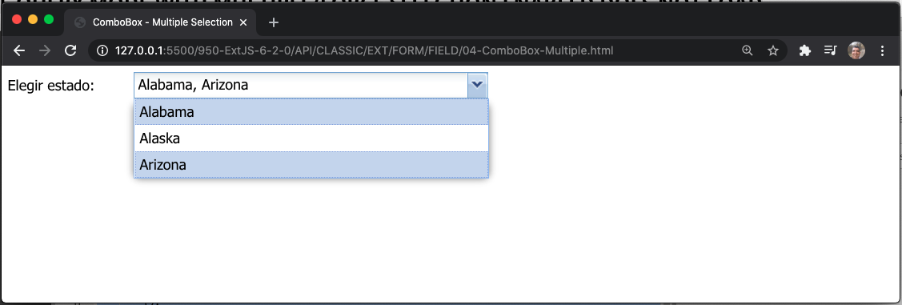

### Filtered Stores

Si tiene un local store que ya está filtrado, puede usar la opción de configuración [lastQuery]() para evitar que el store tenga el filtro borrado en la primera expansión.

## Customized combobox

Tanto el texto que se muestra en el menú desplegable como en el campo de texto se pueden personalizar fácilmente:

```js
var states = Ext.create('Ext.data.Store', {
    fields: ['abbr', 'name'],
    data : [
        {"abbr":"AL", "name":"Alabama"},
        {"abbr":"AK", "name":"Alaska"},
        {"abbr":"AZ", "name":"Arizona"}
    ]
});

Ext.create('Ext.form.ComboBox', {
    fieldLabel: 'Choose State',
    store: states,
    queryMode: 'local',
    valueField: 'abbr',
    renderTo: Ext.getBody(),
    // Template for the dropdown menu.
    // Note the use of the "x-list-plain" and "x-boundlist-item" class,
    // this is required to make the items selectable.
    tpl: Ext.create('Ext.XTemplate',
        '<ul class="x-list-plain"><tpl for=".">',
            '<li role="option" class="x-boundlist-item">{abbr} - {name}</li>',
        '</tpl></ul>'
    ),
    // template for the content inside text field
    displayTpl: Ext.create('Ext.XTemplate',
        '<tpl for=".">',
            '{abbr} - {name}',
        '</tpl>'
    )
});
```

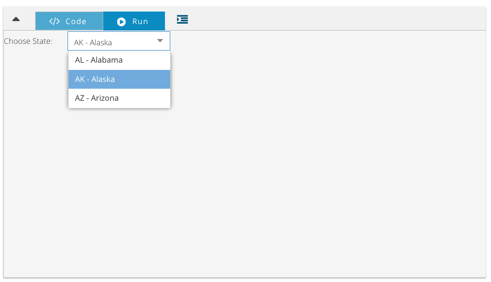

### 🔴 ComboBox - Customized `05-ComboBox-Customized.html`

http://127.0.0.1:5500/950-ExtJS-6-2-0/API/CLASSIC/EXT/FORM/FIELD/05-ComboBox-Customized.html

`05-ComboBox-Customized.html`

```html
<!DOCTYPE html>
<html>
   <head>
    <title>ComboBox - Multiple Selection</title>
    <meta name="viewport" content="width=device-width, initial-scale=1, maximum-scale=1, user-scalable=no"> 
      <link href = "https://cdnjs.cloudflare.com/ajax/libs/extjs/6.2.0/classic/theme-classic/resources/theme-classic-all.css" 
         rel = "stylesheet" />
      <script type = "text/javascript" 
         src = "https://cdnjs.cloudflare.com/ajax/libs/extjs/6.2.0/ext-all.js"></script>
      
      <script type = "text/javascript">
         Ext.onReady(function() {
            // El data store que contiene la lista de estados
            var states = Ext.create('Ext.data.Store', {
                fields: ['abbr', 'name'],
                data : [
                    {"abbr":"AL", "name":"Alabama"},
                    {"abbr":"AK", "name":"Alaska"},
                    {"abbr":"AZ", "name":"Arizona"}
                ]
            });

            // Crear el combo box, attached al data store de los estados
            Ext.create('Ext.form.ComboBox', {
               fieldLabel: 'Elegir estado',
               store: states,
               queryMode: 'local',
               displayField: 'name',
               valueField: 'abbr',
               padding:'5px',
               renderTo: Ext.getBody(),
               // Template para el menú desplegable.
               // Note el uso de las clases "x-list-plain" y "x-boundlist-item",
               // esto es necesario para que los elementos se puedan seleccionar.
               tpl: Ext.create('Ext.XTemplate',
                  '<ul class="x-list-plain">',
                     '<tpl for=".">',
                        '<li role="option" class="x-boundlist-item">{abbr} - {name}</li>',
                     '</tpl>',
                  '</ul>'
               ),
               // template para el contenido dentro del campo de texto
               displayTpl: Ext.create('Ext.XTemplate',
                  '<tpl for=".">',
                     '{abbr} - {name}',
                  '</tpl>'
               )
            });
         });
      </script>
   </head>
   
   <body></body>
</html>
```

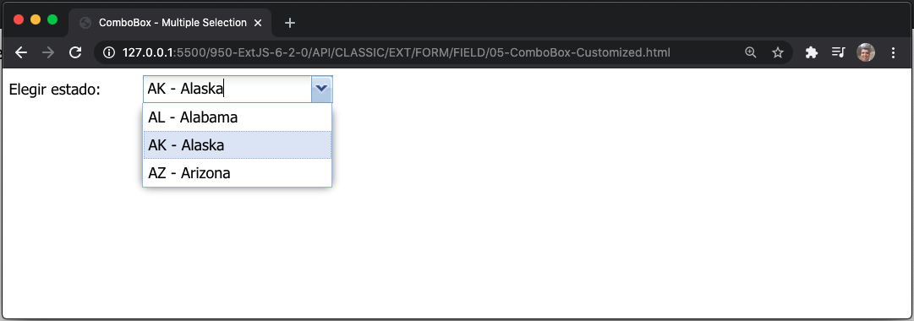

Consulte también la opción [listConfig] para obtener una configuración adicional del menú desplegable.

## METHODS ****


## VARIOS EJEMPLOS de https://fiddle.sencha.com/


### 🔴 COMBOBOX WITH MULTIPLE VALUE IN DISPLAY LISTCONFIG

http://127.0.0.1:5500/950-ExtJS-6-2-0/MISC/COMBOBOX-WITH-MULTIPLE-VALUE-IN-DISPLAY-LISTCONFIG/app.html

`app.html`

```html
<!DOCTYPE html>
<html>
   <head>
    <title>COMBOBOX WITH MULTIPLE VALUE IN DISPLAY LISTCONFIG</title>
    <meta name="viewport" content="width=device-width, initial-scale=1, maximum-scale=1, user-scalable=no"> 
      <link href = "https://cdnjs.cloudflare.com/ajax/libs/extjs/6.2.0/classic/theme-classic/resources/theme-classic-all.css" 
         rel = "stylesheet" />
      <script type = "text/javascript" 
         src = "https://cdnjs.cloudflare.com/ajax/libs/extjs/6.2.0/ext-all.js"></script>
      
      <script type = "text/javascript">
         Ext.onReady(function() {
            // El data store que contiene la lista de estados
            var states = Ext.create('Ext.data.Store', {
                fields: ['abbr', 'name'],
                data : [
                    {"abbr":"AL", "name":"Alabama"},
                    {"abbr":"AK", "name":"Alaska"},
                    {"abbr":"AZ", "name":"Arizona"},
                    {"abbr":"IN", "name":"India"},
                    {"abbr":"JH", "name":"Jharkhand"},
                    {"abbr":"BI", "name":"Bihar"}
                ]
            });

            // Crear el combo box, attached al data store de los estados
            Ext.create('Ext.form.ComboBox', {
                fieldLabel: 'Elegir estado',
                store: states,
                queryMode: 'local',
                displayField: 'name',
                valueField: 'abbr',
                padding:'5px',
                renderTo: Ext.getBody(),
                listConfig: {
                    loadingText: 'Cargando...',
                    emptyText: 'No hay resultados.',
                    getInnerTpl: function() {
                        return '<table width="100%">'+
                                    '<tr>'+
                                        '<td style="vertical-align:top;width:100%">'+
                                        '<span>{abbr} ({name}) </span>'+
                                        '</td>'+
                                    '</tr>'+
                                '</table>';
                    }
                }
            });
         });
      </script>
   </head>
   
   <body></body>
</html>
```

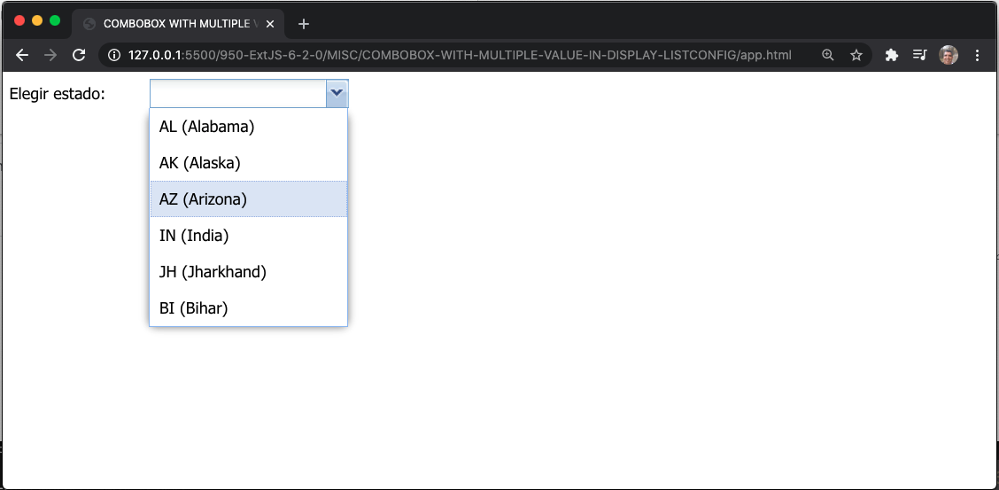
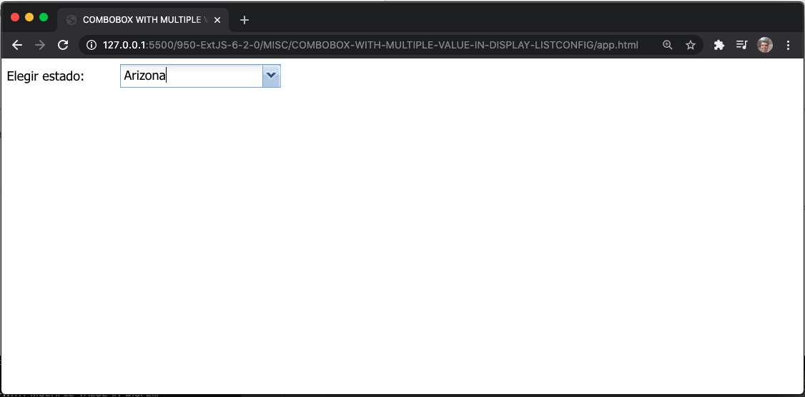


### 🔴 COMBOBOX ON REMOTE QUERY MODE WITH MULTIPLE/FORCE SELECTION ENABLED DOES NOT LOAD

https://fiddle.sencha.com/#view/editor&fiddle/1rs5

http://127.0.0.1:5500/950-ExtJS-6-2-0/MISC/COMBOBOX-ON-REMOTE-QUERY-MODE-WITH-MULTIPLE-FORCE-SELECTION-ENABLED-DOES-NOT-LOAD/app.html

`app.html`

```html
<!DOCTYPE html>
<html>
   <head>
    <title>COMBOBOX WITH MULTIPLE VALUE IN DISPLAY LISTCONFIG</title>
    <meta name="viewport" content="width=device-width, initial-scale=1, maximum-scale=1, user-scalable=no"> 
      <link href = "https://cdnjs.cloudflare.com/ajax/libs/extjs/6.2.0/classic/theme-classic/resources/theme-classic-all.css" 
         rel = "stylesheet" />
      <script type = "text/javascript" 
         src = "https://cdnjs.cloudflare.com/ajax/libs/extjs/6.2.0/ext-all.js"></script>
      
      <script type = "text/javascript">
         Ext.onReady(function() {
            Ext.define('StateModel', {
                  extend: 'Ext.data.Model',
                  fields: ['id', 'abbr', 'state', 'description', 'country']
            });

            var store = Ext.create('Ext.data.Store', {
                  model: 'StateModel',
                  proxy: {
                     type: 'ajax',
                     url: 'states.json',
                     reader: {
                           type: 'array',
                           root: 'data'
                     }
                  }
            });
            store.load();

            // Crear el combo box, attached al data store de los estados
            Ext.create('Ext.form.ComboBox', {
                fieldLabel: 'Seleccionar varios estados',
                store: store,
                value: ['AL', 'AK', 'AR'],
                queryMode: 'remote',
                displayField: 'state',
                valueField: 'abbr',
                width: 500,
                labelWidth: 130,
                padding:'5px',
                multiSelect: true,
                forceSelection: true,
                renderTo: Ext.getBody(),
            });
         });
      </script>
   </head>
   
   <body>
    <h1>Ejemplo de ExtJs: Modo de Consulta Remota</h1>
    <div>
        En este ejemplo, los estados (Alabama, Alaska, Arkansas) deben seleccionarse cuando se carga la lista del cuadro combinado.
    </div>
    <br>
    <div id="example-combobox"></div>

   </body>
</html>
```

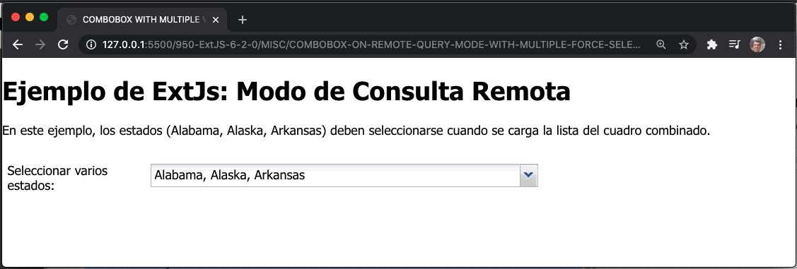
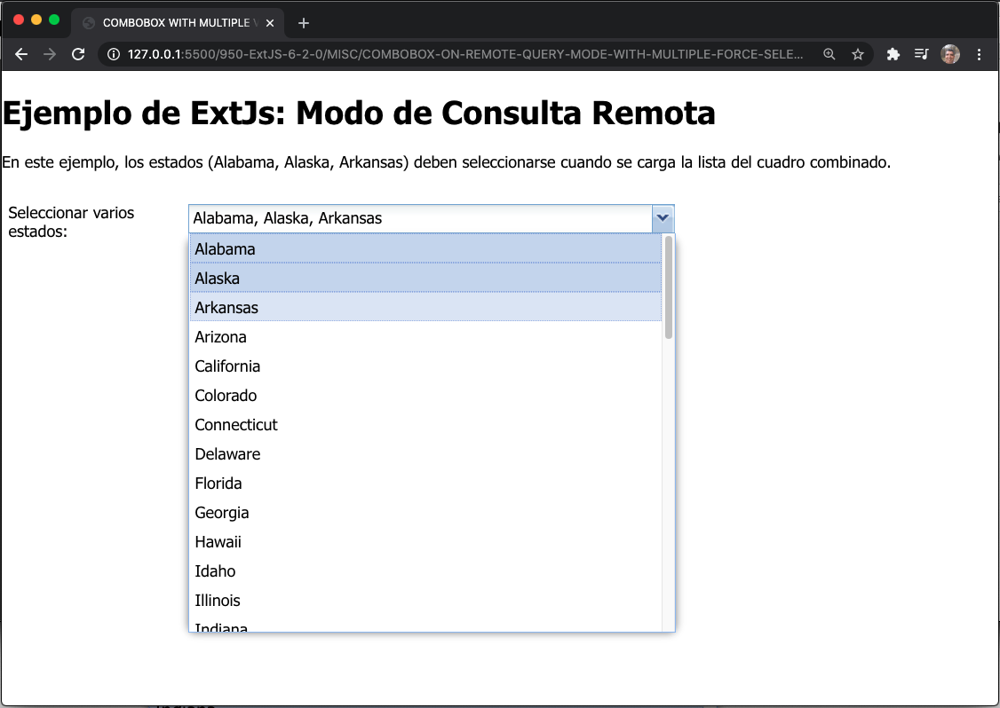
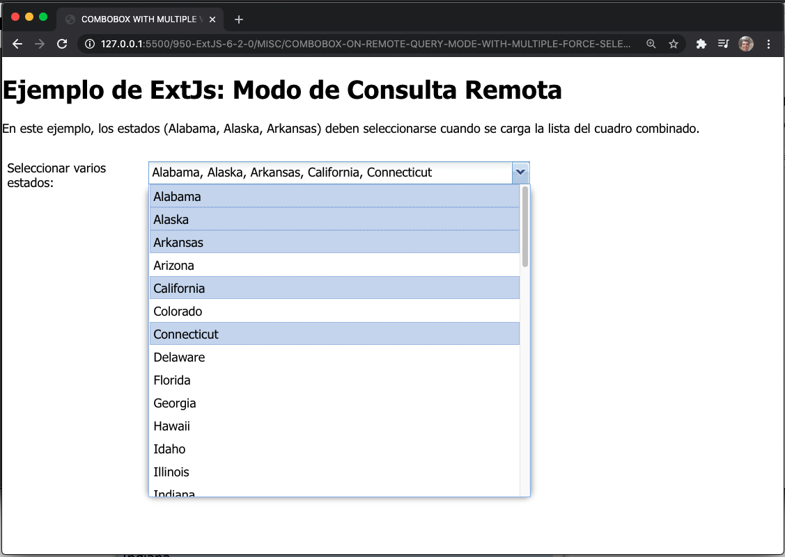


### 🔴 EXAMPLES OF SELECTION WITH COMBOBOX AND MULTISELECT

http://127.0.0.1:5500/950-ExtJS-6-2-0/MISC/EXAMPLES-OF-SELECTION-WITH-COMBOBOX-AND-MULTISELECT/app.html

`app.html`

```html
<!DOCTYPE html>
<html>
    <head>
        <!-- https://fiddle.sencha.com/#view/editor&fiddle/2t74 -->
        <title>EXAMPLES OF SELECTION WITH COMBOBOX AND MULTISELECT</title>
        <meta name="viewport" content="width=device-width, initial-scale=1, maximum-scale=1, user-scalable=no"> 
        <link href = "https://cdnjs.cloudflare.com/ajax/libs/extjs/6.2.0/classic/theme-classic/resources/theme-classic-all.css" 
            rel = "stylesheet" />
        <script type = "text/javascript" 
            src = "https://cdnjs.cloudflare.com/ajax/libs/extjs/6.2.0/ext-all.js"></script>
      
        <script type = "text/javascript">
            Ext.application({
                name: 'Fiddle',

                launch: function() {
                    var store = Ext.create('Ext.data.Store', {
                        fields: ['dataDictId', 'name'],
                        data: [{
                            'dataDictId': 'ab509a22-4ac1-4b7b-9038-b26cdc4621b0',
                            "name": "Carpeta: String"
                        }, {
                            "dataDictId": "c9815448-86dc-46fa-860a-8d1a0300d202",
                            'name': 'Estadísticas del paciente en reposo: Peso'
                        }, {
                            "dataDictId": "16d73de6-7f47-4c27-92e6-88f8c5f9907e",
                            'name': 'Estadísticas del paciente en reposo: Altura'
                        }, {
                            "dataDictId": "996d4da2-c65c-4909-9068-488ca34bb5e8",
                            'name': 'Estadísticas del paciente en ejercicio: Peso'
                        }, {
                            "dataDictId": "56a958f1-6f16-4ffd-8a3d-5ef257b6a474",
                            'name': 'Ejercicio de estadísticas del paciente: Altura'
                        }, {
                            "dataDictId": "624999c4-b9f4-4092-9542-a2c7f9e85e22",
                            'name': 'Índice de masa corporal en reposo'
                        }, {
                            "dataDictId": "3def9d61-6d49-4ba2-9d6d-780bf73a889a",
                            'name': 'Ejercicio de índice de masa corporal'
                        }]
                    });
                    Ext.create('Ext.form.Panel', {
                        bodyPadding: 10,
                        layout: 'anchor',
                        title: 'Ejemplos de selección',
                        defaults: {
                            anchor: '100%',
                            labelWidth: 125,
                            editable: true,
                            forceSelection: false,
                        },
                        items: [{
                            xtype: 'combobox',
                            name: 'ComboSingle',
                            fieldLabel: 'Campo calculado',
                            store: store,
                            displayField: 'name',
                            valueField: 'dataDictId',
                            minChars: 2
                        }, {
                            xtype: 'fieldcontainer',
                            margin: '0 0 20 0',
                            layout: {
                                type: 'hbox',
                                pack: 'end'
                            },
                            items: [{
                                xtype: 'button',
                                text: 'Obtenga Valor',
                                handler: function (btn) {
                                    Ext.Msg.alert("Valor del dato seleccionado", btn.up('fieldcontainer').prev().getValue());
                                }
                            }]
                        }],
                        width: 400,
                        height: 500,
                        renderTo: Ext.getBody()
                    });
                }
            });
        </script>
    </head>   
    <body></body>
</html>
```


<hr>

En este ejemplo se usa el el método **`up`** del botón que se describe a continuación:

**`up( [selector], [limit] ) : Ext.Container`** 

Recorre la jerarquía de propiedad en busca de un componente ancestro que coincida con el selector simple pasado.

Exemplo:

```js
var owningTabPanel = grid.up('tabpanel');
```

PARAMETROS

* selector: **`String (opcional)`**

   El selector simple para probar.

* limit: **`String/Number/Ext.Component (opcional)`**

   Este puede ser un selector en el que detener el escaneo ascendente, o un límite del número de pasos, o una referencia de componente para detener.

RETURNS: **`Ext.Container`**

   El contenedor del antepasado coincidente (o **`undefined`** si no se encontró ninguna coincidencia).


Tambien usamos el método `prev()` de **`Ext.dom.Element`**

**`prev ( [selector], [returnDom] ) : Ext.dom.Element/HTMLElement`**

Obtiene el sibling previo, omitiendo nodos de texto

PARAMETROS

* **`selector :  String (optional)`**

   Busque el sibling previo que coincida con el selector simple pasado. Consulte **`Ext.dom.Query`** para obtener información sobre selectores simples.

* **`returnDom :  Boolean (optional)`**

   **`true`** para devolver un nodo DOM sin formato en lugar de un **`Ext.dom.Element`**

Defaults to: false

RETURNS : **`Ext.dom.Element/HTMLElement`**

El sibling previo (**`Ext.dom.Element`** o HTMLElement si ***`returnDom`*** es **`true`**). O **`null`** si no se encuentra ninguna coincidencia.
<hr>

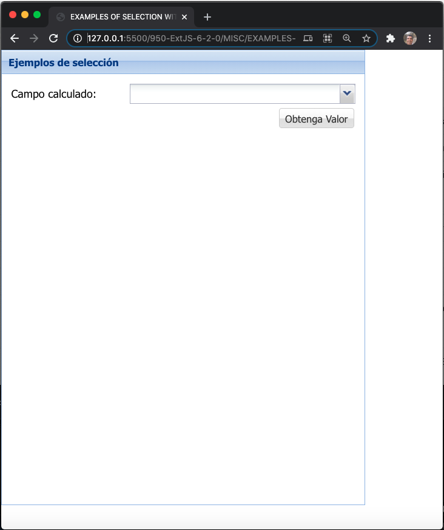
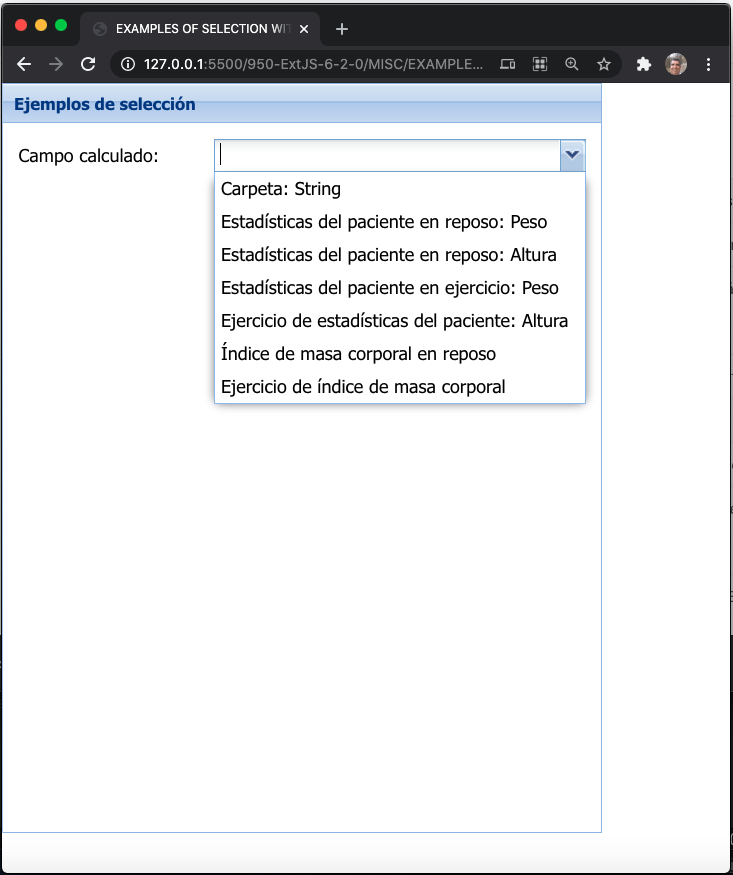
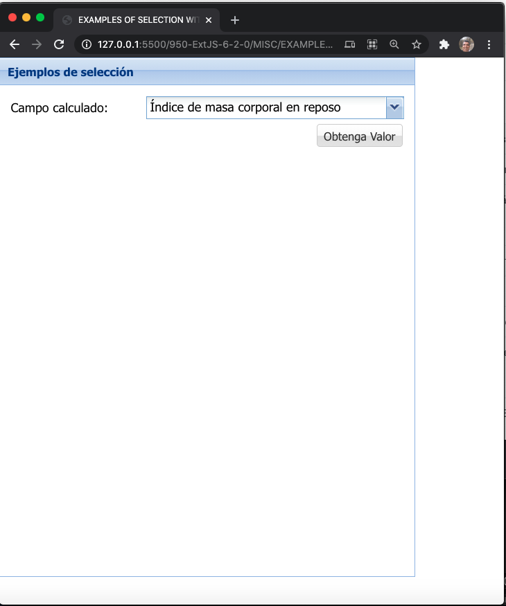
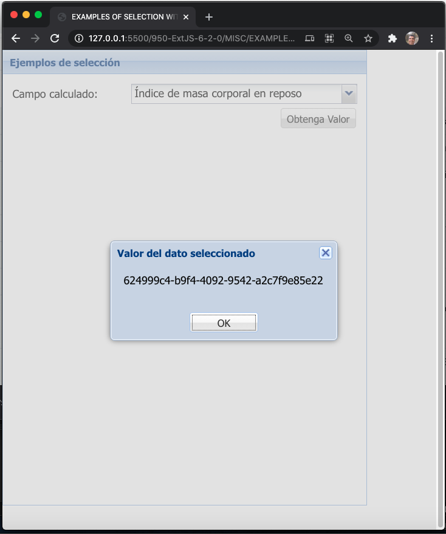

### 🔴 MULTIPLE COMBOBOX LIST (https://fiddle.sencha.com/#view/editor&fiddle/1tf1)
